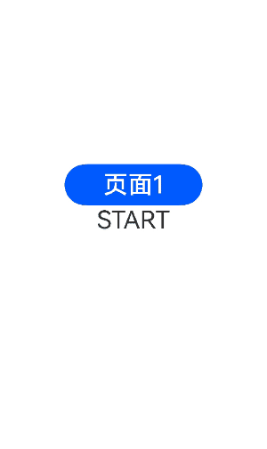
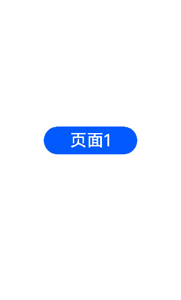

# 页面间转场 (pageTransition)
<!--Kit: ArkUI-->
<!--Subsystem: ArkUI-->
<!--Owner: @CCFFWW-->
<!--Designer: @yangfan229-->
<!--Tester: @lxl007-->
<!--Adviser: @HelloCrease-->

当路由([router](../js-apis-router.md))进行切换时，可以通过在pageTransition函数中自定义页面入场和页面退场的转场动效。详细指导请参考[页面转场动画](../../../ui/arkts-page-transition-animation.md)。

> **说明：**
>
> 从API version 7开始支持。后续版本如有新增内容，则采用上角标单独标记该内容的起始版本。
>
> 为了实现更好的转场效果，推荐使用[Navigation组件](../../../ui/arkts-navigation-navigation.md)和[模态转场](../../../ui/arkts-modal-transition.md)。

## pageTransition<sup>9+</sup>

pageTransition?(): void

进入此页面或移动到其他页面时实现动画。

**原子化服务API：** 从API version 11开始，该接口支持在原子化服务中使用。

**系统能力：** SystemCapability.ArkUI.ArkUI.Full

## PageTransitionEnter

PageTransitionEnter(value: PageTransitionOptions)

设置当前页面的自定义入场动效。继承自[CommonTransition](#commontransition)。

**原子化服务API：** 从API version 11开始，该接口支持在原子化服务中使用。

**系统能力：** SystemCapability.ArkUI.ArkUI.Full

**参数：** 

| 参数名 | 类型                                                   | 必填 | 说明                 |
| ------ | ------------------------------------------------------ | ---- | -------------------- |
| value  | [PageTransitionOptions](#pagetransitionoptions对象说明) | 是   | 配置入场动效的参数。 |

### onEnter

onEnter(event: PageTransitionCallback): PageTransitionEnterInterface

逐帧回调，直到入场动画结束，progress从0变化到1。

**原子化服务API：** 从API version 11开始，该接口支持在原子化服务中使用。

**系统能力：** SystemCapability.ArkUI.ArkUI.Full

**参数：**

| 参数名 | 类型                                                               | 必填 | 说明                                                |
| ------ | ----------------------------------------------------------------- | ---- | ------------------------------------------------    |
| event  | [PageTransitionCallback](#pagetransitioncallback18) | 是   | 入场动画的逐帧回调直到入场动画结束，progress从0变化到1。 |

**示例：**

```js
  pageTransition() {
    PageTransitionEnter({ duration: 1200, curve: Curve.Linear })
      // 转场动画时入场动画 type 为路由类型 ，progress为从0到1逐渐变大
      .onEnter((type: RouteType, progress: number) => {
        // 业务逻辑代码
      })
  }
```

## PageTransitionExit

PageTransitionExit(value: PageTransitionOptions)

设置当前页面的自定义退场动效。继承自[CommonTransition](#commontransition)

**原子化服务API：** 从API version 11开始，该接口支持在原子化服务中使用。

**系统能力：** SystemCapability.ArkUI.ArkUI.Full

**参数：** 

| 参数名 | 类型                                                    | 必填 | 说明                 |
| ------ | ------------------------------------------------------- | ---- | -------------------- |
| value  | [PageTransitionOptions](#pagetransitionoptions对象说明) | 是   | 配置退场动效的参数。 |

### onExit

onExit(event: PageTransitionCallback): PageTransitionExitInterface

逐帧回调，直到出场动画结束，progress从0变化到1。

**系统能力：** SystemCapability.ArkUI.ArkUI.Full

**原子化服务API：** 从API version 11开始，该接口支持在原子化服务中使用。

**参数：**

| 参数名 | 类型                                                               | 必填 | 说明                                                |
| ------ | ----------------------------------------------------------------- | ---- | ------------------------------------------------    |
| event  | [PageTransitionCallback](#pagetransitioncallback18) | 是   | 出场动画的逐帧回调直到出场动画结束，progress从0变化到1。 |

**示例：**

```js
  pageTransition() {
    PageTransitionExit({ duration: 1200, curve: Curve.Linear })
      // 转场动画时出场动画 type 为路由类型 ，progress为从0到1逐渐变大
      .onExit((type: RouteType, progress: number) => {
        // 业务逻辑代码
      })
  }
```

## PageTransitionOptions对象说明

**原子化服务API：** 从API version 11开始，该接口支持在原子化服务中使用。

**系统能力：** SystemCapability.ArkUI.ArkUI.Full

| 名称     | 类型                                                         | 只读 | 可选 | 说明                                                         |
| -------- | ------------------------------------------------------------ | ---- | ---- | ------------------------------------------------------------ |
| type     | [RouteType](#routetype枚举说明)                              | 否   | 是   | 页面转场效果生效的路由类型。<br/>默认值：RouteType.None。    |
| duration | number                                                       | 否   | 是   | 动画的时长。<br/>单位：毫秒<br/>默认值：1000<br/>取值范围：[0, +∞)                 |
| curve    | [Curve](ts-appendix-enums.md#curve)&nbsp;\|&nbsp;string&nbsp;\|&nbsp;[ICurve](../js-apis-curve.md#icurve9)<sup>10+</sup> | 否   | 是   | 动画曲线。<br/>推荐以Curve或ICurve形式指定。<br/>当类型为string时，为动画插值曲线，取值参考[AnimateParam](./ts-explicit-animation.md#animateparam对象说明)的curve参数。<br/>默认值：Curve.Linear |
| delay    | number                                                       | 否   | 是   | 动画延迟时长。<br/>单位：毫秒<br/>默认值：0<br/>**说明：** <br/>没有匹配时使用系统默认的页面转场效果(根据设备可能会有差异)，如需禁用系统默认页面转场效果，可以指定duration为0。 |

## CommonTransition

页面转场通用动效。

**原子化服务API：** 从API version 11开始，该接口支持在原子化服务中使用。

**系统能力：** SystemCapability.ArkUI.ArkUI.Full

### constructor

constructor()

转场通用动效的构造函数。

**原子化服务API：** 从API version 11开始，该接口支持在原子化服务中使用。

**系统能力：** SystemCapability.ArkUI.ArkUI.Full

### slide

slide(value: SlideEffect): T

设置页面转场时的滑入滑出效果。

**原子化服务API：** 从API version 11开始，该接口支持在原子化服务中使用。

**系统能力：** SystemCapability.ArkUI.ArkUI.Full

**参数：** 

| 参数名  | 类型                                                         | 必填 | 说明                                                         |
| ------- | ------------------------------------------------------------ | ---- | ------------------------------------------------------------ |
| value   | [SlideEffect](#slideeffect枚举说明) | 是   | 页面转场时的滑入滑出效果。 |

### translate

translate(value: TranslateOptions): T

设置页面转场时的平移效果。

**原子化服务API：** 从API version 11开始，该接口支持在原子化服务中使用。

**系统能力：** SystemCapability.ArkUI.ArkUI.Full

**参数：** 

| 参数名 | 类型                                                         | 必填 | 说明                                                         |
| ------ | ------------------------------------------------------------ | ---- | ------------------------------------------------------------ |
| value  | [TranslateOptions](ts-universal-attributes-transformation.md#translateoptions对象说明) | 是   | 设置页面转场时的平移效果，为入场时起点和退场时终点的值，和slide同时设置时默认生效slide。<br/>-&nbsp;x：横向的平移距离。<br/>-&nbsp;y：纵向的平移距离。<br/>-&nbsp;z：竖向的平移距离。 |

### scale

scale(value: ScaleOptions): T

设置页面转场时的缩放效果。

**原子化服务API：** 从API version 11开始，该接口支持在原子化服务中使用。

**系统能力：** SystemCapability.ArkUI.ArkUI.Full

**参数：** 

| 参数名 | 类型                                                         | 必填 | 说明                                                         |
| ------ | ------------------------------------------------------------ | ---- | ------------------------------------------------------------ |
| value  | [ScaleOptions](ts-universal-attributes-transformation.md#scaleoptions对象说明) | 是   | 设置页面转场时的缩放效果，为入场时起点和退场时终点的值。<br/>-&nbsp;x：横向放大倍数（或缩小比例）。<br/>-&nbsp;y：纵向放大倍数（或缩小比例）。<br/>-&nbsp;z：竖向放大倍数（或缩小比例）。<br/>-&nbsp;centerX、centerY缩放中心点。centerX和centerY默认值是"50%"，即默认以页面的中心点为旋转中心点。<br/>-&nbsp;中心点为(0, 0)代表页面的左上角。 |

### opacity

opacity(value: number): T

设置入场的起点透明度值或者退场的终点透明度值。

**原子化服务API：** 从API version 11开始，该接口支持在原子化服务中使用。

**系统能力：** SystemCapability.ArkUI.ArkUI.Full

**参数：** 

| 参数名  | 类型                                                         | 必填 | 说明                                                         |
| ------- | ------------------------------------------------------------ | ---- | ------------------------------------------------------------ |
| value   | number | 是   | 设置入场的起点透明度值或者退场的终点透明度值。<br/>取值范围：[0, 1] |

## PageTransitionCallback<sup>18+</sup>

type PageTransitionCallback = (type: RouteType, progress: number) => void

页面转场事件回调。

**原子化服务API：** 从API version 18开始，该接口支持在原子化服务中使用。

**系统能力：** SystemCapability.ArkUI.ArkUI.Full

| 参数名  | 类型    | 必填 | 说明              |
| ------ | ------ | ---- | ---------------- |
| type | [RouteType](#routetype枚举说明) | 是 |  页面转场类型。 |
| progress | number | 是 | 转场进度。progress从0变化到1。 |

 ## RouteType枚举说明

**系统能力：** SystemCapability.ArkUI.ArkUI.Full

**原子化服务API：** 从API version 11开始，该接口支持在原子化服务中使用。


| 名称 | 说明                                                         |
| ---- | ------------------------------------------------------------ |
| Pop  | 重定向指定页面。从PageB回退到之前的页面PageA。对于PageB，指定RouteType为None或者Pop的PageTransitionExit组件样式生效，对于PageA，指定RouteType为None或者Pop的PageTransitionEnter组件样式生效。 |
| Push | 跳转到下一页面。PageA跳转到下一个新的界面PageB。对于PageA，指定RouteType为None或者Push的PageTransitionExit组件样式生效，对于PageB，指定RouteType为None或者Push的PageTransitionEnter组件样式生效。 |
| None | 页面未重定向。如Push和Pop描述中RouteType为None的情形，即页面进场时PageTransitionEnter的转场效果生效；退场时PageTransitionExit的转场效果生效。 |

## SlideEffect枚举说明

**原子化服务API：** 从API version 11开始，该接口支持在原子化服务中使用。

**系统能力：** SystemCapability.ArkUI.ArkUI.Full

| 名称                | 说明                                                         |
| ------------------- | ------------------------------------------------------------ |
| Left                | 设置到入场时表示从左边滑入，出场时表示滑出到左边。<br />**原子化服务API：** 从API version 11开始，该接口支持在原子化服务中使用。 |
| Right               | 设置到入场时表示从右边滑入，出场时表示滑出到右边。<br />**原子化服务API：** 从API version 11开始，该接口支持在原子化服务中使用。 |
| Top                 | 设置到入场时表示从上边滑入，出场时表示滑出到上边。<br />**原子化服务API：** 从API version 11开始，该接口支持在原子化服务中使用。 |
| Bottom              | 设置到入场时表示从下边滑入，出场时表示滑出到下边。<br />**原子化服务API：** 从API version 11开始，该接口支持在原子化服务中使用。 |
| START<sup>12+</sup> | 设置LTR入场时表示从左边滑入，出场时表示滑出到左边。RTL入场时表示从右边滑入，出场时表示滑出到右边。<br />**原子化服务API：** 从API version 12开始，该接口支持在原子化服务中使用。 |
| END<sup>12+</sup>   | 设置LTR入场时表示从右边滑入，出场时表示滑出到右边。RTL入场时表示从左边滑入，出场时表示滑出到左边。<br />**原子化服务API：** 从API version 12开始，该接口支持在原子化服务中使用。 |

## 示例

### 示例1（设置退入场动画）

自定义方式1：通过不同的退入场类型配置不同的退场，入场动画。

```ts
// Index.ets
@Entry
@Component
struct Index {
  @State scale1: number = 1;
  @State opacity1: number = 1;

  build() {
    Column() {
      // $r("app.media.transition_image1")需要替换为开发者所需的图像资源文件。
      Image($r("app.media.transition_image1")).width('100%').height('100%')
    }
    .width('100%')
    .height('100%')
    .scale({ x: this.scale1 })
    .opacity(this.opacity1)
    .onClick(() => {
      this.getUIContext().getRouter().pushUrl({ url: 'pages/Page1' });
    })
  }

  pageTransition() {
    PageTransitionEnter({ duration: 1200, curve: Curve.Linear })
      .onEnter((type: RouteType, progress: number) => {
        if (type == RouteType.Push || type == RouteType.Pop) {
          this.scale1 = progress;
          this.opacity1 = progress;
        }
      })
    PageTransitionExit({ duration: 1200, curve: Curve.Ease })
      .onExit((type: RouteType, progress: number) => {
        if (type == RouteType.Push) {
          this.scale1 = 1 - progress;
          this.opacity1 = 1 - progress;
        }
      })
  }
}
```

```ts
// Page1.ets
@Entry
@Component
struct Page1 {
  @State scale2: number = 1;
  @State opacity2: number = 1;

  build() {
    Column() {
      // $r("app.media.transition_image2")需要替换为开发者所需的图像资源文件。
      Image($r("app.media.transition_image2")).width('100%').height('100%') // 图片存放在media文件夹下
    }
    .width('100%')
    .height('100%')
    .scale({ x: this.scale2 })
    .opacity(this.opacity2)
    .onClick(() => {
      this.getUIContext().getRouter().pushUrl({ url: 'pages/Index' });
    })
  }

  pageTransition() {
    PageTransitionEnter({ duration: 1200, curve: Curve.Linear })
      .onEnter((type: RouteType, progress: number) => {
        if (type == RouteType.Push || type == RouteType.Pop) {
          this.scale2 = progress;
        }
        this.opacity2 = progress;
      })
    PageTransitionExit({ duration: 1200, curve: Curve.Ease })
      .onExit((type: RouteType, progress: number) => {
        if (type == RouteType.Pop) {
          this.scale2 = 1 - progress;
          this.opacity2 = 1 - progress;
        }
      })
  }
}
```


自定义方式2：配置了当前页面的入场动画为从左侧滑入，退场为平移加透明度变化。

```ts
// Index.ets 
@Entry
@Component
struct Index {
  build() {
    Column() {
      // $r('app.media.bg1')需要替换为开发者所需的图像资源文件。
      Image($r('app.media.bg1')).width('100%').height('100%') // 图片存放在media文件夹下
    }
    .onClick(() => {
      this.getUIContext().getRouter().pushUrl({ url: 'pages/Page1' });
    })
  }

  // 自定义方式2：使用系统提供的多种默认效果(平移、缩放、透明度等)
  pageTransition() {
    // 该页面进入动画时长为1200ms，尽量与另一页面的退出动画时长匹配
    PageTransitionEnter({ duration: 1200 })
      .slide(SlideEffect.Left)
    // 该页面退出动画时长为1000ms，尽量与另一页面的进入动画时长匹配
    PageTransitionExit({ duration: 1000 })
      .translate({ x: 100.0, y: 100.0 })
      .opacity(0)
  }
}
```

```ts
// Page1.ets
@Entry
@Component
struct Page1 {
  build() {
    Column() {
      // $r('app.media.bg2')需要替换为开发者所需的图像资源文件。
      Image($r('app.media.bg2')).width('100%').height('100%') // 图片存放在media文件夹下
    }
    .onClick(() => {
      this.getUIContext().getRouter().pushUrl({ url: 'pages/Index' });
    })
  }

  // 自定义方式2：使用系统提供的多种默认效果(平移、缩放、透明度等)
  pageTransition() {
    // 该页面进入动画时长为1000ms，尽量与另一页面的退出动画时长匹配
    PageTransitionEnter({ duration: 1000 })
      .slide(SlideEffect.Left)
    // 该页面退出动画时长为1200ms，尽量与另一页面的进入动画时长匹配
    PageTransitionExit({ duration: 1200 })
      .translate({ x: 100.0, y: 100.0 })
      .opacity(0)
  }
}
```


### 示例2（设置退入场平移效果）

自定义方式1：配置提供的不同退入场平移效果，将系统语言排版模式改为RTL。

```ts
// Index.ets
@Entry
@Component
struct Index {
  @State scale1: number = 1;
  @State opacity1: number = 1;

  build() {
    Column() {
      Button("页面1").onClick(() => {
        this.getUIContext().getRouter().pushUrl({
          url: "pages/Page1"
        })
      })
        .width(200)
        .height(60)
        .fontSize(36)
      Text("START")
        .fontSize(36)
        .textAlign(TextAlign.Center)
    }
    .scale({ x: this.scale1 })
    .opacity(this.opacity1)
    .height("100%")
    .width("100%")
    .justifyContent(FlexAlign.Center)
  }

  // 自定义方式2：使用系统提供的多种默认效果(平移、缩放、透明度等)
  pageTransition() {
    //设置入场动效
    PageTransitionEnter({ duration: 200 })
      .slide(SlideEffect.START)
    //设置退场动效
    PageTransitionExit({ delay: 100 })
      .slide(SlideEffect.START) //Left
  }
}
```

```ts
// Page1.ets
@Entry
@Component
struct Page1 {
  @State scale1: number = 1;
  @State opacity1: number = 1;

  build() {
    Column() {
      Button("页面2").onClick(() => {
        this.getUIContext().getRouter().pushUrl({
          url: "pages/Index"
        });
      })
        .width(200)
        .height(60)
        .fontSize(36)
      Text("END")
        .fontSize(36)
        .textAlign(TextAlign.Center)
    }
    .scale({ x: this.scale1 })
    .opacity(this.opacity1)
    .height("100%")
    .width("100%")
    .justifyContent(FlexAlign.Center)
  }

  // 自定义方式2：使用系统提供的多种默认效果(平移、缩放、透明度等)
  pageTransition() {
    PageTransitionEnter({ duration: 200 })
      .slide(SlideEffect.END) //Right
    PageTransitionExit({ delay: 100 })
      .slide(SlideEffect.END) //Right
  }
}

```



自定义方式2：使用系统默认的退入场效果，将系统语言排版模式改为RTL。

```ts
// Index.ets
@Entry
@Component
struct Index {
  @State scale1: number = 1;
  @State opacity1: number = 1;

  build() {
    Column() {
      Button("页面1").onClick(() => {
        this.getUIContext().getRouter().pushUrl({
          url: "pages/Page1"
        });
      })
        .width(200)
        .height(60)
        .fontSize(36)
    }
    .scale({ x: this.scale1 })
    .opacity(this.opacity1)
    .height("100%")
    .width("100%")
    .justifyContent(FlexAlign.Center)
  }
}
```

```ts
// Page1.ets
@Entry
@Component
struct Page1 {
  @State scale1: number = 1;
  @State opacity1: number = 1;

  build() {
    Column() {
      Button("页面2").onClick(() => {
        this.getUIContext().getRouter().pushUrl({
          url: "pages/Index"
        });
      })
        .width(200)
        .height(60)
        .fontSize(36)
    }
    .scale({ x: this.scale1 })
    .opacity(this.opacity1)
    .height("100%")
    .width("100%")
    .justifyContent(FlexAlign.Center)
  }
}
```


