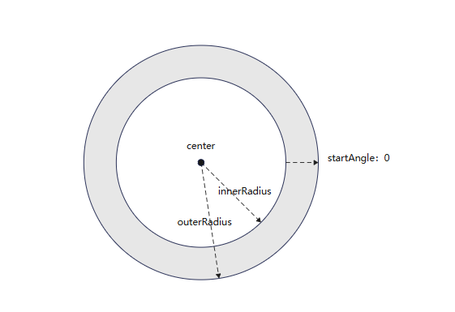
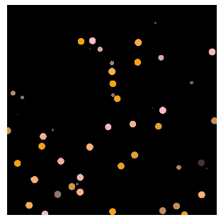
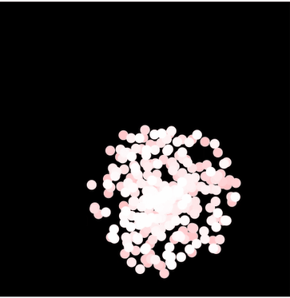
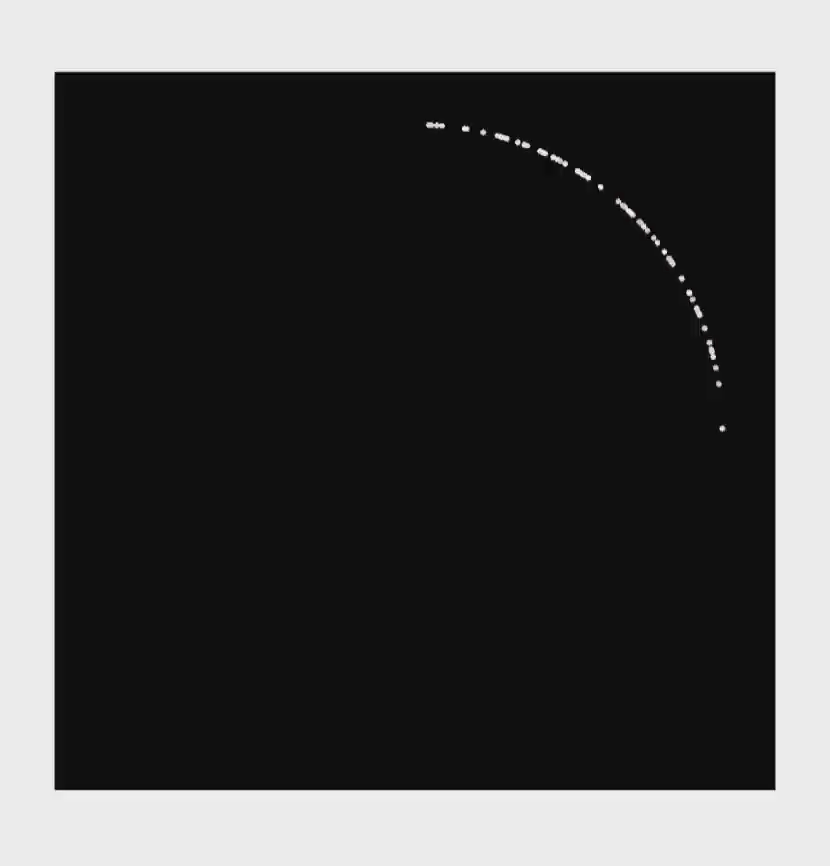

# 粒子动画 (Particle)
<!--Kit: ArkUI-->
<!--Subsystem: ArkUI-->
<!--Owner: @CCFFWW-->
<!--Designer: @yangfan229-->
<!--Tester: @lxl007-->
<!--Adviser: @HelloCrease-->

粒子动画是在一定范围内随机生成的大量粒子产生运动而组成的动画。动画元素是一个个粒子，这些粒子可以是圆点、图片。通过对粒子在颜色、透明度、大小、速度、加速度、自旋角度等维度变化做动画，来营造一种氛围感，比如下雪的动效，雪花飘舞就相当于一个个雪花粒子在做动画。

粒子动画的效果通过Particle组件展现。


>  **说明：**
>
>  该组件从API version 10开始支持。后续版本如有新增内容，则采用上角标单独标记该内容的起始版本。
>
>  Particle在息屏之后再次打开或者切换后台再次唤起，粒子动画会自动暂停。


## 子组件

无


## 接口

```typescript
interface ParticleInterface {
  <
    PARTICLE extends ParticleType,
    COLOR_UPDATER extends ParticleUpdater,
    OPACITY_UPDATER extends ParticleUpdater,
    SCALE_UPDATER extends ParticleUpdater,
    ACC_SPEED_UPDATER extends ParticleUpdater,
    ACC_ANGLE_UPDATER extends ParticleUpdater,
    SPIN_UPDATER extends ParticleUpdater
  >(particles: Particles<
      PARTICLE,
      COLOR_UPDATER,
      OPACITY_UPDATER,
      SCALE_UPDATER,
      ACC_SPEED_UPDATER,
      ACC_ANGLE_UPDATER,
      SPIN_UPDATER
    >): ParticleAttribute;
}
```

**原子化服务API：** 从API version 11开始，该接口支持在原子化服务中使用。

**系统能力：** SystemCapability.ArkUI.ArkUI.Full

**参数：**

| 名称 | 类型 | 只读 | 可选 | 说明 |
| -------- | -------- | ---- | ---- | -------- |
| particles | [Particles](#particles18)<<br/>&nbsp;&nbsp;[PARTICLE](#particletype), <br/>&nbsp;&nbsp;[COLOR_UPDATER](#particleupdater),<br/>&nbsp;&nbsp;[OPACITY_UPDATER](#particleupdater),<br/>&nbsp;&nbsp;[SCALE_UPDATER](#particleupdater),<br/>&nbsp;&nbsp;[ACC_SPEED_UPDATER](#particleupdater),<br/>&nbsp;&nbsp;[ACC_ANGLE_UPDATER](#particleupdater),<br/>&nbsp;&nbsp;[SPIN_UPDATER](#particleupdater)<br/>><br/> | 否 | 否 | 粒子动画的集合，详见[Particles](#particles18)属性说明。 |

## 属性

除支持[通用属性](ts-component-general-attributes.md)外还支持以下属性：

### disturbanceFields<sup>12+</sup>

disturbanceFields(fields: Array&lt;DisturbanceFieldOptions&gt;)

设置扰动场。

**原子化服务API：** 从API version 12开始，该接口支持在原子化服务中使用。

**系统能力：** SystemCapability.ArkUI.ArkUI.Full

**参数：**

| 参数名 | 类型    | 必填 | 说明                         |
| ------ | ------- | ---- | ---------------------------- |
| fields  | Array<[DisturbanceFieldOptions](#disturbancefieldoptions12)> | 是   | 扰动场数组。 |

### emitter<sup>12+</sup>
emitter(value: Array&lt;EmitterProperty&gt;)

支持发射器位置动态更新

**原子化服务API：** 从API version 12开始，该接口支持在原子化服务中使用。

**系统能力：** SystemCapability.ArkUI.ArkUI.Full

**参数：**

| 参数名 | 类型    | 必填 | 说明                         |
| ------ | ------- | ---- | ---------------------------- |
| value  | Array<[EmitterProperty](#emitterproperty12)> | 是   | 需要更新的emitter参数数组 |

## 事件
支持[通用事件](ts-component-general-events.md)

## ParticleOptions

```typescript
interface ParticleOptions<
  PARTICLE extends ParticleType,
  COLOR_UPDATER extends ParticleUpdater,
  OPACITY_UPDATER extends ParticleUpdater,
  SCALE_UPDATER extends ParticleUpdater,
  ACC_SPEED_UPDATER extends ParticleUpdater,
  ACC_ANGLE_UPDATER extends ParticleUpdater,
  SPIN_UPDATER extends ParticleUpdater
> {
  emitter: EmitterOptions<PARTICLE>;
  color?: ParticleColorPropertyOptions<COLOR_UPDATER>;
  opacity?: ParticlePropertyOptions<number, OPACITY_UPDATER>;
  scale?: ParticlePropertyOptions<number, SCALE_UPDATER>;
  velocity?: VelocityOptions;
  acceleration?: AccelerationOptions<ACC_SPEED_UPDATER, ACC_ANGLE_UPDATER>;
  spin?: ParticlePropertyOptions<number, SPIN_UPDATER>;
}
```

设置粒子参数。

**原子化服务API：** 从API version 11开始，该接口支持在原子化服务中使用。

**系统能力：** SystemCapability.ArkUI.ArkUI.Full

| 名称 | 类型 | 只读 | 可选 | 说明 |
| -------- | -------- | ---- | ---- | -------- |
| emitter | [EmitterOptions](#emitteroptions)<[PARTICLE](#particletype)> | 否 | 否 | 粒子发射器配置。 |
| color | [ParticleColorPropertyOptions](#particlecolorpropertyoptions)<[COLOR_UPDATER](#particleupdater)> | 否 | 是 | 粒子颜色配置。<br/>**说明**：<br/>默认值：{ range:[Color.White,Color.White] } 。图片粒子不支持设置颜色。|
| opacity | [ParticlePropertyOptions](#particlepropertyoptions)\<number, [OPACITY_UPDATER](#particleupdater)> | 否 | 是 | 粒子透明度配置。<br/>默认值：{ range:[1.0,1.0] } |
| scale | [ParticlePropertyOptions](#particlepropertyoptions)\<number, [SCALE_UPDATER](#particleupdater)> | 否 | 是 | 粒子大小配置。<br/>默认值：{ range:[1.0,1.0] } |
| velocity | [VelocityOptions](#velocityoptions18) |否 | 是 | 粒子速度配置。<br/>**说明**：<br/>speed表示速度大小。angle表示速度的方向（单位为角度），以元素几何中心为坐标原点，水平方向为X轴，正数表示顺时针方向旋转角度。<br/>默认值：{ speed:[0.0,0.0],angle:[0.0,0.0] } |
| acceleration | [AccelerationOptions](#accelerationoptions18)<[ACC_SPEED_UPDATER](#particleupdater), [ACC_ANGLE_UPDATER](#particleupdater)> | 否 | 是 | 粒子加速度配置。 <br/>**说明**：<br/>speed表示加速度大小，angle表示加速度方向（单位为角度）。<br/>默认值：{ speed:{range:[0.0,0.0]},angle:{range:[0.0,0.0]} } |
| spin | [ParticlePropertyOptions](#particlepropertyoptions)<number, [SPIN_UPDATER](#particleupdater)> | 否 | 是 | 粒子自旋角度配置。 <br/>默认值：{range:[0.0,0.0]}<br/>方向：正数表示顺时针旋转，负数表示逆时针旋转。 |


## EmitterOptions
粒子发射器的配置

```typescript
interface EmitterOptions<PARTICLE extends ParticleType> {   
  particle: EmitterParticleOptions<PARTICLE>;
  emitRate?: number;
  shape?: ParticleEmitterShape;
  position?: ParticleTuple<Dimension, Dimension>;
  size?: ParticleTuple<Dimension, Dimension>;
  annulusRegion?: ParticleAnnulusRegion;
}
```

**系统能力：** SystemCapability.ArkUI.ArkUI.Full

| 名称 | 类型 | 只读 | 可选 | 说明 |
| -------- | -------- | ---- | ---- | -------- |
| particle | [EmitterParticleOptions](#emitterparticleoptions18)<[PARTICLE](#particletype)> | 否 | 否 | 粒子配置。<br>-type表示粒子类型，可以选择图片或者是点。<br>-config表示对应类型的配置。<br>-config类型和type值有关联：<br>1、如果type为ParticleType.POINT，则config类型为[PointParticleParameters](#pointparticleparameters) 。<br>2、如果type为ParticleType.IMAGE，则config类型为[ImageParticleParameters](#imageparticleparameters) 。<br>-count表示发射的粒子总数，count取值>=-1,当count为-1表示粒子总数无限大。<br>-lifetime表示单个粒子的生命周期，默认值1000（即1000ms，1s）,lifetime>=-1,当lifetime为-1表示粒子生命周期无限大。当lifetime<-1，取默认值。<br/>**说明：**如果不需要动画一直播放，建议不要将生命周期设置为-1，可能对性能造成较大影响。<br>-lifeTimeRange表示粒子生命周期取值范围，设置lifeTimeRange后粒子的生命周期为 [lifetime-lifeTimeRange,lifeTime+lifeTimeRange]中间的一个随机整数。lifeTimeRange 默认值为0，取值范围为0到正无穷。设置为负值时取默认值。<br/>**原子化服务API：** 从API version 11开始，该接口支持在原子化服务中使用。 |
| emitRate | number | 否 | 是 | 发射器发射速率（即每秒发射粒子数）。 默认值：5，小于0时取默认值5。emitRate值超过5000时会极大影响性能，建议设置参数小于5000。<br/>**原子化服务API：** 从API version 11开始，该接口支持在原子化服务中使用。|
| shape | [ParticleEmitterShape](#particleemittershape) | 否 | 是 | 发射器形状。默认值：ParticleEmitterShape.RECTANGLE。<br/>**原子化服务API：** 从API version 11开始，该接口支持在原子化服务中使用。 |
| position | [ParticleTuple](#particletuple18)<[Dimension](ts-types.md#dimension10), [Dimension](ts-types.md#dimension10)> | 否 | 是 | 发射器位置（距离组件左上角的位置。第一个参数为x方向上的相对偏移，第二个参数为y轴方向相对偏移。） <br>默认值：`[0.0, 0.0]`。<br/>**原子化服务API：** 从API version 11开始，该接口支持在原子化服务中使用。|
| size |  [ParticleTuple](#particletuple18)<[Dimension](ts-types.md#dimension10), [Dimension](ts-types.md#dimension10)>     |否 | 是 | 发射窗口的大小。第一个参数为发射器宽，第二个参数为发射器高。<br>默认值：`['100%','100%']`(即发射窗口占满Particle组件)。<br/>**原子化服务API：** 从API version 11开始，该接口支持在原子化服务中使用。 |
| annulusRegion<sup>20+</sup>  | [ParticleAnnulusRegion](ts-particle-animation.md#particleannulusregion20)| 否 | 是  |环形发射器参数。需要发射器形状为环形（即shape参数为ParticleEmitterShape.ANNULUS）时才生效，且对于环形发射器，形状信息必须通过annulusRegion参数指定，position和size不生效。<br/>**原子化服务API：** 从API version 20开始，该接口支持在原子化服务中使用。 |

## ParticleConfigs

设置粒子配置项。

**原子化服务API：** 从API version 11开始，该接口支持在原子化服务中使用。

**系统能力：** SystemCapability.ArkUI.ArkUI.Full

| 名称   | 类型   | 只读 | 可选 | 说明 |
| -------- | -------- | ------ | -------- | -------- |
| [ParticleType.POINT]      | [PointParticleParameters](#pointparticleparameters) | 否 | 否    | 点状粒子配置。 |
| [ParticleType.IMAGE]      | [ImageParticleParameters](#imageparticleparameters) | 否 | 否    | 图片粒子配置。 |

## PointParticleParameters

设置粒子半径。

**原子化服务API：** 从API version 11开始，该接口支持在原子化服务中使用。

**系统能力：** SystemCapability.ArkUI.ArkUI.Full

| 名称   | 类型   | 只读 | 可选 | 说明 |
| -------- | ------- | ------- | -------- | -------- |
| radius      | [VP](ts-types.md#vp10)| 否 | 否    | 粒子半径。 |

## ImageParticleParameters

设置图片选项。

**原子化服务API：** 从API version 11开始，该接口支持在原子化服务中使用。

**系统能力：** SystemCapability.ArkUI.ArkUI.Full

| 名称   | 类型   | 只读 | 可选 | 说明 |
| -------- | ------- | ------- | -------- | -------- |
| src      | [ResourceStr](ts-types.md#resourcestr) | 否 | 否    | 图片路径，支持本地图片和网络图片，引用方式请参考[加载图片资源](../../../ui/arkts-graphics-display.md#加载图片资源)。<br/>暂不支持svg图片类型。<br>src未发生变化时，会优先使用缓存的资源，无法动态切换资源。如需动态切换资源建议切换为不同的src。 |
| size     | [ParticleTuple](#particletuple18)<[Dimension](ts-types.md#dimension10), [Dimension](ts-types.md#dimension10)> | 否 | 否    | 图像尺寸。 |
| objectFit| [ImageFit](ts-appendix-enums.md#imagefit)| 否 | 是   | 图片显示模式。 |

## ParticleColorPropertyOptions

```typescript
interface ParticleColorPropertyOptions<UPDATER extends ParticleUpdater> {
  range: ParticleTuple<ResourceColor, ResourceColor>; 
  distributionType?: DistributionType;
  updater?: ParticleColorUpdaterOptions<UPDATER>;
}
```

设置粒子颜色属性更新器配置。

**系统能力：** SystemCapability.ArkUI.ArkUI.Full

| 名称 | 类型 | 只读 | 可选 | 说明 |
| -------- | -------- | ---- | ---- | -------- |
| range | [ParticleTuple](#particletuple18)<[ResourceColor](ts-types.md#resourcecolor), [ResourceColor](ts-types.md#resourcecolor)> | 否 | 否 | 粒子初始颜色区间，粒子发射器生成粒子的初始颜色在range区间随机取值。<br>默认值：range:[Color.White,Color.White] <br/>**原子化服务API：** 从API version 11开始，该接口支持在原子化服务中使用。|
| distributionType<sup>12+<sup> | [DistributionType](#distributiontype12) | 否 | 是 | 粒子初始颜色随机值分布，允许用户选择颜色随机值生成的分布类型，支持均匀分布或正态（高斯）分布。<br>默认值：DistributionType.UNIFORM<br/>**原子化服务API：** 从API version 12开始，该接口支持在原子化服务中使用。 |
| updater | [ParticleColorUpdaterOptions](#particlecolorupdateroptions18)<[UPDATER](#particleupdater)> | 否 | 是 | 颜色属性变化配置。颜色属性变化类型type有三类：<br>1、当type为ParticleUpdater.NONE，表示无变化，则config类型为[ParticleColorPropertyUpdaterConfigs](#particlecolorpropertyupdaterconfigs)[ParticleUpdater.NONE]。 <br>2、type为ParticleUpdater.RANDOM，表示随机变化，则config类型为[ParticleColorPropertyUpdaterConfigs](#particlecolorpropertyupdaterconfigs)[ParticleUpdater.RANDOM]。 <br>3、type为ParticleUpdater.CURVE,表示按动画曲线变化，则config类型为[ParticleColorPropertyUpdaterConfigs](#particlecolorpropertyupdaterconfigs)[ParticleUpdater.CURVE]。<br>默认值：type默认为 ParticleUpdater.NONE。 <br>**说明**：<br>当type为ParticleUpdater.RANDOM或者ParticleUpdater.CURVE时，updater中颜色配置的优先级高于range中的颜色配置。在updater配置的动画时间周期内，以updater中的颜色配置来变化；在updater配置的动画时间周期外，以range中的颜色配置来变化。<br/>**原子化服务API：** 从API version 11开始，该接口支持在原子化服务中使用。 |


## ParticleColorPropertyUpdaterConfigs

设置粒子颜色属性更新器的配置。

**原子化服务API：** 从API version 11开始，该接口支持在原子化服务中使用。

**系统能力：** SystemCapability.ArkUI.ArkUI.Full

| 名称 | 类型 | 只读 | 可选 | 说明 |
| -------- | -------- | ---- | ---- | -------- |
|[ParticleUpdater.NONE]|void | 否 | 否 | 无变化。|
| [ParticleUpdater.RANDOM] | [ParticleColorOptions](#particlecoloroptions18) | 否 | 否 | 表示变化方式为均匀变化的时候，在区间内随机生成一个差值。r、g、b、a四个颜色通道每秒分别使用差值叠加当前颜色值，生成目标颜色值。实现颜色随机变化的效果。 |
[ParticleUpdater.CURVE]|Array<[ParticlePropertyAnimation](#particlepropertyanimation)\<[ResourceColor](ts-types.md#resourcecolor)\>> | 否 | 否 | 表示变化方式为曲线变化时，颜色变化的配置。数组类型表示当前属性可以设置多段动画，如0ms-3000ms，3000ms-5000ms，5000ms-8000ms分别设置动画。|

## ParticlePropertyOptions
```typescript
interface ParticlePropertyOptions<TYPE, UPDATER extends ParticleUpdater> {
  range: ParticleTuple<TYPE, TYPE>;
  updater?: ParticleUpdaterOptions<TYPE, UPDATER>;
}
```

设置粒子属性选项。

**原子化服务API：** 从API version 11开始，该接口支持在原子化服务中使用。

**系统能力：** SystemCapability.ArkUI.ArkUI.Full

| 名称 | 类型 | 只读 | 可选 | 说明 |
| -------- | -------- | ---- | ---- | -------- |
| range | [ParticleTuple](#particletuple18)<[TYPE](#particleupdater), [TYPE](#particleupdater)> | 否 | 否 | 粒子初始属性值区间，粒子发射器生成粒子的属性值在range区间随机取值。<br/>**说明**<br/>各项属性的非法输入取默认值，当最大值小于最小值的时候取默认区间。TYPE为number。<br/>不同属性的默认值不同：<br>1、opacity属性：range:[1.0,1.0]，取值范围为[0, 1]，默认值为1.0。<br/>2、scale属性：range:[1.0,1.0]，取值范围为[0, 10000]，默认值为1.0。<br/>3、acceleration加速度speed属性：range:[0.0,0.0]，取值范围为[0, 10000]，默认值为0.0。<br/>4、acceleration加速度angle属性：range:[0.0,0.0]，取值范围为[-10000, 10000]，默认值为0.0。<br/>5、spin属性：range:[0.0,0.0]，取值范围为[-10000, 10000]，默认值为0.0。
| updater | [ParticleUpdaterOptions](#particleupdateroptions18)<[TYPE](#particleupdater), [UPDATER](#particleupdater)> | 否 | 是 | 属性变化配置。属性变化类型type有三类：<br/>1、当type为ParticleUpdater.NONE，表示无变化，则config类型为[ParticlePropertyUpdaterConfigs](#particlepropertyupdaterconfigs)[ParticleUpdater.NONE]。<br>2、当type为ParticleUpdater.RANDOM，表示变化类型为随机变化，则config类型为[ParticlePropertyUpdaterConfigs](#particlepropertyupdaterconfigs)[ParticleUpdater.RANDOM]。<br>3、当type为ParticleUpdater.CURVE，表示变化类型为曲线变化，则config类型为[ParticlePropertyUpdaterConfigs](#particlepropertyupdaterconfigs)[ParticleUpdater.CURVE] <br>默认值：type默认为ParticleUpdater.NONE。 |


## ParticlePropertyUpdaterConfigs
```typescript
interface ParticlePropertyUpdaterConfigs<T> {
    [ParticleUpdater.NONE]: void;
    [ParticleUpdater.RANDOM]: ParticleTuple<T, T>;
    [ParticleUpdater.CURVE]: Array<ParticlePropertyAnimation<T>>;
}
```

设置粒子属性更新器配置。

**原子化服务API：** 从API version 11开始，该接口支持在原子化服务中使用。

**系统能力：** SystemCapability.ArkUI.ArkUI.Full

| 名称 | 类型 | 只读 | 可选 | 说明 |
| -------- | -------- | ---- | ---- | -------- |
[[ParticleUpdater.NONE]|void | 否 | 否 | 无变化。|
| [ParticleUpdater.RANDOM] | [ParticleTuple](#particletuple18)<T, T> | 否 | 否 | 表示变化方式为匀速变化时，每秒的变化差值为设置区间随机生成的值。<br/>目标属性值为当前属性值叠加变化差值。如当前属性值为0.2，config取[0.1,1.0]:<br/>1、如果变化差值在区间[0.1,1.0]取随机值0.5，则目标属性值为0.2+0.5 = 0.7；<br/>2、变化差值也可以取负值。如当前属性值为0.2，config为 [-3.0,2.0],如果变化差值在区间[-3.0,2.0]取随机值-2.0，则目标属性值为0.2-2.0 = -1.8。<br>**说明：**<br>config配置的是变化差值的取值范围，差值的最大最小值没有约束。但是如果当前属性值叠加差值大于属性最大值，目标属性值取属性最大值；如果当前属性值叠加差值小于属性最小值，目标属性值取属性最小值。T为number。<br>例如：opacity的取值范围[0.0,1.0]则当当前属性值叠加差值超过1.0，则取1.0。|
|[ParticleUpdater.CURVE]|Array<[ParticlePropertyAnimation](#particlepropertyanimation)\<T\>> | 否 | 否 | 表示变化方式为曲线变化时，属性变化的配置。数组类型表示当前属性可以设置多段动画，如0ms-3000ms，3000ms-5000ms，5000ms-8000ms分别设置动画。T为number。|

## ParticlePropertyAnimation
```typescript
interface ParticlePropertyAnimation<T> {
  from: T;
  to: T;
  startMillis: number;
  endMillis: number;
  curve?: Curve | ICurve;
}
```

设置粒子属性声明周期。

**原子化服务API：** 从API version 11开始，该接口支持在原子化服务中使用。

**系统能力：** SystemCapability.ArkUI.ArkUI.Full

| 名称 | 类型 | 只读 | 可选 | 说明 |
| -------- | ---- | ---- | -------- | -------- |
|from| T | 否 | 否 | 属性起始值。非法输入取对应属性的默认值。|
| to | T | 否 | 否 | 属性目标值。非法输入取对应属性的默认值。|
|startMillis|number | 否 | 否 | 动画开始时间。<br/>单位：毫秒。<br/>取值范围：[0, +∞)。|
|endMillis|number | 否 | 否 | 动画结束时间。<br/>单位：毫秒。<br/>取值范围：[0, +∞)。|
|curve|[Curve](ts-appendix-enums.md#curve)&nbsp;\|&nbsp;[ICurve](../js-apis-curve.md#icurve9)| 否 | 是 | 设置动画曲线。<br>默认值：Curve.Linear|


## ParticleType

粒子类型。

**原子化服务API：** 从API version 11开始，该接口支持在原子化服务中使用。

**系统能力：** SystemCapability.ArkUI.ArkUI.Full

| 名称  |  值  | 说明 |
| -------- | -------- | -------- | 
| POINT | 'point' | 点状粒子 |
| IMAGE | 'image' | 图片粒子 |


## ParticleEmitterShape

粒子发射器形状。

**原子化服务API：** 从API version 11开始，该接口支持在原子化服务中使用。

**系统能力：** SystemCapability.ArkUI.ArkUI.Full

| 名称  |  值  | 说明 |
| -------- | -------- | -------- | 
| RECTANGLE | 'rectangle' | 粒子发射器为矩形。<br/> **原子化服务API：** 从API version 11开始，该接口支持在原子化服务中使用。|
| CIRCLE | 'circle' | 粒子发射器为圆形。<br/> **原子化服务API：** 从API version 11开始，该接口支持在原子化服务中使用。|
| ELLIPSE | 'ellipse' | 粒子发射器为椭圆形。<br/> **原子化服务API：** 从API version 11开始，该接口支持在原子化服务中使用。|
| ANNULUS<sup>20+</sup> | 'annulus' | 粒子发射器为环形。<br/> **原子化服务API：** 从API version 20开始，该接口支持在原子化服务中使用。|

## DistributionType<sup>12+<sup>

初始颜色随机值分布类型。

**原子化服务API：** 从API version 12开始，该接口支持在原子化服务中使用。

**系统能力：** SystemCapability.ArkUI.ArkUI.Full

| 名称  |  值  | 说明 |
| -------- | -------- | -------- | 
| UNIFORM | 0 | 初始颜色随机值分布为均匀分布。|
| GAUSSIAN | 1 | 初始颜色随机值分布为高斯分布。|

## ParticleUpdater

粒子变化类型。

**原子化服务API：** 从API version 11开始，该接口支持在原子化服务中使用。

**系统能力：** SystemCapability.ArkUI.ArkUI.Full

| 名称  |  值  | 说明 |
| -------- | -------- | -------- | 
|NONE | 'none' | 无变化|
|RANDOM | 'random' | 随机变化|
|CURVE | 'curve' | 动画曲线变化|

## DisturbanceFieldOptions<sup>12+</sup>

设置粒子扰动场参数。

**原子化服务API：** 从API version 12开始，该接口支持在原子化服务中使用。

**系统能力：** SystemCapability.ArkUI.ArkUI.Full

| 名称 | 类型    | 只读 | 可选 | 说明                         |
| ------ | ------- | ---- | ------- | --------------------- |
| strength  | number | 否 | 是   |场强，表示场从中心向外的排斥力的强度，默认值0。正数表示排斥力方向朝外，负数表示吸引力，方向朝内。<br/>取值范围：(-∞, +∞)。 |
| shape  |   [DisturbanceFieldShape](#disturbancefieldshape12) | 否 | 是   | 场的形状。<br/>默认为DisturbanceFieldShape.RECT。 |
| size  | [SizeT](../js-apis-arkui-graphics.md#sizett12)&lt;number&gt;| 否 | 是  |场的大小。<br/>默认值 {width:0，height:0}。<br/>width和height的取值范围：[0, +∞)。 |
| position  | [PositionT](../js-apis-arkui-graphics.md#positiont12)&lt;number&gt; | 否 | 是   |场的位置。<br/>默认值{x:0，y:0}。<br/>x、y的取值范围：(-∞, +∞)。 |
| feather  | number | 否 | 是   |羽化值，表示场从中心点到场边缘的衰减程度，取值范围0到100的整数，如果0则表示场是一个刚体，所有范围内的粒子都被排斥在外。羽化值越大场的缓和程度越大，场范围内出现越多靠近中心点的粒子。<br/>默认值为0。 |
| noiseScale  | number | 否 | 是   |噪声尺度，用于控制噪声图案的整体大小，取值大于等于0。<br/>默认值1。 |
| noiseFrequency  | number | 否 | 是   |噪声频率，频率越大噪声越细腻，取值大于等于0。<br/> 默认值1。 |
| noiseAmplitude  | number | 否 | 是   |噪声震幅，噪声的波动的范围，震幅越大噪音之间差异越大。取值大于等于0。<br/> 默认值1。 |

## DisturbanceFieldShape<sup>12+</sup>

粒子形状。

**原子化服务API：** 从API version 12开始，该接口支持在原子化服务中使用。

**系统能力：** SystemCapability.ArkUI.ArkUI.Full

| 名称    | 值    | 说明   |
| --------| ---- | ------|
| RECT    | 0 | 长方形。   |
| CIRCLE  | 1 | 圆。       |
| ELLIPSE | 2 | 椭圆。     |

## EmitterProperty<sup>12+</sup>

设置发射器属性。

**原子化服务API：** 从API version 12开始，该接口支持在原子化服务中使用。

**系统能力：** SystemCapability.ArkUI.ArkUI.Full

| 名称 | 类型    | 只读 | 可选 | 说明                         |
| ------ | ------- | ---- | ------- | --------------------- |
| index   | number | 否 | 否   |索引，取整，按初始化参数中发射器的数组索引指定对应的发射器。异常默认值为0。<br/>**原子化服务API：** 从API version 12开始，该接口支持在原子化服务中使用。 |
| emitRate  | number  | 否 | 是   | 发射器发射速率，即每秒发射粒子的数量。<br/>未传入时保持其当前的发射速率， 传入值小于0时取默认值5。emitRate值超过5000时会极大影响性能，建议设置参数小于5000。<br/>**原子化服务API：** 从API version 12开始，该接口支持在原子化服务中使用。 |
| position  | [PositionT](../js-apis-arkui-graphics.md#positiont12)&lt;number&gt; | 否 | 是  |发射器位置的数组，只支持number类型。<br/>未传入时保持其当前的发射器位置。需传入两个有效参数，若其中一个为异常值，则position不生效。<br/>x、y的取值范围：(-∞, +∞)。<br/>**原子化服务API：** 从API version 12开始，该接口支持在原子化服务中使用。 |
| size  | [SizeT](../js-apis-arkui-graphics.md#sizett12)&lt;number&gt;| 否 | 是  |发射窗口的大小，只支持number类型。<br/>未传入时保持其当前发射窗口大小。需传入两个有效参数且都大于0，若其中一个为异常值，则size不生效。<br/>**原子化服务API：** 从API version 12开始，该接口支持在原子化服务中使用。 |
| annulusRegion<sup>20+</sup>  | [ParticleAnnulusRegion](ts-particle-animation.md#particleannulusregion20)| 否 | 是 |环形发射器参数。需要对应index的发射器形状为环形才生效。<br/>**原子化服务API：** 从API version 20开始，该接口支持在原子化服务中使用。 |

## ParticleTuple<sup>18+</sup>

```typescript
declare type ParticleTuple<T1, T2> = [T1, T2];
```

粒子元组，表示定义一些动画参数的类型。

**原子化服务API：** 从API version 18开始，该接口支持在原子化服务中使用。

**系统能力：** SystemCapability.ArkUI.ArkUI.Full

| 类型         | 说明                                           |
| ----------- | ---------------------------------------------- |
| [T1, T2]    | 一些动画参数的类型，可能是任何类型。              |

## Particles<sup>18+</sup>

```typescript
interface Particles<
  PARTICLE extends ParticleType,
  COLOR_UPDATER extends ParticleUpdater,
  OPACITY_UPDATER extends ParticleUpdater,
  SCALE_UPDATER extends ParticleUpdater,
  ACC_SPEED_UPDATER extends ParticleUpdater,
  ACC_ANGLE_UPDATER extends ParticleUpdater,
  SPIN_UPDATER extends ParticleUpdater
> {
  particles: Array<
    ParticleOptions<
      PARTICLE,
      COLOR_UPDATER,
      OPACITY_UPDATER,
      SCALE_UPDATER,
      ACC_SPEED_UPDATER,
      ACC_ANGLE_UPDATER,
      SPIN_UPDATER
    >
  >;
}
```

粒子动画的集合。

> **说明：**
>
> 为规范匿名对象的定义，API 18版本修改了此处的元素定义。其中，保留了历史匿名对象的起始版本信息，会出现外层元素@since版本号高于内层元素版本号的情况，但这不影响接口的使用。

**系统能力：** SystemCapability.ArkUI.ArkUI.Full

| 名称    | 类型                           | 只读 | 可选 | 说明                                                                                                                     |
| ------ | ------------------------------ | ---- | ------------------------------------------ | ----------------------------------------------------------------------------- |
| particles<sup>10+</sup>  | Array<<br/>&nbsp;&nbsp;ParticleOptions<<br/>&nbsp;&nbsp;&nbsp;&nbsp;PARTICLE,<br/>&nbsp;&nbsp;&nbsp;&nbsp;COLOR_UPDATER,<br/>&nbsp;&nbsp;&nbsp;&nbsp;OPACITY_UPDATER,<br/>&nbsp;&nbsp;&nbsp;&nbsp;SCALE_UPDATER,<br/>&nbsp;&nbsp;&nbsp;&nbsp;ACC_SPEED_UPDATER,<br/>&nbsp;&nbsp;&nbsp;&nbsp;ACC_ANGLE_UPDATER,<br/>&nbsp;&nbsp;&nbsp;&nbsp;SPIN_UPDATER<br/>&nbsp;&nbsp;><br/>>  | 否 | 否   | 粒子动画的集合。每一个的粒子动画（[ParticleOptions](#particleoptions)）包含粒子发射，同时可配置粒子的颜色、透明度、大小、速度、加速度与旋转速度，旋转速度，详见[ParticleOptions](#particleoptions)属性说明。 <br/>**原子化服务API：** 从API version 11开始，该接口支持在原子化服务中使用。|

## VelocityOptions<sup>18+</sup>

粒子速度配置。

> **说明：**
>
> 为规范匿名对象的定义，API 18版本修改了此处的元素定义。其中，保留了历史匿名对象的起始版本信息，会出现外层元素@since版本号高于内层元素版本号的情况，但这不影响接口的使用。

**原子化服务API：** 从API version 18开始，该接口支持在原子化服务中使用。

**系统能力：** SystemCapability.ArkUI.ArkUI.Full

| 名称    | 类型                           | 只读 | 可选 | 说明                                                                                                                     |
| ------ | ------------------------------ | ---- | ------------------------- | ---------------------------------------------------------------------------------------------- |
| speed<sup>10+</sup>  | [ParticleTuple](#particletuple18)<number, number>  | 否 | 否   | 表示速度大小。<br/>默认值：{range:[0.0,0.0]}    <br/>**原子化服务API：** 从API version 11开始，该接口支持在原子化服务中使用。                                                                          |
| angle<sup>10+</sup>  | [ParticleTuple](#particletuple18)<number, number>  | 否 | 否   | 表示速度的方向（单位为角度）。以元素几何中心为坐标原点，水平方向为X轴，正数表示顺时针方向旋转角度。<br/>默认值：{range:[0.0,0.0]} <br/>**原子化服务API：** 从API version 11开始，该接口支持在原子化服务中使用。|

## AccelerationOptions<sup>18+</sup>

```typescript
declare interface AccelerationOptions<
  ACC_SPEED_UPDATER extends ParticleUpdater,
  ACC_ANGLE_UPDATER extends ParticleUpdater
> {
  speed?: ParticlePropertyOptions<number, ACC_SPEED_UPDATER>;
  angle?: ParticlePropertyOptions<number, ACC_ANGLE_UPDATER>;
}
```

粒子加速度配置。

> **说明：**
>
> 为规范匿名对象的定义，API 18版本修改了此处的元素定义。其中，保留了历史匿名对象的起始版本信息，会出现外层元素@since版本号高于内层元素版本号的情况，但这不影响接口的使用。

**原子化服务API：** 从API version 18开始，该接口支持在原子化服务中使用。

**系统能力：** SystemCapability.ArkUI.ArkUI.Full

| 名称    | 类型                                                | 只读 | 可选 | 说明                                                       |
| ------ | --------------------------------------------------- | ---- | ----------- | ---------------------------------------------- |
| speed<sup>10+</sup>  | [ParticlePropertyOptions](#particlepropertyoptions)<number, [ACC_SPEED_UPDATER](#particleupdater)>  | 否 | 是   | 表示加速度大小。<br/>默认值：{range:[0.0,0.0]}      <br/>**原子化服务API：** 从API version 11开始，该接口支持在原子化服务中使用。        |
| angle<sup>10+</sup>  | [ParticlePropertyOptions](#particlepropertyoptions)<number, [ACC_ANGLE_UPDATER](#particleupdater)>  | 否 | 是   | 表示加速度方向（单位为角度）。<br/>默认值：{range:[0.0,0.0]} <br/>**原子化服务API：** 从API version 11开始，该接口支持在原子化服务中使用。|

## EmitterParticleOptions<sup>18+</sup>

```typescript
interface EmitterParticleOptions<PARTICLE extends ParticleType> {
  type: PARTICLE;
  config: ParticleConfigs[PARTICLE];
  count: number;
  lifetime?: number;
  lifetimeRange?: number;
}
```

粒子配置。

> **说明：**
>
> 为规范匿名对象的定义，API 18版本修改了此处的元素定义。其中，保留了历史匿名对象的起始版本信息，会出现外层元素@since版本号高于内层元素版本号的情况，但这不影响接口的使用。

**原子化服务API：** 从API version 18开始，该接口支持在原子化服务中使用。

**系统能力：** SystemCapability.ArkUI.ArkUI.Full

| 名称    | 类型                                                | 只读 | 可选 | 说明                                                       |
| ------ | --------------------------------------------------- | ---- | ----------- | ---------------------------------------------- |
| type<sup>10+</sup>  | [PARTICLE](#particletype)  | 否 | 否   | 表示粒子类型，可以选择图片或者是点。   <br/>**原子化服务API：** 从API version 11开始，该接口支持在原子化服务中使用。           |
| config<sup>10+</sup>  | [ParticleConfigs](#particleconfigs)[PARTICLE]  | 否 | 否   | 表示对应类型的配置。<br/>config类型和type值有关联：<br>1、如果type为ParticleType.POINT，则config类型为[PointParticleParameters](#pointparticleparameters) 。<br>2、如果type为ParticleType.IMAGE，则config类型为[ImageParticleParameters](#imageparticleparameters) 。<br/>**原子化服务API：** 从API version 11开始，该接口支持在原子化服务中使用。 |
| count<sup>10+</sup>  | number  | 否 | 否   | 表示发射的粒子总数，count取值>=-1,当count为-1表示粒子总数无限大。<br/>**原子化服务API：** 从API version 11开始，该接口支持在原子化服务中使用。 |
| lifetime<sup>10+</sup>  | number  | 否 | 是   | 表示单个粒子的生命周期，默认值1000（即1000ms，1s），lifetime>=-1。当lifetime为-1表示粒子生命周期无限大。当lifetime<-1，取默认值。<br/>**说明：** 如果不需要动画一直播放，建议不要将生命周期设置为-1，可能对性能造成较大影响。<br/>**原子化服务API：** 从API version 11开始，该接口支持在原子化服务中使用。 |
| lifetimeRange<sup>12+</sup>  | number  | 否 | 是   | 表示粒子生命周期取值范围，设置lifetimeRange后粒子的生命周期为 [lifetime-lifetimeRange,lifeTime+lifetimeRange]中间的一个随机整数。lifetimeRange 默认值为0，取值范围为0到正无穷。设置为负值时取默认值。 <br/>**原子化服务API：** 从API version 12开始，该接口支持在原子化服务中使用。|

## ParticleUpdaterOptions<sup>18+</sup>

```typescript
interface ParticleUpdaterOptions<TYPE, UPDATER extends ParticleUpdater> {
  type: UPDATER;
  config: ParticlePropertyUpdaterConfigs<TYPE>[UPDATER];
}
```

颜色属性变化配置。

> **说明：**
>
> 为规范匿名对象的定义，API 18版本修改了此处的元素定义。其中，保留了历史匿名对象的起始版本信息，会出现外层元素@since版本号高于内层元素版本号的情况，但这不影响接口的使用。

**原子化服务API：** 从API version 18开始，该接口支持在原子化服务中使用。

**系统能力：** SystemCapability.ArkUI.ArkUI.Full

| 名称    | 类型                                                | 只读 | 可选 | 说明                                                       |
| ------ | ----------------------------------- | ---------------- | ---- | --------------------------------------------------------- |
| type<sup>10+</sup>  | [UPDATER](#particleupdater)  | 否 | 否   | 表示颜色属性变化类型。 <br>默认值：type默认为ParticleUpdater.NONE。    **原子化服务API：** 从API version 11开始，该接口支持在原子化服务中使用。          |
| config<sup>10+</sup>  | [ParticlePropertyUpdaterConfigs](#particlepropertyupdaterconfigs)<[TYPE](#particleupdater)[[UPDATER](#particleupdater)] | 否 | 否   | 属性变化配置。属性变化类型type有三类：<br/>1、当type为ParticleUpdater.NONE，表示无变化，则config类型为[ParticlePropertyUpdaterConfigs](#particlepropertyupdaterconfigs)[ParticleUpdater.NONE]。<br>2、当type为ParticleUpdater.RANDOM，表示变化类型为随机变化，则config类型为[ParticlePropertyUpdaterConfigs](#particlepropertyupdaterconfigs)[ParticleUpdater.RANDOM]。<br>3、当type为ParticleUpdater.CURVE，表示变化类型为曲线变化，则config类型为[ParticlePropertyUpdaterConfigs](#particlepropertyupdaterconfigs)[ParticleUpdater.CURVE]。 **原子化服务API：** 从API version 11开始，该接口支持在原子化服务中使用。 |

## ParticleColorUpdaterOptions<sup>18+</sup>

```typescript
interface ParticleColorUpdaterOptions<UPDATER extends ParticleUpdater> {
  type: UPDATER;
  config: ParticleColorPropertyUpdaterConfigs[UPDATER];
}
```

颜色属性变化配置。

> **说明：**
>
> 为规范匿名对象的定义，API 18版本修改了此处的元素定义。其中，保留了历史匿名对象的起始版本信息，会出现外层元素@since版本号高于内层元素版本号的情况，但这不影响接口的使用。

**原子化服务API：** 从API version 18开始，该接口支持在原子化服务中使用。

**系统能力：** SystemCapability.ArkUI.ArkUI.Full

| 名称    | 类型                                                | 只读 | 可选 | 说明                                                       |
| ------ | --------------------------------------------------- | ---- | ---------- | ----------------------------------------------- |
| type<sup>10+</sup>  | [UPDATER](#particleupdater)  | 否 | 否   | 表示颜色属性变化类型。<br>默认值：type默认为 ParticleUpdater.NONE。     <br>**原子化服务API：** 从API version 11开始，该接口支持在原子化服务中使用。         |
| config<sup>10+</sup>  | [ParticleColorPropertyUpdaterConfigs](#particlecolorpropertyupdaterconfigs)[[UPDATER](#particleupdater)]  | 否 | 否   | 颜色属性变化类型type有三类：<br>1、当type为ParticleUpdater.NONE，表示无变化，则config类型为[ParticleColorPropertyUpdaterConfigs](#particlecolorpropertyupdaterconfigs)[ParticleUpdater.NONE]。 <br>2、type为ParticleUpdater.RANDOM，表示随机变化，则config类型为[ParticleColorPropertyUpdaterConfigs](#particlecolorpropertyupdaterconfigs)[ParticleUpdater.RANDOM]。 <br>3、type为ParticleUpdater.CURVE,表示按动画曲线变化，则config类型为[ParticleColorPropertyUpdaterConfigs](#particlecolorpropertyupdaterconfigs)[ParticleUpdater.CURVE]。 <br>**说明**：<br>当type为ParticleUpdater.RANDOM或者ParticleUpdater.CURVE时，updater中颜色配置的优先级高于range中的颜色配置。在updater配置的动画时间周期内，以updater中的颜色配置来变化；在updater配置的动画时间周期前，以range中的颜色配置来变化。<br>**原子化服务API：** 从API version 11开始，该接口支持在原子化服务中使用。 |

## ParticleColorOptions<sup>18+</sup>

颜色变化方式为均匀变化的时候，在区间内随机生成一个差值。r、g、b、a四个颜色通道每秒分别使用差值叠加当前颜色值，生成目标颜色值。实现颜色随机变化的效果。

> **说明：**
>
> 为规范匿名对象的定义，API 18版本修改了此处的元素定义。其中，保留了历史匿名对象的起始版本信息，会出现外层元素@since版本号高于内层元素版本号的情况，但这不影响接口的使用。

**原子化服务API：** 从API version 18开始，该接口支持在原子化服务中使用。

**系统能力：** SystemCapability.ArkUI.ArkUI.Full

| 名称  | 类型                           | 只读 | 可选 | 说明                         |
| ---- | ----------------- | ------------- | ---- | --------------------------- |
| r<sup>10+</sup>    | [ParticleTuple](#particletuple18)<number, number>  | 否 | 否   | r颜色通道的差值。   **原子化服务API：** 从API version 11开始，该接口支持在原子化服务中使用。         |
| g<sup>10+</sup>    | [ParticleTuple](#particletuple18)<number, number>  | 否 | 否   | g颜色通道的差值。   **原子化服务API：** 从API version 11开始，该接口支持在原子化服务中使用。        |
| b<sup>10+</sup>    | [ParticleTuple](#particletuple18)<number, number>  | 否 | 否   | b颜色通道的差值。   **原子化服务API：** 从API version 11开始，该接口支持在原子化服务中使用。        |
| a<sup>10+</sup>    | [ParticleTuple](#particletuple18)<number, number>  | 否 | 否   | a颜色通道的差值。   **原子化服务API：** 从API version 11开始，该接口支持在原子化服务中使用。        |

## ParticleAnnulusRegion<sup>20+</sup>

用于设置环形发射器区域的配置信息。

**原子化服务API：** 从API version 20开始，该接口支持在原子化服务中使用。

**系统能力：** SystemCapability.ArkUI.ArkUI.Full

| 名称   | 类型   | 只读 | 可选 | 说明 |
| ------ | ------ | -- | -- | ---- |
| center      | [PositionT](../js-apis-arkui-graphics.md#positiont12)&lt;[LengthMetrics](../js-apis-arkui-graphics.md#lengthmetrics12)&gt; | 否 | 是  | 圆环的圆心坐标，组件的左上角为坐标原点。默认值：{x:LengthMetrics.percent(0.5),y:LengthMetrics.percent(0.5)}   |
| outerRadius      | [LengthMetrics](../js-apis-arkui-graphics.md#lengthmetrics12) | 否 | 否   | 圆环的外圆半径。   |
| innerRadius  | [LengthMetrics](../js-apis-arkui-graphics.md#lengthmetrics12) | 否 | 否  | 圆环的内圆半径。   |
| startAngle | number | 否 | 是   | 圆环的起始角度。<br>单位：度<br>默认值：0  |
| endAngle | number | 否 | 是   | 圆环的结束角度。<br>单位：度<br>默认值：360  |


>  **说明：**
>
>  1、outerRadius、innerRadius小于零或使用百分比单位时，会按零进行处理。
>
>  2、当outerRadius小于innerRadius时（即外圆半径小于内圆半径时），会将当前较小的值作为新的内圆半径，将较大的值作为新的外圆半径。
>
>  3、当endAngle小于startAngle时（即结束角度小于起始角度时），会将当前较小的值作为新的起始角度，将较大的值作为新的结束角度。



## 示例

### 示例1（圆形初始化粒子）

描述粒子动画基础用法，通过圆形初始化粒子。

```ts
// xxx.ets
@Entry
@Component
struct ParticleExample {
  build() {
    Stack() {
      Text()
        .width(300).height(300).backgroundColor(Color.Black)
      Particle({
        particles: [
          {
            emitter: {
              particle: {
                type: ParticleType.POINT, //粒子类型
                config: {
                  radius: 10//圆点半径
                },
                count: 500, //粒子总数
                lifetime: 10000, //粒子生命周期，单位ms
                lifetimeRange: 100//粒子生命周期取值范围，单位ms
              },
              emitRate: 10, //每秒发射粒子数
              position: [0, 0],
              shape: ParticleEmitterShape.RECTANGLE//发射器形状
            },
            color: {
              range: [Color.Red, Color.Yellow], //初始颜色范围
              updater: {
                type: ParticleUpdater.CURVE, //变化方式为曲线变化
                config: [
                  {
                    from: Color.White, //变化起始值
                    to: Color.Pink, //变化终点值
                    startMillis: 0, //开始时间
                    endMillis: 3000, //结束时间
                    curve: Curve.EaseIn//变化曲线
                  },
                  {
                    from: Color.Pink,
                    to: Color.Orange,
                    startMillis: 3000,
                    endMillis: 5000,
                    curve: Curve.EaseIn
                  },
                  {
                    from: Color.Orange,
                    to: Color.Pink,
                    startMillis: 5000,
                    endMillis: 8000,
                    curve: Curve.EaseIn
                  },
                ]
              }
            },
            opacity: {
              range: [0.0, 1.0], //粒子透明度的初始值从【0.0到1.0】随机产生
              updater: {
                type: ParticleUpdater.CURVE,
                config: [
                  {
                    from: 0.0,
                    to: 1.0,
                    startMillis: 0,
                    endMillis: 3000,
                    curve: Curve.EaseIn
                  },
                  {
                    from: 1.0,
                    to: 0.0,
                    startMillis: 5000,
                    endMillis: 10000,
                    curve: Curve.EaseIn
                  }
                ]
              }
            },
            scale: {
              range: [0.0, 0.0],
              updater: {
                type: ParticleUpdater.CURVE,
                config: [
                  {
                    from: 0.0,
                    to: 0.5,
                    startMillis: 0,
                    endMillis: 3000,
                    curve: Curve.EaseIn
                  }
                ]
              }
            },
            acceleration: {
              //加速度的配置，从大小和方向两个维度变化，speed表示加速度大小，angle表示加速度方向
              speed: {
                range: [3, 9],
                updater: {
                  type: ParticleUpdater.RANDOM, //Speed的变化方式是随机变化
                  config: [1, 20]
                }
              },
              angle: {
                range: [90, 90]
              }
            }

          }
        ]
      }).width(300).height(300)
    }.width("100%").height("100%").align(Alignment.Center)
  }
}
```


### 示例2（图片初始化粒子）

描述粒子动画基础用法，通过图片初始化粒子。

```ts
@Entry
@Component
struct ParticleExample {
  @State
  myCount: number = 100
  flag: boolean = false;

  build() {
    Column() {
      Stack() {
        Particle({
          particles: [
            {
              emitter: {
                particle: {
                  type: ParticleType.IMAGE,
                  config: {
                    src: $r("app.media.book"),
                    size: [10, 10]
                  },
                  count: this.myCount,
                  lifetime: 10000,
                  lifetimeRange: 100
                },
                emitRate: 3,
                shape: ParticleEmitterShape.CIRCLE
              },
              color: {
                range: [Color.White, Color.White]
              },
              opacity: {
                range: [1.0, 1.0],
                updater: {
                  type: ParticleUpdater.CURVE,
                  config: [
                    {
                      from: 0,
                      to: 1.0,
                      startMillis: 0,
                      endMillis: 6000
                    },
                    {
                      from: 1.0,
                      to: .0,
                      startMillis: 6000,
                      endMillis: 10000
                    }
                  ]
                }
              },
              scale: {
                range: [0.1, 1.0],
                updater: {
                  type: ParticleUpdater.CURVE,
                  config: [
                    {
                      from: 0,
                      to: 1.5,
                      startMillis: 0,
                      endMillis: 8000,
                      curve: Curve.EaseIn
                    }

                  ]
                }
              },
              acceleration: {
                speed: {
                  range: [3, 9],
                  updater: {
                    type: ParticleUpdater.CURVE,
                    config: [
                      {
                        from: 10,
                        to: 20,
                        startMillis: 0,
                        endMillis: 3000,
                        curve: Curve.EaseIn
                      },
                      {
                        from: 10,
                        to: 2,
                        startMillis: 3000,
                        endMillis: 8000,
                        curve: Curve.EaseIn
                      }
                    ]
                  }
                },
                angle: {
                  range: [0, 180],
                  updater: {
                    type: ParticleUpdater.CURVE,
                    config: [{
                      from: 1,
                      to: 2,
                      startMillis: 0,
                      endMillis: 1000,
                      curve: Curve.EaseIn
                    },
                      {
                        from: 50,
                        to: -50,
                        startMillis: 1000,
                        endMillis: 3000,
                        curve: Curve.EaseIn
                      },
                      {
                        from: 3,
                        to: 5,
                        startMillis: 3000,
                        endMillis: 8000,
                        curve: Curve.EaseIn
                      }
                    ]
                  }
                }
              },
              spin: {
                range: [0.1, 1.0],
                updater: {
                  type: ParticleUpdater.CURVE,
                  config: [
                    {
                      from: 0,
                      to: 360,
                      startMillis: 0,
                      endMillis: 8000,
                      curve: Curve.EaseIn
                    }
                  ]
                }
              },
            }
            , {
            emitter: {
              particle: {
                type: ParticleType.IMAGE,
                config: {
                  src: $r('app.media.heart'),
                  size: [10, 10]
                },
                count: this.myCount,
                lifetime: 10000,
                lifetimeRange: 100
              },
              emitRate: 3,
              shape: ParticleEmitterShape.CIRCLE
            },
            color: {
              range: [Color.White, Color.White]
            },
            opacity: {
              range: [1.0, 1.0],
              updater: {
                type: ParticleUpdater.CURVE,
                config: [
                  {
                    from: 0,
                    to: 1.0,
                    startMillis: 0,
                    endMillis: 6000
                  },
                  {
                    from: 1.0,
                    to: .0,
                    startMillis: 6000,
                    endMillis: 10000
                  }
                ]
              }
            },
            scale: {
              range: [0.1, 1.0],
              updater: {
                type: ParticleUpdater.CURVE,
                config: [
                  {
                    from: 0,
                    to: 2.0,
                    startMillis: 0,
                    endMillis: 10000,
                    curve: Curve.EaseIn
                  }

                ]
              }
            },
            acceleration: {
              speed: {
                range: [3, 9],
                updater: {
                  type: ParticleUpdater.CURVE,
                  config: [
                    {
                      from: 10,
                      to: 20,
                      startMillis: 0,
                      endMillis: 3000,
                      curve: Curve.EaseIn
                    },
                    {
                      from: 10,
                      to: 2,
                      startMillis: 3000,
                      endMillis: 8000,
                      curve: Curve.EaseIn
                    }
                  ]
                }
              },
              angle: {
                range: [0, 180],
                updater: {
                  type: ParticleUpdater.CURVE,
                  config: [{
                    from: 1,
                    to: 2,
                    startMillis: 0,
                    endMillis: 1000,
                    curve: Curve.EaseIn
                  },
                    {
                      from: 50,
                      to: -50,
                      startMillis: 0,
                      endMillis: 3000,
                      curve: Curve.EaseIn
                    },
                    {
                      from: 3,
                      to: 5,
                      startMillis: 3000,
                      endMillis: 10000,
                      curve: Curve.EaseIn
                    }
                  ]
                }
              }
            },
            spin: {
              range: [0.1, 1.0],
              updater: {
                type: ParticleUpdater.CURVE,
                config: [
                  {
                    from: 0,
                    to: 360,
                    startMillis: 0,
                    endMillis: 10000,
                    curve: Curve.EaseIn
                  }
                ]
              }
            },
          }, {
            emitter: {
              particle: {
                type: ParticleType.IMAGE,
                config: {
                  src: $r('app.media.sun'),
                  size: [10, 10]
                },
                count: this.myCount,
                lifetime: 10000,
                lifetimeRange: 100
              },
              emitRate: 3,
              shape: ParticleEmitterShape.CIRCLE
            },
            color: {
              range: [Color.White, Color.White]
            },
            opacity: {
              range: [1.0, 1.0],
              updater: {
                type: ParticleUpdater.CURVE,
                config: [
                  {
                    from: 0,
                    to: 1.0,
                    startMillis: 0,
                    endMillis: 6000
                  },
                  {
                    from: 1.0,
                    to: .0,
                    startMillis: 6000,
                    endMillis: 10000
                  }
                ]
              }
            },
            scale: {
              range: [0.1, 1.0],
              updater: {
                type: ParticleUpdater.CURVE,
                config: [
                  {
                    from: 0,
                    to: 2.0,
                    startMillis: 0,
                    endMillis: 10000,
                    curve: Curve.EaseIn
                  }

                ]
              }
            },
            acceleration: {
              speed: {
                range: [3, 9],
                updater: {
                  type: ParticleUpdater.CURVE,
                  config: [
                    {
                      from: 10,
                      to: 20,
                      startMillis: 0,
                      endMillis: 3000,
                      curve: Curve.EaseIn
                    },
                    {
                      from: 10,
                      to: 2,
                      startMillis: 3000,
                      endMillis: 8000,
                      curve: Curve.EaseIn
                    }
                  ]
                }
              },
              angle: {
                range: [0, 180],
                updater: {
                  type: ParticleUpdater.CURVE,
                  config: [{
                    from: 1,
                    to: 2,
                    startMillis: 0,
                    endMillis: 1000,
                    curve: Curve.EaseIn
                  },
                    {
                      from: 50,
                      to: -50,
                      startMillis: 1000,
                      endMillis: 3000,
                      curve: Curve.EaseIn
                    },
                    {
                      from: 3,
                      to: 5,
                      startMillis: 3000,
                      endMillis: 8000,
                      curve: Curve.EaseIn
                    }
                  ]
                }
              }
            },
            spin: {
              range: [0.1, 1.0],
              updater: {
                type: ParticleUpdater.CURVE,
                config: [
                  {
                    from: 0,
                    to: 360,
                    startMillis: 0,
                    endMillis: 10000,
                    curve: Curve.EaseIn
                  }
                ]
              }
            },
          }
          ]
        }).width(300).height(300)

      }.width(500).height(500).align(Alignment.Center)
    }.width("100%").height("100%")

  }
}
```


### 示例3（粒子扰动场的干扰下运动轨迹发生变化）

该示例主要演示如何通过粒子扰动场的干扰下来实现运动轨迹发生变化的效果。

```
@Entry
@Component
struct ParticleExample {
  build() {
    Stack() {
      Text()
        .width(300).height(300).backgroundColor(Color.Black)
      Particle({
        particles: [
          {
            emitter: {
              particle: {
                type: ParticleType.POINT, //粒子类型
                config: {
                  radius: 10//圆点半径
                },
                count: 500, //粒子总数
                lifetime: 10000//粒子生命周期，单位ms
              },
              emitRate: 10, //每秒发射粒子数
              position: [0, 0],
              shape: ParticleEmitterShape.RECTANGLE//发射器形状
            },
            color: {
              range: [Color.Red, Color.Yellow], //初始颜色范围
              updater: {
                type: ParticleUpdater.CURVE, //变化方式为曲线变化
                config: [
                  {
                    from: Color.White, //变化起始值
                    to: Color.Pink, //变化终点值
                    startMillis: 0, //开始时间
                    endMillis: 3000, //结束时间
                    curve: Curve.EaseIn//变化曲线
                  },
                  {
                    from: Color.Pink,
                    to: Color.Orange,
                    startMillis: 3000,
                    endMillis: 5000,
                    curve: Curve.EaseIn
                  },
                  {
                    from: Color.Orange,
                    to: Color.Pink,
                    startMillis: 5000,
                    endMillis: 8000,
                    curve: Curve.EaseIn
                  },
                ]
              }
            },
            opacity: {
              range: [0.0, 1.0], //粒子透明度的初始值从[0.0,1.0]随机产生
              updater: {
                type: ParticleUpdater.CURVE,
                config: [
                  {
                    from: 0.0,
                    to: 1.0,
                    startMillis: 0,
                    endMillis: 3000,
                    curve: Curve.EaseIn
                  },
                  {
                    from: 1.0,
                    to: 0.0,
                    startMillis: 5000,
                    endMillis: 10000,
                    curve: Curve.EaseIn
                  }
                ]
              }
            },
            scale: {
              range: [0.0, 0.0],
              updater: {
                type: ParticleUpdater.CURVE,
                config: [
                  {
                    from: 0.0,
                    to: 0.5,
                    startMillis: 0,
                    endMillis: 3000,
                    curve: Curve.EaseIn
                  }
                ]
              }
            },
            acceleration: {
              //加速度的配置，从大小和方向两个维度变化，speed表示加速度大小，angle表示加速度方向
              speed: {
                range: [3, 9],
                updater: {
                  type: ParticleUpdater.RANDOM,
                  config: [1, 20]
                }
              },
              angle: {
                range: [90, 90]
              }
            }

          }
        ]
      }).width(300).height(300).disturbanceFields([{
        strength: 10,
        shape: DisturbanceFieldShape.RECT,
        size: { width: 100, height: 100 },
        position: { x: 100, y: 100 },
        feather: 15,
        noiseScale: 10,
        noiseFrequency: 15,
        noiseAmplitude: 5
      }])
    }.width("100%").height("100%").align(Alignment.Center)
  }
}

```


### 示例4（调整粒子发射器位置）
通过emitter()调整粒子发射器的位置。
```ts
@Entry
@Component
struct ParticleExample {
  @State emitterProperties: Array<EmitterProperty> = [
    {
      index: 0,
      emitRate: 100,
      position: { x: 60, y: 80 },
      size: { width: 200, height: 200 }
    }
  ]

  build() {
    Stack() {
      Text()
        .width(300).height(300).backgroundColor(Color.Black)
      Particle({
        particles: [
          {
            emitter: {
              particle: {
                type: ParticleType.POINT, // 粒子类型
                config: {
                  radius: 5// 圆点半径
                },
                count: 400, // 粒子总数
                lifetime: -1// 粒子的生命周期，-1表示粒子生命周期无限大
              },
              emitRate: 10, // 每秒发射粒子数
              position: [0, 0], // 粒子发射位置
              shape: ParticleEmitterShape.CIRCLE// 发射器形状
            },
            color: {
              range: [Color.Red, Color.Yellow], // 初始颜色范围
              updater: {
                type: ParticleUpdater.CURVE, // 变化方式为曲线变化
                config: [
                  {
                    from: Color.White,
                    to: Color.Pink,
                    startMillis: 0,
                    endMillis: 3000,
                    curve: Curve.EaseIn
                  },
                  {
                    from: Color.Pink,
                    to: Color.Orange,
                    startMillis: 3000,
                    endMillis: 5000,
                    curve: Curve.EaseIn
                  },
                  {
                    from: Color.Orange,
                    to: Color.Pink,
                    startMillis: 5000,
                    endMillis: 8000,
                    curve: Curve.EaseIn
                  },
                ]
              }
            },
          },
        ]
      })
        .width(300)
        .height(300)
        .emitter(this.emitterProperties)
    }.width("100%").height("100%").align(Alignment.Center)
  }
}
```


### 示例5（环形发射器创建）
描述粒子动画环形发射器创建的基础用法。
```ts
import { LengthMetrics } from '@kit.ArkUI';

@Entry
@Component
struct ParticleExample {
  build() {
    Stack() {
      Text()
        .width(300).height(300).backgroundColor(Color.Black)
      Particle({
        particles: [
          {
            emitter: {
              particle: {
                type: ParticleType.POINT, //粒子类型
                config: {
                  radius: 5//圆点半径
                },
                count: 2000, //粒子总数
                lifetime: 10000, //粒子生命周期，单位ms
                lifetimeRange: 100//粒子生命周期取值范围，单位ms
              },
              emitRate: 100, //每秒发射粒子数
              shape: ParticleEmitterShape.ANNULUS,//环形发射器
              annulusRegion:{
                center:{x:LengthMetrics.percent(0.5),y:LengthMetrics.percent(0.5)}, // 圆环的圆心坐标
                innerRadius:LengthMetrics.vp(100), // 圆环的外圆半径
                outerRadius:LengthMetrics.vp(120), // 圆环的内圆半径
                startAngle:0, // 圆环的起始角度
                endAngle:360 // 圆环的结束角度
              }
            },
            color: {
              range: [Color.Pink, Color.White],
            },
            opacity: {
              range: [0.0, 1.0],
              updater: {
                type: ParticleUpdater.CURVE,
                config: [
                  {
                    from: 0.0,
                    to: 1.0,
                    startMillis: 0,
                    endMillis: 3000,
                    curve: Curve.EaseIn
                  },
                  {
                    from: 1.0,
                    to: 0.0,
                    startMillis: 5000,
                    endMillis: 10000,
                    curve: Curve.EaseIn
                  }
                ]
              }
            },
            scale: {
              range: [0.0, 0.0],
              updater: {
                type: ParticleUpdater.CURVE,
                config: [
                  {
                    from: 0.0,
                    to: 0.5,
                    startMillis: 0,
                    endMillis: 3000,
                    curve: Curve.EaseIn
                  }
                ]
              }
            },
          }
        ]
      }).width(300).height(300)
    }.width("100%").height("100%").align(Alignment.Center)
  }
}
```


### 示例6（环形发射器更新）
描述粒子动画环形发射器更新的基础用法。
```ts
// xxx.ets
import { LengthMetrics } from '@kit.ArkUI'

@Entry
@Component
struct ParticleExample {

  @State radius: number = 1
  @State shape: ParticleEmitterShape = ParticleEmitterShape.ANNULUS
  @State emitRate: number = 200
  @State count: number = 2000
  private timerID: number = -1
  private centerX: LengthMetrics = LengthMetrics.percent(0.5)
  private centerY: LengthMetrics = LengthMetrics.percent(0.5)
  private inRadius: LengthMetrics = LengthMetrics.vp(120)
  private outRadius: LengthMetrics = LengthMetrics.vp(120)
  private startAngle: number = 0
  private endAngle: number = 90
  @State emitterProperties: Array<EmitterProperty> = [
    {
      index: 0,
      emitRate: 100,
      annulusRegion: {
        center:{x:this.centerX, y: this.centerY}, // 圆环的圆心坐标
        outerRadius: this.outRadius, // 圆环的外圆半径
        innerRadius: this.inRadius, // 圆环的内圆半径
        startAngle: -90, // 圆环的起始角度
        endAngle: 0 // 圆环的结束角度
      }
    }
  ]
  @State region: ParticleAnnulusRegion = {
    center:{x:this.centerX, y: this.centerY},
    outerRadius: this.outRadius,
    innerRadius: this.inRadius,
    startAngle: -90,
    endAngle: 0
  }

  aboutToDisappear(): void {
    // 页面销毁时清除计时器
    if (this.timerID != -1) {
      clearInterval(this.timerID);
    }
  }

  build() {
    Column({ space: 10}) {
      Stack() {
        Text()
          .width(300).height(300).backgroundColor(Color.Black)

        Particle({
          particles: [
            {
              emitter: {
                particle: {
                  type: ParticleType.POINT, // 粒子类型
                  config: {
                    radius: this.radius // 圆点半径
                  },
                  count: this.count, // 粒子总数
                  lifetime: -1 // 粒子的生命周期，-1表示粒子生命周期无限大
                },
                emitRate: this.emitRate, // 每秒发射粒子数
                shape: this.shape, //发射器形状
                annulusRegion: this.region
              },
              color: {
                range: [Color.White, Color.Pink], // 初始颜色范围
              },
            },
          ]
        }).width("100%")
          .height("100%")
          .emitter(this.emitterProperties)
          .onClick(()=>{
            // 清除已有定时器
            if (this.timerID != -1) {
              clearInterval(this.timerID);
            }

            // 创建定时器（每秒更新）
            this.timerID = setInterval(() => {
              this.emitterProperties = [
                {
                  index: 0,
                  emitRate: this.emitRate,
                  annulusRegion: {
                    center:{x:this.centerX, y: this.centerY},
                    outerRadius: this.outRadius,
                    innerRadius: this.inRadius,
                    startAngle: this.startAngle,
                    endAngle: this.endAngle
                  }
                }
              ];
              if (this.endAngle >= 270) {
                if (this.timerID != -1) {
                  clearInterval(this.timerID);
                }
                return;
              }
              // 更新角度值（5度/秒）
              this.startAngle += 30;
              this.endAngle += 30;
            }, 1000);

          })
      }
      .width("100%")
      .height("100%")
      .align(Alignment.Center)
    }
  }
}
```

