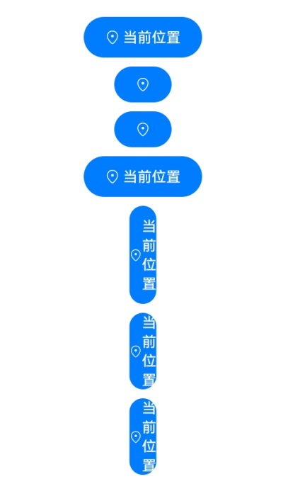

# LocationButton

安全控件的位置控件，用户通过点击该位置按钮，可以临时获取精准定位权限，而不需要权限弹框授权确认。

> **说明：**
>
> - 该组件从API Version 10开始支持。后续版本如有新增内容，则采用上角标单独标记该内容的起始版本。
>
> - 从API Version 15开始，位置控件不再维护，推荐调用[requestPermissionsFromUser](../../apis-ability-kit/js-apis-abilityAccessCtrl.md#requestpermissionsfromuser9-1)拉起权限弹窗，请求用户授权。

## 子组件

不支持。

## 接口

### LocationButton

LocationButton()

默认创建带有图标、文本、背景的位置按钮。

为避免控件样式不合法导致授权失败，请开发者先了解安全控件样式的[约束与限制](../../../security/AccessToken/security-component-overview.md#约束与限制)。

**原子化服务API：** 从API version 11开始，该接口支持在元服务中使用。

**系统能力：** SystemCapability.ArkUI.ArkUI.Full

### LocationButton

LocationButton(options: LocationButtonOptions)

创建包含指定元素的位置按钮。

为避免控件样式不合法导致授权失败，请开发者先了解安全控件样式的[约束与限制](../../../security/AccessToken/security-component-overview.md#约束与限制)。

**原子化服务API：** 从API version 11开始，该接口支持在原子化服务中使用。

**系统能力：** SystemCapability.ArkUI.ArkUI.Full

**参数：**

| 参数名 | 类型 | 必填 | 说明 |
| -------- | -------- | -------- | -------- |
| options | [LocationButtonOptions](#locationbuttonoptions) | 是 | 创建包含指定元素的位置按钮。 |

## LocationButtonOptions

用于指定位置按钮的图标、文本等指定元素。

> **说明：**
>
> - icon或text需至少传入一个。<br>
> - 如果icon、text都不传入，[LocationButton](#locationbutton-1)中的options参数不起效，创建的LocationButton为默认样式，默认样式：
>
>   LocationIconStyle默认样式为LINES；
>
>   LocationDescription默认样式为CURRENT_LOCATION；
>
>   ButtonType默认样式为Capsule。
> - icon、text、buttonType不支持动态修改。

**原子化服务API：** 从API version 11开始，该接口支持在原子化服务中使用。

**系统能力：** SystemCapability.ArkUI.ArkUI.Full

| 名称 | 类型 | 必填 | 说明 |
| -------- | -------- | -------- | -------- |
| icon | [LocationIconStyle](#locationiconstyle枚举说明) | 否 | 设置位置按钮的图标风格。<br/>不传入该参数表示没有图标。 |
| text | [LocationDescription](#locationdescription枚举说明) | 否 | 设置位置按钮的文本描述。<br/>不传入该参数表示没有文字描述。 |
| buttonType | [ButtonType](ts-securitycomponent-attributes.md#buttontype枚举说明) | 否 | 设置位置按钮的背景样式。<br/>不传入该参数，系统默认提供Capsule类型按钮。 |

## LocationIconStyle枚举说明

**原子化服务API：** 从API version 11开始，该接口支持在原子化服务中使用。

**系统能力：** SystemCapability.ArkUI.ArkUI.Full

| 名称 | 值 | 说明 |
| -------- | -------- | -------- |
| FULL_FILLED |  0 | 位置按钮展示填充样式图标。 |
| LINES | 1 | 位置按钮展示线条样式图标。 |

## LocationDescription枚举说明

**原子化服务API：** 从API version 11开始，该接口支持在原子化服务中使用。

**系统能力：** SystemCapability.ArkUI.ArkUI.Full

| 名称 | 值 | 说明 |
| -------- | -------- | -------- |
| CURRENT_LOCATION | 0 | 位置按钮的文字描述为“当前位置”。 |
| ADD_LOCATION | 1 | 位置按钮的文字描述为“添加位置”。 |
| SELECT_LOCATION | 2 | 位置按钮的文字描述为“选择位置”。 |
| SHARE_LOCATION | 3 | 位置按钮的文字描述为“共享位置”。 |
| SEND_LOCATION | 4 | 位置按钮的文字描述为“发送位置”。 |
| LOCATING | 5 | 位置按钮的文字描述为“定位”。 |
| LOCATION | 6 | 位置按钮的文字描述为“位置”。 |
| SEND_CURRENT_LOCATION | 7 | 位置按钮的文字描述为“发送实时位置”。 |
| RELOCATION | 8 | 位置按钮的文字描述为“重定位”。 |
| PUNCH_IN | 9 | 位置按钮的文字描述为“打卡定位”。 |
| CURRENT_POSITION | 10 | 位置按钮的文字描述为“所在位置”。 |

## LocationButtonOnClickResult枚举说明

**原子化服务API：** 从API version 11开始，该接口支持在原子化服务中使用。

**系统能力：** SystemCapability.ArkUI.ArkUI.Full

| 名称 | 值 | 说明 |
| -------- | -------- | -------- |
| SUCCESS | 0 | 位置按钮点击成功。 |
| TEMPORARY_AUTHORIZATION_FAILED | 1 | 位置按钮点击后位置权限授权失败。 |

## LocationButtonCallback<sup>18+</sup>

type LocationButtonCallback = (event: ClickEvent, result: LocationButtonOnClickResult, error?: BusinessError&lt;void&gt;) =&gt; void

点击位置按钮触发该回调。

**原子化服务API：** 从API version 18开始，该接口支持在原子化服务中使用。

**系统能力：** SystemCapability.ArkUI.ArkUI.Full

| 参数名 | 类型                   | 必填 | 说明                   |
|------------|------|-------|---------|
| event | [ClickEvent](ts-universal-events-click.md#clickevent对象说明) |是 |见ClickEvent对象说明。|
| result | [LocationButtonOnClickResult](#locationbuttononclickresult枚举说明)| 是 | 位置权限的授权结果。|
| error | [BusinessError&lt;void&gt;](../../apis-basic-services-kit/js-apis-base.md#businesserror)| 否  | 点击按钮时的错误码和错误信息。<br>错误码0表示点击位置按钮授权成功。<br>错误码1表示系统内部错误。<br>错误码2表示属性设置错误，包括但不限于：<br>1. 字体或图标设置过小。<br>2. 字体或图标与背托颜色相近。<br>3. 字体或图标颜色过于透明。<br>4. padding为负值。<br>5. 按钮被其他组件或窗口遮挡。<br>6. 文本超出背托范围。<br>7. 按钮超出窗口或屏幕。<br>8. 按钮整体尺寸过大。<br>9. 按钮文本被截断，显示不全。<br>10. 相关属性设置影响安全控件显示。|

## 属性

不支持通用属性，仅继承[安全控件通用属性](ts-securitycomponent-attributes.md#属性)。

## 事件

不支持通用事件，仅支持以下事件：

### onClick

onClick(event: LocationButtonCallback)

点击动作触发该回调。

**原子化服务API：** 从API version 11开始，该接口支持在原子化服务中使用。

**系统能力：** SystemCapability.ArkUI.ArkUI.Full

**参数：**

| 参数名 | 类型                   | 必填 | 说明                   |
|------------|------|-------|---------|
| event | [LocationButtonCallback](#locationbuttoncallback18) |是 |见LocationButtonCallback。<br>在API10-17时，参数类型为：(event: [ClickEvent](ts-universal-events-click.md#clickevent对象说明), result: [LocationButtonOnClickResult](#locationbuttononclickresult枚举说明)) => void。<br>从API18开始，变更为LocationButtonCallback。|

## 示例

```ts
// xxx.ets
import { BusinessError } from '@kit.BasicServicesKit';

@Entry
@Component
struct Index {
  handleLocationButtonClick: LocationButtonCallback =
    (event: ClickEvent, result: LocationButtonOnClickResult, error: BusinessError<void>) => {
      if (result == LocationButtonOnClickResult.SUCCESS) {
        console.info("success");
      } else {
        console.info("errCode: " + error.code);
        console.info("errMessage: " + error.message);
      }
    };

  build() {
    Row() {
      Column({ space: 10 }) {
        // 默认参数下，图标、文字、背景都存在。
        LocationButton().onClick(this.handleLocationButtonClick)
        // 传入参数即表示元素存在，不传入的参数表示元素不存在，如果不传入buttonType，会默认添加ButtonType.Capsule配置，显示图标+背景。
        LocationButton({ icon: LocationIconStyle.LINES })
        // 只显示图标+背景，如果设置背景色高八位的α值低于0x1A，则会被系统强制调整为0xFF。
        LocationButton({ icon: LocationIconStyle.LINES, buttonType: ButtonType.Capsule })
          .backgroundColor(0x10007dff)
        // 图标、文字、背景都存在，如果设置背景色高八位的α值低于0x1A，则会被系统强制调整为0xFF。
        LocationButton({
          icon: LocationIconStyle.LINES,
          text: LocationDescription.CURRENT_LOCATION,
          buttonType: ButtonType.Capsule
        })
        // 图标、文字、背景都存在，如果设置宽度小于当前属性组合下允许的最小宽度时，宽度仍为设置值，此时按钮文本信息会自动换行，以保证安全控件显示的完整性。
        LocationButton({
          icon: LocationIconStyle.LINES,
          text: LocationDescription.CURRENT_LOCATION,
          buttonType: ButtonType.Capsule
        })
          .fontSize(16)
          .width(30)
        // 图标、文字、背景都存在，如果设置宽度小于当前属性组合下允许的最小宽度时，宽度仍为设置值，此时按钮文本信息会自动换行，以保证安全控件显示的完整性。
        LocationButton({
          icon: LocationIconStyle.LINES,
          text: LocationDescription.CURRENT_LOCATION,
          buttonType: ButtonType.Capsule
        })
          .fontSize(16)
          .size({ width: 30, height: 30 })
        // 图标、文字、背景都存在，如果设置宽度小于当前属性组合下允许的最小宽度时，宽度仍为设置值，此时按钮文本信息会自动换行，以保证安全控件显示的完整性。
        LocationButton({
          icon: LocationIconStyle.LINES,
          text: LocationDescription.CURRENT_LOCATION,
          buttonType: ButtonType.Capsule
        })
          .fontSize(16)
          .constraintSize({
            minWidth: 0,
            maxWidth: 30,
            minHeight: 0,
            maxHeight: 30
          })
      }.width('100%')
    }.height('100%')
  }
}
```


