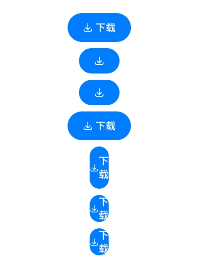
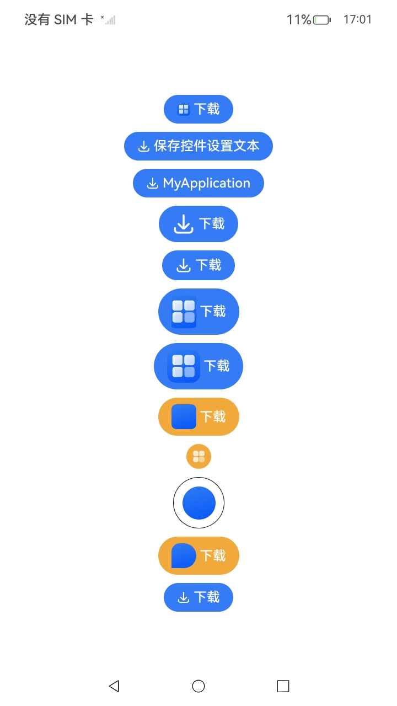

# SaveButton

安全控件的保存控件。用户点击保存控件，应用可以临时获取存储权限，而不需要权限弹框授权确认。

> **说明：**
>
> 该组件从API version 10开始支持。后续版本如有新增内容，则采用上角标单独标记该内容的起始版本。

## 子组件

不支持。

## 接口

### SaveButton

SaveButton()

默认创建带有图标、文本、背景的保存控件。

为避免控件样式不合法导致授权失败，请开发者先了解安全控件样式的[约束与限制](../../../security/AccessToken/security-component-overview.md#约束与限制)。

**原子化服务API：** 从API version 11开始，该接口支持在原子化服务中使用。

**系统能力：** SystemCapability.ArkUI.ArkUI.Full

### SaveButton

SaveButton(options: SaveButtonOptions)

创建包含指定元素的保存控件。

为避免控件样式不合法导致授权失败，请开发者先了解安全控件样式的[约束与限制](../../../security/AccessToken/security-component-overview.md#约束与限制)。

**原子化服务API：** 从API version 11开始，该接口支持在原子化服务中使用。

**系统能力：** SystemCapability.ArkUI.ArkUI.Full

**参数：**

| 参数名 | 类型 | 必填 | 说明 |
| -------- | -------- | -------- | -------- |
| options | [SaveButtonOptions](#savebuttonoptions) | 是 | 创建包含指定元素的保存控件。 |

## SaveButtonOptions

用于指定保存控件的图标、文本等指定元素。

> **说明：**
>
> - icon或text需至少传入一个。<br>
> - 如果icon、text都不传入，[SaveButton](#savebutton-1)中的options参数不起效，创建的SaveButton为默认样式，默认样式：
>
>   SaveIconStyle默认样式为FULL_FILLED；
>
>   SaveDescription默认样式为DOWNLOAD；
>
>   ButtonType默认样式为Capsule。
> - icon、text、buttonType不支持动态修改。

**原子化服务API：** 从API version 11开始，该接口支持在原子化服务中使用。

**系统能力：** SystemCapability.ArkUI.ArkUI.Full

| 名称 | 类型 | 必填 | 说明 |
| -------- | -------- | -------- | -------- |
| icon | [SaveIconStyle](#saveiconstyle枚举说明) | 否 | 设置保存控件的图标风格。<br/>不传入该参数表示没有图标。 |
| text | [SaveDescription](#savedescription枚举说明) | 否 | 设置保存控件的文本描述。<br/>不传入该参数表示没有文字描述。 |
| buttonType | [ButtonType](ts-securitycomponent-attributes.md#buttontype枚举说明) | 否 | 设置保存控件的背景样式。<br/>不传入该参数，系统默认提供Capsule类型按钮。 |

## SaveIconStyle枚举说明

**原子化服务API：** 从API version 11开始，该接口支持在原子化服务中使用。

**系统能力：** SystemCapability.ArkUI.ArkUI.Full

| 名称 | 值 | 说明 |
| -------- | -------- | -------- |
| FULL_FILLED | 0 | 保存控件展示填充样式图标。 |
| LINES | 1 | 保存控件展示线条样式图标。 |

## SaveDescription枚举说明

**系统能力：** SystemCapability.ArkUI.ArkUI.Full

| 名称 | 值 | 说明 |
| -------- | -------- | -------- |
| DOWNLOAD | 0 | 保存控件的文字描述为“下载”。 <br/>**原子化服务API：** 从API version 11开始，该接口支持在原子化服务中使用。|
| DOWNLOAD_FILE | 1 | 保存控件的文字描述为“下载文件”。 <br/>**原子化服务API：** 从API version 11开始，该接口支持在原子化服务中使用。|
| SAVE | 2 | 保存控件的文字描述为“保存”。 <br/>**原子化服务API：** 从API version 11开始，该接口支持在原子化服务中使用。|
| SAVE_IMAGE | 3 | 保存控件的文字描述为“保存图片”。 <br/>**原子化服务API：** 从API version 11开始，该接口支持在原子化服务中使用。|
| SAVE_FILE | 4 | 保存控件的文字描述为“保存文件”。 <br/>**原子化服务API：** 从API version 11开始，该接口支持在原子化服务中使用。|
| DOWNLOAD_AND_SHARE | 5 | 保存控件的文字描述为“下载分享”。 <br/>**原子化服务API：** 从API version 11开始，该接口支持在原子化服务中使用。|
| RECEIVE | 6 | 保存控件的文字描述为“接收”。 <br/>**原子化服务API：** 从API version 11开始，该接口支持在原子化服务中使用。|
| CONTINUE_TO_RECEIVE | 7 | 保存控件的文字描述为“继续接收”。 <br/>**原子化服务API：** 从API version 11开始，该接口支持在原子化服务中使用。|
| SAVE_TO_GALLERY<sup>12+</sup> | 8 | 保存控件的文字描述为“保存至图库”。 <br/>**原子化服务API：** 从API version 12开始，该接口支持在原子化服务中使用。|
| EXPORT_TO_GALLERY<sup>12+</sup> | 9 | 保存控件的文字描述为“导出”。 <br/>**原子化服务API：** 从API version 12开始，该接口支持在原子化服务中使用。|
| QUICK_SAVE_TO_GALLERY<sup>12+</sup> | 10 | 保存控件的文字描述为“快速保存图片”。 <br/>**原子化服务API：** 从API version 12开始，该接口支持在原子化服务中使用。|
| RESAVE_TO_GALLERY<sup>12+</sup> | 11 | 保存控件的文字描述为“重新保存”。 <br/>**原子化服务API：** 从API version 12开始，该接口支持在原子化服务中使用。|
| SAVE_ALL<sup>18+</sup> | 12 | 保存控件的文字描述为“全部保存”。 <br/>**原子化服务API：** 从API version 18开始，该接口支持在原子化服务中使用。 |

## SaveButtonOnClickResult枚举说明

**原子化服务API：** 从API version 11开始，该接口支持在原子化服务中使用。

**系统能力：** SystemCapability.ArkUI.ArkUI.Full

| 名称 | 值 | 说明 |
| -------- | -------- | -------- |
| SUCCESS | 0 | 保存控件点击后权限授权成功。 |
| TEMPORARY_AUTHORIZATION_FAILED | 1 | 保存控件点击后权限授权失败。 |

## SaveButtonCallback<sup>18+</sup>

type SaveButtonCallback = (event: ClickEvent, result: SaveButtonOnClickResult, error?: BusinessError&lt;void&gt;) =&gt; void

点击保存控件触发该回调。

**原子化服务API：** 从API version 18开始，该接口支持在原子化服务中使用。

**系统能力：** SystemCapability.ArkUI.ArkUI.Full

| 参数名 | 类型                   | 必填 | 说明                   |
|------------|------|-------|---------|
| event | [ClickEvent](ts-universal-events-click.md#clickevent对象说明) |是 |见ClickEvent对象说明。|
| result | [SaveButtonOnClickResult](#savebuttononclickresult枚举说明)| 是 | 存储权限的授权结果，授权时长为10秒，即触发点击后，可以在10秒之内不限制次数的调用特定媒体库接口，超出10秒的调用会鉴权失败。|
| error | [BusinessError&lt;void&gt;](../../apis-basic-services-kit/js-apis-base.md#businesserror) | 否 | 点击按钮时的错误码和错误信息。<br>错误码0表示点击保存控件授权成功。<br>错误码1表示系统内部错误。<br>错误码2表示属性设置错误，包括但不限于：<br>1. 字体或图标设置过小。<br>2. 字体或图标与背托颜色相近。<br>3. 字体或图标颜色过于透明。<br>4. padding为负值。<br>5. 按钮被其他组件或窗口遮挡。<br>6. 文本超出背托范围。<br>7. 按钮超出窗口或屏幕。<br>8. 按钮整体尺寸过大。<br>9. 按钮文本被截断，显示不全。<br>10. 相关属性设置影响安全控件显示。|

## SaveButtonAttribute
SaveButtonAttribute提供自定义图标（setIcon）、自定义文本（setText）、图标尺寸（iconSize）、图标圆角（iconBorderRadius），以及按压态效果（stateEffect）等属性设置的方法。

**原子化服务API：** 从API version 11开始，该接口支持在原子化服务中使用。

### setIcon<sup>20+</sup>

setIcon(icon: Resource)

设置保存控件的图标。

**需要权限**：ohos.permission.CUSTOMIZE_SAVE_BUTTON

**原子化服务API：** 从API version 20开始，该接口支持在原子化服务中使用。

**系统能力：** SystemCapability.ArkUI.ArkUI.Full

**参数：**

| 参数名 | 类型                   | 必填 | 说明                   |
|------------|------|-------|---------|
| icon | [Resource](ts-types.md#resource) |是 |自定义图标资源信息，仅支持Resource类型的数据源。<br/>可支持的图片格式：png、jpg、jpeg、bmp、svg、webp、gif和heif等，支持的图片格式范围见[Image](ts-basic-components-image.md)。当资源为非图片资源或不支持的格式时，图标显示为空白。<br/>如果应用无ohos.permission.CUSTOMIZE_SAVE_BUTTON权限，则自定义图标设置不生效，保存控件保持默认样式。详见[SaveButtonOptions](#savebuttonoptions)说明。|

### setText<sup>20+</sup>

setText(text: string | Resource)

设置保存控件的文本。

**需要权限**：ohos.permission.CUSTOMIZE_SAVE_BUTTON

**原子化服务API：** 从API version 20开始，该接口支持在原子化服务中使用。

**系统能力：** SystemCapability.ArkUI.ArkUI.Full

**参数：**

| 参数名 | 类型                   | 必填 | 说明                   |
|------------|------|-------|---------|
| text | string \| [Resource](ts-types.md#resource) |是 |自定义文本信息。<br/>如果应用无ohos.permission.CUSTOMIZE_SAVE_BUTTON权限，则自定义文本设置不生效，保存控件保持默认样式。详见[SaveButtonOptions](#savebuttonoptions)说明。|

### iconSize<sup>20+</sup>

iconSize(size: Dimension | SizeOptions)

设置保存控件的图标尺寸。

**原子化服务API：** 从API version 20开始，该接口支持在原子化服务中使用。

**系统能力：** SystemCapability.ArkUI.ArkUI.Full

**参数：**

| 参数名 | 类型                   | 必填 | 说明                   |
|------------|------|-------|---------|
| size | [Dimension](ts-types.md#dimension10) \| [SizeOptions](ts-types.md#sizeoptions) |是 |图标尺寸，不支持设置百分比字符串。宽高默认值均为16vp。<br/>对于保存控件提供的系统图标：<br/>- 使用Dimension类型入参时，宽、高相等，均为设定值。<br/>- 使用SizeOptions类型入参时，若宽、高设定值不一致，则宽、高相等取两者较小值；若仅设定其中一个值，则取该值作为宽、高值。<br/>对于自定义图标：<br/>- 使用Dimension类型入参时，宽、高相等，均为设定值。<br/>- 使用SizeOptions类型入参时，建议同时设定宽和高，此时按照指定宽、高生效；若仅设定其中一个值，则宽高均显示为该设定值。<br/>- 当设定的宽高与自定义图标的宽高比例不一致时，图片按[ImageFit.Cover](ts-appendix-enums.md#imagefit)的方式填充显示区域。|

### iconBorderRadius<sup>20+</sup>

iconBorderRadius(radius: Dimension | BorderRadiuses)

设置保存控件图标的边框圆角半径。

**需要权限**：ohos.permission.CUSTOMIZE_SAVE_BUTTON

**原子化服务API：** 从API version 20开始，该接口支持在原子化服务中使用。

**系统能力：** SystemCapability.ArkUI.ArkUI.Full

**参数：**

| 参数名 | 类型                   | 必填 | 说明                   |
|------------|------|-------|---------|
| radius | [Dimension](ts-types.md#dimension10) \| [BorderRadiuses](ts-types.md#borderradiuses9) |是 |保存控件图标的圆角半径，支持设置四个圆角。<br/>如果应用无ohos.permission.CUSTOMIZE_SAVE_BUTTON权限，则图标的圆角半径设置不生效。 |

### stateEffect<sup>20+</sup>

stateEffect(enabled: boolean)

设置保存控件的按压效果。

**需要权限**：ohos.permission.CUSTOMIZE_SAVE_BUTTON

**原子化服务API：** 从API version 20开始，该接口支持在原子化服务中使用。

**系统能力：** SystemCapability.ArkUI.ArkUI.Full

**参数：**

| 参数名 | 类型                   | 必填 | 说明                   |
|------------|------|-------|---------|
| enabled | boolean |是 | 表示是否开启按压效果，true表示保存控件按压时显示按压效果，false表示保存控件按压时不显示按压效果。<br/>默认值：true。<br/>如果应用无ohos.permission.CUSTOMIZE_SAVE_BUTTON权限，按压效果设置不生效。 |

## 属性

不支持通用属性，仅继承[安全控件通用属性](ts-securitycomponent-attributes.md)。

## 事件

不支持通用事件，仅支持以下事件：

### onClick

onClick(event: SaveButtonCallback)

点击动作触发该回调。

**原子化服务API：** 从API version 11开始，该接口支持在原子化服务中使用。

**系统能力：** SystemCapability.ArkUI.ArkUI.Full

**参数：**

| 参数名 | 类型                   | 必填 | 说明                   |
|------------|------|-------|---------|
| event | [SaveButtonCallback](#savebuttoncallback18) |是 |见SaveButtonCallback。<br>在API10-17时，参数类型为：(event: [ClickEvent](ts-universal-events-click.md#clickevent对象说明), result: [SaveButtonOnClickResult](#savebuttononclickresult枚举说明)) => void。<br>从API18开始，变更为SaveButtonCallback。|

## 示例1

```ts
// xxx.ets
import { photoAccessHelper } from '@kit.MediaLibraryKit';
import { fileIo } from '@kit.CoreFileKit';
import { BusinessError } from '@kit.BasicServicesKit';

@Entry
@Component
struct Index {
  handleSaveButtonClick: SaveButtonCallback =
    async (event: ClickEvent, result: SaveButtonOnClickResult, error?: BusinessError) => {
      if (result == SaveButtonOnClickResult.SUCCESS) {
        try {
          const context = this.getUIContext().getHostContext();
          let helper = photoAccessHelper.getPhotoAccessHelper(context);
          // onClick触发后10秒内通过createAsset接口创建图片文件，10秒后createAsset权限收回。
          let uri = await helper.createAsset(photoAccessHelper.PhotoType.IMAGE, 'png');
          // 使用uri打开文件，可以持续写入内容，写入过程不受时间限制。
          let file = await fileIo.open(uri, fileIo.OpenMode.READ_WRITE | fileIo.OpenMode.CREATE);
          // 写入文件
          await fileIo.write(file.fd, "context");
          // 关闭文件
          await fileIo.close(file.fd);
        } catch (error) {
          console.error("error is " + JSON.stringify(error));
        }
      } else {
        console.error("errCode: " + error?.code);
        console.error("errMessage: " + error?.message);
      }
    };

  build() {
    Row() {
      Column({ space: 10 }) {
        // 默认参数下，图标、文字、背景都存在。
        SaveButton().onClick((this.handleSaveButtonClick))
        // 传入参数即表示元素存在，不传入的参数表示元素不存在，如果不传入buttonType，会默认添加ButtonType.Capsule配置，显示图标+背景。
        SaveButton({ icon: SaveIconStyle.FULL_FILLED })
        // 只显示图标+背景，如果设置背景色高八位的α值低于0x1A，则会被系统强制调整为0xFF。
        SaveButton({ icon: SaveIconStyle.FULL_FILLED, buttonType: ButtonType.Capsule })
          .backgroundColor(0x10007dff)
        // 图标、文字、背景都存在，如果设置背景色高八位的α值低于0x1A，则会被系统强制调整为0xFF。
        SaveButton({ icon: SaveIconStyle.FULL_FILLED, text: SaveDescription.DOWNLOAD, buttonType: ButtonType.Capsule })
        // 图标、文字、背景都存在，如果设置宽度小于当前属性组合下允许的最小宽度时，宽度仍为设置值，此时按钮文本信息会自动换行，以保证安全控件显示的完整性。
        SaveButton({ icon: SaveIconStyle.FULL_FILLED, text: SaveDescription.DOWNLOAD, buttonType: ButtonType.Capsule })
          .fontSize(16)
          .width(30)
        // 图标、文字、背景都存在，如果设置宽度小于当前属性组合下允许的最小宽度时，宽度仍为设置值，此时按钮文本信息会自动换行，以保证安全控件显示的完整性。
        SaveButton({ icon: SaveIconStyle.FULL_FILLED, text: SaveDescription.DOWNLOAD, buttonType: ButtonType.Capsule })
          .fontSize(16)
          .size({ width: 30, height: 30 })
        // 图标、文字、背景都存在，如果设置宽度小于当前属性组合下允许的最小宽度时，宽度仍为设置值，此时按钮文本信息会自动换行，以保证安全控件显示的完整性。
        SaveButton({ icon: SaveIconStyle.FULL_FILLED, text: SaveDescription.DOWNLOAD, buttonType: ButtonType.Capsule })
          .fontSize(16)
          .constraintSize({
            minWidth: 0,
            maxWidth: 30,
            minHeight: 0,
            maxHeight: 30
          })
      }.width('100%')
    }.height('100%')
  }
}
```



## 示例2

应用需要申请权限：ohos.permission.CUSTOMIZE_SAVE_BUTTON

```ts
// xxx.ets
@Entry
@Component
struct SetIcon {
  build() {
    Row() {
      Column({ space: 10 }) {
        // 设置图标为resource类型，有权限时显示设置的图标。
        SaveButton({ icon: SaveIconStyle.FULL_FILLED, text: SaveDescription.DOWNLOAD })
          .setIcon($r('app.media.startIcon'))
        // 设置文本为string类型，有权限时显示设置的文本。
        SaveButton({ icon: SaveIconStyle.FULL_FILLED, text: SaveDescription.DOWNLOAD })
          .setText("保存控件设置文本")
        // 设置文本为resource类型，有权限时显示设置的资源文本。
        SaveButton({ icon: SaveIconStyle.FULL_FILLED, text: SaveDescription.DOWNLOAD })
          .setText($r('app.string.app_name'))
        // 设置保存控件图标大小，入参为Dimension类型。
        SaveButton({ icon: SaveIconStyle.FULL_FILLED, text: SaveDescription.DOWNLOAD })
          .iconSize(28)
        // 设置保存控件的默认图标大小，入参为SizeOptions类型。将默认图标设置为宽高中的较小值。
        SaveButton({ icon: SaveIconStyle.FULL_FILLED, text: SaveDescription.DOWNLOAD })
          .iconSize({ width: 20, height: 40 })
        // 设置保存控件的自定义图标大小，入参为SizeOptions类型。图片按设置的宽高显示。
        SaveButton({ icon: SaveIconStyle.FULL_FILLED, text: SaveDescription.DOWNLOAD })
          .setIcon($r('app.media.startIcon'))
          .iconSize({ width: 30, height: 40 })
        // 设置保存控件的自定义图标大小，入参为SizeOptions类型且只设置一个值。图片宽高均显示为设置值。
        SaveButton({ icon: SaveIconStyle.FULL_FILLED, text: SaveDescription.DOWNLOAD })
          .setIcon($r('app.media.startIcon'))
          .iconSize({ width: 40 })
        // 设置保存控件的图标圆角，入参为Dimension类型。图片四个圆角的半径均为入参大小。
        SaveButton({ icon: SaveIconStyle.FULL_FILLED, text: SaveDescription.DOWNLOAD })
          .backgroundColor(Color.Orange)
          .setIcon($r('app.media.background'))
          .iconSize(30)
          .iconBorderRadius(6)
        // 设置正方形图标圆角大于边长一半时图标显示为圆形。
        SaveButton({ icon: SaveIconStyle.FULL_FILLED, buttonType: ButtonType.Circle })
          .backgroundColor(Color.Orange)
          .setIcon($r('app.media.foreground'))
          .iconSize(30)
          .iconBorderRadius(30)
          .padding(0)
        // 自定义图标通过iconBorderRadius设置为圆形，背托设置为透明色并设置边框。
        SaveButton({ icon: SaveIconStyle.FULL_FILLED, buttonType:ButtonType.Circle })
          .setIcon($r('app.media.background'))
          .backgroundColor(Color.Transparent)
          .iconSize(40)
          .iconBorderRadius(30)
          .borderWidth(1)
          .borderColor(Color.Black)
          .borderStyle(BorderStyle.Solid)
          .padding(10)
        // 设置保存控件的图标圆角，入参为BorderRadiuses类型。图片四个圆角的半径分别为对应入参大小，未设置的无圆角。
        SaveButton({ icon: SaveIconStyle.FULL_FILLED, text: SaveDescription.DOWNLOAD })
          .backgroundColor(Color.Orange)
          .setIcon($r('app.media.background'))
          .iconSize(30)
          .iconBorderRadius({ topLeft: 10, topRight: 16, bottomRight: 20 })
        // 设置保存控件的按压特效为无按压特效。
        SaveButton({ icon: SaveIconStyle.FULL_FILLED, text: SaveDescription.DOWNLOAD })
          .stateEffect(false)
      }.width('100%')
    }.height('100%')
  }
}
```

