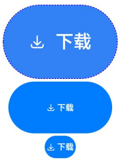
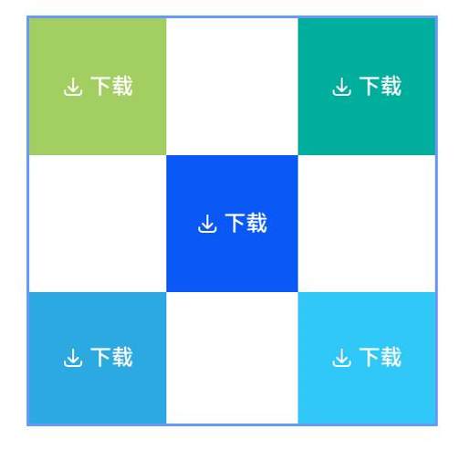

# 安全控件通用属性


安全控件的基础属性，用于设置安全控件通用的属性。


> **说明：**
>
> 该组件从API Version 10开始支持。后续版本如有新增内容，则采用上角标单独标记该内容的起始版本。


## iconSize

iconSize(value: Dimension): T

设置安全控件图标的尺寸。

**原子化服务API：** 从API version 11开始，该接口支持在原子化服务中使用。

**系统能力：** SystemCapability.ArkUI.ArkUI.Full

**参数：**

| 参数名 | 类型 | 必填 | 说明                   |
|------------|------|-------|---------|
| value | [Dimension](ts-types.md#dimension10) | 是 |安全控件上图标的尺寸。<br/>默认值：16vp|

**返回值：**

| 类型 | 说明 |
| -------- | -------- |
| T | 返回安全控件的属性。 |

## layoutDirection

layoutDirection(value: SecurityComponentLayoutDirection): T

设置安全控件图标和文字分布的方向。

**原子化服务API：** 从API version 11开始，该接口支持在原子化服务中使用。

**系统能力：** SystemCapability.ArkUI.ArkUI.Full

**参数：**

| 参数名 | 类型 | 必填 | 说明                   |
|------------|------|-------|---------|
| value | [SecurityComponentLayoutDirection](#securitycomponentlayoutdirection枚举说明) |是 | 安全控件上图标和文字分布的方向。<br/>默认值：SecurityComponentLayoutDirection.HORIZONTAL|

**返回值：**

| 类型 | 说明 |
| -------- | -------- |
| T | 返回安全控件的属性。 |

## position

position(value: Position): T

设置绝对定位，设置安全控件的左上角相对于父容器左上角的偏移位置。

**原子化服务API：** 从API version 11开始，该接口支持在原子化服务中使用。

**系统能力：** SystemCapability.ArkUI.ArkUI.Full

**参数：**

| 参数名 | 类型 | 必填 | 说明                   |
|------------|------|-------|---------|
| value | [Position](ts-types.md#position) |是 |安全控件的左上角相对于父容器左上角的偏移位置。<br/>默认值：<br/>{<br/>x: 0,<br/>y: 0<br/>}|

**返回值：**

| 类型 | 说明 |
| -------- | -------- |
| T | 返回安全控件的属性。 |

## markAnchor

markAnchor(value: Position): T

设置安全控件在位置定位时的锚点，以控件左上角作为基准点进行偏移。

**原子化服务API：** 从API version 11开始，该接口支持在原子化服务中使用。

**系统能力：** SystemCapability.ArkUI.ArkUI.Full

**参数：**

| 参数名 | 类型                   | 必填 | 说明                   |
|------------|------|-------|---------|
| value | [Position](ts-types.md#position) |是 |安全控件在位置定位时的锚点，以控件左上角作为基准点进行偏移。通常配合position和offset属性使用，单独使用时，效果类似offset。<br/>默认值：<br/>{<br/>x: 0,<br/>y: 0<br/>}|

**返回值：**

| 类型 | 说明 |
| -------- | -------- |
| T | 返回安全控件的属性。 |

## offset

offset(value: Position | Edges | LocalizedEdges): T

设置安全控件相对于自身布局位置的坐标偏移。

**原子化服务API：** 从API version 11开始，该接口支持在原子化服务中使用。

**系统能力：** SystemCapability.ArkUI.ArkUI.Full

**参数：**

| 参数名 | 类型                   | 必填 | 说明                   |
|------------|------|-------|---------|
| value | [Position](ts-types.md#position) \| [Edges<sup>12+</sup>](ts-types.md#edges12) \| [LocalizedEdges<sup>12+</sup>](ts-types.md#localizededges12) |是 |安全控件相对于自身布局位置的坐标偏移。设置此属性不会影响父容器的布局，仅在绘制过程中调整位置。<br/>默认值：<br/>{<br/>x: 0,<br/>y: 0<br/>}|

**返回值：**

| 类型 | 说明 |
| -------- | -------- |
| T | 返回安全控件的属性。 |

## fontSize

fontSize(value: Dimension): T

设置安全控件文字的尺寸。

**原子化服务API：** 从API version 11开始，该接口支持在原子化服务中使用。

**系统能力：** SystemCapability.ArkUI.ArkUI.Full

**参数：**

| 参数名 | 类型                   | 必填 | 说明                   |
|------------|------|-------|---------|
| value | [Dimension](ts-types.md#dimension10) |是 |安全控件上文字的尺寸。<br/>默认值：16fp|

**返回值：**

| 类型 | 说明 |
| -------- | -------- |
| T | 返回安全控件的属性。 |

## fontStyle

fontStyle(value: FontStyle): T

设置安全控件文字的样式。

**原子化服务API：** 从API version 11开始，该接口支持在原子化服务中使用。

**系统能力：** SystemCapability.ArkUI.ArkUI.Full

**参数：**

| 参数名 | 类型                   | 必填 | 说明                   |
|------------|------|-------|---------|
| value | [FontStyle](ts-appendix-enums.md#fontstyle) |是 |安全控件上文字的样式。<br/>默认值：FontStyle.Normal|

**返回值：**

| 类型 | 说明 |
| -------- | -------- |
| T | 返回安全控件的属性。 |

## fontWeight

fontWeight(value: number | FontWeight | string): T

设置安全控件文字粗细。

**原子化服务API：** 从API version 11开始，该接口支持在原子化服务中使用。

**系统能力：** SystemCapability.ArkUI.ArkUI.Full

**参数：**

| 参数名 | 类型                   | 必填 | 说明                   |
|------------|------|-------|---------|
| value | number \| [FontWeight](ts-appendix-enums.md#fontweight) \| string |是 |安全控件上文字粗细。<br/>默认值：FontWeight.Medium|

**返回值：**

| 类型 | 说明 |
| -------- | -------- |
| T | 返回安全控件的属性。 |

## fontFamily

fontFamily(value: string | Resource): T

设置安全控件文字的字体。

**原子化服务API：** 从API version 11开始，该接口支持在原子化服务中使用。

**系统能力：** SystemCapability.ArkUI.ArkUI.Full

**参数：**

| 参数名 | 类型                   | 必填 | 说明                   |
|------------|------|-------|---------|
| value | string \| [Resource](ts-types.md#resource) |是 |安全控件上文字的字体。<br/>默认字体：'HarmonyOS Sans'|

**返回值：**

| 类型 | 说明 |
| -------- | -------- |
| T | 返回安全控件的属性。 |

## fontColor

fontColor(value: ResourceColor): T

设置安全控件文字的颜色。

**原子化服务API：** 从API version 11开始，该接口支持在原子化服务中使用。

**系统能力：** SystemCapability.ArkUI.ArkUI.Full

**参数：**

| 参数名 | 类型                   | 必填 | 说明                   |
|------------|------|-------|---------|
| value | [ResourceColor](ts-types.md#resourcecolor) |是 |安全控件上文字的颜色。<br/>默认值：$r('sys.color.font_on_primary')|

**返回值：**

| 类型 | 说明 |
| -------- | -------- |
| T | 返回安全控件的属性。 |

## iconColor

iconColor(value: ResourceColor): T

设置安全控件图标的颜色。

**原子化服务API：** 从API version 11开始，该接口支持在原子化服务中使用。

**系统能力：** SystemCapability.ArkUI.ArkUI.Full

**参数：**

| 参数名 | 类型                   | 必填 | 说明                   |
|------------|------|-------|---------|
| value | [ResourceColor](ts-types.md#resourcecolor) |是 |安全控件上图标的颜色。<br/>默认值：$r('sys.color.icon_on_primary')|

**返回值：**

| 类型 | 说明 |
| -------- | -------- |
| T | 返回安全控件的属性。 |

## backgroundColor

backgroundColor(value: ResourceColor): T

设置安全控件的背景颜色。

**原子化服务API：** 从API version 11开始，该接口支持在原子化服务中使用。

**系统能力：** SystemCapability.ArkUI.ArkUI.Full

**参数：**

| 参数名 | 类型                   | 必填 | 说明                   |
|------------|------|-------|---------|
| value | [ResourceColor](ts-types.md#resourcecolor) |是 |安全控件的背景颜色。安全控件按钮背景色高八位的α值低于0x1a（例如0x1800ff00）时，安全控件按钮背景色高八位的α值会被系统强制调整为0xff。<br/>默认值：$r('sys.color.icon_emphasize')|

**返回值：**

| 类型 | 说明 |
| -------- | -------- |
| T | 返回安全控件的属性。 |

## borderStyle

borderStyle(value: BorderStyle): T

设置安全控件的边框的样式。

**原子化服务API：** 从API version 11开始，该接口支持在原子化服务中使用。

**系统能力：** SystemCapability.ArkUI.ArkUI.Full

**参数：**

| 参数名 | 类型                   | 必填 | 说明                   |
|------------|------|-------|---------|
| value | [BorderStyle](ts-appendix-enums.md#borderstyle) |是 |安全控件的边框的样式。<br/>默认不设置边框样式|

**返回值：**

| 类型 | 说明 |
| -------- | -------- |
| T | 返回安全控件的属性。 |

## borderWidth

borderWidth(value: Dimension): T

设置安全控件的边框的宽度。

**原子化服务API：** 从API version 11开始，该接口支持在原子化服务中使用。

**系统能力：** SystemCapability.ArkUI.ArkUI.Full

**参数：**

| 参数名 | 类型                   | 必填 | 说明                   |
|------------|------|-------|---------|
| value | [Dimension](ts-types.md#dimension10) |是 |安全控件的边框的宽度。<br/>默认不设置边框宽度|

**返回值：**

| 类型 | 说明 |
| -------- | -------- |
| T | 返回安全控件的属性。 |

## borderColor

borderColor(value: ResourceColor): T

设置安全控件的边框的颜色。

**原子化服务API：** 从API version 11开始，该接口支持在原子化服务中使用。

**系统能力：** SystemCapability.ArkUI.ArkUI.Full

**参数：**

| 参数名 | 类型                   | 必填 | 说明                   |
|------------|------|-------|---------|
| value | [ResourceColor](ts-types.md#resourcecolor) |是 |安全控件的边框的颜色。<br/>默认不设置边框颜色|

**返回值：**

| 类型 | 说明 |
| -------- | -------- |
| T | 返回安全控件的属性。 |

## borderRadius

borderRadius(value: Dimension): T

设置安全控件的边框圆角半径。

**原子化服务API：** 从API version 11开始，该接口支持在原子化服务中使用。

**系统能力：** SystemCapability.ArkUI.ArkUI.Full

**参数：**

| 参数名 | 类型                   | 必填 | 说明                   |
|------------|------|-------|---------|
| value |  [Dimension](ts-types.md#dimension10) |是 |安全控件的边框圆角半径。|

**返回值：**

| 类型 | 说明 |
| -------- | -------- |
| T | 返回安全控件的属性。 |

## borderRadius<sup>16+</sup>

borderRadius(radius: Dimension | BorderRadiuses): T

设置安全控件的边框圆角半径，支持分别设置四个圆角。

**原子化服务API：** 从API version 16开始，该接口支持在原子化服务中使用。

**系统能力：** SystemCapability.ArkUI.ArkUI.Full

**参数：**

| 参数名 | 类型                   | 必填 | 说明                   |
|------------|------|-------|---------|
| radius |  [Dimension](ts-types.md#dimension10) \| [BorderRadiuses](ts-types.md#borderradiuses9) |是 |安全控件的边框圆角半径。|

**返回值：**

| 类型 | 说明 |
| -------- | -------- |
| T | 返回安全控件的属性。 |

## padding

padding(value: Padding | Dimension): T

设置安全控件的内边距。

**原子化服务API：** 从API version 11开始，该接口支持在原子化服务中使用。

**系统能力：** SystemCapability.ArkUI.ArkUI.Full

**参数：**

| 参数名 | 类型                   | 必填 | 说明                   |
|------------|------|-------|---------|
| value | [Padding](ts-types.md#padding) \| [Dimension](ts-types.md#dimension10) |是 |安全控件的内边距。<br/>默认值：上下8vp, 左右16vp|

**返回值：**

| 类型 | 说明 |
| -------- | -------- |
| T | 返回安全控件的属性。 |

## align<sup>16+</sup>

align(alignType: Alignment): T

设置安全控件图标文本的对齐方式。

**原子化服务API：** 从API version 16开始，该接口支持在原子化服务中使用。

**系统能力：** SystemCapability.ArkUI.ArkUI.Full

**参数：**

| 参数名 | 类型                   | 必填 | 说明                   |
|------------|------|-------|---------|
| alignType | [Alignment](ts-appendix-enums.md#alignment) |是 |安全控件图标文本的对齐方式，图标文本作为整体在控件背托范围内进行对齐，UX显示受[padding](ts-securitycomponent-attributes.md#padding)影响。<br/>默认值：Alignment.Center|

**返回值：**

| 类型 | 说明 |
| -------- | -------- |
| T | 返回安全控件的属性。 |

## textIconSpace

textIconSpace(value: Dimension): T

设置安全控件中图标和文字的间距。

**原子化服务API：** 从API version 11开始，该接口支持在原子化服务中使用。

**系统能力：** SystemCapability.ArkUI.ArkUI.Full

**参数：**

| 参数名 | 类型                   | 必填 | 说明                   |
|------------|------|-------|---------|
| value | [Dimension](ts-types.md#dimension10) |是 |安全控件中图标和文字的间距。从API 14开始，若设置值为负值，则使用默认值。<br/>默认值：4vp|

**返回值：**

| 类型 | 说明 |
| -------- | -------- |
| T | 返回安全控件的属性。 |

## width<sup>11+</sup>

width(value: Length): T

设置安全控件自身的宽度，缺省时将根据元素内容自适配宽度。

**原子化服务API：** 从API version 12开始，该接口支持在原子化服务中使用。

**系统能力：** SystemCapability.ArkUI.ArkUI.Full

**参数：**

| 参数名 | 类型                   | 必填 | 说明                   |
|------------|------|-------|---------|
|value | [Length](ts-types.md#length) |是 |安全控件自身的宽度，缺省时将根据元素内容自适配宽度。若设置宽度小于当前属性组合下允许的最小宽度时，宽度会调整为设置值，此时按钮文本信息会自动换行，以保证安全控件显示的完整性。|

**返回值：**

| 类型 | 说明 |
| -------- | -------- |
| T | 返回安全控件的属性。 |

## height<sup>11+</sup>

height(value: Length): T

设置安全控件自身的高度，缺省时将根据元素内容自适配高度。

**原子化服务API：** 从API version 12开始，该接口支持在原子化服务中使用。

**系统能力：** SystemCapability.ArkUI.ArkUI.Full

**参数：**

| 参数名 | 类型                   | 必填 | 说明                   |
|------------|------|-------|---------|
| value | [Length](ts-types.md#length) |是|安全控件自身的高度，缺省时将根据元素内容自适配高度。若设置高度小于当前属性组合下允许的最小高度时，高度不会缩减到设置值，此时高度会大于设置高度，以保证安全控件显示的完整性。|

**返回值：**

| 类型 | 说明 |
| -------- | -------- |
| T | 返回安全控件的属性。 |

## size<sup>11+</sup>

size(value: SizeOptions): T

设置高宽尺寸，缺省时将根据元素内容自适配高宽尺寸。

**原子化服务API：** 从API version 12开始，该接口支持在原子化服务中使用。

**系统能力：** SystemCapability.ArkUI.ArkUI.Full

**参数：**

| 参数名 | 类型                   | 必填 | 说明                   |
|------------|------|-------|---------|
| value | [SizeOptions](ts-types.md#sizeoptions) |是 |高宽尺寸，缺省时将根据元素内容自适配高宽尺寸。若设置尺寸小于当前属性组合下允许的最小尺寸时，高度不会缩减到设置值，宽度会调整到设置值，此时按钮文本信息会自动换行，以保证安全控件显示的完整性。|

**返回值：**

| 类型 | 说明 |
| -------- | -------- |
| T | 返回安全控件的属性。 |

## constraintSize<sup>11+</sup>

constraintSize(value: ConstraintSizeOptions): T

设置约束尺寸，组件布局时，进行尺寸范围限制。

**原子化服务API：** 从API version 12开始，该接口支持在原子化服务中使用。

**系统能力：** SystemCapability.ArkUI.ArkUI.Full

**参数：**

| 参数名 | 类型                   | 必填 | 说明                   |
|------------|------|-------|---------|
| value | [ConstraintSizeOptions](ts-types.md#constraintsizeoptions) |是 |约束尺寸，组件布局时，进行尺寸范围限制。constraintSize的优先级高于Width和Height。取值结果参考[constraintSize取值对width/height影响](ts-universal-attributes-size.md)。<br>同width/height一样，若设置尺寸小于当前属性组合下允许的最小尺寸时, 高度不会缩减到设置值，宽度会调整到设置值，此时按钮文本信息会自动换行，以保证安全控件显示的完整性。<br>默认值：<br>{<br/>minWidth:&nbsp;0,<br/>maxWidth:&nbsp;Infinity,<br/>minHeight:&nbsp;0,<br/>maxHeight:&nbsp;Infinity<br/>}|

**返回值：**

| 类型 | 说明 |
| -------- | -------- |
| T | 返回安全控件的属性。 |

## alignRules<sup>16+</sup>

alignRules(alignRule: AlignRuleOption): T

指定设置在相对容器中子组件的对齐规则，仅当父容器为[RelativeContainer](ts-container-relativecontainer.md)时生效。

**原子化服务API：** 从API version 16开始，该接口支持在原子化服务中使用。

**系统能力：** SystemCapability.ArkUI.ArkUI.Full

**参数：**

| 参数名 | 类型                                        | 必填 | 说明                     |
| ------ | ------------------------------------------- | ---- | ------------------------ |
| alignRule | [AlignRuleOption](ts-universal-attributes-location.md#alignruleoption对象说明) | 是   | 指定设置在相对容器中子组件的对齐规则。 |

**返回值：**

| 类型 | 说明 |
| -------- | -------- |
| T | 返回安全控件的属性。 |

## alignRules<sup>16+</sup>

alignRules(alignRule: LocalizedAlignRuleOptions): T

指定设置在相对容器中子组件的对齐规则，仅当父容器为[RelativeContainer](ts-container-relativecontainer.md)时生效。该方法水平方向上以start和end分别替代上述[alignRules](#alignrules16)的left和right，以便在RTL模式下能镜像显示，建议使用该方法指定设置在相对容器中子组件的对齐规则。

**原子化服务API：** 从API version 16开始，该接口支持在原子化服务中使用。

**系统能力：** SystemCapability.ArkUI.ArkUI.Full

**参数：**

| 参数名 | 类型                                        | 必填 | 说明                     |
| ------ | ------------------------------------------- | ---- | ------------------------ |
| alignRule | [LocalizedAlignRuleOptions](ts-universal-attributes-location.md#localizedalignruleoptions12对象说明) | 是   | 指定设置在相对容器中子组件的对齐规则。 |

**返回值：**

| 类型 | 说明 |
| -------- | -------- |
| T | 返回安全控件的属性。 |

## id<sup>16+</sup>

id(description: string): T

组件的唯一标识，唯一性由使用者保证。

**原子化服务API：** 从API version 16开始，该接口支持在原子化服务中使用。

**系统能力：** SystemCapability.ArkUI.ArkUI.Full

**参数：**

| 名称   | 类型      | 必填 | 说明                       |
| ------ | -------- | -----|---------------------- |
| description | string   |  是  | 组件的唯一标识，唯一性由使用者保证。<br>默认值：''<br/> |

**返回值：**

| 类型 | 说明 |
| -------- | -------- |
| T | 返回安全控件的属性。 |

## chainMode<sup>16+</sup>

chainMode(direction: Axis, style: ChainStyle): T

指定以该组件为链头所构成的链的参数，仅当父容器为[RelativeContainer](ts-container-relativecontainer.md)时生效。

**原子化服务API：** 从API version 16开始，该接口支持在原子化服务中使用。

**系统能力：** SystemCapability.ArkUI.ArkUI.Full

**参数：**

| 参数名 | 类型                                        | 必填 | 说明                     |
| ------ | ------------------------------------------- | ---- | ------------------------ |
| direction | [Axis](ts-appendix-enums.md#axis) | 是   | 链的方向。 |
| style | [ChainStyle](ts-universal-attributes-location.md#chainstyle12) | 是   | 链的样式。 |

**返回值：**

| 类型 | 说明 |
| -------- | -------- |
| T | 返回安全控件的属性。 |

## minFontScale<sup>16+</sup>

minFontScale(scale: number | Resource): T

设置文本最小的字体缩放倍数。

**原子化服务API：** 从API version 16开始，该接口支持在原子化服务中使用。

**系统能力：** SystemCapability.ArkUI.ArkUI.Full

**参数：** 

| 参数名 | 类型                                          | 必填 | 说明                                          |
| ------ | --------------------------------------------- | ---- | --------------------------------------------- |
| scale  | number \| [Resource](ts-types.md#resource) | 是   | 文本最小的字体缩放倍数。<br/>取值范围：[0, 1]<br/>**说明：** <br/>设置的值小于0时，按值为0处理，即缩小不受限制；设置的值大于1，按值为1处理，即缩小不生效；取值范围外为异常值，默认不生效。 |

**返回值：**

| 类型 | 说明 |
| -------- | -------- |
| T | 返回安全控件的属性。 |

## maxFontScale<sup>16+</sup>

maxFontScale(scale: number | Resource): T

设置文本最大的字体缩放倍数。

**原子化服务API：** 从API version 16开始，该接口支持在原子化服务中使用。

**系统能力：** SystemCapability.ArkUI.ArkUI.Full

**参数：** 

| 参数名 | 类型                                          | 必填 | 说明                                          |
| ------ | --------------------------------------------- | ---- | --------------------------------------------- |
| scale  | number \| [Resource](ts-types.md#resource) | 是   | 文本最大的字体缩放倍数。<br/>取值范围：[1, +∞)<br/>**说明：** <br/>设置的值小于1时，按值为1处理，异常值默认不生效。 |

**返回值：**

| 类型 | 说明 |
| -------- | -------- |
| T | 返回安全控件的属性。 |

## minFontSize<sup>16+</sup>

minFontSize(minSize: number | string | Resource): T

设置文本最小显示字号。
- 配合[maxFontSize](#maxfontsize16)以及[maxLines](#maxlines16)或布局大小限制使用，可实现自适应字号，单独设置不生效。
- minFontSize小于或等于0时，自适应字号不生效。
- 自适应字号生效时，fontSize设置不生效。


**原子化服务API：** 从API version 16开始，该接口支持在原子化服务中使用。

**系统能力：** SystemCapability.ArkUI.ArkUI.Full

**参数：** 

| 参数名 | 类型                                                         | 必填 | 说明               |
| ------ | ------------------------------------------------------------ | ---- | ------------------ |
| value  | number&nbsp;\|&nbsp;string&nbsp;\|&nbsp;[Resource](ts-types.md#resource) | 是   | 文本最小显示字号。 |

**返回值：**

| 类型 | 说明 |
| -------- | -------- |
| T | 返回安全控件的属性。 |

## maxFontSize<sup>16+</sup>

maxFontSize(maxSize: number | string | Resource): T

设置文本最大显示字号。
- 配合[minFontSize](#minfontsize16)以及[maxLines](#maxlines16)或布局大小限制使用，可实现自适应字号，单独设置不生效。
- 自适应字号生效时，fontSize设置不生效。

**原子化服务API：** 从API version 16开始，该接口支持在原子化服务中使用。

**系统能力：** SystemCapability.ArkUI.ArkUI.Full

**参数：** 

| 参数名 | 类型                                                         | 必填 | 说明               |
| ------ | ------------------------------------------------------------ | ---- | ------------------ |
| value  | number&nbsp;\|&nbsp;string&nbsp;\|&nbsp;[Resource](ts-types.md#resource) | 是   | 文本最大显示字号。 |

**返回值：**

| 类型 | 说明 |
| -------- | -------- |
| T | 返回安全控件的属性。 |

## maxLines<sup>16+</sup>

maxLines(line: number): T

设置文本的最大行数。默认情况下，文本自动换行，指定此属性后，文本行数最大不会超过指定值。

**原子化服务API：** 从API version 16开始，该接口支持在原子化服务中使用。

**系统能力：** SystemCapability.ArkUI.ArkUI.Full

**参数：** 

| 参数名 | 类型   | 必填 | 说明             |
| ------ | ------ | ---- | ---------------- |
| value  | number | 是   | 文本的最大行数。<br/>取值范围：[1, +∞)<br/>**说明：** <br/>设置的值小于1时，按默认值100000处理。 |

**返回值：**

| 类型 | 说明 |
| -------- | -------- |
| T | 返回安全控件的属性。 |

## heightAdaptivePolicy<sup>16+</sup>

heightAdaptivePolicy(policy: TextHeightAdaptivePolicy): T

设置文本自适应高度的方式。

通过文本自适应高度的方式，实现文本大小自适应。

当设置为TextHeightAdaptivePolicy.MAX_LINES_FIRST时，优先使用[maxLines](#maxlines16)属性来调整文本高度。如果使用maxLines属性的布局大小超过了布局约束，则尝试在[minFontSize](#minfontsize16)和[maxFontSize](#maxfontsize16)的范围内缩小字体以显示更多文本，如果此时仍不能完整显示文本信息，安全控件会自适应调整高度以使得文本完整显示。

当设置为TextHeightAdaptivePolicy.MIN_FONT_SIZE_FIRST时，优先使用[minFontSize](#minfontsize16)属性来调整文本高度。如果使用minFontSize属性可以将文本布局在一行中，则尝试在minFontSize和[maxFontSize](#maxfontsize16)的范围内增大字体并使用最大可能的字体大小；如果使用minFontSize属性无法将文本布局在一行中，则尝试使用[maxLines](#maxlines16)属性进行布局，如果此时仍不能完整显示文本信息，安全控件会自适应调整高度以使得文本完整显示。

当设置为TextHeightAdaptivePolicy.LAYOUT_CONSTRAINT_FIRST时，优先使用布局约束来调整文本高度。如果布局大小超过布局约束，则尝试在[minFontSize](#minfontsize16)和[maxFontSize](#maxfontsize16)的范围内缩小字体以满足布局约束。如果将字体大小缩小到minFontSize后，布局大小仍然超过布局约束，则删除超过布局约束的行；如果设置了[maxLines](#maxlines16)属性，布局后行数不超过maxlines值（可能存在横向截断）；如果未设置maxlines属性值，布局后的行数不限制。

当布局无需调整即可完整显示文本时，控件文本不涉及自适应调节。

安全控件文字未完全显示时，点击不授权。

**原子化服务API：** 从API version 16开始，该接口支持在原子化服务中使用。

**系统能力：** SystemCapability.ArkUI.ArkUI.Full

**参数：** 

| 参数名 | 类型                                                         | 必填 | 说明                                                         |
| ------ | ------------------------------------------------------------ | ---- | ------------------------------------------------------------ |
| value  | [TextHeightAdaptivePolicy](ts-appendix-enums.md#textheightadaptivepolicy10) | 是   | 文本自适应高度的方式。<br/>默认值：TextHeightAdaptivePolicy.MAX_LINES_FIRST |

**返回值：**

| 类型 | 说明 |
| -------- | -------- |
| T | 返回安全控件的属性。 |

## enabled<sup>16+</sup>

enabled(respond: boolean): T

设置安全控件是否可交互。

**原子化服务API：** 从API version 16开始，该接口支持在原子化服务中使用。

**系统能力：** SystemCapability.ArkUI.ArkUI.Full

**参数：** 

| 参数名 | 类型    | 必填 | 说明                                                         |
| ------ | ------- | ---- | ------------------------------------------------------------ |
| value  | boolean | 是   | 值为true表示组件可交互，响应点击等操作。<br/>值为false表示组件不可交互，不响应点击等操作。<br/>默认值：true |

**返回值：**

| 类型 | 说明 |
| -------- | -------- |
| T | 返回安全控件的属性。 |


## SecurityComponentLayoutDirection枚举说明

**原子化服务API：** 从API version 11开始，该接口支持在原子化服务中使用。

**系统能力：** SystemCapability.ArkUI.ArkUI.Full

| 名称 | 值 | 说明 |
| -------- | -------- | -------- |
| HORIZONTAL | 0 | 安全控件上图标和文字分布的方向为水平排列。 |
| VERTICAL | 1 | 安全控件上图标和文字分布的方向为垂直排列。 |

## ButtonType枚举说明

按钮类型。

不同的按钮类型将影响属性[borderRadius（边框圆角半径）](ts-securitycomponent-attributes.md#borderradius)的设置效果。影响如下：

- 当按钮类型为Capsule时，borderRadius设置不生效，按钮圆角半径始终为宽、高中较小值的一半。
- 当按钮类型为Circle时：
  - 若同时设置了宽和高，则borderRadius不生效，且按钮半径为宽高中较小值的一半；
  - 若只设置宽、高中的一个，则borderRadius不生效，且按钮半径为所设宽或所设高值的一半；
  - 若不设置宽高或者borderRadius的值为负，borderRadius不生效，按钮半径根据具体布局确定。
- 在不设置borderRadius时，圆角矩形按钮的圆角半径大小保持默认值20vp不变，不随按钮高度变化而变化。

**原子化服务API：** 从API version 11开始，该接口支持在原子化服务中使用。

**系统能力：** SystemCapability.ArkUI.ArkUI.Full

| 名称      | 说明               |
| ------- | ------------------ |
| Capsule | 胶囊型按钮（圆角默认为高度的一半）。 |
| Circle  | 圆形按钮。              |
| Normal  | 普通按钮（默认不带圆角）。      |
| ROUNDED_RECTANGLE<sup>16+</sup> | 圆角矩形按钮（默认值：圆角半径大小20vp）。 |

## 示例

> **说明：**
> 为避免控件样式不合法导致授权失败，请开发者先了解安全控件样式的[约束与限制](../../../security/AccessToken/security-component-overview.md#约束与限制)。

### 示例1

设置SecurityComponent基础属性，生成一个保存控件

```ts
@Entry
@Component
struct Index {
  build() {
    Row() {
      Column({ space: 5 }) {
        // 生成一个保存按钮，并设置它的SecurityComponent属性
        SaveButton()
          .fontSize(35)
          .fontColor(Color.White)
          .iconSize(30)
          .layoutDirection(SecurityComponentLayoutDirection.HORIZONTAL)
          .borderWidth(1)
          .borderStyle(BorderStyle.Dashed)
          .borderColor(Color.Blue)
          .borderRadius(20)
          .fontWeight(100)
          .iconColor(Color.White)
          .padding({left:50, top:50, bottom:50, right:50})
          .textIconSpace(20)
          .backgroundColor(0x3282f6)
        SaveButton().size({width:200, height:100})
        SaveButton()
          .size({width:200, height:100})
          .align(Alignment.Start)
        SaveButton({ icon: SaveIconStyle.FULL_FILLED, text: SaveDescription.DOWNLOAD, buttonType: ButtonType.Normal })
          .size({ width: 150, height: 80 })
          .borderRadius({ topLeft: 20, topRight: 25, bottomRight: 30, bottomLeft: 35 })
        SaveButton().constraintSize({maxWidth:60})
      }.width('100%')
    }.height('100%')
  }
}
```



### 示例2

以容器和容器内组件作为锚点进行布局

```ts
@Entry
@Component
struct Index {
  build() {
    Row() {
      RelativeContainer() {
        SaveButton({ icon: SaveIconStyle.FULL_FILLED, text: SaveDescription.DOWNLOAD, buttonType: ButtonType.Normal })
          .width(100).height(100)
          .backgroundColor("#A3CF62")
          .alignRules({
            top: {anchor: "__container__", align: VerticalAlign.Top},
            left: {anchor: "__container__", align: HorizontalAlign.Start}
          })
          .id("row1")

        SaveButton({ icon: SaveIconStyle.FULL_FILLED, text: SaveDescription.DOWNLOAD, buttonType: ButtonType.Normal })
          .width(100).height(100)
          .backgroundColor("#00AE9D")
          .alignRules({
            top: {anchor: "__container__", align: VerticalAlign.Top},
            right: {anchor: "__container__", align: HorizontalAlign.End}
          })
          .id("row2")

        SaveButton({ icon: SaveIconStyle.FULL_FILLED, text: SaveDescription.DOWNLOAD, buttonType: ButtonType.Normal })
          .height(100)
          .backgroundColor("#0A59F7")
          .alignRules({
            top: {anchor: "row1", align: VerticalAlign.Bottom},
            left: {anchor: "row1", align: HorizontalAlign.End},
            right: {anchor: "row2", align: HorizontalAlign.Start}
          })
          .id("row3")

        SaveButton({ icon: SaveIconStyle.FULL_FILLED, text: SaveDescription.DOWNLOAD, buttonType: ButtonType.Normal })
          .backgroundColor("#2CA9E0")
          .alignRules({
            top: {anchor: "row3", align: VerticalAlign.Bottom},
            bottom: {anchor: "__container__", align: VerticalAlign.Bottom},
            left: {anchor: "__container__", align: HorizontalAlign.Start},
            right: {anchor: "row1", align: HorizontalAlign.End}
          })
          .id("row4")

        SaveButton({ icon: SaveIconStyle.FULL_FILLED, text: SaveDescription.DOWNLOAD, buttonType: ButtonType.Normal })
          .backgroundColor("#30C9F7")
          .alignRules({
            top: {anchor: "row3", align: VerticalAlign.Bottom},
            bottom: {anchor: "__container__", align: VerticalAlign.Bottom},
            left: {anchor: "row2", align: HorizontalAlign.Start},
            right: {anchor: "__container__", align: HorizontalAlign.End}
          })
          .id("row5")
      }
      .width(300).height(300)
      .margin({ left: 50 })
      .border({ width:2, color: "#6699FF" })
    }
    .height('100%')
  }
}
```

