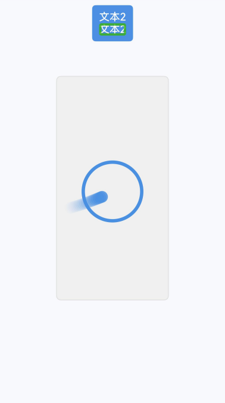

# 无障碍属性

设置组件的无障碍属性和事件，以充分利用无障碍功能。

>  **说明：**
>
>  从API version 10 开始支持。后续版本如有新增内容，则采用上角标单独标记该内容的起始版本。

## accessibilityGroup

accessibilityGroup(value: boolean):T

设置是否启用无障碍分组。启用无障碍分组后，组件及其子组件作为一整个可选组件，无障碍服务不再关注子组件内容。

若组件启用无障碍分组，当组件不包含通用文本属性，同时未设置[无障碍文本](#accessibilitytext)时，将默认拼接其子组件的通用文本属性作为组件的合并文本。若某一子组件没有通用文本属性，则忽略该子组件不进行拼接，此时合并文本不使用子组件的无障碍文本。

**卡片能力：** 从API version 12开始，该接口支持在ArkTS卡片中使用。

**原子化服务API：** 从API version 11开始，该接口支持在原子化服务中使用。

**系统能力：** SystemCapability.ArkUI.ArkUI.Full

**参数：**

| 参数名 | 类型    | 必填 | 说明                                                         |
| ------ | ------- | ---- | ------------------------------------------------------------ |
| value  | boolean | 是   | 无障碍分组，设置为true时表示该组件及其所有子组件为一整个可以选中的组件，无障碍服务将不再关注其子组件内容；设置为false表示不启用无障碍分组。<br/>默认值：false |

**返回值：**

| 类型 | 说明 |
| -------- | -------- |
| T | 返回当前对象。 |

## accessibilityGroup<sup>14+</sup>

accessibilityGroup(isGroup: boolean, accessibilityOptions: AccessibilityOptions):T

设置是否启用无障碍分组。启用无障碍分组后，组件及其子组件作为一整个可选组件，无障碍服务不再关注子组件内容。

若组件启用无障碍分组，当组件不包含通用文本属性，同时未设置[无障碍文本](#accessibilitytext)时，将默认拼接其子组件的通用文本属性作为组件的合并文本。若某一子组件没有通用文本属性，则忽略该子组件不进行拼接。

通过accessibilityPreferred启用优先拼接无障碍文本进行朗读后，将优先拼接其子组件的无障碍文本属性作为组件的合并文本。若某一子组件未设置无障碍文本，则继续拼接该子组件的通用文本属性，若该子组件没有通用文本属性，则忽略该子组件不进行拼接。

**卡片能力：** 从API version 14开始，该接口支持在ArkTS卡片中使用。

**原子化服务API：** 从API version 14开始，该接口支持在原子化服务中使用。

**系统能力：** SystemCapability.ArkUI.ArkUI.Full

**参数：**

| 参数名               | 类型                                                    | 必填 | 说明                                                         |
| -------------------- | ------------------------------------------------------- | ---- | ------------------------------------------------------------ |
| isGroup              | boolean                                                 | 是   | 无障碍分组，设置为true时表示该组件及其所有子组件为一整个可以选中的组件，无障碍服务将不再关注其子组件内容；设置为false表示不启用无障碍分组。<br/>默认值：false |
| accessibilityOptions | [AccessibilityOptions](#accessibilityoptions14对象说明) | 是   | accessibilityPreferred设置为true时，使应用优先拼接无障碍文本进行朗读；设置为false时，应用进行屏幕朗读时不会优先使用无障碍文本。<br/>默认值：false            |

**返回值：**

| 类型 | 说明 |
| -------- | -------- |
| T | 返回当前对象。 |

## AccessibilityOptions<sup>14+</sup>对象说明

**系统能力：** SystemCapability.ArkUI.ArkUI.Full

| 名称                   | 类型    | 只读 | 可选 | 说明                                                         |
| ---------------------- | ------- | ---- | ---- | ------------------------------------------------------------ |
| accessibilityPreferred | boolean | 否 | 是   | 若accessibilityPreferred设置为true，则深度遍历每个子节点时优先选择该子节点的无障碍文本accessibilityText。<br/>若无障碍文本为空则选择本身Text文本，最终将拼接完成的文本设置给accessibilityText与Text都为空的父节点。<br/>若accessibilityPreferred设置为false，表示不启用此功能。<br/>默认值：false |

## accessibilityText

accessibilityText(value: string):T

设置无障碍文本。当组件不包含文本属性时，开发人员可通过设置无障碍文本属性，使不包含文字信息的组件能够播报无障碍文本的内容。

**卡片能力：** 从API version 12开始，该接口支持在ArkTS卡片中使用。

**原子化服务API：** 从API version 11开始，该接口支持在原子化服务中使用。

**系统能力：** SystemCapability.ArkUI.ArkUI.Full

**参数：**

| 参数名 | 类型   | 必填 | 说明                                                         |
| ------ | ------ | ---- | ------------------------------------------------------------ |
| value  | string | 是   | 无障碍文本，当组件不包含文本属性时，屏幕朗读选中此组件时不播报，使用者无法清楚地知道当前选中了什么组件。为了解决此场景，开发人员可为不包含文字信息的组件设置无障碍文本，当屏幕朗读选中此组件时播报无障碍文本的内容，帮助屏幕朗读的使用者清楚地知道自己选中了什么组件。<br/>默认值：“”<br/>**说明：**<br/>若组件既拥有文本属性，又拥有无障碍文本属性，则组件被选中时，仅播报无障碍文本内容。<br/>若组件设置了无障碍分组属性为true，但是既没有无障碍文本属性，也没有文本属性，会对其子节点的组件进行文本拼接（深度优先）。<br/>不对无障碍文本属性进行拼接，如需优先拼接无障碍文本，则需设置accessibilityGroup的accessibilityPreferred。 |

**返回值：**

| 类型 | 说明 |
| -------- | -------- |
| T | 返回当前对象。 |

## accessibilityText<sup>12+</sup>

accessibilityText(text: Resource):T

设置无障碍文本，支持通过Resource引用资源文件。当组件不包含文本属性时，开发人员可通过设置无障碍文本属性，使不包含文字信息的组件能够播报无障碍文本的内容。

**卡片能力：** 从API version 12开始，该接口支持在ArkTS卡片中使用。

**原子化服务API：** 从API version 12开始，该接口支持在原子化服务中使用。

**系统能力：** SystemCapability.ArkUI.ArkUI.Full

**参数：**

| 参数名 | 类型   | 必填 | 说明                                                                                                                                                                                                                                                                   |
| ------ | ------ | ---- |----------------------------------------------------------------------------------------------------------------------------------------------------------------------------------------------------------------------------------------------------------------------|
| text  | [Resource](ts-types.md#resource) | 是   | 无障碍文本引用资源，当组件不包含文本属性时，屏幕朗读选中此组件时不播报，使用者无法清楚地知道当前选中了什么组件。为了解决此场景，开发人员可为不包含文字信息的组件设置无障碍文本，当屏幕朗读选中此组件时播报无障碍文本的内容，帮助屏幕朗读的使用者清楚地知道自己选中了什么组件。<br/>**说明：**<br/>若组件既拥有文本属性，又拥有无障碍文本属性，则组件被选中时，仅播报无障碍文本内容。<br/>若组件设置了无障碍分组属性为true，但是既没有无障碍文本属性，也没有文本属性，会对其子节点的组件进行文本拼接（深度优先）。<br/>不对无障碍文本属性进行拼接，如需优先拼接无障碍文本，则需设置accessibilityGroup的accessibilityPreferred。 |

**返回值：**

| 类型 | 说明 |
| -------- | -------- |
| T | 返回当前对象。 |


## accessibilityDescription

accessibilityDescription(value: string):T

设置无障碍说明。该属性用于为用户进一步说明当前组件，开发人员可为组件设置相对较详细的解释文本，帮助用户理解将要执行的操作。

**卡片能力：** 从API version 12开始，该接口支持在ArkTS卡片中使用。

**原子化服务API：** 从API version 11开始，该接口支持在原子化服务中使用。

**系统能力：** SystemCapability.ArkUI.ArkUI.Full

**参数：**

| 参数名 | 类型   | 必填 | 说明                                                         |
| ------ | ------ | ---- | ------------------------------------------------------------ |
| value  | string | 是   | 无障碍说明，用于为用户进一步说明当前组件，开发人员可为组件的该属性设置相对较详细的解释文本，帮助用户理解将要执行的操作。如帮助用户理解将要执行的操作可能导致什么后果，尤其是当这些后果无法从组件本身属性与无障碍文本中了解到时。若组件既拥有文本属性又拥有无障碍说明属性，则组件被选中时，先播报组件的文本属性，再播报无障碍说明属性的内容。<br/>默认值：“” |

**返回值：**

| 类型 | 说明 |
| -------- | -------- |
| T | 返回当前对象。 |

## accessibilityDescription<sup>12+</sup>

accessibilityDescription(description: Resource):T

设置无障碍说明，支持通过Resource引用资源文件。该属性用于为用户进一步说明当前组件，开发人员可为组件设置相对较详细的解释文本，帮助用户理解将要执行的操作。

**卡片能力：** 从API version 12开始，该接口支持在ArkTS卡片中使用。

**原子化服务API：** 从API version 12开始，该接口支持在原子化服务中使用。

**系统能力：** SystemCapability.ArkUI.ArkUI.Full

**参数：**

| 参数名 | 类型   | 必填 | 说明                                                                                                                                                                                    |
| ------ | ------ | ---- |---------------------------------------------------------------------------------------------------------------------------------------------------------------------------------------|
| description  | [Resource](ts-types.md#resource) | 是   | 无障碍说明引用资源，用于为用户进一步说明当前组件，开发人员可为组件的该属性设置相对较详细的解释文本，帮助用户理解将要执行的操作。如帮助用户理解将要执行的操作可能导致什么后果，尤其是当这些后果无法从组件本身属性与无障碍文本中了解到时。若组件既拥有文本属性又拥有无障碍说明属性，则组件被选中时，先播报组件的文本属性，再播报无障碍说明属性的内容。 |

**返回值：**

| 类型 | 说明 |
| -------- | -------- |
| T | 返回当前对象。 |

## accessibilityLevel

accessibilityLevel(value: string):T

设置无障碍重要性。该属性用于控制某个组件是否可被无障碍辅助服务所识别。

**卡片能力：** 从API version 12开始，该接口支持在ArkTS卡片中使用。

**原子化服务API：** 从API version 11开始，该接口支持在原子化服务中使用。

**系统能力：** SystemCapability.ArkUI.ArkUI.Full

**参数：**

| 参数名 | 类型   | 必填 | 说明                                                         |
| ------ | ------ | ---- | ------------------------------------------------------------ |
| value  | string | 是   | 无障碍重要性，用于控制某个组件是否可被无障碍辅助服务所识别。<br/>支持的值为：<br/>"auto"：当前组件由无障碍分组服务和ArkUl进行综合判断组件是否可被无障碍辅助服务所识别。<br/>"yes"：当前组件可被无障碍辅助服务所识别。<br/>"no"：当前组件不可被无障碍辅助服务所识别。<br/>"no-hide-descendants"：当前组件及其所有子组件不可被无障碍辅助服务所识别。<br/>默认值："auto"<br/>**说明：**<br/>当accessibilityLevel设置成"auto"时，组件是否可被无障碍辅助服务所识别取决于以下多方面因素：<br/>1. 组件是否可被识别由无障碍辅助服务内部判断，自行选择。<br/>2. 若组件的父组件accessibilityGroup属性中isGroup设置为true，无障碍服务将不再关注其子组件内容，组件不可被无障碍辅助服务所识别。<br/>3. 若组件的父组件accessibilityLevel属性设置为"no-hide-descendants"，组件不可被无障碍辅助服务所识别。 |

**返回值：**

| 类型 | 说明 |
| -------- | -------- |
| T | 返回当前对象。 |

## accessibilityVirtualNode<sup>11+</sup>

accessibilityVirtualNode(builder: CustomBuilder):T

设置无障碍虚拟子节点。对自绘制组件传入一个自定义的CustomBuilder，该CustomBuilder中的组件在后端仅做布局不做显示，辅助应用获取无障碍节点信息时会返回CustomBuilder中的节点信息。

**卡片能力：** 从API version 12开始，该接口支持在ArkTS卡片中使用。

**原子化服务API：** 从API version 11开始，该接口支持在原子化服务中使用。

**系统能力：** SystemCapability.ArkUI.ArkUI.Full

**参数：**

| 参数名 | 类型   | 必填 | 说明                                                         |
| ------ | ------ | ---- | ------------------------------------------------------------ |
| builder  | [CustomBuilder](ts-types.md#custombuilder8) | 是   | 无障碍虚拟子节点，使开发者可以对自绘制组件传入一个自定义的CustomBuilder，该CustomBuilder中的组件在后端仅做布局不做显示，辅助应用获取无障碍节点信息时会返回CustomBuilder中的节点信息。 |

**返回值：**

| 类型 | 说明 |
| -------- | -------- |
| T | 返回当前对象。 |

## accessibilityChecked<sup>13+</sup>

accessibilityChecked(isCheck: boolean):T

无障碍节点是否选中的状态维护，用于支持多选的情况使用，表示组件是否被选中。

**卡片能力：** 从API version 13开始，该接口支持在ArkTS卡片中使用。

**原子化服务API：** 从API version 13开始，该接口支持在原子化服务中使用。

**系统能力：** SystemCapability.ArkUI.ArkUI.Full

**参数：**

| 参数名  | 类型    | 必填 | 说明                                                         |
| ------- | ------- | ---- | ------------------------------------------------------------ |
| isCheck | boolean | 是   | 用于表示组件是否被选中。<br/>支持的值为：<br/>true：当前组件被选中。<br/>false：当前组件未被选中。<br/>undefined：由组件自行确定选中状态。<br/>默认值：undefined <br/>**说明：**<br/>1. 使用该接口设置true或false后，会默认修改该组件的checkable属性为true。<br/>2. accessibilityChecked属性代表组件是多选模式，而[accessibilitySelected](ts-universal-attributes-accessibility.md#accessibilityselected13)属性代表组件是单选模式，组件不能同时存在两种选择模式，会造成无障碍状态冲突，导致屏幕朗读等无障碍辅助应用无法正确识别选中状态。如使用当前接口设置组件为多选模式（设置为true、false），则需要保证未使用accessibilitySelected函数设置属性为true或者false，如果已设置，需使用accessibilitySelected函数设置accessibilitySelected属性为undefined模式。 |

**返回值：**

| 类型 | 说明 |
| -------- | -------- |
| T | 返回当前对象。 |

## accessibilitySelected<sup>13+</sup>

accessibilitySelected(isSelect: boolean):T

无障碍节点是否选中的状态维护，用于支持单选的情况使用，表示组件是否被选中。

**卡片能力：** 从API version 13开始，该接口支持在ArkTS卡片中使用。

**原子化服务API：** 从API version 13开始，该接口支持在原子化服务中使用。

**系统能力：** SystemCapability.ArkUI.ArkUI.Full

**参数：**

| 参数名   | 类型    | 必填 | 说明                                                         |
| -------- | ------- | ---- | ------------------------------------------------------------ |
| isSelect | boolean | 是   | 用于表示组件是否被选中。<br/>支持的值为：<br/>true：当前组件被选中。<br/>false：当前组件未被选中。<br/>undefined：由组件自行确定选中状态。<br/>默认值：undefined <br/>**说明：**<br/>1. [accessibilityChecked](ts-universal-attributes-accessibility.md#accessibilitychecked13)属性代表组件是多选模式，而accessibilitySelected属性代表组件是单选模式，组件不能同时存在两种选择模式，会造成无障碍状态冲突，导致屏幕朗读等无障碍辅助应用无法正确识别选中状态。如使用当前接口设置组件为单选模式（true、false），则需要保证未使用accessibilityChecked函数设置属性为true或者false，如果已设置，需使用accessibilityChecked函数设置accessibilityChecked属性为undefined模式。 |

**返回值：**

| 类型 | 说明 |
| -------- | -------- |
| T | 返回当前对象。 |

## accessibilityRole<sup>18+</sup>

accessibilityRole(role: AccessibilityRoleType):T

设置无障碍组件类型，特定组件类型有特定的朗读方式，可以根据应用诉求，修改组件类型，用于控制无障碍模式下对组件的朗读方式和朗读内容。

**卡片能力：** 从API version 18开始，该接口支持在ArkTS卡片中使用。

**原子化服务API：** 从API version 18开始，该接口支持在原子化服务中使用。

**系统能力：** SystemCapability.ArkUI.ArkUI.Full

**参数：**

| 参数名   | 类型    | 必填 | 说明                                                         |
| -------- | ------- | ---- | ------------------------------------------------------------ |
| role | [AccessibilityRoleType](ts-universal-attributes-accessibility.md#accessibilityroletype18枚举说明) | 是   | 屏幕朗读播报的组件类型，如按钮、图表。具体类型可由开发者自定义。 |

**返回值：**

| 类型 | 说明 |
| -------- | -------- |
| T | 返回当前对象。 |

## AccessibilityRoleType<sup>18+</sup>枚举说明

定义组件的屏幕朗读功能角色类型。

**原子化服务API：** 从API version 18开始，该接口支持在原子化服务中使用。

**系统能力：** SystemCapability.ArkUI.ArkUI.Full

| 名称 | 值  | 说明             |
| ---- | ---- | ------------------ |
| ACTION_SHEET | 0 | 列表弹窗。 |
| ALERT_DIALOG | 1 | 显示警告弹窗组件。 |
| INDEXER_COMPONENT | 2 | 索引器组件。 |
| BADGE_COMPONENT | 3 | 信息标记组件。 |
| BLANK  | 4 | 空白填充组件。 |
| BUTTON | 5 | 按钮。 |
| BACK_BUTTON | 6 | 大图页返回按钮。 |
| SHEET_DRAG_BAR | 7 | 滑动条。 |
| CALENDAR_PICKER | 8 | 日历选择器组件。 |
| CALENDAR | 9 | 日历。 |
| CANVAS | 10 | 提供画布组件。 |
| CANVAS_GRADIENT | 11 | 渐变对象。 |
| CANVAS_PATTERN | 12 | 通过指定图像和重复方式创建图片填充的模板。 |
| CHECKBOX | 13 | 提供多选框组件。 |
| CHECKBOX_GROUP | 14 | 多选框群组。 |
| CIRCLE | 15 | 用于绘制圆形的组件。|
| COLUMN_SPLIT | 16 | 将子组件纵向布局，并在每个子组件之间插入一根横向的分割线。 |
| COLUMN | 17 | 沿垂直方向布局的容器。 |
| CANVAS_RENDERING_CONTEXT_2D | 18 | 用于在画布组件上绘制矩形、文本、图片等。 |
| CHART | 19 | 图表组件。 |
| COUNTER | 20 | 计数器组件。 |
| CONTAINER_MODAL | 21 | 模态容器。 |
| DATA_PANEL | 22 | 数据面板组件。 |
| DATE_PICKER | 23 | 选择日期的滑动选择器组件。 |
| DIALOG | 24 | 弹出框。 |
| DIVIDER | 25 | 提供分隔器组件。 |
| DRAG_BAR | 26 | 拖拽条。 |
| EFFECT_COMPONENT | 27 | 特效合并容器组件。 |
| ELLIPSE | 28 | 椭圆绘制组件。 |
| FLEX | 29 | 以弹性方式布局子组件的容器组件。 |
| FLOW_ITEM | 30 | 瀑布流组件的子组件。 |
| FORM_COMPONENT | 31 | 提供卡片组件。 |
| FORM_LINK | 32 | 静态卡片交互组件。 |
| GAUGE | 33 | 数据量规图表组件。 |
| GRID | 34 | 网格容器。 |
| GRID_COL | 35 | 栅格子组件。 |
| GRID_CONTAINER | 36 | 纵向排布栅格布局容器。 |
| GRID_ITEM | 37 | 网格容器中单项内容容器。 |
| GRID_ROW | 38 | 栅格容器组件。 |
| HYPERLINK | 39 | 超链接组件。 |
| IMAGE | 40 | 图片组件。 |
| IMAGE_ANIMATOR | 41 | 提供帧动画组件。 |
| IMAGE_BITMAP | 42 | 存储canvas渲染的像素数据。 |
| IMAGE_DATA | 43 | 存储canvas渲染的像素数据。 |
| IMAGE_SPAN | 44 | 用于显示行内图片。 |
| LABEL | 45 | 标签。 |
| LINE | 46 | 线型。 |
| LIST | 47 | 列表。|
| LIST_ITEM | 48 | 用来展示列表具体item。 |
| LIST_ITEM_GROUP | 49 | 用来展示列表item分组。 |
| LOADING_PROGRESS | 50 | 用于显示加载动效的组件。 |
| MARQUEE | 51 | 跑马灯组件。 |
| MATRIX2D | 52 | 矩阵对象。 |
| MENU | 53 | 菜单。 |
| MENU_ITEM | 54 | 菜单项。 |
| MENU_ITEM_GROUP | 55 | 菜单项分组。 |
| NAV_DESTINATION | 56 | 显示Navigation的内容区。 |
| NAV_ROUTER | 57 | 导航组件。 |
| NAVIGATION | 58 | 路由导航的根视图容器。 |
| NAVIGATION_BAR | 59 | 导航栏。 |
| NAVIGATION_MENU | 60 | 导航菜单。 |
| NAVIGATOR | 61 | 路由容器组件。 |
| OFFSCREEN_CANVAS | 62 | 用于自定义绘制图形。 |
| OFFSCREEN_CANVAS_RENDERING_CONTEXT2D | 63 | 2D绘制对象，用于在画布组件上绘制矩形、文本、图片等。 |
| OPTION | 64 | 具体项目。 |
| PANEL | 65 | 可滑动面板。 |
| PAPER_PAGE | 66 | 页面。 |
| PATH | 67 | 路径绘制组件。 |
| PATH2D | 68 | 路径对象。 |
| PATTERN_LOCK | 69 | 图案密码锁组件。 |
| PICKER | 70 | 选择器。 |
| PICKER_VIEW | 71 | 选择器视图。 |
| PLUGIN_COMPONENT | 72 | 新增插件组件。 |
| POLYGON | 73 | 多边形绘制组件。 |
| POLYLINE | 74 | 折线绘制组件。 |
| POPUP | 75 | 显示特定样式气泡。 |
| PROGRESS | 76 | 文本下载按钮。 |
| QRCODE | 77 | 二维码。 |
| RADIO | 78 | 单选框。 |
| RATING | 79 | 提供在给定范围内选择评分的组件。 |
| RECT | 80 | 矩形绘制组件。 |
| REFRESH | 81 | 下拉刷新容器组件。 |
| RELATIVE_CONTAINER | 82 | 相对布局组件。 |
| REMOTE_WINDOW | 83 | 远程控制窗口组件。 |
| RICH_EDITOR | 84 | 支持图文混排和文本交互式编辑的组件。 |
| RICH_TEXT | 85 | 富文本组件。 |
| ROLE_PAGER | 86 | 分页。 |
| ROW | 87 | 沿水平方向布局容器。 |
| ROW_SPLIT | 88 | 将子组件横向布局，并在每个子组件之间插入一根纵向的分割线。 |
| SCROLL | 89 | 可滚动的容器组件。 |
| SCROLL_BAR | 90 | 滚动条。 |
| SEARCH | 91 | 搜索框组件。 |
| SEARCH_FIELD | 92 | 搜索框。 |
| SELECT | 93 | 下拉选择菜单组件。 |
| SHAPE | 94 | 绘制组件的父组件。 |
| SIDEBAR_CONTAINER | 95 | 提供侧边栏可以显示和隐藏的侧边栏容器。 |
| SLIDER | 96 | 垂直方向的滑动条。 |
| SPAN | 97 | 用于显示行内文本的组件。 |
| STACK | 98 | 堆叠容器。 |
| STEPPER | 99 | 步骤导航器组件。 |
| STEPPER_ITEM | 100 | 用作Stepper组件的页面子组件。 |
| SWIPER | 101 | 滑块视图容器。 |
| SWIPER_INDICATOR | 102 | 定义 Swiper 组件的导航指示器。 |
| SWITCH | 103 | 开关。 |
| SYMBOL_GLYPH | 104 | 显示图标小符号的组件。 |
| TAB_CONTENT | 105 | 仅在Tabs中使用，对应一个切换页签的内容视图。 |
| TAB_BAR | 106 | 页签栏。 |
| TABS | 107 | 通过页签进行内容视图切换的容器组件。 |
| TEXT | 108 | 文本。 |
| TEXT_CLOCK | 109 | 文本时钟组件。 |
| TEXT_ENTRY | 110 | 文本输入。 |
| TEXT_INPUT | 111 | 输入框组件。 |
| TEXT_PICKER | 112 | 文本类滑动选择器组件。 |
| TEXT_TIMER | 113 | 通过文本显示计时信息并控制其计时器状态的组件。 |
| TEXT_AREA | 114 | 输入区域组件。 |
| TEXT_FIELD | 115 | 文本框。 |
| TIME_PICKER | 116 | 时间选择组件。 |
| TITLE_BAR | 117 | 标题栏。 |
| TOGGLER | 118 | 状态组件。 |
| UI_EXTENSION_COMPONENT | 119 | 用户界面扩展组件。 |
| VIDEO | 120 | 用于播放视频文件并控制其播放状态的组件。 |
| WATER_FLOW | 121 | 瀑布流容器。 |
| WEB | 122 | 加载网页组件。 |
| XCOMPONENT | 123 | 自定义渲染。 |
| ROLE_NONE | 124 | NULL。 |

## accessibilityNextFocusId<sup>18+</sup>

accessibilityNextFocusId(nextId: string):T

指定走焦过程中组件的下一个焦点。

**卡片能力：** 从API version 18开始，该接口支持在ArkTS卡片中使用。

**原子化服务API：** 从API version 18开始，该接口支持在原子化服务中使用。

**系统能力：** SystemCapability.ArkUI.ArkUI.Full

**参数：**

| 参数名 | 类型   | 必填 | 说明                                                         |
| ------ | ------ | ---- | ------------------------------------------------------------ |
| nextId | string | 是   | 下一个被指定聚焦组件的[唯一标识id](ts-universal-attributes-component-id.md#id)。若唯一标识id无对应组件，则设置的accessibilityNextFocusId不存在，设置无效。 |

**返回值：**

| 类型 | 说明 |
| -------- | -------- |
| T | 返回当前对象。 |

## accessibilityDefaultFocus<sup>18+</sup>

accessibilityDefaultFocus(focus: boolean):T

设置屏幕朗读当前页默认首焦点。

**卡片能力：** 从API version 18开始，该接口支持在ArkTS卡片中使用。

**原子化服务API：** 从API version 18开始，该接口支持在原子化服务中使用。

**系统能力：** SystemCapability.ArkUI.ArkUI.Full

**参数：**

| 参数名 | 类型    | 必填 | 说明                                                         |
| ------ | ------- | ---- | ------------------------------------------------------------ |
| focus  | boolean | 是   | 设置屏幕朗读当前页默认首焦点。值为true则表示该组件为当前页默认首焦点，值为false或其他值无效。 |

**返回值：**

| 类型 | 说明 |
| -------- | -------- |
| T | 返回当前对象。 |

## accessibilityUseSamePage<sup>18+</sup>

accessibilityUseSamePage(pageMode: AccessibilitySamePageMode):T

针对跨进程嵌入式显示的组件，例如EmbeddedComponent，其子树场景中出现的跳焦问题，可通过设置accessibilityUseSamePage属性解决。因跨进程嵌入式显示的组件启动进程的page事件与宿主page事件发送时序不一致，可能导致焦点从当前组件移至另一组件，此现象称为“跳焦”。

**卡片能力：** 从API version 18开始，该接口支持在ArkTS卡片中使用。

**原子化服务API：** 从API version 18开始，该接口支持在原子化服务中使用。

**系统能力：** SystemCapability.ArkUI.ArkUI.Full

**参数：**

| 参数名   | 类型                                                         | 必填 | 说明                                             |
| -------- | ------------------------------------------------------------ | ---- | ------------------------------------------------ |
| pageMode | [AccessibilitySamePageMode](#accessibilitysamepagemode18枚举说明) | 是   | 当前跨进程嵌入式显示的组件和宿主应用的同page模式。 |

**返回值：**

| 类型 | 说明 |
| -------- | -------- |
| T | 返回当前对象。 |

## AccessibilitySamePageMode<sup>18+</sup>枚举说明

当前跨进程嵌入式显示的组件和宿主应用的同page模式。

**原子化服务API：** 从API version 18开始，该接口支持在原子化服务中使用。

**系统能力：** SystemCapability.ArkUI.ArkUI.Full

| 名称        | 值   | 说明                                                         |
| ----------- | ---- | ------------------------------------------------------------ |
| SEMI_SILENT | 0    | 跨进程嵌入式显示的组件拉起来的进程的page事件中如果是首次加载页面或者该事件页面的根节点发送的page事件会被忽略。 |
| FULL_SILENT | 1    | 跨进程嵌入式显示的组件将忽略所有的page事件。                                      |

## accessibilityScrollTriggerable<sup>18+</sup>

accessibilityScrollTriggerable(isTriggerable: boolean):T

设置无障碍节点是否支持屏幕朗读滚动操作。当屏幕朗读在焦点切换时，若容器内当前页面无可聚焦的组件，会发起一次自动滚动操作。

**卡片能力：** 从API version 18开始，该接口支持在ArkTS卡片中使用。

**原子化服务API：** 从API version 18开始，该接口支持在原子化服务中使用。

**系统能力：** SystemCapability.ArkUI.ArkUI.Full

**参数：**

| 参数名         |  类型    | 必填 | 说明                                                         |
| -------------- | ------- | ---- | ------------------------------------------------------------ |
| isTriggerable  | boolean | 是   | 用于表示组件是否支持该能力。<br/>支持的值为：<br/>true：屏幕朗读焦点切换而容器内当前页面无可聚焦的组件时，需要自动滚动操作。<br/>false：屏幕朗读焦点切换而容器内当前页面无可聚焦的组件时，不需要自动滚动操作。<br/>undefined：还原默认值。<br/>默认值：true。<br/>**说明：**<br/>1. 该属性不影响原先无障碍节点属性中的scrollable。<br/>2. 组件最终在屏幕朗读下的滚动逻辑由屏幕朗读最终根据该属性和组件是否支持scroll来决定。<br/>3. 该属性为通用属性，所有基础组件均可配置。建议配置的滚动组件类型，如List，Grid，Scroll，Waterflow等。|

**返回值：**

| 类型 | 说明 |
| -------- | -------- |
| T | 返回当前对象。 |

## accessibilityTextHint<sup>12+</sup>

accessibilityTextHint(value: string):T

设置组件的文本提示信息，供无障碍辅助应用查询。

**卡片能力：** 从API version 12开始，该接口支持在ArkTS卡片中使用。

**原子化服务API：** 从API version 12开始，该接口支持在原子化服务中使用。

**系统能力：** SystemCapability.ArkUI.ArkUI.Full

**参数：**

| 参数名         |  类型    | 必填 | 说明                                                         |
| -------------- | ------- | ---- | ------------------------------------------------------------ |
| value  | string | 是   | 组件的文本提示信息，供无障碍辅助应用查询。 |

**返回值：**

| 类型 | 说明 |
| -------- | -------- |
| T | 返回当前对象。 |

## accessibilityFocusDrawLevel<sup>19+</sup>

accessibilityFocusDrawLevel(drawLevel: FocusDrawLevel):T

无障碍焦点绿框的绘制层级设置功能。

> **说明：**
>
> 1. 在聚焦节点层级绘制获焦无障碍绿框，默认使用该层级绘制，由于绘制组件数顺序以及图形绘制顺序，绘制绿框会被父组件或者z序更高的兄弟组件遮挡裁切。
>
> 2. 在Z序顶层绘制绿框情况下，可以避免由于组件遮挡、裁切导致无障碍绿框被裁切遮挡。但由于具备较高的绘制层级，如果需要交互过程中，需要遮挡当前获焦的组件，并且不希望显示无障碍绿框则不适合使用这种配置。


**卡片能力：** 从API version 19开始，该接口支持在ArkTS卡片中使用。

**原子化服务API：** 从API version 19开始，该接口支持在原子化服务中使用。

**系统能力：** SystemCapability.ArkUI.ArkUI.Full

**参数：**

| 参数名   | 类型    | 必填 | 说明                                                         |
| -------- | ------- | ---- | ------------------------------------------------------------ |
| drawLevel | [FocusDrawLevel](ts-appendix-enums.md#focusdrawlevel19) | 是   | 无障碍绘制能力，默认情况下绘制聚焦节点本身。 |

**返回值：**

| 类型 | 说明 |
| -------- | -------- |
| T | 返回当前对象。 |

## 示例

### 示例1（设置无障碍文本和无障碍说明）

该示例主要演示accessibilityText无障碍文本和accessibilityDescription无障碍说明的播报内容。

```ts
// xxx.ets
@Entry
@Component
struct Index {

  @Builder customAccessibilityNode() {
    Column() {
      Text(`virtual node`)
    }
    .width(10)
    .height(10)
  }

  build() {
    Row() {
      Column() {
        Text("文本1")
          .fontSize(50)
          .fontWeight(FontWeight.Bold)
        Text("文本2")
          .fontSize(50)
          .fontWeight(FontWeight.Bold)
      }
      .width('100%')
      .accessibilityGroup(true)
      .accessibilityLevel("yes")
      .accessibilityText("分组") // 无障碍文本的内容，若组件既拥有文本属性又拥有无障碍文本属性，则组件被选中时，仅播报无障碍文本内容。
      .accessibilityDescription("Column组件可以被选中，播报的内容是“分组”")
      .accessibilityVirtualNode(this.customAccessibilityNode)
      .accessibilityChecked(true)
      .accessibilitySelected(undefined)
    }
    .height('100%')
  }
}
```

### 示例2（设置无障碍组）

该示例主要演示优先使用子组件的无障碍文本进行朗读。

```ts
// xxx.ets
@Entry
@Component
struct Focus {
  build() {
    Column({ space: 10 }) {
      Text('123456')
        .focusable(true)
        .borderRadius(5)
        .accessibilityText("有accessibility有text优先读accessibility")
        .accessibilityLevel("yes")
      Button().accessibilityLevel("yes").accessibilityText("accessibility无text 读accessibility")
      Button("无accessibility有text 读text").accessibilityLevel("yes")
      Button()
      Button('btn123').accessibilityText("有accessibility有text btn123").accessibilityLevel("yes")
      Button('btn123').accessibilityLevel("yes")
    }
    .accessibilityGroup(true, { accessibilityPreferred: true })
    .borderWidth(5)
    .width('100%')
    .height('100%')
  }
}
```

### 示例3（设置首焦点和组件的下一个焦点）

该示例主要演示accessibilityDefaultFocus屏幕朗读当前页默认首焦点和accessibilityNextFocusId走焦过程中组件的下一个焦点。

```ts
// xxx.ets
@Entry
@Component
struct Index {
  build() {
    Column({ space: 20 }) {
      Text('Text Demo 1')
        .fontSize(50)
        .accessibilityLevel('yes')
        .accessibilityNextFocusId('text3')
      Text('Text Demo 2')
        .id('text2')
        .fontSize(50)
        .accessibilityLevel('yes')
        .accessibilityDefaultFocus(true)  // 设置该组件为屏幕朗读当前页默认首焦点
        .accessibilityNextFocusId('text4')
      Text('Text Demo 3')
        .id('text3')
        .fontSize(50)
        .accessibilityLevel('yes')
        .accessibilityNextFocusId('text2')
      Text('Text Demo 4')
        .id('text4')
        .fontSize(50)
        .accessibilityLevel('yes')
    }
    .height('100%')
    .width('100%')
  }
}
```

### 示例4（设置无障碍组件类型和文本提示信息）

该示例主要演示accessibilityRole无障碍组件类型和accessibilityTextHint供无障碍辅助应用查询的组件的文本提示信息。

```ts
// xxx.ets
@Entry
@Component
struct Index {
  @State isDownloading: boolean = false;
  @State hintStr: string = '点击开始下载';

  build() {
    Column({ space: 20 }) {
      Button(this.isDownloading ? '下载中' : '点击下载')
        .accessibilityLevel('yes')
        .accessibilityTextHint(this.hintStr)
        .onClick(() => {
          this.isDownloading = !this.isDownloading;
          this.hintStr = this.isDownloading ? '状态变为下载中' : '状态变为暂停下载';
        })
      TextInput({ placeholder: '请输入手机号码' })
        .accessibilityLevel('yes')
        .accessibilityTextHint('请输入11位手机号码')
        .width('80%')
      Text('按照按钮类型播报')
        .accessibilityLevel('yes')
        .accessibilityRole(AccessibilityRoleType.BUTTON)
        .accessibilityTextHint('屏幕朗读播报时，该组件将按照按钮类型进行播报')
        .fontSize(30)
    }
    .height('100%')
    .width('100%')
  }
}
```

### 示例5（设置无障碍屏幕朗读滚动和焦点绿框绘制）

该示例主要演示accessibilityScrollTriggerable设置无障碍节点是否支持屏幕朗读滚动、accessibilityFocusDrawLevel设置无障碍焦点绿框的绘制层级和accessibilityUseSamePage设置跨进程嵌入式显示的组件,如[EmbeddedComponent](ts-container-embedded-component.md)的accessibilityUseSamePage属性。

```ts
// xxx.ets
import { Want } from '@kit.AbilityKit';

@Entry
@Component
struct Index {
  @State message: string = 'Message: ';
  private want: Want = {
    bundleName: 'com.example.embeddeddemo',
    abilityName: 'ExampleEmbeddedAbility',
  }

  build() {
    Row() {
      List() {
        ListItem() {
          Column() {
            Text(this.message)
              .fontSize(18)
              .fontColor('#2D2D2D')
              .fontWeight(FontWeight.Medium)
            Column() {
              EmbeddedComponent(this.want, EmbeddedType.EMBEDDED_UI_EXTENSION)
                .width('100%')
                .height('90%')
                .onTerminated((info) => {
                  this.message = 'Termination: code = ' + info.code + ', want = ' + JSON.stringify(info.want);
                })
                .onError((error) => {
                  this.message = 'Error: code = ' + error.code;
                })
                .accessibilityUseSamePage(AccessibilitySamePageMode.FULL_SILENT)
                .width('90%')
                .height('50%')
                .backgroundColor('#F0F0F0')
                .borderRadius(8)
                .borderWidth(1)
                .borderColor('#D9D9D9')

              Stack() {
                Column() {
                  Text('文本1')
                    .fontSize(18)
                    .fontColor('#2D2D2D')
                    .fontWeight(FontWeight.Medium)
                  Text('文本1')
                    .fontSize(18)
                    .fontColor('#2D2D2D')
                    .fontWeight(FontWeight.Medium)
                    .accessibilityFocusDrawLevel(FocusDrawLevel.TOP)
                }
                .padding({ top: 8, bottom: 8 })

                Column() {
                  Text('文本2')
                    .fontSize(18)
                    .fontColor('#FFFFFF')
                    .fontWeight(FontWeight.Medium)
                  Text('文本2')
                    .fontSize(18)
                    .fontColor('#FFFFFF')
                    .fontWeight(FontWeight.Medium)
                }
                .backgroundColor('#4A90E2')
                .padding({
                  left: 12,
                  right: 12,
                  top: 10,
                  bottom: 10
                })
                .borderRadius(6)
              }
              .width('100%')
              .margin({ top: 10, bottom: 10 })
            }
            .width('100%')
            .height('100%')
            .margin({ top: 15 })
            .accessibilityText($r('app.string.app_name'))
            .accessibilityDescription($r('app.string.module_desc'))
            Column() {
              Text('文本4')
                .fontSize(18)
                .fontWeight(FontWeight.Medium)
            }
            .margin({ top: 15 })
          }
          .width('100%')
        }
      }
      .accessibilityScrollTriggerable(false)
      .width('100%')
    }
    .height('100%')
    .backgroundColor('#F7F9FC')
  }
}
```


