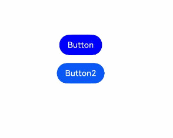
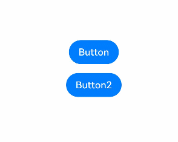

# 动态属性设置

动态设置组件的属性，支持开发者在属性设置时使用if/else语法，且根据需要使用多态样式设置属性。

> **说明：**
>
> 从API version 11开始支持。后续版本如有新增内容，则采用上角标单独标记该内容的起始版本。
>
> 在attributeModifier中设置的属性尽量不要与其他方法设置的属性相同，避免在页面刷新时attributeModifier不生效。
>
> 从API version 20开始，attributeModifier支持自定义组件。

## attributeModifier

attributeModifier(modifier: AttributeModifier\<T>): T

动态设置组件的属性方法。

**原子化服务API：** 从API version 12开始，该接口支持在原子化服务中使用。

**系统能力：** SystemCapability.ArkUI.ArkUI.Full

**参数：**

| 参数名   | 类型                                         | 必填 | 说明                                                                                                                             |
| -------- | -------------------------------------------- | ---- | -------------------------------------------------------------------------------------------------------------------------------- |
| modifier | [AttributeModifier\<T>](#attributemodifiert) | 是   | 在当前组件上，动态设置属性方法，支持使用if/else语法。<br/>modifier：属性修改器，开发者需要自定义class实现AttributeModifier接口。 |

**返回值：**

| 类型 | 说明 |
| --- | --- |
| T | 返回当前组件。 |

## AttributeModifier\<T>

开发者需要自定义class实现AttributeModifier接口。

**原子化服务API：** 从API version 12开始，该接口支持在原子化服务中使用。

**系统能力：** SystemCapability.ArkUI.ArkUI.Full

>  **说明：**
>
>  在以下回调函数中，当对instance对象的同一个属性重复设置相同的值或对象时，不会触发该属性的更新。

### applyNormalAttribute
applyNormalAttribute(instance: T) : void

组件普通状态时的样式。

**原子化服务API：** 从API version 12开始，该接口支持在原子化服务中使用。

**系统能力：** SystemCapability.ArkUI.ArkUI.Full

### applyPressedAttribute
applyPressedAttribute(instance: T) : void

组件按压状态的样式。

**原子化服务API：** 从API version 12开始，该接口支持在原子化服务中使用。

**系统能力：** SystemCapability.ArkUI.ArkUI.Full

### applyFocusedAttribute
applyFocusedAttribute(instance: T) : void

组件获焦状态的样式。

**原子化服务API：** 从API version 12开始，该接口支持在原子化服务中使用。

**系统能力：** SystemCapability.ArkUI.ArkUI.Full

### applyDisabledAttribute
applyDisabledAttribute(instance: T) : void

组件禁用状态的样式。

**原子化服务API：** 从API version 12开始，该接口支持在原子化服务中使用。

**系统能力：** SystemCapability.ArkUI.ArkUI.Full

### applySelectedAttribute
applySelectedAttribute(instance: T) : void

组件选中状态的样式。

开发者可根据需要自定义实现这些方法，通过传入的参数识别组件类型，对instance设置属性，支持使用if/else语法进行动态设置。

**原子化服务API：** 从API version 12开始，该接口支持在原子化服务中使用。

**系统能力：** SystemCapability.ArkUI.ArkUI.Full

**参数：**

| 参数     | 描述                                                                                                         |
| -------- | ------------------------------------------------------------------------------------------------------------ |
| instance | 组件的属性类，用来标识进行属性设置的组件的类型，比如Button组件的ButtonAttribute，Text组件的TextAttribute等。 |

**instance参数支持范围：**

AlphabetIndexerAttribute、BadgeAttribute、BlankAttribute、ButtonAttribute、CalendarPickerAttribute、CanvasAttribute、CheckboxAttribute、CheckboxGroupAttribute、CircleAttribute、ColumnAttribute、ColumnSplitAttribute、ShapeAttribute、CommonAttribute、CounterAttribute、DataPanelAttribute、DatePickerAttribute、DividerAttribute、EllipseAttribute、FlexAttribute、FlowItemAttribute、FormLinkAttribute、GaugeAttribute、GridAttribute、GridColAttribute、ColumnAttribute、GridItemAttribute、GridRowAttribute、HyperlinkAttribute、IndicatorComponentAttribute、ImageAttribute、ImageAnimatorAttribute、ImageSpanAttribute、LineAttribute、LinearIndicatorAttribute、ListAttribute、ListItemAttribute、ListItemGroupAttribute、LoadingProgressAttribute、MarqueeAttribute、MenuAttribute、MenuItemAttribute、MenuItemGroupAttribute、NavDestinationAttribute、NavigationAttribute、NavigatorAttribute、NavRouterAttribute、PanelAttribute、PathAttribute、PatternLockAttribute、PolygonAttribute、PolylineAttribute、ProgressAttribute、QRCodeAttribute、RadioAttribute、RatingAttribute、RectAttribute、RefreshAttribute、RelativeContainerAttribute、RichEditorAttribute、RichTextAttribute、RowAttribute、RowSplitAttribute、ScrollAttribute、ScrollBarAttribute、SearchAttribute、SelectAttribute、ShapeAttribute、SideBarContainerAttribute、SliderAttribute、SpanAttribute、StackAttribute、StepperAttribute、StepperItemAttribute、SwiperAttribute、SymbolGlyphAttribute、TabContentAttribute、TabsAttribute、TextAttribute、TextAreaAttribute、TextClockAttribute、TextInputAttribute、TextPickerAttribute、TextTimerAttribute、TimePickerAttribute、ToggleAttribute、VideoAttribute、WaterFlowAttribute、XComponentAttribute、ParticleAttribute<!--Del-->、EffectComponentAttribute、FormComponentAttribute、PluginComponentAttribute、RemoteWindowAttribute、UIExtensionComponentAttribute<!--DelEnd-->。

**属性支持范围：**

1. 不支持入参或者返回值为[CustomBuilder](ts-types.md#custombuilder8)的属性。
2. 不支持入参为[modifier](../../../ui/arkts-user-defined-modifier.md)类型的属性，具体为以下属性方法：[attributeModifier](#attributemodifier)，[drawModifier](./ts-universal-attributes-draw-modifier.md)和[gestureModifier](./ts-universal-attributes-gesture-modifier.md)。
3. 不支持[animation](./ts-animatorproperty.md)属性。
4. 不支持[gesture](../../../ui/arkts-gesture-events-binding.md)类型的属性。
5. 不支持[stateStyles](./ts-universal-attributes-polymorphic-style.md)属性。
6. 不支持已废弃属性。
<!--Del-->
7. 不支持系统组件属性。<!--DelEnd-->

不支持或者未实现的属性在使用时会抛出"Method not implemented."、"is not callable"、"Builder is not supported."等异常信息。具体Modifier支持范围同基类属性接口的支持范围，详见表格[Attribute支持范围](#attribute支持范围)。

## 自定义Modifier
从API version 12开始，开发者可使用自定义Modifier构建组件并配置属性，通过此自定义的Modifier可调用所封装组件的属性和样式接口。 

**自定义Modifier支持范围：**  

CommonModifier、ColumnModifier、ColumnSplitModifier、RowModifier、RowSplitModifier、SideBarContainerModifier、BlankModifier、DividerModifier、GridColModifier、GridRowModifier、NavDestinationModifier、NavigatorModifier、StackModifier、NavigationModifier、NavRouterModifier、StepperItemModifier、TabsModifier、GridModifier、GridItemModifier、ListModifier、ListItemModifier、ListItemGroupModifier、ScrollModifier、SwiperModifier、WaterFlowModifier、ButtonModifier、CounterModifier、TextPickerModifier、TimePickerModifier、ToggleModifier、CalendarPickerModifier、CheckboxModifier、CheckboxGroupModifier、DatePickerModifier、RadioModifier、RatingModifier、SelectModifier、SliderModifier、PatternLockModifier、SpanModifier、RichEditorModifier、RefreshModifier、SearchModifier、TextAreaModifier、TextModifier、TextInputModifier、ImageSpanModifier、ImageAnimatorModifier、ImageModifier、VideoModifier、DataPanelModifier、GaugeModifier、LoadingProgressModifier、MarqueeModifier、ProgressModifier、QRCodeModifier、TextClockModifier、TextTimerModifier、LineModifier、PathModifier、PolygonModifier、PolylineModifier、RectModifier、ShapeModifier、AlphabetIndexerModifier、FormComponentModifier、HyperlinkModifier、MenuModifier、MenuItemModifier、PanelModifier、SymbolGlyphModifier、ParticleModifier。  
未暴露的组件Modifier可以使用CommonModifier。 

**注意事项**
1. 设置自定义Modifier给一个组件，该组件对应属性生效。  
2. 自定义Modifier属性值变化，组件对应属性也会变化。自定义Modifier类型为基类，构造的对象为子类对象，使用时要通过as进行类型断言为子类。  
3. 一个自定义Modifier设置给两个组件，Modifier属性变化的时候对两个组件同时生效。  
4. 一个Modifier设置了属性A和属性B，再设置属性C和属性D，4个属性同时在组件上生效。  
5. 自定义Modifier不支持@State标注的状态数据的变化感知，见[示例3（自定义Modifier不支持感知@State装饰的状态数据变化）](#示例3自定义modifier不支持感知state装饰的状态数据变化)。  
6. 多次通过attributeModifier设置属性时，生效的属性为所有属性的并集，相同属性按照设置顺序生效。   

## 示例
### 示例1（组件绑定Modifier切换背景颜色）

该示例通过Button绑定Modifier实现了点击切换背景颜色的效果。

```ts
// xxx.ets
class MyButtonModifier implements AttributeModifier<ButtonAttribute> {
  public isDark: boolean = false;

  applyNormalAttribute(instance: ButtonAttribute): void {
    if (this.isDark) {
      instance.backgroundColor(Color.Black);
    } else {
      instance.backgroundColor(Color.Red);
    }
  }
}

@Entry
@Component
struct attributeDemo {
  @State modifier: MyButtonModifier = new MyButtonModifier();

  build() {
    Row() {
      Column() {
        Button("Button")
          .attributeModifier(this.modifier)
          .onClick(() => {
            this.modifier.isDark = !this.modifier.isDark;
          })
      }
      .width('100%')
    }
    .height('100%')
  }
}
```


### 示例2（组件绑定Modifier实现按压态效果）

该示例通过Button绑定Modifier实现了按压态的效果。如果配合状态管理V2使用，详情见：[Modifier与makeObserved](../../../ui/state-management/arkts-v1-v2-migration.md#modifier)。

```ts
// xxx.ets
class MyButtonModifier implements AttributeModifier<ButtonAttribute> {
  applyNormalAttribute(instance: ButtonAttribute): void {
    instance.backgroundColor(Color.Black);
  }

  applyPressedAttribute(instance: ButtonAttribute): void {
    instance.backgroundColor(Color.Red);
  }
}

@Entry
@Component
struct attributePressedDemo {
  @State modifier: MyButtonModifier = new MyButtonModifier();

  build() {
    Row() {
      Column() {
        Button("Button")
          .attributeModifier(this.modifier)
      }
      .width('100%')
    }
    .height('100%')
  }
}
```


### 示例3（自定义Modifier不支持感知@State装饰的状态数据变化）

该示例通过状态数据设置自定义Modifier的宽度，自定义Modifier不支持感知@State装饰的状态数据变化，点击按钮后宽度不发生改变。

```ts
import { CommonModifier } from "@kit.ArkUI";

const TEST_TAG : string = "AttributeModifier";
class MyModifier extends CommonModifier {
  applyNormalAttribute(instance: CommonAttribute): void {
    super.applyNormalAttribute?.(instance);
  }
}

@Component
struct MyImage1 {
  @Link modifier: CommonModifier;

  build() {
    Image($r("app.media.startIcon")).attributeModifier(this.modifier as MyModifier)
  }
}

@Entry
@Component
struct Index {
  index: number = 0;
  @State width1: number = 100;
  @State height1: number = 100;
  @State myModifier: CommonModifier = new MyModifier().width(this.width1).height(this.height1).margin(10);

  build() {
    Column() {
      Button($r("app.string.EntryAbility_label"))
        .margin(10)
        .onClick(() => {
          console.log(TEST_TAG, "onClick");
          this.index++;
          if (this.index % 2 === 1) {
            this.width1 = 10;
            console.log(TEST_TAG, "setGroup1");
          } else {
            this.width1 = 10;
            console.log(TEST_TAG, "setGroup2");
          }
        })
      MyImage1({ modifier: this.myModifier })
    }
    .width('100%')
  }
}
```


### 示例4（Modifier和自定义Modifier的属性同时生效）

该示例通过自定义Modifier设置了width和height，点击按钮时设置borderStyle和borderWidth，点击后4个属性同时生效。 

```ts
import { CommonModifier } from "@kit.ArkUI";

const TEST_TAG: string = "AttributeModifier";

class MyModifier extends CommonModifier {
  applyNormalAttribute(instance: CommonAttribute): void {
    super.applyNormalAttribute?.(instance);
  }

  public setGroup1(): void {
    this.borderStyle(BorderStyle.Dotted);
    this.borderWidth(8);
  }

  public setGroup2(): void {
    this.borderStyle(BorderStyle.Dashed);
    this.borderWidth(8);
  }
}

@Component
struct MyImage1 {
  @Link modifier: CommonModifier;

  build() {
    Image($r("app.media.startIcon")).attributeModifier(this.modifier as MyModifier)
  }
}

@Entry
@Component
struct Index {
  @State myModifier: CommonModifier = new MyModifier().width(100).height(100).margin(10);
  index: number = 0;

  build() {
    Column() {
      Button($r("app.string.EntryAbility_label"))
        .margin(10)
        .onClick(() => {
          console.log(TEST_TAG, "onClick");
          this.index++;
          if (this.index % 2 === 1) {
            (this.myModifier as MyModifier).setGroup1();
            console.log(TEST_TAG, "setGroup1");
          } else {
            (this.myModifier as MyModifier).setGroup2();
            console.log(TEST_TAG, "setGroup2");
          }
        })
      MyImage1({ modifier: this.myModifier })
    }
    .width('100%')
  }
}
```


### 示例5（组件绑定Modifier获焦样式）

该示例通过Button绑定Modifier实现了组件在获得焦点时的样式效果。点击Button2后，Button会显示获得焦点后的样式。

```ts
class MyButtonModifier implements AttributeModifier<ButtonAttribute> {

  applyNormalAttribute(instance: ButtonAttribute): void {
    instance.backgroundColor(Color.Blue);
  }
  applyFocusedAttribute(instance: ButtonAttribute): void {
    instance.backgroundColor(Color.Green);
  }
}

@Entry
@Component
struct attributeDemo {
  @State modifier: MyButtonModifier = new MyButtonModifier();
  @State isDisable: boolean = true;

  build() {
    Row() {
      Column() {
        Button("Button")
          .attributeModifier(this.modifier)
          .enabled(this.isDisable)
          .id("app")
        Divider().vertical(false).strokeWidth(15).color(Color.Transparent)
        Button("Button2")
          .onClick(() => {
            this.getUIContext().getFocusController().activate(true);
            this.getUIContext().getFocusController().requestFocus("app");
          })
      }
      .width('100%')
    }
    .height('100%')
  }
}
```


### 示例6（组件绑定Modifier禁用状态的样式）

该示例通过Button绑定Modifier实现了组件禁用时的样式效果。点击Button2后，Button会显示禁用状态的样式。

```ts
class MyButtonModifier implements AttributeModifier<ButtonAttribute> {
  applyDisabledAttribute(instance: ButtonAttribute): void {
    instance.width(200);
  }
}

@Entry
@Component
struct attributeDemo {
  @State modifier: MyButtonModifier = new MyButtonModifier();
  @State isDisable: boolean = true;

  build() {
    Row() {
      Column() {
        Button("Button")
          .attributeModifier(this.modifier)
          .enabled(this.isDisable)
        Divider().vertical(false).strokeWidth(15).color(Color.Transparent)
        Button("Button2")
          .onClick(() => {
            this.isDisable = !this.isDisable;
          })
      }
      .width('100%')
    }
    .height('100%')
  }
}
```


### 示例7（组件绑定Modifier选中状态样式）

该示例通过Radio绑定Modifier实现了展示组件选中时样式的效果。

```ts
class MyRadioModifier implements AttributeModifier<RadioAttribute> {
  applyNormalAttribute(instance: RadioAttribute): void {
    instance.backgroundColor(Color.Blue);
  }
  applySelectedAttribute(instance: RadioAttribute): void {
    instance.backgroundColor(Color.Red);
    instance.borderWidth(2);
  }
}

@Entry
@Component
struct attributeDemo {
  @State modifier: MyRadioModifier = new MyRadioModifier();
  @State value: boolean = false;
  @State value2: boolean = false;

  build() {
    Row() {
      Column() {
        Radio({ value: 'Radio1', group: 'radioGroup1' })
          .checked(this.value)
          .height(50)
          .width(50)
          .borderWidth(0)
          .borderRadius(30)
          .onClick(() => {
            this.value = !this.value;
          })
          .attributeModifier(this.modifier)
      }
      .width('100%')
    }
    .height('100%')
  }
}
```


### 示例8（自定义组件绑定Modifier实现按压态效果）

该示例通过Common（自定义）绑定Modifier实现了按压态的效果。

```ts
// xxx.ets
class CustomModifier implements AttributeModifier<CommonAttribute> {
  applyNormalAttribute(instance: CommonAttribute): void {
    instance.backgroundColor(Color.Blue)
  }

  applyPressedAttribute(instance: CommonAttribute): void {
    instance.backgroundColor(Color.Red)
  }
}

@Entry
@Component
struct attributePressedDemo {
  @State  modifier: CustomModifier = new CustomModifier()

  build() {
    Row() {
      Column() {
        ChildComponent()
          .attributeModifier(this.modifier)
      }
      .width('100%')
    }
    .height('100%')
  }
}

@Component
struct ChildComponent {
  build() {
    Text("common").fontColor(Color.Green).fontSize(28).textAlign(TextAlign.Center)
      .width('35%')
      .height('10%')
  }
}
```


## Attribute支持范围

未在表格中列举的属性默认为支持。

**表1** CommonAttribute属性接口支持例外范围

| 属性                     | 支持情况 | 告警信息                  | 备注                                      |
| ------------------------ | -------- | ------------------------- | ----------------------------------------- |
| accessibilityChecked     | 不支持   | is not callable           | -                                         |
| accessibilitySelected    | 不支持   | is not callable           | -                                         |
| accessibilityTextHint    | 不支持   | is not callable           | -                                         |
| accessibilityVirtualNode | 不支持   | is not callable           | 不支持入参为CustomBuilder。               |
| animation                | 不支持   | Method not implemented.   | 不支持animation相关属性。                 |
| attributeModifier        | 不支持   | -                         | attributeModifier不支持嵌套使用，不生效。 |
| background               | 不支持   | Method not implemented.   | 不支持入参为CustomBuilder。               |
| backgroundFilter         | 不支持   | is not callable           | -                                         |
| bindContentCover         | 不支持   | Method not implemented.   | 不支持入参为CustomBuilder。               |
| bindContextMenu          | 不支持   | Method not implemented.   | 不支持入参为CustomBuilder。               |
| bindPopup                | 不支持   | Method not implemented.   | 不支持入参为CustomBuilder。               |
| bindSheet                | 不支持   | Method not implemented.   | 不支持入参为CustomBuilder。               |
| chainWeight              | 不支持   | is not callable           | -                                         |
| compositingFilter        | 不支持   | is not callable           | -                                         |
| drawModifier             | 不支持   | is not callable           | 不支持modifier相关的属性。                |
| foregroundFilter         | 不支持   | is not callable           | -                                         |
| freeze                   | 不支持   | is not callable           | -                                         |
| gesture                  | 不支持   | Method not implemented.   | 不支持gesture相关的属性。                 |
| gestureModifier          | 不支持   | is not callable           | 不支持modifier相关的属性。                |
| onAccessibilityHover     | 不支持   | is not callable           | -                                         |
| onDragStart              | 不支持   | Method not implemented.   | 不支持返回值为CustomBuilder。             |
| parallelGesture          | 不支持   | Method not implemented.   | 不支持gesture相关的属性。                 |
| priorityGesture          | 不支持   | Method not implemented.   | 不支持gesture相关的属性。                 |
| reuseId                  | 不支持   | Method not implemented.   | -                                         |
| stateStyles              | 不支持   | Method not implemented.   | 不支持stateStyles相关的属性。             |
| useSizeType              | 不支持   | Method not implemented.   | 不支持已废弃属性。                        |
| visualEffect             | 不支持   | is not callable           | -                                         |
| bindMenu                 | 部分支持 | -                         | 不支持入参为CustomBuilder。               |
| dragPreview              | 部分支持 | Builder is not supported. | 不支持入参为CustomBuilder。               |
