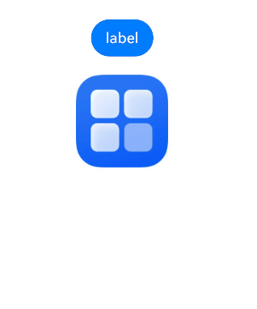
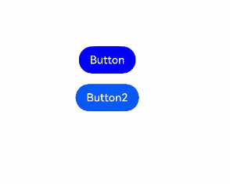

# 动态属性设置
<!--Kit: ArkUI-->
<!--Subsystem: ArkUI-->
<!--Owner: @sunbees-->
<!--Designer: @sunbees-->
<!--Tester: @khq-->
<!--Adviser: @Brilliantry_Rui-->

动态设置组件的属性，支持开发者在属性设置时使用if/else语法，且根据需要使用多态样式设置属性。适用于需要根据组件状态（如按压、获焦、禁用、选中、悬浮等）动态切换样式的场景，可提升样式管理的灵活性和代码复用性。

> **说明：**
>
> - 从API version 11开始支持。后续版本如有新增内容，则采用上角标单独标记该内容的起始版本。
>
> - 本模块接口仅可在Stage模型下使用。
>
> - 在attributeModifier中设置的属性尽量不要与其他方法设置的属性相同，避免在页面刷新时attributeModifier不生效。
>
> - 对于仅需根据条件设置组件单一属性的简单场景，可以使用[三目表达式](../../../ui/state-management/arkts-declarative-ui-description.md#配置属性)（如.width(isFullScreen ? 200 : 100)）。
>
> - 从API version 20开始，attributeModifier支持自定义组件。
>
> - 如果组件同时处于多种状态，并且分别在各自的状态里设置了一样的属性，那么最终样式生效的优先级为悬浮态&lt;按压态&lt;获焦态&lt;禁用态&lt;选中态。例如，如果组件同时处于悬浮态和按压态，在悬浮态和按压态都设置了背景色，那么此时组件最终显示按压态的背景色。

## attributeModifier

attributeModifier(modifier: AttributeModifier\<T>): T

动态设置组件的属性方法。

**原子化服务API：** 从API version 12开始，该接口支持在原子化服务中使用。

**系统能力：** SystemCapability.ArkUI.ArkUI.Full

**参数：**

| 参数名   | 类型                                         | 必填 | 说明                                                                                                                             |
| -------- | -------------------------------------------- | ---- | -------------------------------------------------------------------------------------------------------------------------------- |
| modifier | [AttributeModifier\<T>](#attributemodifiert) | 是   | 在当前组件上，动态设置属性方法，支持使用if/else语法。<br>modifier：属性修改器，开发者需要自定义class实现AttributeModifier接口。 |

**返回值：**

| 类型 | 说明 |
| --- | --- |
| T | 返回当前组件。 |

## AttributeModifier\<T>

开发者需要自定义class实现AttributeModifier接口。

**原子化服务API：** 从API version 12开始，该接口支持在原子化服务中使用。

**系统能力：** SystemCapability.ArkUI.ArkUI.Full

> **说明：**
>
> 在以下回调函数中，当对instance对象的同一个属性重复设置相同的值或对象时，不会触发该属性的更新。

### applyNormalAttribute

applyNormalAttribute?(instance: T): void

组件普通状态时的样式。

**原子化服务API：** 从API version 12开始，该接口支持在原子化服务中使用。

**系统能力：** SystemCapability.ArkUI.ArkUI.Full

**参数：**

| 参数名    | 类型   | 必填   | 说明                                                                                                         |
| -------- | ------- | ------ | ------------------------------------------------------------------------------------------------------------ |
| instance | T       | 是     | 组件的属性类，用来标识进行属性设置的组件的类型，比如[Button](ts-basic-components-button.md)组件的[属性](ts-basic-components-button.md#属性)（ButtonAttribute），[Text](ts-basic-components-text.md)组件的[属性](ts-basic-components-text.md#属性)（TextAttribute）等。具体取值请参考[Attribute类型支持范围](#attribute类型支持范围)。 |

### applyPressedAttribute

applyPressedAttribute?(instance: T): void

组件按压状态的样式。参考[示例2（组件绑定Modifier实现按压态效果）](#示例2组件绑定modifier实现按压态效果)、[示例8（自定义组件绑定Modifier实现按压态效果）](#示例8自定义组件绑定modifier实现按压态效果)。

**原子化服务API：** 从API version 12开始，该接口支持在原子化服务中使用。

**系统能力：** SystemCapability.ArkUI.ArkUI.Full

**参数：**

| 参数名    | 类型   | 必填   | 说明                                                                                                         |
| -------- | ------- | ------ | ------------------------------------------------------------------------------------------------------------ |
| instance | T       | 是     | 组件的属性类，用来标识进行属性设置的组件的类型，比如[Button](ts-basic-components-button.md)组件的[属性](ts-basic-components-button.md#属性)（ButtonAttribute），[Text](ts-basic-components-text.md)组件的[属性](ts-basic-components-text.md#属性)（TextAttribute）等。具体取值请参考[Attribute类型支持范围](#attribute类型支持范围)。 |

### applyFocusedAttribute

applyFocusedAttribute?(instance: T): void

组件获焦状态的样式。参考[示例5（组件绑定Modifier获焦样式）](#示例5组件绑定modifier获焦样式)。

**原子化服务API：** 从API version 12开始，该接口支持在原子化服务中使用。

**系统能力：** SystemCapability.ArkUI.ArkUI.Full

**参数：**

| 参数名    | 类型   | 必填   | 说明                                                                                                         |
| -------- | ------- | ------ | ------------------------------------------------------------------------------------------------------------ |
| instance | T       | 是     | 组件的属性类，用来标识进行属性设置的组件的类型，比如[Button](ts-basic-components-button.md)组件的[属性](ts-basic-components-button.md#属性)（ButtonAttribute），[Text](ts-basic-components-text.md)组件的[属性](ts-basic-components-text.md#属性)（TextAttribute）等。具体取值请参考[Attribute类型支持范围](#attribute类型支持范围)。 |

### applyDisabledAttribute

applyDisabledAttribute?(instance: T): void

组件禁用状态的样式。参考[示例6（组件绑定Modifier禁用状态的样式）](#示例6组件绑定modifier禁用状态的样式)。

**原子化服务API：** 从API version 12开始，该接口支持在原子化服务中使用。

**系统能力：** SystemCapability.ArkUI.ArkUI.Full

**参数：**

| 参数名    | 类型   | 必填   | 说明                                                                                                         |
| -------- | ------- | ------ | ------------------------------------------------------------------------------------------------------------ |
| instance | T       | 是     | 组件的属性类，用来标识进行属性设置的组件的类型，比如[Button](ts-basic-components-button.md)组件的[属性](ts-basic-components-button.md#属性)（ButtonAttribute），[Text](ts-basic-components-text.md)组件的[属性](ts-basic-components-text.md#属性)（TextAttribute）等。具体取值请参考[Attribute类型支持范围](#attribute类型支持范围)。 |

### applySelectedAttribute

applySelectedAttribute?(instance: T): void

组件选中状态的样式。

开发者可根据需要自定义实现上述回调方法，通过传入的参数识别组件类型，对instance设置属性，支持使用if/else语法进行动态设置。参考[示例7（组件绑定Modifier选中状态样式）](#示例7组件绑定modifier选中状态样式)。

**原子化服务API：** 从API version 12开始，该接口支持在原子化服务中使用。

**系统能力：** SystemCapability.ArkUI.ArkUI.Full

**参数：**

| 参数名    | 类型   | 必填   | 说明                                                                                                         |
| -------- | ------- | ------ | ------------------------------------------------------------------------------------------------------------ |
| instance | T       | 是     | 组件的属性类，用来标识进行属性设置的组件的类型，比如[Button](ts-basic-components-button.md)组件的[属性](ts-basic-components-button.md#属性)（ButtonAttribute），[Text](ts-basic-components-text.md)组件的[属性](ts-basic-components-text.md#属性)（TextAttribute）等。具体取值请参考[Attribute类型支持范围](#attribute类型支持范围)。 |

### applyHoveredAttribute

applyHoveredAttribute?(instance: T): void

组件悬浮状态的样式。参考[示例9（组件绑定Modifier实现鼠标悬浮态效果）](#示例9组件绑定modifier实现鼠标悬浮态效果)。

**起始版本：** 26.0.0

**原子化服务API：** 从API版本26.0.0开始，该接口支持在原子化服务中使用。

**系统能力：** SystemCapability.ArkUI.ArkUI.Full

**参数：**

| 参数名    | 类型   | 必填   | 说明                                                                                                         |
| -------- | ------- | ------ | ------------------------------------------------------------------------------------------------------------ |
| instance | T       | 是     | 组件的属性类，用来标识进行属性设置的组件的类型，比如[Button](ts-basic-components-button.md)组件的[属性](ts-basic-components-button.md#属性)（ButtonAttribute），[Text](ts-basic-components-text.md)组件的[属性](ts-basic-components-text.md#属性)（TextAttribute）等。具体取值请参考[Attribute类型支持范围](#attribute类型支持范围)。 |

### Attribute类型支持范围

| 名称 | 说明 |
| ----------------- | --------------- |
| AlphabetIndexerAttribute | AlphabetIndexer的[属性](ts-container-alphabet-indexer.md#属性)。 |
| BadgeAttribute | Badge的[属性](ts-container-badge.md#属性)。 |
| BlankAttribute | Blank的[属性](ts-basic-components-blank.md#属性)。 |
| ButtonAttribute | Button的[属性](ts-basic-components-button.md#属性)。 |
| CalendarPickerAttribute | CalendarPicker的[属性](ts-basic-components-calendarpicker.md#属性)。 |
| CanvasAttribute | Canvas的[属性](ts-components-canvas-canvas.md#属性)。 |
| CheckboxAttribute | Checkbox的[属性](ts-basic-components-checkbox.md#属性)。 |
| CheckboxGroupAttribute | CheckboxGroup的[属性](ts-basic-components-checkboxgroup.md#属性)。 |
| CircleAttribute | Circle的[属性](ts-drawing-components-circle.md#属性)。 |
| ColumnAttribute | Column的[属性](ts-container-column.md#属性)。 |
| ColumnSplitAttribute | ColumnSplit的[属性](ts-container-columnsplit.md#属性)。 |
| CommonAttribute | Common的[属性](ts-component-general-attributes.md)。 |
| CounterAttribute | Counter的[属性](ts-container-counter.md#属性)。 |
| DataPanelAttribute | DataPanel的[属性](ts-basic-components-datapanel.md#属性)。 |
| DatePickerAttribute | DatePicker的[属性](ts-basic-components-datepicker.md#属性)。 |
| DividerAttribute | Divider的[属性](ts-basic-components-divider.md#属性)。 |
| EllipseAttribute | Ellipse的[属性](ts-drawing-components-ellipse.md#属性)。 |
| FlexAttribute | Flex的[属性](ts-container-flex.md#属性)。 |
| FlowItemAttribute | FlowItem的[属性](ts-container-flowitem.md#属性)。 |
| FormLinkAttribute | FormLink的[属性](ts-container-formlink.md#属性)。 |
| GaugeAttribute | Gauge的[属性](ts-basic-components-gauge.md#属性)。 |
| GridAttribute | Grid的[属性](ts-container-grid.md#属性)。 |
| GridColAttribute | GridCol的[属性](ts-container-gridcol.md#属性)。 |
| GridItemAttribute | GridItem的[属性](ts-container-griditem.md#属性)。 |
| GridRowAttribute | GridRow的[属性](ts-container-gridrow.md#属性)。 |
| HyperlinkAttribute | Hyperlink的[属性](ts-container-hyperlink.md#属性)。 |
| IndicatorComponentAttribute | IndicatorComponent的[属性](ts-swiper-components-indicator.md#属性)。 |
| ImageAttribute | Image的[属性](ts-basic-components-image.md#属性)。 |
| ImageAnimatorAttribute | ImageAnimator的[属性](ts-basic-components-imageanimator.md#属性)。 |
| ImageSpanAttribute | ImageSpan的[属性](ts-basic-components-imagespan.md#属性)。 |
| ContainerSpanAttribute | ContainerSpan的[属性](ts-basic-components-containerspan.md#属性)。 |
| LineAttribute | Line的[属性](ts-drawing-components-line.md#属性)。 |
| ListAttribute | List的[属性](ts-container-list.md#属性)。 |
| ListItemAttribute | ListItem的[属性](ts-container-listitem.md#属性)。 |
| ListItemGroupAttribute | ListItemGroup的[属性](ts-container-listitemgroup.md#属性)。 |
| LoadingProgressAttribute | LoadingProgress的[属性](ts-basic-components-loadingprogress.md#属性)。 |
| MarqueeAttribute | Marquee的[属性](ts-basic-components-marquee.md#属性)。 |
| MenuAttribute | Menu的[属性](ts-basic-components-menu.md#属性)。 |
| MenuItemAttribute | MenuItem的[属性](ts-basic-components-menuitem.md#属性)。 |
| MenuItemGroupAttribute | [MenuItemGroup](ts-basic-components-menuitemgroup.md)的属性。 |
| NavDestinationAttribute | NavDestination的[属性](ts-basic-components-navdestination.md#属性)。 |
| NavigationAttribute | Navigation的[属性](ts-basic-components-navigation.md#属性)。 |
| NavigatorAttribute | Navigator的[属性](ts-container-navigator.md#属性)。 |
| NavRouterAttribute | NavRouter的[属性](ts-basic-components-navrouter.md#属性)。 |
| PanelAttribute | Panel的[属性](ts-container-panel.md#属性)。 |
| PathAttribute | Path的[属性](ts-drawing-components-path.md#属性)。 |
| PatternLockAttribute | PatternLock的[属性](ts-basic-components-patternlock.md#属性)。 |
| PolygonAttribute | Polygon的[属性](ts-drawing-components-polygon.md#属性)。 |
| PolylineAttribute | Polyline的[属性](ts-drawing-components-polyline.md#属性)。 |
| ProgressAttribute | Progress的[属性](ts-basic-components-progress.md#属性)。 |
| QRCodeAttribute | QRCode的[属性](ts-basic-components-qrcode.md#属性)。 |
| RadioAttribute | Radio的[属性](ts-basic-components-radio.md#属性)。 |
| RatingAttribute | Rating的[属性](ts-basic-components-rating.md#属性)。 |
| RectAttribute | Rect的[属性](ts-drawing-components-rect.md#属性)。 |
| RefreshAttribute | Refresh的[属性](ts-container-refresh.md#属性)。 |
| RelativeContainerAttribute | RelativeContainer的[属性](ts-container-relativecontainer.md#属性)。 |
| RichEditorAttribute | RichEditor的[属性](ts-basic-components-richeditor.md#属性)。 |
| RichTextAttribute | RichText的[属性](ts-basic-components-richtext.md#属性)。 |
| RowAttribute | Row的[属性](ts-container-row.md#属性)。 |
| RowSplitAttribute | RowSplit的[属性](ts-container-rowsplit.md#属性)。 |
| ScrollAttribute | Scroll的[属性](ts-container-scroll.md#属性)。 |
| ScrollBarAttribute | ScrollBar的[属性](ts-basic-components-scrollbar.md#属性)。 |
| SearchAttribute | Search的[属性](ts-basic-components-search.md#属性)。 |
| SelectAttribute | Select的[属性](ts-basic-components-select.md#属性)。 |
| ShapeAttribute | Shape的[属性](ts-drawing-components-shape.md#属性)。 |
| SideBarContainerAttribute | SideBarContainer的[属性](ts-container-sidebarcontainer.md#属性)。 |
| SliderAttribute | Slider的[属性](ts-basic-components-slider.md#属性)。 |
| SpanAttribute | Span的[属性](ts-basic-components-span.md#属性)。 |
| SymbolSpanAttribute | SymbolSpan的[属性](ts-basic-components-symbolSpan.md#属性)。 |
| StackAttribute | Stack的[属性](ts-container-stack.md#属性)。 |
| StepperAttribute | Stepper的[属性](ts-basic-components-stepper.md#属性)。 |
| StepperItemAttribute | StepperItem的[属性](ts-basic-components-stepperitem.md#属性)。 |
| SwiperAttribute | Swiper的[属性](ts-container-swiper.md#属性)。 |
| SymbolGlyphAttribute | SymbolGlyph的[属性](ts-basic-components-symbolGlyph.md#属性)。 |
| TabContentAttribute | TabContent的[属性](ts-container-tabcontent.md#属性)。 |
| TabsAttribute | Tabs的[属性](ts-container-tabs.md#属性)。 |
| TextAttribute | Text的[属性](ts-basic-components-text.md#属性)。 |
| TextAreaAttribute | TextArea的[属性](ts-basic-components-textarea.md#属性)。 |
| TextClockAttribute | TextClock的[属性](ts-basic-components-textclock.md#属性)。 |
| TextInputAttribute | TextInput的[属性](ts-basic-components-textinput.md#属性)。 |
| TextPickerAttribute | TextPicker的[属性](ts-basic-components-textpicker.md#属性)。 |
| TextTimerAttribute | TextTimer的[属性](ts-basic-components-texttimer.md#属性)。 |
| TimePickerAttribute | TimePicker的[属性](ts-basic-components-timepicker.md#属性)。 |
| ToggleAttribute | Toggle的[属性](ts-basic-components-toggle.md#属性)。 |
| VideoAttribute | Video的[属性](ts-media-components-video.md#属性)。 |
| WaterFlowAttribute | WaterFlow的[属性](ts-container-waterflow.md#属性)。 |
| XComponentAttribute | XComponent的[属性](ts-basic-components-xcomponent.md#属性)。 |
| ParticleAttribute | Particle的[属性](ts-particle-animation.md#属性)。 |
| UIPickerComponentAttribute<sup>22+</sup> | UIPickerComponent的[属性](ts-container-ui-picker-component.md#属性)。 |
| <!--DelRow-->EffectComponentAttribute | EffectComponent的[属性](ts-container-effectcomponent-sys.md#属性)。 |
| <!--DelRow-->FormComponentAttribute | FormComponent的[属性](ts-basic-components-formcomponent-sys.md#属性)。 |
| <!--DelRow-->PluginComponentAttribute | PluginComponent的[属性](ts-basic-components-plugincomponent-sys.md#属性)。 |
| <!--DelRow-->RemoteWindowAttribute | RemoteWindow的[属性](ts-basic-components-remotewindow-sys.md#属性)。 |
| UIExtensionComponentAttribute | UIExtensionComponent的[属性](../js-apis-arkui-uiExtension.md#属性)。 |
| ContainerReaderAttribute | ContainerReader的[属性](../arkui-ts/ts-container-containerreader.md#属性)。<br>**起始版本：** 26.0.0|

> **说明：**
>
> - StepperAttribute从API version 11开始支持，从API version 22开始废弃。建议使用SwiperAttribute替代。
> - StepperItemAttribute从API version 11开始支持，从API version 22开始废弃。建议使用SwiperAttribute替代。
> - NavigatorAttribute从API version 11开始支持，从API version 20开始废弃。建议使用NavigationAttribute替代。
> - NavRouterAttribute从API version 11开始支持，从API version 20开始废弃。建议使用NavigationAttribute替代。
> - PanelAttribute从API version 11开始支持，从API version 20开始废弃。建议使用通用属性bindSheet替代。

**属性支持范围：**

1. 不支持入参或者返回值为[CustomBuilder](ts-types.md#custombuilder8)的属性。
2. 不支持入参为[modifier](../../../ui/arkts-user-defined-modifier.md)类型的属性，具体为以下属性方法：[attributeModifier](#attributemodifier)、[drawModifier](./ts-universal-attributes-draw-modifier.md#drawmodifier)和[gestureModifier](./ts-universal-attributes-gesture-modifier.md#gesturemodifier)。
3. 不支持[animation](./ts-animatorproperty.md)属性。
4. 不支持[gesture](../../../ui/arkts-gesture-events-binding.md)类型的属性。
5. 不支持[stateStyles](./ts-universal-attributes-polymorphic-style.md#statestyles)属性。
6. 不支持已废弃属性。
   <!--Del-->
7. 不支持系统组件属性。<!--DelEnd-->

不支持或者未实现的属性在使用时会抛出"Method not implemented."、"is not callable"、"Builder is not supported."等异常信息。具体Modifier支持范围可参考[属性或事件对attributeModifier的支持情况](../../../ui/arkts-user-defined-extension-attributeModifier.md#属性或事件对attributemodifier的支持情况)。

## 自定义Modifier

从API version 12开始，开发者可使用自定义Modifier构建组件并配置属性，通过此自定义的Modifier可调用所封装组件的属性和样式接口。适用于需要封装和复用组件属性配置的场景，可简化组件样式管理并提高代码复用性。

**自定义Modifier支持范围：**  

| 名称 | 说明 |
| ----------------- | --------------- |
| CommonModifier | 通用属性对应的Modifier |
| ColumnModifier | - |
| ColumnSplitModifier | - |
| RowModifier | - |
| RowSplitModifier | - |
| SideBarContainerModifier | - |
| BlankModifier | - |
| DividerModifier | - |
| GridColModifier | - |
| GridRowModifier | - |
| NavDestinationModifier | - |
| NavigatorModifier | - |
| StackModifier | - |
| NavigationModifier | - |
| NavRouterModifier | - |
| StepperItemModifier | - |
| StepperModifier<sup>20+</sup> | - |
| TabsModifier | - |
| GridModifier | - |
| GridItemModifier | - |
| ListModifier | - |
| ListItemModifier | - |
| ListItemGroupModifier | - |
| ScrollModifier | - |
| SwiperModifier | - |
| WaterFlowModifier | - |
| ButtonModifier | - |
| CounterModifier | - |
| TextPickerModifier | - |
| TimePickerModifier | - |
| ToggleModifier | - |
| CalendarPickerModifier | - |
| CheckboxModifier | - |
| CheckboxGroupModifier | - |
| DatePickerModifier | - |
| RadioModifier | - |
| RatingModifier | - |
| SelectModifier | - |
| SliderModifier | - |
| PatternLockModifier | - |
| SpanModifier | - |
| SymbolSpanModifier | - |
| ContainerSpanModifier | - |
| RichEditorModifier | - |
| RefreshModifier | - |
| SearchModifier | - |
| TextAreaModifier | - |
| TextModifier | - |
| TextInputModifier | - |
| ImageSpanModifier | - |
| ImageAnimatorModifier | - |
| ImageModifier | - |
| VideoModifier | - |
| DataPanelModifier | - |
| GaugeModifier | - |
| LoadingProgressModifier | - |
| MarqueeModifier | - |
| ProgressModifier | - |
| QRCodeModifier | - |
| TextClockModifier | - |
| TextTimerModifier | - |
| LineModifier | - |
| PathModifier | - |
| PolygonModifier | - |
| PolylineModifier | - |
| RectModifier | - |
| ShapeModifier | - |
| AlphabetIndexerModifier | - |
| FormComponentModifier | - |
| HyperlinkModifier | - |
| MenuModifier | - |
| MenuItemModifier | - |
| PanelModifier | - |
| SymbolGlyphModifier | - |
| ParticleModifier | - |
| UIPickerComponentModifier<sup>22+</sup> | - |
| ContainerReaderModifier| **起始版本：** 26.0.0 |

未暴露的组件Modifier可以使用CommonModifier。

> **说明：**
>
> - StepperModifier从API version 20开始支持，从API version 22开始废弃。建议使用[SwiperModifier](#自定义modifier)替代。
> - StepperItemModifier从API version 12开始支持，从API version 22开始废弃。建议使用[SwiperModifier](#自定义modifier)替代。
> - NavigatorModifier从API version 12开始支持，从API version 20开始废弃。建议使用[NavigationModifier](#自定义modifier)替代。
> - NavRouterModifier从API version 12开始支持，从API version 20开始废弃。建议使用[NavigationModifier](#自定义modifier)替代。
> - PanelModifier从API version 12开始支持，从API version 20开始废弃。建议使用通用属性bindSheet替代。

**注意事项**

1. 设置自定义Modifier给一个组件，该组件对应属性生效。  
2. 自定义Modifier属性值变化，组件对应属性也会变化。自定义Modifier类型为基类，构造的对象为子类对象，使用时要通过as进行类型断言为子类。  
3. 一个自定义Modifier设置给两个组件，Modifier属性变化的时候对两个组件同时生效。  
4. 一个Modifier设置了属性A和属性B，再设置属性C和属性D，4个属性同时在组件上生效。  
5. 自定义Modifier不支持@State装饰的状态数据的变化感知，见[示例3（自定义Modifier不支持感知@State装饰的状态数据变化）](#示例3自定义modifier不支持感知state装饰的状态数据变化)。  
6. 多次通过attributeModifier设置属性时，生效的属性为所有属性的并集，相同属性以最后设置的值为准。

## 示例

### 示例1（组件绑定Modifier切换背景颜色）

该示例通过Button绑定Modifier实现了点击切换背景颜色的效果。

```ts
// xxx.ets
// 设置Button组件属性的自定义AttributeModifier
class MyButtonModifier implements AttributeModifier<ButtonAttribute> {
  public isDark: boolean = false;

  applyNormalAttribute(instance: ButtonAttribute): void {
    if (this.isDark) {
      instance.backgroundColor(Color.Black);
    } else {
      instance.backgroundColor(Color.Red);
    }
  }
}

@Entry
@Component
struct AttributeDemo {
  @State modifier: MyButtonModifier = new MyButtonModifier();

  build() {
    Row() {
      Column() {
        Button('Button')
          .attributeModifier(this.modifier)
          .onClick(() => {
            this.modifier.isDark = !this.modifier.isDark;
          })
      }
      .width('100%')
    }
    .height('100%')
  }
}
```


### 示例2（组件绑定Modifier实现按压态效果）

该示例通过Button绑定Modifier实现了按压态的效果。如果配合状态管理V2使用，详情见：[Modifier与makeObserved](../../../ui/state-management/arkts-v1-v2-migration-inner-object.md#modifier)。

```ts
// xxx.ets
// 设置Button组件属性的自定义AttributeModifier
class MyButtonModifier implements AttributeModifier<ButtonAttribute> {
  applyNormalAttribute(instance: ButtonAttribute): void {
    instance.backgroundColor(Color.Black);
  }

  applyPressedAttribute(instance: ButtonAttribute): void {
    instance.backgroundColor(Color.Red);
  }
}

@Entry
@Component
struct AttributePressedDemo {
  @State modifier: MyButtonModifier = new MyButtonModifier();

  build() {
    Row() {
      Column() {
        Button('Button')
          .attributeModifier(this.modifier)
      }
      .width('100%')
    }
    .height('100%')
  }
}
```


### 示例3（自定义Modifier不支持感知@State装饰的状态数据变化）

该示例通过状态数据设置自定义Modifier的宽度，自定义Modifier不支持感知@State装饰的状态数据变化，点击按钮后宽度不发生改变。

```ts
import { CommonModifier } from '@kit.ArkUI';

const TEST_TAG: string = 'AttributeModifier';

// 设置通用组件属性的自定义AttributeModifier
class MyModifier extends CommonModifier {
  applyNormalAttribute(instance: CommonAttribute): void {
    super.applyNormalAttribute?.(instance);
  }
}

@Component
struct MyImage1 {
  @Link modifier: CommonModifier;

  build() {
    Image($r('app.media.startIcon')).attributeModifier(this.modifier as MyModifier)
  }
}

@Entry
@Component
struct Index {
  index: number = 0;
  @State width1: number = 100;
  @State height1: number = 100;
  @State myModifier: CommonModifier = new MyModifier().width(this.width1).height(this.height1).margin(10);

  build() {
    Column() {
      Button($r('app.string.EntryAbility_label'))
        .margin(10)
        .onClick(() => {
          console.info(TEST_TAG, 'onClick');
          this.index++;
          if (this.index % 2 === 1) {
            this.width1 = 10;
            console.info(TEST_TAG, 'setGroup1');
          } else {
            this.height1 = 10;
            console.info(TEST_TAG, 'setGroup2');
          }
        })
      MyImage1({ modifier: this.myModifier })
    }
    .width('100%')
  }
}

```



### 示例4（Modifier和自定义Modifier的属性同时生效）

该示例通过自定义Modifier设置了width、height和margin，点击按钮时设置[borderStyle](ts-appendix-enums.md#borderstyle)和[borderWidth](ts-universal-attributes-border.md#borderwidth)，点击后5个属性同时生效。

```ts
import { CommonModifier } from '@kit.ArkUI';

const TEST_TAG: string = 'AttributeModifier';

// 设置通用组件属性的自定义AttributeModifier
class MyModifier extends CommonModifier {
  applyNormalAttribute(instance: CommonAttribute): void {
    super.applyNormalAttribute?.(instance);
  }

  public setGroup1(): void {
    this.borderStyle(BorderStyle.Dotted);
    this.borderWidth(8);
  }

  public setGroup2(): void {
    this.borderStyle(BorderStyle.Dashed);
    this.borderWidth(8);
  }
}

@Component
struct MyImage1 {
  @Link modifier: CommonModifier;

  build() {
    Image($r('app.media.startIcon')).attributeModifier(this.modifier as MyModifier)
  }
}

@Entry
@Component
struct Index {
  @State myModifier: CommonModifier = new MyModifier().width(100).height(100).margin(10);
  index: number = 0;

  build() {
    Column() {
      Button($r('app.string.EntryAbility_label'))
        .margin(10)
        .onClick(() => {
          console.info(TEST_TAG, 'onClick');
          this.index++;
          if (this.index % 2 === 1) {
            (this.myModifier as MyModifier).setGroup1();
            console.info(TEST_TAG, 'setGroup1');
          } else {
            (this.myModifier as MyModifier).setGroup2();
            console.info(TEST_TAG, 'setGroup2');
          }
        })
      MyImage1({ modifier: this.myModifier })
    }
    .width('100%')
  }
}
```


### 示例5（组件绑定Modifier获焦样式）

该示例通过Button绑定Modifier实现了组件在获得焦点时的样式效果。点击Button2后，Button会显示获得焦点后的样式。

```ts
// 设置Button组件属性的自定义AttributeModifier
class MyButtonModifier implements AttributeModifier<ButtonAttribute> {

  applyNormalAttribute(instance: ButtonAttribute): void {
    instance.backgroundColor(Color.Blue);
  }
  applyFocusedAttribute(instance: ButtonAttribute): void {
    instance.backgroundColor(Color.Green);
  }
}

@Entry
@Component
struct AttributeDemo {
  @State modifier: MyButtonModifier = new MyButtonModifier();
  @State isDisable: boolean = true;

  build() {
    Row() {
      Column() {
        Button('Button')
          .attributeModifier(this.modifier)
          .enabled(this.isDisable)
          .id('app')
        Divider().vertical(false).strokeWidth(15).color(Color.Transparent)
        Button('Button2')
          .onClick(() => {
            this.getUIContext().getFocusController().activate(true);
            this.getUIContext().getFocusController().requestFocus('app');
          })
      }
      .width('100%')
    }
    .height('100%')
  }
}
```



### 示例6（组件绑定Modifier禁用状态的样式）

该示例通过Button绑定Modifier实现了组件禁用时的样式效果。点击Button2后，Button会显示禁用状态的样式。

```ts
// 设置Button组件属性的自定义AttributeModifier
class MyButtonModifier implements AttributeModifier<ButtonAttribute> {
  applyDisabledAttribute(instance: ButtonAttribute): void {
    instance.width(200);
  }
}

@Entry
@Component
struct AttributeDemo {
  @State modifier: MyButtonModifier = new MyButtonModifier();
  @State isDisable: boolean = true;

  build() {
    Row() {
      Column() {
        Button('Button')
          .attributeModifier(this.modifier)
          .enabled(this.isDisable)
        Divider().vertical(false).strokeWidth(15).color(Color.Transparent)
        Button('Button2')
          .onClick(() => {
            this.isDisable = !this.isDisable;
          })
      }
      .width('100%')
    }
    .height('100%')
  }
}
```


### 示例7（组件绑定Modifier选中状态样式）

该示例通过Radio绑定Modifier实现了组件选中时的样式效果。

```ts
// 设置Radio组件属性的自定义AttributeModifier
class MyRadioModifier implements AttributeModifier<RadioAttribute> {
  applyNormalAttribute(instance: RadioAttribute): void {
    instance.backgroundColor(Color.Blue);
  }

  applySelectedAttribute(instance: RadioAttribute): void {
    instance.backgroundColor(Color.Red);
    instance.borderWidth(2);
  }
}

@Entry
@Component
struct AttributeDemo {
  @State modifier: MyRadioModifier = new MyRadioModifier();
  @State value: boolean = false;

  build() {
    Row() {
      Column() {
        Radio({ value: 'Radio1', group: 'radioGroup1' })
          .checked(this.value)
          .height(50)
          .width(50)
          .borderWidth(0)
          .borderRadius(30)
          .onClick(() => {
            this.value = !this.value;
          })
          .attributeModifier(this.modifier)
      }
      .width('100%')
    }
    .height('100%')
  }
}
```


### 示例8（自定义组件绑定Modifier实现按压态效果）

该示例通过Common（自定义）绑定Modifier实现了按压态的效果。

```ts
// xxx.ets
// 设置自定义组件属性的自定义AttributeModifier
class CustomModifier implements AttributeModifier<CommonAttribute> {
  applyNormalAttribute(instance: CommonAttribute): void {
    instance.backgroundColor(Color.Blue);
  }

  applyPressedAttribute(instance: CommonAttribute): void {
    instance.backgroundColor(Color.Gray);
  }
}

@Entry
@Component
struct AttributePressedDemo {
  @State modifier: CustomModifier = new CustomModifier();

  build() {
    Row() {
      Column() {
        ChildComponent()
          .attributeModifier(this.modifier)
      }
      .width('100%')
    }
    .height('100%')
  }
}

// 自定义组件
@Component
struct ChildComponent {
  build() {
    Text('common')
      .fontColor(Color.White)
      .fontSize(28)
      .textAlign(TextAlign.Center)
      .width('35%')
      .height('10%')
  }
}
```


### 示例9（组件绑定Modifier实现鼠标悬浮态效果）

该示例通过Button绑定Modifier实现了鼠标悬浮态的效果。当鼠标移动到Button上时，Button的背景颜色变为红色，此时为悬浮态效果；当鼠标离开Button时，Button的背景颜色变为黑色，此时为普通态效果；同时通过[applyHoveredAttribute](#applyhoveredattribute)接口设置悬浮态样式。

从API版本26.0.0开始，新增[applyHoveredAttribute](#applyhoveredattribute)接口。
```ts
// xxx.ets
// 设置Button组件属性的自定义AttributeModifier
class MyButtonModifier implements AttributeModifier<ButtonAttribute> {
  applyNormalAttribute(instance: ButtonAttribute): void {
    instance.backgroundColor(Color.Black);
  }

  // 设置悬浮态样式
  applyHoveredAttribute(instance: ButtonAttribute): void {
    instance.backgroundColor(Color.Red);
  }
}

@Entry
@Component
struct AttributeHoveredDemo {
  @State modifier: MyButtonModifier = new MyButtonModifier();

  build() {
    Row() {
      Column() {
        Button('Button')
          .attributeModifier(this.modifier)
      }
      .width('100%')
    }
    .height('100%')
  }
}
```


