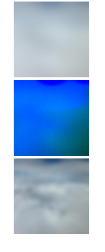
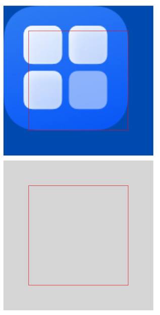

# 背景设置
<!--Kit: ArkUI-->
<!--Subsystem: ArkUI-->
<!--Owner: @CCFFWW-->
<!--Designer: @yangfan229-->
<!--Tester: @lxl007-->
<!--Adviser: @HelloCrease-->

设置组件的背景样式。

>  **说明：**
>
>  从API version 7开始支持。后续版本如有新增内容，则采用上角标单独标记该内容的起始版本。

## background<sup>10+</sup>

background(content: CustomBuilder | ResourceColor, options?: BackgroundOptions): T

设置组件背景。从API version 20开始，content参数新增了对[ResourceColor](ts-types.md#resourcecolor)类型的支持，并新增了背景向父组件的安全区扩展的能力。

**原子化服务API：** 从API version 11开始，该接口支持在原子化服务中使用。

**系统能力：** SystemCapability.ArkUI.ArkUI.Full

**参数：** 

| 参数名  | 类型                                                 | 必填 | 说明                                                         |
| ------- | ---------------------------------------------------- | ---- | ------------------------------------------------------------ |
| content | [CustomBuilder](ts-types.md#custombuilder8) \| [ResourceColor](ts-types.md#resourcecolor)        | 是   | 自定义背景。                                                 |
| options | [BackgroundOptions](#backgroundoptions20对象说明) | 否   | 设置自定义背景选项。<br/>**说明：**<br/>API version 20之前，options: <br/>{<br/>align?:&nbsp;[Alignment](ts-appendix-enums.md#alignment)<br/>}|

**返回值：**

| 类型 | 说明 |
| -------- | -------- |
| T | 返回当前组件。 |

>  **说明：**
>
> - 自定义背景渲染存在一定延迟，不能响应事件。该属性不支持嵌套使用。
> - CustomBuilder类型的背景不支持在预览器中预览。
> - 从API version 20开始，支持动态更新背景。
> - 同时设置background，backgroundColor，backgroundImage时，三者将按以下规则叠加显示：
>   - 若background为ResourceColor类型，或设置ignoresLayoutSafeAreaEdges属性，则background位于最底层。
>   - 其他情况下，background位于最上层。

## BackgroundOptions<sup>20+</sup>对象说明

background配置选项。

**系统能力：** SystemCapability.ArkUI.ArkUI.Full

| 名称          | 类型   | 必填 | 说明                                                         |
| ------------- | ------ | ---- | ------------------------------------------------------------ |
| align<sup>10+</sup>          | [Alignment](ts-appendix-enums.md#alignment) | 否   | 自定义背景与组件的对齐方式。该属性仅对CustomBuilder类型的背景生效。如果设置了ignoresLayoutSafeAreaEdges，则背景的布局区域为包含了扩展安全区的范围。<br/>默认值：Alignment.Center<br>**原子化服务API：** 从API version 11开始，该接口支持在原子化服务中使用。 |
| ignoresLayoutSafeAreaEdges | Array<[LayoutSafeAreaEdge](ts-universal-attributes-expand-safe-area.md#layoutsafeareaedge12)> | 否   | 配置背景要扩展到的安全区，包括：状态栏，导航栏和[safeAreaPadding](./ts-universal-attributes-size.md#safeareapadding14)。<br/> 默认值：<br/>- CustomBuilder背景：[]，不扩展。<br/>- ResourceColor背景：[LayoutSafeAreaEdge.ALL]，扩展至所有方向。<br/>**原子化服务API：** 从API version 20开始，该接口支持在原子化服务中使用。 |

> **说明：**
>
> Shape, RowSplit, ColumnSplit, SideBarContainer, Stepper, List, Grid, WaterFlow, Scroll, Refresh, Swiper, Tabs组件的clip属性默认值为true，子组件的背景扩展会被裁剪。

## backgroundColor

backgroundColor(value: ResourceColor): T

设置组件背景色。

**卡片能力：** 从API version 9开始，该接口支持在ArkTS卡片中使用。

**原子化服务API：** 从API version 11开始，该接口支持在原子化服务中使用。

**系统能力：** SystemCapability.ArkUI.ArkUI.Full

**参数：** 

| 参数名 | 类型                                       | 必填 | 说明               |
| ------ | ------------------------------------------ | ---- | ------------------ |
| value  | [ResourceColor](ts-types.md#resourcecolor) | 是   | 设置组件的背景色。 |

**返回值：**

| 类型   | 说明                     |
| ------ | ------------------------ |
| T | 返回当前组件。 |

## backgroundColor<sup>18+</sup>

backgroundColor(color: Optional\<ResourceColor>): T

设置组件背景色。与[backgroundColor](#backgroundcolor)相比，color参数新增了对undefined类型的支持。

**卡片能力：** 从API version 18开始，该接口支持在ArkTS卡片中使用。

**原子化服务API：** 从API version 18开始，该接口支持在原子化服务中使用。

**系统能力：** SystemCapability.ArkUI.ArkUI.Full

**参数：** 

| 参数名 | 类型                                                  | 必填 | 说明                                                         |
| ------ | ----------------------------------------------------- | ---- | ------------------------------------------------------------ |
| color  | Optional\<[ResourceColor](ts-types.md#resourcecolor)> | 是   | 设置组件的背景色。<br/>当color的值为undefined时，恢复为默认透明的背景色。 |

**返回值：**

| 类型   | 说明                     |
| ------ | ------------------------ |
| T | 返回当前组件。 |

>  **说明：**
>
>  当通过[backgroundBlurStyle](#backgroundblurstyle9)中的inactiveColor指定背景色时，不建议再通过backgroundColor设置背景色。

## backgroundColor<sup>20+</sup>

backgroundColor(color: Optional<ResourceColor | ColorMetrics>): T

设置组件背景色。与[backgroundColor](#backgroundcolor18)相比，color参数新增了对[ColorMetrics](../js-apis-arkui-graphics.md#colormetrics12)类型的支持。

**卡片能力：** 从API version 20开始，该接口支持在ArkTS卡片中使用。

**原子化服务API：** 从API version 20开始，该接口支持在原子化服务中使用。

**系统能力：** SystemCapability.ArkUI.ArkUI.Full

**参数：** 

| 参数名 | 类型                                                  | 必填 | 说明                                                         |
| ------ | ----------------------------------------------------- | ---- | ------------------------------------------------------------ |
| color  | Optional\<[ResourceColor](ts-types.md#resourcecolor) \| [ColorMetrics](../js-apis-arkui-graphics.md#colormetrics12)> | 是   | 设置组件的背景色。<br/>当color的值为undefined时，恢复为默认透明的背景色。 |

**返回值：**

| 类型   | 说明                     |
| ------ | ------------------------ |
| T | 返回当前组件。 |

## backgroundImage

backgroundImage(src: ResourceStr&nbsp;|&nbsp;PixelMap, repeat?: ImageRepeat): T

设置组件的背景图片。

**卡片能力：** 从API version 9开始，该接口支持在ArkTS卡片中使用。

**原子化服务API：** 从API version 11开始，该接口支持在原子化服务中使用。

**系统能力：** SystemCapability.ArkUI.ArkUI.Full

**参数：** 

| 参数名 | 类型                                            | 必填 | 说明                                                         |
| ------ | ----------------------------------------------- | ---- | ------------------------------------------------------------ |
| src    | [ResourceStr](ts-types.md#resourcestr) \| [PixelMap<sup>12+</sup>](../../apis-image-kit/arkts-apis-image-PixelMap.md)          | 是   | 图片地址，支持网络图片资源地址、本地图片资源地址、Base64和PixelMap资源，不支持svg和gif类型的图片。 |
| repeat | [ImageRepeat](ts-appendix-enums.md#imagerepeat) | 否   | 设置背景图片的重复样式，默认不重复。当设置的背景图片为透明底色图片，且同时设置了backgroundColor时，二者叠加显示，背景颜色在最底部。 |

**返回值：**

| 类型   | 说明                     |
| ------ | ------------------------ |
| T | 返回当前组件。 |

## backgroundImage<sup>18+</sup>

backgroundImage(src: ResourceStr&nbsp;|&nbsp;PixelMap, options?: BackgroundImageOptions): T

设置组件的背景图片。与[backgroundImage](#backgroundimage)相比，增加了设置图片同步或异步加载方式的能力。

**卡片能力：** 从API version 18开始，该接口支持在ArkTS卡片中使用。

**原子化服务API：** 从API version 18开始，该接口支持在原子化服务中使用。

**系统能力：** SystemCapability.ArkUI.ArkUI.Full

**参数：** 

| 参数名 | 类型                                            | 必填 | 说明                                                         |
| ------ | ----------------------------------------------- | ---- | ------------------------------------------------------------ |
| src    | [ResourceStr](ts-types.md#resourcestr) \| [PixelMap](../../apis-image-kit/arkts-apis-image-PixelMap.md)          | 是   | 图片地址，支持网络图片资源地址、本地图片资源地址、Base64和PixelMap资源，不支持svg、gif和webp等类型的动图。 |
| options | [BackgroundImageOptions](ts-universal-attributes-image-effect.md#backgroundimageoptions18) | 否   | 设置背景图选项。 |

**返回值：**

| 类型   | 说明                     |
| ------ | ------------------------ |
| T | 返回当前组件。 |

## backgroundImageSize

backgroundImageSize(value: SizeOptions | ImageSize): T

设置组件背景图片的宽度和高度。当未设置backgroundImageSize时，默认组件背景图片宽高效果为ImageSize.Auto。

**卡片能力：** 从API version 9开始，该接口支持在ArkTS卡片中使用。

**原子化服务API：** 从API version 11开始，该接口支持在原子化服务中使用。

**系统能力：** SystemCapability.ArkUI.ArkUI.Full

**参数：** 

| 参数名 | 类型                                                         | 必填 | 说明                                                         |
| ------ | ------------------------------------------------------------ | ---- | ------------------------------------------------------------ |
| value  | [SizeOptions](ts-types.md#sizeoptions)&nbsp;\|&nbsp;[ImageSize](ts-appendix-enums.md#imagesize) | 是   | 设置背景图像的高度和宽度。当输入为{width:&nbsp;Length,&nbsp;height:&nbsp;Length}对象时，如果只设置一个属性，则第二个属性保持图片原始宽高比进行调整。默认保持原图的比例不变。<br/>width和height取值范围： [0, +∞)<br/>**说明：** <br/>width和height均设置为小于或等于0的值时，按值为0显示。当width和height中只有一个值未设置或者设置为小于等于0的值时，另一个会根据图片原始宽高比进行调整。 |

**返回值：**

| 类型   | 说明                     |
| ------ | ------------------------ |
| T | 返回当前组件。 |

## backgroundImagePosition

backgroundImagePosition(value: Position | Alignment): T

设置背景图的位置。当未设置backgroundImagePosition时，组件默认背景图位置为当前组件左上角。

**卡片能力：** 从API version 9开始，该接口支持在ArkTS卡片中使用。

**原子化服务API：** 从API version 11开始，该接口支持在原子化服务中使用。

**系统能力：** SystemCapability.ArkUI.ArkUI.Full

**参数：** 

| 参数名 | 类型                                                         | 必填 | 说明                                                         |
| ------ | ------------------------------------------------------------ | ---- | ------------------------------------------------------------ |
| value  | [Position](ts-types.md#position)&nbsp;\|&nbsp;[Alignment](ts-appendix-enums.md#alignment) | 是   | 设置背景图在组件中显示位置，即相对于组件左上角的坐标。<br/> x和y值设置百分比时，偏移量是相对组件自身宽高计算的。 |

**返回值：**

| 类型   | 说明                     |
| ------ | ------------------------ |
| T | 返回当前组件。 |

## BlurStyle<sup>9+</sup>

模糊样式类型。

**系统能力：** SystemCapability.ArkUI.ArkUI.Full

| 名称                   | 值 | 说明        |
| -------------------- | ------- | --------- |
| Thin                 | - | 轻薄材质模糊。<br/>**卡片能力：** 从API version 9开始，该接口支持在ArkTS卡片中使用。<br/>**原子化服务API：** 从API version 11开始，该接口支持在原子化服务中使用。  |
| Regular              | - | 普通厚度材质模糊。<br/>**卡片能力：** 从API version 9开始，该接口支持在ArkTS卡片中使用。<br/>**原子化服务API：** 从API version 11开始，该接口支持在原子化服务中使用。 |
| Thick                | - | 厚材质模糊。<br/>**卡片能力：** 从API version 9开始，该接口支持在ArkTS卡片中使用。<br/>**原子化服务API：** 从API version 11开始，该接口支持在原子化服务中使用。    |
| BACKGROUND_THIN<sup>10+</sup>       | - | 近距景深模糊。<br/>**卡片能力：** 从API version 11开始，该接口支持在ArkTS卡片中使用。<br/>**原子化服务API：** 从API version 11开始，该接口支持在原子化服务中使用。   |
| BACKGROUND_REGULAR<sup>10+</sup>    | - | 中距景深模糊。<br/>**卡片能力：** 从API version 11开始，该接口支持在ArkTS卡片中使用。<br/>**原子化服务API：** 从API version 11开始，该接口支持在原子化服务中使用。   |
| BACKGROUND_THICK<sup>10+</sup>      | - | 远距景深模糊。<br/>**卡片能力：** 从API version 11开始，该接口支持在ArkTS卡片中使用。<br/>**原子化服务API：** 从API version 11开始，该接口支持在原子化服务中使用。   |
| BACKGROUND_ULTRA_THICK<sup>10+</sup> | - | 超远距景深模糊。<br/>**卡片能力：** 从API version 11开始，该接口支持在ArkTS卡片中使用。<br/>**原子化服务API：** 从API version 11开始，该接口支持在原子化服务中使用。  |
| NONE<sup>10+</sup> | - | 关闭模糊。<br/>**卡片能力：** 从API version 10开始，该接口支持在ArkTS卡片中使用。<br/>**原子化服务API：** 从API version 11开始，该接口支持在原子化服务中使用。  |
| COMPONENT_ULTRA_THIN<sup>11+</sup> | 8 | 组件超轻薄材质模糊。<br/>**卡片能力：** 从API version 11开始，该接口支持在ArkTS卡片中使用。<br/>**原子化服务API：** 从API version 12开始，该接口支持在原子化服务中使用。 |
| COMPONENT_THIN<sup>11+</sup> | 9 | 组件轻薄材质模糊。<br/>**卡片能力：** 从API version 11开始，该接口支持在ArkTS卡片中使用。<br/>**原子化服务API：** 从API version 12开始，该接口支持在原子化服务中使用。 |
| COMPONENT_REGULAR<sup>11+</sup> | 10 | 组件普通材质模糊。<br/>**卡片能力：** 从API version 11开始，该接口支持在ArkTS卡片中使用。<br/>**原子化服务API：** 从API version 12开始，该接口支持在原子化服务中使用。 |
| COMPONENT_THICK<sup>11+</sup> | 11 | 组件厚材质模糊。<br/>**卡片能力：** 从API version 11开始，该接口支持在ArkTS卡片中使用。<br/>**原子化服务API：** 从API version 12开始，该接口支持在原子化服务中使用。 |
| COMPONENT_ULTRA_THICK<sup>11+</sup> | 12 | 组件超厚材质模糊。<br/>**卡片能力：** 从API version 11开始，该接口支持在ArkTS卡片中使用。<br/>**原子化服务API：** 从API version 12开始，该接口支持在原子化服务中使用。 |

## SystemAdaptiveOptions<sup>19+</sup>

系统自适应调节参数，系统会默认开启根据芯片算力进行自适应效果调节的能力。

**卡片能力：** 从API version 19开始，该接口支持在ArkTS卡片中使用。

**原子化服务API：** 从API version 19开始，该接口支持在原子化服务中使用。

**系统能力：** SystemCapability.ArkUI.ArkUI.Full

| 名称        |   类型   |   必填 | 说明                        |
| ----        |  ----   |   ---- | --------------------------  |
| disableSystemAdaptation   |  boolean   |   否   |  系统自适应调节参数，推荐不携带该参数。该参数只影响低算力设备，低算力设备的定义由设备厂商决定。在低芯片算力的设备上，会根据算力和负载等条件，自动决策是否使用低算力的近似效果替代原有效果，比如模糊效果会结合接口中携带的模糊相关参数值及其他低算力处理逻辑，进行自适应效果降级处理。如果想关闭该功能，可以将该标志置为true。<br/>默认值：false |

## backgroundBlurStyle<sup>9+</sup>

backgroundBlurStyle(value: BlurStyle, options?: BackgroundBlurStyleOptions): T

为当前组件提供一种在背景材质模糊能力，通过枚举值的方式封装了不同的模糊半径、蒙版颜色、蒙版透明度、饱和度、亮度。

**卡片能力：** 从API version 9开始，该接口支持在ArkTS卡片中使用。

**原子化服务API：** 从API version 11开始，该接口支持在原子化服务中使用。

**系统能力：** SystemCapability.ArkUI.ArkUI.Full

**参数：** 

| 参数名                | 类型                                                         | 必填 | 说明                                                         |
| --------------------- | ------------------------------------------------------------ | ---- | ------------------------------------------------------------ |
| value                 | [BlurStyle](#blurstyle9)                                     | 是   | 背景模糊样式。模糊样式中封装了模糊半径、蒙版颜色、蒙版透明度、饱和度、亮度五个参数。 |
| options | [BackgroundBlurStyleOptions](#backgroundblurstyleoptions10对象说明) | 否   | 背景模糊选项。 <br/>该参数在ArkTS卡片中，暂不支持使用。                                              |

**返回值：**

| 类型   | 说明                     |
| ------ | ------------------------ |
| T | 返回当前组件。 |

## backgroundBlurStyle<sup>18+</sup>

backgroundBlurStyle(style: Optional\<BlurStyle>, options?: BackgroundBlurStyleOptions): T

为当前组件提供一种在背景材质模糊能力，通过枚举值的方式封装了不同的模糊半径、蒙版颜色、蒙版透明度、饱和度、亮度。与[backgroundBlurStyle<sup>9+</sup>](#backgroundblurstyle9)相比，style参数新增了对undefined类型的支持。

**卡片能力：** 从API version 18开始，该接口支持在ArkTS卡片中使用。

**原子化服务API：** 从API version 18开始，该接口支持在原子化服务中使用。

**系统能力：** SystemCapability.ArkUI.ArkUI.Full

**参数：** 

| 参数名                | 类型                                                         | 必填 | 说明                                                         |
| --------------------- | ------------------------------------------------------------ | ---- | ------------------------------------------------------------ |
| style                 | Optional\<[BlurStyle](#blurstyle9)>                          | 是   | 背景模糊样式。模糊样式中封装了模糊半径、蒙版颜色、蒙版透明度、饱和度、亮度五个参数。<br/>当style的值为undefined时，恢复为默认关闭模糊的背景。 |
| options | [BackgroundBlurStyleOptions](#backgroundblurstyleoptions10对象说明) | 否   | 背景模糊选项。<br/>该参数在ArkTS卡片中，暂不支持使用。                                            |

**返回值：**

| 类型   | 说明                     |
| ------ | ------------------------ |
| T | 返回当前组件。 |

>  **说明：**
>
>  当通过backgroundBlurStyle中的inactiveColor指定背景色时，不建议再通过[backgroundColor](#backgroundcolor)设置背景色。

## backgroundBlurStyle<sup>19+</sup>

backgroundBlurStyle(style: Optional\<BlurStyle>, options?: BackgroundBlurStyleOptions, sysOptions?: SystemAdaptiveOptions): T

为当前组件提供一种在背景材质模糊能力，通过枚举值的方式封装了不同的模糊半径、蒙版颜色、蒙版透明度、饱和度、亮度。与[backgroundBlurStyle<sup>18+</sup>](#backgroundblurstyle18)相比，新增了sysOptions参数，即支持系统自适应调节参数。

**卡片能力：** 从API version 19开始，该接口支持在ArkTS卡片中使用。

**原子化服务API：** 从API version 19开始，该接口支持在原子化服务中使用。

**系统能力：** SystemCapability.ArkUI.ArkUI.Full

**参数：** 

| 参数名                | 类型                                                         | 必填 | 说明                                                         |
| --------------------- | ------------------------------------------------------------ | ---- | ------------------------------------------------------------ |
| style                 | Optional\<[BlurStyle](#blurstyle9)>                          | 是   | 背景模糊样式。模糊样式中封装了模糊半径、蒙版颜色、蒙版透明度、饱和度、亮度五个参数。<br/>当style的值为undefined时，恢复为默认关闭模糊的背景。 |
| options | [BackgroundBlurStyleOptions](#backgroundblurstyleoptions10对象说明) | 否   | 背景模糊选项。<br/>该参数在ArkTS卡片中，暂不支持使用。                                            |
| sysOptions   |  [SystemAdaptiveOptions](#systemadaptiveoptions19)    |   否   |  系统自适应调节参数。<br/>默认值：{ disableSystemAdaptation: false }    |

**返回值：**

| 类型   | 说明                     |
| ------ | ------------------------ |
| T | 返回当前组件。 |

>  **说明：**
>
>  当通过backgroundBlurStyle中的inactiveColor指定背景色时，不建议再通过[backgroundColor](#backgroundcolor)设置背景色。

## backdropBlur

backdropBlur(value: number, options?: BlurOptions): T

为组件添加背景模糊效果，支持自定义设置模糊半径和灰阶参数。

**卡片能力：** 从API version 9开始，该接口支持在ArkTS卡片中使用。

**原子化服务API：** 从API version 11开始，该接口支持在原子化服务中使用。

**系统能力：** SystemCapability.ArkUI.ArkUI.Full

**参数：** 

| 参数名                | 类型                                                         | 必填 | 说明                                                         |
| --------------------- | ------------------------------------------------------------ | ---- | ------------------------------------------------------------ |
| value                 | number                                                       | 是   | 为当前组件添加背景模糊效果，入参为模糊半径，模糊半径越大越模糊，为0时不模糊。 |
| options<sup>11+</sup> | [BlurOptions](ts-universal-attributes-foreground-blur-style.md#bluroptions11) | 否   | 灰阶梯参数。                                                 |

**返回值：**

| 类型   | 说明                     |
| ------ | ------------------------ |
| T | 返回当前组件。 |

## backdropBlur<sup>18+</sup>

backdropBlur(radius: Optional\<number>, options?: BlurOptions): T

为组件添加背景模糊效果，支持自定义设置模糊半径和灰阶参数。与[backdropBlur](#backdropblur)相比，radius参数新增了对undefined类型的支持。

**卡片能力：** 从API version 18开始，该接口支持在ArkTS卡片中使用。

**原子化服务API：** 从API version 18开始，该接口支持在原子化服务中使用。

**系统能力：** SystemCapability.ArkUI.ArkUI.Full

**参数：** 

| 参数名                | 类型                                                         | 必填 | 说明                                                         |
| --------------------- | ------------------------------------------------------------ | ---- | ------------------------------------------------------------ |
| radius                | Optional\<number>                                            | 是   | 为当前组件添加背景模糊效果，入参为模糊半径，模糊半径越大越模糊，为0时不模糊。<br/>当radius的值为undefined时，恢复为默认无模糊的背景。 |
| options | [BlurOptions](ts-universal-attributes-foreground-blur-style.md#bluroptions11) | 否   | 灰阶梯参数。                                                 |

**返回值：**

| 类型   | 说明                     |
| ------ | ------------------------ |
| T | 返回当前组件。 |

>  **说明：**
>
>  blur和backdropBlur是实时模糊接口，会每帧进行实时渲染，性能负载较高。当模糊内容和模糊半径都不需要变化时，建议使用[静态模糊接口](../../apis-arkgraphics2d/js-apis-effectKit.md#blur)。

## backdropBlur<sup>19+</sup>

backdropBlur(radius: Optional\<number>, options?: BlurOptions, sysOptions?: SystemAdaptiveOptions): T

为组件添加背景模糊效果，支持自定义设置模糊半径和灰阶参数。与[backdropBlur<sup>18+</sup>](#backdropblur18)相比，新增了sysOptions参数，即支持系统自适应调节参数。

**卡片能力：** 从API version 19开始，该接口支持在ArkTS卡片中使用。

**原子化服务API：** 从API version 19开始，该接口支持在原子化服务中使用。

**系统能力：** SystemCapability.ArkUI.ArkUI.Full

**参数：** 

| 参数名                | 类型                                                         | 必填 | 说明                                                         |
| --------------------- | ------------------------------------------------------------ | ---- | ------------------------------------------------------------ |
| radius                | Optional\<number>                                            | 是   | 为当前组件添加背景模糊效果，入参为模糊半径，模糊半径越大越模糊，为0时不模糊。<br/>当radius的值为undefined时，恢复为默认无模糊的背景。 |
| options | [BlurOptions](ts-universal-attributes-foreground-blur-style.md#bluroptions11) | 否   | 灰阶梯参数。                                                 |
| sysOptions   |  [SystemAdaptiveOptions](#systemadaptiveoptions19)    |   否   |  系统自适应调节参数。<br/>默认值：{ disableSystemAdaptation: false }    |

**返回值：**

| 类型   | 说明                     |
| ------ | ------------------------ |
| T | 返回当前组件。 |

>  **说明：**
>
>  backgroundBlurStyle、blur和backdropBlur为实时接口，每帧执行实时渲染，性能负载较大。当模糊内容与模糊半径均无需变动时，推荐采用静态模糊接口[blur](../../apis-arkgraphics2d/js-apis-effectKit.md#blur)。最佳实践请参考[图像模糊动效优化-使用场景](https://developer.huawei.com/consumer/cn/doc/best-practices/bpta-fuzzy-scene-performance-optimization#section4945532519)。

## backgroundEffect<sup>11+</sup> 

backgroundEffect(options: BackgroundEffectOptions): T

设置组件背景属性，包括背景模糊半径、亮度、饱和度和颜色等参数。

**原子化服务API：** 从API version 12开始，该接口支持在原子化服务中使用。

**系统能力：** SystemCapability.ArkUI.ArkUI.Full

**参数：** 

| 参数名  | 类型                                                  | 必填 | 说明                                       |
| ------- | ----------------------------------------------------- | ---- | ------------------------------------------ |
| options | [BackgroundEffectOptions](#backgroundeffectoptions11) | 是   | 设置组件背景属性包括：饱和度，亮度，颜色。 |

**返回值：**

| 类型   | 说明                     |
| ------ | ------------------------ |
| T | 返回当前组件。 |

## backgroundEffect<sup>18+</sup>

backgroundEffect(options: Optional\<BackgroundEffectOptions>): T

设置组件背景属性，包括背景模糊半径、亮度、饱和度和颜色等参数。与[backgroundEffect<sup>11+</sup>](#backgroundeffect11 )相比，options参数新增了对undefined类型的支持。

**原子化服务API：** 从API version 18开始，该接口支持在原子化服务中使用。

**系统能力：** SystemCapability.ArkUI.ArkUI.Full

**参数：** 

| 参数名  | 类型                                                         | 必填 | 说明                                                         |
| ------- | ------------------------------------------------------------ | ---- | ------------------------------------------------------------ |
| options | Optional\<[BackgroundEffectOptions](#backgroundeffectoptions11)> | 是   | 设置组件背景属性包括：饱和度，亮度，颜色。<br/>当options的值为undefined时，恢复为无效果的背景。 |

**返回值：**

| 类型   | 说明                     |
| ------ | ------------------------ |
| T | 返回当前组件。 |

## backgroundEffect<sup>19+</sup> 

backgroundEffect(options: Optional\<BackgroundEffectOptions>, sysOptions?: SystemAdaptiveOptions): T

设置组件背景属性，包括背景模糊半径、亮度、饱和度和颜色等参数。与[backgroundEffect<sup>18+</sup>](#backgroundeffect18)相比，新增了sysOptions参数，即支持系统自适应调节参数。

> **说明：**
>
> backgroundEffect接口为实时接口，每帧对模糊等效果执行实时渲染，性能负载较大。当组件背景模糊效果无需变动时，推荐采用静态模糊接口[blur](../../apis-arkgraphics2d/js-apis-effectKit.md#blur)实现模糊效果。最佳实践请参考：[图像模糊动效优化-使用场景](https://developer.huawei.com/consumer/cn/doc/best-practices/bpta-fuzzy-scene-performance-optimization#section4945532519)。

**原子化服务API：** 从API version 19开始，该接口支持在原子化服务中使用。

**系统能力：** SystemCapability.ArkUI.ArkUI.Full

**参数：** 

| 参数名  | 类型                                                         | 必填 | 说明                                                         |
| ------- | ------------------------------------------------------------ | ---- | ------------------------------------------------------------ |
| options | Optional\<[BackgroundEffectOptions](#backgroundeffectoptions11)> | 是   | 设置组件背景属性包括：饱和度，亮度，颜色。<br/>当options的值为undefined时，恢复为无效果的背景。 |
| sysOptions   |  [SystemAdaptiveOptions](#systemadaptiveoptions19)    |   否   |  系统自适应调节参数。<br/>默认值：{ disableSystemAdaptation: false }    |

**返回值：**

| 类型   | 说明                     |
| ------ | ------------------------ |
| T | 返回当前组件。 |

## BackgroundEffectOptions<sup>11+</sup>

背景效果参数。

**系统能力：** SystemCapability.ArkUI.ArkUI.Full

| 名称        |   类型         |   必填 |  说明                        |
| ----         |  ----         |   ---- | --------------------------  |
| radius       | number        |   是   |   模糊半径，取值范围：[0, +∞)，默认为0。 <br/> **原子化服务API：** 从API version 12开始，该接口支持在原子化服务中使用。 |
| saturation   | number        |   否   |   饱和度，取值范围：[0, +∞)，默认为1。推荐取值范围：[0, 50]。 <br/> **原子化服务API：** 从API version 12开始，该接口支持在原子化服务中使用。    |
| brightness   | number        |   否   |   亮度，取值范围：[0, +∞)，默认为1。推荐取值范围：[0, 2]。<br/> **原子化服务API：** 从API version 12开始，该接口支持在原子化服务中使用。 |
| color        | [ResourceColor](ts-types.md#resourcecolor)         |   否   |   颜色，默认透明色。<br/> **原子化服务API：** 从API version 12开始，该接口支持在原子化服务中使用。  |
| adaptiveColor | [AdaptiveColor](ts-universal-attributes-foreground-blur-style.md#adaptivecolor10枚举说明) |   否  | 背景模糊效果使用的取色模式,默认为DEFAULT。使用AVERAGE时color必须带有透明度，取色模式才生效。 <br/> **原子化服务API：** 从API version 12开始，该接口支持在原子化服务中使用。  |
| blurOptions  | [BlurOptions](ts-universal-attributes-foreground-blur-style.md#bluroptions11) |   否   |   灰阶模糊参数，默认为[0,0]。 <br/> **原子化服务API：** 从API version 12开始，该接口支持在原子化服务中使用。 |
| policy<sup>14+</sup>    | [BlurStyleActivePolicy](#blurstyleactivepolicy14) | 否    | 模糊激活策略。<br/> 默认值：BlurStyleActivePolicy.ALWAYS_ACTIVE <br/> **原子化服务API：** 从API version 14开始，该接口支持在原子化服务中使用。|
| inactiveColor<sup>14+</sup>  | [ResourceColor](ts-types.md#resourcecolor)  | 否    | 模糊不生效时使用的背景色。该参数需配合policy参数使用。当policy使模糊失效时，控件模糊效果会被移除，如果设置了inactiveColor会使用inactiveColor作为控件背景色。<br/> **原子化服务API：** 从API version 14开始，该接口支持在原子化服务中使用。 |

## backgroundImageResizable<sup>12+</sup>

backgroundImageResizable(value: ResizableOptions): T

设置背景图在拉伸时可调整大小的图像选项。

设置合法的ResizableOptions时，[backgroundImage](#backgroundimage)属性中的repeat参数设置不生效。

当设置top+bottom大于原图的高或者left+right大于原图的宽时，ResizableOptions属性设置不生效。

**原子化服务API：** 从API version 12开始，该接口支持在原子化服务中使用。

**系统能力：** SystemCapability.ArkUI.ArkUI.Full

**参数：**

| 参数名 | 类型                                    | 必填 | 说明                             |
| ------ | --------------------------------------- | ---- | -------------------------------- |
| value  | [ResizableOptions](ts-basic-components-image.md#resizableoptions11) | 是   | 图像拉伸时可调整大小的图像选项。 |

**返回值：**

| 类型   | 说明                     |
| ------ | ------------------------ |
| T | 返回当前组件。 |

## BackgroundBlurStyleOptions<sup>10+</sup>对象说明

继承自[BlurStyleOptions](ts-universal-attributes-foreground-blur-style.md#blurstyleoptions)。

**原子化服务API：** 从API version 11开始，该接口支持在原子化服务中使用。

**系统能力：** SystemCapability.ArkUI.ArkUI.Full

| 名称 | 类型                                                         | 只读 | 可选 | 说明                                                 |
| ------ | ------------------------------------------------------------ | ---- | ---- |---------------------------------------------------- |
| policy<sup>14+</sup>  | [BlurStyleActivePolicy](#blurstyleactivepolicy14) | 否 | 是   | 模糊激活策略。<br/> 默认值：BlurStyleActivePolicy.ALWAYS_ACTIVE <br/>**原子化服务API：** 从API version 14开始，该接口支持在原子化服务中使用。 |
| inactiveColor<sup>14+</sup>  | [ResourceColor](ts-types.md#resourcecolor) | 否 | 是    | 模糊不生效时使用的背景色。该参数需配合policy参数使用。当policy使模糊失效时，控件模糊效果会被移除，如果设置了inactiveColor会使用inactiveColor作为控件背景色。<br/>**原子化服务API：** 从API version 14开始，该接口支持在原子化服务中使用。 |

## BlurStyleActivePolicy<sup>14+</sup>

**原子化服务API：** 从API version 14开始，该接口支持在原子化服务中使用。

**系统能力**：SystemCapability.ArkUI.ArkUI.Full

| 名称     | 值|说明                            |
| ------ | ----------------------------- |----------------------------- |
| FOLLOWS_WINDOW_ACTIVE_STATE| 0|模糊效果跟随窗口焦点状态变化，非焦点不模糊，焦点模糊。|
|  ALWAYS_ACTIVE  | 1|一直有模糊效果。|
| ALWAYS_INACTIVE |2 |一直无模糊效果。|

## backgroundBrightness<sup>12+</sup> 

backgroundBrightness(params: BackgroundBrightnessOptions): T

设置组件背景提亮效果。

**原子化服务API：** 从API version 12开始，该接口支持在原子化服务中使用。

**系统能力：** SystemCapability.ArkUI.ArkUI.Full

**参数：** 

| 参数名 | 类型                                                         | 必填 | 说明                                                 |
| ------ | ------------------------------------------------------------ | ---- | ---------------------------------------------------- |
| params | [BackgroundBrightnessOptions](#backgroundbrightnessoptions12对象说明) | 是   | 设置组件背景提亮效果，包括：亮度变化速率，提亮程度。 |

**返回值：**

| 类型   | 说明                     |
| ------ | ------------------------ |
| T | 返回当前组件。 |

## backgroundBrightness<sup>18+</sup> 

backgroundBrightness(options: Optional\<BackgroundBrightnessOptions>): T

设置组件背景提亮效果。与[backgroundBrightness<sup>12+</sup>](#backgroundbrightness12)相比，options参数新增了对undefined类型的支持。

**原子化服务API：** 从API version 18开始，该接口支持在原子化服务中使用。

**系统能力：** SystemCapability.ArkUI.ArkUI.Full

**参数：** 

| 参数名  | 类型                                                         | 必填 | 说明                                                         |
| ------- | ------------------------------------------------------------ | ---- | ------------------------------------------------------------ |
| options | Optional\<[BackgroundBrightnessOptions](#backgroundbrightnessoptions12对象说明)> | 是   | 设置组件背景提亮效果，包括：亮度变化速率，提亮程度。<br/>当options的值为undefined时，恢复为无提亮效果的背景。 |

**返回值：**

| 类型   | 说明                     |
| ------ | ------------------------ |
| T | 返回当前组件。 |

## BackgroundBrightnessOptions<sup>12+</sup>对象说明

背景亮度选项。

**原子化服务API：** 从API version 12开始，该接口支持在原子化服务中使用。

**系统能力：** SystemCapability.ArkUI.ArkUI.Full

| 名称          | 类型   | 必填 | 说明                                                         |
| ------------- | ------ | ---- | ------------------------------------------------------------ |
| rate          | number | 是   | 亮度变化速率。亮度变化速率越大，提亮程度下降速度越快。若rate为0，则lightUpDegree将不生效，即不会产生任何提亮效果。<br/>默认值：0.0 <br/>取值范围：(0.0, +∞) |
| lightUpDegree | number | 是   | 提亮程度。提亮程度越大，亮度提升程度越大。<br/> 默认值：0.0 <br/>取值范围：[-1.0, 1.0] |

>  **说明：**
>
>  对于组件背景内容，每个像素自身的亮度（灰阶值）的计算公式为：
>  `Y = （0.299R + 0.587G + 0.114B）/ 255.0`（R、G、B分别表示像素红色、绿色和蓝色通道的值，Y表示灰阶值），通过上述公式将像素点的灰阶值归一化至0~1的范围。
>  每个像素的亮度提升计算公式为：`ΔY = -rate*Y + lightUpDegree`。例如，当rate=0.5，lightUpDegree=0.5时，对于灰阶值为0.2的像素点，亮度增加值为`-0.5*0.2 + 0.5 = 0.4`，对于灰阶值为1的像素点，亮度增加值为`-0.5*1 + 0.5 = 0`。

## 示例

### 示例1（设置背景基础样式）

该示例通过配置backgroundColor、backgroundImage、backgroundImageSize和backgroundImagePosition设置背景的基础样式。

```ts
// xxx.ets
@Entry
@Component
struct BackgroundExample {

  build() {
    Column({ space: 5 }) {
      Text('background color').fontSize(9).width('90%').fontColor(0xCCCCCC)
      Row().width('90%').height(50).backgroundColor(0xE5E5E5).border({ width: 1 })

      Text('background image repeat along X').fontSize(9).width('90%').fontColor(0xCCCCCC)
      Row()
        //$r('app.media.image')需要替换为开发者所需的图像资源文件。
        .backgroundImage($r('app.media.image'), ImageRepeat.X)
        .backgroundImageSize({ width: '250px', height: '140px' })
        .width('90%')
        .height(70)
        .border({ width: 1 })

      Text('background image repeat along Y').fontSize(9).width('90%').fontColor(0xCCCCCC)
      Row()
        //$r('app.media.image')需要替换为开发者所需的图像资源文件。
        .backgroundImage($r('app.media.image'), ImageRepeat.Y)
        .backgroundImageSize({ width: '500px', height: '120px' })
        .width('90%')
        .height(100)
        .border({ width: 1 })

      Text('background image size').fontSize(9).width('90%').fontColor(0xCCCCCC)
      Row()
        .width('90%').height(150)
        //$r('app.media.image')需要替换为开发者所需的图像资源文件。
        .backgroundImage($r('app.media.image'), ImageRepeat.NoRepeat)
        .backgroundImageSize({ width: 1000, height: 500 })
        .border({ width: 1 })

      Text('background fill the box(Cover)').fontSize(9).width('90%').fontColor(0xCCCCCC)
      // 不保证图片完整的情况下占满盒子
      Row()
        .width(200)
        .height(50)
        //$r('app.media.image')需要替换为开发者所需的图像资源文件。
        .backgroundImage($r('app.media.image'), ImageRepeat.NoRepeat)
        .backgroundImageSize(ImageSize.Cover)
        .border({ width: 1 })

      Text('background fill the box(Contain)').fontSize(9).width('90%').fontColor(0xCCCCCC)
      // 保证图片完整的情况下放到最大
      Row()
        .width(200)
        .height(50)
        //$r('app.media.image')需要替换为开发者所需的图像资源文件。
        .backgroundImage($r('app.media.image'), ImageRepeat.NoRepeat)
        .backgroundImageSize(ImageSize.Contain)
        .border({ width: 1 })

      Text('background image position').fontSize(9).width('90%').fontColor(0xCCCCCC)
      Row()
        .width(100)
        .height(50)
        //$r('app.media.image')需要替换为开发者所需的图像资源文件。
        .backgroundImage($r('app.media.image'), ImageRepeat.NoRepeat)
        .backgroundImageSize({ width: 1000, height: 560 })
        .backgroundImagePosition({ x: -500, y: -300 })
        .border({ width: 1 })
    }
    .width('100%').height('100%').padding({ top: 5 })
  }
}
```


### 示例2（设置背景模糊样式）

该示例通过backgroundBlurStyle设置背景模糊样式。

```ts
// xxx.ets
@Entry
@Component
struct BackgroundBlurStyleDemo {
  build() {
    Column() {
      Row() {
        Text("Thin Material")
      }
      .width('50%')
      .height('50%')
      .backgroundBlurStyle(BlurStyle.Thin,
        { colorMode: ThemeColorMode.LIGHT, adaptiveColor: AdaptiveColor.DEFAULT, scale: 1.0 })
      .position({ x: '15%', y: '30%' })
    }
    .height('100%')
    .width('100%')
    .backgroundImage($r('app.media.bg'))
    .backgroundImageSize(ImageSize.Cover)
  }
}
```


### 示例3（设置组件背景）

该示例通过background设置组件背景。

```ts
// xxx.ets
@Entry
@Component
struct BackgroundExample {
  @Builder renderBackground() {
    Column() {
      Progress({value : 50})
    }
  }

  build() {
    Column() {
      Text("content")
        .width(100)
        .height(40)
        .fontColor("#FFF")
        .position({x:50, y:80})
        .textAlign(TextAlign.Center)
        .backgroundColor(Color.Green)
    }
    .width(200).height(200)
    .background(this.renderBackground)
    .backgroundColor(Color.Gray)
  }
}
```


### 示例4（设置组件背景提亮效果）

该示例通过backgroundBrightness设置组件背景提亮效果。

```ts
// xxx.ets
@Entry
@Component
struct BackgroundBrightnessDemo {
  build() {
    Column() {
      Row() {
        Text("BackgroundBrightness")
      }
      .width(200)
      .height(100)
      .position({ x: 100, y: 100 })
      .backgroundBlurStyle(BlurStyle.Thin, { colorMode: ThemeColorMode.LIGHT, adaptiveColor: AdaptiveColor.DEFAULT})
      .backgroundBrightness({rate:0.5,lightUpDegree:0.5}) // 背景提亮效果
    }
    .width('100%')
    .height('100%')
    .backgroundImage($r('app.media.image'))
    .backgroundImageSize(ImageSize.Cover)
  }
}
```

效果图如下：

rate和lightUpDegree参数值为0.5,0.5：


修改rate和lightUpDegree参数值为0.5,-0.1：


去掉backgroundBrightness的设置，效果如下：


### 示例5（设置模糊属性）

该示例提供了模糊属性的实现方法。通过blur设置内容模糊，通过backdropBlur设置背景模糊。

```ts
// xxx.ets
@Entry
@Component
struct BlurEffectsExample {
  build() {
    Column({ space: 10 }) {
      // 对字体进行模糊
      Text('font blur').fontSize(15).fontColor(0xCCCCCC).width('90%')
      Flex({ alignItems: ItemAlign.Center }) {
        Text('original text').margin(10)
        Text('blur text')
          .blur(5).margin(10)
        Text('blur text')
          .blur(10, undefined).margin(10) // 内容模糊半径为5，禁用系统自适应优化策略。
        Text('blur text')
          .blur(15).margin(10)
      }.width('90%').height(40)
      .backgroundColor(0xF9CF93)


      // 对背景进行模糊
      Text('backdropBlur').fontSize(15).fontColor(0xCCCCCC).width('90%')
      Text()
        .width('90%')
        .height(40)
        .fontSize(16)
        .backdropBlur(3)
        .backgroundImage($r('app.media.image'))
        .backgroundImageSize({ width: 1200, height: 160 })
    }.width('100%').margin({ top: 5 })
  }
}
```


### 示例6（设置文字异形模糊效果）

该示例通过blendMode和backgroundEffect实现文字异形模糊效果。<br/>
如果出现漏线问题，开发者应首先确保两个blendMode所在组件大小严格相同。如果确认相同，可能是组件边界落在浮点数坐标上导致，可尝试设置[pixelRound](ts-universal-attributes-pixelRoundForComponent.md#pixelround)通用属性，使产生的白线、暗线两侧的组件边界对齐到整数像素坐标上。

```ts
// xxx.ets
@Entry
@Component
struct Index {
  @State shColor: Color = Color.White;
  @State sizeDate: number = 20;
  @State rVal: number = 255;
  @State gVal: number = 255;
  @State bVal: number = 255;
  @State aVal: number = 0.1;
  @State rad: number = 40;
  @State satVal: number = 0.8;
  @State briVal: number = 1.5;
  build() {
    Stack() {
      Image($r('app.media.image'))
      Column() {
        Column({ space: 0 }) {
          Column() {
            Text('11')
              .fontSize(144)
              .fontWeight(FontWeight.Bold)
              .fontColor('rgba(255,255,255,1)')
              .fontFamily('HarmonyOS-Sans-Digit')
              .maxLines(1)
              .lineHeight(120 * 1.25)
              .height(120 * 1.25)
              .letterSpacing(4 * 1.25)
            Text('42')
              .fontSize(144)
              .fontWeight(FontWeight.Bold)
              .fontColor('rgba(255,255,255,1)')
              .fontFamily('HarmonyOS-Sans-Digit')
              .maxLines(1)
              .lineHeight(120 * 1.25)
              .height(120 * 1.25)
              .letterSpacing(4 * 1.25)
              .shadow({
                color: 'rgba(0,0,0,0)',
                radius: 20,
                offsetX: 0,
                offsetY: 0
              })
            Row() {
              Text('10月16日')
                .fontSize(this.sizeDate)
                .height(22)
                .fontWeight('medium')
                .fontColor('rgba(255,255,255,1)')
              Text('星期一')
                .fontSize(this.sizeDate)
                .height(22)
                .fontWeight('medium')
                .fontColor('rgba(255,255,255,1)')
            }
          }
          .blendMode(BlendMode.DST_IN, BlendApplyType.OFFSCREEN)
          .pixelRound({
            start: PixelRoundCalcPolicy.FORCE_FLOOR ,
            top: PixelRoundCalcPolicy.FORCE_FLOOR ,
            end: PixelRoundCalcPolicy.FORCE_CEIL,
            bottom: PixelRoundCalcPolicy.FORCE_CEIL
          })
        }
        .blendMode(BlendMode.SRC_OVER, BlendApplyType.OFFSCREEN)
        .backgroundEffect({
          radius: this.rad,
          saturation: this.satVal,
          brightness: this.briVal,
          color: this.getVolumeDialogWindowColor()
        })
        .justifyContent(FlexAlign.Center)
        .pixelRound({
          start: PixelRoundCalcPolicy.FORCE_FLOOR ,
          top: PixelRoundCalcPolicy.FORCE_FLOOR ,
          end: PixelRoundCalcPolicy.FORCE_CEIL,
          bottom: PixelRoundCalcPolicy.FORCE_CEIL
        })
      }
    }
  }
  getVolumeDialogWindowColor(): ResourceColor | string {
    return `rgba(${this.rVal.toFixed(0)}, ${this.gVal.toFixed(0)}, ${this.bVal.toFixed(0)}, ${this.aVal.toFixed(0)})`;
  }
}
```


### 示例7（模糊效果对比）

该示例对比了backgroundEffect、backDropBlur和backgroundBlurStyle三种不同的模糊效果。

```ts
// xxx.ets
@Entry
@Component
struct BackGroundBlur {
  private imageSize: number = 150;

  build() {
    Column({ space: 5 }) {
      // backgroundBlurStyle通过枚举值的方式设置模糊参数
      Stack() {
        Image($r('app.media.test'))
          .width(this.imageSize)
          .height(this.imageSize)
        Column()
          .width(this.imageSize)
          .height(this.imageSize)
          .backgroundBlurStyle(BlurStyle.Thin)
      }

      // backgroundEffect 可以自定义设置 模糊半径，亮度，饱和度等参数
      Stack() {
        Image($r('app.media.test'))
          .width(this.imageSize)
          .height(this.imageSize)
        Column()
          .width(this.imageSize)
          .height(this.imageSize)
          .backgroundEffect({ radius: 20, brightness: 0.6, saturation: 15 })
      }

      // backdropBlur 只能设置模糊半径和灰阶参数
      Stack() {
        Image($r('app.media.test'))
          .width(this.imageSize)
          .height(this.imageSize)
        Column()
          .width(this.imageSize)
          .height(this.imageSize)
          .backdropBlur(20, { grayscale: [30, 50] })
      }
    }
    .width('100%')
    .padding({ top: 5 })
  }
}
```



### 示例8（设置P3色域背景效果）

该示例通过backgroundColor设置P3色域背景效果。

```ts
// xxx.ets
// 设置P3色域时需要在ets/entryability/EntryAbility.ets中，通过setColorSpace接口将当前窗口设置为广色域。
import { ColorMetrics } from '@kit.ArkUI';

@Entry
@Component
struct P3BackgroundDemo {
  @State p3Color: ColorMetrics = ColorMetrics.colorWithSpace(ColorSpace.DISPLAY_P3, 0, 0.3, 0.8, 1);

  build() {
    Column({ space: 5 }) {
      Text('background color with colorMetrics').fontSize(9).width('90%').fontColor(0xCCCCCC)
      Row().width('90%').height(50).backgroundColor(this.p3Color)
    }
    .width('100%')
    .height('100%')
  }
}
```


### 示例9（设置组件背景扩展）

该示例通过background实现组件背景扩展到父组件的安全区。

```ts
import { LengthMetrics } from '@kit.ArkUI';

@Entry
@Component
struct BackgroundExtension {
  @Builder
  myImages() {
    Column() {
      Image($r('app.media.startIcon'))
        .width('100%')
        .height('100%')
    }
  }

  build() {
    Column({space: 10}) {
      Stack() {
        // CustomBuilder类型的背景设置了ignoresLayoutSafeAreaEdges属性，背景扩展到父组件安全区
        Column()
          .size({ width: '100%', height: '100%' })
          .border({ width: 1, color: Color.Red })
          .background(
            this.myImages(),
            { align: Alignment.Center , ignoresLayoutSafeAreaEdges: [ LayoutSafeAreaEdge.START, LayoutSafeAreaEdge.TOP ] }
          )
      }
      .size({ width: 300, height: 300 })
      .backgroundColor('#004aaf')
      .safeAreaPadding(LengthMetrics.vp(50))

      Stack() {
        // ResourceColor类型的背景未设置ignoresLayoutSafeAreaEdges属性，背景默认扩展到父组件安全区
        Column()
          .size({ width: '100%', height: '100%' })
          .border({ width: 1, color: Color.Red })
          .background('#d5d5d5', { align: Alignment.Center })
      }
      .size({ width: 300, height: 300 })
      .backgroundColor('#707070')
      .safeAreaPadding(LengthMetrics.vp(50))
    }
    .margin(10)
  }
}
```

