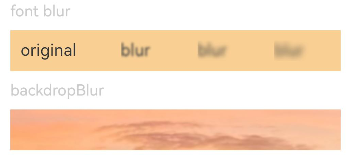
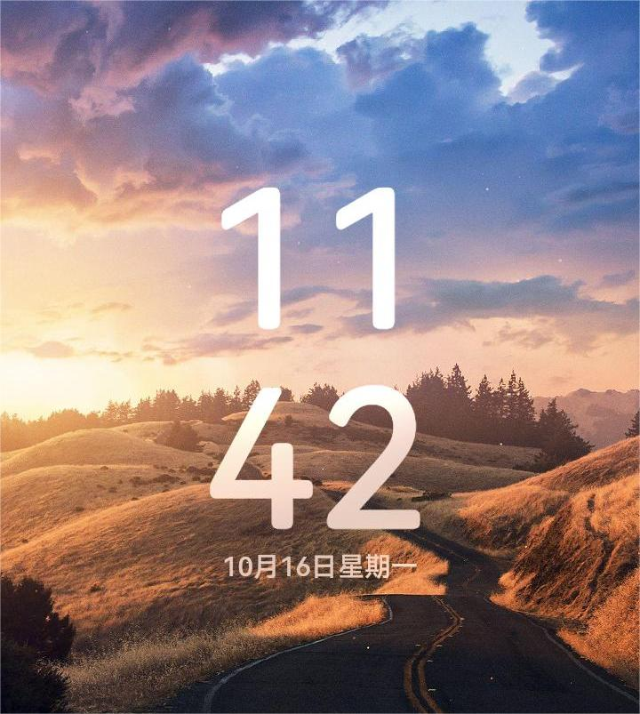
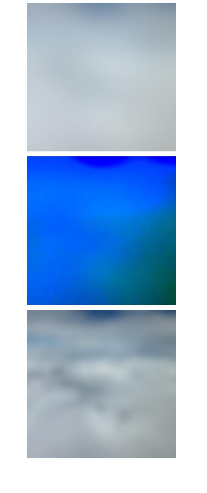
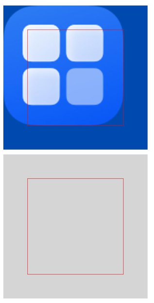

# 背景设置
<!--Kit: ArkUI-->
<!--Subsystem: ArkUI-->
<!--Owner: @hehongyang3-->
<!--Designer: @hehongyang3-->
<!--Tester: @lxl007-->
<!--Adviser: @Brilliantry_Rui-->

设置组件的背景样式。

>  **说明：**
>
>  从API version 7开始支持。后续版本如有新增内容，则采用上角标单独标记该内容的起始版本。

## background<sup>10+</sup>

background(content: CustomBuilder | ResourceColor, options?: BackgroundOptions): T

设置组件背景。从API version 20开始，content参数新增了对[ResourceColor](ts-types.md#resourcecolor)类型的支持，并新增了背景向父组件的安全区扩展的能力。当仅需设置背景色且不需要安全区扩展时，推荐使用[backgroundColor](#backgroundcolor)；当需要背景色同时扩展到安全区时，可使用background(content: ResourceColor)配合ignoresLayoutSafeAreaEdges属性。

>**说明：**
>
> - 不支持[onAppear](ts-universal-events-show-hide.md#onappear)和[onDisAppear](ts-universal-events-show-hide.md#ondisappear)等和节点挂载/卸载相关的事件。
>
> - 从API version 20开始，该接口仅当content的入参类型为ResourceColor时支持在[attributeModifier](ts-universal-attributes-attribute-modifier.md#attributemodifier)中调用。

**原子化服务API：** 从API version 11开始，该接口支持在原子化服务中使用。

**模型约束：** 此接口仅可在Stage模型下使用。

**系统能力：** SystemCapability.ArkUI.ArkUI.Full

**参数：** 

| 参数名  | 类型                                                 | 必填 | 说明                                                         |
| ------- | ---------------------------------------------------- | ---- | ------------------------------------------------------------ |
| content | [CustomBuilder](ts-types.md#custombuilder8) \| [ResourceColor](ts-types.md#resourcecolor)        | 是   | 设置背景内容，支持CustomBuilder类型的自定义构建背景和ResourceColor类型的颜色背景。                                                 |
| options | [BackgroundOptions](#backgroundoptions20对象说明) | 否   | 设置自定义背景选项。<br>**说明：**<br>API version 20之前，options: <br>{<br>align?:&nbsp;[Alignment](ts-appendix-enums.md#alignment)<br>}|

**返回值：**

| 类型 | 说明 |
| -------- | -------- |
| T | 返回当前组件，用于链式调用。 |

>  **说明：**
>
> - 自定义背景渲染存在延迟，不能响应事件。该属性不支持嵌套使用。
> - CustomBuilder类型的背景不支持在预览器中预览。
> - 从API version 20开始，支持动态更新背景。
> - 同时设置background，backgroundColor，backgroundImage时，三者将按以下规则叠加显示：
>   - 若background为ResourceColor类型，或设置ignoresLayoutSafeAreaEdges属性，则background位于最底层，backgroundColor位于backgroundImage之下。
>   - 其他情况下，background位于最上层，backgroundColor位于backgroundImage之下。
> - 在background设置content参数为CustomBuilder类型时，background不会跟随CustomBuilder内容更新而变化。

## BackgroundOptions<sup>20+</sup>对象说明

background配置选项。

**模型约束：** 此接口仅可在Stage模型下使用。

**系统能力：** SystemCapability.ArkUI.ArkUI.Full

| 名称          | 类型   | 只读 | 可选 | 说明                                                         |
| ------------- | ------ | ---- | ---- | ------------------------------------------------------------ |
| align<sup>10+</sup>          | [Alignment](ts-appendix-enums.md#alignment) | 否   | 是   | 自定义背景与组件的对齐方式。该属性仅对CustomBuilder类型的背景生效，对ResourceColor类型的背景设置align属性无效。如果设置了ignoresLayoutSafeAreaEdges，则背景的布局区域为包含了扩展安全区的范围。<br>默认值：Alignment.Center<br>**原子化服务API：** 从API version 11开始，该接口支持在原子化服务中使用。 |
| ignoresLayoutSafeAreaEdges | Array<[LayoutSafeAreaEdge](ts-universal-attributes-expand-safe-area.md#layoutsafeareaedge12)> | 否   |  是   |配置背景要扩展到的安全区，包括：状态栏，导航栏和[safeAreaPadding](ts-universal-attributes-size.md#safeareapadding14)。设置该属性后，背景的对齐布局区域将包含扩展安全区的范围。<br> 默认值：<br>- CustomBuilder背景：[]，不扩展。<br>- ResourceColor背景：[LayoutSafeAreaEdge.ALL]，扩展至所有方向。<br>**原子化服务API：** 从API version 20开始，该接口支持在原子化服务中使用。 |

> **说明：**
>
> Shape, RowSplit, ColumnSplit, SideBarContainer, Stepper, List, Grid, WaterFlow, Scroll, Refresh, Swiper, Tabs组件的clip属性默认值为true，子组件的背景扩展会被裁剪。

## backgroundColor

backgroundColor(value: ResourceColor): T

设置组件背景色。

> **说明：**
>
> 同时设置background、backgroundColor、backgroundImage时，三者叠加显示规则如下：若background为ResourceColor类型，或设置ignoresLayoutSafeAreaEdges属性，则background位于最底层；其他情况下，background位于最上层。

**卡片能力：** 从API version 9开始，该接口支持在ArkTS卡片中使用。

**原子化服务API：** 从API version 11开始，该接口支持在原子化服务中使用。

**系统能力：** SystemCapability.ArkUI.ArkUI.Full

**参数：** 

| 参数名 | 类型                                       | 必填 | 说明               |
| ------ | ------------------------------------------ | ---- | ------------------ |
| value  | [ResourceColor](ts-types.md#resourcecolor) | 是   | 设置组件的背景色。 |

**返回值：**

| 类型   | 说明                     |
| ------ | ------------------------ |
| T | 返回当前组件，用于链式调用。 |

## backgroundColor<sup>18+</sup>

backgroundColor(color: Optional\<ResourceColor>): T

设置组件背景色。与[backgroundColor](#backgroundcolor)相比，color参数新增了对undefined类型的支持。

**卡片能力：** 从API version 18开始，该接口支持在ArkTS卡片中使用。

**原子化服务API：** 从API version 18开始，该接口支持在原子化服务中使用。

**模型约束：** 此接口仅可在Stage模型下使用。

**系统能力：** SystemCapability.ArkUI.ArkUI.Full

**参数：** 

| 参数名 | 类型                                                  | 必填 | 说明                                                         |
| ------ | ----------------------------------------------------- | ---- | ------------------------------------------------------------ |
| color  | Optional\<[ResourceColor](ts-types.md#resourcecolor)> | 是   | 设置组件的背景色。<br>当color的值为undefined时，恢复为默认透明的背景色。 |

**返回值：**

| 类型   | 说明                     |
| ------ | ------------------------ |
| T | 返回当前组件，用于链式调用。 |

>  **说明：**
>
>  当通过[backgroundBlurStyle](#backgroundblurstyle9)中的inactiveColor指定背景色时，不建议再通过backgroundColor设置背景色。

## backgroundColor<sup>20+</sup>

backgroundColor(color: Optional<ResourceColor | ColorMetrics>): T

设置组件背景色。与[backgroundColor](#backgroundcolor18)相比，color参数新增了对[ColorMetrics](../js-apis-arkui-graphics.md#colormetrics12)类型的支持。

> **说明：**
>
> 当通过[backgroundBlurStyle](#backgroundblurstyle9)中的inactiveColor指定背景色时，不建议再通过backgroundColor设置背景色。

**卡片能力：** 从API version 20开始，该接口支持在ArkTS卡片中使用。

**原子化服务API：** 从API version 20开始，该接口支持在原子化服务中使用。

**模型约束：** 此接口仅可在Stage模型下使用。

**系统能力：** SystemCapability.ArkUI.ArkUI.Full

**参数：** 

| 参数名 | 类型                                                  | 必填 | 说明                                                         |
| ------ | ----------------------------------------------------- | ---- | ------------------------------------------------------------ |
| color  | Optional\<[ResourceColor](ts-types.md#resourcecolor) \| [ColorMetrics](../js-apis-arkui-graphics.md#colormetrics12)> | 是   | 设置组件的背景色。<br>当color的值为undefined时，恢复为默认透明的背景色。<br>当需要设置P3广色域背景色时，需使用ColorMetrics类型参数。<br>**说明：**<br>当使用ColorMetrics设置P3色域颜色时，需先通过setColorSpace接口将当前窗口设置为广色域，否则P3色域颜色无法正确显示。 |

**返回值：**

| 类型   | 说明                     |
| ------ | ------------------------ |
| T | 返回当前组件，用于链式调用。 |

## backgroundImage

backgroundImage(src: ResourceStr&nbsp;|&nbsp;PixelMap, repeat?: ImageRepeat): T

设置组件的背景图片，支持网络图片、本地图片、Base64和PixelMap资源。

**卡片能力：** 从API version 9开始，该接口支持在ArkTS卡片中使用。

**原子化服务API：** 从API version 11开始，该接口支持在原子化服务中使用。

**系统能力：** SystemCapability.ArkUI.ArkUI.Full

**参数：** 

| 参数名 | 类型                                            | 必填 | 说明                                                         |
| ------ | ----------------------------------------------- | ---- | ------------------------------------------------------------ |
| src    | [ResourceStr](ts-types.md#resourcestr) \| [PixelMap](../../apis-image-kit/arkts-apis-image-PixelMap.md)<sup>12+</sup>         | 是   | 图片地址。API version 22及之前版本，支持网络图片资源地址、本地图片资源地址、Base64和PixelMap资源，不支持svg图片，以及gif和webp等类型的动图。 从API version 23开始，新增支持webp和gif类型的动图，显示动图第一帧，不支持其他类型的动图。|
| repeat | [ImageRepeat](ts-appendix-enums.md#imagerepeat) | 否   | 设置背景图片的重复样式，默认不重复。设置合法的[backgroundImageResizable](#backgroundimageresizable12)时，该参数设置不生效。当设置的背景图片为透明底色图片，且同时设置了backgroundColor时，二者叠加显示，背景色在最底部。 |

**返回值：**

| 类型   | 说明                     |
| ------ | ------------------------ |
| T | 返回当前组件，用于链式调用。 |

## backgroundImage<sup>18+</sup>

backgroundImage(src: ResourceStr&nbsp;|&nbsp;PixelMap, options?: BackgroundImageOptions): T

设置组件的背景图片。与[backgroundImage](#backgroundimage)相比，增加了设置图片同步或异步加载方式的能力。

> **说明：**
>
> 该接口不支持在[attributeModifier](ts-universal-attributes-attribute-modifier.md#attributemodifier)中调用。

**卡片能力：** 从API version 18开始，该接口支持在ArkTS卡片中使用。

**原子化服务API：** 从API version 18开始，该接口支持在原子化服务中使用。

**模型约束：** 此接口仅可在Stage模型下使用。

**系统能力：** SystemCapability.ArkUI.ArkUI.Full

**参数：** 

<!--Table: 10%; auto; 10%; auto-->
| 参数名 | 类型                                            | 必填 | 说明                                                         |
| ------ | ----------------------------------------------- | ---- | ------------------------------------------------------------ |
| src    | [ResourceStr](ts-types.md#resourcestr) \| [PixelMap](../../apis-image-kit/arkts-apis-image-PixelMap.md)          | 是   | 图片地址。API version 22及之前版本，支持网络图片资源地址、本地图片资源地址、Base64和PixelMap资源，不支持svg图片，以及gif和webp等类型的动图。 从API version 23开始，新增支持webp和gif类型的动图，显示动图第一帧，不支持其他类型的动图。 |
| options | [BackgroundImageOptions](ts-universal-attributes-image-effect.md#backgroundimageoptions18) | 否   | 设置背景图片选项，用于配置图片的同步或异步加载方式等参数。 |

**返回值：**

| 类型   | 说明                     |
| ------ | ------------------------ |
| T | 返回当前组件，用于链式调用。 |

## backgroundImageSize

backgroundImageSize(value: SizeOptions | ImageSize): T

设置组件背景图片的宽度和高度。当未设置backgroundImageSize时，默认组件背景图片宽高效果为[ImageSize.Auto](ts-appendix-enums.md#imagesize)。

**卡片能力：** 从API version 9开始，该接口支持在ArkTS卡片中使用。

**原子化服务API：** 从API version 11开始，该接口支持在原子化服务中使用。

**系统能力：** SystemCapability.ArkUI.ArkUI.Full

**参数：** 

| 参数名 | 类型                                                         | 必填 | 说明                                                         |
| ------ | ------------------------------------------------------------ | ---- | ------------------------------------------------------------ |
| value  | [SizeOptions](ts-types.md#sizeoptions)&nbsp;\|&nbsp;[ImageSize](ts-appendix-enums.md#imagesize) | 是   | 设置背景图片的高度和宽度。默认保持原图的比例不变。<br>width和height取值范围： [0, +∞)<br>ImageSize用于控制图片缩放显示模式，如保持比例、填充边界等。<br>**说明：** <br>width和height均设置为小于或等于0的值时，按值为0显示。当width和height中只有一个值未设置或者设置为小于等于0的值时，另一个会根据图片原始宽高比进行调整。 |

**返回值：**

| 类型   | 说明                     |
| ------ | ------------------------ |
| T | 返回当前组件，用于链式调用。 |

## backgroundImagePosition

backgroundImagePosition(value: Position | Alignment): T

设置背景图片的位置。当未设置backgroundImagePosition时，组件默认背景图片位置为当前组件左上角。

**卡片能力：** 从API version 9开始，该接口支持在ArkTS卡片中使用。

**原子化服务API：** 从API version 11开始，该接口支持在原子化服务中使用。

**系统能力：** SystemCapability.ArkUI.ArkUI.Full

**参数：** 

| 参数名 | 类型                                                         | 必填 | 说明                                                         |
| ------ | ------------------------------------------------------------ | ---- | ------------------------------------------------------------ |
| value  | [Position](ts-types.md#position)&nbsp;\|&nbsp;[Alignment](ts-appendix-enums.md#alignment) | 是   | 设置背景图片在组件中显示位置，即相对于组件左上角的坐标。<br> x和y值设置百分比时，偏移量是相对组件自身宽高计算的。 |

**返回值：**

| 类型   | 说明                     |
| ------ | ------------------------ |
| T | 返回当前组件，用于链式调用。 |

## BlurStyle<sup>9+</sup>

模糊样式类型。

**系统能力：** SystemCapability.ArkUI.ArkUI.Full

| 名称                   | 值 | 说明        |
| -------------------- | ------- | --------- |
| Thin                 | - | 轻薄材质模糊。<br>**卡片能力：** 从API version 9开始，该接口支持在ArkTS卡片中使用。<br>**原子化服务API：** 从API version 11开始，该接口支持在原子化服务中使用。  |
| Regular              | - | 普通厚度材质模糊。<br>**卡片能力：** 从API version 9开始，该接口支持在ArkTS卡片中使用。<br>**原子化服务API：** 从API version 11开始，该接口支持在原子化服务中使用。 |
| Thick                | - | 厚材质模糊。<br>**卡片能力：** 从API version 9开始，该接口支持在ArkTS卡片中使用。<br>**原子化服务API：** 从API version 11开始，该接口支持在原子化服务中使用。    |
| BACKGROUND_THIN<sup>10+</sup>       | 3 | 近距景深模糊。<br>**卡片能力：** 从API version 11开始，该接口支持在ArkTS卡片中使用。<br>**原子化服务API：** 从API version 11开始，该接口支持在原子化服务中使用。<br>**模型约束：** 此接口仅可在Stage模型下使用。   |
| BACKGROUND_REGULAR<sup>10+</sup>    | 4 | 中距景深模糊。<br>**卡片能力：** 从API version 11开始，该接口支持在ArkTS卡片中使用。<br>**原子化服务API：** 从API version 11开始，该接口支持在原子化服务中使用。<br>**模型约束：** 此接口仅可在Stage模型下使用。   |
| BACKGROUND_THICK<sup>10+</sup>      | 5 | 远距景深模糊。<br>**卡片能力：** 从API version 11开始，该接口支持在ArkTS卡片中使用。<br>**原子化服务API：** 从API version 11开始，该接口支持在原子化服务中使用。<br>**模型约束：** 此接口仅可在Stage模型下使用。   |
| BACKGROUND_ULTRA_THICK<sup>10+</sup> | 6 | 超远距景深模糊。<br>**卡片能力：** 从API version 11开始，该接口支持在ArkTS卡片中使用。<br>**原子化服务API：** 从API version 11开始，该接口支持在原子化服务中使用。<br>**模型约束：** 此接口仅可在Stage模型下使用。  |
| NONE<sup>10+</sup> | 7 | 关闭模糊。<br>**卡片能力：** 从API version 10开始，该接口支持在ArkTS卡片中使用。<br>**原子化服务API：** 从API version 11开始，该接口支持在原子化服务中使用。<br>**模型约束：** 此接口仅可在Stage模型下使用。  |
| COMPONENT_ULTRA_THIN<sup>11+</sup> | 8 | 组件超轻薄材质模糊。<br>**卡片能力：** 从API version 11开始，该接口支持在ArkTS卡片中使用。<br>**原子化服务API：** 从API version 12开始，该接口支持在原子化服务中使用。<br>**模型约束：** 此接口仅可在Stage模型下使用。 |
| COMPONENT_THIN<sup>11+</sup> | 9 | 组件轻薄材质模糊。<br>**卡片能力：** 从API version 11开始，该接口支持在ArkTS卡片中使用。<br>**原子化服务API：** 从API version 12开始，该接口支持在原子化服务中使用。<br>**模型约束：** 此接口仅可在Stage模型下使用。 |
| COMPONENT_REGULAR<sup>11+</sup> | 10 | 组件普通材质模糊。<br>**卡片能力：** 从API version 11开始，该接口支持在ArkTS卡片中使用。<br>**原子化服务API：** 从API version 12开始，该接口支持在原子化服务中使用。<br>**模型约束：** 此接口仅可在Stage模型下使用。 |
| COMPONENT_THICK<sup>11+</sup> | 11 | 组件厚材质模糊。<br>**卡片能力：** 从API version 11开始，该接口支持在ArkTS卡片中使用。<br>**原子化服务API：** 从API version 12开始，该接口支持在原子化服务中使用。<br>**模型约束：** 此接口仅可在Stage模型下使用。 |
| COMPONENT_ULTRA_THICK<sup>11+</sup> | 12 | 组件超厚材质模糊。<br>**卡片能力：** 从API version 11开始，该接口支持在ArkTS卡片中使用。<br>**原子化服务API：** 从API version 12开始，该接口支持在原子化服务中使用。<br>**模型约束：** 此接口仅可在Stage模型下使用。 |

## SystemAdaptiveOptions<sup>19+</sup>

系统自适应调节参数，系统会默认开启根据芯片算力进行自适应效果调节的能力。

**卡片能力：** 从API version 19开始，该接口支持在ArkTS卡片中使用。

**原子化服务API：** 从API version 19开始，该接口支持在原子化服务中使用。

**模型约束：** 此接口仅可在Stage模型下使用。

**系统能力：** SystemCapability.ArkUI.ArkUI.Full

<!--Table: auto; auto; 10%; 10%; auto-->
| 名称        |   类型   |   只读  |  可选  | 说明                        |
| ----        |  ----   |   ---- |  ---- | --------------------------  |
| disableSystemAdaptation   |  boolean   |   否   |  是  |  系统自适应调节参数，推荐不携带该参数。设为true表示关闭系统自适应调节功能，设为false表示开启系统自适应调节功能。该参数只影响低算力设备，低算力设备的定义由设备厂商决定。在低芯片算力的设备上，会根据算力和负载等条件，自动决策是否使用低算力的近似效果替代原有效果，比如模糊效果会结合接口中携带的模糊相关参数值及其他低算力处理逻辑，进行自适应效果降级处理。<br>默认值：false |

## backgroundBlurStyle<sup>9+</sup>

backgroundBlurStyle(value: BlurStyle, options?: BackgroundBlurStyleOptions): T

为当前组件提供一种背景材质模糊能力，通过枚举值的方式封装了不同的模糊半径、蒙版颜色、蒙版透明度、饱和度、亮度。

> **说明：**
>
> backgroundBlurStyle、[backdropBlur](#backdropblur)和[backgroundEffect](#backgroundeffect11)均为背景模糊接口，提供不同级别的模糊自定义能力：backgroundBlurStyle通过枚举值快速设置预定义模糊样式；backdropBlur支持自定义模糊半径和灰阶参数；backgroundEffect支持自定义模糊半径、亮度、饱和度和颜色等更多参数。同一组件上同时设置多个背景模糊接口时，仅最后一个设置的接口生效，之前的模糊效果会被覆盖。

**卡片能力：** 从API version 9开始，该接口支持在ArkTS卡片中使用。

**原子化服务API：** 从API version 11开始，该接口支持在原子化服务中使用。

**系统能力：** SystemCapability.ArkUI.ArkUI.Full

**参数：** 

| 参数名                | 类型                                                         | 必填 | 说明                                                         |
| --------------------- | ------------------------------------------------------------ | ---- | ------------------------------------------------------------ |
| value                 | [BlurStyle](#blurstyle9)                                     | 是   | 背景模糊样式。模糊样式中封装了模糊半径、蒙版颜色、蒙版透明度、饱和度、亮度五个参数。 |
| options | [BackgroundBlurStyleOptions](#backgroundblurstyleoptions10对象说明) | 否   | 背景模糊选项，用于配置模糊激活策略和不生效时的背景色。不传入时使用默认激活策略[BlurStyleActivePolicy](#blurstyleactivepolicy14).ALWAYS_ACTIVE。<br>该参数在ArkTS卡片中，暂不支持使用。                                              |

**返回值：**

| 类型   | 说明                     |
| ------ | ------------------------ |
| T | 返回当前组件，用于链式调用。 |

## backgroundBlurStyle<sup>18+</sup>

backgroundBlurStyle(style: Optional\<BlurStyle>, options?: BackgroundBlurStyleOptions): T

为当前组件提供一种背景材质模糊能力，通过枚举值的方式封装了不同的模糊半径、蒙版颜色、蒙版透明度、饱和度、亮度。与[backgroundBlurStyle<sup>9+</sup>](#backgroundblurstyle9)相比，style参数新增了对undefined类型的支持。

**卡片能力：** 从API version 18开始，该接口支持在ArkTS卡片中使用。

**原子化服务API：** 从API version 18开始，该接口支持在原子化服务中使用。

**模型约束：** 此接口仅可在Stage模型下使用。

**系统能力：** SystemCapability.ArkUI.ArkUI.Full

**参数：** 

| 参数名                | 类型                                                         | 必填 | 说明                                                         |
| --------------------- | ------------------------------------------------------------ | ---- | ------------------------------------------------------------ |
| style                 | Optional\<[BlurStyle](#blurstyle9)>                          | 是   | 背景模糊样式。模糊样式中封装了模糊半径、蒙版颜色、蒙版透明度、饱和度、亮度五个参数。<br>当style的值为undefined时，恢复为默认关闭模糊的背景。 |
| options | [BackgroundBlurStyleOptions](#backgroundblurstyleoptions10对象说明) | 否   | 背景模糊选项。用于配置模糊激活策略和不生效时的背景色。不传入时使用默认激活策略[BlurStyleActivePolicy](#blurstyleactivepolicy14).ALWAYS_ACTIVE。<br>该参数在ArkTS卡片中，暂不支持使用。                                            |

**返回值：**

| 类型   | 说明                     |
| ------ | ------------------------ |
| T | 返回当前组件，用于链式调用。 |

>  **说明：**
>
>  当通过backgroundBlurStyle中的inactiveColor指定背景色时，不建议再通过[backgroundColor](#backgroundcolor)设置背景色。

## backgroundBlurStyle<sup>19+</sup>

backgroundBlurStyle(style: Optional\<BlurStyle>, options?: BackgroundBlurStyleOptions, sysOptions?: SystemAdaptiveOptions): T

为当前组件提供一种背景材质模糊能力，通过枚举值的方式封装了不同的模糊半径、蒙版颜色、蒙版透明度、饱和度、亮度。与[backgroundBlurStyle<sup>18+</sup>](#backgroundblurstyle18)相比，新增了sysOptions参数，即支持系统自适应调节参数。

**卡片能力：** 从API version 19开始，该接口支持在ArkTS卡片中使用。

**原子化服务API：** 从API version 19开始，该接口支持在原子化服务中使用。

**模型约束：** 此接口仅可在Stage模型下使用。

**系统能力：** SystemCapability.ArkUI.ArkUI.Full

**参数：** 

| 参数名                | 类型                                                         | 必填 | 说明                                                         |
| --------------------- | ------------------------------------------------------------ | ---- | ------------------------------------------------------------ |
| style                 | Optional\<[BlurStyle](#blurstyle9)>                          | 是   | 背景模糊样式。模糊样式中封装了模糊半径、蒙版颜色、蒙版透明度、饱和度、亮度五个参数。<br>当style的值为undefined时，恢复为默认关闭模糊的背景。 |
| options | [BackgroundBlurStyleOptions](#backgroundblurstyleoptions10对象说明) | 否   | 背景模糊选项。用于配置模糊激活策略和不生效时的背景色。不传入时使用默认激活策略[BlurStyleActivePolicy](#blurstyleactivepolicy14).ALWAYS_ACTIVE。<br>该参数在ArkTS卡片中，暂不支持使用。                                            |
| sysOptions   |  [SystemAdaptiveOptions](#systemadaptiveoptions19)    |   否   |  系统自适应调节参数。<br>默认值：{ disableSystemAdaptation: false }    |

**返回值：**

| 类型   | 说明                     |
| ------ | ------------------------ |
| T | 返回当前组件，用于链式调用。 |

>  **说明：**
>
>  当通过backgroundBlurStyle中的inactiveColor指定背景色时，不建议再通过[backgroundColor](#backgroundcolor)设置背景色。

## backdropBlur

backdropBlur(value: number, options?: BlurOptions): T

为组件添加背景模糊效果，对组件背后的视觉内容进行采样和模糊处理，支持自定义设置模糊半径和灰阶参数。

**卡片能力：** 从API version 9开始，该接口支持在ArkTS卡片中使用。

**原子化服务API：** 从API version 11开始，该接口支持在原子化服务中使用。

**系统能力：** SystemCapability.ArkUI.ArkUI.Full

**参数：** 

| 参数名                | 类型                                                         | 必填 | 说明                                                         |
| --------------------- | ------------------------------------------------------------ | ---- | ------------------------------------------------------------ |
| value                 | number                                                       | 是   | 为当前组件添加背景模糊效果，入参为模糊半径，模糊半径越大越模糊，为0时不模糊。传入负数时，自动修正为0。<br>取值范围：[0, +∞)<br>默认值：0 |
| options<sup>11+</sup> | [BlurOptions](ts-universal-attributes-foreground-blur-style.md#bluroptions11) | 否   | 灰阶模糊参数。对图像中的黑白色进行色阶调整，使其趋于灰色，降低黑白对比度，对图像中的彩色调整没有效果。<br>默认值：grayscale: [0,0]  |

**返回值：**

| 类型   | 说明                     |
| ------ | ------------------------ |
| T | 返回当前组件，用于链式调用。 |

## backdropBlur<sup>18+</sup>

backdropBlur(radius: Optional\<number>, options?: BlurOptions): T

为组件添加背景模糊效果，对组件背后的视觉内容进行采样和模糊处理，支持自定义设置模糊半径和灰阶参数。与[backdropBlur](#backdropblur)相比，radius参数新增了对undefined类型的支持。

**卡片能力：** 从API version 18开始，该接口支持在ArkTS卡片中使用。

**原子化服务API：** 从API version 18开始，该接口支持在原子化服务中使用。

**模型约束：** 此接口仅可在Stage模型下使用。

**系统能力：** SystemCapability.ArkUI.ArkUI.Full

**参数：** 

| 参数名                | 类型                                                         | 必填 | 说明                                                         |
| --------------------- | ------------------------------------------------------------ | ---- | ------------------------------------------------------------ |
| radius                | Optional\<number>                                            | 是   | 为当前组件添加背景模糊效果，入参为模糊半径，模糊半径越大越模糊，为0时不模糊。当radius的值为undefined时，恢复为默认无模糊的背景。<br>取值范围：[0, +∞)<br>默认值：0<br>单位：px |
| options | [BlurOptions](ts-universal-attributes-foreground-blur-style.md#bluroptions11) | 否   | 灰阶模糊参数。对图像中的黑白色进行色阶调整，使其趋于灰色、过渡更为柔和，对图像中的彩色调整没有效果。<br>默认值：grayscale: [0,0] |

**返回值：**

| 类型   | 说明                     |
| ------ | ------------------------ |
| T | 返回当前组件，用于链式调用。 |

>  **说明：**
>
>  backgroundBlurStyle、blur和backdropBlur为实时模糊接口，会每帧进行实时渲染，性能负载较高。当模糊内容和模糊半径都不需要变化时，建议使用静态模糊接口[blur](../../apis-arkgraphics2d/js-apis-effectKit.md#blur)。

## backdropBlur<sup>19+</sup>

backdropBlur(radius: Optional\<number>, options?: BlurOptions, sysOptions?: SystemAdaptiveOptions): T

为组件添加背景模糊效果，支持自定义设置模糊半径和灰阶参数。与[backdropBlur<sup>18+</sup>](#backdropblur18)相比，新增了sysOptions参数，即支持系统自适应调节参数。

**卡片能力：** 从API version 19开始，该接口支持在ArkTS卡片中使用。

**原子化服务API：** 从API version 19开始，该接口支持在原子化服务中使用。

**模型约束：** 此接口仅可在Stage模型下使用。

**系统能力：** SystemCapability.ArkUI.ArkUI.Full

**参数：** 

| 参数名                | 类型                                                         | 必填 | 说明                                                         |
| --------------------- | ------------------------------------------------------------ | ---- | ------------------------------------------------------------ |
| radius                | Optional\<number>                                            | 是   | 为当前组件添加背景模糊效果，入参为模糊半径，模糊半径越大越模糊，为0时不模糊。传入负数时，自动修正为0。<br>当radius的值为undefined时，恢复为默认无模糊的背景。<br>取值范围：[0, +∞)<br>默认值：0 |
| options | [BlurOptions](ts-universal-attributes-foreground-blur-style.md#bluroptions11) | 否   | 灰阶模糊参数。对图像中的黑白色进行色阶调整，使其趋于灰色、过渡更为柔和，对图像中的彩色调整没有效果。<br>默认值：grayscale: [0,0] |
| sysOptions   |  [SystemAdaptiveOptions](#systemadaptiveoptions19)    |   否   |  系统自适应调节参数。<br>默认值：{ disableSystemAdaptation: false }    |

**返回值：**

| 类型   | 说明                     |
| ------ | ------------------------ |
| T | 返回当前组件，用于链式调用。 |

>  **说明：**
>
>  backgroundBlurStyle、blur和backdropBlur为实时接口，每帧执行实时渲染，性能负载较大。当模糊内容与模糊半径均无需变动时，推荐采用静态模糊接口[blur](../../apis-arkgraphics2d/js-apis-effectKit.md#blur)。最佳实践请参考[图像模糊动效优化-使用场景](https://developer.huawei.com/consumer/cn/doc/best-practices/bpta-fuzzy-scene-performance-optimization#section4945532519)。

## backgroundEffect<sup>11+</sup> 

backgroundEffect(options: BackgroundEffectOptions): T

设置组件背景属性，以实时渲染方式处理，包括背景模糊半径、亮度、饱和度和颜色等参数。

>  **说明：**
>
>  backgroundEffect为实时接口，每帧对模糊效果执行实时渲染，性能负载较大。当组件背景模糊效果无需变动时，推荐采用静态模糊接口[blur](../../apis-arkgraphics2d/js-apis-effectKit.md#blur)实现模糊效果。

**原子化服务API：** 从API version 12开始，该接口支持在原子化服务中使用。

**模型约束：** 此接口仅可在Stage模型下使用。

**系统能力：** SystemCapability.ArkUI.ArkUI.Full

**参数：** 

| 参数名  | 类型                                                  | 必填 | 说明                                       |
| ------- | ----------------------------------------------------- | ---- | ------------------------------------------ |
| options | [BackgroundEffectOptions](#backgroundeffectoptions11) | 是   | 设置组件背景属性包括：背景模糊半径、亮度、饱和度和颜色等参数。 |

**返回值：**

| 类型   | 说明                     |
| ------ | ------------------------ |
| T | 返回当前组件，用于链式调用。 |

## backgroundEffect<sup>18+</sup>

backgroundEffect(options: Optional\<BackgroundEffectOptions>): T

设置组件背景属性，包括背景模糊半径、亮度、饱和度和颜色等参数。与[backgroundEffect<sup>11+</sup>](#backgroundeffect11)相比，options参数新增了对undefined类型的支持。

**原子化服务API：** 从API version 18开始，该接口支持在原子化服务中使用。

**模型约束：** 此接口仅可在Stage模型下使用。

**系统能力：** SystemCapability.ArkUI.ArkUI.Full

**参数：** 

| 参数名  | 类型                                                         | 必填 | 说明                                                         |
| ------- | ------------------------------------------------------------ | ---- | ------------------------------------------------------------ |
| options | Optional\<[BackgroundEffectOptions](#backgroundeffectoptions11)> | 是   | 设置组件背景属性包括：背景模糊半径、亮度、饱和度和颜色等参数。<br>当options的值为undefined时，恢复为无效果的背景。 |

**返回值：**

| 类型   | 说明                     |
| ------ | ------------------------ |
| T | 返回当前组件，用于链式调用。 |

## backgroundEffect<sup>19+</sup> 

backgroundEffect(options: Optional\<BackgroundEffectOptions>, sysOptions?: SystemAdaptiveOptions): T

设置组件背景属性，包括背景模糊半径、亮度、饱和度和颜色等参数。与[backgroundEffect<sup>18+</sup>](#backgroundeffect18)相比，新增了sysOptions参数，即支持系统自适应调节参数。

> **说明：**
>
> backgroundEffect为实时接口，每帧对模糊效果执行实时渲染，性能负载较大。当组件背景模糊效果无需变动时，推荐采用静态模糊接口[blur](../../apis-arkgraphics2d/js-apis-effectKit.md#blur)实现模糊效果。最佳实践请参考：[图像模糊动效优化-使用场景](https://developer.huawei.com/consumer/cn/doc/best-practices/bpta-fuzzy-scene-performance-optimization#section4945532519)。

**原子化服务API：** 从API version 19开始，该接口支持在原子化服务中使用。

**模型约束：** 此接口仅可在Stage模型下使用。

**系统能力：** SystemCapability.ArkUI.ArkUI.Full

**参数：** 

| 参数名  | 类型                                                         | 必填 | 说明                                                         |
| ------- | ------------------------------------------------------------ | ---- | ------------------------------------------------------------ |
| options | Optional\<[BackgroundEffectOptions](#backgroundeffectoptions11)> | 是   | 设置组件背景属性包括：背景模糊半径、亮度、饱和度和颜色等参数。<br>当options的值为undefined时，恢复为无效果的背景。 |
| sysOptions   |  [SystemAdaptiveOptions](#systemadaptiveoptions19)    |   否   |  系统自适应调节参数。<br>默认值：{ disableSystemAdaptation: false }    |

**返回值：**

| 类型   | 说明                     |
| ------ | ------------------------ |
| T | 返回当前组件，用于链式调用。 |

## BackgroundEffectOptions<sup>11+</sup>

背景效果参数。

**模型约束：** 此接口仅可在Stage模型下使用。

**系统能力：** SystemCapability.ArkUI.ArkUI.Full

<!--Table: auto; auto; 10%; 10%; auto-->
| 名称        |   类型         |   只读  |  可选  |  说明                        |
| ----         |  ----         |   ---- |  ---- | --------------------------  |
| radius       | number        |   否   |   否   |   模糊半径，单位：vp。取值范围：[0, +∞)，默认为0。 <br> **原子化服务API：** 从API version 12开始，该接口支持在原子化服务中使用。 |
| saturation   | number        |   否   |   是   |  饱和度，取值范围：[0, +∞)，默认为1。推荐取值范围：[0, 50]。传入负数时，恢复为默认值1。超出推荐取值范围时，效果可能不符合预期。 <br> **原子化服务API：** 从API version 12开始，该接口支持在原子化服务中使用。    |
| brightness   | number        |   否   |   是   |  亮度，取值范围：[0, +∞)，默认为1。推荐取值范围：[0, 2]。传入负数时，恢复为默认值1。超出推荐取值范围时，效果可能不符合预期。<br> **原子化服务API：** 从API version 12开始，该接口支持在原子化服务中使用。 |
| color        | [ResourceColor](ts-types.md#resourcecolor)         |   否   |  是   |   背景效果的蒙版颜色，默认透明色。当adaptiveColor为AVERAGE时，color必须带有透明度，取色模式才生效。设置不同颜色值会在背景模糊效果上叠加对应颜色的蒙版层。<br> **原子化服务API：** 从API version 12开始，该接口支持在原子化服务中使用。  |
| adaptiveColor | [AdaptiveColor](ts-universal-attributes-foreground-blur-style.md#adaptivecolor枚举说明) |   否  |  是  | 背景模糊效果使用的取色模式，默认为DEFAULT。使用AVERAGE时color必须带有透明度，取色模式才生效；若color不带透明度，取色模式不生效。 <br> **原子化服务API：** 从API version 12开始，该接口支持在原子化服务中使用。  |
| blurOptions  | [BlurOptions](ts-universal-attributes-foreground-blur-style.md#bluroptions11) |   否   |  是   |   灰阶模糊参数，默认为[0,0]。 <br> **原子化服务API：** 从API version 12开始，该接口支持在原子化服务中使用。 |
| policy<sup>14+</sup>    | [BlurStyleActivePolicy](#blurstyleactivepolicy14) | 否  |  是  | 模糊激活策略。<br> 默认值：BlurStyleActivePolicy.ALWAYS_ACTIVE <br> **原子化服务API：** 从API version 14开始，该接口支持在原子化服务中使用。|
| inactiveColor<sup>14+</sup>  | [ResourceColor](ts-types.md#resourcecolor)  | 否   |  是  | 模糊不生效时使用的背景色。该参数需配合policy参数使用。当policy使模糊失效时，组件模糊效果会被移除。如果设置了inactiveColor，会使用inactiveColor作为组件背景色；如果未设置inactiveColor，组件背景色恢复为默认透明色。默认不设置inactiveColor背景色。<br> **原子化服务API：** 从API version 14开始，该接口支持在原子化服务中使用。 |

## backgroundImageResizable<sup>12+</sup>

backgroundImageResizable(value: ResizableOptions): T

设置背景图片在拉伸时的可分区拉伸图像选项，即定义图片中可拉伸区域与固定不变的区域，实现类似9-patch的切片拉伸效果。

设置合法的ResizableOptions时，[backgroundImage](#backgroundimage)属性中的repeat参数设置不生效。

当设置top+bottom大于原图的高或者left+right大于原图的宽时，ResizableOptions属性设置不生效。

**原子化服务API：** 从API version 12开始，该接口支持在原子化服务中使用。

**模型约束：** 此接口仅可在Stage模型下使用。

**系统能力：** SystemCapability.ArkUI.ArkUI.Full

**参数：**

| 参数名 | 类型                                    | 必填 | 说明                             |
| ------ | --------------------------------------- | ---- | -------------------------------- |
| value  | [ResizableOptions](ts-basic-components-image.md#resizableoptions11) | 是   | 图像拉伸时可调整大小的图像选项。 |

**返回值：**

| 类型   | 说明                     |
| ------ | ------------------------ |
| T | 返回当前组件，用于链式调用。 |

## BackgroundBlurStyleOptions<sup>10+</sup>对象说明

继承自[BlurStyleOptions](ts-universal-attributes-foreground-blur-style.md#blurstyleoptions)。

**原子化服务API：** 从API version 11开始，该接口支持在原子化服务中使用。

**模型约束：** 此接口仅可在Stage模型下使用。

**系统能力：** SystemCapability.ArkUI.ArkUI.Full

<!--Table: 10%; 10%; 10%; 10%; 60%-->
| 名称 | 类型                                                         | 只读 | 可选 | 说明                                                 |
| ------ | ------------------------------------------------------------ | ---- | ---- |---------------------------------------------------- |
| policy<sup>14+</sup>  | [BlurStyleActivePolicy](#blurstyleactivepolicy14) | 否 | 是   | 模糊激活策略。<br> 默认值：BlurStyleActivePolicy.ALWAYS_ACTIVE <br>**原子化服务API：** 从API version 14开始，该接口支持在原子化服务中使用。 |
| inactiveColor<sup>14+</sup>  | [ResourceColor](ts-types.md#resourcecolor) | 否 | 是    | 模糊不生效时使用的背景色。该参数需配合policy参数使用。当policy使模糊失效时，组件模糊效果会被移除，如果设置了inactiveColor会使用inactiveColor作为组件背景色。默认不设置inactiveColor背景色。<br>**原子化服务API：** 从API version 14开始，该接口支持在原子化服务中使用。 |

## BlurStyleActivePolicy<sup>14+</sup>

定义背景模糊激活策略。

**原子化服务API：** 从API version 14开始，该接口支持在原子化服务中使用。

**模型约束：** 此接口仅可在Stage模型下使用。

**系统能力：** SystemCapability.ArkUI.ArkUI.Full

| 名称     | 值|说明                            |
| ------ | ----------------------------- |----------------------------- |
| FOLLOWS_WINDOW_ACTIVE_STATE| 0|模糊效果跟随窗口焦点状态变化，非焦点不模糊，焦点模糊。|
|  ALWAYS_ACTIVE  | 1|一直有模糊效果。|
| ALWAYS_INACTIVE |2 |一直无模糊效果。|

## backgroundBrightness<sup>12+</sup> 

backgroundBrightness(params: BackgroundBrightnessOptions): T

设置组件背景提亮效果，通过调整亮度变化速率和提亮程度改变组件背景的亮度表现。

**原子化服务API：** 从API version 12开始，该接口支持在原子化服务中使用。

**模型约束：** 此接口仅可在Stage模型下使用。

**系统能力：** SystemCapability.ArkUI.ArkUI.Full

**参数：** 

| 参数名 | 类型                                                         | 必填 | 说明                                                 |
| ------ | ------------------------------------------------------------ | ---- | ---------------------------------------------------- |
| params | [BackgroundBrightnessOptions](#backgroundbrightnessoptions12对象说明) | 是   | 设置组件背景提亮效果，包括：亮度变化速率、提亮程度。 |

**返回值：**

| 类型   | 说明                     |
| ------ | ------------------------ |
| T | 返回当前组件，用于链式调用。 |

## backgroundBrightness<sup>18+</sup> 

backgroundBrightness(options: Optional\<BackgroundBrightnessOptions>): T

设置组件背景提亮效果，通过调整亮度变化速率和提亮程度改变组件背景的亮度表现。与[backgroundBrightness<sup>12+</sup>](#backgroundbrightness12)相比，options参数新增了对undefined类型的支持。

**原子化服务API：** 从API version 18开始，该接口支持在原子化服务中使用。

**模型约束：** 此接口仅可在Stage模型下使用。

**系统能力：** SystemCapability.ArkUI.ArkUI.Full

**参数：** 

| 参数名  | 类型                                                         | 必填 | 说明                                                         |
| ------- | ------------------------------------------------------------ | ---- | ------------------------------------------------------------ |
| options | Optional\<[BackgroundBrightnessOptions](#backgroundbrightnessoptions12对象说明)> | 是   | 设置组件背景提亮效果，包括：亮度变化速率、提亮程度。<br>当options的值为undefined时，恢复为无提亮效果的背景。 |

**返回值：**

| 类型   | 说明                     |
| ------ | ------------------------ |
| T | 返回当前组件，用于链式调用。 |

## BackgroundBrightnessOptions<sup>12+</sup>对象说明

背景亮度选项。

**原子化服务API：** 从API version 12开始，该接口支持在原子化服务中使用。

**模型约束：** 此接口仅可在Stage模型下使用。

**系统能力：** SystemCapability.ArkUI.ArkUI.Full

| 名称          | 类型   | 只读  |  可选 | 说明                                                         |
| ------------- | ------ | ---- | ---- | ------------------------------------------------------------ |
| rate          | number | 否   |  否   | 亮度变化速率，越大则提亮程度下降越快。若rate为0，则lightUpDegree将不生效，即不会产生任何提亮效果。<br>默认值：0.0 <br>取值范围：[0.0, +∞) |
| lightUpDegree | number | 否   |  否   | 提亮程度，越大则亮度提升越明显。<br>**说明：**<br>当rate为0时，lightUpDegree不生效。<br> 默认值：0.0 <br>取值范围：[-1.0, 1.0] |

>  **说明：**
>
>  对于组件背景内容，每个像素自身的亮度（灰阶值）的计算公式为：
>  `Y = （0.299R + 0.587G + 0.114B）/ 255.0`（R、G、B分别表示像素红色、绿色和蓝色通道的值，Y表示灰阶值），通过上述公式将像素点的灰阶值归一化至0~1的范围。
>  亮度提升计算公式为：`ΔY = -rate*Y + lightUpDegree`。例如，当rate=0.5，lightUpDegree=0.5时，灰阶值0.2的像素亮度增加值为`-0.5*0.2 + 0.5 = 0.4`，灰阶值1的像素亮度增加值为`-0.5*1 + 0.5 = 0`。

## 示例

### 示例1（设置背景基础样式）

该示例通过配置backgroundColor、backgroundImage、backgroundImageSize和backgroundImagePosition设置背景的基础样式。

```ts
// xxx.ets
@Entry
@Component
struct BackgroundExample {
  build() {
    Column({ space: 5 }) {
      Text('background color').fontSize(9).width('90%').fontColor(0xCCCCCC)
      Row().width('90%').height(50).backgroundColor(0xE5E5E5).border({ width: 1 })

      Text('background image repeat along X').fontSize(9).width('90%').fontColor(0xCCCCCC)
      Row()
      // $r('app.media.image')需要替换为开发者所需的图像资源文件。
        .backgroundImage($r('app.media.image'), ImageRepeat.X)
        .backgroundImageSize({ width: '250px', height: '140px' })
        .width('90%')
        .height(70)
        .border({ width: 1 })

      Text('background image repeat along Y').fontSize(9).width('90%').fontColor(0xCCCCCC)
      Row()
      // $r('app.media.image')需要替换为开发者所需的图像资源文件。
        .backgroundImage($r('app.media.image'), ImageRepeat.Y)
        .backgroundImageSize({ width: '500px', height: '120px' })
        .width('90%')
        .height(100)
        .border({ width: 1 })

      Text('background image size').fontSize(9).width('90%').fontColor(0xCCCCCC)
      Row()
        .width('90%')
        .height(150)
        // $r('app.media.image')需要替换为开发者所需的图像资源文件。
        .backgroundImage($r('app.media.image'), ImageRepeat.NoRepeat)
        .backgroundImageSize({ width: 1000, height: 500 })
        .border({ width: 1 })

      Text('background fill the box(Cover)').fontSize(9).width('90%').fontColor(0xCCCCCC)
      // 不保证图片完整的情况下占满盒子
      Row()
        .width(200)
        .height(50)
        // $r('app.media.image')需要替换为开发者所需的图像资源文件。
        .backgroundImage($r('app.media.image'), ImageRepeat.NoRepeat)
        .backgroundImageSize(ImageSize.Cover)
        .border({ width: 1 })

      Text('background fill the box(Contain)').fontSize(9).width('90%').fontColor(0xCCCCCC)
      // 保证图片完整的情况下放到最大
      Row()
        .width(200)
        .height(50)
        // $r('app.media.image')需要替换为开发者所需的图像资源文件。
        .backgroundImage($r('app.media.image'), ImageRepeat.NoRepeat)
        .backgroundImageSize(ImageSize.Contain)
        .border({ width: 1 })

      Text('background image position').fontSize(9).width('90%').fontColor(0xCCCCCC)
      Row()
        .width(100)
        .height(50)
        // $r('app.media.image')需要替换为开发者所需的图像资源文件。
        .backgroundImage($r('app.media.image'), ImageRepeat.NoRepeat)
        .backgroundImageSize({ width: 1000, height: 560 })
        .backgroundImagePosition({ x: -500, y: -300 })
        .border({ width: 1 })
    }
    .width('100%').height('100%').padding({ top: 5 })
  }
}
```


### 示例2（设置背景模糊样式）

该示例通过backgroundBlurStyle设置背景模糊样式。

```ts
// xxx.ets
@Entry
@Component
struct BackgroundBlurStyleDemo {
  build() {
    Column() {
      Row() {
        Text('Thin Material')
      }
      .width('50%')
      .height('50%')
      .backgroundBlurStyle(BlurStyle.Thin,
        { colorMode: ThemeColorMode.LIGHT, adaptiveColor: AdaptiveColor.DEFAULT, scale: 1.0 })
      .position({ x: '15%', y: '30%' })
    }
    .height('100%')
    .width('100%')
    // $r('app.media.bg')需要替换为开发者所需的图像资源文件
    .backgroundImage($r('app.media.bg'))
    .backgroundImageSize(ImageSize.Cover)
  }
}
```


### 示例3（设置组件背景）

该示例通过background设置组件背景。

```ts
// xxx.ets
@Entry
@Component
struct BackgroundExample {
  @Builder
  renderBackground() {
    Column() {
      Progress({ value: 50 })
    }
  }

  build() {
    Column() {
      Text("content")
        .width(100)
        .height(40)
        .fontColor("#FFF")
        .position({ x: 50, y: 80 })
        .textAlign(TextAlign.Center)
        .backgroundColor(Color.Green)
    }
    .width(200).height(200)
    .background(this.renderBackground)
    .backgroundColor(Color.Gray)
  }
}
```


### 示例4（设置组件背景提亮效果）

该示例通过backgroundBrightness设置组件背景提亮效果。

```ts
// xxx.ets
@Entry
@Component
struct BackgroundBrightnessDemo {
  build() {
    Column() {
      Row() {
        Text("BackgroundBrightness")
      }
      .width(200)
      .height(100)
      .position({ x: 100, y: 100 })
      .backgroundBlurStyle(BlurStyle.Thin, { colorMode: ThemeColorMode.LIGHT, adaptiveColor: AdaptiveColor.DEFAULT})
      .backgroundBrightness({rate:0.5,lightUpDegree:0.5}) // 背景提亮效果
    }
    .width('100%')
    .height('100%')
    // $r('app.media.image')需要替换为开发者所需的图像资源文件
    .backgroundImage($r('app.media.image'))
    .backgroundImageSize(ImageSize.Cover)
  }
}
```

效果图如下：

rate和lightUpDegree参数值为0.5,0.5：


修改rate和lightUpDegree参数值为0.5,-0.1：


去掉backgroundBrightness的设置，效果如下：


### 示例5（设置模糊属性）

该示例提供了模糊属性的实现方法。通过blur设置内容模糊，通过backdropBlur设置背景模糊。

```ts
// xxx.ets
@Entry
@Component
struct BlurEffectsExample {
  build() {
    Column({ space: 10 }) {
      // 对字体进行模糊
      Text('font').fontSize(15).fontColor(0xCCCCCC).width('90%')
      Flex({ alignItems: ItemAlign.Center }) {
        Text('original').margin(10)
        Text('blur')
          .blur(5).margin(10)
        Text('blur')
          .blur(10, undefined).margin(10) // 内容模糊半径为10，不设置灰阶。
        Text('blur')
          .blur(15).margin(10)
      }.width('90%').height(40)
      .backgroundColor(0xF9CF93)


      // 对背景进行模糊
      Text('backdropBlur').fontSize(15).fontColor(0xCCCCCC).width('90%')
      Text()
        .width('90%')
        .height(40)
        .fontSize(16)
        .backdropBlur(3)
        // $r('app.media.image')需要替换为开发者所需的图像资源文件
        .backgroundImage($r('app.media.image'))
        .backgroundImageSize({ width: 1200, height: 160 })
    }.width('100%').margin({ top: 5 })
  }
}
```



### 示例6（设置文字异形模糊效果）

该示例通过[blendMode](ts-universal-attributes-image-effect.md#blendmode11)和backgroundEffect实现文字异形模糊效果。<br>
如果出现漏线问题，开发者应首先确保两个blendMode所在组件大小严格相同。如果确认相同，可能是组件边界落在浮点数坐标上导致，可尝试设置[pixelRound](ts-universal-attributes-pixelRoundForComponent.md#pixelround)通用属性，使产生的白线、暗线两侧的组件边界对齐到整数像素坐标上。

```ts
// xxx.ets
@Entry
@Component
struct Index {
  @State shadowColor: Color = Color.White;
  @State dateFontSize: number = 20;
  @State redValue: number = 255;
  @State greenValue: number = 255;
  @State blueValue: number = 255;
  @State alphaValue: number = 0.1;
  @State blurRadius: number = 40;
  @State saturationValue: number = 0.8;
  @State brightnessValue: number = 1.5;
  build() {
    Stack() {
      // $r('app.media.image')需要替换为开发者所需的图像资源文件
      Image($r('app.media.image'))
      Column() {
        Column({ space: 0 }) {
          Column() {
            Text('11')
              .fontSize(144)
              .fontWeight(FontWeight.Bold)
              .fontColor('rgba(255,255,255,1)')
              .fontFamily('HarmonyOS-Sans-Digit')
              .maxLines(1)
              .lineHeight(120 * 1.25)
              .height(120 * 1.25)
              .letterSpacing(4 * 1.25)
            Text('42')
              .fontSize(144)
              .fontWeight(FontWeight.Bold)
              .fontColor('rgba(255,255,255,1)')
              .fontFamily('HarmonyOS-Sans-Digit')
              .maxLines(1)
              .lineHeight(120 * 1.25)
              .height(120 * 1.25)
              .letterSpacing(4 * 1.25)
              .shadow({
                color: 'rgba(0,0,0,0)',
                radius: 20,
                offsetX: 0,
                offsetY: 0
              })
            Row() {
              Text('10月16日')
                .fontSize(this.dateFontSize)
                .height(22)
                .fontWeight('medium')
                .fontColor('rgba(255,255,255,1)')
              Text('星期一')
                .fontSize(this.dateFontSize)
                .height(22)
                .fontWeight('medium')
                .fontColor('rgba(255,255,255,1)')
            }
          }
          // blendMode采用离屏渲染，DST_IN模式下仅显示当前组件与下方画布的重叠区域
          .blendMode(BlendMode.DST_IN, BlendApplyType.OFFSCREEN)
          .pixelRound({
            start: PixelRoundCalcPolicy.FORCE_FLOOR ,
            top: PixelRoundCalcPolicy.FORCE_FLOOR ,
            end: PixelRoundCalcPolicy.FORCE_CEIL,
            bottom: PixelRoundCalcPolicy.FORCE_CEIL
          })
        }
        // blendMode采用离屏渲染，SRC_OVER模式下会将当前组件内容覆盖显示在下方画布之上
        .blendMode(BlendMode.SRC_OVER, BlendApplyType.OFFSCREEN)
        // backgroundEffect配置组件背景的模糊半径、饱和度、亮度及动态RGBA颜色
        .backgroundEffect({
          radius: this.blurRadius,
          saturation: this.saturationValue,
          brightness: this.brightnessValue,
          color: this.getVolumeDialogWindowColor()
        })
        .justifyContent(FlexAlign.Center)
        .pixelRound({
          start: PixelRoundCalcPolicy.FORCE_FLOOR ,
          top: PixelRoundCalcPolicy.FORCE_FLOOR ,
          end: PixelRoundCalcPolicy.FORCE_CEIL,
          bottom: PixelRoundCalcPolicy.FORCE_CEIL
        })
      }
    }
  }
  getVolumeDialogWindowColor(): ResourceColor | string {
    return `rgba(${this.redValue.toFixed(0)}, ${this.greenValue.toFixed(0)}, ${this.blueValue.toFixed(0)}, ${this.alphaValue.toFixed(2)})`;
  }
}
```



### 示例7（模糊效果对比）

该示例对比了[backgroundEffect<sup>11+</sup>](#backgroundeffect11)、[backdropBlur](#backdropblur)和[backgroundBlurStyle<sup>9+</sup>](#backgroundblurstyle9)三种不同的模糊效果。

```ts
// xxx.ets
@Entry
@Component
struct BackgroundBlur {
  private imageSize: number = 150;

  build() {
    Column({ space: 5 }) {
      // backgroundBlurStyle通过枚举值的方式设置模糊参数
      Stack() {
        // $r('app.media.test')需要替换为开发者所需的图像资源文件
        Image($r('app.media.test'))
          .width(this.imageSize)
          .height(this.imageSize)
        Column()
          .width(this.imageSize)
          .height(this.imageSize)
          .backgroundBlurStyle(BlurStyle.Thin)
      }

      // backgroundEffect 可以自定义设置 模糊半径、亮度、饱和度等参数
      Stack() {
        // $r('app.media.test')需要替换为开发者所需的图像资源文件
        Image($r('app.media.test'))
          .width(this.imageSize)
          .height(this.imageSize)
        Column()
          .width(this.imageSize)
          .height(this.imageSize)
          .backgroundEffect({ radius: 20, brightness: 0.6, saturation: 15 })
      }

      // backdropBlur 只能设置模糊半径和灰阶参数
      Stack() {
        // $r('app.media.test')需要替换为开发者所需的图像资源文件
        Image($r('app.media.test'))
          .width(this.imageSize)
          .height(this.imageSize)
        Column()
          .width(this.imageSize)
          .height(this.imageSize)
          .backdropBlur(20, { grayscale: [30, 50] })
      }
    }
    .width('100%')
    .padding({ top: 5 })
  }
}
```



### 示例8（设置P3色域背景效果）

从API version 20开始，该示例通过[backgroundColor](#backgroundcolor20)设置P3色域背景效果。

```ts
// xxx.ets
// 设置P3色域时需要在ets/entryability/EntryAbility.ets中，通过setColorSpace接口将当前窗口设置为广色域。
import { ColorMetrics } from '@kit.ArkUI';

@Entry
@Component
struct P3BackgroundDemo {
  @State p3Color: ColorMetrics = ColorMetrics.colorWithSpace(ColorSpace.DISPLAY_P3, 0, 0.3, 0.8, 1);

  build() {
    Column({ space: 5 }) {
      Text('background color with colorMetrics').fontSize(9).width('90%').fontColor(0xCCCCCC)
      Row().width('90%').height(50).backgroundColor(this.p3Color)
    }
    .width('100%')
    .height('100%')
  }
}
```


### 示例9（设置组件背景扩展）

从API version 20开始，该示例通过[background](#background10)实现组件背景扩展到父组件的安全区。

```ts
import { LengthMetrics } from '@kit.ArkUI';

@Entry
@Component
struct BackgroundExtension {
  @Builder
  myImages() {
    Column() {
      Image($r('app.media.startIcon'))
        .width('100%')
        .height('100%')
    }
  }

  build() {
    Column({space: 10}) {
      Stack() {
        // CustomBuilder类型的背景设置了ignoresLayoutSafeAreaEdges属性，背景扩展到父组件安全区
        Column()
          .size({ width: '100%', height: '100%' })
          .border({ width: 1, color: Color.Red })
          .background(
            this.myImages(),
            { align: Alignment.Center , ignoresLayoutSafeAreaEdges: [ LayoutSafeAreaEdge.START, LayoutSafeAreaEdge.TOP ] }
          )
      }
      .size({ width: 300, height: 300 })
      .backgroundColor('#004aaf')
      .safeAreaPadding(LengthMetrics.vp(50))

      Stack() {
        // ResourceColor类型的背景未设置ignoresLayoutSafeAreaEdges属性，背景默认扩展到父组件安全区
        Column()
          .size({ width: '100%', height: '100%' })
          .border({ width: 1, color: Color.Red })
          .background('#d5d5d5', { align: Alignment.Center })
      }
      .size({ width: 300, height: 300 })
      .backgroundColor('#707070')
      .safeAreaPadding(LengthMetrics.vp(50))
    }
    .margin(10)
  }
}
```


