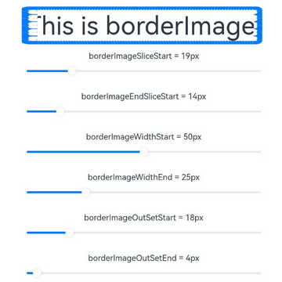
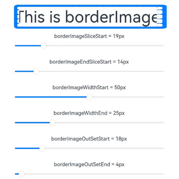

# 图片边框设置

设置组件的图片边框样式。

>  **说明：**
>
>  从API Version 9开始支持。后续版本如有新增内容，则采用上角标单独标记该内容的起始版本。

## borderImage

borderImage(value: BorderImageOption)

设置组件的图片边框。

**卡片能力：** 从API version 9开始，该接口支持在ArkTS卡片中使用。

**原子化服务API：** 从API version 11开始，该接口支持在原子化服务中使用。

**系统能力：** SystemCapability.ArkUI.ArkUI.Full

**参数：** 

| 参数名      | 类型                                            | 必填 | 描述                             |
| ----------- | ----------------------------------------------- | ---- | -------------------------------- |
| value | [BorderImageOption](#borderimageoption对象说明) | 是   | 图片边框或者渐变色边框设置接口。 |

## BorderImageOption对象说明

**卡片能力：** 从API version 9开始，该接口支持在ArkTS卡片中使用。

| 名称   | 类型                                                         | 必填| 描述                                                         |
| ------ | ------------------------------------------------------------ | ---- |  ------------------------------------------------------------ |
| source | string \| [Resource](ts-types.md#resource) \| [linearGradient](ts-universal-attributes-gradient-color.md) | 否 | 边框图源或者渐变色设置。<br/>**说明：**<br>边框图源仅适用于容器组件，如[Row](ts-container-row.md)、[Column](ts-container-column.md)、[Flex](ts-container-flex.md)，在非容器组件上使用会失效。<br/>**原子化服务API：** 从API version 11开始，该接口支持在原子化服务中使用。 |
| slice  | [Length](ts-types.md#length) \| [EdgeWidths](ts-types.md#edgewidths9)  \| [LocalizedEdgeWidths](ts-types.md#localizededgewidths12)<sup>12+</sup>| 否 | 设置边框图片左上角、右上角、左下角以及右下角的切割宽度。<br/>默认值：0<br/>**说明：**<br/>设置负数时取默认值。<br/>参数类型为[Length](ts-types.md#length)时，统一设置四个角的宽高。<br/>参数类型为[EdgeWidths](ts-types.md#edgewidths9)时：<br/>-&nbsp;Top：设置图片左上角或者右上角被切割的高。<br/>-&nbsp;Bottom：设置图片左下角或者右下角被切割的高。<br/>-&nbsp;Left：设置图片左上角或者左下角被切割的宽。<br/>-&nbsp;Right：设置图片右上角或者右下角被切割的宽。 <br/>参数类型为[LocalizedEdgeWidths](ts-types.md#localizededgewidths12)<sup>12+</sup>时：<br/>-&nbsp;Top：设置图片左上角或者右上角被切割的高。<br/>-&nbsp;Bottom：设置图片左下角或者右下角被切割的高。<br/>-&nbsp;Start：设置图片左上角或者左下角被切割的宽。<br />从右至左显示语言模式下为设置图片右上角或者右下角被切割的宽。<br/>-&nbsp;End：设置图片右上角或者右下角被切割的宽。 从右至左显示语言模式下为设置图片左上角或者左下角被切割的宽。<br/>**原子化服务API：** 从API version 11开始，该接口支持在原子化服务中使用。|
| width  | [Length](ts-types.md#length) \| [EdgeWidths](ts-types.md#edgewidths9) \| [LocalizedEdgeWidths](ts-types.md#localizededgewidths12)<sup>12+</sup> | 否| 设置图片边框宽度。<br/>默认值：0<br/>**说明：**<br/>参数类型为[Length](ts-types.md#length)时，统一设置四个角的宽高，设置负数时取默认值。<br/>参数类型为[EdgeWidths](ts-types.md#edgewidths9)时：<br/>-&nbsp;Top：设置图片边框上边框的宽。<br/>-&nbsp;Bottom：设置图片边框下边框的宽。<br/>-&nbsp;Left：设置图片边框左边框的宽。<br/>-&nbsp;Right：设置图片边框右边框宽。<br/>参数类型为[LocalizedEdgeWidths](ts-types.md#localizededgewidths12)<sup>12+</sup>时：<br/>-&nbsp;Top：设置图片边框上边框的宽。<br/>-&nbsp;Bottom：设置图片边框下边框的宽。<br/>-&nbsp;Start：设置图片边框左边框的宽。<br />从右至左显示语言模式下为设置图片边框右边框宽。<br/>-&nbsp;End：设置图片边框右边框宽。<br />从右至左显示语言模式下为设置图片边框左边框的宽。<br/>设置负数时值取1。<br/>**原子化服务API：** 从API version 11开始，该接口支持在原子化服务中使用。 |
| outset | [Length](ts-types.md#length) \| [EdgeWidths](ts-types.md#edgewidths9) \| [LocalizedEdgeWidths](ts-types.md#localizededgewidths12)<sup>12+</sup> | 否 | 设置边框图片向外延伸距离。<br/>默认值：0<br/>**说明：**<br/>设置负数时取默认值。<br/>参数类型为[Length](ts-types.md#length)时，统一设置四个角的宽高。<br/>参数类型为[EdgeWidths](ts-types.md#edgewidths9)时：<br/>-&nbsp;Top：设置边框图片上边框向外延伸的距离。<br/>-&nbsp;Bottom：设置边框图片下边框向外延伸的距离。<br/>-&nbsp;Left：设置边框图片左边框向外延伸的距离。<br/>-&nbsp;Right：设置边框图片右边框向外延伸的距离。<br/>参数类型为[LocalizedEdgeWidths](ts-types.md#localizededgewidths12)<sup>12+</sup>时：<br/>-&nbsp;Top：设置边框图片上边框向外延伸的距离。<br/>-&nbsp;Bottom：设置边框图片下边框向外延伸的距离。<br/>-&nbsp;Start：设置边框图片左边框向外延伸的距离。<br/>从右至左显示语言模式下为设置边框图片右边框向外延伸的距离。<br/>-&nbsp;End：设置边框图片右边框向外延伸的距离。<br/>从右至左显示语言模式下为设置边框图片左边框向外延伸的距离。<br/>**原子化服务API：** 从API version 11开始，该接口支持在原子化服务中使用。 |
| repeat | [RepeatMode](#repeatmode枚举说明)                            | 否 | 设置被切割的图片在边框上的重复方式。<br/>默认值：RepeatMode.Stretch<br/>**原子化服务API：** 从API version 11开始，该接口支持在原子化服务中使用。 |
| fill   | boolean                                                      | 否 | 设置边框图片是否中心填充。<br/>默认值：false<br/>**原子化服务API：** 从API version 11开始，该接口支持在原子化服务中使用。                     |

## RepeatMode枚举说明

**卡片能力：** 从API version 9开始，该接口支持在ArkTS卡片中使用。

**原子化服务API：** 从API version 11开始，该接口支持在原子化服务中使用。

| 名称      | 描述                                  |
| ------- | ----------------------------------- |
| Repeat  | 被切割图片重复铺平在图片边框上，超出的部分会被剪裁。          |
| Stretch | 被切割图片以拉伸填充的方式铺满图片边框。                |
| Round   | 被切割图片以整数次平铺在图片边框上，无法以整数次平铺时压缩被切割图片。 |
| Space   | 被切割图片以整数次平铺在图片边框上，无法以整数次平铺时以空白填充。   |

## 示例

### 示例1（设置渐变色边框）

通过borderImage接口为组件设置渐变色边框。

```ts
// xxx.ets
@Entry
@Component
struct Index {
  build() {
    Row() {
      Column() {
        Text('This is gradient color.').textAlign(TextAlign.Center).height(50).width(200)
          .borderImage({
            source: {
              angle: 90,
              direction: GradientDirection.Left,
              colors: [[0xAEE1E1, 0.0], [0xD3E0DC, 0.3], [0xFCD1D1, 1.0]]
            },
            slice: { top: 10, bottom: 10, left: 10, right: 10 },
            width: { top: "10px", bottom: "10px", left: "10px", right: "10px" },
            repeat: RepeatMode.Stretch,
            fill: false
          })
      }
      .width('100%')
    }
    .height('100%')
  }
}
```


### 示例2（动态调整属性值）

通过[slider](../../apis-arkui/arkui-js/js-components-basic-slider.md)接口动态调整borderImage接口中属性值。

```ts
// xxx.ets
@Entry
@Component
struct BorderImage {
  @State WidthValue: number = 0
  @State SliceValue: number = 0
  @State OutSetValue: number = 0
  @State RepeatValue: RepeatMode[] = [RepeatMode.Repeat, RepeatMode.Stretch, RepeatMode.Round, RepeatMode.Space]
  @State SelectIndex: number = 0
  @State SelectText: string = 'Repeat'
  @State FillValue: boolean = false

  build() {
    Row() {
      Column({ space: 20 }) {
        Row() {
          Text('This is borderImage.').textAlign(TextAlign.Center).fontSize(50)
        }
        .borderImage({
          source: $r('app.media.icon'),
          slice: this.SliceValue,
          width: this.WidthValue,
          outset: this.OutSetValue,
          repeat: this.RepeatValue[this.SelectIndex],
          fill: this.FillValue
        })

        Column() {
          Text(`borderImageSlice = ${this.SliceValue}px`)
          Slider({
            value: this.SliceValue,
            min: 0,
            max: 100,
            style: SliderStyle.OutSet
          })
            .onChange((value: number, mode: SliderChangeMode) => {
              this.SliceValue = value
            })
        }

        Column() {
          Text(`borderImageWidth = ${this.WidthValue}px`)
          Slider({
            value: this.WidthValue,
            min: 0,
            max: 100,
            style: SliderStyle.OutSet
          })
            .onChange((value: number, mode: SliderChangeMode) => {
              this.WidthValue = value
            })
        }

        Column() {
          Text(`borderImageOutSet = ${this.OutSetValue}px`)
          Slider({
            value: this.OutSetValue,
            min: 0,
            max: 100,
            style: SliderStyle.OutSet
          })
            .onChange((value: number, mode: SliderChangeMode) => {
              this.OutSetValue = value
            })
        }

        Row() {
          Text('borderImageRepeat: ')
          Select([{ value: 'Repeat' }, { value: 'Stretch' }, { value: 'Round' }, { value: 'Space' }])
            .value(this.SelectText)
            .selected(this.SelectIndex)
            .onSelect((index: number, value?: string) => {
              this.SelectIndex = index
              this.SelectText = value as string
            })
        }

        Row() {
          Text(`borderImageFill: ${this.FillValue} `)
          Toggle({ type: ToggleType.Switch, isOn: this.FillValue })
            .onChange((isOn: boolean) => {
              this.FillValue = isOn
            })
        }

      }
      .width('100%')
    }
    .height('100%')
  }
}
```


### 示例3（使用LocalizedEdgeWidths类型值）

borderImage接口中的slice、width、outset属性值使用[LocalizedEdgeWidths](ts-types.md#localizededgewidths12)类型。

```ts
// xxx.ets
import { LengthMetrics } from '@kit.ArkUI'

@Entry
@Component
struct BorderImage {
  @State WidthStartValue: number = 0
  @State WidthEndValue: number = 0
  @State SliceStartValue: number = 0
  @State SliceEndValue: number = 0
  @State OutSetStartValue: number = 0
  @State OutSetEndValue: number = 0
  @State RepeatValue: RepeatMode[] = [RepeatMode.Repeat, RepeatMode.Stretch, RepeatMode.Round, RepeatMode.Space]
  @State SelectIndex: number = 0
  @State SelectText: string = 'Repeat'
  @State FillValue: boolean = false

  build() {
    Row() {
      Column({ space: 20 }) {
        Row() {
          Text('This is borderImage.').textAlign(TextAlign.Center).fontSize(50)
        }
        .borderImage({
          source: $r('app.media.icon'),
          slice: {
            top: LengthMetrics.px(10),
            bottom: LengthMetrics.px(10),
            start: LengthMetrics.px(this.SliceStartValue),
            end: LengthMetrics.px(this.SliceEndValue) },
          width: {
            top: LengthMetrics.px(10),
            bottom: LengthMetrics.px(10),
            start: LengthMetrics.px(this.WidthStartValue),
            end: LengthMetrics.px(this.WidthEndValue)
          },
          outset: {
            top: LengthMetrics.px(10),
            bottom: LengthMetrics.px(10),
            start: LengthMetrics.px(this.OutSetStartValue),
            end: LengthMetrics.px(this.OutSetEndValue)
          },
          repeat: this.RepeatValue[this.SelectIndex],
          fill: this.FillValue
        })

        Column() {
          Text(`borderImageSliceStart = ${this.SliceStartValue}px`)
          Slider({
            value: this.SliceStartValue,
            min: 0,
            max: 100,
            style: SliderStyle.OutSet
          })
            .onChange((value: number, mode: SliderChangeMode) => {
              this.SliceStartValue = value
            })
        }

        Column() {
          Text(`borderImageEndSliceStart = ${this.SliceEndValue}px`)
          Slider({
            value: this.SliceEndValue,
            min: 0,
            max: 100,
            style: SliderStyle.OutSet
          })
            .onChange((value: number, mode: SliderChangeMode) => {
              this.SliceEndValue = value
            })
        }

        Column() {
          Text(`borderImageWidthStart = ${this.WidthStartValue}px`)
          Slider({
            value: this.WidthStartValue,
            min: 0,
            max: 100,
            style: SliderStyle.OutSet
          })
            .onChange((value: number, mode: SliderChangeMode) => {
              this.WidthStartValue = value
            })
        }

        Column() {
          Text(`borderImageWidthEnd = ${this.WidthEndValue}px`)
          Slider({
            value: this.WidthEndValue,
            min: 0,
            max: 100,
            style: SliderStyle.OutSet
          })
            .onChange((value: number, mode: SliderChangeMode) => {
              this.WidthEndValue = value
            })
        }

        Column() {
          Text(`borderImageOutSetStart = ${this.OutSetStartValue}px`)
          Slider({
            value: this.OutSetStartValue,
            min: 0,
            max: 100,
            style: SliderStyle.OutSet
          })
            .onChange((value: number, mode: SliderChangeMode) => {
              this.OutSetStartValue = value
            })
        }

        Column() {
          Text(`borderImageOutSetEnd = ${this.OutSetEndValue}px`)
          Slider({
            value: this.OutSetEndValue,
            min: 0,
            max: 100,
            style: SliderStyle.OutSet
          })
            .onChange((value: number, mode: SliderChangeMode) => {
              this.OutSetEndValue = value
            })
        }

        Row() {
          Text('borderImageRepeat: ')
          Select([{ value: 'Repeat' }, { value: 'Stretch' }, { value: 'Round' }, { value: 'Space' }])
            .value(this.SelectText)
            .selected(this.SelectIndex)
            .onSelect((index: number, value?: string) => {
              this.SelectIndex = index
              this.SelectText = value as string
            })
        }

        Row() {
          Text(`borderImageFill: ${this.FillValue} `)
          Toggle({ type: ToggleType.Switch, isOn: this.FillValue })
            .onChange((isOn: boolean) => {
              this.FillValue = isOn
            })
        }

      }
      .width('100%')
    }
    .height('100%')
  }
}
```

从左至右显示语言示例图



从右至左显示语言示例图

