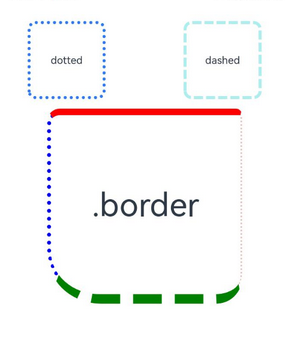
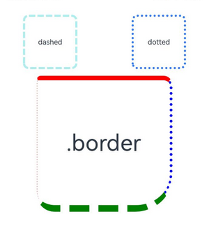

# 边框设置
<!--Kit: ArkUI-->
<!--Subsystem: ArkUI-->
<!--Owner: @zju_ljz-->
<!--SE: @lanshouren-->
<!--TSE: @liuli0427-->

设置组件边框样式。

>  **说明：**
>
>  从API version 7开始支持。后续版本如有新增内容，则采用上角标单独标记该内容的起始版本。
>

## border

border(value: BorderOptions): T

设置边框样式。

**卡片能力：** 从API version 9开始，该接口支持在ArkTS卡片中使用。

**原子化服务API：** 从API version 11开始，该接口支持在原子化服务中使用。

**系统能力：** SystemCapability.ArkUI.ArkUI.Full

**参数：** 

| 参数名 | 类型                                    | 必填 | 说明                                                         |
| ------ | --------------------------------------- | ---- | ------------------------------------------------------------ |
| value  | [BorderOptions](./ts-types.md#borderoptions) | 是   | 统一边框样式设置接口。<br/>**说明：** <br/>边框宽度默认值为0，即不显示边框。<br/>从API version 9开始，父节点的border显示在子节点内容之上。 |

**返回值：**

| 类型 | 说明 |
| --- | --- |
|  T | 返回当前组件。 |

## borderStyle

borderStyle(value: BorderStyle | EdgeStyles): T

设置元素的边框线条样式。

**卡片能力：** 从API version 9开始，该接口支持在ArkTS卡片中使用。

**原子化服务API：** 从API version 11开始，该接口支持在原子化服务中使用。

**系统能力：** SystemCapability.ArkUI.ArkUI.Full

**参数：** 

| 参数名 | 类型                                                         | 必填 | 说明                                               |
| ------ | ------------------------------------------------------------ | ---- | -------------------------------------------------- |
| value  | [BorderStyle](ts-appendix-enums.md#borderstyle)&nbsp;\|&nbsp;[EdgeStyles](./ts-types.md#edgestyles9)<sup>9+</sup> | 是   | 设置元素的边框样式。<br/>默认值：BorderStyle.Solid |

**返回值：**

| 类型 | 说明 |
| --- | --- |
|  T | 返回当前组件。 |

## borderWidth

borderWidth(value: Length | EdgeWidths | LocalizedEdgeWidths): T

设置边框的宽度。

**卡片能力：** 从API version 9开始，该接口支持在ArkTS卡片中使用。

**原子化服务API：** 从API version 11开始，该接口支持在原子化服务中使用。

**系统能力：** SystemCapability.ArkUI.ArkUI.Full

**参数：** 

| 参数名 | 类型                                                         | 必填 | 说明                               |
| ------ | ------------------------------------------------------------ | ---- | ---------------------------------- |
| value  | [Length](ts-types.md#length)&nbsp;\|&nbsp;[EdgeWidths](./ts-types.md#edgewidths9)<sup>9+</sup>&nbsp;\|&nbsp;[LocalizedEdgeWidths](./ts-types.md#localizededgewidths12)<sup>12+</sup> | 是   | 设置元素的边框宽度，不支持百分比。 |

**返回值：**

| 类型 | 说明 |
| --- | --- |
|  T | 返回当前组件。 |

## borderColor

borderColor(value: ResourceColor | EdgeColors | LocalizedEdgeColors): T

设置边框的颜色。

**卡片能力：** 从API version 9开始，该接口支持在ArkTS卡片中使用。

**原子化服务API：** 从API version 11开始，该接口支持在原子化服务中使用。

**系统能力：** SystemCapability.ArkUI.ArkUI.Full

**参数：** 

| 参数名 | 类型                                                         | 必填 | 说明                                         |
| ------ | ------------------------------------------------------------ | ---- | -------------------------------------------- |
| value  | [ResourceColor](ts-types.md#resourcecolor)&nbsp;\|&nbsp;[EdgeColors](./ts-types.md#edgecolors9)<sup>9+</sup>&nbsp;\|&nbsp;[LocalizedEdgeColors](./ts-types.md#localizededgecolors12)<sup>12+</sup> | 是   | 设置元素的边框颜色。<br/>默认值：Color.Black |

**返回值：**

| 类型 | 说明 |
| --- | --- |
|  T | 返回当前组件。 |

## borderRadius

borderRadius(value: Length | BorderRadiuses | LocalizedBorderRadiuses): T

设置边框的圆角。圆角大小受组件尺寸限制，最大值为组件宽或高的一半。

**卡片能力：** 从API version 9开始，该接口支持在ArkTS卡片中使用。

**原子化服务API：** 从API version 11开始，该接口支持在原子化服务中使用。

**系统能力：** SystemCapability.ArkUI.ArkUI.Full

**参数：** 

| 参数名 | 类型                                                         | 必填 | 说明                                   |
| ------ | ------------------------------------------------------------ | ---- | -------------------------------------- |
| value  | [Length](ts-types.md#length)&nbsp;\|&nbsp;[BorderRadiuses](./ts-types.md#borderradiuses9)<sup>9+</sup>&nbsp;\|&nbsp;[LocalizedBorderRadiuses](./ts-types.md#localizedborderradiuses12)<sup>12+</sup> | 是   | 设置元素的边框圆角半径，支持百分比，百分比依据组件宽度。设置圆角后，可搭配[.clip属性](./ts-universal-attributes-sharp-clipping.md#clip12)进行裁剪，避免子组件超出组件自身。|

**返回值：**

| 类型 | 说明 |
| --- | --- |
|  T | 返回当前组件。 |


## 示例

### 示例1（基本样式用法）

设置边框的宽度、颜色、圆角半径以及点、线样式。

```ts
// xxx.ets
@Entry
@Component
struct BorderExample {
  build() {
    Column() {
      Flex({ justifyContent: FlexAlign.SpaceAround, alignItems: ItemAlign.Center }) {
        // 线段
        Text('dashed')
          .borderStyle(BorderStyle.Dashed).borderWidth(5).borderColor(0xAFEEEE).borderRadius(10)
          .width(120).height(120).textAlign(TextAlign.Center).fontSize(16)
        // 点线
        Text('dotted')
          .border({ width: 5, color: 0x317AF7, radius: 10, style: BorderStyle.Dotted })
          .width(120).height(120).textAlign(TextAlign.Center).fontSize(16)
      }.width('100%').height(150)

      Text('.border')
        .fontSize(50)
        .width(300)
        .height(300)
        .border({
          width: { left: 3, right: 6, top: 10, bottom: 15 },
          color: { left: '#e3bbbb', right: Color.Blue, top: Color.Red, bottom: Color.Green },
          radius: { topLeft: 10, topRight: 20, bottomLeft: 40, bottomRight: 80 },
          style: {
            left: BorderStyle.Dotted,
            right: BorderStyle.Dotted,
            top: BorderStyle.Solid,
            bottom: BorderStyle.Dashed
          }
        }).textAlign(TextAlign.Center)
    }
  }
}
```


### 示例2（边框宽度类型和边框颜色）

border属性的width、radius、color属性值使用LocalizedEdgeWidths类型和LocalizedEdgeColors类型。

```ts
// xxx.ets
import { LengthMetrics } from '@kit.ArkUI';
@Entry
@Component
struct BorderExample {
  build() {
    Column() {
      Flex({ justifyContent: FlexAlign.SpaceAround, alignItems: ItemAlign.Center }) {
        // 线段
        Text('dashed')
          .borderStyle(BorderStyle.Dashed)
          .borderWidth(5)
          .borderColor(0xAFEEEE)
          .borderRadius(10)
          .width(120)
          .height(120)
          .textAlign(TextAlign.Center)
          .fontSize(16)
        // 点线
        Text('dotted')
          .border({ width: 5, color: 0x317AF7, radius: 10, style: BorderStyle.Dotted })
          .width(120)
          .height(120)
          .textAlign(TextAlign.Center)
          .fontSize(16)
      }.width('100%').height(150)

      Text('.border')
        .fontSize(50)
        .width(300)
        .height(300)
        .border({
          width: {
            start: LengthMetrics.vp(3),
            end: LengthMetrics.vp(6),
            top: LengthMetrics.vp(10),
            bottom: LengthMetrics.vp(15)
          },
          color: { start: '#e3bbbb', end: Color.Blue, top: Color.Red, bottom: Color.Green },
          radius: {
            topStart: LengthMetrics.vp(10),
            topEnd: LengthMetrics.vp(20),
            bottomStart: LengthMetrics.vp(40),
            bottomEnd: LengthMetrics.vp(80)
          },
          style: {
            left: BorderStyle.Dotted,
            right: BorderStyle.Dotted,
            top: BorderStyle.Solid,
            bottom: BorderStyle.Dashed
          }
        })
        .textAlign(TextAlign.Center)
    }
  }
}
```

从左至右显示语言示例图



从右至左显示语言示例图

