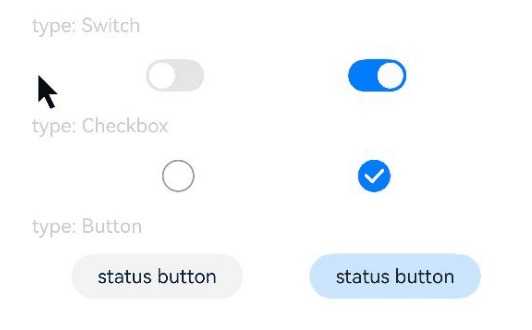

# 点击回弹效果

设置组件点击时回弹效果。

>  **说明：**
>
> 从API Version 10开始支持。后续版本如有新增内容，则采用上角标单独标记该内容的起始版本。

## clickEffect

clickEffect(value: ClickEffect | null)

设置当前组件点击回弹效果。

**原子化服务API：** 从API version 11开始，该接口支持在原子化服务中使用。

**系统能力：** SystemCapability.ArkUI.ArkUI.Full

**参数：**

| 参数名 | 类型                                                  | 必填 | 说明                                                         |
| ------ | ----------------------------------------------------- | ---- | ------------------------------------------------------------ |
| value  | [ClickEffect](#clickeffect对象说明)&nbsp;\|&nbsp;null | 是   | 设置当前组件点击回弹效果。<br/>**说明：**<br/>可通过null取消点击回弹效果。<br/>不建议在组件大小动态变化的场景中使用该功能。<br/>当组件无法触发通用事件时，不支持该属性。 |

## clickEffect<sup>18+</sup>

clickEffect(effect: Optional\<ClickEffect | null>)

设置当前组件点击回弹效果。与[clickEffect](#clickeffect)相比，effect参数新增了对undefined类型的支持。

**原子化服务API：** 从API version 18开始，该接口支持在原子化服务中使用。

**系统能力：** SystemCapability.ArkUI.ArkUI.Full

**参数：**

| 参数名 | 类型                                                         | 必填 | 说明                                                         |
| ------ | ------------------------------------------------------------ | ---- | ------------------------------------------------------------ |
| effect | Optional\<[ClickEffect](#clickeffect对象说明)&nbsp;\|&nbsp;null> | 是   | 设置当前组件点击回弹效果。<br/>**说明：**<br/>可通过undefined或者null取消点击回弹效果。<br/>不建议在组件大小动态变化的场景中使用该功能。<br/>当组件无法触发通用事件时，不支持该属性。 |

## ClickEffect对象说明

**原子化服务API：** 从API version 11开始，该接口支持在原子化服务中使用。

| 名称  | 参数类型                                                    | 必填 | 描述                                                         |
| ----- | ----------------------------------------------------------- | ---- | ------------------------------------------------------------ |
| level | [ClickEffectLevel](ts-appendix-enums.md#clickeffectlevel10) | 是   | 设置当前组件点击回弹效果。<br/>**说明：**<br/>level等于undefined或者null时， ClickEffect采用ClickEffectLevel.LIGHT对应的回弹效果，缩放比参照scale说明。 |
| scale | number                                                      | 否   | 回弹缩放比例，支持在设置ClickEffectLevel的基础上微调回弹缩放比例。<br/>**说明：**<br/>level等于ClickEffectLevel.LIGHT时，默认值：0.90<br/>level等于ClickEffectLevel.MIDDLE或者ClickEffectLevel.HEAVY时，默认值：0.95<br/>level等于undefined或者null时，level为ClickEffectLevel.LIGHT，默认值：0.90<br/>scale等于undefined或者null时，scale与当前设置的level对应的默认缩放比相同。<br/> |

## 示例

该示例主要演示不同组件的点击回弹效果。

```ts
// xxx.ets
@Entry
@Component
struct ToggleExample {
  build() {
    Column({ space: 10 }) {
      Text('type: Switch').fontSize(12).fontColor(0xcccccc).width('90%')
      Flex({ justifyContent: FlexAlign.SpaceEvenly, alignItems: ItemAlign.Center }) {
        Toggle({ type: ToggleType.Switch, isOn: false })
          .clickEffect({level:ClickEffectLevel.LIGHT})
          .selectedColor('#007DFF')
          .switchPointColor('#FFFFFF')
          .onChange((isOn: boolean) => {
            console.info('Component status:' + isOn)
          })

        Toggle({ type: ToggleType.Switch, isOn: true })
          .clickEffect({level:ClickEffectLevel.LIGHT, scale: 0.5})
          .selectedColor('#007DFF')
          .switchPointColor('#FFFFFF')
          .onChange((isOn: boolean) => {
            console.info('Component status:' + isOn)
          })
      }

      Text('type: Checkbox').fontSize(12).fontColor(0xcccccc).width('90%')
      Flex({ justifyContent: FlexAlign.SpaceEvenly, alignItems: ItemAlign.Center }) {
        Toggle({ type: ToggleType.Checkbox, isOn: false })
          .clickEffect({level:ClickEffectLevel.MIDDLE})
          .size({ width: 20, height: 20 })
          .selectedColor('#007DFF')
          .onChange((isOn: boolean) => {
            console.info('Component status:' + isOn)
          })

        Toggle({ type: ToggleType.Checkbox, isOn: true })
          .clickEffect({level:ClickEffectLevel.MIDDLE, scale: 0.5})
          .size({ width: 20, height: 20 })
          .selectedColor('#007DFF')
          .onChange((isOn: boolean) => {
            console.info('Component status:' + isOn)
          })
      }

      Text('type: Button').fontSize(12).fontColor(0xcccccc).width('90%')
      Flex({ justifyContent: FlexAlign.SpaceEvenly, alignItems: ItemAlign.Center }) {
        Toggle({ type: ToggleType.Button, isOn: false }) {
          Text('status button').fontColor('#182431').fontSize(12)
        }.width(106)
        .clickEffect({level:ClickEffectLevel.HEAVY})
        .selectedColor('rgba(0,125,255,0.20)')
        .onChange((isOn: boolean) => {
          console.info('Component status:' + isOn)
        })

        Toggle({ type: ToggleType.Button, isOn: true }) {
          Text('status button').fontColor('#182431').fontSize(12)
        }.width(106)
        .clickEffect({level:ClickEffectLevel.HEAVY, scale: 0.5})
        .selectedColor('rgba(0,125,255,0.20)')
        .onChange((isOn: boolean) => {
          console.info('Component status:' + isOn)
        })
      }
    }.width('100%').padding(24)
  }
}
```

