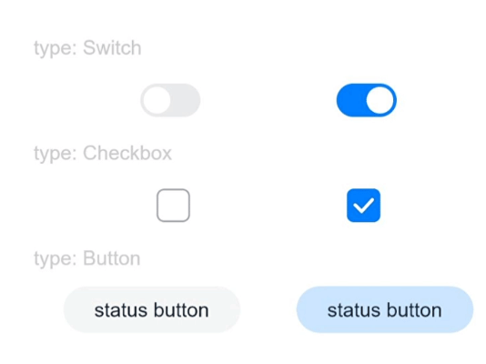

# 点击回弹效果
<!--Kit: ArkUI-->
<!--Subsystem: ArkUI-->
<!--Owner: @hehongyang3-->
<!--Designer: @hehongyang3-->
<!--Tester: @lxl007-->
<!--Adviser: @Brilliantry_Rui-->

设置组件的点击回弹效果。

>  **说明：**
>
> - 从API version 10开始支持。后续版本如有新增内容，则采用上角标单独标记该内容的起始版本。
>
> - 本模块接口仅可在Stage模型下使用。

## clickEffect

clickEffect(value: ClickEffect \| null): T

设置当前组件的点击回弹效果。点击回弹效果的强度等级决定回弹时的缩放幅度。

**原子化服务API：** 从API version 11开始，该接口支持在原子化服务中使用。

**系统能力：** SystemCapability.ArkUI.ArkUI.Full

**参数：**

| 参数名 | 类型                                                  | 必填 | 说明                                                         |
| ------ | ----------------------------------------------------- | ---- | ------------------------------------------------------------ |
| value  | [ClickEffect](#clickeffect对象说明)&nbsp;\|&nbsp;null | 是   | 设置当前组件点击回弹效果。<br>**说明：**<br>可通过null取消点击回弹效果。<br>不建议在组件大小动态变化的场景中使用该功能，可能导致回弹效果异常。<br>当组件无法触发通用事件（如[点击事件](ts-universal-events-click.md)等事件）时，不支持该属性。<br>回弹触发缩放后可能造成触摸点不在组件上，组件上无法响应手势事件。 |

**返回值：**

| 类型   | 说明                     |
| ------ | ------------------------ |
| T | 返回当前组件，用于链式调用。 |

## clickEffect<sup>18+</sup>

clickEffect(effect: Optional\<ClickEffect \| null>): T

设置当前组件的点击回弹效果。与[clickEffect](#clickeffect)相比，新增了对undefined类型的支持。点击回弹效果的等级级别决定回弹时的缩放幅度。

**原子化服务API：** 从API version 18开始，该接口支持在原子化服务中使用。

**系统能力：** SystemCapability.ArkUI.ArkUI.Full

**参数：**

| 参数名 | 类型                                                         | 必填 | 说明                                                         |
| ------ | ------------------------------------------------------------ | ---- | ------------------------------------------------------------ |
| effect | [Optional](ts-universal-attributes-custom-property.md#optionalt)\<[ClickEffect](#clickeffect对象说明)&nbsp;\|&nbsp;null> | 是   | 点击回弹效果的级别，用于控制回弹的强度程度。<br>**说明：**<br>可通过undefined或者null取消点击回弹效果。<br>不建议在组件大小动态变化的场景中使用该功能。<br>当组件无法触发通用事件（如[点击事件](ts-universal-events-click.md)等事件）时，不支持该属性。具体包括：组件被设置为disabled状态、组件不可见、组件被其他组件遮挡等场景下，无法触发通用事件，此时clickEffect属性不生效。<br>回弹触发缩放后可能造成触摸点不在组件上，组件上无法响应手势事件。 |

**返回值：**

| 类型   | 说明                     |
| ------ | ------------------------ |
| T | 返回当前组件，用于链式调用。 |

## ClickEffect对象说明

定义点击回弹效果。

**原子化服务API：** 从API version 11开始，该接口支持在原子化服务中使用。

**系统能力：** SystemCapability.ArkUI.ArkUI.Full

| 名称  | 类型                                                  | 只读    | 可选   |  说明                                                         |
| ----- | ----------------------------------------------------------- | ---- | --------- | --------------------------------------------------------- |
| level | [ClickEffectLevel](ts-appendix-enums.md#clickeffectlevel10) | 否   | 否  |点击回弹效果级别，其取值影响scale的默认缩放比例。<br>默认值：ClickEffectLevel.LIGHT<br>**说明：**<br>当level为undefined或者null时， ClickEffect采用ClickEffectLevel.LIGHT对应的回弹效果，缩放比的具体默认值请参见下方scale属性说明。  |
| scale | number                                                      | 否   | 是  |回弹缩放比例，取值范围(0, 1]，支持在设置ClickEffectLevel的基础上微调。超出取值范围时，使用当前level对应的默认缩放比例。<br>**说明：**<br>当level为ClickEffectLevel.LIGHT时，默认值：0.90 <br>当level为ClickEffectLevel.MIDDLE或者ClickEffectLevel.HEAVY时，默认值：0.95 <br>当level为undefined或者null时，level为ClickEffectLevel.LIGHT，默认值：0.90 <br>当scale为undefined或者null时，使用当前level对应的默认缩放比例。 |

## 示例

该示例主要演示不同组件的点击回弹效果。

```ts
// xxx.ets
@Entry
@Component
struct ToggleExample {
  build() {
    Column({ space: 10 }) {
      Text('type: Switch').fontSize(12).fontColor(0xcccccc).width('90%')
      Flex({ justifyContent: FlexAlign.SpaceEvenly, alignItems: ItemAlign.Center }) {
        Toggle({ type: ToggleType.Switch, isOn: false })
          .clickEffect({ level: ClickEffectLevel.LIGHT })
          .selectedColor('#007DFF')
          .switchPointColor('#FFFFFF')
          .onChange((isOn: boolean) => {
            console.info('Component status:' + isOn);
          })

        Toggle({ type: ToggleType.Switch, isOn: true })
          .clickEffect({ level: ClickEffectLevel.LIGHT, scale: 0.5 })
          .selectedColor('#007DFF')
          .switchPointColor('#FFFFFF')
          .onChange((isOn: boolean) => {
            console.info('Component status:' + isOn);
          })
      }

      Text('type: Checkbox').fontSize(12).fontColor(0xcccccc).width('90%')
      Flex({ justifyContent: FlexAlign.SpaceEvenly, alignItems: ItemAlign.Center }) {
        Toggle({ type: ToggleType.Checkbox, isOn: false })
          .clickEffect({ level: ClickEffectLevel.MIDDLE })
          .size({ width: 20, height: 20 })
          .selectedColor('#007DFF')
          .onChange((isOn: boolean) => {
            console.info('Component status:' + isOn);
          })

        Toggle({ type: ToggleType.Checkbox, isOn: true })
          .clickEffect({ level: ClickEffectLevel.MIDDLE, scale: 0.5 })
          .size({ width: 20, height: 20 })
          .selectedColor('#007DFF')
          .onChange((isOn: boolean) => {
            console.info('Component status:' + isOn);
          })
      }

      Text('type: Button').fontSize(12).fontColor(0xcccccc).width('90%')
      Flex({ justifyContent: FlexAlign.SpaceEvenly, alignItems: ItemAlign.Center }) {
        Toggle({ type: ToggleType.Button, isOn: false }) {
          Text('status button').fontColor('#182431').fontSize(12)
        }.width(106)
        .clickEffect({ level: ClickEffectLevel.HEAVY })
        .selectedColor('rgba(0,125,255,0.20)')
        .onChange((isOn: boolean) => {
          console.info('Component status:' + isOn);
        })

        Toggle({ type: ToggleType.Button, isOn: true }) {
          Text('status button').fontColor('#182431').fontSize(12)
        }.width(106)
        .clickEffect({ level: ClickEffectLevel.HEAVY, scale: 0.5 })
        .selectedColor('rgba(0,125,255,0.20)')
        .onChange((isOn: boolean) => {
          console.info('Component status:' + isOn);
        })
      }
    }.width('100%').padding(24)
  }
}
```

