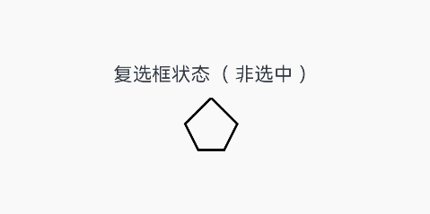

# 自定义内容

支持通过样式builder自定义特定组件的内容区。

>  **说明：**
>
>  从API Version 12开始支持。后续版本如有新增内容，则采用上角标单独标记该内容的起始版本。

## contentModifier

contentModifier(modifier:ContentModifier\<T>)

定制内容区的方法。

**系统能力：** SystemCapability.ArkUI.ArkUI.Full

**参数：**

| 参数名   | 类型               | 必填 | 说明                                                         |
| -------- | ------------------ | ---- | ------------------------------------------------------------ |
| modifier | ContentModifier\<T> | 是   | 在当前组件上，定制内容区的方法。<br/>modifier: 内容修改器，开发者需要自定义class实现ContentModifier接口。 |

## ContentModifier\<T>

开发者需要自定义class实现ContentModifier接口。

### applyContent

applyContent() : WrappedBuilder<[T]>

定制内容区的Builder。

**原子化服务API：** 从API version 12开始，该接口支持在原子化服务中使用。

**参数**：

| 参数 | 描述                                                         |
| ---- | ------------------------------------------------------------ |
| T    | 组件的属性类，用来区别不同组件自定义内容区后所需要的不同信息，比如Button组件的ButtonConfiguration，Checkbox组件的CheckBoxConfiguration等。 |

**T参数支持范围:**

ButtonConfiguration、CheckBoxConfiguration、DataPanelConfiguration、TextClockConfiguration、ToggleConfiguration、GaugeConfiguration、LoadingProgressConfiguration、RadioConfiguration、ProgressConfiguration、RatingConfiguration、SliderConfiguration

**属性支持范围:**

支持通用属性enabled，contentModifier。
## CommonConfiguration\<T><sup>12+</sup>对象说明

开发者需要自定义class实现ContentModifier接口。

**原子化服务API：** 从API version 12开始，该接口支持在原子化服务中使用。

| 参数名  | 类型    | 说明              |
| ------ | ------ | ---------------- |
| enabled | boolean | 如果该值为true，则contentModifier可用，并且可以响应triggerChange等操作，如果设置为false，则不会响应triggerChange等操作。 |
| contentModifier | ContentModifier\<T> | 用于将用户需要的组件信息发送到自定义内容区。 |


## 示例
该示例实现了自定义复选框样式的功能，自定义样式实现了一个五边形复选框用来替换原本Checkbox的样式。如果选中，内部会出现红色三角图案，标题会显示选中字样；如果取消选中，红色三角图案消失，标题会显示非选中字样。
```ts
// xxx.ets
class MyCheckboxStyle implements ContentModifier<CheckBoxConfiguration> {
  selectedColor: Color = Color.White
  constructor(selectedColor: Color) {
    this.selectedColor = selectedColor;
  }
  applyContent() : WrappedBuilder<[CheckBoxConfiguration]>
  {
    return wrapBuilder(buildCheckbox)
  }
}

@Builder function buildCheckbox(config: CheckBoxConfiguration) {
  Column({space:10}) {
      Text(config.name  + (config.selected ? "（ 选中 ）" : "（ 非选中 ）"))
      Shape() {
        Path().width(200).height(60).commands('M100 0 L0 100 L50 200 L150 200 L200 100 Z').fillOpacity(0).strokeWidth(3)
        Path().width(10).height(10).commands('M50 0 L100 100 L0 100 Z')
          .visibility(config.selected ? Visibility.Visible : Visibility.Hidden)
          .fill(config.selected ? (config.contentModifier as MyCheckboxStyle).selectedColor : Color.Black)
          .stroke((config.contentModifier as MyCheckboxStyle).selectedColor)
          .margin({left:11,top:10})
      }
      .width(300)
      .height(200)
      .viewPort({ x: 0, y: 0, width: 310, height: 310 })
      .strokeLineJoin(LineJoinStyle.Miter)
      .strokeMiterLimit(5)
      .onClick(()=>{
            if (config.selected) {
              config.triggerChange(false)
            } else {
              config.triggerChange(true)
            }
      }).margin({left:150})
    }
  }

@Entry
@Component
struct Index {
  build() {
    Row() {
      Column() {
        Checkbox({ name: '复选框状态', group: 'checkboxGroup' })
        .select(true)
        .contentModifier(new MyCheckboxStyle(Color.Red))
        .onChange((value: boolean) => {
          console.info('Checkbox change is' + value)
        })
      }
      .width('100%')
    }
    .height('100%')
  }
}
```


