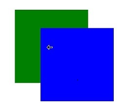

# 鼠标光标控制
<!--Kit: ArkUI-->
<!--Subsystem: ArkUI-->
<!--Owner: @jiangtao92-->
<!--Designer: @piggyguy-->
<!--Tester: @songyanhong-->
<!--Adviser: @HelloCrease-->

控制鼠标光标的显示样式。

>  **说明：**
>
>  从API version 11开始支持。后续版本如有新增内容，则采用上角标单独标记该内容的起始版本。


## cursorControl

### setCursor

setCursor(value: PointerStyle): void

**原子化服务API：** 从API version 12开始，该接口支持在原子化服务中使用。

**系统能力：** SystemCapability.ArkUI.ArkUI.Full

方法语句中可使用的全局接口，调用该接口可更改当前的鼠标光标样式。

**参数：**

| 参数名 | 类型 | 必填 | 说明 |
| ----- | ------ | ---- | ---- |
| value | [PointerStyle](#pointerstyle11) | 是   | 设置的鼠标样式。 |


### restoreDefault

restoreDefault(): void

**原子化服务API：** 从API version 12开始，该接口支持在原子化服务中使用。

**系统能力：** SystemCapability.ArkUI.ArkUI.Full

方法语句中可使用的全局接口，调用此接口可将鼠标光标恢复成默认箭头样式。

## PointerStyle<sup>11+</sup>

type PointerStyle = pointer.PointerStyle

光标样式。

**原子化服务API：** 从API version 12开始，该接口支持在原子化服务中使用。

**系统能力：** SystemCapability.MultimodalInput.Input.Pointer

|类型|说明|
| -- | -- |
|[pointer.PointerStyle](../../apis-input-kit/js-apis-pointer.md#pointerstyle) |光标样式。|


## 示例

该示例通过setCursor实现了鼠标光标样式的更改。

> **说明：**
> 
> 直接使用cursorControl可能导致[UI上下文不明确](../../../ui/arkts-global-interface.md)的问题，建议使用getUIContext()获取[UIContext](../arkts-apis-uicontext-uicontext.md)实例，并使用[getCursorController](../arkts-apis-uicontext-uicontext.md#getcursorcontroller12)获取绑定实例的cursorControl。

```ts
// xxx.ets
import { pointer } from '@kit.InputKit';

@Entry
@Component
struct CursorControlExample {
  @State text: string = '';
  controller: TextInputController = new TextInputController()

  build() {
    Column() {
      Row().height(200).width(200).backgroundColor(Color.Green).position({x: 150 ,y:70})
        .onHover((flag) => {
          if (flag) {
            // 建议使用this.getUIContext().getCursorController().setCursor()
            cursorControl.setCursor(pointer.PointerStyle.EAST)
          } else {
            // 建议使用this.getUIContext().getCursorController().restoreDefault()
            cursorControl.restoreDefault()
          }
        })
      Row().height(200).width(200).backgroundColor(Color.Blue).position({x: 220 ,y:120})
        .onHover((flag) => {
          if (flag) {
            // 建议使用this.getUIContext().getCursorController().setCursor()
            cursorControl.setCursor(pointer.PointerStyle.WEST)
          } else {
            // 建议使用this.getUIContext().getCursorController().restoreDefault()
            cursorControl.restoreDefault()
          }
        })
    }.width('100%')
  }
}
```
示意图：

当鼠标悬浮在蓝色区域时，显示：向西箭头光标样式。



当鼠标悬浮在绿色区域时，显示：向东箭头光标样式。


