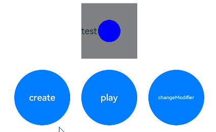

# 自定义绘制设置

当某些组件本身的绘制内容不满足需求时，可使用自定义组件绘制功能，在原有组件基础上部分绘制、或者全部自行绘制，以达到预期效果。例如：独特的按钮形状、文字和图像混合的图标等。自定义组件绘制提供了自定义绘制修改器，来实现更自由地组件绘制。

>  **说明：**
>
>  从API Version 12开始支持。后续版本如有新增内容，则采用上角标单独标记该内容的起始版本。

## drawModifier

drawModifier(modifier: DrawModifier | undefined)

设置组件的自定义绘制修改器。

**原子化服务API：** 从API version 12开始，该接口支持在原子化服务中使用。

**系统能力：** SystemCapability.ArkUI.ArkUI.Full

**组件支持范围:**

AlphabetIndexer、Badge、Blank、Button、CalendarPicker、Checkbox、CheckboxGroup、Circle、Column、ColumnSplit、Counter、DataPanel、DatePicker、Ellipse、Flex、FlowItem、FolderStack、FormLink、Gauge、Grid、GridCol、GridItem、GridRow、Hyperlink、Image、ImageAnimator、ImageSpan、Line、List、ListItem、ListItemGroup、LoadingProgress、Marquee、Menu、MenuItem、MenuItemGroup、NavDestination、Navigation、Navigator、NavRouter、NodeContainer、Path、PatternLock、Polygon、Polyline、Progress、QRCode、Radio、Rating、Rect、Refresh、RelativeContainer、RichEditor、Row、RowSplit、Scroll、ScrollBar、Search、Select、Shape、SideBarContainer、Slider、Stack、Stepper、StepperItem、Swiper、SymbolGlyph、TabContent、Tabs、Text、TextArea、TextClock、TextInput、TextPicker、TextTimer、TimePicker、Toggle、WaterFlow、XComponent

**参数：** 

| 参数名 | 类型                                                 | 必填 | 说明                                                         |
| ------ | ---------------------------------------------------- | ---- | ------------------------------------------------------------ |
| modifier  | &nbsp;DrawModifier&nbsp;\|&nbsp;undefined | 是   | 自定义绘制修改器，其中定义了自定义绘制的逻辑。 <br> 默认值：undefined <br/>**说明：** <br/> 每个自定义修改器只对当前绑定组件的FrameNode生效，对其子节点不生效。 |

## DrawModifier

DrawModifier可设置前景(drawFront)、内容(drawContent)和背景(drawBehind)的绘制方法，还提供主动触发重绘的方法invalidate。每个DrawModifier实例只能设置到一个组件上，禁止进行重复设置

**系统能力：** SystemCapability.ArkUI.ArkUI.Full

### drawFront

drawFront?(drawContext: DrawContext): void

自定义绘制前景的接口，若重载该方法则可进行前景的自定义绘制。

**原子化服务API：** 从API version 12开始，该接口支持在原子化服务中使用。

**系统能力：** SystemCapability.ArkUI.ArkUI.Full

**参数：**

| 参数名  | 类型                                                   | 必填 | 说明             |
| ------- | ------------------------------------------------------ | ---- | ---------------- |
| drawContext | [DrawContext](../js-apis-arkui-graphics.md#drawcontext) | 是   | 图形绘制上下文。 |

### drawContent

drawContent?(drawContext: DrawContext): void

自定义绘制内容的接口，若重载该方法可进行内容的自定义绘制，会替换组件原本的内容绘制函数。

**原子化服务API：** 从API version 12开始，该接口支持在原子化服务中使用。

**系统能力：** SystemCapability.ArkUI.ArkUI.Full

**参数：**

| 参数名  | 类型                                                   | 必填 | 说明             |
| ------- | ------------------------------------------------------ | ---- | ---------------- |
| drawContext | [DrawContext](../js-apis-arkui-graphics.md#drawcontext) | 是   | 图形绘制上下文。 |

### drawBehind

drawBehind?(drawContext: DrawContext): void

自定义绘制背景的接口，若重载该方法则可进行背景的自定义绘制。

**原子化服务API：** 从API version 12开始，该接口支持在原子化服务中使用。

**系统能力：** SystemCapability.ArkUI.ArkUI.Full

**参数：**

| 参数名  | 类型                                                   | 必填 | 说明             |
| ------- | ------------------------------------------------------ | ---- | ---------------- |
| drawContext | [DrawContext](../js-apis-arkui-graphics.md#drawcontext) | 是   | 图形绘制上下文。 |


### invalidate

invalidate(): void

主动触发重绘的接口，开发者无需也无法重载，调用会触发所绑定组件的重绘。

**原子化服务API：** 从API version 12开始，该接口支持在原子化服务中使用。

**系统能力：** SystemCapability.ArkUI.ArkUI.Full

## 示例

通过DrawModifier对Text组件进行自定义绘制。

```ts
// xxx.ets
import { drawing } from '@kit.ArkGraphics2D';
import { AnimatorResult } from '@kit.ArkUI';

class MyFullDrawModifier extends DrawModifier {
  public scaleX: number = 1;
  public scaleY: number = 1;

  drawBehind(context: DrawContext): void
  {
    const brush = new drawing.Brush();
    brush.setColor({
      alpha: 255,
      red: 255,
      green: 0,
      blue: 0
    });
    context.canvas.attachBrush(brush);
    const halfWidth = context.size.width / 2;
    const halfHeight = context.size.width / 2;
    context.canvas.drawRect({
      left: vp2px(halfWidth - 50 * this.scaleX),
      top: vp2px(halfHeight - 50 * this.scaleY),
      right: vp2px(halfWidth + 50 * this.scaleX),
      bottom: vp2px(halfHeight + 50 * this.scaleY)
    });
  }

  drawContent(context: DrawContext): void
  {
    const brush = new drawing.Brush();
    brush.setColor({
      alpha: 255,
      red: 0,
      green: 255,
      blue: 0
    });
    context.canvas.attachBrush(brush);
    const halfWidth = context.size.width / 2;
    const halfHeight = context.size.width / 2;
    context.canvas.drawRect({
      left: vp2px(halfWidth - 30 * this.scaleX),
      top: vp2px(halfHeight - 30 * this.scaleY),
      right: vp2px(halfWidth + 30 * this.scaleX),
      bottom: vp2px(halfHeight + 30 * this.scaleY)
    });
  }

  drawFront(context: DrawContext): void
  {
    const brush = new drawing.Brush();
    brush.setColor({
      alpha: 255,
      red: 0,
      green: 0,
      blue: 255
    });
    context.canvas.attachBrush(brush);
    const halfWidth = context.size.width / 2;
    const halfHeight = context.size.width / 2;
    const radiusScale = (this.scaleX + this.scaleY) / 2;
    context.canvas.drawCircle(vp2px(halfWidth), vp2px(halfHeight), vp2px(20 * radiusScale));
  }
}

class MyFrontDrawModifier extends DrawModifier {
  public scaleX: number = 1;
  public scaleY: number = 1;

  drawFront(context: DrawContext): void
  {
    const brush = new drawing.Brush();
    brush.setColor({
      alpha: 255,
      red: 0,
      green: 0,
      blue: 255
    });
    context.canvas.attachBrush(brush);
    const halfWidth = context.size.width / 2;
    const halfHeight = context.size.width / 2;
    const radiusScale = (this.scaleX + this.scaleY) / 2;
    context.canvas.drawCircle(vp2px(halfWidth), vp2px(halfHeight), vp2px(20 * radiusScale));
  }
}

@Entry
@Component
struct DrawModifierExample {
  private fullModifier: MyFullDrawModifier = new MyFullDrawModifier();
  private frontModifier: MyFrontDrawModifier = new MyFrontDrawModifier();
  private drawAnimator: AnimatorResult | undefined = undefined;
  @State modifier: DrawModifier = new MyFrontDrawModifier();
  private count = 0;

  create() {
    let self = this;
    this.drawAnimator = this.getUIContext().createAnimator({
      duration: 1000,
      easing: 'ease',
      delay: 0,
      fill: 'forwards',
      direction: 'normal',
      iterations: 1,
      begin: 0,
      end: 2
    });
    this.drawAnimator.onFrame = (value: number) => {
      console.log('frame value =', value);
      const tempModifier = self.modifier as MyFullDrawModifier | MyFrontDrawModifier;
      tempModifier.scaleX = Math.abs(value - 1);
      tempModifier.scaleY = Math.abs(value - 1);
      self.modifier.invalidate();
    };
  }

  build() {
    Column() {
      Row() {
        Text('test text')
        .width(100)
        .height(100)
        .margin(10)
        .backgroundColor(Color.Gray)
        .onClick(() => {
          const tempModifier = this.modifier as MyFullDrawModifier | MyFrontDrawModifier;
          tempModifier.scaleX -= 0.1;
          tempModifier.scaleY -= 0.1;
        })
        .drawModifier(this.modifier)
      }
      Row() {
        Button('create')
        .width(100)
        .height(100)
        .margin(10)
        .onClick(() => {
          this.create();
        })
        Button('play')
        .width(100)
        .height(100)
        .margin(10)
        .onClick(() => {
          if (this.drawAnimator) {
            this.drawAnimator.play();
          }
        })
        Button('changeModifier')
        .width(100)
        .height(100)
        .margin(10)
        .onClick(() => {
          this.count += 1;
          if (this.count % 2 === 1) {
            console.log('change to full modifier');
            this.modifier = this.fullModifier;
          } else {
            console.log('change to front modifier');
            this.modifier = this.frontModifier;
          }
        })
      }
    }
    .width('100%')
    .height('100%')
  }
}
```


