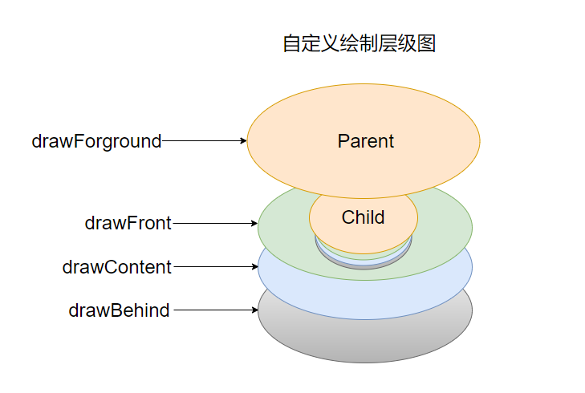
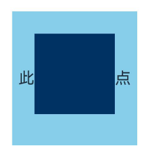

# 自定义绘制设置
<!--Kit: ArkUI-->
<!--Subsystem: ArkUI-->
<!--Owner: @xiang-shouxing-->
<!--Designer: @xiang-shouxing-->
<!--Tester: @sally__-->
<!--Adviser: @HelloCrease-->

当某些组件本身的绘制内容不满足需求时，可使用自定义组件绘制功能，在原有组件基础上部分绘制、或者全部自行绘制，以达到预期效果。例如：独特的按钮形状、文字和图像混合的图标等。自定义组件绘制提供了自定义绘制修改器，来实现更自由地组件绘制。

> **说明：**
>
> 从API version 12开始支持。后续版本如有新增内容，则采用上角标单独标记该内容的起始版本。

## drawModifier

drawModifier(modifier: DrawModifier | undefined): T

设置组件的自定义绘制修改器。

**原子化服务API：** 从API version 12开始，该接口支持在原子化服务中使用。

**系统能力：** SystemCapability.ArkUI.ArkUI.Full

**组件支持范围:**

[AlphabetIndexer](ts-container-alphabet-indexer.md)、[Badge](ts-container-badge.md)、[Blank](ts-basic-components-blank.md)、[Button](ts-basic-components-button.md)、[CalendarPicker](ts-basic-components-calendarpicker.md)、[Checkbox](ts-basic-components-checkbox.md)、[CheckboxGroup](ts-basic-components-checkboxgroup.md)、[Circle](ts-drawing-components-circle.md)、[Column](ts-container-column.md)、[ColumnSplit](ts-container-columnsplit.md)、[Counter](ts-container-counter.md)、[DataPanel](ts-basic-components-datapanel.md)、[DatePicker](ts-basic-components-datepicker.md)、[Ellipse](ts-drawing-components-ellipse.md)、[Flex](ts-container-flex.md)、[FlowItem](ts-container-flowitem.md)、[FolderStack](ts-container-folderstack.md)、[FormLink](ts-container-formlink.md)、[Gauge](ts-basic-components-gauge.md)、[Grid](ts-container-grid.md)、[GridCol](ts-container-gridcol.md)、[GridItem](ts-container-griditem.md)、[GridRow](ts-container-gridrow.md)、[Hyperlink](ts-container-hyperlink.md)、[Image](ts-basic-components-image.md)、[ImageAnimator](ts-basic-components-imageanimator.md)、[ImageSpan](ts-basic-components-imagespan.md)、[Line](ts-drawing-components-line.md)、[List](ts-container-list.md)、[ListItem](ts-container-listitem.md)、[ListItemGroup](ts-container-listitemgroup.md)、[LoadingProgress](ts-basic-components-loadingprogress.md)、[Marquee](ts-basic-components-marquee.md)、[Menu](ts-basic-components-menu.md)、[MenuItem](ts-basic-components-menuitem.md)、[MenuItemGroup](ts-basic-components-menuitemgroup.md)、[NavDestination](ts-basic-components-navdestination.md)、[Navigation](ts-basic-components-navigation.md)、[Navigator](ts-container-navigator.md)、[NavRouter](ts-basic-components-navrouter.md)、[NodeContainer](ts-basic-components-nodecontainer.md)、[Path](ts-drawing-components-path.md)、[PatternLock](ts-basic-components-patternlock.md)、[Polygon](ts-drawing-components-polygon.md)、[Polyline](ts-drawing-components-polyline.md)、[Progress](ts-basic-components-progress.md)、[QRCode](ts-basic-components-qrcode.md)、[Radio](ts-basic-components-radio.md)、[Rating](ts-basic-components-rating.md)、[Rect](ts-drawing-components-rect.md)、[Refresh](ts-container-refresh.md)、[RelativeContainer](ts-container-relativecontainer.md)、[RichEditor](ts-basic-components-richeditor.md)、[Row](ts-container-row.md)、[RowSplit](ts-container-rowsplit.md)、[Scroll](ts-container-scroll.md)、[ScrollBar](ts-basic-components-scrollbar.md)、[Search](ts-basic-components-search.md)、[Select](ts-basic-components-select.md)、[Shape](ts-drawing-components-shape.md)、[SideBarContainer](ts-container-sidebarcontainer.md)、[Slider](ts-basic-components-slider.md)、[Stack](ts-container-stack.md)、[Stepper](ts-basic-components-stepper.md)、[StepperItem](ts-basic-components-stepperitem.md)、[Swiper](ts-container-swiper.md)、[SymbolGlyph](ts-basic-components-symbolGlyph.md)、[TabContent](ts-container-tabcontent.md)、[Tabs](ts-container-tabs.md)、[Text](ts-basic-components-text.md)、[TextArea](ts-basic-components-textarea.md)、[TextClock](ts-basic-components-textclock.md)、[TextInput](ts-basic-components-textinput.md)、[TextPicker](ts-basic-components-textpicker.md)、[TextTimer](ts-basic-components-texttimer.md)、[TimePicker](ts-basic-components-timepicker.md)、[Toggle](ts-basic-components-toggle.md)、[WaterFlow](ts-container-waterflow.md)、[XComponent](ts-basic-components-xcomponent.md)

**参数：** 

| 参数名 | 类型                                                 | 必填 | 说明                                                         |
| ------ | ---------------------------------------------------- | ---- | ------------------------------------------------------------ |
| modifier  | &nbsp;[DrawModifier](#drawmodifier-1)&nbsp;\|&nbsp;undefined | 是   | 自定义绘制修改器，其中定义了自定义绘制的逻辑。 <br> 默认值：undefined <br/>**说明：** <br/> 每个自定义修改器只对当前绑定组件的[FrameNode](../js-apis-arkui-frameNode.md)生效，对其子节点不生效。 |

**返回值：**

| 类型 | 说明 |
| --- | --- |
| T | 返回当前组件。 |

## DrawModifier

DrawModifier可设置前景(drawForeground)、内容前景(drawFront)、内容(drawContent)和内容背景(drawBehind)的绘制方法，还提供主动触发重绘的方法[invalidate](#invalidate)。每个DrawModifier实例只能设置到一个组件上，禁止进行重复设置。

自定义层级示例图



**原子化服务API：** 从API version 12开始，该接口支持在原子化服务中使用。

**系统能力：** SystemCapability.ArkUI.ArkUI.Full

### drawFront

drawFront?(drawContext: DrawContext): void

自定义绘制内容前景的接口，若重载该方法则可进行内容前景的自定义绘制。

**原子化服务API：** 从API version 12开始，该接口支持在原子化服务中使用。

**系统能力：** SystemCapability.ArkUI.ArkUI.Full

**参数：**

| 参数名  | 类型                                                   | 必填 | 说明             |
| ------- | ------------------------------------------------------ | ---- | ---------------- |
| drawContext | [DrawContext](#drawcontext) | 是   | 图形绘制上下文。 |

**示例：**

请参考[示例1（通过DrawModifier进行自定义绘制）](#示例1通过drawmodifier进行自定义绘制)。

### drawContent

drawContent?(drawContext: DrawContext): void

自定义绘制内容的接口，若重载该方法则可进行内容的自定义绘制，会替换组件原本的内容绘制函数。

**原子化服务API：** 从API version 12开始，该接口支持在原子化服务中使用。

**系统能力：** SystemCapability.ArkUI.ArkUI.Full

**参数：**

| 参数名  | 类型                                                   | 必填 | 说明             |
| ------- | ------------------------------------------------------ | ---- | ---------------- |
| drawContext | [DrawContext](#drawcontext) | 是   | 图形绘制上下文。 |

**示例：**

请参考[示例1（通过DrawModifier进行自定义绘制）](#示例1通过drawmodifier进行自定义绘制)。

### drawBehind

drawBehind?(drawContext: DrawContext): void

自定义绘制背景的接口，若重载该方法则可进行背景的自定义绘制。

**原子化服务API：** 从API version 12开始，该接口支持在原子化服务中使用。

**系统能力：** SystemCapability.ArkUI.ArkUI.Full

**参数：**

| 参数名  | 类型                                                   | 必填 | 说明             |
| ------- | ------------------------------------------------------ | ---- | ---------------- |
| drawContext | [DrawContext](#drawcontext) | 是   | 图形绘制上下文。 |

**示例：**

请参考[示例1（通过DrawModifier进行自定义绘制）](#示例1通过drawmodifier进行自定义绘制)。

### drawForeground<sup>20+</sup>

drawForeground(drawContext: DrawContext): void

自定义绘制前景的接口，若重载该方法则可进行前景的自定义绘制。需要对其组件的前景层进行绘制时重载该方法。

**原子化服务API：** 从API version 20开始，该接口支持在原子化服务中使用。

**系统能力：** SystemCapability.ArkUI.ArkUI.Full

**参数：**

| 参数名  | 类型                                                   | 必填 | 说明             |
| ------- | ------------------------------------------------------ | ---- | ---------------- |
| drawContext | [DrawContext](#drawcontext) | 是   | 图形绘制上下文。 |

**示例：**

请参考[示例2（通过DrawModifier对容器的前景进行自定义绘制）](#示例2通过drawmodifier对容器的前景进行自定义绘制)。

### invalidate

invalidate(): void

主动触发重绘的接口，开发者无需也无法重载，调用会触发所绑定组件的重绘。

**原子化服务API：** 从API version 12开始，该接口支持在原子化服务中使用。

**系统能力：** SystemCapability.ArkUI.ArkUI.Full

**示例：**

请参考[示例1（通过DrawModifier进行自定义绘制）](#示例1通过drawmodifier进行自定义绘制)。

### DrawContext

type DrawContext = DrawContext

**原子化服务API：** 从API version 12开始，该接口支持在原子化服务中使用。

**系统能力：** SystemCapability.ArkUI.ArkUI.Full

| 类型                                                      | 说明                    |
| --------------------------------------------------------- | ----------------------- |
| [DrawContext](../js-apis-arkui-graphics.md#drawcontext) | 图形绘制上下文。 |

## 示例

### 示例1（通过DrawModifier进行自定义绘制）

通过DrawModifier对[Text](ts-basic-components-text.md)组件进行自定义绘制。

```ts
// xxx.ets
import { drawing } from '@kit.ArkGraphics2D';
import { AnimatorResult } from '@kit.ArkUI';

// 继承DrawModifier实现自定义绘制控制器
class MyFullDrawModifier extends DrawModifier {
  public scaleX: number = 1;
  public scaleY: number = 1;
  uiContext: UIContext;

  constructor(uiContext: UIContext) {
    super();
    this.uiContext = uiContext;
  }

  // 重载drawBehind方法，自定义绘制背景  
  drawBehind(context: DrawContext): void {
    const brush = new drawing.Brush();
    brush.setColor({
      alpha: 255,
      red: 255,
      green: 0,
      blue: 0
    });
    context.canvas.attachBrush(brush);
    const halfWidth = context.size.width / 2;
    const halfHeight = context.size.height / 2;
    context.canvas.drawRect({
      left: this.uiContext.vp2px(halfWidth - 50 * this.scaleX),
      top: this.uiContext.vp2px(halfHeight - 50 * this.scaleY),
      right: this.uiContext.vp2px(halfWidth + 50 * this.scaleX),
      bottom: this.uiContext.vp2px(halfHeight + 50 * this.scaleY)
    });
  }

  // 重载drawContent方法，自定义绘制内容
  drawContent(context: DrawContext): void {
    const brush = new drawing.Brush();
    brush.setColor({
      alpha: 255,
      red: 0,
      green: 255,
      blue: 0
    });
    context.canvas.attachBrush(brush);
    const halfWidth = context.size.width / 2;
    const halfHeight = context.size.height / 2;
    context.canvas.drawRect({
      left: this.uiContext.vp2px(halfWidth - 30 * this.scaleX),
      top: this.uiContext.vp2px(halfHeight - 30 * this.scaleY),
      right: this.uiContext.vp2px(halfWidth + 30 * this.scaleX),
      bottom: this.uiContext.vp2px(halfHeight + 30 * this.scaleY)
    });
  }

  // 重载drawFront方法，自定义绘制内容前景
  drawFront(context: DrawContext): void {
    const brush = new drawing.Brush();
    brush.setColor({
      alpha: 255,
      red: 0,
      green: 0,
      blue: 255
    });
    context.canvas.attachBrush(brush);
    const halfWidth = context.size.width / 2;
    const halfHeight = context.size.height / 2;
    const radiusScale = (this.scaleX + this.scaleY) / 2;
    context.canvas.drawCircle(this.uiContext.vp2px(halfWidth), this.uiContext.vp2px(halfHeight), this.uiContext.vp2px(20 * radiusScale));
  }
}

// 继承DrawModifier实现自定义绘制控制器，仅支持自定义绘制内容前景
class MyFrontDrawModifier extends DrawModifier {
  public scaleX: number = 1;
  public scaleY: number = 1;
  uiContext: UIContext;

  constructor(uiContext: UIContext) {
    super();
    this.uiContext = uiContext;
  }

  drawFront(context: DrawContext): void {
    const brush = new drawing.Brush();
    brush.setColor({
      alpha: 255,
      red: 0,
      green: 0,
      blue: 255
    });
    context.canvas.attachBrush(brush);
    const halfWidth = context.size.width / 2;
    const halfHeight = context.size.height / 2;
    const radiusScale = (this.scaleX + this.scaleY) / 2;
    context.canvas.drawCircle(this.uiContext.vp2px(halfWidth), this.uiContext.vp2px(halfHeight), this.uiContext.vp2px(20 * radiusScale));
  }
}

@Entry
@Component
struct DrawModifierExample {
  private fullModifier: MyFullDrawModifier = new MyFullDrawModifier(this.getUIContext());
  private frontModifier: MyFrontDrawModifier = new MyFrontDrawModifier(this.getUIContext());
  private drawAnimator: AnimatorResult | undefined = undefined;
  @State modifier: DrawModifier = new MyFrontDrawModifier(this.getUIContext());
  private count = 0;

  // 创建Animator对象并设置动画
  create() {
    let self = this;
    this.drawAnimator = this.getUIContext().createAnimator({
      duration: 1000,
      easing: 'ease',
      delay: 0,
      fill: 'forwards',
      direction: 'normal',
      iterations: 1,
      begin: 0,
      end: 2
    });
    this.drawAnimator.onFrame = (value: number) => {
      console.log('frame value =', value);
      const tempModifier = self.modifier as MyFullDrawModifier | MyFrontDrawModifier;
      tempModifier.scaleX = Math.abs(value - 1);
      tempModifier.scaleY = Math.abs(value - 1);
      // 主动触发重绘
      self.modifier.invalidate();
    };
  }

  build() {
    Column() {
      Row() {
        Text('test text')
          .width(100)
          .height(100)
          .margin(10)
          .backgroundColor(Color.Gray)
          .onClick(() => {
            const tempModifier = this.modifier as MyFullDrawModifier | MyFrontDrawModifier;
            tempModifier.scaleX -= 0.1;
            tempModifier.scaleY -= 0.1;
          })
          .drawModifier(this.modifier)
      }

      Row() {
        Button('create')
          .width(100)
          .height(100)
          .margin(10)
          .onClick(() => {
            this.create();
          })
        Button('play')
          .width(100)
          .height(100)
          .margin(10)
          .onClick(() => {
            if (this.drawAnimator) {
              this.drawAnimator.play();
            }
          })
        Button('changeModifier')
          .width(100)
          .height(100)
          .margin(10)
          .onClick(() => {
            this.count += 1;
            if (this.count % 2 === 1) {
              console.log('change to full modifier');
              this.modifier = this.fullModifier;
            } else {
              console.log('change to front modifier');
              this.modifier = this.frontModifier;
            }
          })
      }
    }
    .width('100%')
    .height('100%')
  }
}
```


### 示例2（通过DrawModifier对容器的前景进行自定义绘制）

通过DrawModifier对[Column](ts-container-column.md)容器的前景进行自定义绘制。

```ts
// xxx.ets
import { drawing } from '@kit.ArkGraphics2D';

class MyForegroundDrawModifier extends DrawModifier {
  public scaleX: number = 3;
  public scaleY: number = 3;
  uiContext: UIContext;

  constructor(uiContext: UIContext) {
    super();
    this.uiContext = uiContext;
  }

  // 重载drawForeground方法，实现自定义绘制前景
  drawForeground(context: DrawContext): void {
    const brush = new drawing.Brush();
    brush.setColor({
      alpha: 255,
      red: 0,
      green: 50,
      blue: 100
    });
    context.canvas.attachBrush(brush);
    const halfWidth = context.size.width / 2;
    const halfHeight = context.size.height / 2;
    context.canvas.drawRect({
      left: this.uiContext.vp2px(halfWidth - 30 * this.scaleX),
      top: this.uiContext.vp2px(halfHeight - 30 * this.scaleY),
      right: this.uiContext.vp2px(halfWidth + 30 * this.scaleX),
      bottom: this.uiContext.vp2px(halfHeight + 30 * this.scaleY)
    });
  }
}

@Entry
@Component
struct DrawModifierExample {
  // 将自定义绘制前景的类实例化，传入UIContext实例
  private foregroundModifier: MyForegroundDrawModifier = new MyForegroundDrawModifier(this.getUIContext());

  build() {
    Column() {
      Text('此文本是子节点')
        .fontSize(36)
        .width('100%')
        .height('100%')
        .textAlign(TextAlign.Center)
    }
    .margin(50)
    .width(280)
    .height(300)
    .backgroundColor(0x87CEEB)
    // 调用此接口并传入自定义绘制前景的类实例，即可实现自定义绘制前景
    .drawModifier(this.foregroundModifier)
  }
}

```
