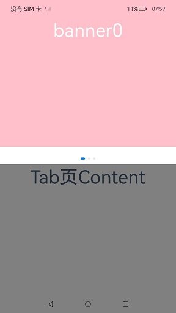

# 安全区域

安全区域是指页面的显示区域，默认不与系统设置的非安全区域比如状态栏、导航栏区域重叠，默认情况下开发者开发的界面都被布局在安全区域内。提供属性方法允许开发者设置组件绘制内容突破安全区域的限制，通过[expandSafeArea](#expandsafearea)属性支持组件不改变布局情况下扩展其绘制区域至安全区外，通过设置[setKeyboardAvoidMode](#setkeyboardavoidmode11)来配置虚拟键盘弹出时页面的避让模式。页面中有标题栏等文字不希望和非安全区重叠时，建议对组件设置expandSafeArea属性达到沉浸式效果，也可以直接通过窗口接口[setWindowLayoutFullScreen](../js-apis-window.md#setwindowlayoutfullscreen9)设置沉浸式。

> **说明：**
>
> 从API Version 10开始支持。后续版本如有新增内容，则采用上角标单独标记该内容的起始版本。<br />
> 默认摄像头挖孔区域不为非安全区域，页面不避让挖孔。<br />
> 从API Version 12开始，可在module.json5中添加配置项, 摄像头挖孔区域视为非安全区，实现页面默认避让挖孔：<br />
  "metadata": [<br />
    &nbsp;&nbsp;{<br />
    &nbsp;&nbsp;&nbsp;&nbsp;"name": "avoid_cutout",<br />
    &nbsp;&nbsp;&nbsp;&nbsp;"value": "true",<br />
    &nbsp;&nbsp;}<br />
  ],<br />
  

## expandSafeArea

expandSafeArea(types?: Array&lt;SafeAreaType&gt;, edges?: Array&lt;SafeAreaEdge&gt;)

控制组件扩展其安全区域。

**原子化服务API：** 从API version 11开始，该接口支持在原子化服务中使用。

**系统能力：** SystemCapability.ArkUI.ArkUI.Full

**参数：**

| 参数名 | 类型                                               | 必填 | 说明                                                         |
| ------ | -------------------------------------------------- | ---- | ------------------------------------------------------------ |
| types  | Array <[SafeAreaType](ts-types.md#safeareatype10)> | 否   | 配置扩展安全区域的类型。未添加[Metadata](../../apis-ability-kit/js-apis-bundleManager-metadata.md)配置项时，页面不避让挖孔, CUTOUT类型不生效。<br />默认值：[SafeAreaType.SYSTEM, SafeAreaType.CUTOUT, SafeAreaType.KEYBOARD] |
| edges  | Array <[SafeAreaEdge](ts-types.md#safeareaedge10)> | 否   | 配置扩展安全区域的方向。<br />默认值：[SafeAreaEdge.TOP, SafeAreaEdge.BOTTOM, SafeAreaEdge.START, SafeAreaEdge.END]<br />扩展至所有非安全区域。 |

>  **说明：**
>
>  设置expandSafeArea属性进行组件绘制扩展时，组件不能设置固定宽高尺寸（百分比除外）。
>
>  安全区域不会限制内部组件的布局和大小，不会裁剪内部组件。
>
>  当父容器是滚动容器时，设置expandSafeArea属性不生效。
>
>  设置expandSafeArea()时，不传参，走默认值处理；设置expandSafeArea([],[])时，相当于入参是空数组，此时设置expandSafeArea属性不生效。
>   
>  组件设置expandSafeArea之后生效的条件为：  
>  1.type为SafeAreaType.KEYBOARD时默认生效，组件不避让键盘。  
>  2.设置其他type，组件的边界与安全区域重合时组件能够延伸到安全区域下。例如：设备顶部状态栏高度100，那么组件在屏幕中的绝对位置需要为0 <= y <= 100。  
>   
>  组件延伸到安全区域下，在安全区域处的事件，如点击事件等可能会被系统拦截，优先给状态栏等系统组件响应。
>  
>  滚动类容器内的组件不建议设置expandSafeArea属性，如果设置，需要按照组件嵌套关系，将当前节点到滚动类祖先容器间所有直接节点设置expandSafeArea属性，否则expandSafeArea属性在滚动后可能会失效，写法参考[示例6](#示例6滚动类容器扩展安全区)。
> 
>  expandSafeArea属性仅作用于当前组件，不会向父组件或子组件传递，因此使用过程中，所有相关组件均需配置。
> 
>  在同时设置了expandSafeArea和position属性时，position属性会先生效，expandSafeArea属性会后生效。对于未设置position、offset等绘制属性的组件，如果组件边界没有和避让区重叠，设置expandSafeArea属性不生效，如弹窗和半模态组件。
> 
>  对于expandSafeArea属性无法生效的场景，若要将组件部署在避让区，需要手动调整组件的坐标。

## setKeyboardAvoidMode<sup>11+</sup>

setKeyboardAvoidMode(value: KeyboardAvoidMode): void

控制虚拟键盘抬起时页面的避让模式。

**原子化服务API：** 从API version 11开始，该接口支持在原子化服务中使用。

**系统能力：** SystemCapability.ArkUI.ArkUI.Full

**参数：**

| 参数名 | 类型                                                 | 必填 | 说明                                                         |
| ------ | ---------------------------------------------------- | ---- | ------------------------------------------------------------ |
| value  | [KeyboardAvoidMode](ts-types.md#keyboardavoidmode11) | 是   | 配置虚拟键盘抬起时页面的避让模式。<br />默认值：KeyboardAvoidMode.OFFSET，键盘抬起时默认页面避让模式为上抬模式。 |

>  **说明：**
>
>  KeyboardAvoidMode的RESIZE模式是压缩Page的大小，Page下设置百分比宽高的组件会跟随Page压缩，直接设置宽高的组件会按设置的固定大小布局。设置KeyboardAvoidMode的RESIZE模式时，expandSafeArea([SafeAreaType.KEYBOARD],[SafeAreaEdge.BOTTOM])不生效。
>
>  KeyboardAvoidMode.NONE配置Page不避让键盘，Page会被抬起的键盘遮盖。

## getKeyboardAvoidMode

getKeyboardAvoidMode(): KeyboardAvoidMode

返回虚拟键盘抬起时的页面避让模式。

**原子化服务API：** 从API version 11开始，该接口支持在原子化服务中使用。

**系统能力：** SystemCapability.ArkUI.ArkUI.Full

**返回值：** 

| 名称                                                 | 说明                               |
| ---------------------------------------------------- | ---------------------------------- |
| [KeyboardAvoidMode](ts-types.md#keyboardavoidmode11) | 返回虚拟键盘抬起时的页面避让模式。 |

## 示例

### 示例1（实现沉浸式效果）

该示例通过设置expandSafeArea属性向顶部和底部扩展安全区实现沉浸式效果。

```ts
// xxx.ets
@Entry
@Component
struct SafeAreaExample1 {
  @State text: string = ''
  controller: TextInputController = new TextInputController()

  build() {
    Row() {
        Column()
          .height('100%').width('100%')
          .backgroundImage($r('app.media.bg')).backgroundImageSize(ImageSize.Cover)
          .expandSafeArea([SafeAreaType.SYSTEM], [SafeAreaEdge.TOP, SafeAreaEdge.BOTTOM])
    }.height('100%')
  }
}
```


### 示例2（键盘避让时固定背景图位置）

该示例通过为背景图组件设置expandSafeArea属性，来实现拉起键盘进行避让时，背景图保持不动的效果。

```ts
// xxx.ets
@Entry
@Component
struct SafeAreaExample2 {
  @State text: string = ''
  controller: TextInputController = new TextInputController()

  build() {
    Row() {
      Stack() {
        Column()
          .height('100%').width('100%')
          .backgroundImage($r('app.media.bg')).backgroundImageSize(ImageSize.Cover)
          .expandSafeArea([SafeAreaType.KEYBOARD, SafeAreaType.SYSTEM])
        Column() {
          Button('Set caretPosition 1')
            .onClick(() => {
              this.controller.caretPosition(1)
            })
          TextInput({ text: this.text, placeholder: 'input your word...', controller: this.controller })
            .placeholderFont({ size: 14, weight: 400 })
            .width(320).height(40).offset({y: 120})
            .fontSize(14).fontColor(Color.Black)
            .backgroundColor(Color.White)
        }.width('100%').alignItems(HorizontalAlign.Center)
      }
    }.height('100%')
  }
}
```


### 示例3（设置键盘避让模式为压缩）

该示例通过调用setKeyboardAvoidMode设置键盘避让模式为RESIZE模式，实现键盘抬起时page的压缩效果。

```ts
// EntryAbility.ets
import { KeyboardAvoidMode } from '@kit.ArkUI';

onWindowStageCreate(windowStage: window.WindowStage) {
  // Main window is created, set main page for this ability
  hilog.info(0x0000, 'testTag', '%{public}s', 'Ability onWindowStageCreate');

  windowStage.loadContent('pages/Index', (err, data) => {
    let keyboardAvoidMode = windowStage.getMainWindowSync().getUIContext().getKeyboardAvoidMode();
    // 设置虚拟键盘抬起时压缩页面大小为减去键盘的高度
  windowStage.getMainWindowSync().getUIContext().setKeyboardAvoidMode(KeyboardAvoidMode.RESIZE);
    if (err.code) {
      hilog.error(0x0000, 'testTag', 'Failed to load the content. Cause: %{public}s', JSON.stringify(err) ?? '');
      return;
    }
    hilog.info(0x0000, 'testTag', 'Succeeded in loading the content. Data: %{public}s', JSON.stringify(data) ?? '');
  });
}
```

```ts
// xxx.ets
@Entry
@Component
struct KeyboardAvoidExample1 {
  build() {
    Column() {
      Row().height("30%").width("100%").backgroundColor(Color.Gray)
      TextArea().width("100%").borderWidth(1)
      Text("I can see the bottom of the page").width("100%").textAlign(TextAlign.Center).backgroundColor(Color.Pink).layoutWeight(1)
    }.width('100%').height("100%")
  }
}
```


### 示例4（设置键盘避让模式为上抬）

该示例通过调用setKeyboardAvoidMode设置键盘避让模式为OFFSET模式，实现键盘抬起时page的上抬效果。但当输入光标距离屏幕底部的高度大于键盘高度时，page不会抬起，如本例中所示。

```ts
// EntryAbility.ets
import { KeyboardAvoidMode } from '@kit.ArkUI';

onWindowStageCreate(windowStage: window.WindowStage) {
  // Main window is created, set main page for this ability
  hilog.info(0x0000, 'testTag', '%{public}s', 'Ability onWindowStageCreate');

  windowStage.loadContent('pages/Index', (err, data) => {
    let keyboardAvoidMode = windowStage.getMainWindowSync().getUIContext().getKeyboardAvoidMode();
    // 设置虚拟键盘抬起时把页面上抬直到露出光标
  windowStage.getMainWindowSync().getUIContext().setKeyboardAvoidMode(KeyboardAvoidMode.OFFSET);
    if (err.code) {
      hilog.error(0x0000, 'testTag', 'Failed to load the content. Cause: %{public}s', JSON.stringify(err) ?? '');
      return;
    }
    hilog.info(0x0000, 'testTag', 'Succeeded in loading the content. Data: %{public}s', JSON.stringify(data) ?? '');
  });
}
```

```ts
// xxx.ets
@Entry
@Component
struct KeyboardAvoidExample2 {
  build() {
    Column() {
      Row().height("30%").width("100%").backgroundColor(Color.Gray)
      TextArea().width("100%").borderWidth(1)
      Text("I can see the bottom of the page").width("100%").textAlign(TextAlign.Center).backgroundColor(Color.Pink).layoutWeight(1)
    }.width('100%').height("100%")
  }
}
```


### 示例5（切换避让模式）

该示例通过调用setKeyboardAvoidMode来实现OFFSET、RESIZE和NONE模式之间的切换，实现三种不同的键盘避让效果。

```ts
import { hilog } from '@kit.PerformanceAnalysisKit';
import { KeyboardAvoidMode } from '@kit.ArkUI';
@Entry
@Component

struct KeyboardAvoidExample3 {
  build() {
    Column() {
      Row({space:15}) {
        Button('OFFSET')
          .onClick(() => {
            this.getUIContext().setKeyboardAvoidMode(KeyboardAvoidMode.OFFSET);
            hilog.info(0x0000, 'keyboardAvoidMode: %{public}s', JSON.stringify(this.getUIContext().getKeyboardAvoidMode()));
          })
          .layoutWeight(1)
        Button('RESIZE')
          .onClick(() => {
            this.getUIContext().setKeyboardAvoidMode(KeyboardAvoidMode.RESIZE);
            hilog.info(0x0000, 'keyboardAvoidMode: %{public}s', JSON.stringify(this.getUIContext().getKeyboardAvoidMode()));
          })
          .layoutWeight(1)
        Button('NONE')
          .onClick(() => {
            this.getUIContext().setKeyboardAvoidMode(KeyboardAvoidMode.NONE);
            hilog.info(0x0000, 'keyboardAvoidMode: %{public}s', JSON.stringify(this.getUIContext().getKeyboardAvoidMode()));
          })
          .layoutWeight(1)
      }
      .height("30%")
      .width("100%")
      .backgroundColor(Color.Gray)

      TextArea()
        .width("100%")
        .borderWidth(1)
      
      Text("I can see the bottom of the page")
        .width("100%")
        .textAlign(TextAlign.Center)
        .backgroundColor(Color.Pink)
        .layoutWeight(1)
      
      TextArea()
        .width("100%")
        .borderWidth(1)
    }
    .width('100%')
    .height("100%")
  }
}
```
OFFSET模式


RESIZE模式


NONE模式


### 示例6（滚动类容器扩展安全区）

该示例通过在滚动类容器内调用expandSafeArea属性实现沉浸式效果。

```ts
class SwiperDataSource implements IDataSource {
  private list: Array<Color> = []
  constructor(list: Array<Color>) {
    this.list = list
  }
  totalCount(): number {
    return this.list.length
  }
  getData(index: number): Color {
    return this.list[index]
  }
  registerDataChangeListener(listener: DataChangeListener): void {
  }
  unregisterDataChangeListener(listener: DataChangeListener): void {
  }
}
@Entry
@Component
struct ExpandSafeAreaTest {
  private swiperController: SwiperController = new SwiperController()
  private swiperData: SwiperDataSource = new SwiperDataSource([])
  private list: Array<Color> = [
    Color.Pink,
    Color.Blue,
    Color.Green
  ]
  aboutToAppear(): void {
    this.swiperData = new SwiperDataSource(this.list)
  }
  build() {
    Scroll() {
      Column() {
        Swiper(this.swiperController) {
          LazyForEach(this.swiperData, (item: Color, index: number) => {
            Column() {
              Text('banner' + index).fontSize(50).fontColor(Color.White)
            }
            .expandSafeArea([SafeAreaType.SYSTEM], [SafeAreaEdge.TOP, SafeAreaEdge.BOTTOM])
            .width('100%')
            .height(400)
            .backgroundColor(item)
          })
        }
        .loop(true)
        .expandSafeArea([SafeAreaType.SYSTEM], [SafeAreaEdge.TOP, SafeAreaEdge.BOTTOM])
        .clip(false)
        Column(){
          Text("Tab页Content").fontSize(50)
        }.width("100%").height(1000)
        .backgroundColor(Color.Grey)
      }.expandSafeArea([SafeAreaType.SYSTEM], [SafeAreaEdge.TOP, SafeAreaEdge.BOTTOM])
    }
    .clip(false)
    .edgeEffect(EdgeEffect.None)
    .width("100%").height("100%")
  }
}
```
