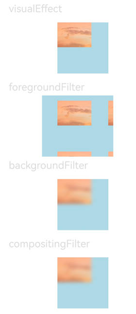

# 视效设置

本模块提供接口设置组件视觉效果，包括滤镜效果（如：模糊，像素扩展等）和非滤镜效果（如：点光源等）。

>  **说明：**
>
>  从API Version 12开始支持。后续版本如有新增内容，则采用上角标单独标记该内容的起始版本。

## visualEffect

visualEffect(effect: VisualEffect): T

设置非滤镜视觉效果。

**系统能力：** SystemCapability.ArkUI.ArkUI.Full

**参数：**

| 参数名 | 类型                                                         | 必填 | 说明                                                 |
| ------ | ------------------------------------------------------------ | ---- | ---------------------------------------------------- |
| effect | [VisualEffect](../../apis-arkgraphics2d/js-apis-uiEffect.md#visualeffect) | 是   | 非滤镜视觉效果。 |

## backgroundFilter

backgroundFilter(filter: Filter): T

设置背景滤镜视觉效果。

**系统能力：** SystemCapability.ArkUI.ArkUI.Full

**参数：**

| 参数名 | 类型                                                         | 必填 | 说明                                                 |
| ------ | ------------------------------------------------------------ | ---- | ---------------------------------------------------- |
| filter | [Filter](../../apis-arkgraphics2d/js-apis-uiEffect.md#filter) | 是   | 背景滤镜视觉效果。 |

## foregroundFilter

foregroundFilter(filter: Filter): T

设置前景滤镜（内容）视觉效果。

**系统能力：** SystemCapability.ArkUI.ArkUI.Full

**参数：**

| 参数名 | 类型                                                         | 必填 | 说明                                                 |
| ------ | ------------------------------------------------------------ | ---- | ---------------------------------------------------- |
| filter | [Filter](../../apis-arkgraphics2d/js-apis-uiEffect.md#filter) | 是   | 前景滤镜（内容）视觉效果。 |

## compositingFilter

compositingFilter(filter: Filter): T

设置合成滤镜视觉效果。

**系统能力：** SystemCapability.ArkUI.ArkUI.Full

**参数：**

| 参数名 | 类型                                                         | 必填 | 说明                                                 |
| ------ | ------------------------------------------------------------ | ---- | ---------------------------------------------------- |
| filter | [Filter](../../apis-arkgraphics2d/js-apis-uiEffect.md#filter) | 是   | 合成滤镜视觉效果。 |


## 示例
```ts
// xxx.ets
import uiEffect from '@ohos.graphics.uiEffect'

@Entry
@Component
struct FilterEffectExample {
    @State visualEffectTest: uiEffect.VisualEffect = uiEffect.createEffect()
    @State filterTest: uiEffect.Filter = uiEffect.createFilter()

    build() {
        Column({ space: 15 }) {
            Text('visualEffect').fontSize(20).width('75%').fontColor('#DCDCDC')
            Text()
                .width(100)
                .height(100)
                .backgroundColor('#ADD8E6')
                .backgroundImage($r("app.media.sky"))
                .visualEffect(this.visualEffectTest.backgroundColorBlender(uiEffect.createBrightnessBlender(
                    100, 100, 100, 100, 100, [100, 100, 100], [100, 100, 100], 10
                ))) // 通过 visualEffect 设置背景颜色提亮效果
            
            Text('foregroundFilter').fontSize(20).width('75%').fontColor('#DCDCDC')
            Text()
                .width(100)
                .height(100)
                .backgroundColor('#ADD8E6')
                .backgroundImage($r("app.media.sky"))
                .foregroundFilter(this.filterTest.pixelStretch([0.3, 0.1, 0.1, 0.1], uiEffect.TileMode.REPEAT)) // 通过 foregroundFilter 进行像素扩展

            Text('backgroundFilter').fontSize(20).width('75%').fontColor('#DCDCDC')
            Text()
                .width(100)
                .height(100)
                .backgroundColor('#ADD8E6')
                .backgroundImage($r("app.media.sky"))
                .backgroundFilter(this.filterTest.blur(10)) // 通过 backgroundFilter 设置模糊效果
            
            Text('compositingFilter').fontSize(20).width('75%').fontColor('#DCDCDC')
            Text()
                .width(100)
                .height(100)
                .backgroundColor('#ADD8E6')
                .backgroundImage($r("app.media.sky"))
                .compositingFilter(this.filterTest.blur(10)) // 通过 compositingFilter 设置模糊效果
        }
        .height('100%')
        .width('100%')
    }
}
```

