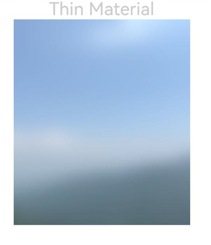

# 组件内容模糊
<!--Kit: ArkUI-->
<!--Subsystem: ArkUI-->
<!--Owner: @CCFFWW-->
<!--Designer: @yangfan229-->
<!--Tester: @lxl007-->
<!--Adviser: @HelloCrease-->

为当前组件添加内容模糊效果。

>  **说明：**
>
>  从API version 10开始支持。后续版本如有新增内容，则采用上角标单独标记该内容的起始版本。

## foregroundBlurStyle

foregroundBlurStyle(value: BlurStyle, options?: ForegroundBlurStyleOptions): T

为当前组件提供内容模糊能力。

**原子化服务API：** 从API version 11开始，该接口支持在原子化服务中使用。

**系统能力：** SystemCapability.ArkUI.ArkUI.Full

**参数：** 

| 参数名  | 类型                                                         | 必填 | 说明                     |
| ------- | ------------------------------------------------------------ | ---- | ------------------------ |
| value   | [BlurStyle](ts-universal-attributes-background.md#blurstyle9) | 是   | 内容模糊样式。           |
| options | [ForegroundBlurStyleOptions](#foregroundblurstyleoptions对象说明) | 否   | 可选参数，内容模糊选项。 |

**返回值：**

| 类型   | 说明                     |
| ------ | ------------------------ |
| T | 返回当前组件。 |

## foregroundBlurStyle<sup>18+</sup>

foregroundBlurStyle(style: Optional\<BlurStyle>, options?: ForegroundBlurStyleOptions): T

为当前组件提供内容模糊能力。与[foregroundBlurStyle](#foregroundblurstyle)相比，style参数新增了对undefined类型的支持。

**原子化服务API：** 从API version 18开始，该接口支持在原子化服务中使用。

**系统能力：** SystemCapability.ArkUI.ArkUI.Full

**参数：** 

| 参数名  | 类型                                                         | 必填 | 说明                                                         |
| ------- | ------------------------------------------------------------ | ---- | ------------------------------------------------------------ |
| style   | Optional\<[BlurStyle](ts-universal-attributes-background.md#blurstyle9)> | 是   | 内容模糊样式。<br/>当style的值为undefined时，恢复为无模糊的内容。 |
| options | [ForegroundBlurStyleOptions](#foregroundblurstyleoptions对象说明) | 否   | 可选参数，内容模糊选项。                                     |

**返回值：**

| 类型   | 说明                     |
| ------ | ------------------------ |
| T | 返回当前组件。 |

## foregroundBlurStyle<sup>19+</sup>

foregroundBlurStyle(style: Optional\<BlurStyle>, options?: ForegroundBlurStyleOptions, sysOptions?: SystemAdaptiveOptions): T

为当前组件提供内容模糊能力。与[foregroundBlurStyle<sup>18+</sup>](#foregroundblurstyle18)相比，新增了sysOptions参数，即支持系统自适应调节参数。

**原子化服务API：** 从API version 19开始，该接口支持在原子化服务中使用。

**系统能力：** SystemCapability.ArkUI.ArkUI.Full

**参数：** 

| 参数名  | 类型                                                         | 必填 | 说明                                                         |
| ------- | ------------------------------------------------------------ | ---- | ------------------------------------------------------------ |
| style   | Optional\<[BlurStyle](ts-universal-attributes-background.md#blurstyle9)> | 是   | 内容模糊样式。<br/>当style的值为undefined时，恢复为无模糊的内容。 |
| options | [ForegroundBlurStyleOptions](#foregroundblurstyleoptions对象说明) | 否   | 可选参数，内容模糊选项。                                     |
| sysOptions   |  [SystemAdaptiveOptions](ts-universal-attributes-background.md#systemadaptiveoptions19)    |   否   |  系统自适应调节参数。<br/>默认值：{ disableSystemAdaptation: false }    |

**返回值：**

| 类型   | 说明                     |
| ------ | ------------------------ |
| T | 返回当前组件。 |

>  **说明：**
>
>  foregroundBlurStyle接口为实时模糊接口，每帧执行实时渲染，性能负载较大。当模糊内容与模糊半径均无需变动时，推荐采用静态模糊接口[blur](../../apis-arkgraphics2d/js-apis-effectKit.md#blur)。最佳实践请参考：[图像模糊动效优化-使用场景](https://developer.huawei.com/consumer/cn/doc/best-practices/bpta-fuzzy-scene-performance-optimization#section4945532519)。

## ForegroundBlurStyleOptions对象说明
继承自[BlurStyleOptions](#blurstyleoptions)

设置内容模糊选项。

**原子化服务API：** 从API version 11开始，该接口支持在原子化服务中使用。

**系统能力：** SystemCapability.ArkUI.ArkUI.Full

## BlurStyleOptions

内容模糊选项。

**系统能力：** SystemCapability.ArkUI.ArkUI.Full

| 名称                        | 类型                                                | 只读 | 可选 | 说明                                                         |
| --------------------------- | ------------------------------------------------------- | ---- | ---- |------------------------------------------------------------ |
| colorMode     | [ThemeColorMode](ts-container-with-theme.md#themecolormode10枚举说明) | 否 | 是  | 内容模糊效果使用的深浅色模式。<br/>默认值：ThemeColorMode.SYSTEM<br/>**原子化服务API：** 从API version 11开始，该接口支持在原子化服务中使用。 |
| adaptiveColor | [AdaptiveColor](#adaptivecolor10枚举说明)   | 否 | 是   | 内容模糊效果使用的取色模式。<br/>默认值：AdaptiveColor.DEFAULT<br/>**原子化服务API：** 从API version 11开始，该接口支持在原子化服务中使用。 |
| blurOptions<sup>11+</sup> | [BlurOptions](#bluroptions11)         | 否 | 是    | 灰阶模糊参数。<br/>默认值：grayscale: [0,0] <br/>**原子化服务API：** 从API version 12开始，该接口支持在原子化服务中使用。|
| scale<sup>12+</sup> | number   | 否 | 是  | 内容模糊效果程度。<br/>默认值：1.0 <br/>取值范围：[0.0, 1.0] <br/>1.0表示模糊程度最高。 <br/>0.0表示模糊程度最低。<br/>**原子化服务API：** 从API version 12开始，该接口支持在原子化服务中使用。|

## AdaptiveColor<sup>10+</sup>枚举说明

取色模式。

**原子化服务API：** 从API version 11开始，该接口支持在原子化服务中使用。

**系统能力：** SystemCapability.ArkUI.ArkUI.Full

| 名称      | 说明                        |
| ------- | ------------------------- |
| DEFAULT | 不使用取色模糊。使用默认的颜色作为蒙版颜色。采用非DEFAULT方式较耗时。    |
| AVERAGE | 使用取色模糊。将取色区域的颜色平均值作为蒙版颜色。 |

## BlurOptions<sup>11+</sup>
灰阶模糊参数。

**原子化服务API：** 从API version 12开始，该接口支持在原子化服务中使用。

**系统能力：** SystemCapability.ArkUI.ArkUI.Full

| 名称        |   类型   |   必填 | 说明                        |
| ----        |  ----   |   ---- | --------------------------  |
| grayscale   |  [number, number]   |   是   |  灰阶模糊参数，两参数取值范围均为[0,127] 。对图像中的黑白色进行色阶调整，使其趋于灰色更为柔和美观，对图像中的彩色调整没有效果。参数一表示对黑色的提亮程度，参数二表示对白色的压暗程度，参数值越大调整效果越明显（黑白色变得越灰），有效值范围0-127。例如：设置参数为（20,20），图片中的黑色像素RGB:[0, 0, 0]会调整为[20,20,20]，白色像素RGB:[255,255,255]会调整为[235,235,235]（255-20），图像中的彩色像素维持不变。 |


## 示例

该示例主要演示通过foregroundBlurStyle为图片设置内容模糊效果。

```ts
// xxx.ets
@Entry
@Component
struct ForegroundBlurStyleDemo {
  build() {
    Column() {
      Text('Thin Material').fontSize(30).fontColor(0xCCCCCC)
      Image($r('app.media.bg'))
        .width(300)
        .height(350)
        .foregroundBlurStyle(BlurStyle.Thin,
          { colorMode: ThemeColorMode.LIGHT, adaptiveColor: AdaptiveColor.DEFAULT, scale: 1.0 })
    }
    .height('100%')
    .width('100%')
  }
}
```

