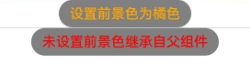

# 前景色设置

设置组件的前景色。

>  **说明：**
>
>  从API version 10开始支持。后续版本如有新增内容，则采用上角标单独标记该内容的起始版本。

## foregroundColor

foregroundColor(value: ResourceColor | ColoringStrategy)

设置组件的前景色。当组件未设置前景色，默认继承父组件。

**原子化服务API：** 从API version 11开始，该接口支持在原子化服务中使用。

**系统能力：** SystemCapability.ArkUI.ArkUI.Full

**参数：**

| 参数名 | 类型                                                         | 必填 | 说明                                                         |
| ------ | ------------------------------------------------------------ | ---- | ------------------------------------------------------------ |
| value  | [ResourceColor](ts-types.md#resourcecolor)&nbsp;\|&nbsp;[ColoringStrategy](ts-appendix-enums.md#coloringstrategy10) | 是   | 设置组件的前景颜色或者根据智能取色策略设置前景颜色。不支持属性动画。 |

## foregroundColor<sup>18+</sup>

foregroundColor(color: Optional\<ResourceColor | ColoringStrategy>)

设置组件的前景色。当组件未设置前景色，默认继承父组件。与[foregroundColor](#foregroundcolor)相比，color参数新增了对undefined类型的支持。

**原子化服务API：** 从API version 18开始，该接口支持在原子化服务中使用。

**系统能力：** SystemCapability.ArkUI.ArkUI.Full

**参数：**

| 参数名 | 类型                                                         | 必填 | 说明                                                         |
| ------ | ------------------------------------------------------------ | ---- | ------------------------------------------------------------ |
| color  | Optional\<[ResourceColor](ts-types.md#resourcecolor)&nbsp;\|&nbsp;[ColoringStrategy](ts-appendix-enums.md#coloringstrategy10)> | 是   | 设置组件的前景颜色或者根据智能取色策略设置前景颜色。不支持属性动画。<br/>当color的值为undefined时，维持之前取值。 |

## 示例

### 示例1（使用前景色设置）

该示例主要演示通过foregroundColor设置前置景色。

```ts
// xxx.ets
@Entry
@Component
struct ForegroundColorExample {
  build() {
    Column({ space: 100 }) {
      // 绘制一个直径为150的圆,默认填充色为黑色
      Circle({ width: 150, height: 200 })
      // 绘制一个直径为150的圆，
      Circle({ width: 150, height: 200 }).foregroundColor(Color.Red)
    }.width('100%').backgroundColor(Color.Blue)
  }
}
```


### 示例2（设置前景色为组件背景色反色）

该示例通过ColoringStrategy.INVERT将前置景色设置为背景色反色。

```ts
// xxx.ets
@Entry
@Component
struct ColoringStrategyExample {
  build() {
    Column({ space: 100 }) {
      // 绘制一个直径为150的圆,默认填充色为黑色
      Circle({ width: 150, height: 200 })
      // 绘制一个直径为150的圆，设置前景色为组件背景色的反色
      Circle({ width: 150, height: 200 })
        .backgroundColor(Color.Black)
        .foregroundColor(ColoringStrategy.INVERT)
    }.width('100%')
  }
}
```


### 示例3（前置景色未继承父组件）

该示例主要演示组件同时设置前置景色和背景色与只设置背景色的效果对比。

```ts
// xxx.ets
@Entry
@Component
struct foregroundColorInherit {
  build() {
    Column() {
      Button('设置前景色为橘色').fontSize(20).foregroundColor(Color.Orange).backgroundColor(Color.Gray)
      Divider()
      Button('未设置前景色继承自父组件').fontSize(20).backgroundColor(Color.Gray)
    }.foregroundColor(Color.Red)
  }
}
```

