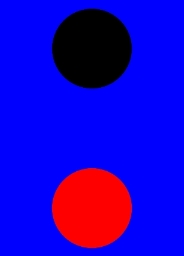

# 前景色设置
<!--Kit: ArkUI-->
<!--Subsystem: ArkUI-->
<!--Owner: @hehongyang3-->
<!--Designer: @hehongyang3-->
<!--Tester: @lxl007-->
<!--Adviser: @Brilliantry_Rui-->

设置组件的前景色。与背景色相对应，前景色会影响绘制组件内容的颜色。主要影响文字的颜色、形状绘制组件（如Circle、Rect、Path等）的填充色。

>  **说明：**
>
> - 从API version 10开始支持。后续版本如有新增内容，则采用上角标单独标记该内容的起始版本。
>
> - 本模块接口仅可在Stage模型下使用。

## foregroundColor

foregroundColor(value: ResourceColor \| ColoringStrategy): T

设置组件的前景色。当组件未设置前景色时，默认继承父组件的前景色。

**原子化服务API：** 从API version 11开始，该接口支持在原子化服务中使用。

**系统能力：** SystemCapability.ArkUI.ArkUI.Full

**参数：**

| 参数名 | 类型                                                         | 必填 | 说明                                                         |
| ------ | ------------------------------------------------------------ | ---- | ------------------------------------------------------------ |
| value  | [ResourceColor](ts-types.md#resourcecolor)&nbsp;\|&nbsp;[ColoringStrategy](ts-appendix-enums.md#coloringstrategy10) | 是   | 设置组件的前景色或者根据智能取色策略设置前景色。使用[ColoringStrategy](ts-appendix-enums.md#coloringstrategy10).INVERT时前景色为背景色的反色，需配合设置[backgroundColor](ts-universal-attributes-background.md#backgroundcolor)。不支持[属性动画](ts-animatorproperty.md)。 |

**返回值：**

| 类型   | 说明                     |
| ------ | ------------------------ |
| T | 返回当前组件，用于链式调用。 |

## foregroundColor<sup>18+</sup>

foregroundColor(color: Optional\<ResourceColor \| ColoringStrategy>): T

设置组件的前景色。当组件未设置前景色时，默认沿组件树向上继承祖先组件的前景色。与[foregroundColor](#foregroundcolor)相比，color参数新增了对undefined类型的支持。

**原子化服务API：** 从API version 18开始，该接口支持在原子化服务中使用。

**系统能力：** SystemCapability.ArkUI.ArkUI.Full

**参数：**

| 参数名 | 类型                                                         | 必填 | 说明                                                         |
| ------ | ------------------------------------------------------------ | ---- | ------------------------------------------------------------ |
| color  | [Optional](ts-universal-attributes-custom-property.md#optionalt)\<[ResourceColor](ts-types.md#resourcecolor)&nbsp;\|&nbsp;[ColoringStrategy](ts-appendix-enums.md#coloringstrategy10)> | 是   | 设置组件的前景色或者根据智能取色策略设置前景色。使用[ColoringStrategy](ts-appendix-enums.md#coloringstrategy10).INVERT时前景色为背景色的反色，需配合设置[backgroundColor](ts-universal-attributes-background.md#backgroundcolor)。不支持[属性动画](ts-animatorproperty.md)。<br>当color的值为undefined时，若组件之前已设置前景色则维持之前的前景色取值，若组件之前未设置前景色则使用组件默认前景色取值。不同组件的默认前景色取值可能存在差异，建议开发者使用确定颜色或[ColoringStrategy](ts-appendix-enums.md#coloringstrategy10)。 |

**返回值：**

| 类型   | 说明                     |
| ------ | ------------------------ |
| T | 返回当前组件，用于链式调用。 |

## 示例

### 示例1（使用前景色设置）

该示例主要演示通过foregroundColor设置前景色。

```ts
// xxx.ets
@Entry
@Component
struct ForegroundColorExample {
  build() {
    Column({ space: 100 }) {
      // 绘制一个直径为150的圆，默认填充色为黑色
      Circle({ width: 150, height: 200 }).margin(20)
      // 绘制一个直径为150的圆，设置前景色为橙色
      Circle({ width: 150, height: 200 }).foregroundColor(Color.Orange)
    }.width('100%').backgroundColor(Color.Gray)
  }
}
```



### 示例2（设置前景色为组件背景色反色）

该示例通过[ColoringStrategy](ts-appendix-enums.md#coloringstrategy10).INVERT将前景色设置为背景色反色。

```ts
// xxx.ets
@Entry
@Component
struct ColoringStrategyExample {
  build() {
    Column({ space: 100 }) {
      // 绘制一个直径为150的圆，默认填充色为黑色
      Circle({ width: 150, height: 200 })
      // 绘制一个直径为150的圆，设置前景色为组件背景色的反色
      Circle({ width: 150, height: 200 })
        .backgroundColor(Color.Black)
        .foregroundColor(ColoringStrategy.INVERT)
    }.width('100%')
  }
}
```


### 示例3（前景色未继承父组件）

该示例主要演示组件同时设置前景色和背景色与只设置背景色的效果对比。

```ts
// xxx.ets
@Entry
@Component
struct ForegroundColorInherit {
  build() {
    Column() {
      Button('设置前景色为橙色').fontSize(20).foregroundColor(Color.Orange).backgroundColor(Color.Gray)
      Divider()
      Button('未设置前景色继承自父组件').fontSize(20).backgroundColor(Color.Gray)
    }.foregroundColor(Color.Pink)
  }
}
```

