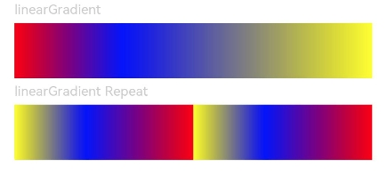
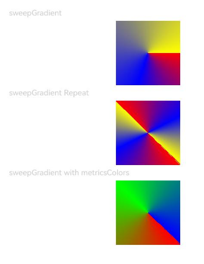

# 颜色渐变

设置组件的颜色渐变效果。

>  **说明：**
>
> 从API version 7开始支持。后续版本如有新增内容，则采用上角标单独标记该内容的起始版本。
>
> 颜色渐变属于组件内容，绘制在背景上方。
>
> 颜色渐变不支持宽高显式动画，执行宽高动画时颜色渐变会直接过渡到终点。

## linearGradient

linearGradient(value: {angle?: number | string; direction?: GradientDirection; colors: Array\<[ResourceColor, number]>; repeating?: boolean;}): T

线性渐变。

**卡片能力：** 从API version 9开始，该接口支持在ArkTS卡片中使用。

**原子化服务API：** 从API version 11开始，该接口支持在原子化服务中使用。

**系统能力：** SystemCapability.ArkUI.ArkUI.Full

**参数：**

| 参数名 | 类型                                                         | 必填 | 说明                                                         |
| ------ | ------------------------------------------------------------ | ---- | ------------------------------------------------------------ |
| value  | {<br/>angle?:&nbsp;number&nbsp;\|&nbsp;string,<br/>direction?:&nbsp;[GradientDirection](ts-appendix-enums.md#gradientdirection),<br/>colors:&nbsp;Array&lt;[[ResourceColor](ts-types.md#resourcecolor),&nbsp;number]&gt;,<br/>repeating?:&nbsp;boolean<br/>} | 是   | 线性渐变。<br/> 取值范围：(-∞,+∞) <br/>- angle：线性渐变的起始角度。0点方向顺时针旋转为正向角度。<br/>  默认值：180<br/>角度为字符串时仅支持类型deg，grad，rad，turn。<br/>- direction：线性渐变的方向，设置angle后不生效。<br/>  默认值：GradientDirection.Bottom <br/>- [colors](#radialgradientoptions18对象说明)：指定渐变色颜色和其对应的百分比位置的数组，设置非法颜色直接跳过。<br/>- repeating：为渐变的颜色重复着色。 <br/>  默认值：false |

**返回值：**

| 类型   | 说明                     |
| ------ | ------------------------ |
| T | 返回当前组件。 |

## linearGradient<sup>18+</sup>

linearGradient(options: Optional\<LinearGradientOptions>): T

线性渐变。与[linearGradient](#lineargradient)相比，options参数新增了对undefined类型的支持。

**卡片能力：** 从API version 18开始，该接口支持在ArkTS卡片中使用。

**原子化服务API：** 从API version 18开始，该接口支持在原子化服务中使用。

**系统能力：** SystemCapability.ArkUI.ArkUI.Full

**参数：**

| 参数名  | 类型                                                         | 必填 | 说明                                                         |
| ------- | ------------------------------------------------------------ | ---- | ------------------------------------------------------------ |
| options | Optional\<[LinearGradientOptions](#lineargradientoptions18对象说明)> | 是   | 线性渐变。<br/>当options的值为undefined时，恢复为无线性渐变的效果。 |

**返回值：**

| 类型   | 说明                     |
| ------ | ------------------------ |
| T | 返回当前组件。 |

## LinearGradientOptions<sup>18+</sup>对象说明

线性渐变的参数。

**原子化服务API：** 从API version 16开始，该接口支持在原子化服务中使用。

**系统能力：** SystemCapability.ArkUI.ArkUI.Full

| 名称                                       | 类型                                                         | 必填 | 说明                                                         |
| ------------------------------------------ | ------------------------------------------------------------ | ---- | ------------------------------------------------------------ |
| angle                                      | number&nbsp;\|&nbsp;string                                   | 否   | 线性渐变的起始角度。0点方向顺时针旋转为正向角度。默认值：180。角度为字符串时仅支持类型deg，grad，rad，turn。|
| direction                                  | [GradientDirection](ts-appendix-enums.md#gradientdirection)  | 否   | 线性渐变的方向，设置angle后不生效。默认值：GradientDirection.Bottom。|
| [colors](#radialgradientoptions18对象说明) | Array[[ResourceColor](ts-types.md#resourcecolor),&nbsp;number] | 是   | 指定渐变色颜色和其对应的百分比位置的数组，设置非法颜色直接跳过。|
| repeating                                  | boolean                                                      | 否   | 为渐变的颜色重复着色。<br>默认值：false。<br>true：允许为渐变的颜色重复着色。<br>false：不允许为渐变的颜色重复着色。|

## sweepGradient

sweepGradient(value: {center: [Length, Length]; start?: number | string; end?: number | string; rotation?: number | string; colors: Array\<[ResourceColor, number]>; repeating?: boolean;}): T

角度渐变。

**原子化服务API：** 从API version 11开始，该接口支持在原子化服务中使用。

**系统能力：** SystemCapability.ArkUI.ArkUI.Full

**卡片能力：** 从API version 9开始，该接口支持在ArkTS卡片中使用。

**参数：**

| 参数名 | 类型                                                         | 必填 | 说明                                                         |
| ------ | ------------------------------------------------------------ | ---- | ------------------------------------------------------------ |
| value  | {<br/>center:&nbsp;[[Length](./ts-types.md#length), Length],<br/>start?:&nbsp;number&nbsp;\|&nbsp;string,<br/>end?:&nbsp;number&nbsp;\|&nbsp;string,<br/>rotation?:&nbsp;number&nbsp;\|&nbsp;string,<br/>colors:&nbsp;Array&lt;[[ResourceColor](ts-types.md#resourcecolor),&nbsp;number]&gt;,<br/>repeating?:&nbsp;boolean<br/>} | 是   | 角度渐变，仅绘制0-360度范围内的角度，超出时不绘制渐变色，只绘制纯色。<br/>- center：为角度渐变的中心点，即相对于当前组件左上角的坐标。<br/>- start：角度渐变的起点。<br/>&nbsp;默认值：0<br/>角度为字符串时仅支持类型deg，grad，rad，turn。<br/>- end：角度渐变的终点。<br/>&nbsp;默认值：0<br/>角度为字符串时仅支持类型deg，grad，rad，turn。<br/>- rotation：角度渐变的旋转角度。<br/>&nbsp;默认值：0<br/>角度为字符串时仅支持类型deg，grad，rad，turn。<br/>- [colors](#radialgradientoptions18对象说明)：指定渐变色颜色和其对应的百分比位置的数组，设置非法颜色直接跳过。<br/>- repeating：为渐变的颜色重复着色。<br>默认值：false。<br>true：允许为渐变的颜色重复着色。<br>false：不允许为渐变的颜色重复着色。<br/>**说明：** <br/>设置为小于0的值时，按值为0处理，设置为大于360的值时，按值为360处理。<br/>当start、end、rotation的数据类型为string，合法的取值为纯数字或纯数字后带"deg"（度）、"rad"（弧度）、"grad"（梯度）、"turn"（圈）单位，例如："90"、 "90deg"、"1.57rad"。 |

**返回值：**

| 类型   | 说明                     |
| ------ | ------------------------ |
| T | 返回当前组件。 |

## sweepGradient<sup>18+</sup>

sweepGradient(options: Optional\<SweepGradientOptions>): T

角度渐变。与[sweepGradient](#sweepgradient)相比，options参数新增了对undefined类型的支持。

**原子化服务API：** 从API version 18开始，该接口支持在原子化服务中使用。

**系统能力：** SystemCapability.ArkUI.ArkUI.Full

**卡片能力：** 从API version 18开始，该接口支持在ArkTS卡片中使用。

**参数：**

| 参数名  | 类型                                                         | 必填 | 说明                                                         |
| ------- | ------------------------------------------------------------ | ---- | ------------------------------------------------------------ |
| options | Optional\<[SweepGradientOptions](#sweepgradientoptions18对象说明)> | 是   | 角度渐变。<br/>当options的值为undefined时，恢复为无角度渐变的效果。 |

**返回值：**

| 类型   | 说明                     |
| ------ | ------------------------ |
| T | 返回当前组件。 |

## SweepGradientOptions<sup>18+</sup>对象说明

角度渐变参数。

**系统能力：** SystemCapability.ArkUI.ArkUI.Full

| 名称                                       | 类型                                                         | 必填 | 说明                                                         |
| ------------------------------------------ | ------------------------------------------------------------ | ---- |------------------------------------------------------------- |
| center                                    | [[Length](./ts-types.md#length), Length]                     | 是   | 为角度渐变的中心点，即相对于当前组件左上角的坐标。<br>**原子化服务API：** 从API version 18开始，该接口支持在原子化服务中使用。           |
| start                                     | number&nbsp;\|&nbsp;string                                   | 否   | 角度渐变的起点。&nbsp;默认值：0。<br/>角度为字符串时仅支持类型deg，grad，rad，turn。<br>**原子化服务API：** 从API version 18开始，该接口支持在原子化服务中使用。                            |
| end                                       | number&nbsp;\|&nbsp;string                                   | 否   | 角度渐变的终点。&nbsp;默认值：0。<br/>角度为字符串时仅支持类型deg，grad，rad，turn。<br>**原子化服务API：** 从API version 18开始，该接口支持在原子化服务中使用。                            |
| rotation                                   | number&nbsp;\|&nbsp;string                                   | 否   | 角度渐变的旋转角度。默认值：0。<br/>角度为字符串时仅支持类型deg，grad，rad，turn。<br>**原子化服务API：** 从API version 18开始，该接口支持在原子化服务中使用。                              |
| colors | Array&lt;[[ResourceColor](ts-types.md#resourcecolor),&nbsp;number] | 是   | 指定渐变色颜色和其对应的百分比位置的数组，设置非法颜色直接跳过。<br>**原子化服务API：** 从API version 18开始，该接口支持在原子化服务中使用。 |
| metricsColors<sup>20+</sup> | Array&lt;[[ColorMetrics](../js-apis-arkui-graphics.md#colormetrics12),&nbsp;number] | 否   | 指定渐变色颜色和其对应的百分比位置的数组，设置非法颜色直接跳过。设置metricsColors时colors失效。每个渐变ColorMetrics的色域属性应当统一，设置不同色域属性则认为非法。默认值为透明色。<br>**原子化服务API：** 从API version 20开始，该接口支持在原子化服务中使用。 |
| repeating                                 | boolean                                                      | 否   | 为渐变的颜色重复着色。<br>默认值：false <br>true：允许为渐变的颜色重复着色。<br>false：不允许为渐变的颜色重复着色。<br>**原子化服务API：** 从API version 18开始，该接口支持在原子化服务中使用。                       |

>  **说明：** 
>
>  metricsColors参数的约束：
>
>  [ColorMetrics](../js-apis-arkui-graphics.md#colormetrics12)表示填充的颜色，可以使用[colorWithSpace](../js-apis-arkui-graphics.md#colorwithspace20)方法构造指定色域属性的颜色。number表示指定颜色所处的位置，取值范围为[0, 1.0]，0表示需要设置渐变色的容器开始处，1.0表示容器的结束处。为了实现多个颜色渐变效果，多个数组中的number类型参数应递增设置。如果后一个数组中的number类型参数小于前一个数组的number类型参数，将按照等于前一个数组number值处理。

## radialGradient

radialGradient(value: { center: [Length, Length]; radius: number | string; colors: Array\<[ResourceColor, number]>; repeating?: boolean }): T

径向渐变。

**原子化服务API：** 从API version 11开始，该接口支持在原子化服务中使用。

**系统能力：** SystemCapability.ArkUI.ArkUI.Full

**卡片能力：** 从API version 9开始，该接口支持在ArkTS卡片中使用。

**参数：** 

| 参数名 | 类型                                                         | 必填 | 说明                                                         |
| ------ | ------------------------------------------------------------ | ---- | ------------------------------------------------------------ |
| value  | {<br/>center:&nbsp;[[Length](./ts-types.md#length), Length],<br/> radius:&nbsp;number \| string,<br/>colors:&nbsp;Array&lt;[[ResourceColor](ts-types.md#resourcecolor),&nbsp;number]&gt;,<br/>repeating?:&nbsp;boolean<br/>} | 是   | 径向渐变。<br/>- center：径向渐变的中心点，即相对于当前组件左上角的坐标。<br/>- radius：径向渐变的半径。<br/>&nbsp;取值范围：[0,+∞)<br>**说明：** <br/>设置为小于的0值时，按值为0处理。<br/>- [colors](#radialgradientoptions18对象说明)：指定渐变色颜色和其对应的百分比位置的数组，设置非法颜色直接跳过。<br/>- repeating：为渐变的颜色重复着色。<br>默认值：false。<br>true：允许为渐变的颜色重复着色。<br>false：不允许为渐变的颜色重复着色。 |

**返回值：**

| 类型   | 说明                     |
| ------ | ------------------------ |
| T | 返回当前组件。 |

## radialGradient<sup>18+</sup>

radialGradient(options: Optional\<RadialGradientOptions>): T

径向渐变。与[radialGradient](#radialgradient)相比，options参数新增了对undefined类型的支持。

**原子化服务API：** 从API version 18开始，该接口支持在原子化服务中使用。

**系统能力：** SystemCapability.ArkUI.ArkUI.Full

**卡片能力：** 从API version 18开始，该接口支持在ArkTS卡片中使用。

**参数：** 


| 参数名     | 类型                                         | 必填                             | 说明                               |
| -------------- | -------------------------------------------- | ----------------------------------- | ----------------------------------- |
| options | Optional\<[RadialGradientOptions](#radialgradientoptions18对象说明)> | 是 | 径向渐变。<br/>当options的值为undefined时，恢复为无径向渐变的效果。 |

**返回值：**

| 类型   | 说明                     |
| ------ | ------------------------ |
| T | 返回当前组件。 |

## RadialGradientOptions<sup>18+</sup>对象说明

径向渐变参数。

**原子化服务API：** 从API version 18开始，该接口支持在原子化服务中使用。

**系统能力：** SystemCapability.ArkUI.ArkUI.Full

| 名称      | 类型                                                         | 必填 | 说明                                                   |
| --------- | ------------------------------------------------------------ | ---- | ------------------------------------------------------ |
| center    | &nbsp;[[Length](./ts-types.md#length), Length]               | 是   | 径向渐变的中心点，即相对于当前组件左上角的坐标。       |
| radius    | [Length](./ts-types.md#length)                                  | 是   | 径向渐变的半径。<br/>取值范围：[0,+∞)               |
| colors    | Array&lt;[[ResourceColor](ts-types.md#resourcecolor),&nbsp;number]&gt; | 是   | 指定渐变色颜色和其对应的百分比位置的数组，设置非法颜色直接跳过。 |
| repeating | boolean                                                     | 否   | 为渐变的颜色重复着色。默认值：false。                  |

>  **说明：** 
>
>  colors参数的约束：
>
>  [ResourceColor](ts-types.md#resourcecolor)表示填充的颜色，number表示指定颜色所处的位置，取值范围为[0,1.0]，0表示需要设置渐变色的容器的开始处，1.0表示容器的结尾处。想要实现多个颜色渐变效果时，多个数组中number参数建议递增设置，如后一个数组number参数比前一个数组number小的话，按照等于前一个数组number的值处理。


## 示例

### 示例1（颜色从右向左线性渐变）

该示例通过linearGradient来实现组件的颜色线性渐变。

```ts
// xxx.ets
@Entry
@Component
struct ColorGradientExample {
  build() {
    Column({ space: 5 }) {
      Text('linearGradient').fontSize(12).width('90%').fontColor(0xCCCCCC)
      Row()
        .width('90%')
        .height(50)
        .linearGradient({
          angle: 90,
          colors: [[0xff0000, 0.0], [0x0000ff, 0.3], [0xffff00, 1.0]]
        })
      Text('linearGradient Repeat').fontSize(12).width('90%').fontColor(0xCCCCCC)
      Row()
        .width('90%')
        .height(50)
        .linearGradient({
          direction: GradientDirection.Left, // 渐变方向
          repeating: true, // 渐变颜色是否重复
          colors: [[0xff0000, 0.0], [0x0000ff, 0.3], [0xffff00, 0.5]] // 数组末尾元素占比小于1时满足重复着色效果
        })
    }
    .width('100%')
    .padding({ top: 5 })
  }
}
```



### 示例2（颜色按旋转角度渐变）

该示例通过sweepGradient来实现组件颜色旋转角度渐变。

```ts
import { ColorMetrics } from '@kit.ArkUI';

@Entry
@Component
struct ColorGradientExample {
  @State p3Red: ColorMetrics = ColorMetrics.colorWithSpace(ColorSpace.DISPLAY_P3, 1, 0, 0, 1);
  @State p3Green: ColorMetrics = ColorMetrics.colorWithSpace(ColorSpace.DISPLAY_P3, 0, 1, 0, 1);
  @State p3Blue: ColorMetrics = ColorMetrics.colorWithSpace(ColorSpace.DISPLAY_P3, 0, 0, 1, 1);

  build() {
    Column({ space: 5 }) {
      Text('sweepGradient').fontSize(12).width('90%').fontColor(0xCCCCCC)
      Row()
        .width(100)
        .height(100)
        .sweepGradient({
          center: [50, 50],
          start: 0,
          end: 359,
          colors: [[0xff0000, 0.0], [0x0000ff, 0.3], [0xffff00, 1.0]]
        })
      
      Text('sweepGradient Repeat').fontSize(12).width('90%').fontColor(0xCCCCCC)
      Row()
        .width(100)
        .height(100)
        .sweepGradient({
          center: [50, 50],
          start: 0,
          end: 359,
          rotation: 45, // 旋转角度
          repeating: true, // 渐变颜色是否重复
          colors: [[0xff0000, 0.0], [0x0000ff, 0.3], [0xffff00, 0.5]] // 数组末尾元素占比小于1时满足重复着色效果
        })

      Text('sweepGradient with metricsColors').fontSize(12).width('90%').fontColor(0xCCCCCC)
      Row()
        .width(100)
        .height(100)
        .sweepGradient({
          center: [50, 50],
          start: 0,
          end: 359,
          rotation: 45,
          repeating: true,
          colors: [[0xff0000, 0.0], [0x0000ff, 0.3], [0xffff00, 0.5]], // 数组末尾元素占比小于1时满足重复着色效果
          metricsColors: [[this.p3Red, 0.0], [this.p3Green, 0.5], [this.p3Blue, 1.0]]  // 设置metricsColors时colors设置的颜色失效，metricsColors的颜色生效
        })
    }
    .width('100%')
    .padding({ top: 5 })
  }
}
```



### 示例3（颜色按径向渐变）

该示例通过radialGradient来实现组件颜色径向渐变。

```ts
// xxx.ets
@Entry
@Component
struct ColorGradientExample {
  build() {
    Column({ space: 5 }) {
      Text('radialGradient').fontSize(12).width('90%').fontColor(0xCCCCCC)
      Row()
        .width(100)
        .height(100)
        .radialGradient({
          center: [50, 50],
          radius: 60,
          colors: [[0xff0000, 0.0], [0x0000ff, 0.3], [0xffff00, 1.0]]
        })
      Text('radialGradient Repeat').fontSize(12).width('90%').fontColor(0xCCCCCC)
      Row()
        .width(100)
        .height(100)
        .radialGradient({
          center: [50, 50],
          radius: 60,
          repeating: true,
          colors: [[0xff0000, 0.0], [0x0000ff, 0.3], [0xffff00, 0.5]] // 数组末尾元素占比小于1时满足重复着色效果
        })
    }
    .width('100%')
    .padding({ top: 5 })
  }
}
```


