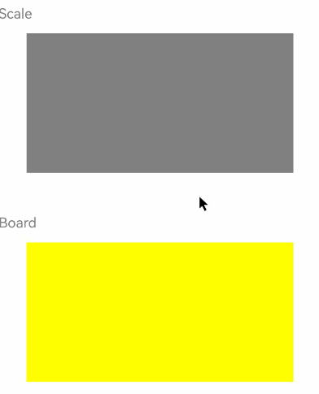

# 悬浮态效果
<!--Kit: ArkUI-->
<!--Subsystem: ArkUI-->
<!--Owner: @jiangtao92-->
<!--SE: @piggyguy-->
<!--TSE: @songyanhong-->

设置组件的鼠标悬浮态显示效果。

>  **说明：**
>
> 从API version 8开始支持。后续版本如有新增内容，则采用上角标单独标记该内容的起始版本。

## hoverEffect

hoverEffect(value: HoverEffect): T

设置组件的鼠标悬浮态显示效果。当未设置hoverEffect时，组件默认鼠标悬浮态效果为HoverEffect.Auto。

**原子化服务API：** 从API version 11开始，该接口支持在原子化服务中使用。

**系统能力：** SystemCapability.ArkUI.ArkUI.Full

**参数：**

| 参数名 | 类型                                             | 必填 | 说明                                                         |
| ------ | ------------------------------------------------ | ---- | ------------------------------------------------------------ |
| value  | [HoverEffect](ts-appendix-enums.md#hovereffect8) | 是   | 设置当前组件悬浮态下的悬浮效果。|

**返回值：**

| 类型 | 说明 |
| -------- | -------- |
| T | 返回当前组件。 |

## 示例

该示例通过hoverEffect设置组件的鼠标悬浮态显示效果。

```ts
// xxx.ets
@Entry
@Component
struct HoverExample {
  @State isHoverVal: boolean = false

  build() {
    Column({ space: 5 }) {
      Column({ space: 5 }) {
        Text('Scale').fontSize(20).fontColor(Color.Gray).width('90%').position({ x: 0, y: 80 })
        Column()
          .width('80%').height(200).backgroundColor(Color.Gray)
          .position({ x: 40, y: 120 })
          .hoverEffect(HoverEffect.Scale)
          .onHover((isHover?: boolean) => {
            console.info('Scale isHover: ' + isHover as string)
            this.isHoverVal = isHover as boolean
          })

        Text('Board').fontSize(20).fontColor(Color.Gray).width('90%').position({ x: 0, y: 380 })
        Column()
          .width('80%').height(200).backgroundColor(Color.Yellow)
          .hoverEffect(HoverEffect.Highlight)
          .position({ x: 40, y: 420 })
          .onHover((isHover?: boolean) => {
            console.info('Highlight isHover: ' +isHover as string)
            this.isHoverVal = isHover as boolean
          })
      }
      .hoverEffect(HoverEffect.None)
      .width('100%').height('100%').border({ width: 1 })
      .onHover((isHover?: boolean) => {
        console.info('HoverEffect.None')
        this.isHoverVal = isHover as boolean
      })
    }
  }
}
```

