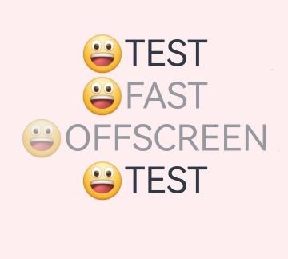

# 图像效果 (系统接口)

设置组件与下方画布已有内容进行混合的图像效果。

> **说明：**
>
> 本模块首批接口从API version 13开始支持。后续版本的新增接口，采用上角标单独标记接口的起始版本。
>
> 当前页面仅包含本模块的系统接口，其他公开接口参见[图像效果](ts-universal-attributes-image-effect.md)

## advancedBlendMode

advancedBlendMode(effect: BlendMode | Blender, type?: BlendApplyType): T

将当前组件的内容（包含子节点内容）与下方画布（可能为离屏画布）已有内容进行混合。不能与[blendMode](ts-universal-attributes-image-effect.md#blendmode11)接口一起使用。

**卡片能力：** 从API version 13开始，该接口支持在ArkTS卡片中使用。

**系统能力：** SystemCapability.ArkUI.ArkUI.Full

**系统接口：** 此接口为系统接口。

**参数：** 

| 参数名 | 类型                            | 必填 | 说明                                                         |
| ------ | ------------------------------- | ---- | ------------------------------------------------------------ |
| effect  | [BlendMode](ts-universal-attributes-image-effect.md#blendmode11枚举说明)&nbsp;\|&nbsp;[Blender](../../apis-arkgraphics2d/js-apis-uiEffect-sys.md#blender13)  | 是   | 入参类型为BlendMode时表示混合模式。<br/>默认值：BlendMode.NONE <br/>入参类型为Blender时表示混合器类型，用于描述混合效果。<br/>需要使用uiEffect模块中的方法创建Blender实例。例如：[uiEffect.createBrightnessBlender](../../apis-arkgraphics2d/js-apis-uiEffect-sys.md#uieffectcreatebrightnessblender)。使用自定义object作为入参不会生效。  |
| type   | [BlendApplyType](ts-universal-attributes-image-effect.md#blendapplytype11)  |    否    | blendMode实现方式是否离屏。<br/>默认值：BlendApplyType.FAST<br/>**说明：**<br/>1. 设置BlendApplyType.FAST时，不离屏。<br/>2. 设置BlendApplyType.OFFSCREEN时，会创建当前组件大小的离屏画布，再将当前组件（含子组件）的内容绘制到离屏画布上，再用指定的混合模式与下方画布已有内容进行混合。<br/>3. 不离屏情况下对文字类组件中emoji表情不生效。     |

## 示例

使用advancedBlendMode给组件添加提亮效果。

```ts
// xxx.ets
import { uiEffect } from "@kit.ArkGraphics2D"
// uiEffect.createBrightnessBlender创建BrightnessBlender实例用于给组件添加提亮效果
let blender: uiEffect.BrightnessBlender = uiEffect.createBrightnessBlender({
  cubicRate: 0.5,
  quadraticRate: 0.5,
  linearRate: 0.5,
  degree: 0.5,
  saturation: 0.5,
  positiveCoefficient: [2.3, 4.5, 2.0],
  negativeCoefficient: [0.5, 2.0, 0.5],
  fraction: 0.5
});
// 自定义object作为入参不会生效
let blender1: uiEffect.BrightnessBlender = {
  cubicRate: 0.5,
  quadraticRate: 0.5,
  linearRate: 0.5,
  degree: 0.5,
  saturation: 0.5,
  positiveCoefficient: [2.3, 4.5, 2.0],
  negativeCoefficient: [0.5, 2.0, 0.5],
  fraction: 0.5
};

@Entry
@Component
struct Index {
  build() {
    Stack() {
      Image($r('app.media.img_1'))

      Column() {
        Text(String.fromCodePoint(0x1F600) + 'TEST')
          .fontSize(60)

        Text(String.fromCodePoint(0x1F600) + 'FAST')
          .fontSize(60)
          .advancedBlendMode(blender)

        Text(String.fromCodePoint(0x1F600) + 'OFFSCREEN')
          .fontSize(60)
          .advancedBlendMode(blender, BlendApplyType.OFFSCREEN)

        Text(String.fromCodePoint(0x1F600) + 'TEST')
          .fontSize(60)
          .advancedBlendMode(blender1)
      }
    }
  }
}
```

效果图如下：

