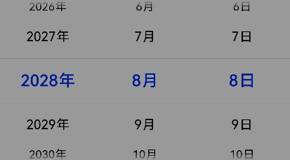
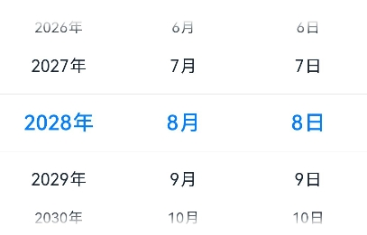

# 图像效果 (系统接口)

设置组件的模糊、阴影、球面效果以及设置图片的图像效果。

>  **说明：**
>
>  从API Version 7开始支持。后续版本如有新增内容，则采用上角标单独标记该内容的起始版本。
>
>  当前页面仅包含本模块的系统接口，其他公开接口参见[图像效果](ts-universal-attributes-image-effect.md)。


## sphericalEffect<sup>10+</sup>

sphericalEffect(value: number)

设置组件的图像球面化程度。

**系统能力：** SystemCapability.ArkUI.ArkUI.Full

**系统接口：** 此接口为系统接口

**参数：** 

| 参数名 | 类型   | 必填 | 说明                                                         |
| ------ | ------ | ---- | ------------------------------------------------------------ |
| value  | number | 是   | 设置组件的图像球面化程度。<br/>取值范围：[0,1]。<br/>**说明：**<br/>1. 如果value等于0则图像保持原样，如果value等于1则图像为完全球面化效果。在0和1之间，数值越大，则球面化程度越高。<br/>`value < 0 `或者` value > 1`为异常情况，`value < 0`按0处理，`value > 1`按1处理。<br/>2. 如果组件的图像使用异步加载，则不支持球面效果。例如Image组件默认使用异步加载，如果要使用球面效果，就要设置`syncLoad`为`true`，但是这种做法不推荐。`backgroundImage`也是使用异步加载，所以如果设置了`backgroundImage`，不支持球面效果。<br/>3. 如果组件设置了阴影，不支持球面效果。<br>4. 设置value大于0时，组件冻屏不更新并且把组件内容绘制到透明离屏buffer上，如果要更新组件属性则需要把value设置为0。 |

## lightUpEffect<sup>10+</sup> 

lightUpEffect(value: number)

设置组件图像亮起程度。

**系统能力：** SystemCapability.ArkUI.ArkUI.Full

**系统接口：** 此接口为系统接口

**参数：** 

| 参数名 | 类型   | 必填 | 说明                                                         |
| ------ | ------ | ---- | ------------------------------------------------------------ |
| value  | number | 是   | 设置组件图像亮起程度。<br/>取值范围：[0,1]。<br/>如果value等于0则图像为全黑，如果value等于1则图像为全亮效果。0到1之间数值越大，表示图像亮度越高。`value < 0` 或者 `value > 1`为异常情况，`value < 0`按0处理，`value > 1`按1处理。 |

## pixelStretchEffect<sup>10+</sup> 

pixelStretchEffect(options: PixelStretchEffectOptions)

设置组件的图像边缘像素扩展距离。

**系统能力：** SystemCapability.ArkUI.ArkUI.Full

**系统接口：** 此接口为系统接口

**参数：** 

| 参数名  | 类型                                                         | 必填 | 说明                                                         |
| ------- | ------------------------------------------------------------ | ---- | ------------------------------------------------------------ |
| options | [PixelStretchEffectOptions](ts-types.md#pixelstretcheffectoptions10) | 是   | 设置组件的图像边缘像素扩展距离。<br/>参数`options`包括上下左右四个方向的边缘像素扩展距离。<br/>**说明：**<br/>1. 如果距离为正值，表示向外扩展，放大原来图像大小。上下左右四个方向分别用边缘像素填充，填充的距离即为设置的边缘扩展的距离。<br/>2. 如果距离为负值，表示内缩，但是最终图像大小不变。<br/>内缩方式：<br/>图像根据`options`的设置缩小，缩小大小为四个方向边缘扩展距离的绝对值。<br/>图像用边缘像素扩展到原来大小。<br/>3. 对`options`的输入约束：<br/>上下左右四个方向的扩展统一为非正值或者非负值。即四个边同时向外扩或者内缩，方向一致。<br/>所有方向的输入均为百分比或者具体值，不支持百分比和具体值混用。<br/>所有异常情况下，显示为{0，0，0，0}效果，即跟原图保持一致。 |


## 示例

### 示例1

设置组件的图像球面效果。

```ts
// xxx.ets
@Entry
@Component
struct SphericalEffectExample {
  build() {
    Stack() {
      TextInput({ placeholder: "请输入变化范围百分比（[0%,100%]）"})
        .width('50%')
        .height(35)
        .type(InputType.Number)
        .enterKeyType(EnterKeyType.Done)
        .caretColor(Color.Red)
        .placeholderColor(Color.Blue)
        .placeholderFont({
          size: 20,
          style: FontStyle.Italic,
          weight: FontWeight.Bold
        })
        .sphericalEffect(0.5)
    }.alignContent(Alignment.Center).width("100%").height("100%")
  }
}

```

效果图如下：


去掉sphericalEffect的设置，效果如下：


### 示例2

设置组件的图像渐亮效果。

```ts
// xxx.ets
@Entry
@Component
struct LightUpExample {
  build() {
    Stack() {
      Text('This is the text content with letterSpacing 0.')
        .letterSpacing(0)
        .fontSize(12)
        .border({ width: 1 })
        .padding(10)
        .width('50%')
        .lightUpEffect(0.6)
    }.alignContent(Alignment.Center).width("100%").height("100%")
  }
}

```

效果图如下：


修改lightUpEffect参数值为0.2：


去掉lightUpEffect的设置，效果如下：


### 示例3

```ts
// xxx.ets
@Entry
@Component
struct LightUpExample {
  @State isLunar: boolean = false
  private selectedDate: Date = new Date('2028-08-08')
  build() {
    Stack() {
      DatePicker({
        start: new Date('1970-1-1'),
        end: new Date('2100-1-1'),
        selected: this.selectedDate
      })
        .lunar(this.isLunar)
        .onDateChange((value: Date) => {
          this.selectedDate = value
          console.info('select current date is: ' + value.toString())
        })
        .lightUpEffect(0.6)

    }.alignContent(Alignment.Center).width("100%").height("100%")
  }
}
```



去掉lightUpEffect的设置，效果如下：



### 示例4

设置组件的图像边缘像素扩展效果。

```ts
// xxx.ets
@Entry
@Component
struct PixelStretchExample {
  build() {
    Stack() {
      Text('This is the text content with letterSpacing 0.')
        .letterSpacing(0)
        .fontSize(12)
        .border({ width: 1 })
        .padding(10)
        .clip(false)
        .width('50%')
        .pixelStretchEffect({top:10,left:10,right:10,bottom:10 })
    }.alignContent(Alignment.Center).width("100%").height("100%")
  }
}

```

效果图如下：


去掉pixelStretchEffect的设置，原图效果如下：


### 示例5

基于示例4，现在把边缘扩展距离改为非正值。

```ts
// xxx.ets
@Entry
@Component
struct PixelStretchExample {
  build() {
    Stack() {
      Text('This is the text content with letterSpacing 0.')
        .letterSpacing(0)
        .fontSize(12)
        .border({ width: 1 })
        .padding(10)
        .width('50%')
        .pixelStretchEffect({top:-10,left:-10,right:-10,bottom:-10 })
    }.alignContent(Alignment.Center).width("100%").height("100%")
  }
}
```

效果图如下:


跟原图对比发现，效果图分两步实现：<br>1、原图大小缩小，缩小后的大小为原图大小减去像素
收缩的距离。例如，原图大小为`100*100`，设置了`pixelStretchEffect({top:-10,left:-10,
right:-10,bottom:-10 })`，则缩小后的大小为`(100-10-10)*(100-10-10)`，即`80*80`。<br>2、使用边缘像素扩展，将图像扩展为原图大小。
