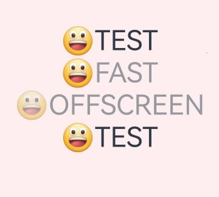

# 图像效果 (系统接口)
<!--Kit: ArkUI-->
<!--Subsystem: ArkUI-->
<!--Owner: @hehongyang3-->
<!--Designer: @zhanghaibo0-->
<!--Tester: @lxl007-->
<!--Adviser: @Brilliantry_Rui-->

本模块提供设置组件的模糊、阴影、球面效果以及设置图片的图像效果等相关接口。

> **说明：**
>
> - 本模块首批接口从API version 11开始支持。后续版本的新增接口，采用上角标单独标记接口的起始版本。
>
> - 本模块接口仅可在Stage模型下使用。
>
> - 当前页面仅包含本模块的系统接口，其他公开接口参见[图像效果](ts-universal-attributes-image-effect.md)。

## advancedBlendMode<sup>13+</sup>

advancedBlendMode(effect: BlendMode | Blender, type?: BlendApplyType): T

将当前组件的内容（包含子节点内容）与下方画布（可能为离屏画布）已有内容进行混合。不能与[blendMode](ts-universal-attributes-image-effect.md#blendmode11)接口同时使用，同时设置时仅advancedBlendMode效果生效。

**卡片能力：** 从API version 13开始，该接口支持在ArkTS卡片中使用。

**系统能力：** SystemCapability.ArkUI.ArkUI.Full

**系统接口：** 此接口为系统接口。

**参数：** 

| 参数名 | 类型                            | 必填 | 说明                                                         |
| ------ | ------------------------------- | ---- | ------------------------------------------------------------ |
| effect  | [BlendMode](ts-universal-attributes-image-effect.md#blendmode11枚举说明)&nbsp;\|&nbsp;[Blender](../../apis-arkgraphics2d/js-apis-uiEffect-sys.md#blender13)  | 是   | 入参类型为BlendMode时表示混合模式，默认不进行混合操作。默认值：BlendMode.NONE，即不应用特殊混合效果，组件内容按默认方式绘制。<br>入参类型为Blender时表示混合器类型，用于描述混合效果。<br>需要使用uiEffect模块中的方法创建Blender实例。例如：[uiEffect.createBrightnessBlender](../../apis-arkgraphics2d/js-apis-uiEffect-sys.md#uieffectcreatebrightnessblender)。使用自定义object作为入参不会生效。  |
| type   | [BlendApplyType](ts-universal-attributes-image-effect-sys.md#blendapplytype枚举说明)  |    否    | 混合效果blendMode实现方式是否离屏。<br>默认值：BlendApplyType.FAST<br>**说明：**<br>1. 设置为BlendApplyType.FAST，不离屏。<br>2. 设置为BlendApplyType.OFFSCREEN，会创建当前组件大小的离屏画布，再将当前组件（含子组件）的内容绘制到离屏画布上，再用指定的混合效果（BlendMode或Blender）与下方画布已有内容进行混合。<br>3. 不离屏情况下对文字类组件中emoji表情不生效。<br>4. 相比BlendApplyType.OFFSCREEN，设置为BlendApplyType.OFFSCREEN_WITH_BACKGROUND，系统在创建与当前组件大小一致的离屏画布时，会先复制一份带有背景的画布作为初始化底色（BlendApplyType.OFFSCREEN类型的画布初始为透明背景），随后在此基础上进行混合操作。两者在其他功能特性上保持一致。     |

**返回值：**

| 类型 | 说明 |
| -------- | -------- |
| T | 返回当前组件，用于链式调用。 |

## BlendApplyType枚举说明

标识如何将指定的混合模式应用于视图的内容。

**卡片能力：** 从API version 11开始，该接口支持在ArkTS卡片中使用。

**系统能力：** SystemCapability.ArkUI.ArkUI.Full

| 名称           | 值   | 说明                                                             |
| ---------------| ------ | ---------------------------------------------------------------- |
| OFFSCREEN_WITH_BACKGROUND<sup>23+</sup> | 2 |创建离屏画布时，先拷贝一份带有背景的画布作为初始化底色（BlendApplyType.OFFSCREEN类型的画布初始为透明背景），再将此组件和子组件内容绘制到离屏画布上，然后整体进行混合。两者在其他功能特性上与BlendApplyType.OFFSCREEN保持一致。 <br> **系统接口：** 此接口为系统接口。 |

## excludeFromRenderGroup<sup>22+</sup>

excludeFromRenderGroup(exclude: boolean \| undefined): T

设置当前组件和其子组件是否从祖先组件的节点组中剔除。需搭配祖先组件设置节点组[renderGroup](./ts-universal-attributes-image-effect.md#rendergroup18)属性使用，单独使用无效果。

从节点组剔除后，当前组件和子组件不再影响祖先组件的离屏画布，不会引起节点组的缓存失效，从而达到复用节点组缓存的目的。如果当前组件的显示区域只占节点组绘制内容显示区域的一部分，且当前组件及子组件的显示效果频繁更新，设置excludeFromRenderGroup属性有助于绘制性能优化。

不设置该属性时，默认当前组件和其子组件不从祖先组件的节点组中剔除。

> **说明：**
>
> 设置excludeFromRenderGroup为true的组件及其子组件的绘制内容不能超过该组件本身的边界范围，否则会出现显示内容被裁剪的问题。例如当子组件通过[translate](./ts-universal-attributes-transformation.md#translate)或[scale](./ts-universal-attributes-transformation.md#scale)等属性导致子组件超出当前组件范围，或当前组件上有[shadow](./ts-universal-attributes-image-effect.md#shadow)、[pixelStretchEffect](./ts-universal-attributes-image-effect.md#pixelstretcheffect12)等属性导致当前组件的绘制内容超出组件边界时，可能出现显示内容被裁剪的问题。此类场景不应设置excludeFromRenderGroup属性为true。

**模型约束：** 此接口仅可在Stage模型下使用。

**系统能力：** SystemCapability.ArkUI.ArkUI.Full

**系统接口：** 此接口为系统接口。

**参数：** 

| 参数名  | 类型               | 必填 | 说明                                                         |
| ------- | ------------------ | ---- | ------------------------------------------------------------ |
| exclude | boolean \| undefined | 是   | 设置当前组件及其子组件是否从祖先组件的节点组中剔除。<br>true表示当前组件及其子组件从祖先组件的节点组中剔除，不属于祖先组件的节点组；false表示当前组件及其子组件归属于祖先组件的节点组。<br>当exclude的值为undefined时，按false处理。<br>**说明：**<br>需搭配祖先组件设置节点组renderGroup属性使用，单独使用无效果。 |

**返回值：**

| 类型 | 说明 |
| -------- | -------- |
| T | 返回当前组件，用于链式调用。 |

## systemMaterial<sup>23+</sup>

systemMaterial(material: SystemUiMaterial | undefined): T

设置组件的系统材质。不同系统材质对应不同的属性影响效果，该接口影响背景色[backgroundColor](ts-universal-attributes-background.md#backgroundcolor)、边框颜色[borderColor](ts-universal-attributes-border.md#bordercolor)、边框宽度[borderWidth](ts-universal-attributes-border.md#borderwidth)、阴影[shadow](ts-universal-attributes-image-effect.md#shadow)，不建议与上述接口一起使用，同时使用时systemMaterial的效果可能与上述接口的设置产生冲突，导致渲染结果不符合预期。使用示例请参考[设置系统材质](../arkts-apis-uimaterial-sys.md#示例1设置系统材质)。

**模型约束：** 此接口仅可在Stage模型下使用。

**卡片能力：** 从API version 23开始，该接口支持在ArkTS卡片中使用。

**原子化服务API：** 从API version 23开始，该接口支持在原子化服务中使用。

**系统能力：** SystemCapability.ArkUI.ArkUI.Full

**系统接口：** 此接口为系统接口。

**参数：**

| 参数名 | 类型                            | 必填 | 说明                                                         |
| ------ | ------------------------------- | ---- | ------------------------------------------------------------ |
| material  | [SystemUiMaterial](#systemuimaterial23) &nbsp;\|&nbsp; undefined  | 是   | 组件的系统材质对象。设置为undefined时恢复为无材质的效果。<br>**说明：**<br>不建议与backgroundColor、borderColor、borderWidth、shadow等接口一起使用，否则可能导致显示效果冲突。  |

**返回值：**

| 类型 | 说明 |
| -------- | -------- |
| T | 返回当前组件，用于链式调用。 |

## SystemUiMaterial<sup>23+</sup>

type SystemUiMaterial = import('../api/@ohos.arkui.uiMaterial').default.Material

系统材质对象基类。

**模型约束：** 此接口仅可在Stage模型下使用。

**卡片能力：** 从API version 23开始，该接口支持在ArkTS卡片中使用。

**原子化服务API：** 从API version 23开始，该接口支持在原子化服务中使用。

**系统能力：** SystemCapability.ArkUI.ArkUI.Full

**系统接口：** 此接口为系统接口。

| 类型                              | 说明           |
| --------------------------------- | -------------- |
| import('../api/@ohos.arkui.uiMaterial').default.[Material](../arkts-apis-uimaterial-sys.md#material)     | 系统材质对象基类。 |

## edgeLight
   
edgeLight(params: EdgeLightParams | undefined): T

为组件添加边缘流光效果。边缘流光效果会在组件的边缘创建发光效果，从指定位置开始并沿边缘延伸，此效果可以增强组件的视觉吸引力并突出显示重要组件。

> **说明：**
>
> - 仅设置edgeLight不会产生边缘流光效果，需结合[animateTo](../arkts-apis-uicontext-uicontext.md#animateto)更改position参数达到流光效果。可参考[示例4（设置组件边缘流光效果）](#示例4设置组件边缘流光效果)。
>
> - 当position参数以对角线方式变更时（如从TOP_LEFT变更到BOTTOM_RIGHT），边缘流光将沿倾斜角45°的方式运行。

**起始版本：** 26.0.0

**模型约束：** 此接口仅可在Stage模型下使用。

**系统能力：** SystemCapability.ArkUI.ArkUI.Full

**系统接口：** 此接口为系统接口。

**参数：**

| 参数名 | 类型                                                         | 必填 | 说明                                                         |
| ------ | ------------------------------------------------------------ | ---- | ------------------------------------------------------------ |
| params | [EdgeLightParams](#edgelightparams) \| undefined | 是   | 定义边缘流光效果的位置、长度、强度、颜色和厚度。<br>当params的值为undefined时，移除边缘流光效果。 |

**返回值：**

| 类型 | 说明                     |
| ---- | ------------------------ |
| T    | 返回当前组件，用于链式调用。 |

## EdgeLightParams

定义边缘流光效果参数。

**起始版本：** 26.0.0

**模型约束：** 此接口仅可在Stage模型下使用。

**系统能力：** SystemCapability.ArkUI.ArkUI.Full

**系统接口：** 此接口为系统接口。

| 名称     | 类型                                                       | 只读 | 可选 | 说明                                                    |
| -------- | --------------------------------------------------------- | ---- | ---- |------------------------------------------------------- |
| position | [EdgeLightPosition](./ts-appendix-enums-sys.md#edgelightposition枚举说明)          | 否   | 否   | 边缘流光位置。                                           |
| length   | [Length](ts-types.md#length)                              | 否   | 否   | 沿流动方向的边缘流光的投影长度（不支持百分比，传入百分比时不生效）。<br>取值范围：[0, +∞)<br>单位：vp<br>**说明：**<br>length为0时，无边缘流光投影效果。<br>设置小于0的值时，按值为0处理。 |
| intensity | number                                                   | 否   | 是   | 边缘流光效果的发光强度。<br>取值范围：[0, 1]<br>默认值：1<br>**说明：**<br>值为0时，流光效果完全不可见。<br>值为1时，流光效果达到最大亮度。<br>设置大于1的值时，按值为1处理。<br>设置小于0的值时，按值为0处理。 |
| color    | [ResourceColor](ts-types.md#resourcecolor)                | 否   | 是   | 边缘流光颜色。<br>默认值：#FFFFFF，显示为白色。 |
| thickness | [Length](ts-types.md#length)                             | 否   | 是   | 边缘流光线条粗细（不支持百分比，传入百分比时不生效）。<br>取值范围：[0, +∞)<br>单位：vp<br>默认值：0<br>**说明：**<br>thickness为0时，边缘流光线条不可见。<br>设置小于0的值时，按值为0处理。 |

## 示例
### 示例1（设置组件提亮）

该示例主要通过advancedBlendMode给组件添加提亮效果。

```ts
// xxx.ets
import { uiEffect } from '@kit.ArkGraphics2D';

// uiEffect.createBrightnessBlender创建BrightnessBlender实例用于给组件添加提亮效果
let blender: uiEffect.BrightnessBlender = uiEffect.createBrightnessBlender({
  cubicRate: 0.5,
  quadraticRate: 0.5,
  linearRate: 0.5,
  degree: 0.5,
  saturation: 0.5,
  positiveCoefficient: [2.3, 4.5, 2.0],
  negativeCoefficient: [0.5, 2.0, 0.5],
  fraction: 0.5
});
// 注意：使用自定义object作为Blender入参不会生效，请使用uiEffect.createBrightnessBlender方法创建Blender实例。
let customBlender: uiEffect.BrightnessBlender = {
  cubicRate: 0.5,
  quadraticRate: 0.5,
  linearRate: 0.5,
  degree: 0.5,
  saturation: 0.5,
  positiveCoefficient: [2.3, 4.5, 2.0],
  negativeCoefficient: [0.5, 2.0, 0.5],
  fraction: 0.5
};

@Entry
@Component
struct Index {
  build() {
    Stack() {
      Image($r('app.media.img_1'))

      Column() {
        Text(String.fromCodePoint(0x1F600) + 'TEST')
          .fontSize(60)

        Text(String.fromCodePoint(0x1F600) + 'FAST')
          .fontSize(60)
          .advancedBlendMode(blender)

        Text(String.fromCodePoint(0x1F600) + 'OFFSCREEN')
          .fontSize(60)
          .advancedBlendMode(blender, BlendApplyType.OFFSCREEN)

        Text(String.fromCodePoint(0x1F600) + 'TEST')
          .fontSize(60)
          .advancedBlendMode(customBlender)
      }
    }
  }
}
```

效果图如下：



### 示例2（设置节点组剔除属性）

该示例演示在组件的属性动画场景下，如何通过使用节点组剔除属性[excludeFromRenderGroup](#excludefromrendergroup22)，避免节点组缓存反复失效。

从API version 22开始，新增[excludeFromRenderGroup](#excludefromrendergroup22)属性。

``` ts
// xxx.ets
@Entry
@Component
struct ExcludeFromRenderGroupDemo {
  readonly color1: ResourceColor = '#2787d9';
  readonly color2: ResourceColor = '#ffc000';
  @State myColor: ResourceColor = this.color1;
  @State isExcluded: boolean = false;
  animationCnt: number = 0;

  build() {
    Column() {
      Column({ space: 10 }) {
        Column()
          .width(100)
          .height(100)
          .backgroundColor(this.myColor)
          // 设置excludeFromRenderGroup属性。该组件做背景色动画时，实际显示效果需频繁更新属性，且该组件区域只占节点组区域的一部分，因此设置excludeFromRenderGroup属性以复用节点组缓存
          .excludeFromRenderGroup(this.isExcluded)
          .onClick(() => {
            this.isExcluded = true; // 在播放动画前，修改节点组剔除属性为true
            this.animationCnt++;
            this.getUIContext().animateTo({
              duration: 600,
              onFinish: () => {
                this.animationCnt--;
                if (this.animationCnt === 0) { // animationCnt变为0表示所有动画都结束
                  this.isExcluded = false; // 在组件动画结束后，组件上不再发生属性变化时，可以重置节点组剔除属性
                }
              }
            }, () => {
              this.myColor = (this.myColor === this.color1) ? this.color2 : this.color1;
            })
          })
        // 节点组内的其他组件
        Image($r('app.media.bg1')) // $r('app.media.bg1')需要替换为开发者所需的图像资源文件
          .width(100)
          .height(100)
        Image($r('app.media.bg1')) // $r('app.media.bg1')需要替换为开发者所需的图像资源文件
          .width(100)
          .height(100)
      }.renderGroup(true)
      .width('100%')
      .height('70%')
    }
    .height('100%')
    .width('100%')
  }
}
```


### 示例3（设置组件提亮并渐隐）

从API version 23开始，该示例主要演示如何通过advancedBlendMode给组件同时添加提亮和渐隐效果。

```ts
// xxx.ets
import { uiEffect } from '@kit.ArkGraphics2D';

// uiEffect.createBrightnessBlender创建BrightnessBlender实例用于给组件添加提亮效果
let blender: uiEffect.BrightnessBlender = uiEffect.createBrightnessBlender({
  cubicRate: 0.5,
  quadraticRate: 0.5,
  linearRate: 0.5,
  degree: 0.5,
  saturation: 0.5,
  positiveCoefficient: [2.3, 4.5, 2.0],
  negativeCoefficient: [0.5, 2.0, 0.5],
  fraction: 0.3
});

@Entry
@Component
struct Index {
  build() {
    Column() {
      Stack() {
        Column() {
          Text(String.fromCodePoint(0x1F600) + ' BlendApplyType OFFSCREEN WITH BACKGROUND ' +
          String.fromCodePoint(0x1F600))
            .fontSize(35)
            .fontColor(Color.Black)
        }
        .advancedBlendMode(blender, BlendApplyType.FAST)

        Column()
          .width('100%')
          .height('100%')
          .linearGradient({
            direction: GradientDirection.Right,
            colors: [
              [Color.Transparent, 0.0],
              [Color.Black, 0.50],
              [Color.Black, 0.55],
              [Color.Transparent, 1.0]
            ]
          })
          .blendMode(BlendMode.DST_IN, BlendApplyType.FAST)
      }
      .advancedBlendMode(BlendMode.SRC_OVER, BlendApplyType.OFFSCREEN_WITH_BACKGROUND)
      .width('100%')
      .height('20%')
    }
    .backgroundColor('rgb(254, 238, 239)')
    .width('100%')
    .height('100%')
  }
}
```


### 示例4（设置组件边缘流光效果）

该示例主要演示如何通过[edgeLight](#edgelight)给组件添加边缘流光效果。

从API版本26.0.0开始，新增edgeLight方法。

```ts
// xxx.ets
import { curves } from '@kit.ArkUI';
@Entry
@Component
struct Index {
  @State animate: boolean = false;
  @State edgeLightPosition: EdgeLightPosition = EdgeLightPosition.TOP_LEFT;
  build() {
    Column() {
      Column()
        .height(300)
        .width(300)
        .backgroundColor(Color.Gray)
        .borderRadius(20)
        .edgeLight({
          position: this.edgeLightPosition,
          length: 90,
          intensity: 1,
          color: Color.White,
          thickness: 2
        })
        .onClick(() => {
          this.getUIContext()?.animateTo({ curve: curves.springMotion(), duration: 3000}, () => {
            this.animate = !this.animate;
            this.edgeLightPosition = this.animate ? EdgeLightPosition.BOTTOM_RIGHT : EdgeLightPosition.TOP_LEFT;
          })
        })
    }
    .height('100%')
    .width('100%')
    .justifyContent(FlexAlign.Center)
    .alignItems(HorizontalAlign.Center)
    .backgroundColor('#aaaaaa')
  }
}
```


