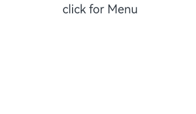
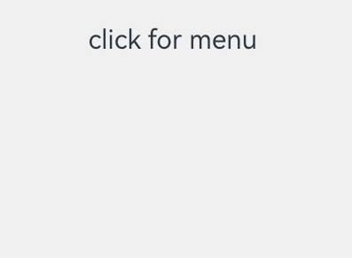
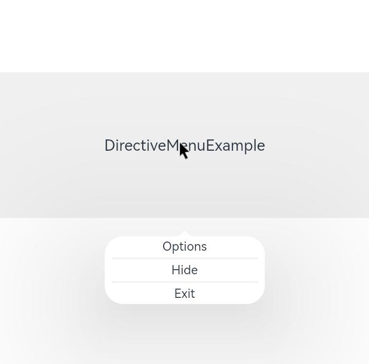
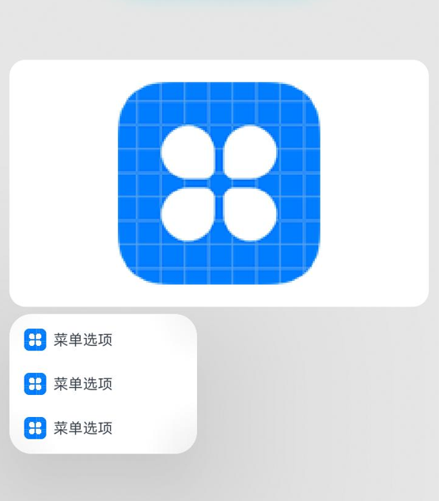
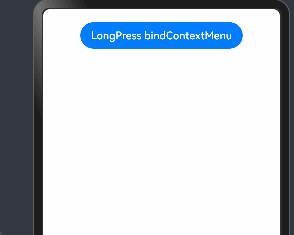

# 菜单控制

为组件绑定弹出式菜单，弹出式菜单以垂直列表形式显示菜单项，可通过长按、点击或鼠标右键触发。

>  **说明：**
>
>  - 从API Version 7开始支持。后续版本如有新增内容，则采用上角标单独标记该内容的起始版本。
>
>  - CustomBuilder里不支持再使用bindMenu、bindContextMenu弹出菜单。多级菜单可使用[Menu组件](ts-basic-components-menu.md)。
>
>  - 弹出菜单的文本内容不支持长按选中。
>
>  - 当窗口大小发生变化时，菜单自动隐藏。
>
>  - 动效曲线使用弹簧曲线，在动效退出时，由于弹簧曲线的回弹震荡，菜单消失后有较长的拖尾，使得其他事件无法响应。
>
>  - 若组件是可拖动节点，绑定bindContextMenu未指定preview时，菜单弹出会浮起拖拽预览图且菜单选项和预览图不会发生避让。对此，开发者可根据使用场景设置preview或者将目标节点设置成不可拖动节点。
>
>  - 从API Version 12开始，菜单支持长按500ms弹出子菜单，支持按压态跟随手指移动。
>
>    1. 仅支持使用[Menu组件](ts-basic-components-menu.md)且子组件包含[MenuItem](ts-basic-components-menuitem.md)或[MenuItemGroup](ts-basic-components-menuitemgroup.md)的场景。
>
>    2. 仅支持[MenuPreviewMode](#menupreviewmode11)为NONE的菜单。


## bindMenu

bindMenu(content: Array<MenuElement&gt; | CustomBuilder, options?: MenuOptions)

给组件绑定菜单，点击后弹出菜单。弹出菜单项支持图标+文本排列和自定义两种功能。

**原子化服务API：** 从API version 11开始，该接口支持在原子化服务中使用。

**系统能力：** SystemCapability.ArkUI.ArkUI.Full

**参数：**

| 参数名  | 类型                                                         | 必填 | 说明                                         |
| ------- | ------------------------------------------------------------ | ---- | -------------------------------------------- |
| content | Array<[MenuElement](#menuelement)&gt;&nbsp;\|&nbsp;[CustomBuilder](ts-types.md#custombuilder8) | 是   | 配置菜单项图标和文本的数组，或者自定义组件。 |
| options | [MenuOptions](#menuoptions10)                                | 否   | 配置弹出菜单的参数。                         |

## bindMenu<sup>11+</sup>

bindMenu(isShow: boolean, content: Array<MenuElement&gt; | CustomBuilder, options?: MenuOptions)

给组件绑定菜单，点击后弹出菜单。弹出菜单项支持图标+文本排列和自定义两种功能。

**原子化服务API：** 从API version 12开始，该接口支持在原子化服务中使用。

**系统能力：** SystemCapability.ArkUI.ArkUI.Full

**参数：**

| 参数名               | 类型                                                         | 必填 | 说明                                                         |
| -------------------- | ------------------------------------------------------------ | ---- | ------------------------------------------------------------ |
| isShow<sup>11+</sup> | boolean                                                      | 是   | 支持开发者通过状态变量控制显隐，默认值为false，menu弹窗必须等待页面全部构建才能展示，因此不能在页面构建中设置为true，否则会导致显示位置及形状错误，该参数支持[!!语法](../../../quick-start/arkts-new-binding.md#组件参数双向绑定)双向绑定变量。 |
| content              | Array<[MenuElement](#menuelement)&gt;&nbsp;\|&nbsp;[CustomBuilder](ts-types.md#custombuilder8) | 是   | 配置菜单项图标和文本的数组，或者自定义组件。                 |
| options              | [MenuOptions](#menuoptions10)                                | 否   | 配置弹出菜单的参数。                                         |

## bindContextMenu<sup>8+</sup>

bindContextMenu(content: CustomBuilder, responseType: ResponseType, options?: ContextMenuOptions)

给组件绑定菜单，触发方式为长按或者右键点击，弹出菜单项需要自定义。

**原子化服务API：** 从API version 11开始，该接口支持在原子化服务中使用。

**系统能力：** SystemCapability.ArkUI.ArkUI.Full

**参数：**

| 参数名       | 类型                                               | 必填 | 说明                             |
| ------------ | -------------------------------------------------- | ---- | -------------------------------- |
| content      | [CustomBuilder](ts-types.md#custombuilder8)        | 是   | 自定义菜单内容构造器。           |
| responseType | [ResponseType](ts-appendix-enums.md#responsetype8) | 是   | 菜单弹出条件，长按或者右键点击。不支持鼠标长按。 |
| options      | [ContextMenuOptions](#contextmenuoptions10)        | 否   | 配置弹出菜单的参数。             |

## bindContextMenu<sup>12+</sup>

bindContextMenu(isShown: boolean, content: CustomBuilder, options?: ContextMenuOptions)

给组件绑定菜单，触发方式为控制绑定的isShown。

isShown为true，弹出菜单。isShown为false，隐藏菜单。弹出菜单项需要自定义。

菜单弹出不跟随点击位置，只与placement设置有关。


**系统能力：** SystemCapability.ArkUI.ArkUI.Full

**原子化服务API：** 从API version 11开始，该接口支持在原子化服务中使用。

**参数：**

| 参数名       | 类型                                               | 必填 | 说明                                         |
| ------------ | -------------------------------------------------- | ---- | -------------------------------------------- |
| isShown | boolean | 是   | 支持开发者通过状态变量控制显隐，默认值为false。menu需要在页面全部构建完成后才能弹窗展示，如果在页面构建前或构建中设置为true，可能导致显示位置及形状错误、无法正常弹出显示等问题。不支持长按触发拖拽。该参数支持[!!语法](../../../quick-start/arkts-new-binding.md#组件参数双向绑定)双向绑定变量。 |
| content      | [CustomBuilder](ts-types.md#custombuilder8)        | 是   | 自定义菜单内容构造器。 |
| options      | [ContextMenuOptions](#contextmenuoptions10)                      | 否   | 配置弹出菜单的参数。                         |

## MenuElement

| 名称                  | 类型                                   | 必填 | 描述                                                         |
| --------------------- | -------------------------------------- | ---- | ------------------------------------------------------------ |
| value                 | [ResourceStr](ts-types.md#resourcestr) | 是   | 菜单项文本。<br/>**原子化服务API：** 从API version 11开始，该接口支持在原子化服务中使用。                                                 |
| icon<sup>10+</sup>    | [ResourceStr](ts-types.md#resourcestr) | 否   | 菜单项图标。<br/>**原子化服务API：** 从API version 11开始，该接口支持在原子化服务中使用。                                                 |
| enabled<sup>11+</sup> | boolean                                | 否   | 菜单条目是否可进行交互。<br/>默认值：true, 菜单条目可以进行交互。<br/>**原子化服务API：** 从API version 12开始，该接口支持在原子化服务中使用。 |
| action                | ()&nbsp;=&gt;&nbsp;void                | 是   | 点击菜单项的事件回调。<br/>**原子化服务API：** 从API version 11开始，该接口支持在原子化服务中使用。                                       |
| symbolIcon<sup>12+</sup>                | [SymbolGlyphModifier](ts-universal-attributes-attribute-modifier.md)                | 否   | 设置菜单项图标。通过Modifier配置菜单项图标，配置该项时，原icon图标不显示。<br/>**原子化服务API：** 从API version 12开始，该接口支持在原子化服务中使用。                                       |

## MenuOptions<sup>10+</sup>

继承自[ContextMenuOptions](#contextmenuoptions10)。

| 名称                          | 类型                                   | 必填 | 描述                                                         |
| ----------------------------- | -------------------------------------- | ---- | ------------------------------------------------------------ |
| title                         | [ResourceStr](ts-types.md#resourcestr) | 否   | 菜单标题。<br>**说明：**<br/>仅在content设置为Array<[MenuElement](#menuelement)&gt; 时生效。<br>**原子化服务API：** 从API version 11开始，该接口支持在原子化服务中使用。 |
| showInSubWindow<sup>11+</sup> | boolean                                | 否   | 是否在子窗口显示菜单。<br/>默认值：2in1设备为true，其他设备为false。<br>**原子化服务API：** 从API version 12开始，该接口支持在原子化服务中使用。                     |

## ContextMenuOptions<sup>10+</sup>

| 名称                  | 类型                                                         | 必填 | 描述                                                         |
| --------------------- | ------------------------------------------------------------ | ---- | ------------------------------------------------------------ |
| offset                | [Position](ts-types.md#position)                            | 否   | 菜单弹出位置的偏移量，不会导致菜单显示超出屏幕范围。<br/>默认值：{ x: 0, y: 0 }<br/>**说明：** <br />菜单类型为相对⽗组件区域弹出时，⾃动根据菜单位置属性 (placement)将区域的宽或⾼计⼊偏移量中。<br/>当菜单相对父组件出现在上侧时（placement设置为Placement.TopLeft，Placement.Top，Placement.TopRight），x为正值，菜单相对组件向右进行偏移，y为正值，菜单相对组件向上进行偏移。<br/>当菜单相对父组件出现在下侧时（placement设置为Placement.BottomLeft，Placement.Bottom，Placement.BottomRight），x为正值，菜单相对组件向右进行偏移，y为正值，菜单相对组件向下进行偏移。<br/>当菜单相对父组件出现在左侧时（placement设置为Placement.LeftTop，Placement.Left，Placement.LeftBottom），x为正值，菜单相对组件向左进行偏移，y为正值，菜单相对组件向下进行偏移。<br/>当菜单相对父组件出现在右侧时（placement设置为Placement.RightTop，Placement.Right，Placement.RightBottom），x为正值，菜单相对组件向右进行偏移，y为正值，菜单相对组件向下进行偏移。<br/>如果菜单调整了显示位置（与placement初始值主方向不⼀致），则偏移值 (offset) 失效。<br />**原子化服务API：** 从API version 11开始，该接口支持在原子化服务中使用。 |
| placement             | [Placement](ts-appendix-enums.md#placement8)                 | 否   | 菜单组件优先显示的位置，当前位置显示不下时，会自动调整位置。<br/>**说明：**<br />placement值设置为undefined、null或没有设置此选项时，按未设置placement处理，当使用[bindMenu](#bindmenu11)，按默认值：Placement.BottomLeft设置，当使用[bindContextMenu<sup>8+</sup>](#bindcontextmenu8)，菜单跟随点击位置弹出；当使用[bindContextMenu<sup>12+</sup>](#bindcontextmenu12)，按默认值：Placement.BottomLeft设置。<br />**原子化服务API：** 从API version 11开始，该接口支持在原子化服务中使用。 |
| enableArrow           | boolean                                                      | 否   | 是否显示箭头。如果菜单的大小和位置不足以放置箭头时，不会显示箭头。 <br/>默认值：false, 不显示箭头。<br/>**说明：**<br />enableArrow为true时，placement未设置或者值为非法值，默认在目标物上方显示，否则按照placement的位置优先显示。当前位置显示不下时，会自动调整位置，enableArrow为undefined时，不显示箭头。bindContextMenu从API version 10开始支持该属性；bindMenu从API version 12开始支持该属性。<br />**原子化服务API：** 从API version 11开始，该接口支持在原子化服务中使用。 |
| enableHoverMode<sup>13+</sup>      | boolean                                                      | 否   | 菜单组件是否响应悬停态变化。如果菜单的点击位置在悬停态折痕区域，菜单组件不会响应悬停态。 <br/>默认值：false, 菜单组件不响应悬停态变化。<br/>**说明：**<br />enableHoverMode为false、未设置或者值为非法值时，菜单组件不会响应悬停态，enableHoverMode为true时，响应悬停态。<br />**原子化服务API：** 从API version 13开始，该接口支持在原子化服务中使用。 |
| arrowOffset           | [Length](ts-types.md#length)                                 | 否   | 箭头在菜单处的偏移。偏移量必须合法且转换为具体数值时大于0才会生效，另外该值生效时不会导致箭头超出菜单四周的安全距离。<br/>默认值：0<br />单位：vp<br />**说明：**<br />箭头距菜单四周的安全距离为菜单圆角大小与箭头宽度的一半之和。<br />根据配置的placement来计算是在水平还是垂直方向上偏移。<br />箭头在菜单水平方向时，偏移量为箭头至最左侧箭头安全距离处的距离。箭头在菜单垂直方向时，偏移量为箭头至最上侧箭头安全距离处的距离。<br />根据配置的placement的不同，箭头展示的默认位置不同：<br />在菜单不发生避让的情况下，placement设置为Placement.Top、Placement.Bottom时，箭头显示在水平方向且默认居中；<br />placement设置为Placement.Left、Placement.Right时，箭头显示在垂直方向且默认居中；<br />placement设置为Placement.TopLeft、Placement.BottomLeft时，箭头默认显示在水平方向，且距离菜单左侧边缘距离为箭头安全距离；<br />placement设置为Placement.TopRight、Placement.BottomRight时，箭头默认显示在水平方向，且距离菜单右侧距离为箭头安全距离；<br />placement设置为Placement.LeftTop、Placement.RightTop时，箭头默认显示在垂直方向，且距离菜单上侧距离为箭头安全距离；<br />placement设置为Placement.LeftBottom、Placement.RightBottom时，箭头默认显示在垂直方向，且距离菜单下侧距离为箭头安全距离；<br />  bindContextMenu从API version 10开始支持该属性；bindMenu从API version 12开始支持该属性。<br />**原子化服务API：** 从API version 11开始，该接口支持在原子化服务中使用。 |
| preview<sup>11+</sup> | [MenuPreviewMode](#menupreviewmode11)\|&nbsp;[CustomBuilder](ts-types.md#custombuilder8) | 否   | 长按悬浮菜单或使用[bindContextMenu<sup>12+</sup>](#bindcontextmenu12)显示菜单的预览内容样式，可以为目标组件的截图，也可以为用户自定义的内容。<br/>默认值：MenuPreviewMode.NONE, 无预览内容。<br/>**说明：**<br />- 不支持responseType为ResponseType.RightClick时触发，如果responseType为ResponseType.RightClick，则不会显示预览内容。<br />- 当未设置preview参数或preview参数设置为MenuPreviewMode.NONE时，enableArrow参数生效。<br />- 当preview参数设置为MenuPreviewMode.IMAGE或CustomBuilder时，enableArrow为true时也不显示箭头。<br />**原子化服务API：** 从API version 12开始，该接口支持在原子化服务中使用。 |
| previewAnimationOptions<sup>11+</sup> | [ContextMenuAnimationOptions](#contextmenuanimationoptions11) | 否    | 控制长按预览显示动画开始倍率和结束倍率（相对预览原图比例）。<br/>默认值：{ scale: [0.95, 1.1], transition: undefined, hoverScale: undefined }。<br/>**说明：**<br />倍率设置参数小于等于0时，不生效。<br/>**原子化服务API：** 从API version 12开始，该接口支持在原子化服务中使用。 |
| onAppear              | ()&nbsp;=&gt;&nbsp;void                                      | 否   | 菜单弹出时的事件回调。<br />**原子化服务API：** 从API version 11开始，该接口支持在原子化服务中使用。                                       |
| onDisappear           | ()&nbsp;=&gt;&nbsp;void                                      | 否   | 菜单消失时的事件回调。<br />**原子化服务API：** 从API version 11开始，该接口支持在原子化服务中使用。                                       |
| aboutToAppear              | ()&nbsp;=&gt;&nbsp;void                                      | 否   | 菜单显示动效前的事件回调。<br/>**原子化服务API：** 从API version 12开始，该接口支持在原子化服务中使用。                                       |
| aboutToDisappear           | ()&nbsp;=&gt;&nbsp;void                                      | 否   | 菜单退出动效前的事件回调。<br/>**原子化服务API：** 从API version 12开始，该接口支持在原子化服务中使用。                                       |
| backgroundColor<sup>11+</sup> | [ResourceColor](ts-types.md#resourcecolor)  | 否 | 弹窗背板颜色。<br/>默认值：Color.Transparent。<br/>**原子化服务API：** 从API version 12开始，该接口支持在原子化服务中使用。 |
| backgroundBlurStyle<sup>11+</sup> | [BlurStyle](ts-universal-attributes-background.md#blurstyle9) | 否 | 弹窗背板模糊材质。<br/>默认值：BlurStyle.COMPONENT_ULTRA_THICK。<br/>**原子化服务API：** 从API version 12开始，该接口支持在原子化服务中使用。 |
| transition<sup>12+</sup> | [TransitionEffect](ts-transition-animation-component.md#transitioneffect10对象说明) | 否   | 设置菜单显示和退出的过渡效果。<br/>**说明：**<br />菜单退出动效过程中，进行横竖屏切换，菜单会避让。二级菜单不继承自定义动效。弹出过程可以点击二级菜单，退出动效执行过程不允许点击二级菜单。<br />详细描述见[TransitionEffect](ts-transition-animation-component.md#transitioneffect10对象说明)对象说明。 <br/>**原子化服务API：** 从API version 12开始，该接口支持在原子化服务中使用。|
| borderRadius<sup>12+</sup>  | [Length](ts-types.md#length)&nbsp;\|&nbsp;[BorderRadiuses](ts-types.md#borderradiuses9)&nbsp;\|&nbsp;[LocalizedBorderRadiuses](ts-types.md#localizedborderradiuses12) | 否   | 设置菜单的边框圆角半径。<br/>默认值：2in1设备上默认值8vp，其他设备上默认值20vp。<br />**说明：** <br /> 支持百分比。<br />当水平方向两个圆角半径之和的最大值超出菜单宽度或垂直方向两个圆角半径之和的最大值超出菜单高度时，采用菜单默认圆角半径值。<br/>**原子化服务API：** 从API version 12开始，该接口支持在原子化服务中使用。 |
| layoutRegionMargin<sup>13+</sup>  | [Margin](ts-types.md#margin) | 否   | 设置预览图与菜单布局时距上下左右边界的最小边距。<br />**说明：** <br/> 仅支持vp、px、fp、lpx、百分比。<br/> 当margin设置异常值或负值时，按默认值处理。<br/> 若preview为CustomBuilder，设置margin.left或margin.right时，预览图取消最大栅格的宽度限制。<br/> 注意应避免设置过大的margin导致布局区域变小，使得预览图和菜单无法正常布局。<br />当水平方向上margin之和超过布局最大宽度时，margin.left和margin.right均不生效，按默认值处理。<br/> 当垂直方向上margin之和超过布局最大高度时，margin.top和margin.bottom均不生效，按默认值处理。<br/>**原子化服务API：** 从API version 13开始，该接口支持在原子化服务中使用。 |

## MenuPreviewMode<sup>11+</sup>

**原子化服务API：** 从API version 12开始，该接口支持在原子化服务中使用。

**系统能力：** SystemCapability.ArkUI.ArkUI.Full

| 名称  | 描述                                   |
| ----- | -------------------------------------- |
| NONE  | 不显示预览内容。                       |
| IMAGE | 预览内容为触发长按悬浮菜单组件的截图。 |

## ContextMenuAnimationOptions<sup>11+</sup>

**原子化服务API：** 从API version 12开始，该接口支持在原子化服务中使用。

| 名称  | 类型                                       | 必填 | 描述                                 |
| ----- | ------------------------------------------ | ---- | ------------------------------------ |
| scale | [AnimationRange](#animationrange11)\<number> | 否   | 动画开始和结束时相对预览原图缩放比例。<br/>**说明：** <br/>缩放比例需要根据实际开发场景设置，建议设置值为小于预览图宽度或布局的最大限制。<br/>**原子化服务API：** 从API version 12开始，该接口支持在原子化服务中使用。 |
| transition<sup>12+</sup> | [TransitionEffect](ts-transition-animation-component.md#transitioneffect10对象说明) | 否   | 设置菜单显示和退出的过渡效果。<br/>**说明：**<br />菜单退出动效过程中，进行横竖屏切换，菜单会避让。二级菜单不继承自定义动效。弹出过程可以点击二级菜单，退出动效执行过程不允许点击二级菜单。<br />详细描述见[TransitionEffect](ts-transition-animation-component.md#transitioneffect10对象说明)对象说明。 |
| hoverScale<sup>12+</sup> | [AnimationRange](#animationrange11)\<number> | 否   | 设置预览自定义长按场景下，浮起原组件截图的缩放动画开始和结束时相对预览原图缩放比例，且有与预览图的切换的过渡动效。 <br/>**说明：**<br /> 倍率设置参数小于等于0时，不生效。<br />[bindContextMenu<sup>12+</sup>](#bindcontextmenu12)场景下，不生效。<br /> 设置transition接口时，不生效。<br /> 使用此接口且同时使用scale接口时，scale接口起始值不生效。<br /> 为保障最佳体验，最终预览图尺寸不建议小于原组件截图尺寸。当前预览动效宽高会受组件截图和自定义预览大小影响，请根据实际使用情况自行保障展示效果。|

## AnimationRange<sup>11+</sup>

表示动画开始和结束时相对预览原图缩放比例。

系统能力：SystemCapability.ArkUI.ArkUI.Full

**原子化服务API：** 从API version 12开始，该接口支持在原子化服务中使用。

| 取值范围         | 说明                                                                           |
| ---------------- | ------------------------------------------------------------------------------ |
| [from: T, to: T] | from表示动画开始时相对预览原图缩放比例，to表示动画结束时相对预览原图缩放比例。 |

## 示例

### 示例1（弹出普通菜单）

该示例为bindMenu通过配置MenuElement弹出普通菜单。

```ts
// xxx.ets
@Entry
@Component
struct MenuExample {
  build() {
    Column() {
      Text('click for Menu')
        .bindMenu([
          {
            value: 'Menu1',
            action: () => {
              console.info('handle Menu1 select')
            }
          },
          {
            value: 'Menu2',
            action: () => {
              console.info('handle Menu2 select')
            }
          },
        ])
    }
    .width('100%')
    .margin({ top: 5 })
  }
}
```



### 示例2（弹出自定义菜单）

该示例为bindMenu通过配置CustomBuilder弹出自定义菜单。

```ts
@Entry
@Component
struct MenuExample {
  @State listData: number[] = [0, 0, 0]

  @Builder MenuBuilder() {
    Flex({ direction: FlexDirection.Column, justifyContent: FlexAlign.Center, alignItems: ItemAlign.Center }) {
      ForEach(this.listData, (item:number, index) => {
        Column() {
          Row() {
            Image($r("app.media.icon")).width(20).height(20).margin({ right: 5 })
            Text(`Menu${index as number + 1}`).fontSize(20)
          }
          .width('100%')
          .height(30)
          .justifyContent(FlexAlign.Center)
          .align(Alignment.Center)
          .onClick(() => {
            console.info(`Menu${index as number + 1} Clicked!`)
          })

          if (index != this.listData.length - 1) {
            Divider().height(10).width('80%').color('#ccc')
          }
        }.padding(5).height(40)
      })
    }.width(100)
  }

  build() {
    Column() {
      Text('click for menu')
        .fontSize(20)
        .margin({ top: 20 })
        .bindMenu(this.MenuBuilder)
    }
    .height('100%')
    .width('100%')
    .backgroundColor('#f0f0f0')
  }
}
```



### 示例3（长按弹出菜单）

该示例为bindContextMenu通过配置responseType.LongPress弹出菜单。

```ts
// xxx.ets
@Entry
@Component
struct ContextMenuExample {
  @Builder MenuBuilder() {
    Flex({ direction: FlexDirection.Column, justifyContent: FlexAlign.Center, alignItems: ItemAlign.Center }) {
      Text('Test menu item 1')
        .fontSize(20)
        .width(100)
        .height(50)
        .textAlign(TextAlign.Center)
      Divider().height(10)
      Text('Test menu item 2')
        .fontSize(20)
        .width(100)
        .height(50)
        .textAlign(TextAlign.Center)
    }.width(100)
  }

  build() {
    Column() {
      Text('LongPress for menu')
    }
    .width('100%')
    .margin({ top: 5 })
    .bindContextMenu(this.MenuBuilder, ResponseType.LongPress)
  }
}
```


### 示例4（右键弹出指向型菜单）

该示例为bindContextMenu通过配置responseType.RightClick、enableArrow弹出指向型菜单。

```ts
// xxx.ets
@Entry
@Component
struct DirectiveMenuExample {
  @Builder MenuBuilder() {
    Flex({ direction: FlexDirection.Column, alignItems: ItemAlign.Center, justifyContent: FlexAlign.Center }) {
      Text('Options')
      Divider().strokeWidth(2).margin(5).color('#F0F0F0')
      Text('Hide')
      Divider().strokeWidth(2).margin(5).color('#F0F0F0')
      Text('Exit')
    }
    .width(200)
  }

  build() {
    Flex({ direction: FlexDirection.Column, alignItems: ItemAlign.Center, justifyContent: FlexAlign.Center }) {
      Column() {
        Text("DirectiveMenuExample")
          .fontSize(20)
          .width('100%')
          .height("25%")
          .backgroundColor('#F0F0F0')
          .textAlign(TextAlign.Center)
          .bindContextMenu(this.MenuBuilder, ResponseType.RightClick, {
            enableArrow: true,
            placement: Placement.Bottom
          })
      }
    }
    .width('100%')
    .height('100%')
  }
}
```



### 示例5（长按弹出菜单的截图预览样式）

该示例为bindContextMenu通过配置responseType.LongPress、preview的MenuPreviewMode类型弹出菜单预览样式。

```ts
// xxx.ets
@Entry
@Component
struct Index {
  private iconStr: ResourceStr = $r("app.media.icon")

  @Builder
  MyMenu() {
    Menu() {
      MenuItem({ startIcon: this.iconStr, content: "菜单选项" })
      MenuItem({ startIcon: this.iconStr, content: "菜单选项" })
      MenuItem({ startIcon: this.iconStr, content: "菜单选项" })
    }
  }

  build() {
    Column({ space: 50 }) {
      Column() {
        Column() {
          Text('preview-image')
            .width(200)
            .height(100)
            .textAlign(TextAlign.Center)
            .margin(100)
            .fontSize(30)
            .bindContextMenu(this.MyMenu, ResponseType.LongPress,
              { preview: MenuPreviewMode.IMAGE,
                previewAnimationOptions: {scale: [0.8, 1.0]},
              })
            .backgroundColor("#ff3df2f5")
        }
      }.width('100%')
    }
  }
}
```


### 示例6（长按弹出菜单的自定义预览样式）

该示例为bindContextMenu通过配置responseType.LongPress、preview的CustomBuilder类型弹出菜单自定义预览样式。

```ts
// xxx.ets
@Entry
@Component
struct Index {
  private iconStr: ResourceStr = $r("app.media.icon")

  @Builder
  MyMenu() {
    Menu() {
      MenuItem({ startIcon: this.iconStr, content: "菜单选项" })
      MenuItem({ startIcon: this.iconStr, content: "菜单选项" })
      MenuItem({ startIcon: this.iconStr, content: "菜单选项" })
    }
  }

  @Builder
  MyPreview() {
    Column() {
      Image($r('app.media.icon'))
        .width(200)
        .height(200)
    }
  }

  build() {
    Column({ space: 50 }) {
      Column() {
        Column() {
          Text('preview-builder')
            .width(200)
            .height(100)
            .textAlign(TextAlign.Center)
            .margin(100)
            .fontSize(30)
            .bindContextMenu(this.MyMenu, ResponseType.LongPress,
              {
                preview: this.MyPreview
              })
        }
      }.width('100%')
    }
  }
}
```



### 示例7（设置状态变量弹出菜单）

该示例为bindContextMenu通过配置isShown弹出菜单预览样式。

```ts
// xxx.ets
@Entry
@Component
struct Index {
  private iconStr: ResourceStr = $r("app.media.icon")
  @State isShown: boolean = false

  @Builder
  MyMenu() {
    Menu() {
      MenuItem({ startIcon: this.iconStr, content: "菜单选项" })
      MenuItem({ startIcon: this.iconStr, content: "菜单选项" })
      MenuItem({ startIcon: this.iconStr, content: "菜单选项" })
    }
  }

  @Builder
  MyPreview() {
    Column() {
      Image($r('app.media.icon'))
        .width(200)
        .height(200)
    }
  }

  build() {
    Column({ space: 50 }) {
      Column() {
        Column() {
          Text('preview-builder')
            .width(200)
            .height(100)
            .textAlign(TextAlign.Center)
            .margin(100)
            .fontSize(30)
            .bindContextMenu(this.isShown, this.MyMenu,
              {
                preview: this.MyPreview,
                onDisappear: ()=>{
                    this.isShown = false;
                }
              })
          Button('click')
            .onClick(()=>{
                this.isShown = true;
             })
        }
      }.width('100%')
    }
  }
}
```

### 示例8（设置菜单和预览的动效）

该示例为bindContextMenu通过配置transition，实现自定义菜单以及菜单预览时的显示和退出动效。

```ts
// xxx.ets
@Entry
@Component
struct MenuExample {
  @Builder MenuBuilder() {
    Flex({ direction: FlexDirection.Column, justifyContent: FlexAlign.Center, alignItems: ItemAlign.Center }) {
      Text('Test menu item 1')
        .fontSize(12)
        .width(200)
        .height(30)
        .textAlign(TextAlign.Center)
      Divider().height(10)
      Text('Test menu item 2')
        .fontSize(12)
        .width(100)
        .height(30)
        .textAlign(TextAlign.Center)
    }.width(100)
  }
  @Builder
  MyPreview() {
    Column() {
      Image($r('app.media.icon'))
        .width(50)
        .height(50)
    }
  }
  @State isShow:boolean = false
  private iconStr: ResourceStr = $r("app.media.icon")

  @Builder
  MyMenu() {
    Menu() {
      MenuItem({ startIcon: this.iconStr, content: "菜单选项" })
      MenuItem({ startIcon: this.iconStr, content: "菜单选项" })
      MenuItem({ startIcon: this.iconStr, content: "菜单选项" })
    }
  }
  build() {
    Column() {
      Button('LongPress bindContextMenu')
        .margin({ top: 15 })
        .bindContextMenu(
          this.MenuBuilder,
          ResponseType.LongPress,{
          transition: TransitionEffect.OPACITY.animation({ duration: 4000, curve: Curve.Ease }).combine(
            TransitionEffect.rotate({ z: 1, angle: 180 })),
          preview: this.MyPreview,
          previewAnimationOptions: {
            scale: [0.8, 1.0],
            transition: TransitionEffect.OPACITY.animation({ duration: 4000, curve: Curve.Ease }).combine(
              TransitionEffect.rotate({ z: 1, angle: 180 }))
          }
        })
    }
    .width('100%')
    .margin({ top: 5 })
  }
}
```



### 示例9（设置symbol类型图标）

该示例为bindMenu通过配置MenuElement的symbolIcon弹出菜单。

```ts
// xxx.ets
import { SymbolGlyphModifier } from '@kit.ArkUI';
@Entry
@Component
struct MenuExample {
  @State symbolIconModifier1: SymbolGlyphModifier = new SymbolGlyphModifier($r('sys.symbol.ohos_photo')).fontSize('24vp');
  @State symbolIconModifier2: SymbolGlyphModifier = new SymbolGlyphModifier($r('sys.symbol.ohos_photo')).fontSize('24vp');
  build() {
    Column() {
      Text('click for Menu')
    }
    .width('100%')
    .margin({ top: 5 })
    .bindMenu([
      {
        value: 'Menu1',
        symbolIcon:this.symbolIconModifier1,
        action: () => {
          console.info('handle Menu1 select')
        }
      },
      {
        value: 'Menu2',
        symbolIcon:this.symbolIconModifier2,
        action: () => {
          console.info('handle Menu2 select')
        }
      },
    ])
  }
}
```


### 示例10（设置一镜到底动效）

该示例为bindContextMenu通过配置preview中hoverScale，实现组件截图到自定义预览图的一镜到底过渡动效。

```ts
// xxx.ets
@Entry
@Component
struct Index {
  private iconStr: ResourceStr = $r("app.media.app_icon")

  @Builder
  MyMenu() {
    Menu() {
      MenuItem({ startIcon: this.iconStr, content: "菜单选项" })
      MenuItem({ startIcon: this.iconStr, content: "菜单选项" })
      MenuItem({ startIcon: this.iconStr, content: "菜单选项" })
    }
  }

  @Builder
  MyPreview() {
    Column() {
      Image($r('app.media.example'))
        .width(200)
        .height(200)
    }
  }

  build() {
    Column({ space: 50 }) {
      Column() {
        Column() {
          Image($r('app.media.example'))
            .width(100)
            .height(100)
            .margin(100)
            .bindContextMenu(this.MyMenu, ResponseType.LongPress,
              {
                preview: this.MyPreview,
                previewAnimationOptions: {
                  hoverScale: [1.0, 0.95]
                }
              })
        }
      }.width('100%')
    }
  }
}
```


