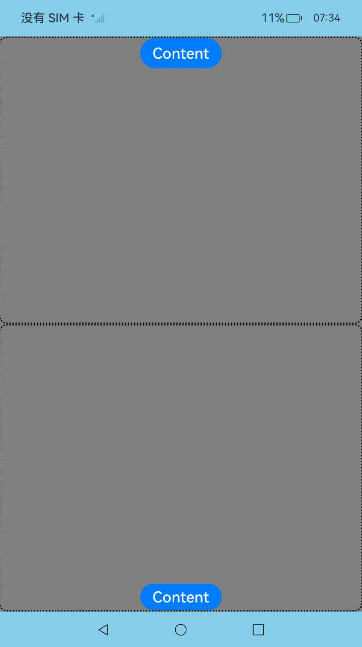

# 全屏模态转场
<!--Kit: ArkUI-->
<!--Subsystem: ArkUI-->
<!--Owner: @CCFFWW-->
<!--Designer: @CCFFWW-->
<!--Tester: @lxl007-->
<!--Adviser: @HelloCrease-->

通过bindContentCover属性为组件绑定全屏模态页面，在组件插入和移除时可通过设置转场参数ModalTransition显示过渡动效。

>  **说明：**
>
>  从API version 10开始支持。后续版本如有新增内容，则采用上角标单独标记该内容的起始版本。
>
>  不支持横竖屏切换。
>
>  不支持路由跳转。

## bindContentCover

bindContentCover(isShow: boolean, builder: CustomBuilder, options?: ContentCoverOptions): T

给组件绑定全屏模态页面，点击后显示模态页面。模态页面内容自定义，显示方式可设置无动画过渡，上下切换过渡以及透明渐变过渡。

**原子化服务API：** 从API version 11开始，该接口支持在原子化服务中使用。

**系统能力：** SystemCapability.ArkUI.ArkUI.Full

**参数：** 

| 参数名  | 类型                                        | 必填 | 说明                                                         |
| ------- | ------------------------------------------- | ---- | ------------------------------------------------------------ |
| isShow  | boolean                        | 是   | 是否显示全屏模态页面。<br/>-true：显示全屏模态页面。<br/>-false：隐藏全屏模态页面。<br/>从API version 10开始，该参数支持[$$](../../../ui/state-management/arkts-two-way-sync.md)双向绑定变量。<br />从API version 18开始，该参数支持[!!](../../../ui/state-management/arkts-new-binding.md#系统组件参数双向绑定)双向绑定变量。|
| builder | [CustomBuilder](ts-types.md#custombuilder8) | 是   | 配置全屏模态页面内容。                                       |
| options | [ContentCoverOptions](#contentcoveroptions) | 否   | 配置全屏模态页面的可选属性。                                 |

**返回值：**

| 类型   | 说明                     |
| ------ | ------------------------ |
| T | 返回当前组件。 |

## ContentCoverOptions
继承自[BindOptions](ts-universal-attributes-sheet-transition.md#bindoptions)。

全屏模态页面内容选项。

**系统能力：** SystemCapability.ArkUI.ArkUI.Full

| 名称              | 类型                                       | 只读 |  可选   | 说明            |
| --------------- | ---------------------------------------- | ---- | ---- | ------------- |
| modalTransition | [ModalTransition](ts-universal-attributes-sheet-transition.md#modaltransition) | 否 | 是    | 全屏模态页面的系统转场方式。<br/> 默认值：ModalTransition.DEFAULT。<br/>**说明：**<br /> 同transition同时设置时，此属性不生效。<br />**原子化服务API：** 从API version 11开始，该接口支持在原子化服务中使用。  |
| onWillDismiss<sup>12+</sup> | Callback&lt;[DismissContentCoverAction](#dismisscontentcoveraction12类型说明)&gt; | 否 | 是   | 全屏模态页面交互式关闭回调函数。<br/>**说明：**<br />当用户执行back事件关闭交互操作时，如果注册该回调函数，则不会立刻关闭。在回调函数中可以通过reason得到阻拦关闭页面的操作类型，从而根据原因选择是否关闭全屏模态页面。在onWillDismiss回调中，不能再做onWillDismiss拦截。 <br/>**原子化服务API：** 从API version 12开始，该接口支持在原子化服务中使用。|
| transition<sup>12+</sup> | [TransitionEffect](ts-transition-animation-component.md#transitioneffect10对象说明) | 否 | 是   | 全屏模态页面的自定义转场方式。  <br/>**原子化服务API：** 从API version 12开始，该接口支持在原子化服务中使用。|
| enableSafeArea<sup>20+</sup> | boolean  | 否 | 是  | 全屏模态是否适配安全区域，true表示全屏模态适配安全区域，将内容限制在安全区内，避让导航条和状态栏，false表示不做处理，和之前的样式保持一致。默认值为false。  <br />**原子化服务API：** 从API version 20开始，该接口支持在原子化服务中使用。 |

## DismissContentCoverAction<sup>12+</sup>类型说明

**原子化服务API：** 从API version 12开始，该接口支持在原子化服务中使用。

**系统能力：** SystemCapability.ArkUI.ArkUI.Full

| 名称              | 类型                                       | 只读 | 可选   | 说明            |
| --------------- | -------------------- | -------------------- | ---- | ------------- |
| dismiss | [Callback](./ts-types.md#callback12)\<void> | 否 | 否    | 全屏模态页面关闭回调函数。开发者需要退出页面时调用。 |
| reason | [DismissReason](ts-universal-attributes-popup.md#dismissreason12枚举说明) | 否 | 否    | 返回本次拦截全屏模态页面退出的事件原因。  |

## 示例

### 示例1（使用全屏模态转场）

该示例主要演示通过bindContentCover来实现全屏模态转场。

```ts
// xxx.ets
@Entry
@Component
struct ModalTransitionExample {
  @State isShow: boolean = false;
  @State isShow2: boolean = false;

  @Builder
  myBuilder2() {
    Column() {
      Button("close modal 2")
        .margin(10)
        .fontSize(20)
        .onClick(() => {
          this.isShow2 = false;
        })
    }
    .width('100%')
    .height('100%')
  }

  @Builder
  myBuilder() {
    Column() {
      Button("transition modal 2")
        .margin(10)
        .fontSize(20)
        .onClick(() => {
          this.isShow2 = true;
        }).bindContentCover(this.isShow2, this.myBuilder2(), {
        modalTransition: ModalTransition.NONE,
        backgroundColor: Color.Orange,
        onWillAppear: () => {
          console.log("BindContentCover onWillAppear.");
        },
        onAppear: () => {
          console.log("BindContentCover onAppear.");
        },
        onWillDisappear: () => {
          console.log("BindContentCover onWillDisappear.");
        },
        onDisappear: () => {
          console.log("BindContentCover onDisappear.");
        }
      })

      Button("close modal 1")
        .margin(10)
        .fontSize(20)
        .onClick(() => {
          this.isShow = false;
        })
    }
    .width('100%')
    .height('100%')
    .justifyContent(FlexAlign.Center)
  }

  build() {
    Column() {
      Button("transition modal 1")
        .onClick(() => {
          this.isShow = true;
        })
        .fontSize(20)
        .margin(10)
        .bindContentCover(this.isShow, this.myBuilder(), {
          modalTransition: ModalTransition.NONE,
          backgroundColor: Color.Pink,
          onWillAppear: () => {
            console.log("BindContentCover onWillAppear.");
          },
          onAppear: () => {
            console.log("BindContentCover onAppear.");
          },
          onWillDisappear: () => {
            console.log("BindContentCover onWillDisappear.");
          },
          onDisappear: () => {
            console.log("BindContentCover onDisappear.");
          }
        })
    }
    .justifyContent(FlexAlign.Center)
    .backgroundColor("#ff49c8ab")
    .width('100%')
    .height('100%')
  }
}
```


### 示例2（自定义转场动画）

全屏模态无动画转场模式下，自定义转场动画。

```ts
// xxx.ets
import { curves } from '@kit.ArkUI';

@Entry
@Component
struct ModalTransitionExample {
  @State @Watch("isShow1Change") isShow: boolean = false;
  @State @Watch("isShow2Change") isShow2: boolean = false;
  @State isScale1: number = 1;
  @State isScale2: number = 1;

  isShow1Change() {
    this.isShow ? this.isScale1 = 0.95 : this.isScale1 = 1;
  }

  isShow2Change() {
    this.isShow2 ? this.isScale2 = 0.95 : this.isScale2 = 1;
  }

  @Builder
  myBuilder2() {
    Column() {
      Button("close modal 2")
        .margin(10)
        .fontSize(20)
        .onClick(() => {
          this.isShow2 = false;
        })
    }
    .width('100%')
    .height('100%')
  }

  @Builder
  myBuilder() {
    Column() {
      Button("transition modal 2")
        .margin(10)
        .fontSize(20)
        .onClick(() => {
          this.isShow2 = true;
        }).bindContentCover(this.isShow2, this.myBuilder2(), {
        modalTransition: ModalTransition.NONE,
        backgroundColor: Color.Orange,
        onWillAppear: () => {
          console.log("BindContentCover onWillAppear.");
        },
        onAppear: () => {
          console.log("BindContentCover onAppear.");
        },
        onWillDisappear: () => {
          console.log("BindContentCover onWillDisappear.");
        },
        onDisappear: () => {
          console.log("BindContentCover onDisappear.");
        }
      })

      Button("close modal 1")
        .margin(10)
        .fontSize(20)
        .onClick(() => {
          this.isShow = false;
        })
    }
    .width('100%')
    .height('100%')
    .justifyContent(FlexAlign.Center)
    .scale({ x: this.isScale2, y: this.isScale2 })
    .animation({ curve: curves.springMotion() })
  }

  build() {
    Column() {
      Button("transition modal 1")
        .onClick(() => {
          this.isShow = true;
        })
        .fontSize(20)
        .margin(10)
        .bindContentCover(this.isShow, this.myBuilder(), {
          modalTransition: ModalTransition.NONE,
          backgroundColor: Color.Pink,
          onWillAppear: () => {
            console.log("BindContentCover onWillAppear.");
          },
          onAppear: () => {
            console.log("BindContentCover onAppear.");
          },
          onWillDisappear: () => {
            console.log("BindContentCover onWillDisappear.");
          },
          onDisappear: () => {
            console.log("BindContentCover onDisappear.");
          }
        })
    }
    .justifyContent(FlexAlign.Center)
    .backgroundColor("#ff49c8ab")
    .width('100%')
    .height('100%')
    .scale({ x: this.isScale1, y: this.isScale1 })
    .animation({ curve: curves.springMotion() })
  }
}
```


### 示例3（上下切换转场）

全屏模态上下切换转场。

```ts
// xxx.ets
@Entry
@Component
struct ModalTransitionExample {
  @State isShow: boolean = false;
  @State isShow2: boolean = false;

  @Builder
  myBuilder2() {
    Column() {
      Button("close modal 2")
        .margin(10)
        .fontSize(20)
        .onClick(() => {
          this.isShow2 = false;
        })
    }
    .width('100%')
    .height('100%')
  }

  @Builder
  myBuilder() {
    Column() {
      Button("transition modal 2")
        .margin(10)
        .fontSize(20)
        .onClick(() => {
          this.isShow2 = true;
        }).bindContentCover(this.isShow2, this.myBuilder2(), {
        modalTransition: ModalTransition.DEFAULT,
        backgroundColor: Color.Gray,
        onWillAppear: () => {
          console.log("BindContentCover onWillAppear.");
        },
        onAppear: () => {
          console.log("BindContentCover onAppear.");
        },
        onWillDisappear: () => {
          console.log("BindContentCover onWillDisappear.");
        },
        onDisappear: () => {
          console.log("BindContentCover onDisappear.");
        }
      })

      Button("close modal 1")
        .margin(10)
        .fontSize(20)
        .onClick(() => {
          this.isShow = false;
        })
    }
    .width('100%')
    .height('100%')
    .justifyContent(FlexAlign.Center)
  }

  build() {
    Column() {
      Button("transition modal 1")
        .onClick(() => {
          this.isShow = true;
        })
        .fontSize(20)
        .margin(10)
        .bindContentCover(this.isShow, this.myBuilder(), {
          modalTransition: ModalTransition.DEFAULT,
          backgroundColor: Color.Pink,
          onWillAppear: () => {
            console.log("BindContentCover onWillAppear.");
          },
          onAppear: () => {
            console.log("BindContentCover onAppear.");
          },
          onWillDisappear: () => {
            console.log("BindContentCover onWillDisappear.");
          },
          onDisappear: () => {
            console.log("BindContentCover onDisappear.");
          }
        })
    }
    .justifyContent(FlexAlign.Center)
    .backgroundColor(Color.White)
    .width('100%')
    .height('100%')
  }
}
```


### 示例4（透明度渐变转场）

全屏模态透明度渐变转场。

```ts
// xxx.ets
@Entry
@Component
struct ModalTransitionExample {
  @State isShow: boolean = false;
  @State isShow2: boolean = false;

  @Builder
  myBuilder2() {
    Column() {
      Button("close modal 2")
        .margin(10)
        .fontSize(20)
        .onClick(() => {
          this.isShow2 = false;
        })
    }
    .width('100%')
    .height('100%')
    .justifyContent(FlexAlign.Center)
  }

  @Builder
  myBuilder() {
    Column() {
      Button("transition modal 2")
        .margin(10)
        .fontSize(20)
        .onClick(() => {
          this.isShow2 = true;
        }).bindContentCover(this.isShow2, this.myBuilder2(), {
        modalTransition: ModalTransition.ALPHA,
        backgroundColor: Color.Gray,
        onWillAppear: () => {
          console.log("BindContentCover onWillAppear.");
        },
        onAppear: () => {
          console.log("BindContentCover onAppear.");
        },
        onWillDisappear: () => {
          console.log("BindContentCover onWillDisappear.");
        },
        onDisappear: () => {
          console.log("BindContentCover onDisappear.");
        }
      })

      Button("close modal 1")
        .margin(10)
        .fontSize(20)
        .onClick(() => {
          this.isShow = false;
        })
    }
    .width('100%')
    .height('100%')
    .justifyContent(FlexAlign.Center)
  }

  build() {
    Column() {
      Button("transition modal 1")
        .onClick(() => {
          this.isShow = true;
        })
        .fontSize(20)
        .margin(10)
        .bindContentCover(this.isShow, this.myBuilder(), {
          modalTransition: ModalTransition.ALPHA,
          backgroundColor: Color.Pink,
          onWillAppear: () => {
            console.log("BindContentCover onWillAppear.");
          },
          onAppear: () => {
            console.log("BindContentCover onAppear.");
          },
          onWillDisappear: () => {
            console.log("BindContentCover onWillDisappear.");
          },
          onDisappear: () => {
            console.log("BindContentCover onDisappear.");
          }
        })
    }
    .justifyContent(FlexAlign.Center)
    .backgroundColor(Color.White)
    .width('100%')
    .height('100%')
  }
}
```


### 示例5（设置不同效果的自定义转场）

该示例主要演示全屏模态旋转，平移等自定义转场。

```ts
// xxx.ets
@Entry
@Component
struct ModalTransitionExample {
  @State isShow: boolean = false;
  @State isShow2: boolean = false;

  @Builder
  myBuilder2() {
    Column() {
      Button("Close Modal 2")
        .margin(10)
        .fontSize(20)
        .onClick(() => {
          this.isShow2 = false;
        })
    }
    .width('100%')
    .height('100%')
    .justifyContent(FlexAlign.Center)
  }

  @Builder
  myBuilder() {
    Column() {
      Button("Transition Modal 2")
        .margin(10)
        .fontSize(20)
        .onClick(() => {
          this.isShow2 = true;
        })
        .bindContentCover(
          this.isShow2,
          this.myBuilder2(),
          {
            modalTransition: ModalTransition.DEFAULT,
            backgroundColor: Color.Gray,
            transition: TransitionEffect.SLIDE.animation({ duration: 5000, curve: Curve.LinearOutSlowIn }),
            onWillDismiss: ((dismissContentCoverAction: DismissContentCoverAction) => {
              if (dismissContentCoverAction.reason == DismissReason.PRESS_BACK) {
                console.log("BindContentCover dismiss reason is back pressed");
              }
              dismissContentCoverAction.dismiss();
            }),
            onAppear: () => {
              console.info("BindContentCover onAppear.");
            },
            onDisappear: () => {
              this.isShow2 = false;
              console.info("BindContentCover onDisappear.");
            }
          })

      Button("Close Modal 1")
        .margin(10)
        .fontSize(20)
        .onClick(() => {
          this.isShow = false;
        })
    }
    .width('100%')
    .height('100%')
    .justifyContent(FlexAlign.Center)
  }

  build() {
    Column() {
      Button("Transition Modal 1")
        .onClick(() => {
          this.isShow = true;
        })
        .fontSize(20)
        .margin(10)
        .bindContentCover(
          this.isShow,
          this.myBuilder(),
          {
            modalTransition: ModalTransition.DEFAULT,
            backgroundColor: Color.Pink,
            transition: TransitionEffect.asymmetric(
              TransitionEffect.OPACITY.animation({ duration: 1100 }).combine(
                TransitionEffect.rotate({ z: 1, angle: 180 }).animation({ delay: 1000, duration: 1000 }))
              ,
              TransitionEffect.OPACITY.animation({ duration: 1200 }).combine(
                TransitionEffect.rotate({ z: 1, angle: 180 }).animation({ duration: 1300 }))
            ),
            onWillDismiss: ((dismissContentCoverAction: DismissContentCoverAction) => {
              if (dismissContentCoverAction.reason == DismissReason.PRESS_BACK) {
                console.log("back pressed");
              }
              dismissContentCoverAction.dismiss();
            }),
            onAppear: () => {
              console.log("BindContentCover onAppear.");
            },
            onDisappear: () => {
              this.isShow = false;
              console.log("BindContentCover onDisappear.");
            }
          })
    }
    .justifyContent(FlexAlign.Center)
    .backgroundColor(Color.White)
    .width('100%')
    .height('100%')
  }
}
```


### 示例6（设置全模态适配安全区）

该示例主要演示通过设置enableSafeArea = true时，全模态适配安全区后，其内容效果。全模态容器其背景色为浅蓝色，内容颜色为灰色，内容在安全区内布局。

```ts
// xxx.ets
@Entry
@Component
struct SafeAreaController {
  @State isShow: boolean = false;
  @State SafeArea: boolean | undefined = true;
  @State heightMode: string = '100%';

  @Builder
  myBuilder() {
    Column() {
      Column() {
        Button("Content")
          .fontSize(20)
      }
      .width('100%')
      .height('50%')
      .borderRadius(10)
      .borderStyle(BorderStyle.Dotted)
      .borderWidth(2)
      Column() {
        Button("Content")
          .margin({top:340})
          .fontSize(20)
      }
      .width('100%')
      .height('50%')
      .borderRadius(10)
      .borderStyle(BorderStyle.Dotted)
      .borderWidth(2)
    }
    .backgroundColor(Color.Grey)
    .justifyContent(FlexAlign.Center)
    .width('100%')
    .height(this.heightMode)
  }
  build() {
    Column() {
      Button("Open ContentCover")
        .onClick(() => this.isShow = true)
        .fontSize(20)
        .margin(10)
        .bindContentCover(this.isShow, this.myBuilder(), {
          modalTransition: ModalTransition.ALPHA,
          backgroundColor: 0x87CEEB,
          // 动态设置安全区域模式
          enableSafeArea: this.SafeArea
        })
    }
    .justifyContent(FlexAlign.Center)
    .width('100%')
    .height('100%')
  }
}
```

