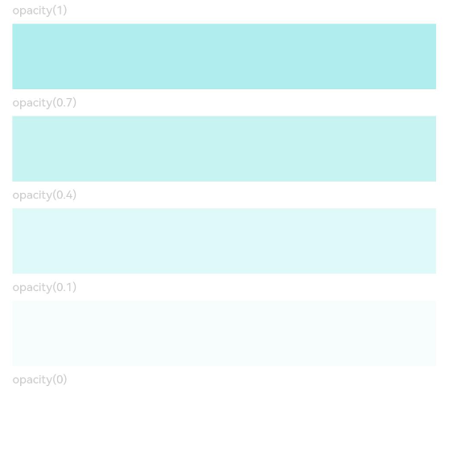

# 不透明度设置
<!--Kit: ArkUI-->
<!--Subsystem: ArkUI-->
<!--Owner: @hehongyang3-->
<!--Designer: @hehongyang3-->
<!--Tester: @lxl007-->
<!--Adviser: @Brilliantry_Rui-->

设置组件的不透明度。

>  **说明：**
>
>  从API version 7开始支持。后续版本如有新增内容，则采用上角标单独标记该内容的起始版本。

## opacity

opacity(value: number | Resource): T

设置组件的不透明度。

**卡片能力：** 从API version 9开始，该接口支持在ArkTS卡片中使用。

**原子化服务API：** 从API version 11开始，该接口支持在原子化服务中使用。

**系统能力：** SystemCapability.ArkUI.ArkUI.Full

**参数：** 

| 参数名 | 类型                                                 | 必填 | 说明                                                         |
| ------ | ---------------------------------------------------- | ---- | ------------------------------------------------------------ |
| value  | number&nbsp;\|&nbsp;[Resource](ts-types.md#resource) | 是   | 元素的不透明度，取值范围：[0, 1]（百分比），设置小于0的值时，则取值为0，设置大于1的值时，则取值为1，1表示完全不透明，0表示完全透明，达到隐藏组件的效果，但是在布局中占位。 <br> 默认值：1，未设置该属性时组件呈现完全不透明状态 <br>**说明：** <br> 子组件会继承父组件的不透明度，并与自身的不透明度属性叠加。如：父组件不透明度为0.1，子组件设置不透明度为0.8，则子组件实际不透明度为0.1*0.8=0.08。 |

**返回值：**

| 类型   | 说明                     |
| ------ | ------------------------ |
| T | 返回当前组件，用于链式调用。 |

## opacity<sup>18+</sup>

opacity(opacity: Optional\<number | Resource>): T

设置组件的不透明度。与[opacity](#opacity)相比，opacity参数新增了对undefined类型的支持。

**卡片能力：** 从API version 18开始，该接口支持在ArkTS卡片中使用。

**原子化服务API：** 从API version 18开始，该接口支持在原子化服务中使用。

**模型约束：** 此接口仅可在Stage模型下使用。

**系统能力：** SystemCapability.ArkUI.ArkUI.Full

**参数：** 

| 参数名  | 类型                                                         | 必填 | 说明                                                         |
| ------- | ------------------------------------------------------------ | ---- | ------------------------------------------------------------ |
| opacity | [Optional](ts-universal-attributes-custom-property.md#optionalt)\<number&nbsp;\|&nbsp;[Resource](ts-types.md#resource)> | 是   | 元素的不透明度，取值范围：[0, 1]（百分比），设置小于0的值时，则取值为0，设置大于1的值时，则取值为1，1表示完全不透明，0表示完全透明，达到隐藏组件的效果，但是在布局中占位。 <br> 默认值：1，未设置该属性时组件呈现完全不透明状态 <br>**说明：** <br> 子组件会继承父组件的不透明度，并与自身的不透明度属性叠加。如：父组件不透明度为0.1，子组件设置不透明度为0.8，则子组件实际不透明度为0.1*0.8=0.08。<br>当opacity的值为undefined时，恢复为默认不透明度为1的状态，此时该默认值仍会与父组件不透明度按继承规则叠加计算，即子组件实际不透明度等于父组件不透明度。 |

**返回值：**

| 类型   | 说明                     |
| ------ | ------------------------ |
| T | 返回当前组件，用于链式调用。 |


## 示例

该示例主要显示通过[opacity](#opacity)设置组件的不透明度。

```ts
// xxx.ets
@Entry
@Component
struct OpacityExample {
  build() {
    Column({ space: 5 }) {
      Text('opacity(1)').fontSize(9).width('90%').fontColor(0xCCCCCC)
      Text().width('90%').height(50).opacity(1).backgroundColor(0xAFEEEE)
      Text('opacity(0.7)').fontSize(9).width('90%').fontColor(0xCCCCCC)
      Text().width('90%').height(50).opacity(0.7).backgroundColor(0xAFEEEE)
      Text('opacity(0.4)').fontSize(9).width('90%').fontColor(0xCCCCCC)
      Text().width('90%').height(50).opacity(0.4).backgroundColor(0xAFEEEE)
      Text('opacity(0.1)').fontSize(9).width('90%').fontColor(0xCCCCCC)
      Text().width('90%').height(50).opacity(0.1).backgroundColor(0xAFEEEE)
      Text('opacity(0)').fontSize(9).width('90%').fontColor(0xCCCCCC)
      Text().width('90%').height(50).opacity(0).backgroundColor(0xAFEEEE)
    }
    .width('100%')
    .padding({ top: 5 })
  }
}
```


