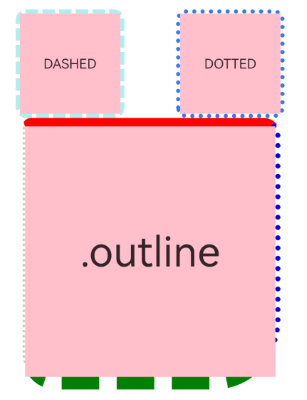
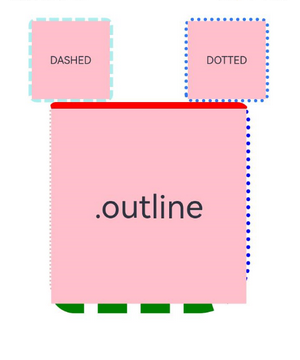
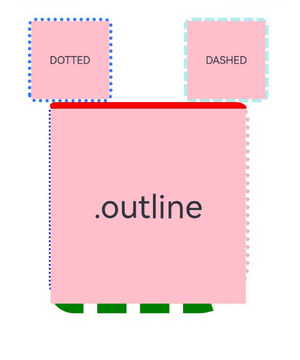

# 外描边设置

设置组件外描边样式。

>  **说明：**
>
>  从API Version 11开始支持。后续版本如有新增内容，则采用上角标单独标记该内容的起始版本。

## outline

outline(value: OutlineOptions)

统一外描边样式设置接口。

**卡片能力：** 从API version 11开始，该接口支持在ArkTS卡片中使用。

**原子化服务API：** 从API version 12开始，该接口支持在原子化服务中使用。

**系统能力：** SystemCapability.ArkUI.ArkUI.Full

**参数：**

| 参数名 | 类型                                      | 必填 | 说明 |
| ------ | ----------------------------------------- | ---- | ---- |
| value  | [OutlineOptions](#outlineoptions对象说明) | 是   |   外描边样式。   |

## OutlineStyle<sup>11+</sup>

**卡片能力：** 从API version 11开始，该接口支持在ArkTS卡片中使用。

**原子化服务API：** 从API version 12开始，该接口支持在原子化服务中使用。

**系统能力：** SystemCapability.ArkUI.ArkUI.Full

| 名称     | 描述                            |
| ------ | ----------------------------- |
| SOLID  | 显示为一条实线。                      |
| DASHED | 显示为一系列短的方形虚线。                 |
| DOTTED | 显示为一系列圆点，圆点半径为outlineWidth的一半。 |

## outlineStyle

outlineStyle(value: OutlineStyle | EdgeOutlineStyles)

设置元素的外描边样式。

**卡片能力：** 从API version 11开始，该接口支持在ArkTS卡片中使用。

**原子化服务API：** 从API version 12开始，该接口支持在原子化服务中使用。

**系统能力：** SystemCapability.ArkUI.ArkUI.Full

**参数：**

| 参数名 | 类型                                                         | 必填 | 说明                                                  |
| ------ | ------------------------------------------------------------ | ---- | ----------------------------------------------------- |
| value  | [OutlineStyle](#outlinestyle11)&nbsp;\|&nbsp;[EdgeOutlineStyles](#edgeoutlinestyles对象说明) | 是   | 设置元素的外描边样式。<br/>默认值：OutlineStyle.SOLID |

## outlineWidth

outlineWidth(value: Dimension | EdgeOutlineWidths)

设置元素的外描边宽度。

**卡片能力：** 从API version 11开始，该接口支持在ArkTS卡片中使用。

**原子化服务API：** 从API version 12开始，该接口支持在原子化服务中使用。

**系统能力：** SystemCapability.ArkUI.ArkUI.Full

**参数：**

| 参数名 | 类型                                                         | 必填 | 说明                                                         |
| ------ | ------------------------------------------------------------ | ---- | ------------------------------------------------------------ |
| value  | [Dimension](ts-types.md#dimension10)&nbsp;\|&nbsp;[EdgeOutlineWidths](#edgeoutlinewidths对象说明) | 是   | 设置元素的外描边宽度，不支持百分比。 <br/>默认值：0，外描边效果width为必设项。 |

## outlineColor

outlineColor(value: ResourceColor | EdgeColors)

设置元素的外描边颜色。

**卡片能力：** 从API version 11开始，该接口支持在ArkTS卡片中使用。

**原子化服务API：** 从API version 12开始，该接口支持在原子化服务中使用。

**系统能力：** SystemCapability.ArkUI.ArkUI.Full

**参数：**

| 参数名 | 类型                                                         | 必填 | 说明                                             |
| ------ | ------------------------------------------------------------ | ---- | ------------------------------------------------ |
| value  | [ResourceColor](ts-types.md#resourcecolor)&nbsp;\|&nbsp;[EdgeColors](#edgecolors对象说明) | 是   | 设置元素的外描边颜色。<br/>默认值：Color.Black。 |

## outlineRadius

outlineRadius(value: Dimension | OutlineRadiuses)

设置元素的外描边圆角半径。

**卡片能力：** 从API version 11开始，该接口支持在ArkTS卡片中使用。

**原子化服务API：** 从API version 12开始，该接口支持在原子化服务中使用。

**系统能力：** SystemCapability.ArkUI.ArkUI.Full

**参数：**

| 参数名 | 类型                                                         | 必填 | 说明                                                         |
| ------ | ------------------------------------------------------------ | ---- | ------------------------------------------------------------ |
| value  | [Dimension](ts-types.md#dimension10)&nbsp;\|&nbsp;[OutlineRadiuses](#outlineradiuses对象说明) | 是   | 设置元素的外描边圆角半径，不支持百分比。<br/>默认值：0。<br/>最大生效值：组件width/2 + outlineWidth或组件height/2 + outlineWidth。 |

## OutlineOptions对象说明

**原子化服务API：** 从API version 12开始，该接口支持在原子化服务中使用。

**卡片能力：** 从API version 12开始，该接口支持在ArkTS卡片中使用。

| 名称   | 类型                   |必填                                      | 说明                                                         |
| ------ | ----------------------|-------------------------------------- | ------------------------------------------------------------ |
| width  | [Dimension](ts-types.md#dimension10)&nbsp;\|&nbsp;[EdgeOutlineWidths](#edgeoutlinewidths对象说明)| 否| 设置外描边宽度，不支持百分比。<br/>默认值：0，外描边效果width为必设项，否则不显示外描边。 |
| color  | [ResourceColor](ts-types.md#resourcecolor)&nbsp;\|&nbsp;[EdgeColors](#edgecolors对象说明)&nbsp;\|&nbsp;[LocalizedEdgeColors](#localizededgecolors对象说明12)<sup>12+</sup> |否 | 设置外描边颜色。<br/>默认值：Color.Black。                   |
| radius | [Dimension](ts-types.md#dimension10)&nbsp;\|&nbsp;[OutlineRadiuses](#outlineradiuses对象说明)| 否| 设置外描边圆角半径，不支持百分比。<br/>默认值：0。<br/>最大生效值：组件width/2 + outlineWidth或组件height/2 + outlineWidth。 |
| style  | [OutlineStyle](#outlinestyle11)&nbsp;\|&nbsp;[EdgeOutlineStyles](#edgeoutlinestyles对象说明)|否| 设置外描边样式。<br/>默认值：OutlineStyle.SOLID。            |

## EdgeOutlineWidths对象说明

引入该对象时，至少传入一个参数。

**原子化服务API：** 从API version 12开始，该接口支持在原子化服务中使用。

**卡片能力：** 从API version 12开始，该接口支持在ArkTS卡片中使用。

| 名称     | 参数类型                         | 必填   | 描述      |
| ------ | ---------------------------- | ---- | ------- |
| left   | [Dimension](ts-types.md#dimension10) | 否    | 左侧外描边宽度。 |
| right  | [Dimension](ts-types.md#dimension10) | 否    | 右侧外描边宽度。 |
| top    | [Dimension](ts-types.md#dimension10) | 否    | 上侧外描边宽度。 |
| bottom | [Dimension](ts-types.md#dimension10) | 否    | 下侧外描边宽度。 |

## EdgeColors对象说明

引入该对象时，至少传入一个参数。

**原子化服务API：** 从API version 11开始，该接口支持在原子化服务中使用。

**系统能力：** SystemCapability.ArkUI.ArkUI.Full

**卡片能力：** 从API version 12开始，该接口支持在ArkTS卡片中使用。

| 名称     | 参数类型                                     | 必填   | 描述      |
| ------ | ---------------------------------------- | ---- | ------- |
| left   | [ResourceColor](ts-types.md#resourcecolor) | 否    | 左侧外描边颜色。 |
| right  | [ResourceColor](ts-types.md#resourcecolor) | 否    | 右侧外描边颜色。 |
| top    | [ResourceColor](ts-types.md#resourcecolor) | 否    | 上侧外描边颜色。 |
| bottom | [ResourceColor](ts-types.md#resourcecolor) | 否    | 下侧外描边颜色。 |

## LocalizedEdgeColors对象说明<sup>12+</sup>

引入该对象时，至少传入一个参数。

**原子化服务API：** 从API version 12开始，该接口支持在原子化服务中使用。

**卡片能力：** 从API version 12开始，该接口支持在ArkTS卡片中使用。

| 名称     | 参数类型                                     | 必填   | 描述      |
| ------ | ---------------------------------------- | ---- | ------- |
| start | [ResourceColor](ts-types.md#resourcecolor) | 否    | 左侧外描边颜色。<br/>从左至右显示语言模式下为右侧外描边颜色。 |
| end | [ResourceColor](ts-types.md#resourcecolor) | 否    | 右侧外描边颜色。<br/>从左至右显示语言模式下为左侧外描边颜色。 |
| top    | [ResourceColor](ts-types.md#resourcecolor) | 否    | 上侧外描边颜色。 |
| bottom | [ResourceColor](ts-types.md#resourcecolor) | 否    | 下侧外描边颜色。 |

## OutlineRadiuses对象说明

引用该对象时，至少传入一个参数。

**原子化服务API：** 从API version 12开始，该接口支持在原子化服务中使用。

**卡片能力：** 从API version 12开始，该接口支持在ArkTS卡片中使用。

| 名称          | 参数类型                         | 必填   | 描述       |
| ----------- | ---------------------------- | ---- | -------- |
| topLeft     | [Dimension](ts-types.md#dimension10) | 否    | 左上角圆角半径。 |
| topRight    | [Dimension](ts-types.md#dimension10) | 否    | 右上角圆角半径。 |
| bottomLeft  | [Dimension](ts-types.md#dimension10) | 否    | 左下角圆角半径。 |
| bottomRight | [Dimension](ts-types.md#dimension10) | 否    | 右下角圆角半径。 |

## EdgeOutlineStyles对象说明

引入该对象时，至少传入一个参数。

**原子化服务API：** 从API version 12开始，该接口支持在原子化服务中使用。

**卡片能力：** 从API version 12开始，该接口支持在ArkTS卡片中使用。

| 名称     | 参数类型                                     | 必填   | 描述      |
| ------ | ---------------------------------------- | ---- | ------- |
| left   | [OutlineStyle](#outlinestyle11) | 否    | 左侧外描边样式。 |
| right  | [OutlineStyle](#outlinestyle11) | 否    | 右侧外描边样式。 |
| top    | [OutlineStyle](#outlinestyle11) | 否    | 上侧外描边样式。 |
| bottom | [OutlineStyle](#outlinestyle11) | 否    | 下侧外描边样式。 |

## 示例

### 示例1

```ts
// xxx.ets
@Entry
@Component
struct OutlineExample {
  build() {
    Column() {
      Flex({ justifyContent: FlexAlign.SpaceAround, alignItems: ItemAlign.Center }) {
        // 线段
        Text('DASHED')
          .backgroundColor(Color.Pink)
          .outlineStyle(OutlineStyle.DASHED).outlineWidth(5).outlineColor(0xAFEEEE).outlineRadius(10)
          .width(120).height(120).textAlign(TextAlign.Center).fontSize(16)
        // 点线
        Text('DOTTED')
          .backgroundColor(Color.Pink)
          .outline({ width: 5, color: 0x317AF7, radius: 10, style: OutlineStyle.DOTTED })
          .width(120).height(120).textAlign(TextAlign.Center).fontSize(16)
      }.width('100%').height(150)

      Text('.outline')
        .backgroundColor(Color.Pink)
        .fontSize(50)
        .width(300)
        .height(300)
        .outline({
          width: { left: 3, right: 6, top: 10, bottom: 15 },
          color: { left: '#e3bbbb', right: Color.Blue, top: Color.Red, bottom: Color.Green },
          radius: { topLeft: 10, topRight: 20, bottomLeft: 40, bottomRight: 80 },
          style: {
            left: OutlineStyle.DOTTED,
            right: OutlineStyle.DOTTED,
            top: OutlineStyle.SOLID,
            bottom: OutlineStyle.DASHED
          }
        }).textAlign(TextAlign.Center)
    }
  }
}
```



### 示例2
```ts
// xxx.ets
// outline属性的color属性值使用LocalizedEdgeColors类型

@Entry
@Component
struct OutlineExample {
  build() {
    Column() {
      Flex({ justifyContent: FlexAlign.SpaceAround, alignItems: ItemAlign.Center }) {
        // 线段
        Text('DASHED')
          .backgroundColor(Color.Pink)
          .outlineStyle(OutlineStyle.DASHED).outlineWidth(5).outlineColor(0xAFEEEE).outlineRadius(10)
          .width(120).height(120).textAlign(TextAlign.Center).fontSize(16)
        // 点线
        Text('DOTTED')
          .backgroundColor(Color.Pink)
          .outline({ width: 5, color: 0x317AF7, radius: 10, style: OutlineStyle.DOTTED })
          .width(120).height(120).textAlign(TextAlign.Center).fontSize(16)
      }.width('100%').height(150)

      Text('.outline')
        .backgroundColor(Color.Pink)
        .fontSize(50)
        .width(300)
        .height(300)
        .outline({
          width: { left: 3, right: 6, top: 10, bottom: 15 },
          color: { start: '#e3bbbb', end: Color.Blue, top: Color.Red, bottom: Color.Green },
          radius: { topLeft: 10, topRight: 20, bottomLeft: 40, bottomRight: 80 },
          style: {
            left: OutlineStyle.DOTTED,
            right: OutlineStyle.DOTTED,
            top: OutlineStyle.SOLID,
            bottom: OutlineStyle.DASHED
          }
        }).textAlign(TextAlign.Center)
    }
  }
}
```

从左至右显示语言示例图



从右至左显示语言示例图

