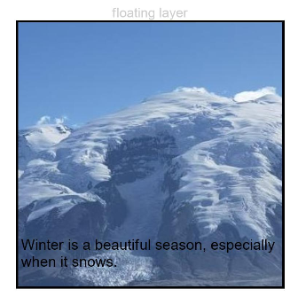

# 浮层

设置组件的浮层。

>  **说明：**
>
>  从API Version 7开始支持。后续版本如有新增内容，则采用上角标单独标记该内容的起始版本。

## overlay

overlay(value: string | CustomBuilder | ComponentContent, options?: OverlayOptions )

在当前组件上，增加遮罩文本或者叠加自定义组件以及ComponentContent作为该组件的浮层。

**卡片能力：** 从API version 9开始，该接口支持在ArkTS卡片中使用。

**原子化服务API：** 从API version 11开始，该接口支持在原子化服务中使用。

**系统能力：** SystemCapability.ArkUI.ArkUI.Full

**参数：** 

| 参数名  | 类型                                                         | 必填 | 说明                                                         |
| ------- | ------------------------------------------------------------ | ---- | ------------------------------------------------------------ |
| value   | string&nbsp;\|&nbsp;[CustomBuilder](ts-types.md#custombuilder8)<sup>10+</sup>&nbsp;\| [ComponentContent](../js-apis-arkui-ComponentContent.md)<sup>12+</sup> | 是   | 遮罩文本内容或自定义组件构造函数。<br/>**说明：**<br/>自定义组件作为浮层时，不支持键盘走焦到自定义组件中。 |
| options | [OverlayOptions](#overlayoptions12) | 否   | 浮层的定位。<br/>**说明：**<br/>需要解析为Json格式。<br/>API version 12之前，options: <br/>{<br/>align?:&nbsp;[Alignment](ts-appendix-enums.md#alignment),&nbsp;<br/>offset?:&nbsp;{x?:&nbsp;number, y?:&nbsp;number}<br/>} |

>  **说明：**
>
>  overlay节点不支持onAppear和onDisappear等和节点生命周期相关的事件。

## OverlayOptions<sup>12+</sup>

**系统能力：** SystemCapability.ArkUI.ArkUI.Full

| 名称                  | 类型                                       | 只读 | 可选  | 说明                                                |
| --------------------- | -------------------------------------------| --- | -------| --------------------------------------------------- |
| align<sup>7+</sup>   | [Alignment](ts-appendix-enums.md#alignment) | 否  | 是      |设置浮层相对于组件的方位。<br/>默认值：TopStart         |
| offset<sup>7+</sup>  | [OverlayOffset](#overlayoffset12)          | 否  | 是     |设置浮层基于自身左上角的偏移量。浮层默认处于组件左上角。 |

> **说明：**
> 
> align和offset都设置时，效果重叠，浮层相对于组件方位定位后，再基于当前位置的左上角进行偏移。

## OverlayOffset<sup>12+</sup>

| 名称    | 类型                                                      | 只读 | 可选  | 说明                                                |
| ------- | ---------------------------------------------------------| ---- | ------| --------------------------------------------------- |
| x       | number                                                   | 否   | 是    | 横向偏移量                                           |
| y       | number                                                   | 否   | 是    | 纵向偏移量                                           |

## 示例

### 示例1

```ts
// xxx.ets
@Entry
@Component
struct OverlayExample {
  build() {
    Column() {
      Column() {
        Text('floating layer')
          .fontSize(12).fontColor(0xCCCCCC).maxLines(1)
        Column() {
          Image($r('app.media.img'))
            .width(240).height(240)
            .overlay("Winter is a beautiful season, especially when it snows.", {
              align: Alignment.Bottom,
              offset: { x: 0, y: -15 }
            })
        }.border({ color: Color.Black, width: 2 })
      }.width('100%')
    }.padding({ top: 20 })
  }
}
```



### 示例2

```ts
// xxx.ets
@Entry
@Component
struct OverlayExample {
  @Builder OverlayNode() {
    Column() {
      Image($r('app.media.img1'))
      Text("This is overlayNode").fontSize(20).fontColor(Color.White)
    }.width(180).height(180).alignItems(HorizontalAlign.Center)
  }

  build() {
    Column() {
      Image($r('app.media.img2'))
        .overlay(this.OverlayNode(), { align: Alignment.Center })
        .objectFit(ImageFit.Contain)
    }.width('100%')
    .border({ color: Color.Black, width: 2 }).padding(20)
  }
}
```


### 示例3
通过overlay传入了ComponentContent使backgroundColor不断发生变化
```ts
// xxx.ets
import { ComponentContent } from '@kit.ArkUI';

class Params{
  backgroundColor: string | Resource = ""
  constructor(backgroundColor: string | Resource) {
    this.backgroundColor = backgroundColor;
  }
}

@Builder
function overlayBuilder(params: Params){
  Row(){
  }.width('100%').height('100%').backgroundColor(params.backgroundColor)
}

@Entry
@Component
struct Page_4040 {
  @State overlayColor: string = 'rgba(0, 0, 0, 0.6)';
  private uiContext: UIContext = this.getUIContext();
  private overlayNode: ComponentContent<Params> = new ComponentContent(this.uiContext, wrapBuilder(overlayBuilder), new Params(this.overlayColor))

  aboutToAppear(): void {
    setInterval(() => {
      if (this.overlayColor.includes('0.6')) {
        this.overlayColor = 'rgba(0, 0, 0, 0.1)'
        this.overlayNode.update(new Params(this.overlayColor));
      } else {
        this.overlayColor = 'rgba(0, 0, 0, 0.6)'
        this.overlayNode.update(new Params(this.overlayColor));
      }
    }, 1000)
  }

  build() {
    Row() {
      Column(){
        Text(this.overlayColor)
          .fontSize(40)
          .fontWeight(FontWeight.Bold)
      }
      .width('100%')
    }
    .height('100%')
    .overlay(this.overlayNode)
  }
}
```

