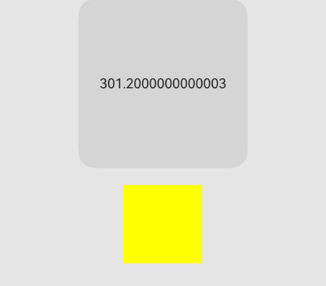
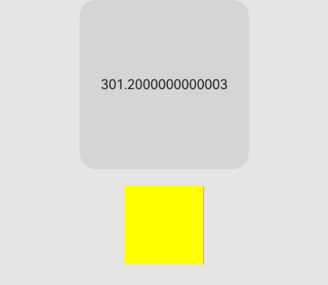

# 组件级像素取整
<!--Kit: ArkUI-->
<!--Subsystem: ArkUI-->
<!--Owner: @Lichtschein-->
<!--SE: @lanshouren-->
<!--TSE: @liuli0427-->

组件级像素取整的目标是将像素取整功能作为组件的属性，从而在组件层面实现系统像素取整的开启或关闭。

>  **说明：**
>
>  本模块从API Version 11开始支持。后续版本如有新增内容，则采用上角标单独标记该内容的起始版本。

## pixelRound

pixelRound(value: PixelRoundPolicy): T

指定当前组件在指定方向上的像素取整对齐方式，某方向不设置时默认在该方向进行四舍五入取整。

> **说明：**
> 
> 在API version 11，本接口采用半像素对齐方式（即0\~0.25取0，0.25\~0.75取0.5，0.75\~1.0取1）。从API version 12开始，本接口采用四舍五入的取整方式，并支持组件级关闭像素取整的能力。

正常计算时，上下方向与组件高度相对应，左右方向（镜像的起始方向称为左）与宽度相对应。为方便描述将两组方向称为左上和右下。

- 计算当前组件左上角坐标： 左上角相对父容器偏移量。
- 计算当前组件右下角坐标： 左上角相对于父容器偏移量 + 组件自身尺寸。
- 重新计算当前组件尺寸： 右下角坐标四舍五入取整 - 左上角坐标四舍五入取整。

**卡片能力：** 从API version 11开始，该接口支持在ArkTS卡片中使用。

**原子化服务API：** 从API version 11开始，该接口支持在原子化服务中使用。

**系统能力：** SystemCapability.ArkUI.ArkUI.Full

**参数：**

| 参数名 | 类型   | 必填 | 说明                                                         |
| ------ | ------ | ---- | ------------------------------------------------------------ |
| value | [PixelRoundPolicy](#pixelroundpolicy) | 是 | 指定当前组件边界取整策略。<br/>**说明：**<br/>该属性用于因浮点数绘制产生视觉异常的场景。取整结果不仅和组件的宽高有关，也与组件的位置有关。即使设置组件的宽高相同，由于以浮点数描述的组件位置不同，舍入后组件的最终宽高也可能不同。|

**返回值：**

| 类型 | 说明 |
| --- | --- |
|  T | 返回当前组件。 |

## PixelRoundPolicy

指定组件级像素取整的方向。

**卡片能力：** 从API version 11开始，该接口支持在ArkTS卡片中使用。

**原子化服务API：** 从API version 11开始，该接口支持在原子化服务中使用。

**系统能力：** SystemCapability.ArkUI.ArkUI.Full

| 名称 | 类型 | 只读 | 可选 | 说明 |
| -------- | -------- | -------- | -------- | -------- |
| start | [PixelRoundCalcPolicy](ts-appendix-enums.md#pixelroundcalcpolicy11) |否| 否 | 组件前部边界取整对齐方式。 |
| top | [PixelRoundCalcPolicy](ts-appendix-enums.md#pixelroundcalcpolicy11) |否| 否 | 组件上部边界取整对齐方式。 |
| end | [PixelRoundCalcPolicy](ts-appendix-enums.md#pixelroundcalcpolicy11) |否| 否 | 组件尾部边界取整对齐方式。 |
| bottom | [PixelRoundCalcPolicy](ts-appendix-enums.md#pixelroundcalcpolicy11) |否| 否 | 组件底部边界取整对齐方式。 |

## 常见问题

| 问题描述                                                     | 解决方法                                                     |
| ------------------------------------------------------------ | ------------------------------------------------------------ |
| 子容器100%填充父容器，在偏移量与大小刚好使父容器向上取整而子组件向下取整时，父容器会露出1px。 | 1.子组件向露出方向采用ceil取整方式。<br>2. 同时关闭父子组件的像素取整。 |
| 使用List组件并设置分割线，在特定场景下分割线消失。           | 1. 在List组件上设置2px的space。<br/>2. 关闭相应组件上的像素取整。 |
| 特定设备上出现重叠。                                         | 1. 在List组件上设置2px的space。<br>2. 关闭相应组件上的像素取整。<br>3. 通过@ohos.mediaquery（媒体查询）获取设备的dpi进行定制化适配。 |
| 组件渲染时带有动画且有轻微抖动。                             | 关闭相应组件上的像素取整。                                   |
| 容器内布局紧凑且子组件大小不一致。                           | 关闭相应组件上的像素取整。                                   |

## 示例

当父组件出现1px的缝隙时，应利用pixelRound来指导布局调整。

```ts
@Entry
@Component
struct PixelRoundExample {
    @State curWidth : number = 300;

    build() {
        Column() {
            Button(){
                Text(this.curWidth.toString())
            }
            .onClick(() => {
                this.curWidth += 0.1;
            })
            .height(200)
            .width(200)
            .backgroundColor('rgb(213, 213, 213)')

            Blank().height(20)

            Row() {
                Row() {
                }
                .width('100%')
                .height('100%')
                .backgroundColor(Color.Yellow)
                .pixelRound({
                    start : PixelRoundCalcPolicy.NO_FORCE_ROUND,
                    end : PixelRoundCalcPolicy.NO_FORCE_ROUND,
                })
            }
            .width(this.curWidth.toString() + 'px')
            .height('300.6px')
            .backgroundColor(Color.Red)
            .pixelRound({
                start : PixelRoundCalcPolicy.NO_FORCE_ROUND,
                end : PixelRoundCalcPolicy.NO_FORCE_ROUND,
            })
        }
        .width("100%")
        .height('100%')
        .backgroundColor('#ffe5e5e5')
    }
}
```

在本示例中，当取消像素取整功能（即不设置父子组件上的pixelRound属性）后，初始状态表现为正常。用户可通过点击按钮来增加父组件的宽度，当前示例父组件宽度为301.2px，以此测试在不同宽度下的表现差异。测试中会发现，当父组件达到特定宽度时，右侧会出现1px的显示。同样地，适当调整示例代码后，也可进行上下方向的测试，以观察类似现象。

**图1** 使用pixelRound指导布局效果图



**图2** 不使用pixelRound指导布局效果图


