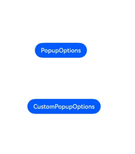
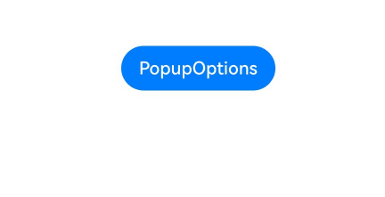
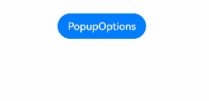
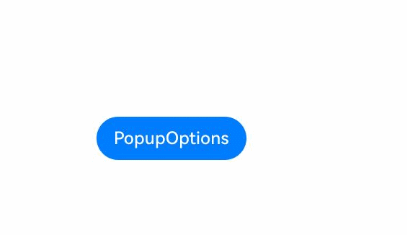

# Popup控制
<!--Kit: ArkUI-->
<!--Subsystem: ArkUI-->
<!--Owner: @liyi0309-->
<!--Designer: @liyi0309-->
<!--Tester: @lxl007-->
<!--Adviser: @HelloCrease-->

为组件绑定Popup气泡，并设置气泡内容、交互逻辑和显示状态。

>  **说明：**
>
>  - 从API version 7开始支持。后续版本如有新增内容，则采用上角标单独标记该内容的起始版本。
>
>  - Popup气泡的显示状态在onStateChange事件回调中反馈，其显隐与组件的创建或销毁无强对应关系。
>
>  - Popup气泡的高度为当前窗口高度 - 上下安全区域高度（状态栏、导航条）- 80vp。
>
>  - 多个气泡同时弹出时，子窗内显示的气泡比主窗内显示的气泡层级高，所处窗口相同时，后面弹出的气泡层级比先弹出的气泡层级高。
>
>  - 2in1设备默认有双描边，其他设备默认无双描边且不支持双描边。
>
>  - 子窗弹窗里不能再弹出子窗弹窗，例如bindPopup设置了showInSubWindow为true时，则不能再弹出另一个设置了showInSubWindow为true的弹窗。

## bindPopup

bindPopup(show: boolean, popup: PopupOptions | CustomPopupOptions): T

为组件绑定Popup气泡。

>  **说明：**
>
>  不支持在输入法类型窗口中使用子窗（showInSubwindow为true）的bindPopup，详情见输入法框架的约束与限制说明[createPanel](../../apis-ime-kit/js-apis-inputmethodengine.md#createpanel10-1)。

**原子化服务API：** 从API version 11开始，该接口支持在原子化服务中使用。

**系统能力：** SystemCapability.ArkUI.ArkUI.Full

**参数：** 

| 参数名 | 类型                                                         | 必填 | 说明                                                         |
| ------ | ------------------------------------------------------------ | ---- | ------------------------------------------------------------ |
| show   | boolean                                                      | 是   | 气泡显示状态。Popup气泡必须等待页面全部构建完成才能展示，因此show不能在页面构建中设置为true，否则会导致Popup气泡显示位置及形状错误。该参数从API version 18开始支持[!!语法](../../../ui/state-management/arkts-new-binding.md#系统组件参数双向绑定)双向绑定变量。<br/>，true：弹出气泡；false：关闭气泡。<br/>默认值：false|
| popup  | [PopupOptions](#popupoptions类型说明)&nbsp;\|&nbsp;[CustomPopupOptions](#custompopupoptions8类型说明)<sup>8+</sup> | 是   | 配置弹出气泡的参数。                                         |

**返回值：** 

|类型|说明|
|---|---|
|T|返回当前组件。|

## PopupOptions类型说明

基础气泡的信息。

**系统能力：** SystemCapability.ArkUI.ArkUI.Full

| 名称                                  | 类型                                                         | 只读 | 可选 | 说明                                                      |
| ------------------------------------- | ------------------------------------------------------------ | ---- | ------------------------------------------------------------ | ------------------------------------------------------------ |
| message                               | string                                                       | 否  | 否  | 气泡信息内容。<br />**原子化服务API：** 从API version 11开始，该接口支持在原子化服务中使用。                                               |
| placementOnTop<sup>(deprecated)</sup> | boolean                                                      | 否   | 是 | 是否在组件上方显示，默认值为false。<br />**说明：**<br />从 API version 10 开始废弃，建议使用`placement`替代。 |
| primaryButton                         | {<br/>value:&nbsp;string,<br/>action:&nbsp;()&nbsp;=&gt;&nbsp;void<br/>} | 否   | 是  | 第一个按钮。<br/>value：气泡里主按钮的文本。<br/>action：点击主按钮的回调函数。<br />**原子化服务API：** 从API version 11开始，该接口支持在原子化服务中使用。 |
| secondaryButton                       | {<br/>value:&nbsp;string,<br/>action:&nbsp;()&nbsp;=&gt;&nbsp;void<br/>} | 否   | 是  | 第二个按钮。<br/>value：气泡里辅助按钮的文本。<br/>action：点击辅助按钮的回调函数。<br />**原子化服务API：** 从API version 11开始，该接口支持在原子化服务中使用。 |
| onStateChange                         | (event:&nbsp;{&nbsp;isVisible:&nbsp;boolean&nbsp;})&nbsp;=&gt;&nbsp;void | 否   | 是  | 气泡状态变化事件回调，参数isVisible为气泡的显示状态。返回true时，表示气泡从关闭到打开，返回false时，表示气泡从打开到关闭。<br />**原子化服务API：** 从API version 11开始，该接口支持在原子化服务中使用。    |
| arrowOffset<sup>9+</sup>              | [Length](ts-types.md#length)                                 | 否   | 是  | Popup箭头在气泡处的偏移。箭头在气泡上下方时，数值为0表示箭头居最左侧，偏移量为箭头至最左侧的距离，默认居中。箭头在气泡左右侧时，偏移量为箭头至最上侧的距离，默认居中。显示在屏幕边缘时，气泡会自动左右偏移，数值为0时箭头始终指向绑定组件。<br />**说明：** <br/>1. 没设置arrowOffset的情况下，气泡箭头与四个角的距离不能小于圆角半径。<br/>2. 如果设置了arrowPointPosition属性，arrowOffset属性将不生效。<br/>**原子化服务API：** 从API version 11开始，该接口支持在原子化服务中使用。 |
| showInSubWindow<sup>9+</sup>          | boolean                                                      | 否   | 是  | 取值为true时，气泡会显示在创建的子窗里，取值为false时，气泡会显示在对应的主窗中。<br />默认值：false<br />**原子化服务API：** 从API version 11开始，该接口支持在原子化服务中使用。                        |
| mask<sup>10+</sup>                    | boolean&nbsp;\|&nbsp;{ color : [ResourceColor](ts-types.md#resourcecolor) }| 否   | 是  | 设置气泡是否有遮罩层及遮罩颜色。如果设置为false，则不显示遮罩层；如果设置为true，则显示透明色遮罩层；如果设置为Color，则显示指定颜色的遮罩层。<br/>默认值：true<br />**原子化服务API：** 从API version 11开始，该接口支持在原子化服务中使用。 |
| messageOptions<sup>10+</sup>          | [PopupMessageOptions](#popupmessageoptions10类型说明)        | 否   | 是  | 设置气泡信息文本参数。<br />**原子化服务API：** 从API version 11开始，该接口支持在原子化服务中使用。                                       |
| targetSpace<sup>10+</sup>             | [Length](ts-types.md#length)                                 | 否   | 是  | 设置Popup与目标的间距。不支持设置百分比。<br/>默认值：8<br/>单位：vp<br />**原子化服务API：** 从API version 11开始，该接口支持在原子化服务中使用。                             |
| placement<sup>10+</sup>               | [Placement](ts-appendix-enums.md#placement8)                 | 否   | 是  | 设置Popup组件相对于目标的显示位置，默认值为Placement.Bottom。<br />如果同时设置了`placementOnTop`和`placement`，则以`placement`的设置为准。<br />**原子化服务API：** 从API version 11开始，该接口支持在原子化服务中使用。 |
| offset<sup>10+</sup>                  | [Position](ts-types.md#position)                            | 否   | 是  | 设置Popup组件相对于placement设置的显示位置的偏移。<br/>默认值：{ x: 0, y: 0 }<br/>单位：vp<br />**说明：**<br />不支持设置百分比。<br />**原子化服务API：** 从API version 11开始，该接口支持在原子化服务中使用。 |
| enableArrow<sup>10+</sup>             | boolean                                                      | 否   | 是  | 设置是否显示箭头。值为true时显示箭头，值为false时不显示箭头。<br/>默认值：true<br/>**说明：** <br/>当页面可用空间无法让气泡完全避让时，气泡会覆盖到组件上并且不显示箭头。<br />**原子化服务API：** 从API version 11开始，该接口支持在原子化服务中使用。 |
| popupColor<sup>11+</sup>              | [Color](ts-appendix-enums.md#color) &nbsp;\|&nbsp;string&nbsp;\|&nbsp; [Resource](ts-types.md#resource)&nbsp; \|&nbsp;number | 否   | 是  | 提示气泡的颜色。如需去除模糊背景填充效果，需将backgroundBlurStyle设置为BlurStyle.NONE。<br/>默认值：透明色[TRANSPARENT](ts-appendix-enums.md#color)加模糊背景填充效果[COMPONENT_ULTRA_THICK](ts-universal-attributes-background.md#blurstyle9)。<br/>**原子化服务API：** 从API version 12开始，该接口支持在原子化服务中使用。 |
| autoCancel<sup>11+</sup>              | boolean                                                      | 否   | 是  | 页面有操作时，值为true表示自动关闭气泡，值为false表示气泡不会自动关闭。<br/>默认值：true <br/>**原子化服务API：** 从API version 12开始，该接口支持在原子化服务中使用。 |
| width<sup>11+</sup>                   | [Dimension](ts-types.md#dimension10)                         | 否   | 是  | 气泡宽度。<br/>**原子化服务API：** 从API version 12开始，该接口支持在原子化服务中使用。 |
| arrowPointPosition<sup>11+</sup>      | [ArrowPointPosition](ts-appendix-enums.md#arrowpointposition11) | 否   | 是  | 气泡箭头相对于父组件显示位置，气泡箭头在垂直和水平方向上有 ”Start“、”Center“、”End“三个位置点可选。以上所有位置点均位于父组件区域的范围内，不会超出父组件的边界范围。<br/>默认值：ArrowPointPosition.CENTER<br/>**原子化服务API：** 从API version 12开始，该接口支持在原子化服务中使用。 |
| arrowWidth<sup>11+</sup>             | [Dimension](ts-types.md#dimension10)                  | 否   | 是  | 设置箭头宽度。若所设置的箭头宽度超过所在边的长度减去两倍的气泡圆角大小，则不绘制气泡箭头。<br/>默认值：16<br/>单位：vp<br/>**说明：**<br />不支持设置百分比。<br/>**原子化服务API：** 从API version 12开始，该接口支持在原子化服务中使用。                          |
| arrowHeight<sup>11+</sup>             | [Dimension](ts-types.md#dimension10)                  | 否   | 是  | 设置箭头高度。<br/>默认值：8<br/>单位：vp<br/>**说明：**<br />不支持设置百分比。<br/>**原子化服务API：** 从API version 12开始，该接口支持在原子化服务中使用。                          |
| radius<sup>11+</sup>             | [Dimension](ts-types.md#dimension10)                  | 否   | 是  | 设置气泡圆角半径。<br/>默认值：20<br/>单位：vp<br/>**原子化服务API：** 从API version 12开始，该接口支持在原子化服务中使用。                          |
| shadow<sup>11+</sup>             | [ShadowOptions](ts-universal-attributes-image-effect.md#shadowoptions对象说明)&nbsp;\|&nbsp;[ShadowStyle](ts-universal-attributes-image-effect.md#shadowstyle10枚举说明)    | 否   | 是  | 设置气泡阴影。<br/>默认值：ShadowStyle.OUTER_DEFAULT_MD <br/>**原子化服务API：** 从API version 12开始，该接口支持在原子化服务中使用。     |
| backgroundBlurStyle<sup>11+</sup> | [BlurStyle](ts-universal-attributes-background.md#blurstyle9) | 否 | 是 | 设置气泡模糊背景参数。<br />默认值：BlurStyle.COMPONENT_ULTRA_THICK<br/>**原子化服务API：** 从API version 12开始，该接口支持在原子化服务中使用。 |
| transition<sup>12+</sup> | [TransitionEffect](ts-transition-animation-component.md#transitioneffect10对象说明) | 否 | 是 | 自定义设置Popup气泡显示和退出的动画效果。<br/>**说明：**<br/>1. 不设置时使用默认的显示/退出动效。<br/>2. 显示动效中按back键，打断显示动效，执行退出动效，动画效果为显示动效与退出动效的曲线叠加后的效果。<br/>3. 退出动效中按back键，不会打断退出动效，back键不被响应。 <br/>**原子化服务API：** 从API version 12开始，该接口支持在原子化服务中使用。|
| onWillDismiss<sup>12+</sup>           | boolean \| Callback\<[DismissPopupAction](#dismisspopupaction12类型说明)> | 否   | 是  | 设置Popup交互式关闭拦截开关及拦截回调函数，默认值为true，Popup响应点击、侧滑（左滑/右滑）、三键back。<br />1. 当为boolean类型时，如果设置为false，则不响应点击、侧滑（左滑/右滑）、三键back、路由跳转或键盘ESC退出事件，仅当设置“气泡显示状态”参数show值为false时才退出；如果设置为true，则正常响应退出事件；<br />2. 如果设置为函数类型，则拦截退出事件且执行回调函数。侧滑（左滑/右滑）、三键back、路由跳转或键盘ESC在回调函数中返回的reason为PRESS_BACK，点击为TOUCH_OUTSIDE。<br />**说明：**<br />在onWillDismiss回调中，不能再做onWillDismiss拦截。 <br/>**原子化服务API：** 从API version 12开始，该接口支持在原子化服务中使用。 |
| followTransformOfTarget<sup>13+</sup>          | boolean | 否   | 是  | 气泡绑定的宿主组件或其宿主组件的父容器添加了旋转、缩放等变换时，值为true表示气泡可以拿到变换后宿主的位置，显示到相应位置，值为false表示气泡拿不到宿主变换后的位置，可能显示异常。<br/>默认值：false <br/>**原子化服务API：** 从API version 13开始，该接口支持在原子化服务中使用。 |
| keyboardAvoidMode<sup>15+</sup>          | [KeyboardAvoidMode](#keyboardavoidmode12枚举说明) | 否   | 是  | 气泡是否避让软键盘，默认不避让。设置为避让后，气泡显示空间不足时，由原先居中覆盖父组件的方式改为平移覆盖父组件，且气泡箭头不指向宿主时，不再显示箭头。<br/>默认值：KeyboardAvoidMode.NONE <br/>**原子化服务API：** 从API version 15开始，该接口支持在原子化服务中使用。 |
|  enableHoverMode<sup>18+</sup>| boolean  | 否   | 是  | Popup组件是否响应悬停态（半折叠状态）变化，即在悬停态下是否触发避让折痕区域。<br/>默认值：false，2in1设备默认为true。未设置或者值为非法值时，生效默认值。<br/>**说明：** <br/>1. 如果Popup的弹出位置在悬停态折痕区域，Popup组件不会响应悬停态。<br/>2. 2in1设备从API version 20开始生效。<br/>3. 2in1设备仅在窗口瀑布模式下生效。<br />**原子化服务API：** 从API version 18开始，该接口支持在原子化服务中使用。 |
| outlineWidth<sup>20+</sup>| [Dimension](ts-types.md#dimension10)  | 否   | 是  | 设置Popup组件外描边的宽度。<br />默认值：1 <br />单位：vp<br />**说明：** <br />1. 不支持设置百分比。<br />2. 在没有设置Popup组件外描边的情况下，该接口需要和outlineLinearGradient配合使用。<br />**原子化服务API：** 从API version 20开始，该接口支持在原子化服务中使用。 |
| borderWidth<sup>20+</sup>| [Dimension](ts-types.md#dimension10)  | 否   | 是  | 设置Popup组件内描边的宽度。<br />默认值：1 <br />单位：vp<br />**说明：** <br />1. 不支持设置百分比。<br />2. 在没有设置Popup组件内描边的情况下，该接口需要和borderLinearGradient配合使用。<br />**原子化服务API：** 从API version 20开始，该接口支持在原子化服务中使用。 |
| outlineLinearGradient<sup>20+</sup>| [PopupBorderLinearGradient](#popupborderlineargradient20类型说明)  | 否   | 是  | 设置Popup组件外描边线性渐变的颜色。<br />**说明：** <br />1. outlineLinearGradient不设置或者设置为null、undefined时，外描边没有线性渐变效果。<br />2. outlineLinearGradient设置时，direction默认值是：GradientDirection.Bottom。<br />**原子化服务API：** 从API version 20开始，该接口支持在原子化服务中使用。 |
| borderLinearGradient<sup>20+</sup>| [PopupBorderLinearGradient](#popupborderlineargradient20类型说明)  | 否   | 是  | 设置Popup组件内描边线性渐变的颜色。<br />**说明：** <br />1. borderLinearGradient不设置或者设置为null、undefined时，内描边没有线性渐变效果。<br />2. borderLinearGradient设置时，direction默认值是：GradientDirection.Bottom。<br />**原子化服务API：** 从API version 20开始，该接口支持在原子化服务中使用。 |
| avoidTarget<sup>20+</sup>          | [AvoidanceMode](ts-basic-components-select.md#avoidancemode19枚举说明) | 否   | 是  | 设置Popup避让时是否覆盖指向组件。<br/>默认值：AvoidanceMode.COVER_TARGET <br/>**原子化服务API：** 从API version 20开始，该接口支持在原子化服务中使用。 |

## PopupMessageOptions<sup>10+</sup>类型说明

气泡文本的样式。

**原子化服务API：** 从API version 11开始，该接口支持在原子化服务中使用。

**系统能力：** SystemCapability.ArkUI.ArkUI.Full

| 名称      | 类型                                       | 只读 | 可选 | 说明                                                         |
| --------- | ------------------------------------------ | ---- | ---- | ------------------------------------------------------------ |
| textColor | [ResourceColor](ts-types.md#resourcecolor) | 否   | 是   | 设置气泡信息文本颜色。                                       |
| font      | [Font](ts-types.md#font)                   | 否   | 是   | 设置气泡信息字体属性。<br/>**说明：** <br/>不支持设置family。 |

## DismissPopupAction<sup>12+</sup>类型说明

气泡关闭的信息。

**原子化服务API：** 从API version 12开始，该接口支持在原子化服务中使用。

**系统能力：** SystemCapability.ArkUI.ArkUI.Full

| 名称    | 类型                                      | 只读 | 可选 | 说明                                                         |
| ------- | ----------------------------------------- | ---- | ---- | ------------------------------------------------------------ |
| dismiss | Callback\<void>                                 | 否   | 否   | Popup关闭回调函数。开发者需要退出时调用，不需要退出时无需调用。 |
| reason  | [DismissReason](#dismissreason12枚举说明) | 否   | 否   | 关闭原因，返回本次拦截Popup消失的事件原因。                  |

## DismissReason<sup>12+</sup>枚举说明

关闭原因类型。

**系统能力：** SystemCapability.ArkUI.ArkUI.Full

| 名称          | 值   | 说明                                                       |
| ------------- | ---- | ------------------------------------------------------------ |
| PRESS_BACK    | 0    | 点击三键back、侧滑（左滑/右滑）、键盘ESC。<br/>**原子化服务API：** 从API version 12开始，该接口支持在原子化服务中使用。|
| TOUCH_OUTSIDE | 1    | 点击遮障层时。<br/>**原子化服务API：** 从API version 12开始，该接口支持在原子化服务中使用。 |
| CLOSE_BUTTON  | 2    | 点击关闭按钮。<br/>**原子化服务API：** 从API version 12开始，该接口支持在原子化服务中使用。 |
| SLIDE_DOWN    | 3    | 下拉关闭。<br/>**说明：** <br/>该接口仅支持在[半模态转场](ts-universal-attributes-sheet-transition.md)中使用。<br/>**原子化服务API：** 从API version 12开始，该接口支持在原子化服务中使用。 |
| SLIDE<sup>20+</sup>    | 4    | 侧滑（左滑/右滑）关闭。默认表示向右滑动关闭，镜像场景表示向左滑动关闭，不支持选择向左或向右滑动。<br/>**说明：** <br/>该接口仅支持在[半模态转场](ts-universal-attributes-sheet-transition.md)中使用。<br/>**原子化服务API：** 从API version 20开始，该接口支持在原子化服务中使用。 |

## CustomPopupOptions<sup>8+</sup>类型说明

弹出自定义气泡的信息。

**系统能力：** SystemCapability.ArkUI.ArkUI.Full

| 名称                           | 类型                                       | 只读 | 可选 | 说明                                       |
| ---------------------------- | ---------------------------------------- | ---- | ---------------------------------------- | ---------------------------------------- |
| builder                      | [CustomBuilder](ts-types.md#custombuilder8) | 否   | 否   | 提示气泡内容的构造器。<br />**说明：**<br />Popup为通用属性，自定义Popup中不支持再次弹出Popup。对builder下的第一层容器组件不支持使用position属性，如果使用将导致气泡不显示。builder中若使用自定义组件，自定义组件的aboutToAppear和aboutToDisappear生命周期与Popup气泡的显隐无关，不能使用其生命周期判断Popup气泡的显隐。<br />**原子化服务API：** 从API version 11开始，该接口支持在原子化服务中使用。                              |
| placement                    | [Placement](ts-appendix-enums.md#placement8) | 否    | 是   | 气泡组件优先显示的位置，当前位置显示不下时，会自动调整位置。<br/>默认值：Placement.Bottom<br />**原子化服务API：** 从API version 11开始，该接口支持在原子化服务中使用。 |
| popupColor                   | [Color](ts-appendix-enums.md#color)&nbsp;\|&nbsp;string&nbsp;\|&nbsp;[Resource](ts-types.md#resource)&nbsp;\|&nbsp;number | 否    | 是   | 提示气泡的颜色。如需去除模糊背景填充效果，需将backgroundBlurStyle设置为BlurStyle.NONE。<br/>API version 10，默认值：'#4d4d4d'<br />API version 11及以后，默认值：透明色[TRANSPARENT](ts-appendix-enums.md#color)加模糊背景填充效果[COMPONENT_ULTRA_THICK](ts-universal-attributes-background.md#blurstyle9)<br />**原子化服务API：** 从API version 11开始，该接口支持在原子化服务中使用。 |
| enableArrow                  | boolean                                  | 否    | 是   | 是否显示箭头。值为true时显示箭头，值为false时不显示箭头。<br/>从API version 9开始，如果箭头所在方位侧的气泡长度不足以显示下箭头，则会默认不显示箭头。比如：placement设置为Left，此时如果气泡高度小于箭头的宽度（32vp）与气泡圆角两倍（48vp）之和（80vp），则实际不会显示箭头。<br/>默认值：true<br />**原子化服务API：** 从API version 11开始，该接口支持在原子化服务中使用。 |
| autoCancel                   | boolean                                  | 否    | 是   | 页面有操作时，值为true表示自动关闭气泡，值为false表示气泡不会自动关闭。<br/>默认值：true<br />**说明：**<br />如果要实现点击气泡内消失需要在builder中先放一个布局组件，然后再将Popup高级组件放在布局组件里面，再在布局组件的onClick事件中修改的传入bindPopup的变量（show:&nbsp;boolean）值。<br />**原子化服务API：** 从API version 11开始，该接口支持在原子化服务中使用。 |
| onStateChange                | (event:&nbsp;{&nbsp;isVisible:&nbsp;boolean&nbsp;})&nbsp;=&gt;&nbsp;void | 否    | 是   | 气泡状态变化事件回调，参数为气泡的显示状态。返回true时，表示气泡从关闭到打开，返回false时，表示气泡从打开到关闭。<br />**原子化服务API：** 从API version 11开始，该接口支持在原子化服务中使用。                 |
| arrowOffset<sup>9+</sup>     | [Length](ts-types.md#length) | 否    | 是   | Popup箭头在气泡处的偏移。箭头在气泡上下方时，数值为0表示箭头居最左侧，偏移量为箭头至最左侧的距离，默认居中。箭头在气泡左右侧时，偏移量为箭头至最上侧的距离，默认居中。显示在屏幕边缘时，气泡会自动左右偏移，数值为0时箭头始终指向绑定组件。<br />**说明：** <br/>1. 没设置arrowOffset的情况下，气泡箭头与四个角的距离不能小于圆角半径。<br/>2. 如果设置了arrowPointPosition属性，arrowOffset属性将不生效。<br />**原子化服务API：** 从API version 11开始，该接口支持在原子化服务中使用。 |
| showInSubWindow<sup>9+</sup> | boolean                                  | 否    | 是   | 取值为true时，气泡会显示在创建的子窗里，取值为false时，气泡会显示在对应的主窗中。<br />默认值：false<br />**原子化服务API：** 从API version 11开始，该接口支持在原子化服务中使用。                    |
| maskColor<sup>(deprecated)</sup> |[Color](ts-appendix-enums.md#color)&nbsp;\|&nbsp;string&nbsp;\|&nbsp;[Resource](ts-types.md#resource)&nbsp;\|&nbsp;&nbsp;number  | 否   | 是  | 设置气泡遮罩层颜色。<br />**说明：**<br />从 API version 10 开始废弃，建议使用`mask`替代。 |
| mask<sup>10+</sup>           | boolean&nbsp;\|&nbsp;{ color : [ResourceColor](ts-types.md#resourcecolor) }| 否    | 是   | 设置气泡是否有遮罩层及遮罩颜色。如果设置为false，则没有遮罩层；如果设置为true，则设置有遮罩层并且颜色为透明色；如果设置为Color，则为遮罩层的颜色。默认值：true<br />**原子化服务API：** 从API version 11开始，该接口支持在原子化服务中使用。 |
| targetSpace<sup>10+</sup>    | [Length](ts-types.md#length)             | 否    | 是   | 设置Popup与目标的间距。不支持设置百分比。<br/>默认值：8<br/>单位：vp<br />**原子化服务API：** 从API version 11开始，该接口支持在原子化服务中使用。                  |
| offset<sup>10+</sup>         | [Position](ts-types.md#position)                            | 否   | 是  | 设置Popup组件相对于placement设置的显示位置的偏移。<br />**说明：**<br />不支持设置百分比。<br/>默认值：{ x: 0, y: 0 }<br/>单位：vp<br />**原子化服务API：** 从API version 11开始，该接口支持在原子化服务中使用。 |
| width<sup>11+</sup> | [Dimension](ts-types.md#dimension10) | 否 | 是 | 气泡宽度。<br/>**原子化服务API：** 从API version 12开始，该接口支持在原子化服务中使用。 |
| arrowPointPosition<sup>11+</sup> | [ArrowPointPosition](ts-appendix-enums.md#arrowpointposition11) | 否 | 是 | 气泡箭头相对于父组件显示位置，气泡箭头在垂直和水平方向上有 ”Start“、”Center“、”End“三个位置点可选。以上所有位置点均位于父组件区域的范围内，不会超出父组件的边界范围。<br/>默认值：ArrowPointPosition.CENTER<br/>**原子化服务API：** 从API version 12开始，该接口支持在原子化服务中使用。 |
| arrowWidth<sup>11+</sup>             | [Dimension](ts-types.md#dimension10)                                                      | 否   | 是  | 设置箭头宽度。若所设置的箭头宽度超过所在边的长度减去两倍的气泡圆角大小，则不绘制气泡箭头。<br/>默认值：16<br/>单位：vp<br />**说明：**<br />不支持设置百分比。<br/>**原子化服务API：** 从API version 12开始，该接口支持在原子化服务中使用。                          |
| arrowHeight<sup>11+</sup>             | [Dimension](ts-types.md#dimension10)                  | 否   | 是  | 设置箭头高度。<br/>默认值：8<br/>单位：vp<br />**说明：**<br />不支持设置百分比。<br/>**原子化服务API：** 从API version 12开始，该接口支持在原子化服务中使用。                          |
| radius<sup>11+</sup>             | [Dimension](ts-types.md#dimension10)                  | 否   | 是  | 设置气泡圆角半径。<br/>默认值：20<br/>单位：vp<br/>**原子化服务API：** 从API version 12开始，该接口支持在原子化服务中使用。                          |
| shadow<sup>11+</sup>             | [ShadowOptions](ts-universal-attributes-image-effect.md#shadowoptions对象说明)&nbsp;\|&nbsp;[ShadowStyle](ts-universal-attributes-image-effect.md#shadowstyle10枚举说明)    | 否   | 是  | 设置气泡阴影。<br/>默认值：ShadowStyle.OUTER_DEFAULT_MD <br/>**原子化服务API：** 从API version 12开始，该接口支持在原子化服务中使用。     |
| backgroundBlurStyle<sup>11+</sup> | [BlurStyle](ts-universal-attributes-background.md#blurstyle9) | 否 | 是 | 设置气泡模糊背景参数。<br />默认值：BlurStyle.COMPONENT_ULTRA_THICK <br/>**原子化服务API：** 从API version 12开始，该接口支持在原子化服务中使用。|
| focusable<sup>11+</sup> | boolean | 否 | 是 | 设置气泡弹出后是否获焦。值为true时，气泡可以获焦，值为false时，气泡不会获焦。<br />默认值：false <br/>**原子化服务API：** 从API version 12开始，该接口支持在原子化服务中使用。 |
| transition<sup>12+</sup> | [TransitionEffect](ts-transition-animation-component.md#transitioneffect10对象说明) | 否 | 是 | 自定义设置Popup气泡显示和退出的动画效果。<br/>**说明：**<br/>如果不设置，则使用默认的显示/退出动效。<br/>2. 显示动效中按back键，打断显示动效，执行退出动效，动画效果为显示动效与退出动效的曲线叠加后的效果。<br/>3. 退出动效中按back键，不会打断退出动效，退出动效继续执行，back键不被响应。 <br/>**原子化服务API：** 从API version 12开始，该接口支持在原子化服务中使用。|
| onWillDismiss<sup>12+</sup>           | boolean \| Callback\<[DismissPopupAction](#dismisspopupaction12类型说明)> | 否   | 是  | 设置Popup交互式关闭拦截开关及拦截回调函数，默认值为true，Popup响应点击、侧滑（左滑/右滑）、三键back。<br />1. 当为boolean类型时，如果设置为false，则不响应点击、侧滑（左滑/右滑）、三键back、路由跳转或键盘ESC退出事件，仅当设置“气泡显示状态”参数show值为false时才退出；如果设置为true，则正常响应退出事件；<br />2. 如果设置为函数类型，则拦截退出事件且执行回调函数。侧滑（左滑/右滑）、三键back、路由跳转或键盘ESC在回调函数中返回的reason为PRESS_BACK，点击为TOUCH_OUTSIDE。<br />**说明：**<br />在onWillDismiss回调中，不能再做onWillDismiss拦截。 <br/>**原子化服务API：** 从API version 12开始，该接口支持在原子化服务中使用。|
| followTransformOfTarget<sup>13+</sup>          | boolean | 否   | 是  | 气泡绑定的宿主组件或其宿主组件的父容器添加了旋转、缩放等变换时，值为true表示气泡可以拿到变换后宿主的位置，显示到相应位置，值为false表示气泡拿不到宿主变换后的位置，可能显示异常。<br/>默认值：false <br/>**原子化服务API：** 从API version 13开始，该接口支持在原子化服务中使用。 |
| keyboardAvoidMode<sup>15+</sup>          | [KeyboardAvoidMode](#keyboardavoidmode12枚举说明) | 否   | 是  | 气泡是否避让软键盘，默认不避让。设置为避让后，气泡显示空间不足时，由原先居中覆盖父组件的方式改为平移覆盖父组件，且气泡箭头不指向宿主时，不再显示箭头。<br/>默认值：KeyboardAvoidMode.NONE <br/>**原子化服务API：** 从API version 15开始，该接口支持在原子化服务中使用。 |
|enableHoverMode<sup>18+</sup>  | boolean  | 否   | 是  |  Popup组件是否响应悬停态（半折叠状态）变化，即在悬停态下是否触发避让折痕区域。<br/>默认值：false，2in1设备默认为true。未设置或者值为非法值时，生效默认值。<br/>**说明：** <br/>1. 如果Popup的弹出位置在悬停态折痕区域，Popup组件不会响应悬停态。<br/>2. 2in1设备从API version 20开始生效。<br/>3. 2in1设备仅在窗口瀑布模式下生效。<br />**原子化服务API：** 从API version 18开始，该接口支持在原子化服务中使用。 |
| outlineWidth<sup>20+</sup>| [Dimension](ts-types.md#dimension10)  | 否   | 是  | 设置Popup组件外描边的宽度。<br />默认值：1 <br />单位：vp<br />**说明：** <br />1. 不支持设置百分比。<br />2. 在没有设置Popup组件外描边的情况下，该接口需要和outlineLinearGradient配合使用。<br />**原子化服务API：** 从API version 20开始，该接口支持在原子化服务中使用。 |
| borderWidth<sup>20+</sup>| [Dimension](ts-types.md#dimension10)  | 否   | 是  | 设置Popup组件内描边的宽度。<br />默认值：1 <br />单位：vp<br />**说明：** <br />1. 不支持设置百分比。<br />2. 在没有设置Popup组件内描边的情况下，该接口需要和borderLinearGradient配合使用。<br />**原子化服务API：** 从API version 20开始，该接口支持在原子化服务中使用。 |
| outlineLinearGradient<sup>20+</sup>| [PopupBorderLinearGradient](#popupborderlineargradient20类型说明)  | 否   | 是  | 设置Popup组件外描边线性渐变的颜色。<br />**说明：** <br />1. outlineLinearGradient不设置或者设置为null、undefined时，外描边没有线性渐变效果。<br />2. outlineLinearGradient设置时，direction默认值是：GradientDirection.Bottom。<br />**原子化服务API：** 从API version 20开始，该接口支持在原子化服务中使用。 |
| borderLinearGradient<sup>20+</sup>| [PopupBorderLinearGradient](#popupborderlineargradient20类型说明)  | 否   | 是  | 设置Popup组件内描边线性渐变的颜色。<br />**说明：** <br />1. borderLinearGradient不设置或者设置为null、undefined时，内描边没有线性渐变效果。<br />2. borderLinearGradient设置时，direction默认值是：GradientDirection.Bottom。<br />**原子化服务API：** 从API version 20开始，该接口支持在原子化服务中使用。 |
| avoidTarget<sup>20+</sup>          | [AvoidanceMode](ts-basic-components-select.md#avoidancemode19枚举说明) | 否   | 是  | 设置Popup避让时是否覆盖指向组件。<br />**说明：** <br />设置avoidTarget为AvoidanceMode.AVOID_AROUND_TARGET时，气泡在剩余显示空间不足的情况下会进行压缩，此时气泡内容需结合Scroll使用，否则气泡内容会出现遮挡。<br/>默认值：AvoidanceMode.COVER_TARGET <br/>**原子化服务API：** 从API version 20开始，该接口支持在原子化服务中使用。 |

## PopupCommonOptions<sup>18+</sup>类型说明

配置弹出气泡的参数。使用[UIContext](../arkts-apis-uicontext-uicontext.md)中的[getPromptAction()](../arkts-apis-uicontext-uicontext.md#getpromptaction)方法获取到[PromptAction](../arkts-apis-uicontext-promptaction.md)对象，再通过该对象调用[openPopup](../arkts-apis-uicontext-promptaction.md#openpopup18)和[updatePopup](../arkts-apis-uicontext-promptaction.md#updatepopup18)时options的属性。

**系统能力：** SystemCapability.ArkUI.ArkUI.Full

| 名称                           | 类型                                       | 只读 | 可选 | 说明                                       |
| ---------------------------- | ---------------------------------------- | ---- | ---------------------------------------- | ---------------------------------------- |
| placement                    | [Placement](ts-appendix-enums.md#placement8) | 否    | 是   | 气泡组件优先显示的位置，当前位置显示不下时，会自动调整位置。<br/>默认值：Placement.Bottom <br/>**原子化服务API：** 从API version 18开始，该接口支持在原子化服务中使用。|
| popupColor                   | [ResourceColor](ts-types.md#resourcecolor) | 否    | 是   | 提示气泡的颜色。如需去除模糊背景填充效果，需将backgroundBlurStyle设置为BlurStyle.NONE。默认值：透明色[TRANSPARENT](ts-appendix-enums.md#color)加模糊背景填充效果[COMPONENT_ULTRA_THICK](ts-universal-attributes-background.md#blurstyle9)。 <br/>**原子化服务API：** 从API version 18开始，该接口支持在原子化服务中使用。|
| enableArrow                  | boolean                                  | 否    | 是   | 是否显示箭头。值为true时显示箭头，值为false时不显示箭头。<br/>如果箭头所在方位侧的气泡长度不足以显示下箭头，则会默认不显示箭头。比如：placement设置为Left，此时如果气泡高度小于箭头的宽度（32vp）与气泡圆角两倍（48vp）之和（80vp），则实际不会显示箭头。<br/>默认值：true <br/>**原子化服务API：** 从API version 18开始，该接口支持在原子化服务中使用。|
| autoCancel                   | boolean                                  | 否    | 是   | 页面有操作时，值为true表示自动关闭气泡，值为false表示气泡不会自动关闭。<br/>默认值：true <br/>**原子化服务API：** 从API version 18开始，该接口支持在原子化服务中使用。|
| onStateChange                | [PopupStateChangeCallback](#popupstatechangecallback18) | 否    | 是   | 气泡状态变化事件回调。<br />**说明：**<br />不支持通过[updatePopup](../arkts-apis-uicontext-promptaction.md#updatepopup18)进行更新。<br/>**原子化服务API：** 从API version 18开始，该接口支持在原子化服务中使用。 |
| arrowOffset     | [Length](ts-types.md#length) | 否    | 是   | Popup箭头在气泡处的偏移。箭头在气泡上下方时，数值为0表示箭头居最左侧，偏移量为箭头至最左侧的距离，默认居中。箭头在气泡左右侧时，偏移量为箭头至最上侧的距离，默认居中。显示在屏幕边缘时，气泡会自动左右偏移，数值为0时箭头始终指向绑定组件。<br />**说明：** <br/>1. 没设置arrowOffset的情况下，气泡箭头与四个角的距离不能小于圆角半径。<br/>2. 如果设置了arrowPointPosition属性，arrowOffset属性将不生效。<br/>**原子化服务API：** 从API version 18开始，该接口支持在原子化服务中使用。 |
| showInSubWindow | boolean                                  | 否    | 是   | 取值为true时，气泡会显示在创建的子窗里，取值为false时，气泡会显示在对应的主窗中。<br />默认值：false<br />**说明：**<br />不支持通过[updatePopup](../arkts-apis-uicontext-promptaction.md#updatepopup18)进行更新。<br/>**原子化服务API：** 从API version 18开始，该接口支持在原子化服务中使用。 |
| mask           | boolean&nbsp;\|&nbsp;[PopupMaskType](#popupmasktype18类型说明) | 否    | 是   | 设置气泡是否有遮罩层及遮罩颜色。设置为false时不显示遮罩层，设置为true时显示透明色遮罩层，设置为PopupMaskType时显示指定颜色的遮罩层。默认值：true<br/>**原子化服务API：** 从API version 18开始，该接口支持在原子化服务中使用。 |
| targetSpace    | [Length](ts-types.md#length)             | 否    | 是   | 设置Popup与目标的间隙。不支持设置百分比。<br/>默认值：8<br/>单位：vp<br/>**原子化服务API：** 从API version 18开始，该接口支持在原子化服务中使用。 |
| offset         | [Position](ts-types.md#position)                            | 否   | 是  | 设置Popup组件相对于placement设置的显示位置的偏移。<br />**说明：**<br />不支持设置百分比。<br/>默认值：{ x: 0, y: 0 }<br/>单位：vp<br/>**原子化服务API：** 从API version 18开始，该接口支持在原子化服务中使用。 |
| width | [Dimension](ts-types.md#dimension10) | 否 | 是 | 气泡宽度。<br/>**原子化服务API：** 从API version 18开始，该接口支持在原子化服务中使用。 |
| arrowPointPosition | [ArrowPointPosition](ts-appendix-enums.md#arrowpointposition11) | 否 | 是 | 气泡箭头相对于父组件显示位置，气泡箭头在垂直和水平方向上有 ”Start“、”Center“、”End“三个位置点可选。以上所有位置点均位于父组件区域的范围内，不会超出父组件的边界范围。<br/>默认值：ArrowPointPosition.CENTER<br />**原子化服务API：** 从API version 18开始，该接口支持在原子化服务中使用。 |
| arrowWidth             | [Dimension](ts-types.md#dimension10)                                                      | 否   | 是  | 设置箭头宽度。若所设置的箭头宽度超过所在边的长度减去两倍的气泡圆角大小，则不绘制气泡箭头。<br/>默认值：16<br/>单位：vp<br />**说明：**<br />不支持设置百分比。<br />**原子化服务API：** 从API version 18开始，该接口支持在原子化服务中使用。 |
| arrowHeight             | [Dimension](ts-types.md#dimension10)                  | 否   | 是  | 设置箭头高度。<br/>默认值：8<br/>单位：vp<br />**说明：**<br />不支持设置百分比。<br/>**原子化服务API：** 从API version 18开始，该接口支持在原子化服务中使用。 |
| radius             | [Dimension](ts-types.md#dimension10)                  | 否   | 是  | 设置气泡圆角半径。<br/>默认值：20<br/>单位：vp <br />**原子化服务API：** 从API version 18开始，该接口支持在原子化服务中使用。|
| shadow             | [ShadowOptions](ts-universal-attributes-image-effect.md#shadowoptions对象说明)&nbsp;\|&nbsp;[ShadowStyle](ts-universal-attributes-image-effect.md#shadowstyle10枚举说明)    | 否   | 是  | 设置气泡阴影。<br/>默认值：ShadowStyle.OUTER_DEFAULT_MD <br />**原子化服务API：** 从API version 18开始，该接口支持在原子化服务中使用。|
| backgroundBlurStyle | [BlurStyle](ts-universal-attributes-background.md#blurstyle9) | 否 | 是 | 设置气泡模糊背景参数。<br />默认值：BlurStyle.COMPONENT_ULTRA_THICK <br />**原子化服务API：** 从API version 18开始，该接口支持在原子化服务中使用。|
| focusable | boolean | 否 | 是 | 设置气泡弹出后是否获焦。值为true时，气泡可以获焦，值为false时，气泡不会获焦。<br />默认值：false<br />**说明：**<br />不支持通过[updatePopup](../arkts-apis-uicontext-promptaction.md#updatepopup18)进行更新。<br />**原子化服务API：** 从API version 18开始，该接口支持在原子化服务中使用。 |
| transition | [TransitionEffect](ts-transition-animation-component.md#transitioneffect10对象说明) | 否 | 是 | 自定义设置Popup气泡显示和退出的动画效果。<br/>**说明：**<br/>1. 如果不设置，则使用默认的显示/退出动效。<br/>2. 显示动效中按back键，打断显示动效，执行退出动效，动画效果为显示动效与退出动效的曲线叠加后的效果。<br/>3. 退出动效中按back键，不会打断退出动效，退出动效继续执行，back键不被响应。<br/>4.不支持通过[updatePopup](../arkts-apis-uicontext-promptaction.md#updatepopup18)进行更新。<br />**原子化服务API：** 从API version 18开始，该接口支持在原子化服务中使用。 |
| onWillDismiss           | boolean\|Callback<[DismissPopupAction](#dismisspopupaction12类型说明)> | 否   | 是  | 设置Popup交互式关闭拦截开关及拦截回调函数，默认值为true，Popup响应点击、侧滑（左滑/右滑）、三键back。<br />1. 当为boolean类型时，如果设置为false，则不响应点击、侧滑（左滑/右滑）、三键back、路由跳转或键盘ESC退出事件，仅当设置“气泡显示状态”参数show值为false时才退出；如果设置为true，则正常响应退出事件；<br />2. 如果设置为函数类型，则拦截退出事件且执行回调函数。侧滑（左滑/右滑）、三键back、路由跳转或键盘ESC在回调函数中返回的reason为PRESS_BACK，点击为TOUCH_OUTSIDE。<br />**说明：**<br />1. 在onWillDismiss回调中，不能再做onWillDismiss拦截。<br />2. 不支持通过[updatePopup](../arkts-apis-uicontext-promptaction.md#updatepopup18)进行更新。<br />**原子化服务API：** 从API version 18开始，该接口支持在原子化服务中使用。 |
| followTransformOfTarget          | boolean | 否   | 是  | 气泡绑定的宿主组件或其宿主组件的父容器添加了旋转、缩放等变换时，值为true表示气泡可以拿到变换后宿主的位置，显示到相应位置，值为false表示气泡拿不到宿主变换后的位置，可能显示异常。<br/>默认值：false <br />**原子化服务API：** 从API version 18开始，该接口支持在原子化服务中使用。|
|enableHoverMode  | boolean  | 否   | 是  |  Popup组件是否响应悬停态（半折叠状态）变化，即在悬停态下是否触发避让折痕区域。<br/>默认值：false，2in1设备默认为true。未设置或者值为非法值时，生效默认值。<br/>**说明：** <br/>1. 如果Popup的弹出位置在悬停态折痕区域，Popup组件不会响应悬停态。<br/>2. 2in1设备从API version 20开始生效。<br/>3. 2in1设备仅在窗口瀑布模式下生效。<br />**原子化服务API：** 从API version 18开始，该接口支持在原子化服务中使用。 |
| outlineWidth<sup>20+</sup>| [Dimension](ts-types.md#dimension10)  | 否   | 是  | 设置Popup组件外描边的宽度。<br />默认值：1 <br />单位：vp<br />**说明：** <br />1. 不支持设置百分比。<br />2. 在没有设置Popup组件外描边的情况下，该接口需要和outlineLinearGradient配合使用。<br />**原子化服务API：** 从API version 20开始，该接口支持在原子化服务中使用。 |
| borderWidth<sup>20+</sup>| [Dimension](ts-types.md#dimension10)  | 否   | 是  | 设置Popup组件内描边的宽度。<br />默认值：1 <br />单位：vp<br />**说明：** <br />1. 不支持设置百分比。<br />2. 在没有设置Popup组件内描边的情况下，该接口需要和borderLinearGradient配合使用。<br />**原子化服务API：** 从API version 20开始，该接口支持在原子化服务中使用。 |
| outlineLinearGradient<sup>20+</sup>| [PopupBorderLinearGradient](#popupborderlineargradient20类型说明)  | 否   | 是  | 设置Popup组件外描边线性渐变的颜色。<br />**说明：** <br />1. outlineLinearGradient不设置或者设置为null、undefined时，外描边没有线性渐变效果。<br />2. outlineLinearGradient设置时，direction默认值是：GradientDirection.Bottom。<br />**原子化服务API：** 从API version 20开始，该接口支持在原子化服务中使用。 |
| borderLinearGradient<sup>20+</sup>| [PopupBorderLinearGradient](#popupborderlineargradient20类型说明)  | 否   | 是  | 设置Popup组件内描边线性渐变的颜色。<br />**说明：** <br />1. borderLinearGradient不设置或者设置为null、undefined时，内描边没有线性渐变效果。<br />2. borderLinearGradient设置时，direction默认值是：GradientDirection.Bottom。<br />**原子化服务API：** 从API version 20开始，该接口支持在原子化服务中使用。 |
| avoidTarget<sup>20+</sup>          | [AvoidanceMode](ts-basic-components-select.md#avoidancemode19枚举说明) | 否   | 是  | 设置Popup避让时是否覆盖指向组件。<br />**说明：** <br />设置avoidTarget为AvoidanceMode.AVOID_AROUND_TARGET时，气泡在剩余显示空间不足的情况下会进行压缩，此时气泡内容需结合Scroll使用，否则气泡内容会出现遮挡。<br/>默认值：AvoidanceMode.COVER_TARGET <br/>**原子化服务API：** 从API version 20开始，该接口支持在原子化服务中使用。 |

## PopupStateChangeParam<sup>18+</sup>类型说明

气泡的显示状态。

**原子化服务API：** 从API version 18开始，该接口支持在原子化服务中使用。

**系统能力：** SystemCapability.ArkUI.ArkUI.Full

| 名称      | 类型    | 只读 | 可选 | 说明                                                         |
| --------- | ------- | ---- | ---- | ------------------------------------------------------------ |
| isVisible | boolean | 否   | 否   | 气泡的显示状态。返回true时，表示气泡从关闭到打开，返回false时，表示气泡从打开到关闭。 |

## PopupStateChangeCallback<sup>18+</sup>

type PopupStateChangeCallback = (event: PopupStateChangeParam) => void;

气泡状态变化事件回调。

**原子化服务API：** 从API version 18开始，该接口支持在原子化服务中使用。

**系统能力：** SystemCapability.ArkUI.ArkUI.Full

**参数：**

| 参数名      | 类型                                       | 必填 | 说明                                                         |
| --------- | ------------------------------------------ | ---- | ------------------------------------------------------------ |
| event  | [PopupStateChangeParam](#popupstatechangeparam18类型说明) | 是   | 气泡当前的显示状态。                                       |

## PopupMaskType<sup>18+</sup>类型说明

设置遮罩层颜色。

**原子化服务API：** 从API version 18开始，该接口支持在原子化服务中使用。

**系统能力：** SystemCapability.ArkUI.ArkUI.Full

| 名称      | 类型                                       | 只读 | 可选 | 说明                                                         |
| --------- | ------------------------------------------ | ---- | ------------------------------------------------------------ | ------------------------------------------------------------ |
| color | [ResourceColor](ts-types.md#resourcecolor) | 否  | 否  | 设置遮罩层颜色。                                       |

## PopupBorderLinearGradient<sup>20+</sup>类型说明

设置描边线性渐变的颜色和方向。

**原子化服务API：** 从API version 20开始，该接口支持在原子化服务中使用。

**系统能力：** SystemCapability.ArkUI.ArkUI.Full

| 名称      | 类型                                       | 只读 | 可选 | 说明                                                         |
| --------- | ------------------------------------------ | ---- | ------------------------------------------------------------ | ------------------------------------------------------------ |
| direction | [GradientDirection](ts-appendix-enums.md#gradientdirection) | 否   | 是  | 线性渐变的方向。<br />默认值：GradientDirection.Bottom <br />**说明：** <br />当线性渐变的方向设置为GradientDirection.None时，显示默认值。                          |
| colors | Array<[[ResourceColor](ts-types.md#resourcecolor), number]>  | 否  | 否  | 指定渐变色颜色和其对应的百分比位置的数组，设置非法颜色直接跳过。<br />**说明：** <br />颜色设置方式可参考：[ResourceColor](ts-types.md#resourcecolor)，非[ResourceColor](ts-types.md#resourcecolor)范围内的颜色值即为非法颜色。<br />数组内颜色设置为undefined或者null时，默认为黑色。<br />colors参数的约束：<br />[ResourceColor](ts-types.md#resourcecolor)表示填充的颜色，number表示指定颜色所处的位置，取值范围为[0,1.0]，0表示需要设置渐变色的容器的起始位置，1.0表示容器的结束位置。为实现多个颜色渐变效果，建议多个数组中number参数递增设置，如后一个数组number参数比前一个数组number小时，按照等于前一个数组number的值处理。 |

## KeyboardAvoidMode<sup>12+</sup>枚举说明

弹窗避让键盘时，避让模式的枚举类型。

**原子化服务API：** 从API version 12开始，该接口支持在原子化服务中使用。

**系统能力：** SystemCapability.ArkUI.ArkUI.Full

| 名称    | 值   | 说明                                             |
| ------- | ---- | ------------------------------------------------ |
| DEFAULT | 0    | 默认避让软键盘并在到达极限高度之后进行高度压缩。 |
| NONE    | 1    | 不避让软键盘。                                   |

## 示例

### 示例1（弹出不同类型的气泡）

从API version 15开始，该示例通过配置[PopupOptions](#popupoptions类型说明)或[CustomPopupOptions](#custompopupoptions8类型说明)中的keyboardAvoidMode属性，设置气泡是否避让软键盘。

```ts
// xxx.ets
@Entry
@Component
struct PopupExample {
  @State handlePopup: boolean = false;
  @State customPopup: boolean = false;

  // Popup构造器定义弹框内容
  @Builder popupBuilder() {
    Row({ space: 2 }) {
      // $r('app.media.icon')需要替换为开发者所需的图像资源文件。
      Image($r("app.media.icon")).width(24).height(24).margin({ left: -5 })
      Text('Custom Popup').fontSize(10)
    }.width(100).height(50).padding(5)
  }

  build() {
    Flex({ direction: FlexDirection.Column }) {
      // PopupOptions 类型设置弹框内容
      Button('PopupOptions')
        .onClick(() => {
          this.handlePopup = !this.handlePopup;
        })
        .bindPopup(this.handlePopup, {
          message: 'This is a popup with PopupOptions',
          placement: Placement.Top,
          showInSubWindow:false,
          keyboardAvoidMode: KeyboardAvoidMode.DEFAULT, // 设置气泡避让软键盘
          primaryButton: {
            value: 'confirm',
            action: () => {
              this.handlePopup = !this.handlePopup;
              console.info('confirm Button click');
            }
          },
          // 第二个按钮
          secondaryButton: {
            value: 'cancel',
            action: () => {
              this.handlePopup = !this.handlePopup;
              console.info('cancel Button click');
            }
          },
          onStateChange: (e) => {
            console.info(JSON.stringify(e.isVisible))
            if (!e.isVisible) {
              this.handlePopup = false;
            }
          }
        })
        .position({ x: 100, y: 150 })


      // CustomPopupOptions 类型设置弹框内容
      Button('CustomPopupOptions')
        .onClick(() => {
          this.customPopup = !this.customPopup;
        })
        .bindPopup(this.customPopup, {
          builder: this.popupBuilder,
          placement: Placement.Top,
          mask: {color:'#33000000'},
          popupColor: Color.Yellow,
          enableArrow: true,
          keyboardAvoidMode: KeyboardAvoidMode.DEFAULT, // 设置气泡避让软键盘
          showInSubWindow: false,
          onStateChange: (e) => {
            if (!e.isVisible) {
              this.customPopup = false;
            }
          }
        })
        .position({ x: 80, y: 300 })
    }.width('100%').padding({ top: 5 })
  }
}
```



### 示例2（设置气泡的文本样式）

从API version 10开始，该示例为bindPopup通过配置[PopupOptions](#popupoptions类型说明)中的messageOptions弹出自定义文本样式的气泡。

```ts
// xxx.ets

@Entry
@Component
struct PopupExample {
  @State handlePopup: boolean = false;

  build() {
    Column({ space: 100 }) {
      Button('PopupOptions').margin(100)
        .onClick(() => {
          this.handlePopup = !this.handlePopup;
        })
        .bindPopup(this.handlePopup, {
          // PopupOptions类型气泡的内容
          message: 'This is a popup with PopupOptions',
          messageOptions: {
            // 气泡的文本样式
            textColor: Color.Red,
            font: {
              size: '14vp',
              style: FontStyle.Italic,
              weight: FontWeight.Bolder
            }
          },
          placement: Placement.Bottom,
          enableArrow: false, // 气泡弹出时不显示箭头
          targetSpace: '15vp',
          onStateChange: (e) => {
            console.info(JSON.stringify(e.isVisible));
            if (!e.isVisible) {
              this.handlePopup = false;
            }
          }
        })
    }.margin(20)
  }
}
```



### 示例3（设置气泡的样式）

从API version 11开始，该示例为bindPopup通过配置[PopupOptions](#popupoptions类型说明)中的arrowHeight、arrowWidth、radius、shadow、popupColor属性，实现气泡箭头以及气泡本身的样式。

```ts
// xxx.ets

@Entry
@Component
struct PopupExample {
  @State customPopup: boolean = false;
  @State handlePopup: boolean = false;

  build() {
    Column({ space: 100 }) {
      Button("popup")
        .margin({ top: 50 })
        .onClick(() => {
          this.customPopup = !this.customPopup;
        })
        .bindPopup(this.customPopup, {
          message: "this is a popup",
          arrowHeight: 20, // 设置气泡箭头高度
          arrowWidth: 20, // 设置气泡箭头宽度
          radius: 20, // 设置气泡的圆角
          shadow: ShadowStyle.OUTER_DEFAULT_XS, // 设置气泡的阴影
        })

      Button('PopupOptions')
        .onClick(() => {
          this.handlePopup = !this.handlePopup;
        })
        .bindPopup(this.handlePopup, {
          width: 300,
          message: 'This is a popup with PopupOptions',
          arrowPointPosition: ArrowPointPosition.START, // 设置箭头的位置
          backgroundBlurStyle: BlurStyle.NONE, // 关闭气泡的模糊背景
          popupColor: Color.Red, // 设置气泡的背景色
          autoCancel: true,
        })
    }
    .width('100%')
  }
}
```


### 示例4（设置气泡的动效）

从API version 12开始，该示例为bindPopup通过配置[PopupOptions](#popupoptions类型说明)或[CustomPopupOptions](#custompopupoptions8类型说明)中的transition属性，实现气泡的显示和退出动效。

```ts
// xxx.ets
@Entry
@Component
struct PopupExample {
  @State handlePopup: boolean = false;
  @State customPopup: boolean = false;

  // Popup构造器定义弹框内容
  @Builder
  popupBuilder() {
    Row() {
      Text('Custom Popup with transitionEffect').fontSize(10)
    }.height(50).padding(5)
  }

  build() {
    Flex({ direction: FlexDirection.Column }) {
      // PopupOptions 类型设置弹框内容
      Button('PopupOptions')
        .onClick(() => {
          this.handlePopup = !this.handlePopup;
        })
        .bindPopup(this.handlePopup, {
          message: 'This is a popup with transitionEffect',
          placement: Placement.Top,
          showInSubWindow: false,
          onStateChange: (e) => {
            console.info(JSON.stringify(e.isVisible))
            if (!e.isVisible) {
              this.handlePopup = false;
            }
          },
          // 设置气泡显示动效为透明度动效与平移动效的组合效果，无退出动效
          transition: TransitionEffect.asymmetric(
            TransitionEffect.OPACITY.animation({ duration: 1000, curve: Curve.Ease }).combine(
              TransitionEffect.translate({ x: 50, y: 50 })),
            TransitionEffect.IDENTITY)
        })
        .position({ x: 100, y: 150 })

      // CustomPopupOptions 类型设置弹框内容
      Button('CustomPopupOptions')
        .onClick(() => {
          this.customPopup = !this.customPopup;
        })
        .bindPopup(this.customPopup, {
          builder: this.popupBuilder,
          placement: Placement.Top,
          showInSubWindow: false,
          onStateChange: (e) => {
            if (!e.isVisible) {
              this.customPopup = false;
            }
          },
          // 设置气泡显示动效与退出动效为缩放动效
          transition: TransitionEffect.scale({ x: 1, y: 0 }).animation({ duration: 500, curve: Curve.Ease })
        })
        .position({ x: 80, y: 300 })
    }.width('100%').padding({ top: 5 })
  }
}
```


### 示例5（为气泡添加事件）

从API version 11开始，该示例为bindPopup通过配置[PopupOptions](#popupoptions类型说明)中的onWillDismiss属性，实现当气泡退出时，拦截退出事件并执行回调函数。

```ts
// xxx.ets

@Entry
@Component
struct PopupExample {
  @State handlePopup: boolean = false;
  build() {
    Column() {
      Button('PopupOptions')
        .onClick(() => {
          this.handlePopup = true;
        })
        .bindPopup(this.handlePopup, {
          message: 'This is a popup with PopupOptions',
          messageOptions: {
            textColor: Color.Red,
            font: {
              size: '14vp',
              style: FontStyle.Italic,
              weight: FontWeight.Bolder
            }
          },
          placement: Placement.Bottom,
          enableArrow: false,
          targetSpace: '15vp',
          onStateChange: (e) => {
            if (!e.isVisible) {
              this.handlePopup = false;
            }
          },
          onWillDismiss: (
            (dismissPopupAction: DismissPopupAction) => {
              console.info("dismissReason:" + JSON.stringify(dismissPopupAction.reason));
              if (dismissPopupAction.reason === DismissReason.PRESS_BACK) {
                dismissPopupAction.dismiss();
              }
            }
          )
        })
    }.margin(20)
  }
}
```



### 示例6（为气泡拦截退出事件）

该示例通过将[PopupOptions](#popupoptions类型说明)中onWillDismiss（从API version 12开始支持）属性设置为false，实现拦截气泡的退出事件。同时，配置[PopupOptions](#popupoptions类型说明)中的followTransformOfTarget（从API version 13开始支持）属性，可以设置宿主变换位置时，气泡是否跟随显示到相应位置。

```ts
// xxx.ets

@Entry
@Component
struct PopupExample {
  @State handlePopup: boolean = false;

  build() {
    Column() {
      Button('PopupOptions')
        .onClick(() => {
          this.handlePopup = true;
        })
        .bindPopup(this.handlePopup, {
          message: 'This is a popup with PopupOptions',
          messageOptions: {
            textColor: Color.Red,
            font: {
              size: '14vp',
              style: FontStyle.Italic,
              weight: FontWeight.Bolder
            }
          },
          placement: Placement.Bottom,
          enableArrow: false,
          targetSpace: '15vp',
          followTransformOfTarget: true,
          onStateChange: (e) => {
            let timer = setTimeout(() => {
              this.handlePopup = false;
            }, 6000);
            if (!e.isVisible) {
              this.handlePopup = false;
              clearTimeout(timer);
            }
          },
          onWillDismiss: false
        })
    }.margin(20)
  }
}
```


### 示例7（为气泡内外描边设置线性渐变）

从API version 20开始，该示例通过配置[PopupOptions](#popupoptions类型说明)中的outlineWidth、borderWidth、outlineLinearGradient、borderLinearGradient属性，为气泡设置内外描边线性渐变的颜色和方向。

```ts
// xxx.ets
@Entry
@Component
struct PopupExample {
  @State handlePopup: boolean = false

  build() {
    Flex({ direction: FlexDirection.Column }) {
      Button('PopupOptions')
        .onClick(() => {
          this.handlePopup = !this.handlePopup
        })
        .bindPopup(this.handlePopup, {
          message: 'This is a popup with PopupOptions',
          placement: Placement.Top,
          outlineWidth: 1,
          outlineLinearGradient: {
            direction: GradientDirection.Top,
            colors: [[Color.Yellow, 0.0], [Color.Green, 1.0]]
          },
          borderWidth: 1,
          borderLinearGradient: {
            direction: GradientDirection.Bottom,
            colors: [[Color.Red, 0.0], [Color.Blue, 1.0]]
          }
        })
        .position({ x: 100, y: 150 }) 
    }.width('100%').padding({ top: 5 })
  }
}
```


