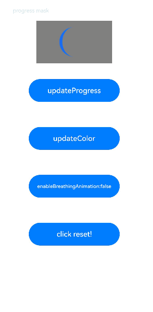

# 形状裁剪

用于对组件进行裁剪、遮罩处理。

>  **说明：**
>
> 从API Version 7开始支持。后续版本如有新增内容，则采用上角标单独标记该内容的起始版本。

## clip<sup>12+</sup>

clip(value: boolean)

是否对子组件超出当前组件范围外的区域进行裁剪。

**系统能力：** SystemCapability.ArkUI.ArkUI.Full

**卡片能力：** 从API version 12开始，该接口支持在ArkTS卡片中使用。

**原子化服务API：** 从API version 12开始，该接口支持在原子化服务中使用。

**参数：**

| 参数名 | 类型                                                         | 必填 | 说明                                                         |
| ------ | ------------------------------------------------------------ | ---- | ------------------------------------------------------------ |
| value  | boolean | 是   | 参数为boolean类型，设置是否按照父容器边缘轮廓进行裁剪。<br/>默认值：false <br/>**说明：** 设置为true后，子组件超出当前组件范围外的区域将不响应绑定的手势事件。 |

## clip<sup>(deprecated)</sup>

clip(value: boolean | CircleAttribute | EllipseAttribute | PathAttribute | RectAttribute)

按指定的形状对当前组件进行裁剪。

> **说明：**  
>
> 从API version 7开始支持，从API version 12开始废弃。建议使用[clip](#clip12)和[clipShape](#clipshape12)替代。

**卡片能力：** 从API version 9开始，该接口支持在ArkTS卡片中使用。

**系统能力：** SystemCapability.ArkUI.ArkUI.Full

**参数：**

| 参数名 | 类型                                                         | 必填 | 说明                                                         |
| ------ | ------------------------------------------------------------ | ---- | ------------------------------------------------------------ |
| value  | boolean&nbsp;\|&nbsp;[CircleAttribute](ts-drawing-components-circle.md)&nbsp;\|&nbsp;[EllipseAttribute](ts-drawing-components-ellipse.md)&nbsp;\|&nbsp;[PathAttribute](ts-drawing-components-path.md)&nbsp;\|&nbsp;[RectAttribute](ts-drawing-components-rect.md) | 是   | 参数为相应类型的组件，按指定的形状对当前组件进行裁剪；参数为boolean类型时，设置是否按照父容器边缘轮廓进行裁剪。<br/>默认值：false <br/>**说明：** 参数为对应类型的组件时，裁剪不会导致被裁剪区域无法响应绑定的手势事件。参数为boolean类型时，裁剪会导致被裁剪区域无法响应绑定的手势事件。 |

## clipShape<sup>12+</sup>

clipShape(value: CircleShape | EllipseShape | PathShape | RectShape)

按指定的形状对当前组件进行裁剪。

**系统能力：** SystemCapability.ArkUI.ArkUI.Full

**卡片能力：** 从API version 12开始，该接口支持在ArkTS卡片中使用。

**原子化服务API：** 从API version 12开始，该接口支持在原子化服务中使用。

**参数：**

| 参数名 | 类型                                                         | 必填 | 说明                                                         |
| ------ | ------------------------------------------------------------ | ---- | ------------------------------------------------------------ |
| value  | [CircleShape](../js-apis-arkui-shape.md#circleshape)&nbsp;\|&nbsp;[EllipseShape](../js-apis-arkui-shape.md#ellipseshape)&nbsp;\|&nbsp;[PathShape](../js-apis-arkui-shape.md#pathshape)&nbsp;\|&nbsp;[RectShape](../js-apis-arkui-shape.md#rectshape) | 是   | 参数为相应类型的组件，按指定的形状对当前组件进行裁剪。<br/>**说明：** 裁剪不会导致被裁剪区域无法响应绑定的手势事件。|

## mask<sup>12+</sup>

mask(value: ProgressMask)

为组件上添加可调节进度的遮罩。

**系统能力：** SystemCapability.ArkUI.ArkUI.Full

**原子化服务API：** 从API version 12开始，该接口支持在原子化服务中使用。

**参数：**

| 参数名 | 类型                                                         | 必填 | 说明                             |
| ------ | ------------------------------------------------------------ | ---- | -------------------------------- |
| value  | [ProgressMask](#progressmask10) | 是   | 在当前组件上加上可动态设置进度、最大值和颜色的遮罩。 |

## mask<sup>(deprecated)</sup>

mask(value: CircleAttribute | EllipseAttribute | PathAttribute | RectAttribute | ProgressMask)

为组件上添加指定形状的遮罩。

> **说明：**  
>
> 从API version 7开始支持，从API version 12开始废弃。建议使用[mask](#mask12)和[maskShape](#maskshape12)替代。

**卡片能力：** 从API version 9开始，该接口支持在ArkTS卡片中使用。

**系统能力：** SystemCapability.ArkUI.ArkUI.Full

**参数：**

| 参数名 | 类型                                                         | 必填 | 说明                             |
| ------ | ------------------------------------------------------------ | ---- | -------------------------------- |
| value  | [CircleAttribute](ts-drawing-components-circle.md)&nbsp;\|&nbsp;[EllipseAttribute](ts-drawing-components-ellipse.md)&nbsp;\|&nbsp;[PathAttribute](ts-drawing-components-path.md)&nbsp;\|&nbsp;[RectAttribute](ts-drawing-components-rect.md) \|&nbsp;[ProgressMask](#progressmask10)<sup>10+</sup> | 是   | 在当前组件上加上指定形状的遮罩。 |

## maskShape<sup>12+</sup>

maskShape(value: CircleShape | EllipseShape | PathShape | RectShape)

为组件上添加指定形状的遮罩。

**系统能力：** SystemCapability.ArkUI.ArkUI.Full

**卡片能力：** 从API version 12开始，该接口支持在ArkTS卡片中使用。

**原子化服务API：** 从API version 12开始，该接口支持在原子化服务中使用。

**参数：**

| 参数名 | 类型                                                         | 必填 | 说明                             |
| ------ | ------------------------------------------------------------ | ---- | -------------------------------- |
| value  | [CircleShape](../js-apis-arkui-shape.md#circleshape)&nbsp;\|&nbsp;[EllipseShape](../js-apis-arkui-shape.md#ellipseshape)&nbsp;\|&nbsp;[PathShape](../js-apis-arkui-shape.md#pathshape)&nbsp;\|&nbsp;[RectShape](../js-apis-arkui-shape.md#rectshape) | 是   | 在当前组件上加上指定形状的遮罩。 |

## ProgressMask<sup>10+</sup>

ProgressMask设置遮罩的进度、最大值和遮罩颜色。

**原子化服务API：** 从API version 11开始，该接口支持在原子化服务中使用。

**系统能力：** SystemCapability.ArkUI.ArkUI.Full

### constructor<sup>10+</sup>

constructor(value: number, total: number, color: ResourceColor)

构造ProgressMask对象。

**原子化服务API：** 从API version 11开始，该接口支持在原子化服务中使用。

**系统能力：** SystemCapability.ArkUI.ArkUI.Full

**参数：**

| 参数名 | 参数类型                                   | 必填 | 参数描述           |
| ------ | ------------------------------------------ | ---- | ------------------ |
| value  | number                                     | 是   | 进度遮罩的当前值。 |
| total  | number                                     | 是   | 进度遮罩的最大值。 |
| color  | [ResourceColor](ts-types.md#resourcecolor) | 是   | 进度遮罩的颜色。   |

### updateProgress<sup>10+</sup>

updateProgress(value: number): void

更新进度遮罩的进度值。

**原子化服务API：** 从API version 11开始，该接口支持在原子化服务中使用。

**系统能力：** SystemCapability.ArkUI.ArkUI.Full

**参数：**

| 参数名 | 参数类型 | 必填 | 参数描述           |
| ------ | -------- | ---- | ------------------ |
| value  | number   | 是   | 进度遮罩的当前值。 |

### updateColor<sup>10+</sup>

updateColor(value: ResourceColor): void

更新进度遮罩的颜色。

**原子化服务API：** 从API version 11开始，该接口支持在原子化服务中使用。

**系统能力：** SystemCapability.ArkUI.ArkUI.Full

**参数：**

| 参数名 | 参数类型                                   | 必填 | 参数描述         |
| ------ | ------------------------------------------ | ---- | ---------------- |
| value  | [ResourceColor](ts-types.md#resourcecolor) | 是   | 进度遮罩的颜色。 |

### enableBreathingAnimation<sup>12+</sup>

enableBreathingAnimation(value: boolean): void

进度满时的呼吸光晕动画开关。默认关闭呼吸光晕动画。

**原子化服务API：** 从API version 12开始，该接口支持在原子化服务中使用。

**系统能力：** SystemCapability.ArkUI.ArkUI.Full

**参数：**

| 参数名 | 参数类型                                   | 必填 | 参数描述         |
| ------ | ------------------------------------------ | ---- | ---------------- |
| value  | boolean | 是   | 设置为true则开启呼吸光晕动画。默认值：false |


## 示例

### 示例1（使用不同裁剪属性）

```ts
// xxx.ets
@Entry
@Component
struct ClipAndMaskExample {
  build() {
    Column({ space: 15 }) {
      Text('clip').fontSize(12).width('75%').fontColor('#DCDCDC')
      Row() {
        Image($r('app.media.testImg')).width('500px').height('280px')
      }
      .clip(true) // 如这里不设置clip为true，则Row组件的圆角不会限制其中的Image组件，Image组件的四个角会超出Row
      .borderRadius(20)
      // 用一个280px直径的圆对图片进行裁剪
      Image($r('app.media.testImg'))
        .clipShape(new Circle({ width: '280px', height: '280px' }))
        .width('500px').height('280px')

      Text('mask').fontSize(12).width('75%').fontColor('#DCDCDC')
      // 给图片添加了一个500px*280px的方形遮罩
      Image($r('app.media.testImg'))
        .maskShape(new Rect({ width: '500px', height: '280px' }).fill(Color.Gray))
        .width('500px').height('280px')

      // 给图片添加了一个280px*280px的圆形遮罩
      Image($r('app.media.testImg'))
        .maskShape(new Circle({ width: '280px', height: '280px' }).fill(Color.Gray))
        .width('500px').height('280px')
    }
    .width('100%')
    .margin({ top: 15 })
  }
}
```


### 示例2（裁剪属性动画）

```ts
@Entry
@Component
struct ProgressMaskExample {
  @State progressflag1: boolean = true;
  @State color: Color = 0x01006CDE;
  @State value: number = 10.0;
  @State enableBreathingAnimation: boolean = false;
  @State progress: ProgressMask = new ProgressMask(10.0, 100.0, Color.Gray);
  build() {
    Column({ space: 15 }) {
      Text('progress mask').fontSize(12).width('75%').fontColor('#DCDCDC')
      // 给图片添加了一个280px*280px的进度遮罩
      Image($r('app.media.testImg'))
        .width('500px').height('280px')
        .mask(this.progress)
        .animation({
          duration: 2000, // 动画时长
          curve: Curve.Linear, // 动画曲线
          delay: 0, // 动画延迟
          iterations: 1, // 播放次数
          playMode: PlayMode.Normal // 动画模式
        }) // 对Button组件的宽高属性进行动画配置

      // 更新进度遮罩的进度值
      Button('updateProgress')
        .onClick((event?: ClickEvent) => {
          this.value += 10;
          this.progress.updateProgress(this.value);
        }).width(200).height(50).margin(20)

      // 更新进度遮罩的颜色
      Button('updateColor')
        .onClick((event?: ClickEvent) => {
          if (this.progressflag1) {
            this.progress.updateColor(0x9fff0000);
          } else {
            this.progress.updateColor(0x9f0000ff);
          }
          this.progressflag1 = !this.progressflag1
        }).width(200).height(50).margin(20)
      
      // 开关呼吸光晕动画
      Button('enableBreathingAnimation:' + this.enableBreathingAnimation)
        .onClick((event?: ClickEvent) => {
          this.enableBreathingAnimation = !this.enableBreathingAnimation
          this.progress.enableBreathingAnimation(this.enableBreathingAnimation);
        }).width(200).height(50).margin(20)

      // 恢复进度遮罩
      Button('click reset!')
        .onClick((event?: ClickEvent) => {
          this.value = 0;
          this.progress.updateProgress(this.value);
        }).width(200).height(50).margin(20)
    }
    .width('100%')
    .margin({ top: 15 })
  }
}
```


