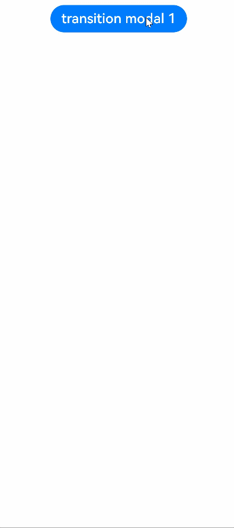
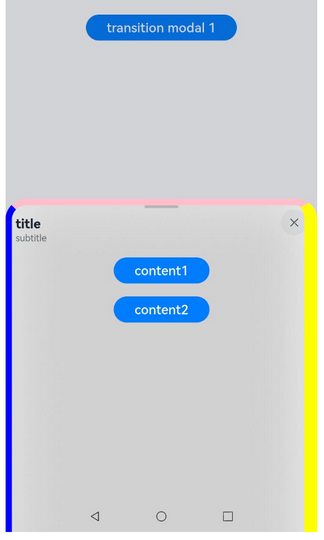
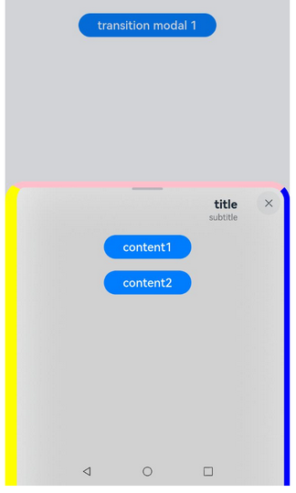
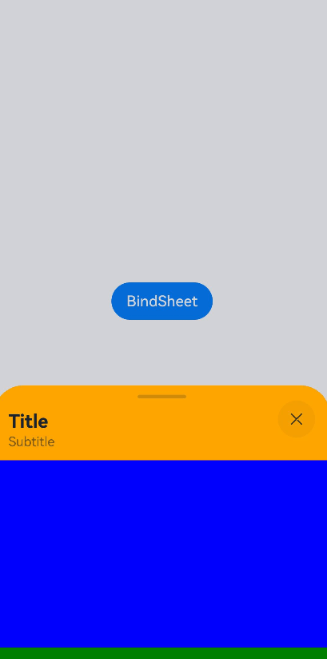
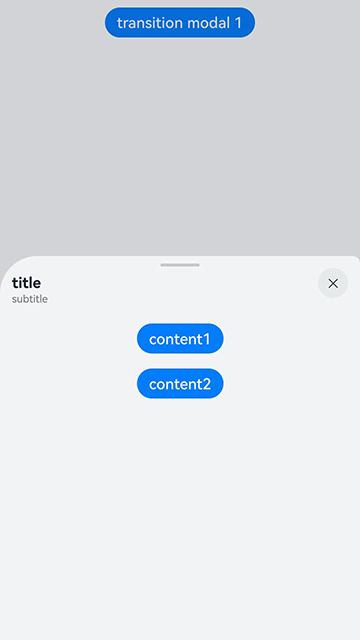
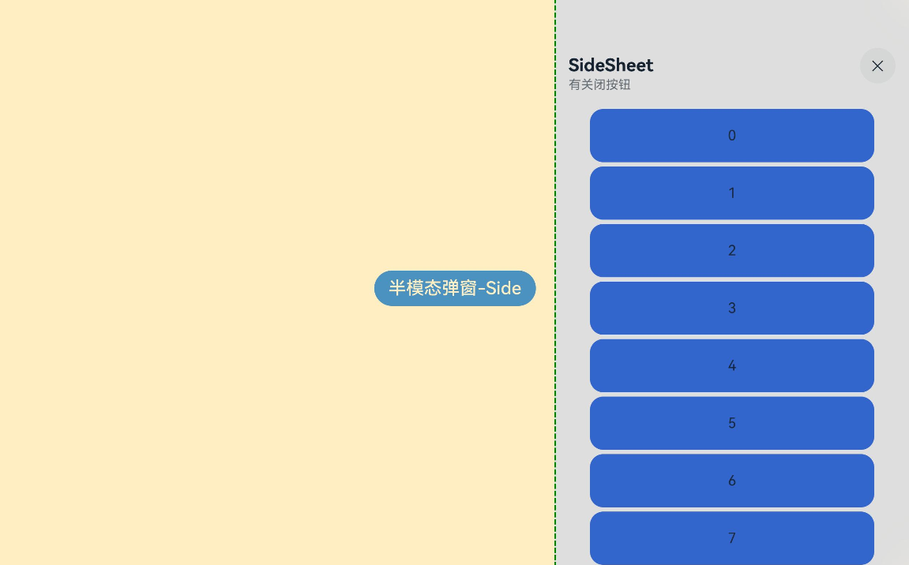
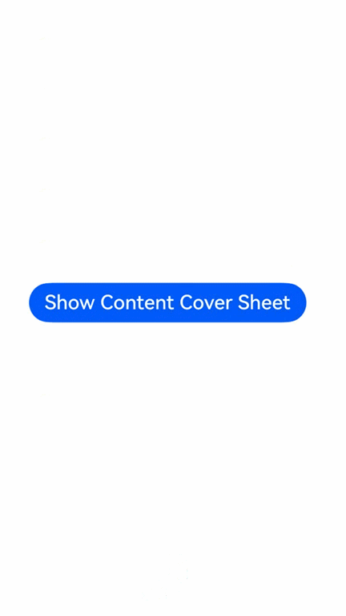

# 半模态转场

通过bindSheet属性为组件绑定半模态页面，在组件插入时可通过设置自定义或默认的内置高度确定半模态大小。

>  **说明：**
>
>  从API version 10开始支持。后续版本如有新增内容，则采用上角标单独标记该内容的起始版本。
>
>  不支持路由跳转。

## bindSheet

bindSheet(isShow: boolean, builder: CustomBuilder, options?: SheetOptions): T

给组件绑定半模态页面，点击后显示模态页面。

**原子化服务API：** 从API version 11开始，该接口支持在原子化服务中使用。

**系统能力：** SystemCapability.ArkUI.ArkUI.Full

**参数：** 

| 参数名  | 类型                                        | 必填 | 说明                                                         |
| ------- | ------------------------------------------- | ---- | ------------------------------------------------------------ |
| isShow  | boolean                          | 是   | 是否显示半模态页面。<br/>true：显示半模态页面。<br/>false：隐藏半模态页面。<br/>从API version 10开始，该参数支持[$$](../../../ui/state-management/arkts-two-way-sync.md)双向绑定变量。<br />从API version 18开始，该参数支持[!!](../../../ui/state-management/arkts-new-binding.md#系统组件参数双向绑定)双向绑定变量。|
| builder | [CustomBuilder](ts-types.md#custombuilder8) | 是   | 配置半模态页面内容。                                         |
| options | [SheetOptions](#sheetoptions)               | 否   | 配置半模态页面的可选属性。                                   |

**返回值：**

| 类型 | 说明 |
| -------- | -------- |
| T | 返回当前组件。 |

> **说明：**
>
> 1. 在非双向绑定情况下，以拖拽方式关闭半模态页面不会改变isShow参数的值。
>
> 2. 为了使isShow参数值与半模态界面的状态同步，建议使用[$$](../../../ui/state-management/arkts-two-way-sync.md)双向绑定isShow参数。从API version 18开始，该参数支持[!!](../../../ui/state-management/arkts-new-binding.md#系统组件参数双向绑定)双向绑定变量。
>
> 3. 在半模态单挡位向上拖拽或是多挡位上滑换挡情况下，内容在拖拽结束或换挡结束后更新显示区域。
>
> 4. 半模态是一个严格和宿主节点绑定在一起的弹窗。若是想实现类似“页面显示的瞬间就弹出半模态”的效果，请确认宿主节点是否已挂载上树。若宿主节点还没上树就将isShow置为true，半模态将不生效。建议使用[onAppear](ts-universal-events-show-hide.md#onappear)函数，确保在宿主节点挂载后再显示半模态。
> 尤其是 [SheetMode](#sheetmode12枚举说明) = EMBEDDED 时，除宿主节点外，还需确保对应的页面节点成功挂载。
>
> 5. 半模态页面的离场动效不支持打断，动效执行期间无法响应其他手势动作。目前离场动效使用[弹簧曲线](../../../ui/arkts-spring-curve.md)，该动画曲线存在视觉上并不明显的拖尾动画。因此，在半模态退出时，视觉上半模态页面已经消失，但此时动效可能还未结束，若想再次点击拉起半模态页面则不会响应。需要等动效完全结束后，才可以再次拉起。
>
## SheetOptions

继承自[BindOptions](#bindoptions)。

**系统能力：** SystemCapability.ArkUI.ArkUI.Full

| 名称              | 类型                                       | 必填   | 说明              |
| --------------- | ---------------------------------------- | ---- | --------------- |
| height          | [SheetSize](#sheetsize枚举说明)&nbsp;\|&nbsp;[Length](ts-types.md#length) | 否    | 半模态高度，默认是LARGE。<br/>**说明：**<br/>API version 12之前，底部弹窗横屏时该属性设置无效，高度为距离屏幕顶部8vp。<br/>API version 12开始，底部弹窗横屏时该属性设置生效，最大高度为距离屏幕顶部8vp。<br/>API version 14开始，底部弹窗横屏时，无状态栏则最大高度为距离屏幕顶部8vp，有状态栏则最大高度为距离状态栏8vp。<br/>底部弹窗时，当设置detents时，该属性设置无效。<br/>底部弹窗竖屏时，最大高度为距离状态栏8vp。<br />居中弹窗和跟手弹窗设置类型为SheetSize.LARGE和SheetSize.MEDIUM无效，显示默认高度560vp。居中弹窗和跟手弹窗最小高度为320vp，最大高度为窗口短边的90%。当使用Length设置的高度和使用SheetSize.FIT_CONTENT自适应的高度大于最大高度，则显示最大高度，小于最小高度，则显示最小高度。<br/>**原子化服务API：** 从API version 11开始，该接口支持在原子化服务中使用。 |
| detents<sup>11+</sup> | [([SheetSize](#sheetsize枚举说明) \| [Length](ts-types.md#length)), ( [SheetSize](#sheetsize枚举说明) \| [Length](ts-types.md#length))?, ([SheetSize](#sheetsize枚举说明) \| [Length](ts-types.md#length))?] | 否 | 半模态页面的切换高度档位。<br/>**说明：**<br/>从API version 12开始，底部弹窗横屏时该属性设置生效。<br/>底部弹窗竖屏生效，元组中第一个高度为初始高度。<br />面板可跟手滑动切换档位，松手后是否滑动至目标档位有两个判断条件：速度和距离。速度超过阈值，则执行滑动至与手速方向一致的目标档位；速度小于阈值，则引入距离判断条件，当位移距离>当前位置与目标位置的1/2，滑动至与手速方向一致的目标档位，位移距离当前位置与目标位置的1/2，返回至当前档位。速度阈值：1000，距离阈值：50%。<br/>**原子化服务API：** 从API version 12开始，该接口支持在原子化服务中使用。 |
| preferType<sup>11+</sup> | [SheetType](#sheettype11枚举说明) | 否 | 半模态页面的样式。<br/>**说明：**<br/>半模态在不同窗口所支持的显示类型：<br/>1. 宽度 < 600vp：底部、全屏。<br/>2. 600vp <= 宽度 < 840vp：底部、居中、跟手、侧边、全屏。默认居中样式。<br/>3. 宽度 >= 840vp：底部、居中、跟手、侧边、全屏。默认跟手样式。<br/>4. API version 20开始，窗口宽度大于600vp时，preferType支持设置为SheetType.SIDE。<br/>5. API version 20开始，preferType支持设置为SheetType.CONTENT_COVER，支持设置为全屏模态样式。<br/>**原子化服务API：** 从API version 12开始，该接口支持在原子化服务中使用。 |
| showClose<sup>11+</sup> | boolean \| [Resource](ts-types.md#resource) | 否 | 是否显示关闭图标。<br/> 2in1设备默认无按钮底板。<br/> 默认值：true。<br/> true：显示关闭图标。<br/> false：不显示关闭图标。<br/>**说明：**<br/>Resource需要为boolean类型。<br/>**原子化服务API：** 从API version 12开始，该接口支持在原子化服务中使用。 |
| dragBar         | boolean                                  | 否    | 是否显示控制条。<br/>**说明：**<br/>半模态面板的detents属性设置多个不同高度并且设置生效时，默认显示控制条。否则不显示控制条。<br/>**原子化服务API：** 从API version 11开始，该接口支持在原子化服务中使用。 |
| blurStyle<sup>11+</sup> | [BlurStyle](ts-universal-attributes-background.md#blurstyle9) | 否 | 半模态面板的模糊背景。默认无模糊背景。<br/>**原子化服务API：** 从API version 12开始，该接口支持在原子化服务中使用。 |
| maskColor | [ResourceColor](ts-types.md#resourcecolor) | 否 | 半模态页面的背景蒙层颜色。<br/> 默认值：Color.Gery。<br/>**原子化服务API：** 从API version 11开始，该接口支持在原子化服务中使用。 |
| title<sup>11+</sup> | [SheetTitleOptions](#sheettitleoptions11) \| [CustomBuilder](ts-types.md#custombuilder8) | 否 | 半模态面板的标题。<br/>**原子化服务API：** 从API version 12开始，该接口支持在原子化服务中使用。 |
| enableOutsideInteractive<sup>11+</sup> | boolean | 否 | 半模态所在页面是否允许交互。<br/>**说明：**<br/>设置为true时允许交互，不显示蒙层；设置为false时不允许交互，显示蒙层；若不进行设置，默认底部弹窗与居中弹窗不允许交互，跟手弹窗允许交互。当设置为true时，maskColor设置无效。<br/>**原子化服务API：** 从API version 12开始，该接口支持在原子化服务中使用。 |
| shouldDismiss<sup>11+</sup> | (sheetDismiss: [SheetDismiss](#sheetdismiss11)) => void | 否 | 半模态页面交互式关闭回调函数。<br/>**说明：**<br/>当用户执行下拉关闭、侧拉关闭、点击遮罩层关闭、点击关闭按钮的交互操作时，如果已注册回调函数，模态窗口将不会立即关闭。要关闭半模态，需在回调函数中调用shouldDismiss.dismiss()方法来实现。<br/>如果不注册该回调函数，则用户执行下拉关闭、侧拉关闭、点击遮罩层关闭、点击关闭按钮的交互操作时，正常关闭半模态，无其他行为。<br/>侧拉关闭又包含侧滑（左滑/右滑）、三键back、键盘ESC关闭。<br/>建议在[二次确认](../../../ui/arkts-sheet-page.md#二次确认能力)场景使用。<br/>**原子化服务API：** 从API version 12开始，该接口支持在原子化服务中使用。 |
| onWillDismiss<sup>12+</sup> | [DismissSheetAction](#dismisssheetaction12) | 否    | 半模态页面的交互式关闭回调函数。允许开发者注册，以获取关闭操作的类型，并决定是否关闭半模态状态。<br/>**说明：**<br />当用户执行下拉关闭、侧拉关闭、点击遮罩层关闭、点击关闭按钮的交互操作时，若已注册回调函数，则不会立即关闭页面，而是由开发者通过回调函数中的[reason](../js-apis-promptAction.md#dismissreason12枚举说明)参数判断关闭操作的类型，进而根据具体原因自主选择是否关闭半模态页面。<br/>如果不注册该回调函数，则用户执行关闭操作时，正常关闭半模态，无其他行为。<br/>侧拉关闭又包含侧滑（左滑/右滑）、三键back、键盘ESC关闭。<br />在onWillDismiss回调中，不能再做onWillDismiss拦截。<br />建议在[二次确认](../../../ui/arkts-sheet-page.md#二次确认能力)场景使用。<br />**原子化服务API：** 从API version 12开始，该接口支持在原子化服务中使用。|
| onWillSpringBackWhenDismiss<sup>12+</sup> | [SpringBackAction](#springbackaction12) | 否    | 半模态页面交互式关闭前控制回弹函数。允许开发者注册，以控制半模态页面交互式关闭时的回弹效果。<br/>**说明：**<br />当用户触发执行下拉关闭操作并同时注册该回调函数与shouldDimiss或onWillDismiss时，由开发者控制下滑关闭时是否回弹。在回调函数中可以通过调用springBack来实现回弹效果。也可以通过不调用springBack来取消回弹效果。<br />若不注册该回调函数，但注册shouldDimiss或onWillDismiss时，则默认在下拉关闭时，会触发回弹效果，回弹后再根据shouldDimiss或onWillDismiss内的回调行为决定半模态是否关闭。<br />如果不注册该回调函数，且未注册shouldDimiss或onWillDismiss时，默认在下滑关闭时，触发半模态关闭。<br />侧边弹窗样式则是在侧拉关闭场景生效springBack。<br />**原子化服务API：** 从API version 12开始，该接口支持在原子化服务中使用。 |
| onHeightDidChange<sup>12+</sup> | Callback&lt;number&gt; | 否 | 半模态页面高度变化回调函数。<br/>**说明：**<br/>底部弹窗时，只有档位变化和拖拽跟手才返回每一帧高度，拉起半模态和避让软键盘只返回最后的高度，其他弹窗只在半模态拉起返回最后高度。<br/>返回值为px。 <br/>**原子化服务API：** 从API version 12开始，该接口支持在原子化服务中使用。|
| onDetentsDidChange<sup>12+</sup> | Callback&lt;number&gt; | 否 | 半模态页面档位变化回调函数。<br/>**说明：**<br/>底部弹窗时，档位变化返回最后的高度。<br/>返回值为px。 <br/>**原子化服务API：** 从API version 12开始，该接口支持在原子化服务中使用。|
| onWidthDidChange<sup>12+</sup> | Callback&lt;number&gt; | 否 | 半模态页面宽度变化回调函数。<br/>**说明：**<br/>宽度变化时返回最后的宽度。<br/>返回值为px。 <br/>**原子化服务API：** 从API version 12开始，该接口支持在原子化服务中使用。|
| onTypeDidChange<sup>12+</sup> | Callback&lt;[SheetType](#sheettype11枚举说明)&gt; | 否 | 半模态页面形态变化回调函数。<br/>**说明：**<br/>形态变化时返回最后的形态。<br/>**原子化服务API：** 从API version 12开始，该接口支持在原子化服务中使用。|
| borderWidth<sup>12+</sup> | [Dimension](ts-types.md#dimension10)&nbsp;\|&nbsp;[EdgeWidths](ts-types.md#edgewidths9)&nbsp;\|&nbsp;[LocalizedEdgeWidths](ts-types.md#localizededgewidths12)<sup>12+</sup>  | 否 | 设置半模态页面的边框宽度。<br />可分别设置4个边框宽度。<br />默认值：0<br /> 百分比参数方式：以父元素半模态页面宽的百分比来设置半模态页面的边框宽度。<br />当半模态页面左边框和右边框大于半模态页面宽度，半模态页面上边框和下边框大于半模态页面高度，显示可能不符合预期。<br />**说明：**<br />底部弹窗时，底部边框宽度设置无效。 <br/>**原子化服务API：** 从API version 12开始，该接口支持在原子化服务中使用。 |
| borderColor<sup>12+</sup> | [ResourceColor](ts-types.md#resourcecolor)&nbsp;\|&nbsp;[EdgeColors](ts-types.md#edgecolors9)&nbsp;\|&nbsp;[LocalizedEdgeColors](ts-types.md#localizededgecolors12)<sup>12+</sup>  | 否 | 设置半模态页面的边框颜色。<br/>默认值：Color.Black<br/> 如果使用borderColor属性，需要和borderWidth属性一起使用。 <br />**说明：**<br />底部弹窗时，底部边框颜色设置无效。 <br/>**原子化服务API：** 从API version 12开始，该接口支持在原子化服务中使用。 |
| borderStyle<sup>12+</sup> | [BorderStyle](ts-appendix-enums.md#borderstyle)&nbsp;\|&nbsp;[EdgeStyles](ts-types.md#edgestyles9)  | 否 | 设置半模态页面的边框样式。<br/>默认值：BorderStyle.Solid<br/>如果使用borderStyle属性，需要和borderWidth属性一起使用。 <br />**说明：**<br />底部弹窗时，底部边框样式设置无效。 <br/>**原子化服务API：** 从API version 12开始，该接口支持在原子化服务中使用。 |
| width<sup>12+</sup> | [Dimension](ts-types.md#dimension10)   | 否 | 设置半模态页面的宽度。<br /> 百分比参数方式：以父元素宽的百分比来设置半模态页面的宽度。<br/>**原子化服务API：** 从API version 12开始，该接口支持在原子化服务中使用。|
| shadow<sup>12+</sup> | [ShadowOptions](ts-universal-attributes-image-effect.md#shadowoptions对象说明)&nbsp;\|&nbsp;[ShadowStyle](ts-universal-attributes-image-effect.md#shadowstyle10枚举说明)   | 否 | 设置半模态页面的阴影。<br />2in1设备默认值：ShadowStyle.OUTER_FLOATING_SM。 <br/>**原子化服务API：** 从API version 12开始，该接口支持在原子化服务中使用。|
| uiContext<sup>12+</sup> | [UIContext](../arkts-apis-uicontext-uicontext.md)   | 否 | 在UIContext实例对应的窗口中显示半模态。<br />**说明：**<br />使用[openBindSheet](../arkts-apis-uicontext-uicontext.md#openbindsheet12)启动的半模态页面，不支持设置、更新该属性。<br/>**原子化服务API：** 从API version 12开始，该接口支持在原子化服务中使用。|
| mode<sup>12+</sup> | [SheetMode](#sheetmode12枚举说明)   | 否 | 设置半模态页面的显示层级。<br/>默认值：SheetMode.OVERLAY<br />**说明：**<br /> 1. 半模态显示期间mode属性不支持动态切换，两种模式的显示层级完全不同，无法做到显示期间同一个半模态从一个层级变换到另一个层级。建议在使用时明确诉求固定mode值。 <br/> 2. 设置SheetMode.EMBEDDED时不支持设置UIContext属性，两者对应的半模态显示层级效果互相冲突。<br />3. 使用[openBindSheet](../arkts-apis-uicontext-uicontext.md#openbindsheet12)启动半模态页面，若未传入有效的targetId，则不支持设置为SheetMode.EMBEDDED，默认为SheetMode.OVERLAY。<br/>**原子化服务API：** 从API version 12开始，该接口支持在原子化服务中使用。 |
| scrollSizeMode<sup>12+</sup> | [ScrollSizeMode](#scrollsizemode12枚举说明)   | 否 | 设置半模态面板滑动时，内容区域刷新时机。<br/>默认值：ScrollSizeMode.FOLLOW_DETENT <br/>**原子化服务API：** 从API version 12开始，该接口支持在原子化服务中使用。|
| keyboardAvoidMode<sup>13+</sup> | [SheetKeyboardAvoidMode](#sheetkeyboardavoidmode13枚举说明) | 否 | 设置半模态激活输入法时对软键盘的避让方式。<br/> **默认值：** TRANSLATE_AND_SCROLL<br/>**原子化服务API：** 从API version 13开始，该接口支持在原子化服务中使用。 |
| enableHoverMode<sup>14+</sup>              | boolean | 否   | 是否响应悬停态。<br />默认值：false，默认不响应。<br /> 2in1设备默认值：true <br />**说明：**<br />底部弹窗样式和跟手弹窗样式不响应悬停态。子窗模式不支持悬停态。<br/>**原子化服务API：** 从API version 14开始，该接口支持在原子化服务中使用。|
| hoverModeArea<sup>14+</sup>              | [HoverModeAreaType](ts-appendix-enums.md#hovermodeareatype14) | 否   | 悬停态下弹窗默认展示区域。<br />默认值：HoverModeAreaType.BOTTOM_SCREEN <br /> 2in1设备默认值：HoverModeAreaType.TOP_SCREEN <br/>**原子化服务API：** 从API version 14开始，该接口支持在原子化服务中使用。|
| radius<sup>15+</sup> | [LengthMetrics](../js-apis-arkui-graphics.md#lengthmetrics12)&nbsp;\|&nbsp;[BorderRadiuses](ts-types.md#borderradiuses9)&nbsp;\|&nbsp;[LocalizedBorderRadiuses](ts-types.md#localizedborderradiuses12) | 否 | 设置半模态页面圆角半径。<br/>不建议设置4个圆角大小不相等，圆角大小相等时面板视觉体验最佳。<br/>**默认值**：32vp<br/>**说明：**<br/>1. 根据设置的圆角半径值显示，如果未设置，则使用默认值。底部样式不显示半模态底部2个圆角，即使设置了底部2个圆角也不生效。<br/>2. 分别设置4个方向的圆角半径后，如果某个方向的值异常，异常方向的圆角值重置为默认值，非异常方向的圆角值为已设置的值。统一设置4个方向的圆角时，如果设置的值异常，4个方向的圆角都重置为默认值。<br/>3. 半径设置为百分比时，以半模态页面的宽度为基准。<br/>4. 当圆角的半径大于半模态页面宽度一半时，圆角的半径取值为半模态页面宽度的一半。<br/>5. 当半模态页面高度过小且圆角半径设置过大时，可能导致显示异常。<br/>**原子化服务API：** 从API version 15开始，该接口支持在原子化服务中使用。 |
| detentSelection<sup>15+</sup>         <br> | [SheetSize](#sheetsize枚举说明)&nbsp;\|&nbsp;[Length](ts-types.md#length) | 否    | 支持非手势切换挡位。<br />**默认值：** detents[0]。<br/>**说明：**<br/>1. 该接口取值范围为detents数组范围，若设值非detents范围，该接口无效。<br/>2. 当设置SheetSize.FIT_CONTENT时，该接口无效。<br>3. 不建议手势切换挡位与该接口切换挡位同时生效使用。<br/>**原子化服务API：** 从API version 15开始，该接口支持在原子化服务中使用。 |
| placement<sup>18+</sup> | [Placement](ts-appendix-enums.md#placement8) | 否 | 设置半模态popup样式弹窗相对于目标的显示位置。<br />默认值：Placement.Bottom<br />**说明：** <br /> 1. popup样式弹窗在确保指定位置能容纳弹窗尺寸的前提下，优先依据设定的placement展示弹窗。若不可行，则遵循先垂直翻转，后尝试90°水平旋转的规则调整显示位置，以预设方向为下方为例，调整顺序依次为：下、上、右、左。<br />2. 如果设置的对齐方式导致组件布局超出窗口范围，将根据该对齐方式在水平或垂直方向上进行位移，直至组件完全显示在窗口内。<br />3. 如果在四个方向上均无法容纳当前的popup样式弹窗，处理方式遵循开发者设置的placementOnTarget属性：<br />1）若属性值为true，将依据设定的placement，向其镜像方向平移，直至弹窗能够完全显示。<br />2）若属性值为false，则在四个方向中，选择能够完全展示弹窗宽度且剩余高度最大的方向，通过调整半模态高度以适应当前方向，确保弹窗能够放下，同时保持预设placement对应的对齐方式不变。 <br />**原子化服务API：** 从API version 18开始，该接口支持在原子化服务中使用。 |
| placementOnTarget<sup>18+</sup> | boolean | 否 | 半模态popup样式弹窗在当前窗口下，四个方向均无法容纳该弹窗大小时，设置是否允许其覆盖在目标节点上。<br /> 默认值：true <br />**原子化服务API：** 从API version 18开始，该接口支持在原子化服务中使用。|
| effectEdge<sup>18+</sup> | number | 否 | 设置半模态面板内容区边缘回弹效果，支持单边生效。<br/>**默认值**：默认双边生效，即[EffectEdge](ts-container-scrollable-common.md#effectedge18枚举说明).START \| [EffectEdge](ts-container-scrollable-common.md#effectedge18枚举说明).END（即数值3）。<br />**说明：**<br />1. 仅上边缘生效：[EffectEdge](ts-container-scrollable-common.md#effectedge18枚举说明).START。<br/>2. 仅下边缘生效：[EffectEdge](ts-container-scrollable-common.md#effectedge18枚举说明).END。<br/>3. 双边生效：[EffectEdge](ts-container-scrollable-common.md#effectedge18枚举说明).START \| [EffectEdge](ts-container-scrollable-common.md#effectedge18枚举说明).END（即数值3）。<br/>4. 双边不生效：[EffectEdge](ts-container-scrollable-common.md#effectedge18枚举说明).START & [EffectEdge](ts-container-scrollable-common.md#effectedge18枚举说明).END（即数值0）。<br />**原子化服务API：** 从API version 18开始，该接口支持在原子化服务中使用。 |
| showInSubWindow<sup>19+</sup> | boolean                                  | 否    | 半模态是否在独立子窗中显示。<br>默认值：false<br>**说明：** <br>1. 若属性值为true，半模态可以在独立子窗口中展示，并且可以超过应用窗口范围。<br>2. 若属性值为false，半模态只能在应用窗口范围内展示。<br>3. 不建议在showInSubWindow为true的弹窗嵌套显示另一个showInSubWindow为true的弹窗，半模态可能会影响其他组件行为。<br>4. 不建议在showInSubWindow为true的弹窗中使用CalendarPicker、CalendarPickerDialog、DatePickerDialog、TextPickerDialog、TimePickerDialog等picker组件，半模态会影响上述组件行为。<br>5. 半模态显示期间该属性不支持动态切换。<br/>**原子化服务API：** 从API version 19开始，该接口支持在原子化服务中使用。 |
| enableFloatingDragBar<sup>20+</sup>              | boolean | 否   | 控制条是否悬浮显示，true为悬浮显示，false为不悬浮显示。<br />默认值：false <br /> **说明：** <br>悬浮效果只在控制条显示的场景生效，且控制条不占位。<br /> title传入[CustomBuilder](ts-types.md#custombuilder8)时enableFloatingDragBar始终为false。<br/>**原子化服务API：** 从API version 20开始，该接口支持在原子化服务中使用。 |
| modalTransition<sup>20+</sup> | [ModalTransition](ts-types.md#modaltransition10) | 否 | bindSheet全屏模态样式的系统转场方式。<br/>默认值：ModalTransition.DEFAULT<br/>**原子化服务API：** 从API version 20开始，该接口支持在原子化服务中使用。 |

## SheetSize枚举说明

指定半模态的高度。

**系统能力：** SystemCapability.ArkUI.ArkUI.Full

| 名称                      | 值    | 说明                         |
| ------------------------- | ---- | -------------------------------- |
| MEDIUM                    | 0    | 指定半模态高度为屏幕高度一半。<br />**原子化服务API：** 从API version 11开始，该接口支持在原子化服务中使用。   |
| LARGE                     | 1    | 指定半模态高度几乎为屏幕高度。<br />**原子化服务API：** 从API version 11开始，该接口支持在原子化服务中使用。   |
| FIT_CONTENT<sup>11+</sup> | 2    | 指定半模态高度为适应内容的高度。<br />**原子化服务API：** 从API version 12开始，该接口支持在原子化服务中使用。<br />**说明：**<br />FIT_CONTENT是半模态容器高度去适应孩子builder根节点的布局。此场景下builder根节点的高度不能使用百分比，两者不能相互依赖彼此的布局。 |

## BindOptions

半模态、全模态的公共配置接口。

**系统能力：** SystemCapability.ArkUI.ArkUI.Full

| 名称            | 类型                                       | 必填 | 说明                     |
| --------------- | ------------------------------------------ | ---- | ------------------------ |
| backgroundColor | [ResourceColor](ts-types.md#resourcecolor) | 否   | 半模态页面的背板颜色。<br />默认值：Color.White。<br />**原子化服务API：** 从API version 11开始，该接口支持在原子化服务中使用。 |
| onWillAppear<sup>12+</sup>        | () => void                                 | 否   | 半模态页面显示（动画开始前）回调函数。**原子化服务API：** 从API version 12开始，该接口支持在原子化服务中使用。 |
| onAppear        | () => void                                 | 否   | 半模态页面显示（动画结束后）回调函数。<br />**原子化服务API：** 从API version 11开始，该接口支持在原子化服务中使用。 |
| onWillDisappear<sup>12+</sup>     | () => void                                 | 否   | 半模态页面回退（动画开始前）回调函数。<br />**说明：**<br />不允许在onWillDisappear函数中修改状态变量，可能会导致组件行为不稳定。**原子化服务API：** 从API version 12开始，该接口支持在原子化服务中使用。 |
| onDisappear     | () => void                                 | 否   | 半模态页面回退（动画结束后）回调函数。<br />**原子化服务API：** 从API version 11开始，该接口支持在原子化服务中使用。 |

## SheetType<sup>11+</sup>枚举说明

半模态弹窗的样式。

**系统能力：** SystemCapability.ArkUI.ArkUI.Full

| 名称   | 值   | 说明                                               |
| ------ | ---- | ------------------------------------------------------ |
| BOTTOM | 0    | 底部弹窗。 <br />**原子化服务API：** 从API version 12开始，该接口支持在原子化服务中使用。 |
| CENTER | 1    | 居中弹窗。 <br />**原子化服务API：** 从API version 12开始，该接口支持在原子化服务中使用。 |
| POPUP  | 2    | 跟手弹窗。跟手弹窗面板不支持跟手滑动，下滑面板不关闭。<br />**原子化服务API：** 从API version 12开始，该接口支持在原子化服务中使用。 |
| SIDE<sup>20+</sup>   | 3    | 侧边弹窗。<br />**原子化服务API：** 从API version 20开始，该接口支持在原子化服务中使用。|
| CONTENT_COVER<sup>20+</sup>   | 4    | 全屏弹窗。<br />**原子化服务API：** 从API version 20开始，该接口支持在原子化服务中使用。|

**半模态侧边弹窗样式：**

1. 侧边样式默认转场方向为从右向左，退出则是原地向右退出；镜像场景默认转场则是从左向右，退出则是原地向左退出。不支持自定义转场。

2. 无多挡位能力，不支持detents和detentSelection接口。同样也不支持控制条相关能力接口，如dragBar接口。

3. 底部弹窗样式可以在转场结束后向上滑动交互，但侧边弹窗样式不支持在转场结束后往左滑动交互，只支持往右滑动关闭。镜像场景则能力相反。

4. 不支持高度自定义，高度默认全屏。

5. 不支持指定其他显示层级接口，如showInSubWindow = true、mode = SheetMode.EMBEDDED。侧边弹窗的层级同SheetMode.OVERLAY，只支持在当前UIContext内顶层显示，在所有页面之上。和弹窗类组件显示在一个层级。

6. 无悬停态避让能力。


**侧边弹窗样式不支持的接口**
| 名称             | 说明              |
| --------------- |  --------------- |
| height          | 高度只支持全屏高度。 |
| detents | 无挡位能力。| 
| dragBar         | 不支持DragBar。  |
| onDetentsDidChange | 无挡位能力。|
| uiContext | 不支持指定显示层级。|
| mode | 不支持指定显示层级。 |
| scrollSizeMode | 无挡位能力。  |
| enableHoverMode  | 无悬停态避让能力。|
| hoverModeArea    | 无悬停态避让能力。|
| detentSelection | 无挡位能力。 |
| placement | 只支持气泡样式。 |
| placementOnTarget | 只支持气泡样式。|
| showInSubWindow | 不支持指定显示层级。 |

**bindSheet全屏模态样式说明：**

1. 全屏样式显示页面效果为铺满全屏，不支持边框、阴影、标题栏、关闭按钮、圆角等。

2. builder内容默认布局在安全区内。

3. 全屏样式支持系统转场方式[ModalTransition](ts-types.md#modaltransition10)，默认值为`ModalTransition.DEFAULT`，不支持自定义转场。

4. 不支持挡位能力，不支持`detents`和`detentSelection`接口。

5. 不支持上下滑动，仅支持侧滑关闭。

6. 不支持宽高自定义，宽高默认为全屏。

7. 不支持指定其他显示层级接口，如`showInSubWindow = true`、`mode = SheetMode.EMBEDDED`。全屏弹窗的层级与`SheetMode.OVERLAY`相同，仅支持在当前`UIContext`内顶层显示，位于所有页面之上，与弹窗类组件显示在同一层级。

8. 默认不避让软键盘，需自定义避让软键盘。

9. 不支持蒙层效果。


**bindSheet全屏模态样式不支持的接口**
| 名称             | 说明              |
| --------------- |  --------------- |
| height          | 高度只支持全屏高度。 |
| width           | 宽度只支持全屏宽度。 |
| detents | 无挡位能力。|
| dragBar         | 不支持拖动条。  |
| onDetentsDidChange | 无挡位能力。|
| showClose          | 不支持显示关闭按钮。 |
| title          | 不支持显示标题栏。 |
| uiContext | 不支持指定显示层级。|
| mode | 不支持指定显示层级。 |
| scrollSizeMode | 无挡位能力。  |
| keyboardAvoidMode | 无避让软键盘能力，需自定义避让。 |
| enableHoverMode  | 无悬停态避让能力。|
| hoverModeArea    | 无悬停态避让能力。|
| detentSelection | 无挡位能力。 |
| showInSubWindow | 不支持指定显示层级。 |
| radius         | 不支持圆角。  |
| borderWidth         | 不支持边框宽度。  |
| borderColor         | 不支持边框颜色。  |
| borderStyle         | 不支持边框样式。  |
| shadow         | 不支持阴影。  |
| maskColor      | 不支持蒙层颜色。  |
| enableOutsideInteractive | 不支持设置是否允许交互。  |
| effectEdge     | 不支持边缘回弹效果。  |
| enableFloatingDragBar | 不支持浮动拖动条。  |
| onWillSpringBackWhenDismiss | 无回弹效果。  |

## SheetDismiss<sup>11+</sup>

控制半模态的关闭。

**原子化服务API：** 从API version 12开始，该接口支持在原子化服务中使用。

**系统能力：** SystemCapability.ArkUI.ArkUI.Full

| 名称    | 类型       | 必填 | 说明                                                         |
| ------- | ---------- | ---- | ------------------------------------------------------------ |
| dismiss | () => void | 是   | 半模态面板关闭回调函数。开发者需要退出时调用，不需要退出时无需调用。 |

## SheetTitleOptions<sup>11+</sup>

半模态面板的标题。

**原子化服务API：** 从API version 12开始，该接口支持在原子化服务中使用。

**系统能力：** SystemCapability.ArkUI.ArkUI.Full

| 名称     | 类型                                   | 必填 | 说明                 |
| -------- | -------------------------------------- | ---- | -------------------- |
| title    | [ResourceStr](ts-types.md#resourcestr) | 是   | 半模态面板的主标题。 |
| subtitle | [ResourceStr](ts-types.md#resourcestr) | 否   | 半模态面板的副标题。 |

## SheetMode<sup>12+</sup>枚举说明

半模态的显示层级模式。

**原子化服务API：** 从API version 12开始，该接口支持在原子化服务中使用。

**系统能力：** SystemCapability.ArkUI.ArkUI.Full

| 名称                      | 值   | 说明                         |
| ------------------------- | ---- | -------------------------------- |
| OVERLAY                   | 0    | 设置半模态面板在当前UIContext内顶层显示，在所有页面之上。和弹窗类组件显示在一个层级。   |
| EMBEDDED                  | 1    | 设置半模态面板在当前页面内的顶层显示。 <br />**说明：**<br />目前只支持挂载在Page或者NavDestination节点上，若有NavDestination优先挂载在NavDestination上。只支持在这两种页面内顶层显示。<br /> 该模式下新起的页面可以覆盖在半模态弹窗上，页面返回后该半模态依旧存在，半模态面板内容不丢失。 <br /> 该模式下需确保目标页面节点如Page节点已挂载上树，再拉起半模态，否则半模态将无法挂载到对应的页面节点内。|

## ScrollSizeMode<sup>12+</sup>枚举说明

半模态面板上下滑动时的内容更新方式。

**原子化服务API：** 从API version 12开始，该接口支持在原子化服务中使用。

**系统能力：** SystemCapability.ArkUI.ArkUI.Full

| 名称           | 值   | 说明                         |
| ------------------------- | ---- | -------------------------------- |
| FOLLOW_DETENT | 0    | 设置半模态面板跟手滑动结束后更新内容显示区域。   |
| CONTINUOUS    | 1    | 设置半模态面板在滑动过程中持续更新内容显示区域。|

## DismissSheetAction<sup>12+</sup>

半模态关闭前的回调。

**原子化服务API：** 从API version 12开始，该接口支持在原子化服务中使用。

**系统能力：** SystemCapability.ArkUI.ArkUI.Full

| 名称              | 类型                                       | 必填   | 说明            |
| --------------- | ---------------------------------------- | ---- | ------------- |
| dismiss | [Callback](./ts-types.md#callback12)\<void> | 是    | 半模态页面关闭回调函数。开发者需要退出页面时调用。 |
| reason | [DismissReason](../js-apis-promptAction.md#dismissreason12枚举说明) | 是    | 返回本次半模态页面退出的操作类型。<br />**说明：**<br /> DismissReason.SLIDE只生效半模态侧边弹窗形态，表示右滑退出。若镜像场景则表示左滑退出。<br /> DismissReason.SLIDE_DOWN生效半模态底部弹窗形态和居中弹窗形态，表示下滑退出。<br /> 半模态气泡弹窗形态无滑动退出能力。|

## SpringBackAction<sup>12+</sup>

控制半模态关闭前的回弹。

**原子化服务API：** 从API version 12开始，该接口支持在原子化服务中使用。

**系统能力：** SystemCapability.ArkUI.ArkUI.Full

| 名称              | 类型                                       | 必填   | 说明            |
| --------------- | ---------------------------------------- | ---- | ------------- |
| springBack | [Callback](./ts-types.md#callback12)\<void> | 是    | 半模态页面关闭前控制回弹函数，开发者需要半模态回弹时调用。  |

## SheetKeyboardAvoidMode<sup>13+</sup>枚举说明

半模态激活输入法时对软键盘的避让方式。

**系统能力：** SystemCapability.ArkUI.ArkUI.Full

| 名称           | 值   | 说明                         |
| ------------------------- | ---- | -------------------------------- |
| NONE | 0    | 设置半模态不避让软键盘。<br />**原子化服务API：** 从API version 13开始，该接口支持在原子化服务中使用。 |
| TRANSLATE_AND_RESIZE    | 1    | 设置半模态先上抬面板避让软键盘；<br/>当上抬至最大高度仍不足以避让软键盘时，则通过压缩整体内容完成避让。<br />**原子化服务API：** 从API version 13开始，该接口支持在原子化服务中使用。|
| RESIZE_ONLY    | 2    | 设置半模态通过压缩整体内容避让软键盘。<br />**原子化服务API：** 从API version 13开始，该接口支持在原子化服务中使用。|
| TRANSLATE_AND_SCROLL    | 3    | 设置半模态先上抬面板避让软键盘；<br/>当上抬至最大高度仍不足以避让软键盘时，则通过滚动内容完成避让。<br />**原子化服务API：** 从API version 13开始，该接口支持在原子化服务中使用。|
| POPUP_SHEET<sup>20+</sup>    | 4    | 设置半模态popup样式弹窗避让软键盘。<br /> 1. 避让软键盘时，在popup样式弹窗当前显示位置无法容纳弹窗尺寸的前提下，遵循先垂直翻转避让，后尝试90°水平旋转避让的规则调整显示位置，以预设方向为下方为例，调整避让顺序依次为：下、上、右、左。<br />2. 如果设置的对齐方式导致组件布局超出窗口范围，将根据该对齐方式在水平或垂直方向上进行位移，直至组件完全显示在窗口内。<br />3. 避让软键盘时，如果在四个方向上均无法容纳当前的popup样式弹窗，处理方式遵循开发者设置的placementOnTarget属性：<br />（1）若属性值为true，将依据设定的placement，向其镜像方向平移，直至弹窗能够完全显示。<br />（2）若属性值为false，则在四个方向中，选择能够完全展示弹窗宽度且剩余高度最大的方向，通过调整半模态高度以适应当前方向，确保弹窗能够放下，同时保持预设placement对应的对齐方式不变。<br />4. 若此时半模态不是跟手样式，则不具备避让软键盘能力。<br />**原子化服务API：** 从API version 20开始，该接口支持在原子化服务中使用。|

> **说明：**
>
> 设置POPUP_SHEET避让方式时，半模态只避让由面板内的文本框组件拉起的软键盘场景，其他场景半模态无需避让。
>

## 示例
### 示例1（不同高度的半模态弹窗）

该示例通过height设置不同高度的半模态弹窗。

```ts
// xxx.ets
@Entry
@Component
struct SheetTransitionExample {
  @State isShow: boolean = false;
  @State sheetHeight: number = 300;

  @Builder
  myBuilder() {
    Column() {
      Button("change height")
        .margin(10)
        .fontSize(20)
        .onClick(() => {
          this.sheetHeight = 500;
        })

      Button("Set Illegal height")
        .margin(10)
        .fontSize(20)
        .onClick(() => {
          this.sheetHeight = -1;
        })

      Button("close modal 1")
        .margin(10)
        .fontSize(20)
        .onClick(() => {
          this.isShow = false;
        })
    }
    .width('100%')
    .height('100%')
  }

  build() {
    Column() {
      Button("transition modal 1")
        .onClick(() => {
          this.isShow = true;
        })
        .fontSize(20)
        .margin(10)
        .bindSheet($$this.isShow, this.myBuilder(), {
          height: this.sheetHeight,
          backgroundColor: Color.Green,
          onWillAppear: () => {
            console.log("BindSheet onWillAppear.");
          },
          onAppear: () => {
            console.log("BindSheet onAppear.");
          },
          onWillDisappear: () => {
            console.log("BindSheet onWillDisappear.");
          },
          onDisappear: () => {
            console.log("BindSheet onDisappear.");
          }
        })
    }
    .justifyContent(FlexAlign.Center)
    .width('100%')
    .height('100%')
  }
}
```


### 示例2（设置三个不同高度的档位）

使用bindSheet的detents属性设置三个不同高度的档位。
1、dragBar拖拽条只在多个档位高度时生效；
2、区别于height属性在不同时刻设置不同档位的能力，多档位能力有手势切换档位高度的效果，且更适合固定高度区间的场景；
3、若高度范围不确定，且可能存在大于3个不同高度的场景，不建议使用detents属性。

```ts
// xxx.ets
@Entry
@Component
struct SheetTransitionExample {
  @State isShow: boolean = false;

  @Builder
  myBuilder() {
    Column() {
      Button("content1")
        .margin(10)
        .fontSize(20)

      Button("content2")
        .margin(10)
        .fontSize(20)
    }
    .width('100%')
  }

  build() {
    Column() {
      Button("transition modal 1")
        .onClick(() => {
          this.isShow = true;
        })
        .fontSize(20)
        .margin(10)
        .bindSheet($$this.isShow, this.myBuilder(), {
          detents: [SheetSize.MEDIUM, SheetSize.LARGE, 200],
          blurStyle: BlurStyle.Thick,
          showClose: true,
          title: { title: "title", subtitle: "subtitle" },
        })
    }
    .justifyContent(FlexAlign.Start)
    .width('100%')
    .height('100%')
  }
}
```



### 示例3（使用边框宽度和颜色）

bindSheet属性的borderWidth、borderColor属性值使用LocalizedEdgeWidths类型和LocalizedEdgeColors类型。

```ts
// xxx.ets
import { LengthMetrics } from '@kit.ArkUI';

@Entry
@Component
struct SheetTransitionExample {
  @State isShow: boolean = false;

  @Builder
  myBuilder() {
    Column() {
      Button("content1")
        .margin(10)
        .fontSize(20)

      Button("content2")
        .margin(10)
        .fontSize(20)
    }
    .width('100%')
  }

  build() {
    Column() {
      Button("transition modal 1")
        .onClick(() => {
          this.isShow = true;
        })
        .fontSize(20)
        .margin(10)
        .bindSheet($$this.isShow, this.myBuilder(), {
          detents: [SheetSize.MEDIUM, SheetSize.LARGE, 200],
          backgroundColor: Color.Gray,
          blurStyle: BlurStyle.Thick,
          showClose: true,
          title: { title: "title", subtitle: "subtitle" },
          borderWidth: { top: LengthMetrics.vp(10), start: LengthMetrics.vp(10), end: LengthMetrics.vp(20) },
          borderColor: { top: Color.Pink, start: Color.Blue, end: Color.Yellow },
        })
    }
    .justifyContent(FlexAlign.Start)
    .width('100%')
    .height('100%')
  }
}
```

从左至右显示语言模式示例图



从右至左显示语言模式示例图



### 示例4（使用关闭回调函数）

bindSheet注册onWillDismiss与onWillSpringBackWhenDismiss。

```ts
// xxx.ets
@Entry
@Component
struct bindSheetExample {
  @State isShow: Boolean = false;

  @Builder
  myBuilder() {
    Column() {
      Button("CONTEXT")
        .margin(10)
        .fontSize(20)
    }
  }

  build() {
    Column() {
      Button("NoRegisterSpringback")
        .onClick(() => {
          this.isShow = true;
        })
        .fontSize(20)
        .margin(10)
        .bindSheet($$this.isShow, this.myBuilder(), {
          height: SheetSize.MEDIUM,
          blurStyle: BlurStyle.Thick,
          showClose: true,
          title: { title: "title", subtitle: "subtitle" },
          preferType: SheetType.CENTER,

          onWillDismiss: ((dismissSheetAction: DismissSheetAction) => {
            if (dismissSheetAction.reason == DismissReason.SLIDE_DOWN) {
              dismissSheetAction.dismiss(); //注册dismiss行为
            }
          }),

          onWillSpringBackWhenDismiss: ((SpringBackAction: SpringBackAction) => {
            //没有注册springBack，下拉半模态页面无回弹行为
            //SpringBackAction.springBack();
          }),
        })
    }
  }
}
```


### 示例5（设置内容区刷新时机）

ScrollSizeMode.CONTINUOUS 持续更新内容适合detents多档位切换场景。
建议在builder内减少UI加载耗时的操作，滑动时内容实时刷新对性能要求较高。

```ts
// xxx.ets
@Entry
@Component
struct Index {
  @State isShow: boolean = false;

  @Builder
  myBuilder() {
    Column() {
      Column()
        .backgroundColor(Color.Blue)
        .height(200)
        .width('100%')
      Column()
        .backgroundColor(Color.Green)
        .height(200)
        .width('100%')
    }
  }

  build() {
    Column() {
      Button('BindSheet')
        .onClick(() => {
          this.isShow = true;
        })
        .bindSheet($$this.isShow, this.myBuilder(), {
          detents: [300, 600, 900],
          uiContext: this.getUIContext(),
          mode: SheetMode.OVERLAY,
          scrollSizeMode: ScrollSizeMode.CONTINUOUS,
          backgroundColor: Color.Orange,
          title: { title: 'Title', subtitle: 'Subtitle' }
        })
    }
    .justifyContent(FlexAlign.Center)
    .width('100%')
    .height('100%')
  }
}
```
跟手触发档位切换时，松手才触发面板内容高度刷新



跟手触发档位切换时，跟手时期就会触发面板内容高度刷新


### 示例6（设置压缩模态内容）

通过设置SheetKeyboardAvoidMode为RESIZE_ONLY，当键盘高度变化时，根据高度变化实现滚动组件的滚动。

```ts
//xxx.ets
import window from '@ohos.window';
import { BusinessError } from '@ohos.base';

@Entry
@Component
struct ListenKeyboardHeightChange {
  @State isShow: boolean = false;
  @State avoidMode: SheetKeyboardAvoidMode = SheetKeyboardAvoidMode.RESIZE_ONLY;
  scroller = new Scroller();
  private arr: number[] = [0, 1, 2, 3, 4, 5, 6];
  windowClass: window.Window | undefined = undefined;

  aboutToAppear(): void {
    try {
      window.getLastWindow(this.getUIContext().getHostContext(), (err: BusinessError, data) => {
        const errCode: number = err.code;
        if (errCode) {
          console.error(`Failed to obtain the top window, Cause code: ${err.code}, message: ${err.message}`);
          return;
        }
        this.windowClass = data;
        try {
          if (this.windowClass !== undefined) {
            console.log('success in listen height change');
            this.windowClass.on('keyboardHeightChange', this.callback);
          }
        } catch (exception) {
          console.error(`Failed to enable the listener for keyboard height changes, Cause code: ${exception.code}, message: ${exception.message}`);
        }
        console.info('Succeeded in obtaining the top window. Data: ' + JSON.stringify(data));
      });
    } catch (exception) {
      console.error(`Failed to obtain the top window, Cause code: ${exception.code}, message: ${exception.message}`);
    }
  }

  callback = (height: number) => {
    console.log('height change: ' + height);
    if (height !== 0) {
      this.scroller.scrollTo({
        xOffset: 0, yOffset: height + this.scroller.currentOffset().yOffset,
        animation: { duration: 1000, curve: Curve.Ease, canOverScroll: false }
      });
    }
  }

  @Builder
  myBuilder() {
    Scroll(this.scroller) {
      Column() {
        ForEach(this.arr, (item: number) => {
          Row() {
            Text(item.toString())
              .width('80%')
              .height(60)
              .backgroundColor('#3366CC')
              .borderRadius(15)
              .fontSize(16)
              .textAlign(TextAlign.Center)
              .margin({ top: 5 })
          }
        }, (item: number) => item.toString())

        TextInput().height('100')

        Flex({ alignItems: ItemAlign.End }) {
          Row() {
            Button("click")
              .margin(10)
              .fontSize(20)
              .width('45%')

            Button("cancel")
              .margin(10)
              .fontSize(20)
              .width('45%')
          }.width('100%')
        }.height(100)
      }.margin({ right: 15, bottom: 50 })
    }
    .height('100%')
    .scrollBar(BarState.On)
    .scrollable(ScrollDirection.Vertical)
  }

  build() {
    Column() {
      Button("transition modal 1")
        .onClick(() => {
          this.isShow = true;
        })
        .fontSize(20)
        .margin(10)
        .bindSheet($$this.isShow, this.myBuilder(), {
          height: 750,
          backgroundColor: Color.Gray,
          blurStyle: BlurStyle.Thick,
          showClose: true,
          title: { title: "title", subtitle: "subtitle" },
          keyboardAvoidMode: SheetKeyboardAvoidMode.RESIZE_ONLY,
        })
    }
    .justifyContent(FlexAlign.Start)
    .width('100%')
    .height('100%')
  }
}
```


### 示例7（镜像场景下如何设置圆角属性）

此示例为说明镜像场景而设置了不同的圆角半径，通常不建议开发者设置不同的值，会造成视觉体验不佳。

其中，半模态的radius属性值使用LocalizedBorderRadiuses类型。

```ts
import { LengthMetrics } from '@kit.ArkUI';

@Entry
@Component
struct SheetTransitionExample {
  @State isShow: boolean = false;

  @Builder
  myBuilder() {
    Column() {
      Button("content1")
        .margin(10)
        .fontSize(20)

      Button("content2")
        .margin(10)
        .fontSize(20)
    }
    .width('100%')
  }

  build() {
    Column() {
      Button("transition modal 1")
        .onClick(() => {
          this.isShow = true;
        })
        .fontSize(20)
        .margin(10)
        .bindSheet($$this.isShow, this.myBuilder(), {
          detents: [SheetSize.MEDIUM, SheetSize.LARGE, 200],
          title: { title: "title", subtitle: "subtitle" },
          radius: { topStart: LengthMetrics.vp(50), topEnd: LengthMetrics.vp(10) },
        })
    }
    .justifyContent(FlexAlign.Start)
    .width('100%')
    .height('100%')
  }
}
```

从左至右显示语言模式示例图



从右至左显示语言模式示例图


### 示例8（半模态Side侧边样式）

此示例实现半模态侧边样式。

```ts
import { LengthMetrics } from '@kit.ArkUI';

@Entry
@Component
struct SheetSideExample {
  @State isShowSide: boolean = false;
  @State enableOutsideInteractive: boolean = false;
  @State borderWidths: LocalizedEdgeWidths | undefined = undefined;
  @State borderColors: Resource | undefined = undefined;
  private arr: number[] = [0, 1, 2, 3, 4, 5, 6, 7, 8, 9, 10, 11, 12, 13, 14, 15, 16];

  @Builder
  sideBuilder() {
    Column() {
      ForEach(this.arr, (item: number) => {
        Row() {
          Text(item.toString())
            .width('90%')
            .height(60)
            .backgroundColor('#3366CC')
            .borderRadius(15)
            .fontSize(16)
            .textAlign(TextAlign.Center)
            .margin({ top: 5 })
        }
      }, (item: number) => item.toString())
      TextInput()
        .margin({ top: 5 })
      Text('改变半模态交互模式')
        .fontSize(22).fontColor(0xFFFFFF).fontWeight(FontWeight.Bold).textAlign(TextAlign.Center)
        .width('100%').height(50).backgroundColor('#2ebd82')
      Button("change enableOutsideInteractive = " + this.enableOutsideInteractive)
        .margin({ top: 5 })
        .onClick(() => {
          this.enableOutsideInteractive = !this.enableOutsideInteractive;
          if (this.enableOutsideInteractive) {
            this.borderWidths = {start : LengthMetrics.vp(1)};
            this.borderColors = $r('sys.color.comp_divider');
          } else {
            this.borderWidths = undefined;
            this.borderColors = undefined;
          }
        })
    }
    .width('100%')
    .height('auto')
  }


  build() {
    Column({space:3}) {
      Button("半模态弹窗-Side")
        .onClick(() => {
          this.isShowSide = true;
        })
        .fontSize(20)
        .margin(10)
        .bindSheet($$this.isShowSide, this.sideBuilder(), {
          title: { title: "SideSheet", subtitle: "默认宽度" },
          backgroundColor: Color.Grey,
          onWillAppear: () => {
            console.log("SideSheet onWillAppear.");
          },
          onAppear: () => {
            console.log("SideSheet onAppear.");
          },
          onWillDisappear: () => {
            console.log("SideSheet onWillDisappear.");
          },
          onDisappear: () => {
            console.log("SideSheet onDisappear.");
          },

          preferType: SheetType.SIDE,  // SheetType.SIDE
          blurStyle: BlurStyle.Regular,
          maskColor: "#4bffc62d",  // 自定义蒙层颜色
          enableOutsideInteractive: this.enableOutsideInteractive,

          borderWidth: this.borderWidths,
          borderColor: this.borderColors,

          onHeightDidChange: (height: number)=>{
            console.log("SideSheet height change:" + height);
          },
          onTypeDidChange: (type: SheetType) => {
            console.log("SideSheet type change:" + type);
          },
        })
    }
    .justifyContent(FlexAlign.Center)
    .width('100%')
    .height('100%')
  }
}
```



### 示例9（半模态ContentCover全屏样式）

此示例实现半模态的全屏显示效果。

```ts
// xxx.ets
@Entry
@Component
struct ContentCoverExample {
  @State isShow: boolean = false

  @Builder
  myBuilder() {
    Column() {
      Button("Close Content Cover Sheet")
        .margin(10)
        .fontSize(20)
        .onClick(() => {
          this.isShow = false;
        })
    }
    .width('100%')
    .height('100%')
    .justifyContent(FlexAlign.Center)
  }

  build() {
    Column() {
      Button("Show Content Cover Sheet")
        .onClick(() => {
          this.isShow = true
        })
        .fontSize(20)
        .margin(10)
        .bindSheet(this.isShow, this.myBuilder(), {
          modalTransition: ModalTransition.DEFAULT,
          preferType: SheetType.CONTENT_COVER,
          backgroundColor: '#ffd5d5d5',
          maskColor: '#ff707070',
          onWillAppear: () => {
            console.log("ContentCover onWillAppear.")
          },
          onAppear: () => {
            console.log("ContentCover onAppear.")
          },
          onWillDisappear: () => {
            console.log("ContentCover onWillDisappear.")
          },
          onDisappear: () => {
            console.log("ContentCover onDisappear.")
          },
        })
    }
    .justifyContent(FlexAlign.Center)
    .backgroundColor(Color.White)
    .width('100%')
    .height('100%')
  }
}
```
