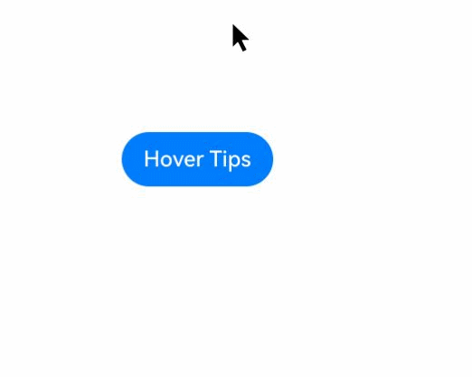
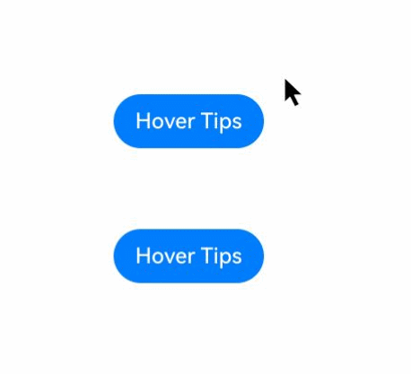

# Tips控制

为组件绑定Tips悬浮气泡，当鼠标悬浮在组件上时，自动显示提示信息；鼠标离开组件时，悬浮气泡自动隐藏。

>  **说明：**
>
>  从API version 19开始支持。后续版本如有新增内容，则采用上角标单独标记该内容的起始版本。
>
>  目前支持通过外接鼠标、手写笔以及触控板触发。

## bindTips
bindTips(message: TipsMessageType, options?: TipsOptions)

为组件绑定Tips悬浮气泡。

> **说明：**
>
> 当绑定bindTips的组件设置通用属性enable为false时，仍支持弹出悬浮气泡。

**原子化服务API：** 从API version 19开始，该接口支持在原子化服务中使用。

**系统能力：** SystemCapability.ArkUI.ArkUI.Full

**参数：** 

| 参数名 | 类型                                                         | 必填 | 说明                                                         |
| ------ | ------------------------------------------------------------ | ---- | ------------------------------------------------------------ |
| message|  [TipsMessageType](#tipsmessagetype)                                                     | 是   | 弹窗信息内容。 |
| options  | [TipsOptions](#tipsoptions类型说明) | 否   | 配置悬浮气泡的参数。<br/>默认值：<br/>{<br/>appearingTime: 700,<br/>disappearingTime: 300,<br/>appearingTimeWithContinuousOperation: 300,<br/>disappearingTimeWithContinuousOperation: 0, enableArrow: true,<br/>arrowPointPosition: ArrowPointPosition.CENTER,<br/>arrowWidth: 16,arrowHeight: 8vp,<br/>showAtAnchor: TipsAnchorType.TARGET<br/>} |

## TipsOptions类型说明

悬浮气泡自定义参数。

**系统能力：** SystemCapability.ArkUI.ArkUI.Full

| 名称                                  | 类型                                                         | 必填 | 说明                                                      |
| ------------------------------------- | ------------------------------------------------------------ | ---- | ------------------------------------------------------------ |
| appearingTime         |           number   | 否    |设置悬浮气泡的显示时延。 <br/>默认值：700<br/>单位：ms<br/>**原子化服务API：** 从API version 19开始，该接口支持在原子化服务中使用。 |
| disappearingTime                 |   number   | 否   | 设置悬浮气泡的隐藏时延。 <br/>默认值：300<br/>单位：ms<br/>**原子化服务API：** 从API version 19开始，该接口支持在原子化服务中使用。 |
| appearingTimeWithContinuousOperation    |     number   | 否   | 多个组件连续弹出悬浮气泡时，悬浮气泡的显示时延。 <br/>默认值：300<br/>单位：ms<br/>**原子化服务API：** 从API version 19开始，该接口支持在原子化服务中使用。 |
| disappearingTimeWithContinuousOperation |     number   | 否   | 多个组件连续弹出悬浮气泡时，悬浮气泡的隐藏时延。 <br/>默认值：0<br/>单位：ms<br/>**原子化服务API：** 从API version 19开始，该接口支持在原子化服务中使用。 |
| enableArrow        | boolean                                                      | 否   | 设置是否显示气泡箭头。值为true时，显示箭头；值为false时，不显示箭头。<br/>默认值：true<br/>**说明：** <br/>当页面可用空间无法让气泡完全避让时，气泡会覆盖到组件上并且不显示气泡箭头。<br/>**原子化服务API：** 从API version 19开始，该接口支持在原子化服务中使用。 |
| arrowPointPosition     | [ArrowPointPosition](ts-appendix-enums.md#arrowpointposition11) | 否   | 气泡箭头相对于父组件显示位置，气泡箭头在垂直和水平方向上有 ”Start“、”Center“、”End“三个位置点可选。所有位置点均位于父组件区域范围内，不会超出父组件的边界范围，也不会覆盖圆角范围。<br/>默认值：ArrowPointPosition.CENTER<br/>**原子化服务API：** 从API version 19开始，该接口支持在原子化服务中使用。 |
| arrowWidth           | [Dimension](ts-types.md#dimension10)                  | 否   | 设置气泡箭头宽度。若所设置的宽度超过所在边的长度减去两倍的气泡圆角大小，则不绘制气泡箭头。<br/>默认值：16<br/>单位：vp<br/>**说明：**<br />不支持设置百分比。<br/>**原子化服务API：** 从API version 19开始，该接口支持在原子化服务中使用。 |
| arrowHeight          | [Dimension](ts-types.md#dimension10)                  | 否   | 设置气泡箭头高度。<br/>默认值：8<br/>单位：vp<br/>**说明：**<br />不支持设置百分比。<br/>**原子化服务API：** 从API version 19开始，该接口支持在原子化服务中使用。 |
| showAtAnchor<sup>20+</sup> | [TipsAnchorType](ts-appendix-enums.md#tipsanchortype20)                  | 否   | 设置Tips跟随类型。<br/>默认值：TipsAnchorType.TARGET<br/>**原子化服务API：** 从API version 20开始，该接口支持在原子化服务中使用。    |

## TipsMessageType

type TipsMessageType = ResourceStr | StyledString

悬浮气泡弹窗信息。

**原子化服务API：** 从API version 19开始，该接口支持在原子化服务中使用。

**系统能力：** SystemCapability.ArkUI.ArkUI.Full

| 类型                                                       | 说明                                           |
| ---------------------------------------------------------- | ---------------------------------------------- |
| [ResourceStr](ts-types.md#resourcestr)                     | 字符串类型，用于描述字符串入参可以使用的类型。 |
| [StyledString](ts-universal-styled-string.md#styledstring) | 属性字符串。                                   |

## 示例
示例效果请以真机运行为准，当前DevEco Studio预览器不支持。
### 示例1（悬浮气泡的显示和消失）

此示例为bindTips通过绑定Button产生悬浮气泡。

```ts
// xxx.ets
@Entry
@Component
struct TipsExample {
  build() {
    Flex({ direction: FlexDirection.Column }) {
      Button('Hover Tips')
        .bindTips("Tips", {
          appearingTime: 700,
          disappearingTime: 300,
          appearingTimeWithContinuousOperation: 300,
          disappearingTimeWithContinuousOperation: 0,
          enableArrow: true,
        })
        .position({ x: 100, y: 250 })
    }.width('100%').padding({ top: 5 })
  }
}
```


### 示例2（多个悬浮气泡的显示和消失）

此示例展示了如何使用bindTips配置多个悬浮气泡依次显示和消失。

```ts
// xxx.ets

@Entry
@Component
struct TipsExample {
  build() {
    Flex({ direction: FlexDirection.Column }) {
      Button('Hover Tips')
        .bindTips("Tips", {
          appearingTime: 700,
          disappearingTime: 300,
          appearingTimeWithContinuousOperation: 300,
          disappearingTimeWithContinuousOperation: 0,
          enableArrow: true,
        })
        .position({ x: 100, y: 250 })

      Button('Hover Tips')
        .bindTips("Tips", {
          appearingTime: 700,
          disappearingTime: 300,
          appearingTimeWithContinuousOperation: 300,
          disappearingTimeWithContinuousOperation: 0,
          enableArrow: true,
        })
        .position({ x: 100, y: 350 })


    }.width('100%').padding({ top: 5 })
  }
}
```


