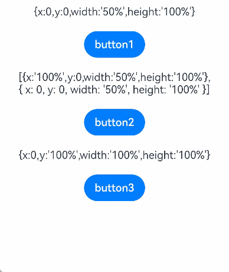

# 触摸热区设置
<!--Kit: ArkUI-->
<!--Subsystem: ArkUI-->
<!--Owner: @jiangtao92-->
<!--Designer: @piggyguy-->
<!--Tester: @songyanhong-->
<!--Adviser: @HelloCrease-->

适用于支持通用点击事件、通用触摸事件和通用手势处理的组件。


>  **说明：**
>
>  从API version 8开始支持。后续版本如有新增内容，则采用上角标单独标记该内容的起始版本。

## responseRegion

responseRegion(value: Array&lt;Rectangle&gt; | Rectangle): T

设置一个或多个触摸热区。

**卡片能力：** 从API version 9开始，该接口支持在ArkTS卡片中使用。

**原子化服务API：** 从API version 11开始，该接口支持在原子化服务中使用。

**系统能力：** SystemCapability.ArkUI.ArkUI.Full

**参数：**

| 参数名 | 类型                                                         | 必填 | 说明                                                         |
| ------ | ------------------------------------------------------------ | ---- | ------------------------------------------------------------ |
| value  | Array&lt;[Rectangle](#rectangle对象说明)&gt;&nbsp;\|&nbsp;[Rectangle](#rectangle对象说明) | 是   | 设置一个或多个触摸热区，包括位置和大小。<br/>默认触摸热区为整个组件，默认值：<br/>{<br/>x：0,<br/>y：0,<br/>width：'100%',<br/>height：'100%'<br/>}<br/> |

**返回值：**

| 类型 | 说明 |
| -------- | -------- |
| T | 返回当前组件。 |

## mouseResponseRegion<sup>10+</sup>

mouseResponseRegion(value: Array&lt;Rectangle&gt; | Rectangle): T

设置一个或多个触摸热区。

**原子化服务API：** 从API version 11开始，该接口支持在原子化服务中使用。

**系统能力：** SystemCapability.ArkUI.ArkUI.Full

**参数：**

| 参数名 | 类型                                                         | 必填 | 说明                                                         |
| ------ | ------------------------------------------------------------ | ---- | ------------------------------------------------------------ |
| value  | Array&lt;[Rectangle](#rectangle对象说明)&gt;&nbsp;\|&nbsp;[Rectangle](#rectangle对象说明) | 是   | 设置一个或多个触摸热区，包括位置和大小。<br/>默认触摸热区为整个组件，默认值：<br/>{<br/>x：0,<br/>y：0,<br/>width：'100%',<br/>height：'100%'<br/>} |

**返回值：**

| 类型 | 说明 |
| -------- | -------- |
| T | 返回当前组件。 |

## Rectangle对象说明

**卡片能力：** 从API version 9开始，该接口支持在ArkTS卡片中使用。

**原子化服务API：** 从API version 11开始，该接口支持在原子化服务中使用。

**系统能力：** SystemCapability.ArkUI.ArkUI.Full

| 名称        | 类型                        | 只读    |  可选   |  说明                             |
| ------ | ----------------------------- | -----| -----|-------------------------------- |
| x      | [Length](ts-types.md#length)  | 否   | 是   |触摸点相对于组件左上角的x轴坐标。<br/>默认值：0vp |
| y      | [Length](ts-types.md#length)  | 否   | 是   |触摸点相对于组件左上角的y轴坐标。<br/>默认值：0vp |
| width  | [Length](ts-types.md#length)  | 否   | 是   |触摸热区的宽度。<br/>默认值：'100%' |
| height | [Length](ts-types.md#length) | 否   | 是   |触摸热区的高度。<br/>默认值：'100%' |

  >  **说明：**
  >
  >  x和y可以设置正负值百分比。当x设置为'100%'时表示热区往右偏移组件本身宽度大小，当x设置为'-100%'时表示热区往左偏移组件本身宽度大小。当y设置为'100%'时表示热区往下偏移组件本身高度大小，当y设置为'-100%'时表示热区往上偏移组件本身高度大小。
  >
  >  width和height只能设置正值百分比。width：'100%'表示热区宽度设置为该组件本身的宽度。比如组件本身宽度是100vp，那么'100%'表示热区宽度也为100vp。height：'100%'表示热区高度设置为该组件本身的高度。
  >
  >  百分比相对于组件自身宽高进行计算。
  >
  >  当父组件设置[clip](ts-universal-attributes-sharp-clipping.md#clip12)(true)时，子组件的响应会受到父组件触摸热区的影响，不在父组件触摸热区内的子组件无法响应手势和事件。
  >
  >  width和height不支持calc()的动态计算。

## 示例

该示例通过responseRegion设置按钮的触摸热区以响应点击事件。

```ts
// xxx.ets
@Entry
@Component
struct TouchTargetExample {
  @State text: string = "";

  build() {
    Column({ space: 20 }) {
      Text("{x:0,y:0,width:'50%',height:'100%'}")
      // 热区宽度为按钮的一半，点击右侧无响应
      Button("button1")
        .responseRegion({ x: 0, y: 0, width: '50%', height: '100%' })
        .onClick(() => {
          this.text = 'button1 clicked'
        })

      // 为一个组件添加多个热区
      Text("[{x:'100%',y:0,width:'50%',height:'100%'}," +
      "\n{ x: 0, y: 0, width: '50%', height: '100%' }]")
      Button("button2")
        .responseRegion([
          { x: '100%', y: 0, width: '50%', height: '100%' }, // 第一个热区宽度为按钮的一半，点击按钮右侧宽度一半区域，点击事件生效
          { x: 0, y: 0, width: '50%', height: '100%' } // 第二个热区宽度为按钮的一半，点击button2左半边，点击事件生效
        ])
        .onClick(() => {
          this.text = 'button2 clicked'
        })
      // 热区大小为整个按钮，且下移一个按钮高度，点击button3下方按钮大小区域，点击事件生效
      Text("{x:0,y:'100%',width:'100%',height:'100%'}")
      Button("button3")
        .responseRegion({ x: 0, y: '100%', width: '100%', height: '100%' })
        .onClick(() => {
          this.text = 'button3 clicked'
        })

      Text(this.text).margin({ top: 50 })
    }.width('100%').margin({ top: 10 })
  }
}
```


