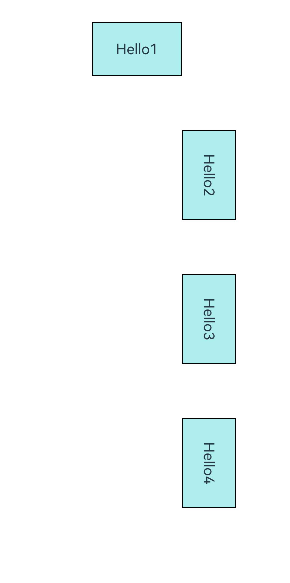
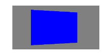

# 图形变换
<!--Kit: ArkUI-->
<!--Subsystem: ArkUI-->
<!--Owner: @CCFFWW-->
<!--Designer: @CCFFWW-->
<!--Tester: @lxl007-->
<!--Adviser: @HelloCrease-->

用于对组件进行旋转、平移、缩放、矩阵变换等操作。

> **说明：**
>
> 从API version 7开始支持。后续版本如有新增内容，则采用上角标单独标记该内容的起始版本。

## rotate

rotate(value: RotateOptions): T

设置组件旋转。

**卡片能力：** 从API version 9开始，该接口支持在ArkTS卡片中使用。

**原子化服务API：** 从API version 11开始，该接口支持在原子化服务中使用。

**系统能力：** SystemCapability.ArkUI.ArkUI.Full

**参数：** 

| 参数名 | 类型                                    | 必填 | 说明                                                         |
| ------ | --------------------------------------- | ---- | ------------------------------------------------------------ |
| value  | [RotateOptions](#rotateoptions对象说明) | 是   | 可使组件在以组件左上角为坐标原点的坐标系中进行旋转（坐标系如下图所示）。其中，(x,&nbsp;y,&nbsp;z）指定一个矢量，作为旋转轴。<br/>旋转轴和旋转中心点都基于坐标系设定，组件发生位移时，坐标系不会随之移动。<br/>默认值: 在x、y、z都不指定时，x、y、z的默认值分别为0、0、1。指定了x、y、z任何一个值时，x、y、z中未指定的值默认为0。<br/>{<br/>centerX:&nbsp;'50%',<br/>centerY:&nbsp;'50%',<br/>centerZ:&nbsp;0,<br/>perspective:&nbsp;0<br/>}<br/>单位：vp<br/><br/>centerZ、perspective从API version 10开始支持在ArkTS卡片中使用。 |

**返回值：**

| 类型   | 说明                     |
| ------ | ------------------------ |
| T | 返回当前组件。 |

## rotate<sup>18+</sup>

rotate(options: Optional\<RotateOptions>): T

设置组件旋转。与[rotate](#rotate)相比，options参数新增了对undefined类型的支持。

**卡片能力：** 从API version 18开始，该接口支持在ArkTS卡片中使用。

**原子化服务API：** 从API version 18开始，该接口支持在原子化服务中使用。

**系统能力：** SystemCapability.ArkUI.ArkUI.Full

**参数：** 

| 参数名  | 类型                                               | 必填 | 说明                                                         |
| ------- | -------------------------------------------------- | ---- | ------------------------------------------------------------ |
| options | [Optional](ts-universal-attributes-custom-property.md#optionalt12)\<[RotateOptions](#rotateoptions对象说明)> | 是   | 可使组件在以组件左上角为坐标原点的坐标系中进行旋转（坐标系如下图所示）。其中，(x,&nbsp;y,&nbsp;z）指定一个矢量，作为旋转轴。<br/>旋转轴和旋转中心点都基于坐标系设定，组件发生位移时，坐标系不会随之移动。<br/>默认值: 在x、y、z都不指定时，x、y、z的默认值分别为0、0、1。指定了x、y、z任何一个值时，x、y、z中未指定的值默认为0。<br/>{<br/>centerX:&nbsp;'50%',<br/>centerY:&nbsp;'50%',<br/>centerZ:&nbsp;0,<br/>perspective:&nbsp;0<br/>}<br/>单位：vp<br/><br/>centerZ、perspective从API version 10开始支持在ArkTS卡片中使用。<br/>当options的值为undefined时，恢复为无旋转效果。 |

**返回值：**

| 类型   | 说明                     |
| ------ | ------------------------ |
| T | 返回当前组件。 |

## rotate<sup>20+</sup>

rotate(options: Optional<RotateOptions | RotateAngleOptions>): T

设置组件旋转效果。与[rotate](#rotate18)相比，options参数新增了对RotateAngleOptions类型的支持。

**卡片能力：** 从API version 20开始，该接口支持在ArkTS卡片中使用。

**原子化服务API：** 从API version 20开始，该接口支持在原子化服务中使用。

**系统能力：** SystemCapability.ArkUI.ArkUI.Full

**参数：** 

| 参数名  | 类型                                                         | 必填 | 说明                                                         |
| ------- | ------------------------------------------------------------ | ---- | ------------------------------------------------------------ |
| options | [Optional](ts-universal-attributes-custom-property.md#optionalt12)\<[RotateOptions](#rotateoptions对象说明) \| [RotateAngleOptions](#rotateangleoptions20对象说明)> | 是   | RotateOptions可使组件在以组件左上角为坐标原点的坐标系中进行旋转（坐标系如下图所示）。其中，(x,&nbsp;y,&nbsp;z）指定一个矢量，作为旋转轴。<br/>旋转轴和旋转中心点都基于坐标系设定，组件发生位移时，坐标系不会随之移动。<br/>默认值：在x、y、z都不指定时，x、y、z的默认值分别为0、0、1。指定了x、y、z任何一个值时，x、y、z中未指定的值默认为0。<br/>{<br/>centerX:&nbsp;'50%',<br/>centerY:&nbsp;'50%',<br/>centerZ:&nbsp;0,<br/>perspective:&nbsp;0<br/>}<br/>RotateAngleOptions可使组件在以组件左上角为坐标原点的坐标系中进行旋转（坐标系如下图所示）。其中，(angleX,&nbsp;angleY,&nbsp;angleZ）指定三个轴方向上的旋转角。<br/>默认值：<br/>{<br/>angleX:0,<br />angleY:0,<br />angleZ:0,<br />centerX:&nbsp;'50%',<br/>centerY:&nbsp;'50%',<br/>centerZ:&nbsp;0,<br/>perspective:&nbsp;0<br/>}<br/><br/>当options的值为undefined时，恢复为无旋转效果。 |

**返回值：**

| 类型 | 说明           |
| ---- | -------------- |
| T    | 返回当前组件。 |

## translate

translate(value: TranslateOptions): T

设置组件平移。

**卡片能力：** 从API version 9开始，该接口支持在ArkTS卡片中使用。

**原子化服务API：** 从API version 11开始，该接口支持在原子化服务中使用。

**系统能力：** SystemCapability.ArkUI.ArkUI.Full

**参数：** 

| 参数名 | 类型                                          | 必填 | 说明                                                         |
| ------ | --------------------------------------------- | ---- | ------------------------------------------------------------ |
| value  | [TranslateOptions](#translateoptions对象说明) | 是   | 可使组件在以组件左上角为坐标原点的坐标系中进行移动（坐标系如下图所示）。其中，x，y，z的值分别表示在对应轴移动的距离，值为正时表示向对应轴的正向移动，值为负时表示向对应轴的反向移动。移动距离支持数字和字符串（比如'10px'，‘10%’）两种类型。<br/>默认值:<br/>{<br/>x:&nbsp;0,<br/>y:&nbsp;0,<br/>z:&nbsp;0<br/>}<br/>单位：vp<br/><br/>**说明：**<br/>z轴方向移动时由于观察点位置不变，z的值接近观察点组件会有放大效果，远离则缩小。<br/> |

**返回值：**

| 类型   | 说明                     |
| ------ | ------------------------ |
| T | 返回当前组件。 |

## translate<sup>18+</sup>

translate(translate: Optional\<TranslateOptions>): T

设置组件平移。与[translate](#translate)相比，translate参数新增了对undefined类型的支持。

**卡片能力：** 从API version 18开始，该接口支持在ArkTS卡片中使用。

**原子化服务API：** 从API version 18开始，该接口支持在原子化服务中使用。

**系统能力：** SystemCapability.ArkUI.ArkUI.Full

**参数：** 

| 参数名    | 类型                                                     | 必填 | 说明                                                         |
| --------- | -------------------------------------------------------- | ---- | ------------------------------------------------------------ |
| translate | [Optional](ts-universal-attributes-custom-property.md#optionalt12)\<[TranslateOptions](#translateoptions对象说明)> | 是   | 可使组件在以组件左上角为坐标原点的坐标系中进行移动（坐标系如下图所示）。其中，x，y，z的值分别表示在对应轴移动的距离，值为正时表示向对应轴的正向移动，值为负时表示向对应轴的反向移动。移动距离支持数字和字符串（比如'10px'，‘10%’）两种类型。<br/>默认值:<br/>{<br/>x:&nbsp;0,<br/>y:&nbsp;0,<br/>z:&nbsp;0<br/>}<br/>单位：vp<br/><br/>**说明：**<br/>z轴方向移动时由于观察点位置不变，z的值接近观察点组件会有放大效果，远离则缩小。<br/><br/>当translate的值为undefined时，恢复为无平移效果。 |

**返回值：**

| 类型   | 说明                     |
| ------ | ------------------------ |
| T | 返回当前组件。 |

## scale

scale(value: ScaleOptions): T

设置组件缩放。

**卡片能力：** 从API version 9开始，该接口支持在ArkTS卡片中使用。

**原子化服务API：** 从API version 11开始，该接口支持在原子化服务中使用。

**系统能力：** SystemCapability.ArkUI.ArkUI.Full

**参数：** 

| 参数名 | 类型                                  | 必填 | 说明                                                         |
| ------ | ------------------------------------- | ---- | ------------------------------------------------------------ |
| value  | [ScaleOptions](#scaleoptions对象说明) | 是   | 可以分别设置X轴、Y轴、Z轴的缩放比例，默认值为1，同时可以通过centerX和centerY设置缩放的中心点。<br/>默认值:<br/>{<br/>x:&nbsp;1,<br/>y:&nbsp;1,<br/>z:&nbsp;1,<br/>centerX:'50%',<br/>centerY:'50%'<br/>} |

**返回值：**

| 类型   | 说明                     |
| ------ | ------------------------ |
| T | 返回当前组件。 |

## scale<sup>18+</sup>

scale(options: Optional\<ScaleOptions>): T

设置组件缩放。与[scale](#scale)相比，options参数新增了对undefined类型的支持。

**卡片能力：** 从API version 18开始，该接口支持在ArkTS卡片中使用。

**原子化服务API：** 从API version 18开始，该接口支持在原子化服务中使用。

**系统能力：** SystemCapability.ArkUI.ArkUI.Full

**参数：** 

| 参数名  | 类型                                             | 必填 | 说明                                                         |
| ------- | ------------------------------------------------ | ---- | ------------------------------------------------------------ |
| options | [Optional](ts-universal-attributes-custom-property.md#optionalt12)\<[ScaleOptions](#scaleoptions对象说明)> | 是   | 可以分别设置X轴、Y轴、Z轴的缩放比例，默认值为1，同时可以通过centerX和centerY设置缩放的中心点。<br/>默认值:<br/>{<br/>x:&nbsp;1,<br/>y:&nbsp;1,<br/>z:&nbsp;1,<br/>centerX:'50%',<br/>centerY:'50%'<br/>}<br/>当options的值为undefined时，恢复为无缩放效果。 |

**返回值：**

| 类型   | 说明                     |
| ------ | ------------------------ |
| T | 返回当前组件。 |

## transform

transform(value: object): T

可用于显示二维变换时的矩阵变换。包含三维变换时应使用[transform3D](#transform3d20)接口。

**原子化服务API：** 从API version 11开始，该接口支持在原子化服务中使用。

**系统能力：** SystemCapability.ArkUI.ArkUI.Full

**参数：** 

| 参数名 | 类型   | 必填 | 说明                                                         |
| ------ | ------ | ---- | ------------------------------------------------------------ |
| value  | object | 是   | 设置当前组件的变换矩阵。object当前仅支持[Matrix4Transit](../js-apis-matrix4.md)矩阵对象类型。 |

**返回值：**

| 类型   | 说明                     |
| ------ | ------------------------ |
| T | 返回当前组件。 |

## transform<sup>18+</sup>

transform(transform: Optional\<object>): T

可用于显示二维变换时的矩阵变换。包含三维变换时应使用[transform3D](#transform3d20)接口。与[transform](#transform)相比，transform<sup>18+</sup>参数新增了对undefined类型的支持。

**原子化服务API：** 从API version 18开始，该接口支持在原子化服务中使用。

**系统能力：** SystemCapability.ArkUI.ArkUI.Full

**参数：** 

| 参数名 | 类型                                    | 必填 | 说明                     |
| ------ | --------------------------------------- | ---- | ------------------------ |
| transform | [Optional](ts-universal-attributes-custom-property.md#optionalt12)\<object> | 是 | 设置当前组件的变换矩阵。object当前仅支持[Matrix4Transit](../js-apis-matrix4.md)矩阵对象类型。<br/>当transform的值为undefined时，恢复为单位矩阵的效果。 |

**返回值：**

| 类型   | 说明                     |
| ------ | ------------------------ |
| T | 返回当前组件。 |

## transform3D<sup>20+</sup>

transform3D(transform: Optional\<Matrix4Transit>): T

设置组件的三维变换矩阵。当涉及包含透视效果的三维变换时，transform接口显示效果可能有误，推荐使用transform3D接口。

**原子化服务API：** 从API version 20开始，该接口支持在原子化服务中使用。

**系统能力：** SystemCapability.ArkUI.ArkUI.Full

**参数：** 

| 参数名    | 类型                                               | 必填 | 说明                                                         |
| --------- | -------------------------------------------------- | ---- | ------------------------------------------------------------ |
| transform | [Optional](ts-universal-attributes-custom-property.md#optionalt12)\<[Matrix4Transit](#matrix4transit20)> | 是   | 三维变换矩阵。<br/>当transform的值为undefined时，恢复为单位矩阵的效果。 |

**返回值：**

| 类型 | 说明           |
| ---- | -------------- |
| T    | 返回当前组件。 |

## Matrix4Transit<sup>20+</sup>

type Matrix4Transit = Matrix4Transit

**原子化服务API：** 从API version 20开始，该接口支持在原子化服务中使用。

**系统能力：** SystemCapability.ArkUI.ArkUI.Full

| 类型                              | 说明           |
| --------------------------------- | -------------- |
| [Matrix4Transit](../js-apis-matrix4.md#matrix4transit)     | 单位矩阵对象。 |

## RotateOptions对象说明

**原子化服务API：** 从API version 11开始，该接口支持在原子化服务中使用。

**系统能力：** SystemCapability.ArkUI.ArkUI.Full

| 名称                      | 类型                       | 只读 | 可选 | 说明                                                         |
| ------------------------- | -------------------------- | ---- | ---- | ------------------------------------------------------------ |
| x                         | number                     | 否   | 是   | 旋转轴向量x坐标。<br/>**卡片能力：** 从API version 9开始，该接口支持在ArkTS卡片中使用。|
| y                         | number                     | 否   | 是   | 旋转轴向量y坐标。<br/>**卡片能力：** 从API version 9开始，该接口支持在ArkTS卡片中使用。|
| z                         | number                     | 否   | 是   | 旋转轴向量z坐标。<br/>**卡片能力：** 从API version 9开始，该接口支持在ArkTS卡片中使用。|
| angle                     | number&nbsp;\|&nbsp;string | 否   | 否   | 旋转角度。取值为正时相对于旋转轴方向顺时针转动，取值为负时相对于旋转轴方向逆时针转动。取值可为string类型，如'90deg'。<br/>**卡片能力：** 从API version 9开始，该接口支持在ArkTS卡片中使用。 |
| centerX                   | number&nbsp;\|&nbsp;string | 否   | 是   | 变换中心点x轴坐标。表示组件变换中心点（即锚点）的x方向坐标。取值可为string类型，如'50'，'50%'。<br/>单位：vp<br/>**卡片能力：** 从API version 9开始，该接口支持在ArkTS卡片中使用。 |
| centerY                   | number&nbsp;\|&nbsp;string | 否   | 是   | 变换中心点y轴坐标。表示组件变换中心点（即锚点）的y方向坐标。取值可为string类型，如'50'，'50%'。<br/>单位：vp<br/>**卡片能力：** 从API version 10开始，该接口支持在ArkTS卡片中使用。 |
| centerZ<sup>10+</sup>     | number                     | 否   | 是   | z轴锚点，即3D旋转中心点的z轴分量。<br/>默认值：0<br/>单位：px<br/>**卡片能力：** 从API version 10开始，该接口支持在ArkTS卡片中使用。 |
| perspective<sup>10+</sup> | number                     | 否   | 是   | 相机放置的z轴坐标。数值大小表示视距，即相机到z=0平面的距离。取值的正负决定了相机观察的方向。当perspective=0，系统会自动计算适合的相机z轴位置，取值为负数。<br/>旋转轴和旋转中心点都基于坐标系设定，组件发生位移时，坐标系不会随之移动。<br/>默认值：0<br/>单位：px<br/>**卡片能力：** 从API version 10开始，该接口支持在ArkTS卡片中使用。 |

## RotateAngleOptions<sup>20+</sup>对象说明
指定各轴旋转角的旋转参数选项。

**卡片能力：** 从API version 20开始，该接口支持在ArkTS卡片中使用。

**原子化服务API：** 从API version 20开始，该接口支持在原子化服务中使用。

**系统能力：** SystemCapability.ArkUI.ArkUI.Full

| 名称                      | 类型                       | 只读 | 可选 | 说明                                                         |
| ------------------------- | -------------------------- | ---- | ---- | ------------------------------------------------------------ |
| angleX                    | number&nbsp;\|&nbsp;string | 否   | 是   | X轴方向上的旋转角。取值为正时相对于旋转轴方向顺时针转动，取值为负时逆时针转动。取值可为string类型，如'90deg'。<br/>默认值：0<br/>取值范围：(-∞, +∞) |
| angleY                    | number&nbsp;\|&nbsp;string | 否   | 是   | Y轴方向上的旋转角。取值为正时相对于旋转轴方向顺时针转动，取值为负时逆时针转动。取值可为string类型，如'90deg'。<br/>默认值：0<br/>取值范围：(-∞, +∞) |
| angleZ                    | number&nbsp;\|&nbsp;string | 否   | 是   | Z轴方向上的旋转角。取值为正时相对于旋转轴方向顺时针转动，取值为负时逆时针转动。取值可为string类型，如'90deg'。<br/>默认值：0<br/>取值范围：(-∞, +∞) |
| centerX                   | number&nbsp;\|&nbsp;string | 否   | 是   | 变换中心点x轴坐标。表示组件变换中心点（即锚点）的x方向坐标。<br/>单位：vp<br/>默认值：'50%'<br/>取值范围：(-∞, +∞) |
| centerY                   | number&nbsp;\|&nbsp;string | 否   | 是   | 变换中心点y轴坐标。表示组件变换中心点（即锚点）的y方向坐标。<br/>单位：vp<br/>默认值：'50%'<br/>取值范围：(-∞, +∞) |
| centerZ                   | number                     | 否   | 是   | z轴锚点，即3D旋转中心点的z轴分量。<br/>默认值：0<br/>单位：px<br/>取值范围：(-∞, +∞) |
| perspective               | number                     | 否   | 是   | 相机放置的z轴坐标。数值大小表示视距，即相机到z=0平面的距离。取值的正负决定了相机观察的方向。当perspective=0，系统会自动计算适合的相机z轴位置，取值为负数。<br/>旋转轴和旋转中心点都基于坐标系设定，组件发生位移时，坐标系不会随之移动。<br/>默认值：0<br/>单位：px<br/>取值范围：(-∞, +∞) |

## TranslateOptions对象说明

**卡片能力：** 从API version 9开始，该接口支持在ArkTS卡片中使用。

**原子化服务API：** 从API version 11开始，该接口支持在原子化服务中使用。

**系统能力：** SystemCapability.ArkUI.ArkUI.Full

| 名称 | 类型                       | 只读 | 可选 | 说明            |
| ---- | -------------------------- | ---- | ---- | --------------- |
| x    | number&nbsp;\|&nbsp;string | 否   | 是   | x轴的平移距离。<br/>类型为number时，单位为vp，取值范围为(-∞, +∞)。<br/>类型为string时，形式参考[Length](ts-types.md#length)的string类型。 |
| y    | number&nbsp;\|&nbsp;string | 否   | 是   | y轴的平移距离。<br/>类型为number时，单位为vp，取值范围为(-∞, +∞)。<br/>类型为string时，形式参考[Length](ts-types.md#length)的string类型。 |
| z    | number&nbsp;\|&nbsp;string | 否   | 是   | z轴的平移距离。<br/>类型为number时，单位为vp，取值范围为(-∞, +∞)。<br/>类型为string时，形式参考[Length](ts-types.md#length)的string类型。<br/>默认值：0.0 |

## ScaleOptions对象说明

**卡片能力：** 从API version 9开始，该接口支持在ArkTS卡片中使用。

**原子化服务API：** 从API version 11开始，该接口支持在原子化服务中使用。

**系统能力：** SystemCapability.ArkUI.ArkUI.Full

| 名称    | 类型                       | 只读 | 可选 | 说明                                                         |
| ------- | -------------------------- | ---- | ---- | ------------------------------------------------------------ |
| x       | number                     | 否   | 是   | x轴的缩放倍数。x>1时以x轴方向放大，0<x<1时以x轴方向缩小，x<0时沿x轴反向并缩放。 |
| y       | number                     | 否   | 是   | y轴的缩放倍数。y>1时以y轴方向放大，0<y<1时以y轴方向缩小，y<0时沿y轴反向并缩放。 |
| z       | number                     | 否   | 是   | z轴的缩放倍数。z>1时以z轴方向放大，0<z<1时以z轴方向缩小，z<0时沿z轴反向并缩放。 |
| centerX | number&nbsp;\|&nbsp;string | 否   | 是   | 变换中心点x轴坐标。表示组件变换中心点（即锚点）的x方向坐标。取值可为string类型，如'50'，'50%'。<br/>单位：vp |
| centerY | number&nbsp;\|&nbsp;string | 否   | 是   | 变换中心点y轴坐标。表示组件变换中心点（即锚点）的y方向坐标。取值可为string类型，如'50'，'50%'。<br/>单位：vp |

> **说明：**
>
> 当组件同时设置了rotate和scale属性时，centerX和centerY的取值会发生冲突，此时centerX和centerY的值以最后设定的属性的值为准。

## 示例

### 示例1（为组件添加图形变换效果）

该示例通过rotate、translate、scale、transform为组件添加旋转、平移、缩放、变换矩阵效果。

```ts
// xxx.ets
import { matrix4 } from '@kit.ArkUI';

@Entry
@Component
struct TransformExample {
  build() {
    Column() {
      Text('rotate').width('90%').fontColor(0xCCCCCC).padding(15).fontSize(14)
      Row()
        .rotate({
          x: 0,
          y: 0,
          z: 1,
          centerX: '50%',
          centerY: '50%',
          angle: 300
        })// 组件以矢量(0,0,1)为旋转轴，绕中心点顺时针旋转300度
        .width(100).height(100).backgroundColor(0xAFEEEE)

      Text('translate').width('90%').fontColor(0xCCCCCC).padding(10).fontSize(14)
      Row()
        .translate({ x: 100, y: 10 })// x轴方向平移100，y轴方向平移10
        .width(100)
        .height(100)
        .backgroundColor(0xAFEEEE)
        .margin({ bottom: 10 })

      Text('scale').width('90%').fontColor(0xCCCCCC).padding(15).fontSize(14)
      Row()
        .scale({ x: 2, y: 0.5 })// 高度缩小一倍，宽度放大一倍，z轴在2D下无效果
        .width(100).height(100).backgroundColor(0xAFEEEE)

      Text('Matrix4').width('90%').fontColor(0xCCCCCC).padding(15).fontSize(14)
      Row()
        .width(100).height(100).backgroundColor(0xAFEEEE)
        .transform(matrix4.identity().translate({ x: 50, y: 50 }).scale({ x: 1.5, y: 1 }).rotate({
          x: 0,
          y: 0,
          z: 1,
          angle: 60
        }))
    }.width('100%').margin({ top: 5 })
  }
}
```


### 示例2（设置旋转视距）

该示例通过perspective为组件添加视距效果。

```ts
// xxx.ets
@Entry
@Component
struct Index {
  @State prep: number = 10;

  build() {
    Row() {
      Column() {
        Stack()
          .width(100)
          .height(100)
          .backgroundColor(Color.Red)
          .rotate({ y: 1, angle: 45, perspective: this.prep })
        Button('change prep')
          .margin({ top: 100 })
          .onClick(() => {
            this.getUIContext()?.animateTo({
              duration: 2000,
              curve: Curve.EaseIn,
              iterations: 1,
              playMode: PlayMode.Normal,
              onFinish: () => {
                console.info('play end');
              }
            }, () => {
              this.prep = 500 // 组件视距从10变换到500
            })
          })
      }
      .width('100%')
    }
    .height('100%')
  }
}
```


### 示例3（按中心点旋转）

该示例通过设置rotate和transform为不同的参数实现相同的旋转效果。

```ts
import { matrix4 } from '@kit.ArkUI';

@Entry
@Component
struct MatrixExample {
  build() {
    Column({ space: 100 }) {
      Text('Hello1')
        .textAlign(TextAlign.Center)
        .width(100)
        .height(60)
        .backgroundColor(0xAFEEEE)
        .borderWidth(1)

      Text('Hello2')
        .textAlign(TextAlign.Center)
        .width(100)
        .height(60)
        .backgroundColor(0xAFEEEE)
        .borderWidth(1)
        .rotate({
          // 绕(100vp,60vp)的锚点旋转90度，rotate或scale的centerX、centerY为组件锚点
          z: 1,
          angle: 90,
          centerX: 100,
          centerY: 60
        })

      Text('Hello3')
        .textAlign(TextAlign.Center)
        .width(100)
        .height(60)
        .backgroundColor(0xAFEEEE)
        .borderWidth(1)
        .transform(matrix4.identity()
          .rotate({
            // 组件锚点(centerX,centerY)默认为(50%,50%)，即锚点在(50vp,30vp)
            // transform的rotate指定(centerX,centerY)为(50vp,30vp)，相对于在组件本身锚点基础上再额外偏移(50vp,30vp)
            // 此次变换相当于绕(100vp,60vp)旋转，和"Hello2"实现同样的旋转效果
            z: 1,
            angle: 90,
            centerX: this.getUIContext().vp2px(50),
            centerY: this.getUIContext().vp2px(30)
          }))

      Text('Hello4')
        .textAlign(TextAlign.Center)
        .width(100)
        .height(60)
        .backgroundColor(0xAFEEEE)
        .borderWidth(1)
        .scale({
          // 当设置x或y时，centerX和centerY才能生效
          // 设置组件锚点为(100vp,60vp)
          x: 1,
          y: 1,
          centerX: 100,
          centerY: 60
        })// transform的rotate不指定centerX、centerY，此次旋转的中心相对于组件本身锚点没有额外偏移
          // 该组件通过scale设置的锚点，绕(100vp,60vp)进行旋转，和"Hello2"实现同样的旋转效果
        .transform(matrix4.identity().rotate({ z: 1, angle: 90 }))
    }.width('100%')
    .height('100%')
  }
}
```



### 示例4（通过transform3D实现图形变换）

该示例通过设置transform3D实现图形变换效果。

```ts
import { matrix4 } from '@kit.ArkUI';

let matrix: matrix4.Matrix4Transit = matrix4.init([
  0.53033, 0, -0.53033, 0.00053033,
  0, 0.75, 0, 0,
  0.707107, 0, 0.707107, -0.000707107,
  0, 0, 0, 1
])

@Entry
@Component
struct Tests {
  build() {
    Column() {
      Stack() {
        Stack()
          .width(200)
          .height(100)
          .backgroundColor(Color.Grey)
        Stack()
          .width(200)
          .height(100)
          .backgroundColor(Color.Blue)
          .transform3D(matrix)
      }
    }.width('100%')
  }
}
```



### 示例5（按各轴旋转角的方式实现旋转）

该示例通过设置rotate的[RotateAngleOptions](#rotateangleoptions20对象说明)参数实现旋转效果。

```ts
// xxx.ets
@Entry
@Component
struct Index {

  build() {
    Row() {
      Column() {
        Stack()
          .width(100)
          .height(100)
          .backgroundColor(Color.Blue)
          .rotate({ angleZ: -45 })
        Button('rotateAngle')
          .width("40%")
          .margin({ top: 100 })
          .rotate({ angleY: 30, centerX: '90%', perspective: 10 })
        Image($r("app.media.startIcon"))
          .width(200)
          .height(200)
          .rotate({ angleX: 60, angleY: -125, angleZ: 75, centerX: 100, centerZ: 20})
      }
      .width('100%')
    }
    .height('100%')
  }
}
```


