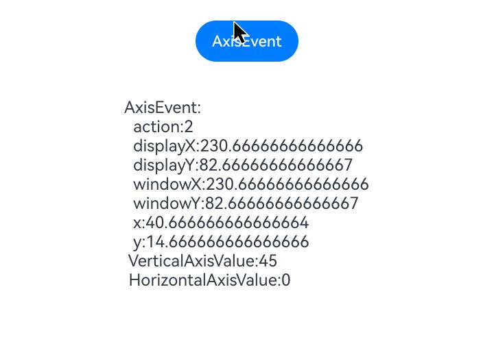

# 轴事件

轴事件指组件被鼠标滚轮滚动或触控板双指沿特定方向（轴）滑动进行交互时触发的事件。此处“轴”指的是二维坐标系中的方向，分为水平方向（X轴）和垂直方向（Y轴）。

>  **说明：**
>
>  从API Version 18开始支持。后续版本如有新增内容，则采用上角标单独标记该内容的起始版本。

## onAxisEvent

onAxisEvent(event: (event: AxisEvent) => void): T

鼠标滚轮滚动或触控板双指移动触发该回调。

**卡片能力：** 从API version 18开始，该接口支持在ArkTS卡片中使用。

**原子化服务API：** 从API version 18开始，该接口支持在原子化服务中使用。

**系统能力：** SystemCapability.ArkUI.ArkUI.Full

**参数：**

| 参数名 | 类型                              | 必填 | 说明                 |
| ------ | --------------------------------- | ---- | -------------------- |
| event  | [AxisEvent](#axisevent) | 是   | 获得[AxisEvent](#axisevent)对象。 |

**返回值：**

| 类型 | 说明 |
| -------- | -------- |
| T | 返回当前组件。 |

## AxisEvent

轴事件的对象说明，继承于[BaseEvent](ts-gesture-customize-judge.md#baseevent对象说明)。

**原子化服务API：** 从API version 18开始，该接口支持在原子化服务中使用。

**系统能力：** SystemCapability.ArkUI.ArkUI.Full

### 属性

| 名称            | 类型  | 只读|可选                              | 说明                                                    |
| ------------------- | -----------------------|------|----- | -------------------------------------------------------- |
| action              | [AxisAction](ts-appendix-enums.md#axisaction18)           | 是   | 否   | 轴事件的动作类型                   |
| x                   | number                 | 是   | 否   | 鼠标光标相对于被点击元素左边缘的X坐标。<br/>单位：vp  |
| y                   | number                 | 是   | 否   | 鼠标光标相对于被点击元素上边缘的Y坐标。<br/>单位：vp  |
| windowX             | number                 | 是   | 否   | 鼠标光标相对于当前窗口左上角的X坐标。<br/>单位：vp |
| windowY             | number                 | 是   | 否   | 鼠标光标相对于当前窗口左上角的Y坐标。<br/>单位：vp |
| displayX            | number                 | 是   | 否   | 鼠标光标相对于当前屏幕左上角的X坐标。<br/>单位：vp |
| displayY            | number                 | 是   | 否   | 鼠标光标相对于当前屏幕左上角的Y坐标。<br/>单位：vp |
| scrollStep          | number                 | 是   | 否   | 鼠标轴滚动步长配置。<br/> **说明：**&nbsp;仅支持鼠标滚轮，取值范围0~65535。|
| propagation         | Callback\<void>        | 是   | 否   | 激活事件冒泡。   |

### getHorizontalAxisValue

getHorizontalAxisValue(): number

获取此次轴事件的水平轴值。

**原子化服务API：** 从API version 18开始，该接口支持在原子化服务中使用。

**系统能力：** SystemCapability.ArkUI.ArkUI.Full

**返回值：**

| 类型              |说明       |
| ------- | --------------------------------- | 
| number | 水平轴值。 |

### getVerticalAxisValue

getVerticalAxisValue(): number

获取此次轴事件的垂直轴值。

**原子化服务API：** 从API version 18开始，该接口支持在原子化服务中使用。

**系统能力：** SystemCapability.ArkUI.ArkUI.Full

**返回值：**

| 类型              |说明       |
| ------- | --------------------------------- | 
| number | 垂直轴值。 |

## 示例

该示例通过按钮设置了轴事件，在按钮上滚动鼠标滚轮可获取轴事件的相关参数。

```ts
// xxx.ets
@Entry
@Component
struct AxisEventExample {
  @State text: string = ''

  build() {
    Column() {
      Row({ space: 20 }) {
        Button('AxisEvent').width(100).height(40)
          .onAxisEvent((event?: AxisEvent) => {
            if (event) {
              this.text =
                'AxisEvent:' + '\n  action:' + event.action + '\n  displayX:' + event.displayX + '\n  displayY:' +
                event.displayY + '\n  windowX:' + event.windowX + '\n  windowY:' + event.windowY + '\n  x:' + event.x +
                  '\n  y:' + event.y + '\n VerticalAxisValue:' + event.getVerticalAxisValue() +
                  '\n HorizontalAxisValue:' + event.getHorizontalAxisValue()
            }
          })
      }.margin(20)

      Text(this.text).margin(15)
    }.width('100%')
  }
}
```

鼠标滚轮滚动时：


