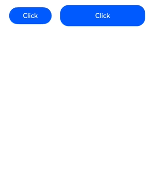

# 点击事件

组件被点击时触发的事件。

>  **说明：**
>
>  从API version 7开始支持。后续版本如有新增内容，则采用上角标单独标记该内容的起始版本。
>
>  点击事件遵循[触摸事件](../arkui-ts/ts-universal-events-touch.md#触摸事件)分发流程，触摸事件支持屏蔽、透传等自定义行为。
>
>  事件分发可参考[事件交互流程](../../../ui/arkts-interaction-basic-principles.md#事件交互流程)，手势事件处理流程可参考[多层级手势事件](../../../ui/arkts-gesture-events-multi-level-gesture.md)。

## onClick<sup>12+</sup>

onClick(event: Callback\<ClickEvent>, distanceThreshold: number): T

点击动作触发该回调。

当触发点击事件的设备类型为键盘或手柄时，事件的[SourceTool](ts-gesture-settings.md#sourcetool枚举说明9)值为Unknown。

新增distanceThreshold参数，设置点击手势移动阈值。手指移动超出阈值时，点击手势识别失败。
对于无手指移动距离限制的点击场景，建议使用原有接口。若需限制点击时手指移动范围，建议使用该接口。

**卡片能力：** 从API version 12开始，该接口支持在ArkTS卡片中使用。

>  **说明：**
>
>  从API version 12开始，在使用卡片能力时，存在以下限制：
>  1. 如果手指按下超过800ms，不能触发点击事件。
>  2. 如果手指按下之后移动位移超过20px，不能触发点击事件。

**原子化服务API：** 从API version 12开始，该接口支持在原子化服务中使用。

**系统能力：** SystemCapability.ArkUI.ArkUI.Full

**参数：** 

| 参数名 | 类型                              | 必填 | 说明                 |
| ------ | --------------------------------- | ---- | -------------------- |
| event  | Callback\<[ClickEvent](#clickevent对象说明)> | 是   | 点击事件的回调函数。 |
| distanceThreshold  | number | 是   | 点击事件移动阈值。当设置的值小于等于0时，会被转化为默认值。<br/>默认值：2^31-1<br/>单位：vp<br/>**说明：**<br/>当手指的移动距离超出开发者预设的移动阈值时，点击识别失败。如果初始化为默认阈值时，手指移动超过组件热区范围，点击识别失败。 |

>  **说明：**
>
>  如果是滑动操作，但是滑动距离未超过点击事件移动阈值并且抬手时手指在组件热区范围内，也会触发点击事件。

**返回值：**

| 类型 | 说明 |
| -------- | -------- |
| T | 返回当前组件。 |

## onClick

onClick(event: (event: ClickEvent) => void): T

点击动作触发该回调。

触发点击事件的设备类型为键盘或手柄时，事件的SourceTool值为Unknown。

**卡片能力：** 从API version 9开始，该接口支持在ArkTS卡片中使用。

>  **说明：**
>
>  从API version 9开始，在使用卡片能力时，存在以下限制：
>  1. 如果手指按下超过800ms，不能触发点击事件。
>  2. 如果手指按下之后移动位移超过20px，不能触发点击事件。

**原子化服务API：** 从API version 11开始，该接口支持在原子化服务中使用。

**系统能力：** SystemCapability.ArkUI.ArkUI.Full

**参数：** 

| 参数名 | 类型                              | 必填 | 说明                 |
| ------ | --------------------------------- | ---- | -------------------- |
| event  | (event: [ClickEvent](#clickevent对象说明)) => void | 是   | 点击事件的回调函数。 |

**返回值：**

| 类型 | 说明 |
| -------- | -------- |
| T | 返回当前组件。 |

## ClickEvent对象说明

继承于[BaseEvent](ts-gesture-customize-judge.md#baseevent对象说明8)。

**系统能力：** SystemCapability.ArkUI.ArkUI.Full

| 名称            | 类型                                 | 描述                                                     |
| ------------------- | ------------------------------------ | -------------------------------------------------------- |
| x                   | number                               | 点击位置相对于被点击元素左边缘的X坐标。<br/>单位：vp<br/>**卡片能力：** 从API version 9开始，该接口支持在ArkTS卡片中使用。<br/>**原子化服务API：** 从API version 11开始，该接口支持在原子化服务中使用。     |
| y                   | number                               | 点击位置相对于被点击元素原始区域左上角的Y坐标。<br/>单位：vp<br/>**卡片能力：** 从API version 9开始，该接口支持在ArkTS卡片中使用。<br/>**原子化服务API：** 从API version 11开始，该接口支持在原子化服务中使用。          |
| target<sup>8+</sup> | [EventTarget](#eventtarget8对象说明) | 触发事件的元素对象显示区域。<br/>**卡片能力：** 从API version 9开始，该接口支持在ArkTS卡片中使用。<br/>**原子化服务API：** 从API version 11开始，该接口支持在原子化服务中使用。  |
| windowX<sup>10+</sup> | number                             | 点击位置相对于应用窗口左上角的X坐标。<br/>单位：vp<br/>**原子化服务API：** 从API version 11开始，该接口支持在原子化服务中使用。 |
| windowY<sup>10+</sup> | number                             | 点击位置相对于应用窗口左上角的Y坐标。<br/>单位：vp<br/>**原子化服务API：** 从API version 11开始，该接口支持在原子化服务中使用。 |
| displayX<sup>10+</sup> | number                            | 点击位置相对于应用屏幕左上角的X坐标。<br/>单位：vp<br/>**原子化服务API：** 从API version 11开始，该接口支持在原子化服务中使用。 |
| displayY<sup>10+</sup> | number                            | 点击位置相对于应用屏幕左上角的Y坐标。<br/>单位：vp<br/>**原子化服务API：** 从API version 11开始，该接口支持在原子化服务中使用。 |
| screenX<sup>(deprecated)</sup> | number                    | 点击位置相对于应用窗口左上角的X坐标。<br>单位：vp<br/>从API version 10开始不再维护，建议使用windowX代替。 |
| screenY<sup>(deprecated)</sup> | number                    | 点击位置相对于应用窗口左上角的Y坐标。<br>单位：vp<br/>从API version 10开始不再维护，建议使用windowY代替。 |
| preventDefault<sup>12+</sup>      | () => void | 阻止默认事件。<br/> **说明：**&nbsp;该接口仅支持部分组件使用，当前支持组件：RichEditor、Hyperlink，不支持的组件使用时会抛出异常。暂不支持异步调用和提供Modifier接口。<br/>**原子化服务API：** 从API version 12开始，该接口支持在原子化服务中使用。|
| targetDisplayId<sup>15+</sup> | number | 事件发生的屏幕ID。<br />**原子化服务API：** 从API version 15开始，该接口支持在原子化服务中使用。 |
| hand<sup>15+</sup> | [InteractionHand](./ts-gesture-settings.md#interactionhand枚举说明15) | 表示事件是由左手点击还是右手点击触发。<br />**原子化服务API：** 从API version 15开始，该接口支持在原子化服务中使用。 |
| globalDisplayX<sup>20+</sup> | number | 点击位置相对于全局屏幕的左上角的X坐标。<br/>单位：vp<br/>取值范围：[0, +∞)<br/>**原子化服务API：** 从API version 20开始，该接口支持在原子化服务中使用。 |
| globalDisplayY<sup>20+</sup> | number | 点击位置相对于全局屏幕的左上角的Y坐标。<br/>单位：vp<br/>取值范围：[0, +∞)<br/>**原子化服务API：** 从API version 20开始，该接口支持在原子化服务中使用。 |

**错误码：**

以下错误码的详细介绍请参见[交互事件错误码](../errorcode-event.md)。

| 错误码ID   | 错误信息 |
| --------- | ------- |
| 100017       | Component does not support prevent function. |

## EventTarget<sup>8+</sup>对象说明

触发事件的元素对象显示区域。

**卡片能力：** 从API version 9开始，该接口支持在ArkTS卡片中使用。

**原子化服务API：** 从API version 11开始，该接口支持在原子化服务中使用。

**系统能力：** SystemCapability.ArkUI.ArkUI.Full

| 名称   | 参数类型                      | 描述         |
| ---- | ------------------------- | ---------- |
| area | [Area](ts-types.md#area8) | 目标元素的区域信息。 |
| id<sup>15+</sup> | [string](ts-universal-attributes-component-id.md) | 开发者设置的节点id。默认值：undefined |

## 示例

该示例通过按钮设置了点击事件，点击按钮可获取点击事件的相关参数。

```ts
// xxx.ets
@Entry
@Component
struct ClickExample {
  @State text: string = '';

  build() {
    Column() {
      Row({ space: 20 }) {
        Button('Click').width(100).height(40).id('click1')
          .onClick((event?: ClickEvent) => {
            if(event){
              this.text = 'Click Point:' + '\n  windowX:' + event.windowX + '\n  windowY:' + event.windowY
                + '\n  x:' + event.x + '\n  y:' + event.y + '\ntarget:' + '\n  component globalPos:('
                + event.target.area.globalPosition.x + ',' + event.target.area.globalPosition.y + ')\n  width:'
                + event.target.area.width + '\n  height:' + event.target.area.height + '\ntimestamp' + event.timestamp
                + '\n id:'+ event.target.id + '\ntargetDisplayId:' + event.targetDisplayId;
            }
          }, 20)
        Button('Click').width(200).height(50).id('click2')
          .onClick((event?: ClickEvent) => {
            if(event){
              this.text = 'Click Point:' + '\n  windowX:' + event.windowX + '\n  windowY:' + event.windowY
                + '\n  x:' + event.x + '\n  y:' + event.y + '\ntarget:' + '\n  component globalPos:('
                + event.target.area.globalPosition.x + ',' + event.target.area.globalPosition.y + ')\n  width:'
                + event.target.area.width + '\n  height:' + event.target.area.height + '\ntimestamp' + event.timestamp
                + '\n id:'+ event.target.id + '\ntargetDisplayId:' + event.targetDisplayId;
            }
          }, 20)
      }.margin(20)

      Text(this.text).margin(15)
    }.width('100%')
  }
}
```
