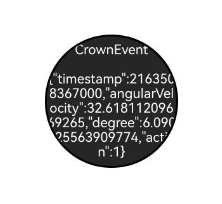

# 表冠事件
  是指扭动表冠时触发的事件，组件可使用焦点事件来处理相关逻辑。

>  **说明：**
>
>  - 从API Version 12开始支持。后续版本如有新增内容，则采用上角标单独标记该内容的起始版本。
>
>  - 存在默认交互逻辑的组件。例如，Slider，Picker，List，ScrollBar，Swiper等。
>
>  - 组件需要先获焦，才能收到表冠事件。
>
>  - 旋转表冠事件只支持穿戴设备，默认该功能不打开。
>

## onDigitalCrown

onDigitalCrown(handler: Optional&lt;Callback&lt;CrownEvent&gt;&gt;): T

应用获焦以后扭动表冠时触发该回调。

**原子化服务API：** 从API version 12开始，该接口支持在元服务中使用。

**系统能力：** SystemCapability.ArkUI.ArkUI.Full


**参数：** 
| 参数名      | 类型                             | 必填     | 描述                                      |
| ---------- | -------------------------------- | ------- | ----------------------------------------- |
| handler      | Optional&lt;Callback&lt;[CrownEvent](#crownevent对象说明)&gt;&gt; | 是       | 获得[CrownEvent](#crownevent对象说明)对象。   |


**返回值：**
| 类型       | 描述           |
| --------- | ---------------|
| T         | 返回当前组件。   |

## CrownEvent对象说明

**系统能力：** SystemCapability.ArkUI.ArkUI.Full

| 名称                   | 类型           | 描述                                    |
| --------------------- | -------------- | -------------------------------------- |
| timestamp	        | number	 | 时间戳。                                  |
| angularVelocity	| number	 | 旋转角速度，每秒转的角度。                   |
| degree	        | number 	 | 相对旋转角度，单位：度，取值范围:[-360 360]。     |
| action	        | [CrownAction](ts-appendix-enums.md#crownaction12)   | 表冠动作。  |
| stopPropagation	| () => void     | 阻止事件冒泡。                         |

## 示例

```ts
// xxx.ets
@Entry
@Component
struct CityList {
  @State message: string = "onDigitalCrown";

  build() {
    Column() {
      Row(){
        Stack() {
          Text(this.message)
            .fontSize(20)
            .fontColor(Color.White)
            .backgroundColor("#262626")
            .textAlign(TextAlign.Center)
            .focusable(true)
            .focusOnTouch(true)
            .defaultFocus(true)
            .borderWidth(2)
            .width(223).height(223)
            .borderRadius(110)
            .onDigitalCrown((event: CrownEvent) => {
              event.stopPropagation();
              this.message = "CrownEvent\n\n" + JSON.stringify(event);
              console.debug("action:%d, angularVelocity:%f, degree:%f, timestamp:%f",
                event.action, event.angularVelocity, event.degree, event.timestamp);
            })
        }.width("100%").height("100%")
      }.width("100%").height("100%")
    }
  }
}
```


