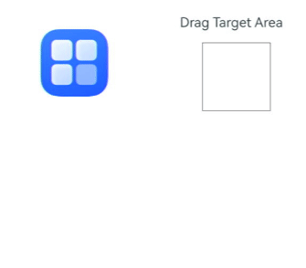

# 拖拽事件

拖拽事件指组件被长按后拖拽时触发的事件。

>  **说明：**
>
>  从API Version 8开始支持。后续版本如有新增内容，则采用上角标单独标记该内容的起始版本。
>
> 应用本身预置的资源文件（即应用在安装前的HAP包中已经存在的资源文件）仅支持本地应用内拖拽。

ArkUI框架对以下组件实现了默认的拖拽能力，支持对数据的拖出或拖入响应。开发者也可以通过实现通用拖拽事件来自定义拖拽响应。

- 默认支持拖出能力的组件（可从组件上拖出数据）：[Search](ts-basic-components-search.md)、[TextInput](ts-basic-components-textinput.md)、[TextArea](ts-basic-components-textarea.md)、[RichEditor](ts-basic-components-richeditor.md)、[Text](ts-basic-components-text.md)、[Image](ts-basic-components-image.md)、<!--Del-->[FormComponent](ts-basic-components-formcomponent-sys.md)、<!--DelEnd-->[Hyperlink](ts-container-hyperlink.md)，开发者可通过设置这些组件的[draggable](ts-universal-attributes-drag-drop.md#draggable)属性来控制对默认拖拽能力的使用。

- 默认支持拖入能力的组件（目标组件可响应拖入数据）：[Search](ts-basic-components-search.md)、[TextInput](ts-basic-components-textinput.md)、[TextArea](ts-basic-components-textarea.md)、[RichEditor](ts-basic-components-richeditor.md)，开发者可通过设置这些组件的[allowDrop](ts-universal-attributes-drag-drop.md#allowdrop)属性为null来禁用对默认拖入能力的支持。

<!--RP1--><!--RP1End-->其他组件需要开发者将draggable属性设置为true，并在onDragStart等接口中实现数据传输相关内容，才能正确处理拖拽。

> **说明：**
>
> Text组件需配合[copyOption](ts-basic-components-text.md#copyoption9)一起使用，设置copyOptions为CopyOptions.InApp或者CopyOptions.LocalDevice。

## onDragStart

onDragStart(event: (event: DragEvent, extraParams?: string) => CustomBuilder | DragItemInfo)

第一次拖拽此事件绑定的组件时，长按时间 >= 500ms，然后手指移动距离 >= 10vp，触发回调。

针对默认支持拖出能力的组件，如果开发者设置了onDragStart，优先执行开发者的onDragStart，并根据执行情况决定是否使用系统默认的拖出能力，具体为：
- 如果开发者返回了自定义背板图，则不再使用系统默认的拖拽背板图；
- 如果开发者设置了拖拽数据，则不再使用系统默认填充的拖拽数据。

文本类组件[Text](ts-basic-components-text.md)、[Search](ts-basic-components-search.md)、[TextInput](ts-basic-components-textinput.md)、[TextArea](ts-basic-components-textarea.md)、[RichEditor](ts-basic-components-richeditor.md)对选中的文本内容进行拖拽时，不支持背板图的自定义。当onDragStart与菜单预览一起使用或使用了默认支持拖出能力的组件时，预览及菜单项上的自定义内容不支持拖拽。

**原子化服务API：** 从API version 11开始，该接口支持在原子化服务中使用。

**事件优先级：** 长按触发时间 < 500ms，长按事件优先拖拽事件响应，长按触发时间 >= 500ms，拖拽事件优先长按事件响应。

**系统能力：** SystemCapability.ArkUI.ArkUI.Full

**参数：** 

| 参数名      | 类型                            | 必填 | 说明               |
| ----------- | ------------------------------- | ---- | ------------------ |
| event    | (event: [DragEvent](#dragevent7), extraParams?: string) => [CustomBuilder](ts-types.md#custombuilder8) &nbsp;\|&nbsp; [DragItemInfo](#dragiteminfo说明)  | 是   | 回调函数。<br/> **说明：**<br/> event为拖拽事件信息。<br/> extraParams为拖拽事件额外信息。需要解析为Json格式，参考[extraParams](#extraparams说明)说明。|

**返回值：**

| 类型                                                         | 说明                     |
| ------------------------------------------------------------ | ------------------------ |
| [CustomBuilder](ts-types.md#custombuilder8)&nbsp;\|&nbsp;[DragItemInfo](#dragiteminfo说明) | 拽过程中显示的组件信息。<br/>**说明：** 不支持全局builder。 |

## onDragEnter

onDragEnter(event: (event: DragEvent, extraParams?: string) => void)

拖拽进入组件范围内时，触发回调，当监听了[onDrop](#ondrop)事件时，此事件才有效。

**原子化服务API：** 从API version 11开始，该接口支持在原子化服务中使用。

**系统能力：** SystemCapability.ArkUI.ArkUI.Full

**参数：** 

| 参数名      | 类型                            | 必填 | 说明                           |
| ----------- | ------------------------------- | ---- | ------------------------------ |
| event    | (event: [DragEvent](#dragevent7), extraParams?: string) => void   | 是   | 回调函数。<br/>**说明：**<br/> event为拖拽事件信息，包括拖拽点坐标。<br/> extraParams为拖拽事件额外信息，需要解析为Json格式，参考[extraParams](#extraparams说明)说明。|

## onDragMove

onDragMove(event: (event: DragEvent, extraParams?: string) => void)

拖拽在组件范围内移动时，触发回调，当监听了[onDrop](#ondrop)事件时，此事件才有效。

**原子化服务API：** 从API version 11开始，该接口支持在原子化服务中使用。

**系统能力：** SystemCapability.ArkUI.ArkUI.Full

**参数：** 

| 参数名      | 类型                            | 必填 | 说明                           |
| ----------- | ------------------------------- | ---- | ------------------------------ |
| event    | (event: [DragEvent](#dragevent7), extraParams?: string) => void   | 是   | 回调函数。<br/>**说明：**<br/> event为拖拽事件信息，包括拖拽点坐标。<br/> extraParams为拖拽事件额外信息，需要解析为Json格式，参考[extraParams](#extraparams说明)说明。|

## onDragLeave

onDragLeave(event: (event: DragEvent, extraParams?: string) => void)

拖拽离开组件范围内时，触发回调，当监听了[onDrop](#ondrop)事件时，此事件才有效。

**原子化服务API：** 从API version 11开始，该接口支持在原子化服务中使用。

**系统能力：** SystemCapability.ArkUI.ArkUI.Full

**参数：** 

| 参数名      | 类型                            | 必填 | 说明                           |
| ----------- | ------------------------------- | ---- | ------------------------------ |
| event    | (event: [DragEvent](#dragevent7), extraParams?: string) => void   | 是   | 回调函数。<br/>**说明：**<br/> event为拖拽事件信息，包括拖拽点坐标。<br/> extraParams为拖拽事件额外信息，需要解析为Json格式，参考[extraParams](#extraparams说明)说明。|

## onDrop

onDrop(event: (event: DragEvent, extraParams?: string) => void)

绑定此事件的组件可作为拖放目标。当在本组件范围内停止拖放行为时，将触发回调。如果开发者未在onDrop中主动调用event.setResult()来设置拖拽接收的结果，对于系统支持的默认可拖入组件，处理结果将依据系统实际处理的数据。对于其他组件，系统将默认视为数据接收成功。

**原子化服务API：** 从API version 11开始，该接口支持在原子化服务中使用。

**系统能力：** SystemCapability.ArkUI.ArkUI.Full

**参数：** 

| 参数名      | 类型                            | 必填 | 说明                           |
| ----------- | ------------------------------- | ---- | ------------------------------ |
| event    | (event: [DragEvent](#dragevent7), extraParams?: string) => void   | 是   | 回调函数。<br/>**说明：**<br/> event为拖拽事件信息，包括拖拽点坐标。<br/> extraParams为拖拽事件额外信息，需要解析为Json格式，参考[extraParams](#extraparams说明)说明。|

## onDrop<sup>15+</sup>

onDrop(eventCallback: OnDragEventCallback, dropOptions?: DropOptions)

绑定此事件的组件可作为拖拽释放目标，当在本组件范围内停止拖拽行为时，触发回调。如果开发者没有在onDrop中主动调用event.setResult()设置拖拽接收的结果，若拖拽组件为系统支持默认拖入的组件，以系统实际处理数据结果为准，其它组件则系统按照数据接收成功处理。

**原子化服务API：** 从API version 15开始，该接口支持在原子化服务中使用。

**系统能力：** SystemCapability.ArkUI.ArkUI.Full

**参数：** 

| 参数名      | 类型                            | 必填 | 说明                           |
| ----------- | ------------------------------- | ---- | ------------------------------ |
| eventCallback  | (event: DragEvent, extraParams?: string) => void   | 是   | 回调函数。<br/>**说明：**<br/> event为拖拽事件信息，包括拖拽点坐标。<br/> extraParams为拖拽事件额外信息，需要解析为Json格式，参考[extraParams](#extraparams说明)说明。|
| dropOptions  | bool   | 否   | 设置拖拽是否提前获取数据。<br/>**说明：**<br/> 当使用startDataLoading获取数据时需设置该参数为true，防止拖拽提前获取数据。 |

## onDragEnd<sup>10+</sup>

onDragEnd(event: (event: DragEvent, extraParams?: string) => void)

绑定此事件的组件触发的拖拽结束后，触发回调。

**原子化服务API：** 从API version 11开始，该接口支持在原子化服务中使用。

**系统能力：** SystemCapability.ArkUI.ArkUI.Full

**参数：** 

| 参数名      | 类型                            | 必填 | 说明                           |
| ----------- | ------------------------------- | ---- | ------------------------------ |
| event    | (event: [DragEvent](#dragevent7), extraParams?: string) => void   | 是   | 回调函数。<br/>**说明：**<br/> event为拖拽事件信息，不包括拖拽点坐标。<br/> extraParams为拖拽事件额外信息，需要解析为Json格式，参考[extraParams](#extraparams说明)说明。|

## onPreDrag<sup>12+</sup>

onPreDrag(event: (preDragStatus: PreDragStatus) => void)

绑定此事件的组件，当触发拖拽发起前的不同阶段时，触发回调。

**原子化服务API：** 从API version 12开始，该接口支持在原子化服务中使用。

**系统能力：** SystemCapability.ArkUI.ArkUI.Full

**参数：** 

| 参数名      | 类型                            | 必填 | 说明                           |
| ----------- | ------------------------------- | ---- | ------------------------------ |
| callback    | Callback<(preDragStatus: [PreDragStatus](#predragstatus12枚举说明)> ) => void     | 是   | 回调函数。|

## DragItemInfo说明

**原子化服务API：** 从API version 11开始，该接口支持在原子化服务中使用。

**系统能力：** SystemCapability.ArkUI.ArkUI.Full

| 名称      | 类型                                     | 必填   | 描述                                |
| --------- | ---------------------------------------- | ---- | --------------------------------- |
| pixelMap  | [PixelMap](../../apis-image-kit/js-apis-image.md#pixelmap7) | 否    | 设置拖拽过程中显示的图片。 |
| builder   | [CustomBuilder](ts-types.md#custombuilder8) | 否    | 拖拽过程中显示自定义组件，如果设置了pixelMap，则忽略此值。<br /> **说明：** <br/>不支持全局builder。如果builder中使用了[Image](ts-basic-components-image.md)组件，应尽量开启同步加载，即配置Image的[syncLoad](ts-basic-components-image.md#syncload8)为true。该builder只用于生成当次拖拽中显示的图片，builder的修改不会同步到当前正在拖拽的图片，对builder的修改需要在下一次拖拽时生效。|
| extraInfo | string                                   | 否    | 拖拽项的描述。                           |

## PreviewConfiguration<sup>16+</sup>

配置自定义拖拽过程中的预览图样式。

**原子化服务API：** 从API version 16开始，该接口支持在原子化服务中使用。

**系统能力：** SystemCapability.ArkUI.ArkUI.Full

| 名称       | 类型 | 只读 | 可选 | 说明                                                         |
| ---------- | ---- | ---- | ---- | ------------------------------------------------------------ |
| onlyForLifting | boolean | 否    | 是    | 自定义配置的预览图是否仅用于浮起。<br /> **说明：** <br/>默认值为false。设置为true时，如果发起长按拖拽，浮起时的跟手图为自定义配置的预览图，拖拽时的跟手图不使用[dragPreview](ts-universal-attributes-drag-drop.md#dragpreview11)属性，优先使用开发者在[onDragStart](ts-universal-events-drag-drop.md#ondragstart)中返回的背板图，如果[onDragStart](ts-universal-events-drag-drop.md#ondragstart)中没有返回背板图则使用组件自截图。|
| delayCreating  | boolean | 否    | 是    | 组件预览builder是否在设置时加载。<br/>默认值为false。|

## extraParams说明

  用于返回组件在拖拽中需要用到的额外信息。

  extraParams是Json对象转换的string字符串，可以通过Json.parse转换的Json对象获取如下属性。

| 名称          | 类型   | 描述                                       |
| ------------- | ------ | ---------------------------------------- |
| selectedIndex | number | 当拖拽事件设在父容器的子元素时，selectedIndex表示当前被拖拽子元素是父容器第selectedIndex个子元素，selectedIndex从0开始。<br/>仅在ListItem组件的拖拽事件中生效。 |
| insertIndex   | number | 当前拖拽元素在List组件中放下时，insertIndex表示被拖拽元素插入该组件的第insertIndex个位置，insertIndex从0开始。<br/>仅在List组件的拖拽事件中生效。 |

## DragEvent<sup>7+</sup>

**系统能力：** SystemCapability.ArkUI.ArkUI.Full

### 属性

**原子化服务API：** 从API version 11开始，该接口支持在原子化服务中使用。

**系统能力：** SystemCapability.ArkUI.ArkUI.Full

| 名称     | 类型  | 描述             |
| ------ | ------ | ---------------- |
| useCustomDropAnimation<sup>10+</sup> | boolean | 当拖拽结束时，是否使能并使用系统默认落位动效。<br/>应用可将该值设定为true来禁用系统默认落位动效，并实现自己的自定义落位动效。<br/>当不配置或设置为false时，系统默认落位动效生效，当松手位置的控件可接收拖拽的数据时，落位为缩小消失动效，若不可接收数据，则为放大消失动效。<br/>当未禁用系统默认落位动效情况下，应用不应再实现自定义动效，以避免动效上的冲突。|
|dragBehavior<sup>10+</sup> | [DragBehavior](#dragbehavior10) | 切换复制和剪贴模式的角标显示状态。 |

### 方法

**系统能力：** SystemCapability.ArkUI.ArkUI.Full

| 名称     | 返回值类型                            | 描述                           |
| ----------- | ------------------------------- | ------------------------------ |
| setData(unifiedData: [UnifiedData](../../apis-arkdata/js-apis-data-unifiedDataChannel.md#unifieddata))<sup>10+</sup>       | void   | 向DragEvent中设置拖拽相关数据。<br/>**原子化服务API：** 从API version 11开始，该接口支持在原子化服务中使用。 |
| getData()<sup>10+</sup> | [UnifiedData](../../apis-arkdata/js-apis-data-unifiedDataChannel.md#unifieddata) | 从DragEvent中获取拖拽相关数据。数据获取结果请参考错误码说明。<br/>**原子化服务API：** 从API version 11开始，该接口支持在原子化服务中使用。 |
| getSummary()<sup>10+</sup> | [Summary](../../apis-arkdata/js-apis-data-unifiedDataChannel.md#summary) | 从DragEvent中获取拖拽相关数据的简介。<br/>**原子化服务API：** 从API version 11开始，该接口支持在原子化服务中使用。 |
| setResult(dragRect: [DragResult](#dragresult10枚举说明))<sup>10+</sup> | void | 向DragEvent中设置拖拽结果。<br/>**原子化服务API：** 从API version 11开始，该接口支持在原子化服务中使用。 |
| getResult()<sup>10+</sup> | [DragResult](#dragresult10枚举说明) | 从DragEvent中获取拖拽结果。<br/>**原子化服务API：** 从API version 11开始，该接口支持在原子化服务中使用。 |
| getPreviewRect()<sup>10+</sup> | [Rectangle](ts-universal-attributes-touch-target.md#rectangle对象说明) | 获取拖拽跟手图相对于当前窗口的位置，以及跟手图尺寸信息，单位VP，其中x和y代表跟手图左上角的窗口坐标，width和height代表跟手图的尺寸。<br/>**原子化服务API：** 从API version 11开始，该接口支持在原子化服务中使用。 |
| getVelocityX()<sup>10+</sup> | number | 获取当前拖拽的x轴方向拖动速度。坐标轴原点为屏幕左上角，单位为vp，分正负方向速度，从左往右为正，反之为负。<br/>**原子化服务API：** 从API version 11开始，该接口支持在原子化服务中使用。 |
| getVelocityY()<sup>10+</sup> | number | 获取当前拖拽的y轴方向拖动速度。坐标轴原点为屏幕左上角，单位为vp，分正负方向速度，从上往下为正，反之为负。 |
| getVelocity()<sup>10+</sup> | number | 获取当前拖拽的主方向拖动速度。为xy轴方向速度的平方和的算术平方根。<br/>**原子化服务API：** 从API version 11开始，该接口支持在原子化服务中使用。 |
| getWindowX()<sup>10+</sup> | number | 当前拖拽点相对于窗口左上角的x轴坐标，单位为vp。<br/>**原子化服务API：** 从API version 11开始，该接口支持在原子化服务中使用。 |
| getWindowY()<sup>10+</sup> | number | 当前拖拽点相对于窗口左上角的y轴坐标，单位为vp。<br/>**原子化服务API：** 从API version 11开始，该接口支持在原子化服务中使用。 |
| getDisplayX()<sup>10+</sup> | number | 当前拖拽点相对于屏幕左上角的x轴坐标，单位为vp。<br/>**原子化服务API：** 从API version 11开始，该接口支持在原子化服务中使用。 |
| getDisplayY()<sup>10+</sup> | number | 当前拖拽点相对于屏幕左上角的y轴坐标，单位为vp。<br/>**原子化服务API：** 从API version 11开始，该接口支持在原子化服务中使用。 |
| getModifierKeyState<sup>12+</sup> | (Array&lt;string&gt;) => bool | 获取功能键按压状态。报错信息请参考以下错误码。支持功能键 'Ctrl'\|'Alt'\|'Shift'\|'Fn'，设备外接带Fn键的键盘不支持Fn键查询。 <br/>**原子化服务API：** 从API version 13开始，该接口支持在原子化服务中使用。|
| startDataLoading(options: [DataSyncOptions](#datasyncoptions15))<sup>15+</sup> | string | 异步获取拖拽数据，并通知开发者当前数据同步进度，仅支持在onDrop阶段使用。数据传输过程中可使用[cancelDataLoading](../js-apis-arkui-UIContext.md#canceldataloading15)接口取消。<br/>**原子化服务API：** 从API version 15开始，该接口支持在原子化服务中使用。 |
| getX()<sup>(deprecated)</sup> | number | 当前拖拽点相对于窗口左上角的x轴坐标，单位为vp。<br>从API Version 10开始不再维护，建议使用getWindowX()代替。 |
| getY()<sup>(deprecated)</sup> | number | 当前拖拽点相对于窗口左上角的y轴坐标，单位为vp。<br>从API Version 10开始不再维护，建议使用getWindowY()代替。 |


**错误码：**

以下错误码的详细介绍请参见[通用错误码](../../errorcode-universal.md)和[drag-event(拖拽事件)](../errorcode-drag-event.md)错误码。

| 错误码ID   | 错误信息 |
| --------- | ------- |
| 401       | Parameter error. Possible causes: 1. Incorrect parameter types. 2. Parameter verification failed. |
| 190001    | Data not found.|
| 190002    | Data error. |

## DragResult<sup>10+</sup>枚举说明

**原子化服务API：** 从API version 11开始，该接口支持在原子化服务中使用。

**系统能力：** SystemCapability.ArkUI.ArkUI.Full

| 名称 | 描述 |
| ----- | ----------------- |
| DRAG_SUCCESSFUL | 拖拽成功，在onDrop中使用。 |
| DRAG_FAILED | 拖拽失败，在onDrop中使用。 |
| DRAG_CANCELED | 拖拽取消，在onDrop中使用。 |
| DROP_ENABLED | 组件允许落入，在onDragMove中使用。 |
| DROP_DISABLED | 组件不允许落入，在onDragMove中使用。 |

## DragBehavior<sup>10+</sup>

当设置[DragResult](#dragresult10枚举说明)为DROP_ENABLED后，可设置DragBehavior为复制（copy）或剪切（move）。DragBehavior用来向开发者描述数据的处理方式是复制（copy）还是剪切（move），但无法最终决定对数据的实际处理方式。DragBehavior会通过onDragEnd带回给数据拖出方，发起拖拽的一方可通过DragBehavior来区分做出的是复制还是剪切数据的不同行为。

**原子化服务API：** 从API version 11开始，该接口支持在原子化服务中使用。

**系统能力：** SystemCapability.ArkUI.ArkUI.Full

| 名称 | 描述 |
| ----- | ----------------- |
| COPY | 指定对数据的处理方式为复制。|
| MOVE| 指定对数据的处理方式为剪切。|

## PreDragStatus<sup>12+</sup>枚举说明

**原子化服务API：** 从API version 12开始，该接口支持在原子化服务中使用。

**系统能力：** SystemCapability.ArkUI.ArkUI.Full

| 名称 | 值 | 描述 |
| ---- | - | ----------------- |
| ACTION_DETECTING_STATUS | 0 | 拖拽手势启动阶段。(按下50ms时触发) |
| READY_TO_TRIGGER_DRAG_ACTION | 1 | 拖拽准备完成，可发起拖拽阶段。(按下500ms时触发) |
| PREVIEW_LIFT_STARTED | 2 | 拖拽浮起动效发起阶段。(按下800ms时触发) |
| PREVIEW_LIFT_FINISHED | 3 | 拖拽浮起动效结束阶段。(浮起动效完全结束时触发) |
| PREVIEW_LANDING_STARTED | 4 | 拖拽落回动效发起阶段。(落回动效发起时触发) |
| PREVIEW_LANDING_FINISHED | 5 | 拖拽落回动效结束阶段。(落回动效结束时触发) |
| ACTION_CANCELED_BEFORE_DRAG | 6 | 拖拽浮起落位动效中断。(已满足READY_TO_TRIGGER_DRAG_ACTION状态后，未达到动效阶段，手指抬手时触发) |
| PREPARING_FOR_DRAG_DETECTION<sup>16+</sup>  | 7 | 拖拽准备完成，可发起拖拽阶段。(按下350ms时触发) |

## executeDropAnimation<sup>16+</sup>

设置一个自定义落位动效的执行函数，仅在useCustomDropAnimation为true时有效。

**原子化服务API：** 从API version 16开始，该接口支持在原子化服务中使用。

**系统能力：** SystemCapability.ArkUI.ArkUI.Full

| 参数名     | 类型  | 描述             |
| ------ | ------ | ---------------- |
| customDropAnimation | Callback\<void\>  |  在独立的接口中实现自定义落位动效。<br/> **说明：** <br/>1. 该接口仅在 onDrop 回调中使用有效。<br/> 2. 使用前需设置 useCustomDropAnimation 为 true，否则该接口不生效。<br/> 3. 不要在动画callback中实现与动效无关的逻辑，避免影响执行效率。|

## DataSyncOptions<sup>15+</sup>

type DataSyncOptions = GetDataParams

作为startDataLoading的入参对象

**原子化服务API：** 从API version 15开始，该接口支持在原子化服务中使用。

**系统能力：** SystemCapability.ArkUI.ArkUI.Full

| 类型 | 说明 |
| ----- | ----------------- |
| [GetDataParams](../../apis-arkdata/js-apis-data-unifiedDataChannel.md#getdataparams15) | 表示从UDMF获取数据时的参数，包含目标路径、文件冲突选项、进度条类型等。|

## 示例

### 示例1（设置组件拖拽和落入）

该示例展示了部分组件（如Image和Text等）拖拽和可落入区域的设置。

```ts
// xxx.ets
import { unifiedDataChannel, uniformTypeDescriptor } from '@kit.ArkData';
import { promptAction } from '@kit.ArkUI';
import { BusinessError } from '@kit.BasicServicesKit';

@Entry
@Component
struct Index {
  @State targetImage: string = '';
  @State targetText: string = 'Drag Text';
  @State imageWidth: number = 100;
  @State imageHeight: number = 100;
  @State imgState: Visibility = Visibility.Visible;
  @State abstractContent: string = "abstract";
  @State textContent: string = "";
  @State backGroundColor: Color = Color.Transparent;

  @Builder
  pixelMapBuilder() {
    Column() {
      Image($r('app.media.icon'))
        .width(120)
        .height(120)
        .backgroundColor(Color.Yellow)
    }
  }

  getDataFromUdmfRetry(event: DragEvent, callback: (data: DragEvent) => void) {
    try {
      let data: UnifiedData = event.getData();
      if (!data) {
        return false;
      }
      let records: Array<unifiedDataChannel.UnifiedRecord> = data.getRecords();
      if (!records || records.length <= 0) {
        return false;
      }
      callback(event);
      return true;
    } catch (e) {
      console.log("getData failed, code = " + (e as BusinessError).code + ", message = " + (e as BusinessError).message);
      return false;
    }
  }

  getDataFromUdmf(event: DragEvent, callback: (data: DragEvent) => void) {
    if (this.getDataFromUdmfRetry(event, callback)) {
      return;
    }
    setTimeout(() => {
      this.getDataFromUdmfRetry(event, callback);
    }, 1500);
  }

  private PreDragChange(preDragStatus: PreDragStatus): void {
    if (preDragStatus == PreDragStatus.READY_TO_TRIGGER_DRAG_ACTION) {
      this.backGroundColor = Color.Red;
    } else if (preDragStatus == PreDragStatus.ACTION_CANCELED_BEFORE_DRAG
      || preDragStatus == PreDragStatus.PREVIEW_LANDING_FINISHED) {
      this.backGroundColor = Color.Blue;
    }
  }

  build() {
    Row() {
      Column() {
        Text('start Drag')
          .fontSize(18)
          .width('100%')
          .height(40)
          .margin(10)
          .backgroundColor('#008888')
        Image($r('app.media.icon'))
          .width(100)
          .height(100)
          .draggable(true)
          .margin({ left: 15 })
          .visibility(this.imgState)
          .onDragEnd((event) => {
            // onDragEnd里取到的result值在接收方onDrop设置
            if (event.getResult() === DragResult.DRAG_SUCCESSFUL) {
              promptAction.showToast({ duration: 100, message: 'Drag Success' });
            } else if (event.getResult() === DragResult.DRAG_FAILED) {
              promptAction.showToast({ duration: 100, message: 'Drag failed' });
            }
          })
        Text('test drag event')
          .width('100%')
          .height(100)
          .draggable(true)
          .margin({ left: 15 })
          .copyOption(CopyOptions.InApp)
        TextArea({ placeholder: 'please input words' })
          .copyOption(CopyOptions.InApp)
          .width('100%')
          .height(50)
          .draggable(true)
        Search({ placeholder: 'please input you word' })
          .searchButton('Search')
          .width('100%')
          .height(80)
          .textFont({ size: 20 })

        Column() {
          Text('this is abstract')
            .fontSize(20)
            .width('100%')
        }.margin({ left: 40, top: 20 })
        .width('100%')
        .height(100)
        .onDragStart((event) => {
          this.backGroundColor = Color.Transparent;
          let data: unifiedDataChannel.PlainText = new unifiedDataChannel.PlainText();
          data.abstract = 'this is abstract';
          data.textContent = 'this is content this is content';
          (event as DragEvent).setData(new unifiedDataChannel.UnifiedData(data));
        })
        .onPreDrag((status: PreDragStatus) => {
          this.PreDragChange(status);
        })
        .backgroundColor(this.backGroundColor)
      }.width('45%')
      .height('100%')

      Column() {
        Text('Drag Target Area')
          .fontSize(20)
          .width('100%')
          .height(40)
          .margin(10)
          .backgroundColor('#008888')
        Image(this.targetImage)
          .width(this.imageWidth)
          .height(this.imageHeight)
          .draggable(true)
          .margin({ left: 15 })
          .border({ color: Color.Black, width: 1 })
          .allowDrop([uniformTypeDescriptor.UniformDataType.IMAGE])
          .onDrop((dragEvent?: DragEvent) => {
            this.getDataFromUdmf((dragEvent as DragEvent), (event: DragEvent) => {
              let records: Array<unifiedDataChannel.UnifiedRecord> = event.getData().getRecords();
              let rect: Rectangle = event.getPreviewRect();
              this.imageWidth = Number(rect.width);
              this.imageHeight = Number(rect.height);
              this.targetImage = (records[0] as unifiedDataChannel.Image).imageUri;
              event.useCustomDropAnimation = false;
              this.imgState = Visibility.None;
              // 显式设置result为successful，则将该值传递给拖出方的onDragEnd
              event.setResult(DragResult.DRAG_SUCCESSFUL);
            })
          })

        Text(this.targetText)
          .width('100%')
          .height(100)
          .border({ color: Color.Black, width: 1 })
          .margin(15)
          .allowDrop([uniformTypeDescriptor.UniformDataType.PLAIN_TEXT])
          .onDrop((dragEvent?: DragEvent) => {
            this.getDataFromUdmf((dragEvent as DragEvent), (event: DragEvent) => {
              let records: Array<unifiedDataChannel.UnifiedRecord> = event.getData().getRecords();
              let plainText: unifiedDataChannel.PlainText = records[0] as unifiedDataChannel.PlainText;
              this.targetText = plainText.textContent;
            })
          })

        Column() {
          Text(this.abstractContent).fontSize(20).width('100%')
          Text(this.textContent).fontSize(15).width('100%')
        }
        .width('100%')
        .height(100)
        .margin(20)
        .border({ color: Color.Black, width: 1 })
        .allowDrop([uniformTypeDescriptor.UniformDataType.PLAIN_TEXT])
        .onDrop((dragEvent?: DragEvent) => {
          this.getDataFromUdmf((dragEvent as DragEvent), (event: DragEvent) => {
            let records: Array<unifiedDataChannel.UnifiedRecord> = event.getData().getRecords();
            let plainText: unifiedDataChannel.PlainText = records[0] as unifiedDataChannel.PlainText;
            this.abstractContent = plainText.abstract as string;
            this.textContent = plainText.textContent;
          })
        })
      }.width('45%')
      .height('100%')
      .margin({ left: '5%' })
    }
    .height('100%')
  }
}
```
 

### 示例2（自定义落位动效）

通过自定义接口executeDropAnimation，实现落位动效。
```ts
import { unifiedDataChannel, uniformTypeDescriptor } from '@kit.ArkData';
import { promptAction } from '@kit.ArkUI';


@Entry
@Component
struct DropAnimationExample {
  @State targetImage: string = '';
  @State targetText: string = 'Drag Text';
  @State hyperLinkText: string = 'HyperLink';
  @State hyperLinkContent: string = 'HyperLink';
  @State imageWidth: number = 100;
  @State imageHeight: number = 100;
  @State imgState: Visibility = Visibility.Visible;
  @State videoSrc: string = 'resource://RAWFILE/02.mp4';
  @State abstractContent: string = "abstract";
  @State textContent: string = "";

  customDropAnimation =
    () => {
      this.getUIContext().animateTo({ duration: 1000, curve: Curve.EaseOut, playMode: PlayMode.Normal }, () => {
        this.imageWidth = 200;
        this.imageHeight = 200;
        this.imgState = Visibility.None;
      })
    }

  build() {
    Row() {
      Column() {
        Image($r('app.media.app_icon'))
          .width(100)
          .height(100)
          .draggable(true)
          .margin({ left: 15 ,top: 40})
          .visibility(this.imgState)
          .onDragStart((event) => {
          })
          .onDragEnd((event) => {
            if (event.getResult() === DragResult.DRAG_SUCCESSFUL) {
              promptAction.showToast({ duration: 100, message: 'Drag Success' });
            } else if (event.getResult() === DragResult.DRAG_FAILED) {
              promptAction.showToast({ duration: 100, message: 'Drag failed' });
            }
          })
      }.width('45%')
      .height('100%')
      Column() {
        Text('Drag Target Area')
          .fontSize(20)
          .width(180)
          .height(40)
          .textAlign(TextAlign.Center)
          .margin(10)
          .backgroundColor('rgb(240,250,255)')
        Column() {
          Image(this.targetImage)
            .width(this.imageWidth)
            .height(this.imageHeight)
        }
        .draggable(true)
        .margin({ left: 15 })
        .border({ color: Color.Black, width: 1 })
        .allowDrop([uniformTypeDescriptor.UniformDataType.IMAGE])
        .onDrop((dragEvent: DragEvent) => {
          let records: Array<unifiedDataChannel.UnifiedRecord> = dragEvent.getData().getRecords();
          let rect: Rectangle = dragEvent.getPreviewRect();
          this.imageWidth = Number(rect.width);
          this.imageHeight = Number(rect.height);
          this.targetImage = (records[0] as unifiedDataChannel.Image).imageUri;
          dragEvent.useCustomDropAnimation = true;
          dragEvent.executeDropAnimation(this.customDropAnimation)
        })
      }.width('45%')
      .height('100%')
      .margin({ left: '5%' })
    }
    .height('100%')
  }
}
```

