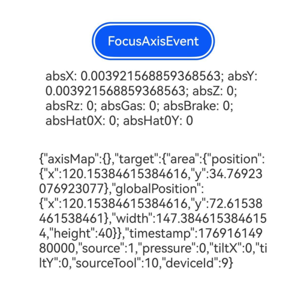

# 焦点轴事件
<!--Kit: ArkUI-->
<!--Subsystem: ArkUI-->
<!--Owner: @jiangtao92-->
<!--Designer: @piggyguy-->
<!--Tester: @songyanhong-->
<!--Adviser: @HelloCrease-->

焦点轴事件是指在与游戏手柄交互时，通过十字按键或者操作杆上报的轴事件，此轴事件通过获得焦点的组件分发并回调给应用。若组件默认可获焦，如Button，则不需要额外设置属性。若组件在默认情况下不可获焦，如Text和Image，可以通过将focusable属性设置为true来启用焦点轴事件。

>  **说明：**
>
>  从API version 15开始支持。后续版本如有新增内容，则采用上角标单独标记该内容的起始版本。

## onFocusAxisEvent

onFocusAxisEvent(event: Callback\<FocusAxisEvent>): T

绑定该方法的组件获焦后，游戏手柄上的摇杆、十字键等的操作会触发该回调。

**原子化服务API：** 从API version 15开始，该接口支持在原子化服务中使用。

**系统能力：** SystemCapability.ArkUI.ArkUI.Full

**参数：** 

| 参数名 | 类型                          | 必填 | 说明               |
| ------ | ----------------------------- | ---- | ------------------ |
| event  | Callback\<[FocusAxisEvent](#focusaxisevent对象说明)> | 是   | 获得FocusAxisEvent对象。 |

**返回值：**

| 类型 | 说明 |
| -------- | -------- |
| T | 返回当前组件。 |

## FocusAxisEvent对象说明

焦点轴事件的对象说明，继承于[BaseEvent](ts-gesture-customize-judge.md#baseevent对象说明8)。

**原子化服务API：** 从API version 15开始，该接口支持在原子化服务中使用。

**系统能力：** SystemCapability.ArkUI.ArkUI.Full

| 名称                                      | 类型                  | 只读    |  可选   |         说明                 |
| ------------------------------------- | ---------------------------------------     | ------------- | ------------- | ------------------------- |
| axisMap                               | Map<[AxisModel](ts-appendix-enums.md#axismodel15), number>      |  否    |  否     | 焦点轴事件的轴值表。          |
| stopPropagation                       | Callback\<void>                      |     否         |  否     |阻塞[事件冒泡](../../../ui/arkts-interaction-basic-principles.md#事件冒泡)传递。            |

## 示例

该示例通过按钮设置了焦点轴事件，当按钮获得焦点时，操控游戏手柄的十字按键或者操作杆将触发onFocusAxisEvent回调。

```ts
// xxx.ets
@Entry
@Component
struct FocusAxisEventExample {
  @State text: string = ''
  @State axisValue: string = ''

  aboutToAppear(): void {
    this.getUIContext().getFocusController().activate(true)
  }

  aboutToDisappear(): void {
    this.getUIContext().getFocusController().activate(false)
  }

  build() {
    Column() {
      Button('FocusAxisEvent')
        .defaultFocus(true)
        .onFocusAxisEvent((event: FocusAxisEvent) => {
          let absX = event.axisMap.get(AxisModel.ABS_X);
          let absY = event.axisMap.get(AxisModel.ABS_Y);
          let absZ = event.axisMap.get(AxisModel.ABS_Z);
          let absRz = event.axisMap.get(AxisModel.ABS_RZ);
          let absGas = event.axisMap.get(AxisModel.ABS_GAS);
          let absBrake = event.axisMap.get(AxisModel.ABS_BRAKE);
          let absHat0X = event.axisMap.get(AxisModel.ABS_HAT0X);
          let absHat0Y = event.axisMap.get(AxisModel.ABS_HAT0Y);
          this.axisValue = 'absX: ' + absX + '; absY: ' + absY + '; absZ: ' + absZ + '; absRz: ' + absRz + '; absGas: ' + absGas + '; absBrake: ' + absBrake + '; absHat0X: ' + absHat0X + '; absHat0Y: ' + absHat0Y;
          this.text = JSON.stringify(event);
        })
      Text(this.axisValue).padding(15)
      Text(this.text).padding(15)
    }.height(300).width('100%').padding(35)
  }
}
```

游戏手柄摇杆移动时：


