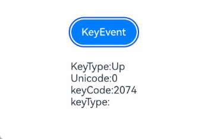

# 按键事件

按键事件是指组件与键盘、遥控器等按键设备交互时触发的事件，适用于所有可获焦组件，例如Button。对于默认不可获焦的组件，如Text，Image等，可以将focusable属性设置为true后使用按键事件。
按键事件触发的流程和具体时机参考[按键事件数据流](../../../ui/arkts-common-events-device-input-event.md#按键事件数据流)。

>  **说明：**
>
>  从API version 7开始支持。后续版本如有新增内容，则采用上角标单独标记该内容的起始版本。

## onKeyEvent

onKeyEvent(event: (event: KeyEvent) => void): T

绑定该方法的组件获焦后，按键动作触发该回调。

**原子化服务API：** 从API version 11开始，该接口支持在原子化服务中使用。

**系统能力：** SystemCapability.ArkUI.ArkUI.Full

**参数：** 

| 参数名 | 类型                          | 必填 | 说明               |
| ------ | ----------------------------- | ---- | ------------------ |
| event  | [KeyEvent](#keyevent对象说明) | 是   | 获得KeyEvent对象。 |

**返回值：**

| 类型 | 说明 |
| -------- | -------- |
| T | 返回当前组件。 |

## onKeyEvent<sup>15+</sup>
onKeyEvent(event: Callback\<KeyEvent, boolean>): T

当绑定该方法的组件获得焦点后，按键操作将触发此回调。若此回调的返回值为`true`，则视为按键事件已被处理。

**原子化服务API：** 从API version 15开始，该接口支持在原子化服务中使用。

**系统能力：** SystemCapability.ArkUI.ArkUI.Full

**参数：** 

| 参数名 | 类型                          | 必填 | 说明               |
| ------ | ----------------------------- | ---- | ------------------ |
| event  | [Callback](./ts-types.md#callback12)<[KeyEvent](#keyevent对象说明), boolean> | 是   | 按键事件的回调。 |

**返回值：**

| 类型 | 说明 |
| -------- | -------- |
| T | 返回当前组件。 |

## onKeyPreIme<sup>12+</sup>

onKeyPreIme(event: Callback<KeyEvent, boolean>): T

绑定该方法的组件获焦后，按键动作优先触发该回调。

该回调的返回值为`true`时，视作该按键事件已被消费，后续的事件回调（`keyboardShortcut`、输入法事件、`onKeyEvent`）会被拦截，不再触发。

**原子化服务API：** 从API version 12开始，该接口支持在原子化服务中使用。

**系统能力：** SystemCapability.ArkUI.ArkUI.Full

**参数：** 

| 参数名 | 类型                          | 必填 | 说明               |
| ------ | ----------------------------- | ---- | ------------------ |
| event  | [Callback](./ts-types.md#callback12)<[KeyEvent](#keyevent对象说明), boolean> | 是   | 处理按键事件的回调。 |

**返回值：**

| 类型 | 说明 |
| -------- | -------- |
| T | 返回当前组件。 |

## onKeyEventDispatch<sup>15+</sup>

onKeyEventDispatch(event: Callback\<KeyEvent, boolean>): T

对应组件收到按键事件时，会触发该回调，该按键事件不会分发给其子组件。不支持构造KeyEvent进行分发，只支持分发已有的按键事件。

该回调的返回值为`true`时，视作该按键事件已被消费，不会冒泡给父组件处理。

**原子化服务API：** 从API version 15开始，该接口支持在原子化服务中使用。

**系统能力：** SystemCapability.ArkUI.ArkUI.Full

**参数：** 

| 参数名 | 类型                          | 必填 | 说明               |
| ------ | ----------------------------- | ---- | ------------------ |
| event  | [Callback](./ts-types.md#callback12)<[KeyEvent](#keyevent对象说明), boolean> | 是   | 处理按键事件分发的回调。 |

**返回值：**

| 类型 | 说明 |
| -------- | -------- |
| T | 返回当前组件。 |


## KeyEvent对象说明

**系统能力：** SystemCapability.ArkUI.ArkUI.Full

| 名称                                    | 类型                                       | 描述                         |
| ------------------------------------- | ---------------------------------------- | -------------------------- |
| type                                  | [KeyType](ts-appendix-enums.md#keytype)  | 按键的类型。<br/>**原子化服务API：** 从API version 11开始，该接口支持在原子化服务中使用。                     |
| [keyCode](../../apis-input-kit/js-apis-keycode.md#keycode) | number                                   | 按键的键码。<br/>**原子化服务API：** 从API version 11开始，该接口支持在原子化服务中使用。                     |
| keyText                               | string                                   | 按键的键值。<br/>**原子化服务API：** 从API version 11开始，该接口支持在原子化服务中使用。                     |
| keySource                             | [KeySource](ts-appendix-enums.md#keysource) | 触发当前按键的输入设备类型。<br/>**原子化服务API：** 从API version 11开始，该接口支持在原子化服务中使用。             |
| deviceId                              | number                                   | 触发当前按键的输入设备ID。<br/>**原子化服务API：** 从API version 11开始，该接口支持在原子化服务中使用。             |
| metaKey                               | number                                   | 按键发生时元键（即键盘左下角紧挨Ctrl键或Fn标记了窗口logo的按键）的状态，1表示按压态，0表示未按压态。<br/>**原子化服务API：** 从API version 11开始，该接口支持在原子化服务中使用。 |
| timestamp                             | number                                   | 事件时间戳。触发事件时距离系统启动的时间间隔，单位：ns。<br/>**原子化服务API：** 从API version 11开始，该接口支持在原子化服务中使用。 |
| stopPropagation                       | () => void                               | 阻塞事件冒泡传递。<br/>**原子化服务API：** 从API version 11开始，该接口支持在原子化服务中使用。                  |
| intentionCode<sup>10+</sup>           | [IntentionCode](../../apis-input-kit/js-apis-intentioncode.md) | 按键对应的意图。<br/>**原子化服务API：** 从API version 11开始，该接口支持在原子化服务中使用。       |
| getModifierKeyState<sup>12+</sup> | (Array&lt;string&gt;) => boolean | 获取功能键按压状态。报错信息请参考以下错误码。支持功能键 'Ctrl'\|'Alt'\|'Shift'。<br/>**原子化服务API：** 从API version 13开始，该接口支持在原子化服务中使用。|
| unicode<sup>14+</sup>                              | number                                   | 按键的unicode码值。支持范围为非空格的基本拉丁字符：0x0021-0x007E，不支持字符为0。组合键场景下，返回当前keyEvent对应按键的unicode码值。 <br/>**原子化服务API：** 从API version 14开始，该接口支持在原子化服务中使用。|
| isNumLockOn<sup>19+</sup>                               | boolean                                   | NumLock是否锁定（true: 锁定；false: 解锁）。<br/>**原子化服务API：** 从API version 19开始，该接口支持在原子化服务中使用。                     |
| isCapsLockOn<sup>19+</sup>                               | boolean                                   | CapsLock是否锁定（true: 锁定；false: 解锁）。<br/>**原子化服务API：** 从API version 19开始，该接口支持在原子化服务中使用。                     |
| isScrollLockOn<sup>19+</sup>                               | boolean                                   | ScrollLock是否锁定（true: 锁定；false: 解锁）。<br/>**原子化服务API：** 从API version 19开始，该接口支持在原子化服务中使用。                     |

**错误码**：

以下错误码详细介绍请参考[通用错误码](../../errorcode-universal.md)。

| 错误码ID | 错误信息 |
| ------- | -------- |
| 401 | Parameter error. Possible causes: 1. Incorrect parameter types. 2. Parameter verification failed. |

## 示例

### 示例1（触发onKeyEvent回调）

该示例通过按钮设置了按键事件。按钮获焦时，按下按键可触发onKeyEvent回调。按键事件触发的流程和具体时机参考[按键事件数据流](../../../ui/arkts-common-events-device-input-event.md#按键事件数据流)。

```ts
// xxx.ets
@Entry
@Component
struct KeyEventExample {
  @State text: string = ''
  @State eventType: string = ''

  build() {
    Column() {
      Button('KeyEvent')
        .defaultFocus(true)
        .onKeyEvent((event?: KeyEvent) => {
          if(event){
            if (event.type === KeyType.Down) {
              this.eventType = 'Down'
            }
            if (event.type === KeyType.Up) {
              this.eventType = 'Up'
            }
            this.text = 'KeyType:' + this.eventType + '\nkeyCode:' + event.keyCode + '\nkeyText:' + event.keyText + '\nintentionCode:' + event.intentionCode
          }
        })
      Text(this.text).padding(15)
    }.height(300).width('100%').padding(35)
  }
}
```

  

### 示例2（获取uniCode码值）

该示例通过按键事件获取所按按键的unicode码值。

```ts
// xxx.ets
@Entry
@Component
struct KeyEventExample {
  @State text: string = ''
  @State eventType: string = ''
  @State keyType: string = ''

  build() {
    Column({ space: 10 }) {
      Button('KeyEvent')
        .onKeyEvent((event?: KeyEvent) => {
          if(event){
            if (event.type === KeyType.Down) {
              this.eventType = 'Down'
            }
            if (event.type === KeyType.Up) {
              this.eventType = 'Up'
            }
            if (event.unicode == 97) {
              this.keyType = 'a'
            } else if (event.unicode == 65) {
              this.keyType = 'A'
            } else {
              this.keyType = ' '
            }
            this.text = 'KeyType:' + this.eventType + '\nUnicode:' + event.unicode + '\nkeyCode:' + event.keyCode + '\nkeyType:' + this.keyType
          }
        })
      Text(this.text).padding(15)
    }.height(300).width('100%').padding(35)
  }
}
```

 

### 示例3（触发onKeyPreIme回调）

该示例使用onKeyPreIme屏蔽输入框中的方向左键。

```ts
import { KeyCode } from '@kit.InputKit';

@Entry
@Component
struct PreImeEventExample {
  @State buttonText: string = '';
  @State buttonType: string = '';
  @State columnText: string = '';
  @State columnType: string = '';

  build() {
    Column() {
      Search({
        placeholder: "Search..."
      })
        .width("80%")
        .height("40vp")
        .border({ radius:"20vp" })
        .onKeyPreIme((event:KeyEvent) => {
          // 使用方向左键不生效
          if (event.keyCode == KeyCode.KEYCODE_DPAD_LEFT) {
            return true;
          }
          return false;
        })
    }
  }
}
```

### 示例4（使用stopPropagation阻止冒泡）

该示例使用stopPropagation阻止事件冒泡。即，通过在Button的onKeyEvent回调中加入event.stopPropagation()方法，达到“仅Button响应键盘事件，Column不响应”的效果。

>**说明：**
>
> 1. onKeyEvent事件默认是冒泡的。  
> 2. 事件冒泡：在一个树形结构中，当子节点处理完一个事件后，再将该事件交给它的父节点处理。  
> 3. 可以在[onKeyEvent<sup>15+</sup>](#onkeyevent15)中，通过返回true消费按键事件阻止冒泡，效果等同于stopPropagation。

```ts
@Entry
@Component
struct KeyEventExample {
  @State buttonText: string = '';
  @State buttonType: string = '';
  @State columnText: string = '';
  @State columnType: string = '';

  build() {
    Column() {
      Button('onKeyEvent')
        .defaultFocus(true)
        .width(140).height(70)
        .onKeyEvent((event?: KeyEvent) => {
          // 通过stopPropagation阻止事件冒泡
          if(event){
            if(event.stopPropagation){
              event.stopPropagation();
            }
            if (event.type === KeyType.Down) {
              this.buttonType = 'Down';
            }
            if (event.type === KeyType.Up) {
              this.buttonType = 'Up';
            }
            this.buttonText = 'Button: \n' +
              'KeyType:' + this.buttonType + '\n' +
              'KeyCode:' + event.keyCode + '\n' +
              'KeyText:' + event.keyText;
          }
        })

      Divider()
      Text(this.buttonText).fontColor(Color.Green)

      Divider()
      Text(this.columnText).fontColor(Color.Red)
    }.width('100%').height('100%').justifyContent(FlexAlign.Center)
    .onKeyEvent((event?: KeyEvent) => { // 给父组件Column设置onKeyEvent事件
      if(event){
        if (event.type === KeyType.Down) {
          this.columnType = 'Down';
        }
        if (event.type === KeyType.Up) {
          this.columnType = 'Up';
        }
        this.columnText = 'Column: \n' +
          'KeyType:' + this.buttonType + '\n' +
          'KeyCode:' + event.keyCode + '\n' +
          'KeyText:' + event.keyText;
      }
    })
  }
}
```