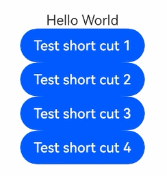
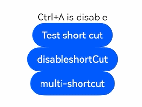

# 组件快捷键事件
<!--Kit: ArkUI-->
<!--Subsystem: ArkUI-->
<!--Owner: @jiangtao92-->
<!--Designer: @piggyguy-->
<!--Tester: @songyanhong-->
<!--Adviser: @HelloCrease-->

开发者可以设置组件的自定义组合键，每个组件可以设置多个组合键。

即使组件未获焦或是在所在页面未展示，只要已经挂载到获焦窗口的组件树上就会响应自定义组合键。

开发者在设置组合键的同时可以设置自定义事件，组合键按下时，触发该自定义事件，若没有设置自定义事件，则组合键行为与click行为一致。

>  **说明：**
>
>  从API version 10开始支持。后续版本如有新增内容，则采用上角标单独标记该内容的起始版本。

## keyboardShortcut

keyboardShortcut(value: string | FunctionKey, keys: Array\<ModifierKey>, action?: () => void): T

设置组件的自定义组合键。

**原子化服务API：** 从API version 11开始，该接口支持在原子化服务中使用。

**系统能力：** SystemCapability.ArkUI.ArkUI.Full

**参数：**

| 参数名   | 类型                                  | 必填   | 说明                                     |
| ----- | ------------------------------------- | ---- | ---------------------------------------- |
| value | string \| [FunctionKey](ts-appendix-enums.md#functionkey10) | 是 | 热键的单个字符（可以通过键盘输入的字符）或[FunctionKey](ts-appendix-enums.md#functionkey10)。<br />空字符串意为取消快捷键绑定。<br/> |
| keys  | Array\<[ModifierKey](ts-appendix-enums.md#modifierkey10)> | 是 | 热键组合。<br />仅当value为[FunctionKey](ts-appendix-enums.md#functionkey10)的情况下可以为空。<br/> |
| action  | () => void    | 否    | 组合快捷键触发成功后的自定义事件回调。<br/>                               |

**返回值：**

| 类型 | 说明 |
| -------- | -------- |
| T | 返回当前组件。 |

## 快捷键使用注意事项

快捷键是对系统按键的响应，优先于普通的按键事件`OnKeyEvent`，按键事件触发的逻辑详见[按键事件数据流](../../../ui/arkts-interaction-development-guide-keyboard.md#按键事件数据流)。

| 场景                                       | 快捷键处理逻辑                            | 例子                                       |
| ---------------------------------------- | ---------------------------------- | ---------------------------------------- |
| 所有支持onClick事件的组件                         | 支持自定义组合键                           | 无                                        |
| 自定义组合键要求                                 | 控制键Ctrl、Shift、Alt及它们的组合加上其它可输入字符按键 | Button('button1').keyboardShortcut('a',[ModifierKey.CTRL]) |
| 多个不同组件设置相同组合键                            | 只响应结点树上的第一个组件，其它组件不响应快捷键。          | Button('button1').keyboardShortcut('a',[ModifierKey.CTRL])<br />Button('button2').keyboardShortcut('a',[ModifierKey.CTRL]) |
| 无论组件是否获得焦点                               | 只要窗口获焦快捷键就会响应                      | 无                                        |
| 使用单个`FunctionKey`触发快捷键 | 单个`FunctionKey`，没有`ModifierKey`，可以绑定为快捷键 | Button('button1').keyboardShortcut(FunctionKey.F2,[])                                        |
| `keyboardShortcut`的入参`value`为空 | 取消绑定的快捷键。<br />绑定多个快捷键的时候无法取消快捷键。| Button('button1').keyboardShortcut('',[ModifierKey.CTRL])<br />Button('button2').keyboardShortcut('',[]) |
| 独立pipeline子窗口、主窗口共存的情况下                  | 获焦的窗口响应快捷键                         | 无                                        |
| keyboardShortcut接口中的keys命令中ctrl、shift、alt | 不区分左右键都响应                          | Button('button1').keyboardShortcut('a',[ModifierKey.CTRL, ModifierKey.ALT]) |
| keyboardShortcut接口中的value单个字符            | 不区分大小写都响应                          | Button('button1').keyboardShortcut('a',[ModifierKey.CTRL])<br />Button('button2').keyboardShortcut('A',[ModifierKey.CTRL]) |
| 快捷键的响应                                   | `keys`键处于按下状态且`value`键触发down事件（长按会连续响应）              | 无                                        |
| 隐藏组件<br />                               | 响应快捷键                              | 无                                        |
| disable状态组件                              | 不响应快捷键                             | 无                                        |
| 1. 组件的组合键(包括系统预定义快捷键)相同时。<br />2. 接口参数value有多个字符时。<br />3. 接口参数keys有重复的控制键时。 | 这几种情况不绑定组合键，先前绑定的组合键仍然有效。          | Button('button1').keyboardShortcut(FunctionKey.F4,[ModifierKey.ALT])<br />Button('button2').keyboardShortcut('ab',[ModifierKey.CTRL])<br />Button('button3').keyboardShortcut('ab',[ModifierKey.CTRL,ModifierKey.CTRL]) |

### 禁止绑定的系统快捷键

以下组合键绑定为快捷键不生效。

- `Alt` + `F4`
- `Alt` + `Shift` + `F4`
- `Alt` + `TAB`
- `Alt` + `Shift` + `TAB`
- `Ctrl` + `Shift` + `ESC`

### 系统已存在的按键事件

已存在如下系统响应的按键事件，具体规格如下表。

表中的按键事件与自定义按键事件的触发有优先级关系，高优先级的事件会拦截低优先级事件，焦点事件响应优先级详见[按键事件数据流](../../../ui/arkts-interaction-development-guide-keyboard.md#按键事件数据流)。

| 快捷键 | 获焦组件 | 用途 | 事件处理类别 |
| ----- | ---- | ---- | ---- |
| 方向键、Shift + 方向键 | 输入框组件 | 移动光标 | 输入法 |
| 方向键、Shift + 方向键 | 通用组件 | 系统处于走焦状态时，用于方向走焦 | 系统按键 |
| TAB、Shift + TAB | 通用组件 | 触发进入走焦状态/走焦 | 系统按键 |

## 示例

### 示例1（设置组件快捷键）

该示例通过设置组件的快捷键，同时按控制键+对应的字符可以触发组件响应快捷键，并触发onClick事件或自定义事件。

```ts
@Entry
@Component
struct Index {
  @State message: string = 'Hello World'

  build() {
    Row() {
      Column({ space: 5 }) {
        Text(this.message)
        Button("Test short cut 1").onClick((event: ClickEvent) => {
          this.message = "I clicked Button 1";
          console.info("I clicked 1");
        }).keyboardShortcut('.', [ModifierKey.SHIFT, ModifierKey.CTRL, ModifierKey.ALT])
          .onKeyEvent((event: KeyEvent)=>{
            console.info("event.keyCode: " + JSON.stringify(event));
          })
        Button("Test short cut 2").onClick((event: ClickEvent) => {
          this.message = "I clicked Button 2";
          console.info("I clicked 2");
        }).keyboardShortcut('1', [ModifierKey.CTRL])
        Button("Test short cut 3").onClick((event: ClickEvent) => {
          this.message = "I clicked Button 3";
          console.info("I clicked 3");
        }).keyboardShortcut('A', [ModifierKey.SHIFT])
        Button("Test short cut 4").onClick((event: ClickEvent) => {
          this.message = "I clicked Button 4";
          console.info("I clicked 4");
        }).keyboardShortcut(FunctionKey.F5, [], () => {
          this.message = "I clicked Button 4";
          console.info("I clicked user callback.");
        }).keyboardShortcut(FunctionKey.F3, [])
      }
      .width('100%')
    }
    .height('100%')
  }
}
```

 

### 示例2（注册和解注册快捷键绑定）

该示例演示了如何实现按键注册和解注册快捷键绑定。

```ts
@Entry
@Component
struct Index {
  @State message: string = 'disable'
  @State shortCutEnable: boolean = false
  @State keyValue: string = ''

  build() {
    Row() {
      Column({ space: 5 }) {
        Text('Ctrl+A is ' + this.message)
        Button("Test short cut").onClick((event: ClickEvent) => {
          this.message = "I clicked Button";
          console.info("I clicked");
        }).keyboardShortcut(this.keyValue, [ModifierKey.CTRL])
        Button(this.message + 'shortCut').onClick((event: ClickEvent) => {
          this.shortCutEnable = !this.shortCutEnable;
          this.message = this.shortCutEnable ? 'enable' : 'disable';
          this.keyValue = this.shortCutEnable ? 'a' : '';
        })
        Button('multi-shortcut').onClick((event: ClickEvent) => {
          console.info('Trigger keyboard shortcut success.')
        }).keyboardShortcut('q', [ModifierKey.CTRL])
          .keyboardShortcut('w', [ModifierKey.CTRL])
          .keyboardShortcut('', []) // 不生效，绑定了多个快捷键的组件不能取消快捷键
      }
      .width('100%')
    }
    .height('100%')
  }
}
```

 