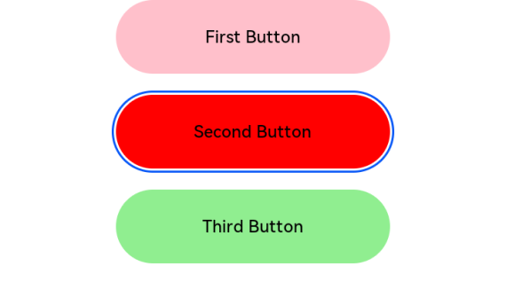

# 焦点事件
<!--Kit: ArkUI-->
<!--Subsystem: ArkUI-->
<!--Owner: @jiangtao92-->
<!--SE: @piggyguy-->
<!--TSE: @songyanhong-->

焦点事件指页面焦点在可获焦组件间移动时触发的事件，组件可使用焦点事件来处理相关逻辑。

>  **说明：**
>
>  - 从API version 8开始支持。后续版本如有新增内容，则采用上角标单独标记该内容的起始版本。
>
>  - 目前仅支持通过外接键盘的tab键、方向键触发。不支持嵌套滚动组件场景按键走焦。
>
>  - 存在默认交互逻辑的组件例如[Button](ts-basic-components-button.md)、[TextInput](ts-basic-components-textinput.md)等，默认即为可获焦，[Text](ts-basic-components-text.md)、[Image](ts-basic-components-image.md)等组件默认状态为不可获焦，不可获焦状态下，无法触发焦点事件，需要设置focusable属性为true才可触发。
>  
>  - 对于有获焦能力的容器组件，例如[Stack](ts-container-stack.md)、[Row](ts-container-row.md)等，若不存在可获焦子组件，该容器组件不可获焦。为其配置onClick或是单指单击的Tap手势，该组件会隐式地成为可获焦组件。
> 
>  - 焦点开发及组件获焦能力参考[焦点开发指南](../../../ui/arkts-common-events-focus-event.md)。

## onFocus

onFocus(event: () => void): T

当前组件获取焦点时触发的回调。

**原子化服务API：** 从API version 11开始，该接口支持在原子化服务中使用。

**系统能力：** SystemCapability.ArkUI.ArkUI.Full

**参数：** 

| 参数名 | 类型                          | 必填 | 说明               |
| ------ | ----------------------------- | ---- | ------------------ |
| event  | () => void |  是   | onFocus的回调函数，表示组件已获焦。 |

**返回值：**

| 类型 | 说明 |
| -------- | -------- |
| T | 返回当前组件。 |

## onBlur

onBlur(event:()&nbsp;=&gt;&nbsp;void): T

当前组件失去焦点时触发的回调。

**原子化服务API：** 从API version 11开始，该接口支持在原子化服务中使用。

**系统能力：** SystemCapability.ArkUI.ArkUI.Full

**参数：** 

| 参数名 | 类型                          | 必填 | 说明               |
| ------ | ----------------------------- | ---- | ------------------ |
| event  | () => void |  是   | onBlur的回调函数，表示组件已失焦。 |

**返回值：**

| 类型 | 说明 |
| -------- | -------- |
| T | 返回当前组件。 |

## 示例

该示例展示了组件获焦和失焦的情况，按钮获焦和失焦时会改变按钮的颜色。

```ts
// xxx.ets
@Entry
@Component
struct FocusEventExample {
  @State oneButtonColor: string = '#FFC0CB'
  @State twoButtonColor: string = '#87CEFA'
  @State threeButtonColor: string = '#90EE90'

  build() {
    Column({ space: 20 }) {
      // 通过外接键盘的上下键可以让焦点在三个按钮间移动，按钮获焦时颜色变化，失焦时变回原背景色
      Button('First Button')
        .backgroundColor(this.oneButtonColor)
        .width(260)
        .height(70)
        .fontColor(Color.Black)
        .focusable(true)
        .onFocus(() => {
          this.oneButtonColor = '#FF0000'
        })
        .onBlur(() => {
          this.oneButtonColor = '#FFC0CB'
        })
      Button('Second Button')
        .backgroundColor(this.twoButtonColor)
        .width(260)
        .height(70)
        .fontColor(Color.Black)
        .focusable(true)
        .onFocus(() => {
          this.twoButtonColor = '#FF0000'
        })
        .onBlur(() => {
          this.twoButtonColor = '#87CEFA'
        })
      Button('Third Button')
        .backgroundColor(this.threeButtonColor)
        .width(260)
        .height(70)
        .fontColor(Color.Black)
        .focusable(true)
        .onFocus(() => {
          this.threeButtonColor = '#FF0000'
        })
        .onBlur(() => {
          this.threeButtonColor = '#90EE90'
        })
    }.width('100%').margin({ top: 20 })
  }
}
```

  