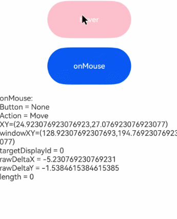

# 鼠标事件
<!--Kit: ArkUI-->
<!--Subsystem: ArkUI-->
<!--Owner: @yihao-lin-->
<!--Designer: @piggyguy-->
<!--Tester: @songyanhong-->
<!--Adviser: @Brilliantry_Rui-->

鼠标事件用于监听组件上的鼠标点击、移动等交互，可获取鼠标按键、动作、坐标、历史点等事件信息，适用于需要处理鼠标交互、绘制轨迹、手势识别或优化输入响应体验的场景。在鼠标的单个动作触发多个事件时，事件的顺序是固定的，鼠标事件默认冒泡。

> **说明：**
>
> - 本模块首批接口从API version 8开始支持。后续版本的新增接口，采用上角标单独标记接口的起始版本。
>
> - 目前支持通过外接鼠标或通过触控板触发鼠标事件。

## onMouse

onMouse(event: (event: MouseEvent) => void): T

当前组件被鼠标按键点击时或者鼠标在组件上悬浮移动时，或通过触控板触发相同的鼠标操作时，触发该回调。

**原子化服务API：** 从API version 11开始，该接口支持在原子化服务中使用。

**系统能力：** SystemCapability.ArkUI.ArkUI.Full

**参数：**

| 参数名  | 类型                              | 必填 | 说明                                                         |
| ------- | --------------------------------- | ---- | ------------------------------------------------------------ |
| event | (event: [MouseEvent](#mouseevent对象说明)) => void | 是   | 返回触发事件时的时间戳、鼠标按键、动作、鼠标位置在整个屏幕上的坐标和相对于当前组件的坐标。 |

**返回值：**

| 类型 | 说明 |
| -------- | -------- |
| T | 返回当前组件。 |

## MouseEvent对象说明

继承于[BaseEvent](ts-universal-events-click.md#baseevent8)。

### 属性

**系统能力：** SystemCapability.ArkUI.ArkUI.Full

| 名称                    | 类型                    | 只读    |  可选   |     说明                          |
| ---------------------- | -------------------------------------- |-------------- |------------- |  --------------------------- |
| x                      | number                                  | 否           |  否     |鼠标位置在事件响应组件为基准的[组件坐标系](../../../ui/arkui-glossary.md#组件坐标系)中的X坐标。<br>单位：vp<br>**原子化服务API：** 从API version 11开始，该接口支持在原子化服务中使用。         |
| y                      | number                                    |  否         |  否     |鼠标位置在事件响应组件为基准的[组件坐标系](../../../ui/arkui-glossary.md#组件坐标系)中的Y坐标。<br>单位：vp<br>**原子化服务API：** 从API version 11开始，该接口支持在原子化服务中使用。         |
| button                 | [MouseButton](ts-appendix-enums.md#mousebutton8)      |  否     |  否     |鼠标按键。<br>**原子化服务API：** 从API version 11开始，该接口支持在原子化服务中使用。                        |
| action                 | [MouseAction](ts-appendix-enums.md#mouseaction8)       |  否   |  否     |鼠标动作。<br>**原子化服务API：** 从API version 11开始，该接口支持在原子化服务中使用。                        |
| stopPropagation        | () => void                            |  否          |  否     |阻塞[事件冒泡](../../../ui/arkts-interaction-basic-principles.md#事件冒泡)，适用于当前组件已处理鼠标事件且需要阻止事件继续向父组件传递的场景。<br>**原子化服务API：** 从API version 11开始，该接口支持在原子化服务中使用。                      |
| windowX<sup>10+</sup> | number                           |  否          |  否     |鼠标位置在当前应用窗口坐标系中的X坐标。<br>单位：vp<br>**原子化服务API：** 从API version 11开始，该接口支持在原子化服务中使用。<br>**模型约束：** 此接口仅可在Stage模型下使用。 |
| windowY<sup>10+</sup> | number                           |  否         |  否     |鼠标位置在当前应用窗口坐标系中的Y坐标。<br>单位：vp<br>**原子化服务API：** 从API version 11开始，该接口支持在原子化服务中使用。<br>**模型约束：** 此接口仅可在Stage模型下使用。 |
| displayX<sup>10+</sup> | number                          |  否         |  否     |鼠标位置在当前应用屏幕坐标系中的X坐标。<br>单位：vp<br>**原子化服务API：** 从API version 11开始，该接口支持在原子化服务中使用。<br>**模型约束：** 此接口仅可在Stage模型下使用。 |
| displayY<sup>10+</sup> | number                         |  否          |  否     |鼠标位置在当前应用屏幕坐标系中的Y坐标。<br>单位：vp<br>**原子化服务API：** 从API version 11开始，该接口支持在原子化服务中使用。<br>**模型约束：** 此接口仅可在Stage模型下使用。 |
| screenX<sup>(deprecated)</sup> | number                 |  否         |  否     |鼠标位置在当前应用窗口坐标系中的X坐标。<br>单位：vp<br>**说明：** 从API version 8开始支持，从API version 10开始废弃，建议使用windowX替代。 |
| screenY<sup>(deprecated)</sup> | number                 |  否          |  否     |鼠标位置在当前应用窗口坐标系中的Y坐标。<br>单位：vp<br>**说明：** 从API version 8开始支持，从API version 10开始废弃，建议使用windowY替代。 |
| rawDeltaX<sup>15+</sup> | number      |  否   |  是     |鼠标设备在二维平面X轴的移动增量。其数值为鼠标硬件的原始移动数据，使用物理世界中鼠标移动的距离单位进行表示。上报数值由硬件本身决定，并非屏幕的物理/逻辑像素。<br>**原子化服务API：** 从API version 15开始，该接口支持在原子化服务中使用。 <br>**说明：** API版本26.0.0之前，rawDeltaX的返回值并非鼠标硬件的原始移动数据，而是原始数据缩小了X倍，X为系统的显示大小比例。API版本26.0.0开始，rawDeltaX的返回值为鼠标硬件的原始移动数据。<br>**模型约束：** 此接口仅可在Stage模型下使用。 |
| rawDeltaY<sup>15+</sup> | number      |  否     |  是    |鼠标设备在二维平面Y轴的移动增量。其数值为鼠标硬件的原始移动数据，使用物理世界中鼠标移动的距离单位进行表示。上报数值由硬件本身决定，并非屏幕的物理/逻辑像素。<br>**原子化服务API：** 从API version 15开始，该接口支持在原子化服务中使用。 <br>**说明：** API版本26.0.0之前，rawDeltaY的返回值并非鼠标硬件的原始移动数据，而是原始数据缩小了X倍，X为系统的显示大小比例。API版本26.0.0开始，rawDeltaY的返回值为鼠标硬件的原始移动数据。<br>**模型约束：** 此接口仅可在Stage模型下使用。 |
| pressedButtons<sup>15+</sup> | MouseButton[]      |  否      | 是     |当前按下的鼠标按键集合。<br>**原子化服务API：** 从API version 15开始，该接口支持在原子化服务中使用。<br>**模型约束：** 此接口仅可在Stage模型下使用。 |
| globalDisplayX<sup>20+</sup> | number       |  否    |  是    |鼠标位置在[全局坐标系](../../../windowmanager/window-terminology.md#global-coordinate-system全局坐标系)中的X坐标。<br>单位：vp<br>取值范围：(-∞, +∞)<br>**原子化服务API：** 从API version 20开始，该接口支持在原子化服务中使用。<br>**模型约束：** 此接口仅可在Stage模型下使用。 |
| globalDisplayY<sup>20+</sup> | number      | 否      |  是    |鼠标位置在[全局坐标系](../../../windowmanager/window-terminology.md#global-coordinate-system全局坐标系)中的Y坐标。<br>单位：vp<br>取值范围：(-∞, +∞)<br>**原子化服务API：** 从API version 20开始，该接口支持在原子化服务中使用。<br>**模型约束：** 此接口仅可在Stage模型下使用。 |
| eventHandleId<sup>24+</sup> | number | 否 | 是 | 用于事件处理的唯一标识。<br> 取值范围：[0, +∞)<br> **说明：** 在使用[postInputEventWithStrategy](../js-apis-arkui-builderNode.md#postinputeventwithstrategy24)接口分发事件时会使用该字段，事件每分发一次字段会增加100000。<br> 多次使用相同的eventHandleId进行事件分发将导致事件响应异常。仅在构造事件的时候需要对此字段赋值，其余情况开发者无需处理。<br>**原子化服务API：** 从API version 24开始，该接口支持在原子化服务中使用。 <br>**模型约束：** 此接口仅可在Stage模型下使用。 |

### getCurrentLocalPosition

getCurrentLocalPosition?(): Coordinate2D

获取鼠标位置相对于当前组件实时位置的左上角坐标，适用于组件位置动态变化时实时获取鼠标相对组件坐标的场景。

**起始版本：** 26.0.0

**模型约束：** 此接口仅可在Stage模型下使用。

**原子化服务API：** 从API版本26.0.0开始，该接口支持在原子化服务中使用。

**系统能力：** SystemCapability.ArkUI.ArkUI.Full

**返回值：**

| 类型    | 说明                                                  |
| ------- | ----------------------------------------------------- |
| [Coordinate2D](ts-types.md#coordinate2d) | 鼠标位置相对于当前组件实时位置的左上角坐标。 |

### getHistoricalPoints

getHistoricalPoints?(): Array&lt;MouseHistoricalPoint&gt;

获取当前帧的所有历史点信息。历史点可用于实现更平滑的绘制效果。目前仅支持通过外接鼠标触发。

该接口仅能在[MouseEvent](#mouseevent对象说明)中调用，用于获取触发[onMouse](#onmouse)时当前帧历史点的相关信息，不同设备每帧的鼠标事件上报频率不同，一帧通常只会上报一个鼠标事件，如果当前帧收到的[MouseEvent](#mouseevent对象说明)数目大于1，会将该帧最后一个点通过[onMouse](#onmouse)返回，其余点作为历史点。

**起始版本：** 26.0.0

**模型约束：** 此接口仅可在Stage模型下使用。

**原子化服务API：** 从API版本26.0.0开始，该接口支持在原子化服务中使用。

**系统能力：** SystemCapability.ArkUI.ArkUI.Full

**返回值：**

| 类型                                                 | 说明              |
| -------------------------------------------------- | --------------- |
| Array&lt;[MouseHistoricalPoint](#mousehistoricalpoint)&gt; | 当前帧的所有历史点信息组成的数组。 |

## MouseHistoricalPoint

鼠标事件历史点信息。

历史点按时间顺序排列，获取到的第一个历史点是最早发生的事件的信息，最后一个是最新发生事件的信息。历史点的数量取决于系统事件队列的配置和硬件性能。历史点主要用于如下场景：

1. 平滑绘制：使用历史点可以实现更平滑的绘制效果，特别是在鼠标快速移动时。

2. 手势识别：通过分析历史点的轨迹，可以识别各种鼠标手势。

3. 性能优化：在一个事件回调中处理多个历史点，减少事件处理频率，提升性能。

4. 轨迹分析：分析鼠标移动轨迹，用于绘图应用或手势控制。

5. 数据分析：历史点中的timestamp可用于计算鼠标移动速度。

**起始版本：** 26.0.0

**模型约束：** 此接口仅可在Stage模型下使用。

**原子化服务API：** 从API版本26.0.0开始，该接口支持在原子化服务中使用。

**系统能力：** SystemCapability.ArkUI.ArkUI.Full

| 名称         | 类型        | 只读 | 可选 | 说明                                      |
| ---------- | --------- | ---- | ---- | --------------------------------------- |
| x          | number    | 否   | 否   | 鼠标指针相对于事件响应组件左上角的X坐标。<br>单位：vp          |
| y          | number    | 否   | 否   | 鼠标指针相对于事件响应组件左上角的Y坐标。<br>单位：vp          |
| displayX   | number    | 否   | 否   | 鼠标指针相对于当前应用屏幕左上角的X坐标。<br>单位：vp            |
| displayY   | number    | 否   | 否   | 鼠标指针相对于当前应用屏幕左上角的Y坐标。<br>单位：vp            |
| windowX    | number    | 否   | 否   | 鼠标指针相对于应用窗口左上角的X坐标。<br>单位：vp            |
| windowY    | number    | 否   | 否   | 鼠标指针相对于应用窗口左上角的Y坐标。<br>单位：vp            |
| globalDisplayX | number| 否   | 否   |鼠标位置在[全局坐标系](../../../windowmanager/window-terminology.md#global-coordinate-system全局坐标系)中的X坐标。<br>单位：vp  |
| globalDisplayY | number| 否   | 否   |鼠标位置在[全局坐标系](../../../windowmanager/window-terminology.md#global-coordinate-system全局坐标系)中的Y坐标。<br>单位：vp  |
| timestamp  | number    | 否   | 否   | 鼠标事件的时间戳。<br>单位：ns                              |

## 示例

### 示例1（获取鼠标事件相关参数）

该示例通过按钮设置了鼠标事件，通过鼠标点击按钮可以触发[onMouse](#onmouse)事件，获取鼠标事件相关参数。从API version 15开始，可以获取鼠标事件[MouseEvent](#mouseevent对象说明)的targetDisplayId、rawDeltaX、rawDeltaY、pressedButtons等参数。

鼠标滚轮的处理请参考[轴事件示例](ts-universal-events-axis.md#示例)。

```ts
// xxx.ets
@Entry
@Component
struct MouseEventExample {
  @State hoverText: string = 'no hover';
  @State mouseText: string = '';
  @State action: string = '';
  @State mouseBtn: string = '';
  @State color: Color = Color.Blue;

  build() {
    Column({ space: 20 }) {
      Button(this.hoverText)
        .width(180)
        .height(80)
        .backgroundColor(this.color)
        .fontSize(24)
        .onHover((isHover: boolean) => {
          // 通过onHover事件动态修改按钮在是否有鼠标悬浮时的文本内容与背景颜色
          if (isHover) {
            this.hoverText = 'hover';
            this.color = Color.Pink;
          } else {
            this.hoverText = 'no hover';
            this.color = Color.Blue;
          }
        })
      Button('onMouse')
        .width(180).height(80)
        .fontSize(24)
        // onMouse监听鼠标事件，解析按键、动作、坐标等信息并拼接展示
        .onMouse((event: MouseEvent): void => {
          if (event) {
            // 判断触发的鼠标按键类型
            switch (event.button) {
              case MouseButton.None:
                this.mouseBtn = 'None';
                break;
              case MouseButton.Left:
                this.mouseBtn = 'Left';
                break;
              case MouseButton.Right:
                this.mouseBtn = 'Right';
                break;
              case MouseButton.Back:
                this.mouseBtn = 'Back';
                break;
              case MouseButton.Forward:
                this.mouseBtn = 'Forward';
                break;
              case MouseButton.Middle:
                this.mouseBtn = 'Middle';
                break;
            }
            // 判断触发的鼠标动作类型
            switch (event.action) {
              case MouseAction.Press:
                this.action = 'Press';
                break;
              case MouseAction.Move:
                this.action = 'Move';
                break;
              case MouseAction.Release:
                this.action = 'Release';
                break;
              case MouseAction.ENTER_WINDOW:
                this.action = 'ENTER_WINDOW';
                break;
              case MouseAction.LEAVE_WINDOW:
                this.action = 'LEAVE_WINDOW';
                break;
            }
            // 拼接鼠标事件全量信息并展示
            this.mouseText = 'onMouse:\nButton = ' + this.mouseBtn +
              '\nAction = ' + this.action + '\nXY=(' + event.x + ',' + event.y + ')' +
              '\nwindowXY=(' + event.windowX + ',' + event.windowY + ')' +
              '\ntargetDisplayId = ' + event.targetDisplayId +
              '\nrawDeltaX = ' + event.rawDeltaX +
              '\nrawDeltaY = ' + event.rawDeltaY +
              '\nlength = ' + event.pressedButtons?.length;
          }
        })
      Text(this.mouseText)
    }.padding({ top: 30 }).width('100%')
  }
}
```

示意图：

鼠标点击时：



### 示例2（获取当前帧历史点）

该示例通过调用[getHistoricalPoints](#gethistoricalpoints)接口，获取到触发重采样时的历史点，可以用来实现更平滑的绘制等操作。

从API版本26.0.0开始，新增getHistoricalPoints接口。
```ts
@Entry
@Component
struct HistoricalPointsExample {
  historicalPointsInfo: string = '';

  build() {
    Column() {
      Button('鼠标移动获取历史点')
        .width(180)
        .height(80)
        .onMouse((event: MouseEvent) => {
          if (event.action === MouseAction.Move) {
            // 调用getHistoricalPoints接口获取当前帧历史点信息
            const historicalPoints = event.getHistoricalPoints?.();
            if (historicalPoints) {
              this.historicalPointsInfo = `历史点数量：${historicalPoints.length}`;
              historicalPoints.forEach((point: MouseHistoricalPoint, index: number) => {
                this.historicalPointsInfo += `\n点${index}: `
                  + `x = ${point.x}, y = ${point.y}, windowX = ${point.windowX}, windowY = ${point.windowY}, `
                  + `displayX = ${point.displayX}, displayY = ${point.displayY}, `
                  + `globalDisplayX = ${point.globalDisplayX}, globalDisplayY = ${point.globalDisplayY}, `
                  + `timestamp = ${point.timestamp}`;
              });
              console.info(this.historicalPointsInfo);
            }
          }
        })
    }.padding({ top: 30 })
    .width('100%')
    .height('100%')
  }
}
```

### 示例3（获取组件实时位置）

该示例通过[getCurrentLocalPosition](#getcurrentlocalposition)方法获取鼠标位置相对于当前组件实时位置左上角的坐标。

从API版本26.0.0开始，新增支持getCurrentLocalPosition接口。

```ts
// xxx.ets
@Entry
@Component
struct GetCurrentLocalPositionExample {
  @State positionText: string = '';
  @State textOffsetY: number = 0;

  build() {
    Column() {
      Button('获取鼠标位置相对于当前组件实时位置左上角的坐标').translate({ y: this.textOffsetY })
        .onMouse((event: MouseEvent) => {
          if (event) {
            // 移动组件后延迟获取鼠标相对于组件实时位置左上角的坐标
            this.textOffsetY = -200;
            setTimeout(() => {
              let localPos: Coordinate2D | undefined = event.getCurrentLocalPosition?.();
              this.positionText = `相对于当前组件实时位置左上角的坐标：\n  x: ${localPos?.x}\n  y: ${localPos?.y}`;
            }, 2000);
          }
        })

      Text(this.positionText)
    }.width('100%')
  }
}
```

示意图：

鼠标触发事件时：


