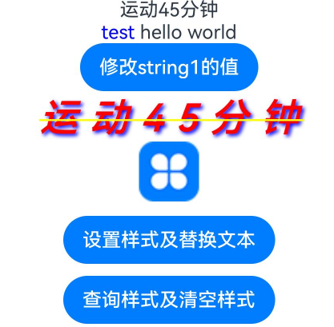
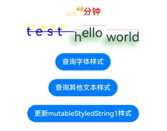
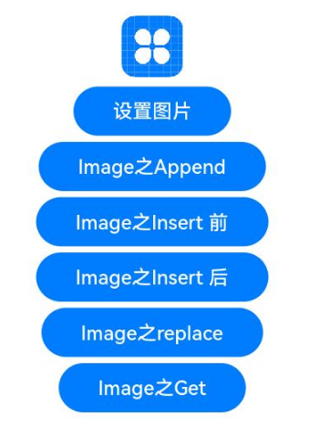
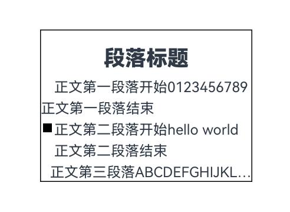
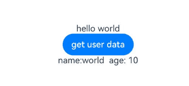

# 属性字符串

方便灵活应用文本样式的对象，可通过TextController中的[setStyledString](./ts-basic-components-text.md#setstyledstring12)方法与Text组件绑定，可通过RichEditorStyledStringController中的[setStyledString](ts-basic-components-richeditor.md#setstyledstring12)方法与RichEditor组件绑定。

>  **说明：**
>
>  从API Version 12开始支持。后续版本如有新增内容，则采用上角标单独标记该内容的起始版本。
>
>  属性字符串目前不支持在worker线程中使用。

## 规则说明

* 当组件样式和属性字符串中的样式冲突时，冲突部分以属性字符串设置的样式为准，未冲突部分则生效组件的样式。
* 当属性字符串和[Text](./ts-basic-components-text.md)子组件冲突时，属性字符串优先级高，即当Text组件中绑定了属性字符串，忽略Text组件下包含[Span](./ts-basic-components-span.md)等子组件的情况。
* 不支持@State修饰。
* 建议将StyledString定义为成员变量，从而避免应用退后台后被销毁。

## StyledString

constructor(value: string | ImageAttachment | CustomSpan , styles?: Array\<StyleOptions>)

**原子化服务API：** 从API version 12开始，该接口支持在原子化服务中使用。

**系统能力：** SystemCapability.ArkUI.ArkUI.Full

**参数：**

| 参数名 | 类型 | 必填 | 说明 |
| -------- | -------- | -------- | -------- |
| value | string \| [ImageAttachment](#imageattachment) \| [CustomSpan](#customspan) | 是 | 属性字符串文本内容。<br/>**说明：** <br/>当value值为ImageAttachment或CustomSpan时，styles参数不生效。  |
| styles | Array<[StyleOptions](#styleoptions对象说明)> | 否 | 属性字符串初始化选项。<br/>**说明：** <br/>start为异常值时，按默认值0处理。<br/>当start的值合法且length为异常值时，length的值为属性字符串长度与start的值的差值。<br/>StyledStringKey与StyledStringValue不匹配时，不生效。<br/>styledKey参数无默认值。 |

### 属性

**原子化服务API：** 从API version 12开始，该接口支持在原子化服务中使用。

**系统能力：** SystemCapability.ArkUI.ArkUI.Full

| 名称  |   类型   |   只读   |   可选   |   说明   |
| ------ | ------ | ------ | ------ | -------------- |
| length | number |  是   | 否   | 属性字符串字符的长度。<br/>**说明：** <br/>当属性字符串中包含图片或者CustomSpan时，其返回的长度按1计算。 |

### getString

getString(): string

获取字符串信息。

**原子化服务API：** 从API version 12开始，该接口支持在原子化服务中使用。

**系统能力：** SystemCapability.ArkUI.ArkUI.Full

**返回值：**

| 类型              |说明       |
| ------- | --------------------------------- | 
| string | 属性字符串文本内容。<br/>**说明：** <br/>当属性字符串中包含图片时，其返回的结果用空格表示。 |

### equals

equals(other: StyledString): boolean

判断两个属性字符串是否相等。

**原子化服务API：** 从API version 12开始，该接口支持在原子化服务中使用。

**系统能力：** SystemCapability.ArkUI.ArkUI.Full

**参数：**

| 参数名  | 类型                              | 必填 | 说明                                                         |
| ------- | --------------------------------- | ---- | ------------------------------------------------------------ |
| other | [StyledString](#styledstring) | 是   | StyledString类型的比较对象。 |

**返回值：**

| 类型              |       说明       |
| ------- | --------------------------------- | 
| boolean | 两个属性字符串是否相等。<br/>**说明：** <br/>当属性字符串的文本及样式均一致，视为相等。<br/>不比较GestureStyle，当属性字符串配置了不同事件，文本和其他样式相同时，亦视为相等。<br/>当比较CustomSpan时，比较的是地址，地址相等，视为相等。 |

### subStyledString

subStyledString(start: number , length?: number): StyledString

获取属性字符串的子字符串。

**原子化服务API：** 从API version 12开始，该接口支持在原子化服务中使用。

**系统能力：** SystemCapability.ArkUI.ArkUI.Full

**参数：**

| 参数名  | 类型                              | 必填 | 说明                                                         |
| ------- | --------------------------------- | ---- | ------------------------------------------------------------ |
| start | number | 是   | 子属性字符串开始位置的下标。 |
| length | number | 否   | 子属性字符串的长度。 |

**返回值：**

| 类型              |       说明       |
| ------- | --------------------------------- | 
| [StyledString](#styledstring) | 子属性字符串。<br/>**说明：** <br/>当start为合法入参时，length的默认值是被查询属性字符串对象的长度与start的值的差。<br/>当start和length越界或者必填传入undefined时，会抛出异常。|

**错误码**：

以下错误码详细介绍请参考[通用错误码](../../errorcode-universal.md)。

| 错误码ID | 错误信息 |
| ------- | -------- |
| 401      | Parameter error. Possible causes: 1. Mandatory parameters are left unspecified; 2.Incorrect parameters types; 3. Parameter verification failed.   |

### getStyles

getStyles(start: number , length: number , styledKey?: StyledStringKey): Array\<SpanStyle>

获取指定范围属性字符串的样式集合。

**原子化服务API：** 从API version 12开始，该接口支持在原子化服务中使用。

**系统能力：** SystemCapability.ArkUI.ArkUI.Full

**参数：**

| 参数名  | 类型                              | 必填 | 说明                                                         |
| ------- | --------------------------------- | ---- | ------------------------------------------------------------ |
| start | number | 是   | 指定范围属性字符串的下标。 |
| length | number | 是   | 指定范围属性字符串的长度。 |
| styledKey | [StyledStringKey](#styledstringkey12枚举说明) | 否   | 指定范围属性字符串样式的枚举值。 |

**返回值：**

| 类型              |       说明       |
| ------- | --------------------------------- | 
| Array<[SpanStyle](#spanstyle对象说明)> | 各样式对象的数组。<br/>**说明：** <br/>当指定范围属性字符串未设置任何样式，则返回空数组。<br/>当start和length越界或者必填传入undefined时，会抛出异常；<br/>当styledKey传入异常值或undefined时，会抛出异常。<br/>当styledKey为CustomSpan时，返回的是创建CustomSpan时传入的样式对象，即修改该样式对象也会影响实际的显示效果。 |

**错误码**：

以下错误码详细介绍请参考[通用错误码](../../errorcode-universal.md)。

| 错误码ID | 错误信息 |
| ------- | -------- |
| 401      | Parameter error. Possible causes: 1. Mandatory parameters are left unspecified; 2.Incorrect parameter types; 3. Parameter verification failed.   |

### fromHtml

static fromHtml(html: string): Promise\<StyledString>

将HTML格式字符串转换成属性字符串，当前支持转换的HTML标签范围：\<p>、\<span>、\。仅支持将这三种标签中的style属性样式转换成对应的属性字符串样式。

**原子化服务API：** 从API version 12开始，该接口支持在原子化服务中使用。

**系统能力：** SystemCapability.ArkUI.ArkUI.Full

**参数：**

| 参数名  | 类型                              | 必填 | 说明                                                         |
| ------- | --------------------------------- | ---- | ------------------------------------------------------------ |
| html | string | 是   | html格式的字符串。 |

**返回值：**

| 类型              |       说明       |
| ------- | --------------------------------- |
| [StyledString](#styledstring) | 属性字符串。 |

**错误码**：

以下错误码详细介绍请参考[通用错误码](../../errorcode-universal.md)。

| 错误码ID | 错误信息 |
| ------- | -------- |
| 401      | Parameter error. Possible causes: 1. Mandatory parameters are left unspecified; 2.Incorrect parameter types; 3. Parameter verification failed.   |

### toHtml<sup>14+</sup>

static toHtml(styledString: StyledString): string

将属性字符串转换成HTML格式字符串。支持转换的属性字符串[StyledStringKey](#styledstringkey12枚举说明)包括：StyledStringKey.FONT、StyledStringKey.DECORATION、StyledStringKey.LETTER_SPACING、StyledStringKey.TEXT_SHADOW、StyledStringKey.LINE_HEIGHT、StyledStringKey.IMAGE。

**原子化服务API：** 从API version 14开始，该接口支持在原子化服务中使用。

**系统能力：** SystemCapability.ArkUI.ArkUI.Full

**参数：**

| 参数名  | 类型                              | 必填 | 说明                                                         |
| ------- | --------------------------------- | ---- | ------------------------------------------------------------ |
| styledString | StyledString | 是   | 属性字符串。 |

**返回值：**

| 类型              |       说明       |
| ------- | --------------------------------- |
| string | HTML格式字符串。 |

**错误码**：

以下错误码详细介绍请参考[通用错误码](../../errorcode-universal.md)。

| 错误码ID | 错误信息 |
| ------- | -------- |
| 401      | Parameter error. Possible causes: 1. Mandatory parameters are left unspecified; 2.Incorrect parameter types; 3. Parameter verification failed.   |

## MutableStyledString

继承于[StyledString](#styledstring)类。

>  **以下接口异常入参处理统一说明：**
>
> 当start和length越界或者必填传入undefined时，会抛出异常；
>
> 当styledKey和styledValue传入异常值或者两者对应关系不匹配时，会抛出异常。
> 

### replaceString

replaceString(start: number , length: number , other: string): void

替换指定范围的字符串。

**原子化服务API：** 从API version 12开始，该接口支持在原子化服务中使用。

**系统能力：** SystemCapability.ArkUI.ArkUI.Full

**参数：**

| 参数名  | 类型                              | 必填 | 说明                                                         |
| ------- | --------------------------------- | ---- | ------------------------------------------------------------ |
| start | number | 是   | 指定范围的下标。 |
| length | number | 是   | 指定范围的长度。 |
| other | string | 是   | 替换的新文本内容。<br/>**说明：** <br/>替换的字符串使用的是start位置字符的样式。 |

**错误码**：

以下错误码详细介绍请参考[通用错误码](../../errorcode-universal.md)。

| 错误码ID | 错误信息 |
| ------- | -------- |
| 401      | Parameter error. Possible causes: 1. Mandatory parameters are left unspecified; 2.Incorrect parameter types; 3. Parameter verification failed.   |

### insertString

insertString(start: number , other: string): void

插入字符串。

**原子化服务API：** 从API version 12开始，该接口支持在原子化服务中使用。

**系统能力：** SystemCapability.ArkUI.ArkUI.Full

**参数：**

| 参数名  | 类型                              | 必填 | 说明                                                         |
| ------- | --------------------------------- | ---- | ------------------------------------------------------------ |
| start | number | 是   | 插入位置的下标。 |
| other | string | 是   | 插入的新文本内容。<br/>**说明：** <br/>插入的字符串使用的是start-1位置字符的样式。若start-1位置字符未设置样式，则使用start位置字符样式。 |

**错误码**：

以下错误码详细介绍请参考[通用错误码](../../errorcode-universal.md)。

| 错误码ID | 错误信息 |
| ------- | -------- |
| 401      | Parameter error. Possible causes: 1. Mandatory parameters are left unspecified; 2.Incorrect parameter types; 3. Parameter verification failed.   |

### removeString

removeString(start: number , length: number): void

移除指定范围的字符串。

当属性字符串中包含图片时，同样生效。

**原子化服务API：** 从API version 12开始，该接口支持在原子化服务中使用。

**系统能力：** SystemCapability.ArkUI.ArkUI.Full

**参数：**

| 参数名  | 类型                              | 必填 | 说明                                                         |
| ------- | --------------------------------- | ---- | ------------------------------------------------------------ |
| start | number | 是   | 指定范围的下标。 |
| length | number | 是   | 指定范围的长度。 |

**错误码**：

以下错误码详细介绍请参考[通用错误码](../../errorcode-universal.md)。

| 错误码ID | 错误信息 |
| ------- | -------- |
| 401      | Parameter error. Possible causes: 1. Mandatory parameters are left unspecified; 2.Incorrect parameter types; 3. Parameter verification failed.   |

### replaceStyle

replaceStyle(spanStyle: SpanStyle): void

替换指定范围内容为指定类型新样式。

**原子化服务API：** 从API version 12开始，该接口支持在原子化服务中使用。

**系统能力：** SystemCapability.ArkUI.ArkUI.Full

**参数：**

| 参数名  | 类型                              | 必填 | 说明                                                         |
| ------- | --------------------------------- | ---- | ------------------------------------------------------------ |
| spanStyle | [SpanStyle](#spanstyle对象说明) | 是   | 样式对象。<br/>**说明：** <br/>默认清空原有样式，替换为新样式。<br/>当SpanStyle的styledKey为IMAGE或CUSTOM_SPAN时，只有当start的位置当前是image或CustomSpan且长度为1，才会生效，其余情况无效果。 |

**错误码**：

以下错误码详细介绍请参考[通用错误码](../../errorcode-universal.md)。

| 错误码ID | 错误信息 |
| ------- | -------- |
| 401      | Parameter error. Possible causes: 1. Mandatory parameters are left unspecified; 2.Incorrect parameter types; 3. Parameter verification failed.   |

### setStyle

setStyle(spanStyle: SpanStyle): void

为指定范围内容设置指定类型新样式。

**原子化服务API：** 从API version 12开始，该接口支持在原子化服务中使用。

**系统能力：** SystemCapability.ArkUI.ArkUI.Full

**参数：**

| 参数名  | 类型                              | 必填 | 说明                                                         |
| ------- | --------------------------------- | ---- | ------------------------------------------------------------ |
| spanStyle | [SpanStyle](#spanstyle对象说明) | 是   | 样式对象。<br/>**说明：** <br/>默认不清空原有样式，叠加新样式。若是已有样式，则更新。<br/>当SpanStyle的styledKey为IMAGE或CUSTOM_SPAN时，只有当start的位置当前是image或者CustomSpan且长度为1，才会生效，其余情况无效果。 |

**错误码**：

以下错误码详细介绍请参考[通用错误码](../../errorcode-universal.md)。

| 错误码ID | 错误信息 |
| ------- | -------- |
| 401      |The parameter check failed.   |

### removeStyle

removeStyle(start: number , length: number , styledKey: StyledStringKey): void

清除指定范围内容的指定类型样式。

被清空样式类型对象属性使用的是对应[Text](./ts-basic-components-text.md)组件属性的设置值，若Text组件未设置值，则使用对应Text组件属性的默认值。

当属性字符串中包含图片时，同样生效。

**原子化服务API：** 从API version 12开始，该接口支持在原子化服务中使用。

**系统能力：** SystemCapability.ArkUI.ArkUI.Full

**参数：**

| 参数名  | 类型                              | 必填 | 说明                                                         |
| ------- | --------------------------------- | ---- | ------------------------------------------------------------ |
| start | number | 是   | 指定范围开始位置的下标。 |
| length | number | 是   | 指定范围的长度。 |
| styledKey | [StyledStringKey](#styledstringkey12枚举说明) | 是   | 样式类型枚举值。 |

**错误码**：

以下错误码详细介绍请参考[通用错误码](../../errorcode-universal.md)。

| 错误码ID | 错误信息 |
| ------- | -------- |
| 401      | Parameter error. Possible causes: 1. Mandatory parameters are left unspecified; 2.Incorrect parameter types; 3. Parameter verification failed.   |

### removeStyles

removeStyles(start: number , length: number): void

清除指定范围内容的所有样式。

被清空样式类型对象属性使用的是对应[Text](./ts-basic-components-text.md)组件属性的设置值，若Text组件未设置值，则使用对应Text组件属性的默认值。

当属性字符串中包含图片时，同样生效。

**原子化服务API：** 从API version 12开始，该接口支持在原子化服务中使用。

**系统能力：** SystemCapability.ArkUI.ArkUI.Full

**参数：**

| 参数名  | 类型                              | 必填 | 说明                                                         |
| ------- | --------------------------------- | ---- | ------------------------------------------------------------ |
| start | number | 是   | 指定范围开始位置的下标。 |
| length | number | 是   | 指定范围的长度。 |

**错误码**：

以下错误码详细介绍请参考[通用错误码](../../errorcode-universal.md)。

| 错误码ID | 错误信息 |
| ------- | -------- |
| 401      | Parameter error. Possible causes: 1. Mandatory parameters are left unspecified; 2.Incorrect parameter types; 3. Parameter verification failed.   |

### clearStyles

clearStyles(): void

清除属性字符串对象的所有样式。

被清空样式类型对象属性使用的是对应[Text](./ts-basic-components-text.md)组件属性的设置值，若Text组件未设置值，则使用对应Text组件属性的默认值。

**原子化服务API：** 从API version 12开始，该接口支持在原子化服务中使用。

**系统能力：** SystemCapability.ArkUI.ArkUI.Full

### replaceStyledString

replaceStyledString(start: number , length: number , other: StyledString): void

替换指定范围为新的属性字符串。

**原子化服务API：** 从API version 12开始，该接口支持在原子化服务中使用。

**系统能力：** SystemCapability.ArkUI.ArkUI.Full

**参数：**

| 参数名  | 类型                              | 必填 | 说明                                                         |
| ------- | --------------------------------- | ---- | ------------------------------------------------------------ |
| start | number | 是   | 指定范围开始位置的下标。 |
| length | number | 是   | 指定范围的长度。 |
| other | [StyledString](#styledstring) | 是   | 新的属性字符串对象。 |

**错误码**：

以下错误码详细介绍请参考[通用错误码](../../errorcode-universal.md)。

| 错误码ID | 错误信息 |
| ------- | -------- |
| 401      | Parameter error. Possible causes: 1. Mandatory parameters are left unspecified; 2.Incorrect parameter types; 3. Parameter verification failed.   |

### insertStyledString

insertStyledString(start: number , other: StyledString): void

在指定位置插入新的属性字符串。

**原子化服务API：** 从API version 12开始，该接口支持在原子化服务中使用。

**系统能力：** SystemCapability.ArkUI.ArkUI.Full

**参数：**

| 参数名  | 类型                              | 必填 | 说明                                                         |
| ------- | --------------------------------- | ---- | ------------------------------------------------------------ |
| start | number | 是   | 开始插入位置的下标。 |
| other | [StyledString](#styledstring) | 是   | 新的属性字符串对象。|

**错误码**：

以下错误码详细介绍请参考[通用错误码](../../errorcode-universal.md)。

| 错误码ID | 错误信息 |
| ------- | -------- |
| 401      | Parameter error. Possible causes: 1. Mandatory parameters are left unspecified; 2.Incorrect parameter types; 3. Parameter verification failed.   |

### appendStyledString

appendStyledString(other: StyledString): void

在末尾位置追加新的属性字符串。

**原子化服务API：** 从API version 12开始，该接口支持在原子化服务中使用。

**系统能力：** SystemCapability.ArkUI.ArkUI.Full

**参数：**

| 参数名  | 类型                              | 必填 | 说明                                                         |
| ------- | --------------------------------- | ---- | ------------------------------------------------------------ |
| other | [StyledString](#styledstring) | 是   | 新的属性字符串对象。|

## StyleOptions对象说明

**原子化服务API：** 从API version 12开始，该接口支持在原子化服务中使用。

**系统能力：** SystemCapability.ArkUI.ArkUI.Full

| 名称  | 类型                              | 必填 | 说明   |
| ------- | --------------------------------- | ---- | --------------------------------- |
| start | number | 否   | 设置属性字符串样式的开始位置。 |
| length | number | 否   | 设置属性字符串样式的长度。 |
| styledKey | [StyledStringKey](#styledstringkey12枚举说明) | 是   | 样式类型的枚举值。 |
| styledValue | [StyledStringValue](ts-types.md#styledstringvalue12) | 是   | 样式对象。 |

## SpanStyle对象说明

**原子化服务API：** 从API version 12开始，该接口支持在原子化服务中使用。

**系统能力：** SystemCapability.ArkUI.ArkUI.Full

| 名称  | 类型                              | 必填 | 说明   |
| ------- | --------------------------------- | ---- | --------------------------------- |
| start | number | 是   | 匹配属性字符串样式的开始位置。 |
| length | number | 是   | 匹配属性字符串样式的长度。 |
| styledKey | [StyledStringKey](#styledstringkey12枚举说明) | 是   | 样式类型的枚举值。 |
| styledValue | [StyledStringValue](ts-types.md#styledstringvalue12) | 是   | 样式对象。 |

## TextStyle

文本字体样式对象说明。

**系统能力：** SystemCapability.ArkUI.ArkUI.Full

### 属性

**原子化服务API：** 从API version 12开始，该接口支持在原子化服务中使用。

**系统能力：** SystemCapability.ArkUI.ArkUI.Full

| 名称           | 类型              | 只读   | 可选   | 说明     |
| ------------ |---------------------| ---- | ---- | ------ |
| fontColor  | [ResourceColor](ts-types.md#resourcecolor) |  是  |  是  | 获取属性字符串的文本颜色。 |
| fontFamily | string   | 是    | 是   | 获取属性字符串的文本字体。 |
| fontSize   | number   | 是    | 是    | 获取属性字符串的文本字体大小。<br/>单位：fp |
| fontWeight   | number   | 是    | 是    | 获取属性字符串的文本字体粗细。 |
| fontStyle   | [FontStyle](ts-appendix-enums.md#fontstyle) | 是    | 是    | 获取属性字符串的文本字体样式。 |

### constructor

constructor(value?: TextStyleInterface)

**原子化服务API：** 从API version 12开始，该接口支持在原子化服务中使用。

**系统能力：** SystemCapability.ArkUI.ArkUI.Full

**参数：**

| 参数名  | 类型                              | 必填 | 说明   |
| ------- | --------------------------------- | ---- | --------------------------------- |
| value | [TextStyleInterface](#textstyleinterface对象说明) | 否   | 字体样式设置项。 |

## TextStyleInterface对象说明

**原子化服务API：** 从API version 12开始，该接口支持在原子化服务中使用。

**系统能力：** SystemCapability.ArkUI.ArkUI.Full

| 名称  | 类型                              | 必填 | 说明   |
| ------- | --------------------------------- | ---- | --------------------------------- |
| fontColor | [ResourceColor](ts-types.md#resourcecolor) | 否   | 字体颜色。 |
| fontFamily | [ResourceStr](ts-types.md#resourcestr) | 否   | 文本字体。 |
| fontSize | [LengthMetrics](../js-apis-arkui-graphics.md#lengthmetrics12) | 否   | 字体大小。如果LengthMetrics的unit值是percent，当前设置不生效，处理为16fp。 |
| fontWeight | number \| [FontWeight](ts-appendix-enums.md#fontweight) \| string | 否   | 字体粗细。 |
| fontStyle | [FontStyle](ts-appendix-enums.md#fontstyle) | 否   | 字体样式。 |

## GestureStyle

事件手势对象说明。

**系统能力：** SystemCapability.ArkUI.ArkUI.Full

### constructor

constructor(value?: GestureStyleInterface)

**原子化服务API：** 从API version 12开始，该接口支持在原子化服务中使用。

**系统能力：** SystemCapability.ArkUI.ArkUI.Full

**参数：**

| 参数名  | 类型                              | 必填 | 说明   |
| ------- | --------------------------------- | ---- | --------------------------------- |
| value | [GestureStyleInterface](#gesturestyleinterface对象说明) | 否   | 事件设置项。 |

## GestureStyleInterface对象说明

**原子化服务API：** 从API version 12开始，该接口支持在原子化服务中使用。

**系统能力：** SystemCapability.ArkUI.ArkUI.Full

| 名称  | 类型                              | 必填 | 说明   |
| ------- | --------------------------------- | ---- | --------------------------------- |
| onClick | Callback\<[ClickEvent](ts-universal-events-click.md#clickevent对象说明)> | 否   | 设置点击事件。 |
| onLongPress | Callback\<[GestureEvent](./ts-gesture-settings.md#gestureevent对象说明)> | 否   | 设置长按事件。 |

## DecorationStyle

文本装饰线样式对象说明。

**系统能力：** SystemCapability.ArkUI.ArkUI.Full

### 属性

**原子化服务API：** 从API version 12开始，该接口支持在原子化服务中使用。

**系统能力：** SystemCapability.ArkUI.ArkUI.Full

| 名称           | 类型              | 只读   |可选   | 说明     |
| ------------ |---------------------| ---- | ---- | ------ |
| type  | [TextDecorationType](ts-appendix-enums.md#textdecorationtype) |  是  |  否  | 获取属性字符串的文本装饰线类型。 |
| color | [ResourceColor](ts-types.md#resourcecolor)   | 是    | 是  | 获取属性字符串的文本装饰线颜色。 |
| style | [TextDecorationStyle](ts-appendix-enums.md#textdecorationstyle12) | 是    |是  | 获取属性字符串的文本装饰线样式。 |

### constructor

constructor(value: DecorationStyleInterface)

**原子化服务API：** 从API version 12开始，该接口支持在原子化服务中使用。

**系统能力：** SystemCapability.ArkUI.ArkUI.Full

**参数：**

| 参数名  | 类型                              | 必填 | 说明   |
| ------- | --------------------------------- | ---- | --------------------------------- |
| value | [DecorationStyleInterface](#decorationstyleinterface对象说明) | 是   | 文本装饰线设置项。 |

## DecorationStyleInterface对象说明

**原子化服务API：** 从API version 12开始，该接口支持在原子化服务中使用。

**系统能力：** SystemCapability.ArkUI.ArkUI.Full

| 名称  | 类型                              | 必填 | 说明   |
| ------- | --------------------------------- | ---- | --------------------------------- |
| type | [TextDecorationType](ts-appendix-enums.md#textdecorationtype) | 是   | 装饰线类型。 |
| color | [ResourceColor](ts-types.md#resourcecolor) | 否   | 装饰线颜色。 |
| style | [TextDecorationStyle](ts-appendix-enums.md#textdecorationstyle12) | 否   | 装饰线样式。 |

## BaselineOffsetStyle

文本基线偏移量对象说明。

**系统能力：** SystemCapability.ArkUI.ArkUI.Full

### 属性

**原子化服务API：** 从API version 12开始，该接口支持在原子化服务中使用。

**系统能力：** SystemCapability.ArkUI.ArkUI.Full

| 名称           | 类型              | 只读   | 可选   | 说明     |
| ------------ |---------------------| ---- | ---- | ------ |
| baselineOffset  | number |  是  |  否 | 获取属性字符串的文本基线偏移量。<br/>单位：vp |

### constructor

constructor(value: LengthMetrics)

**原子化服务API：** 从API version 12开始，该接口支持在原子化服务中使用。

**系统能力：** SystemCapability.ArkUI.ArkUI.Full

**参数：**

| 参数名  | 类型                              | 必填 | 说明   |
| ------- | --------------------------------- | ---- | --------------------------------- |
| value | [LengthMetrics](../js-apis-arkui-graphics.md#lengthmetrics12) | 是   | 文本基线偏移量设置项。如果LengthMetrics的unit值是percent，该设置不生效。 |

## LetterSpacingStyle

文本字符间距对象说明。

**系统能力：** SystemCapability.ArkUI.ArkUI.Full

### 属性

**原子化服务API：** 从API version 12开始，该接口支持在原子化服务中使用。

**系统能力：** SystemCapability.ArkUI.ArkUI.Full

| 名称           | 类型              | 只读   | 可选   | 说明     |
| ------------ |---------------------| ---- | ---- | ------ |
| letterSpacing  | number |  是  |  否  | 获取属性字符串的文本字符间距。<br/>单位：vp |

### constructor

constructor(value: LengthMetrics)

**原子化服务API：** 从API version 12开始，该接口支持在原子化服务中使用。

**系统能力：** SystemCapability.ArkUI.ArkUI.Full

**参数：**

| 参数名  | 类型                              | 必填 | 说明   |
| ------- | --------------------------------- | ---- | --------------------------------- |
| value | [LengthMetrics](../js-apis-arkui-graphics.md#lengthmetrics12) | 是   | 文本字符间距设置项。如果LengthMetrics的unit值是percent，该设置不生效。 |

## LineHeightStyle

文本行高对象说明。

**系统能力：** SystemCapability.ArkUI.ArkUI.Full

### 属性

**原子化服务API：** 从API version 12开始，该接口支持在原子化服务中使用。

**系统能力：** SystemCapability.ArkUI.ArkUI.Full

| 名称           | 类型              | 只读   | 可选   | 说明     |
| ------------ |---------------------| ---- | ---- | ------ |
| lineHeight  | number |  是  |  否  | 获取属性字符串的文本行高。<br/>单位：vp |

### constructor

constructor(lineHeight: LengthMetrics)

**原子化服务API：** 从API version 12开始，该接口支持在原子化服务中使用。

**系统能力：** SystemCapability.ArkUI.ArkUI.Full

**参数：**

| 参数名  | 类型                              | 必填 | 说明   |
| ------- | --------------------------------- | ---- | --------------------------------- |
| lineHeight | [LengthMetrics](../js-apis-arkui-graphics.md#lengthmetrics12) | 是   | 文本行高设置项。如果LengthMetrics的value值不大于0时，不限制文本行高，自适应字体大小。 |

## TextShadowStyle

文本阴影对象说明。

**系统能力：** SystemCapability.ArkUI.ArkUI.Full

### 属性

**原子化服务API：** 从API version 12开始，该接口支持在原子化服务中使用。

**系统能力：** SystemCapability.ArkUI.ArkUI.Full

| 名称           | 类型              | 只读   | 可选   | 说明     |
| ------------ |---------------------| ---- | ---- | ------ |
| textShadow  | Array\<[ShadowOptions](ts-universal-attributes-image-effect.md#shadowoptions对象说明)> |  是  |  否  | 获取属性字符串的文本阴影。 |

### constructor

constructor(value: ShadowOptions | Array\<ShadowOptions>)

**原子化服务API：** 从API version 12开始，该接口支持在原子化服务中使用。

**系统能力：** SystemCapability.ArkUI.ArkUI.Full

**参数：**

| 参数名  | 类型                              | 必填 | 说明   |
| ------- | --------------------------------- | ---- | --------------------------------- |
| value | [ShadowOptions](ts-universal-attributes-image-effect.md#shadowoptions对象说明) \| Array\<[ShadowOptions](ts-universal-attributes-image-effect.md#shadowoptions对象说明)>  | 是   | 文本阴影设置项。 |

## ImageAttachment

图片对象说明。

**系统能力：** SystemCapability.ArkUI.ArkUI.Full

### 属性

**原子化服务API：** 从API version 12开始，该接口支持在原子化服务中使用。

**系统能力：** SystemCapability.ArkUI.ArkUI.Full

| 名称           | 类型              | 只读   | 可选   | 说明     |
| ------------ |---------------------| ---- | ---- | ------ |
| value  | [PixelMap](../../apis-image-kit/js-apis-image.md#pixelmap7) |  是  |  否  | 获取属性字符串的图片数据源。 |
| size  | [SizeOptions](ts-types.md#sizeoptions) |  是  |  是  | 获取属性字符串的图片尺寸。 |
| verticalAlign  | [ImageSpanAlignment](ts-basic-components-imagespan.md#imagespanalignment) |  是  |  是  | 获取属性字符串的图片对齐方式。 |
| objectFit  | [ImageFit](ts-appendix-enums.md#imagefit) |  是  |  是  | 获取属性字符串的图片缩放类型。 |
| layoutStyle  | [ImageAttachmentLayoutStyle](#imageattachmentlayoutstyle对象说明) |  是  |  是  | 获取属性字符串的图片布局。 |

### constructor

constructor(value: ImageAttachmentInterface)

**原子化服务API：** 从API version 12开始，该接口支持在原子化服务中使用。

**系统能力：** SystemCapability.ArkUI.ArkUI.Full

**参数：**

| 参数名  | 类型                              | 必填 | 说明   |
| ------- | --------------------------------- | ---- | --------------------------------- |
| value | [ImageAttachmentInterface](#imageattachmentinterface对象说明) | 是   | 图片设置项。 |

## ImageAttachmentInterface对象说明

**原子化服务API：** 从API version 12开始，该接口支持在原子化服务中使用。

**系统能力：** SystemCapability.ArkUI.ArkUI.Full

| 名称  | 类型                              | 必填 | 说明   |
| ------- | --------------------------------- | ---- | --------------------------------- |
| value | [PixelMap](../../apis-image-kit/js-apis-image.md#pixelmap7) |  是  | 设置图片数据源。 |
| size | [SizeOptions](ts-types.md#sizeoptions) | 否   | 设置图片大小。 |
| verticalAlign | [ImageSpanAlignment](ts-basic-components-imagespan.md#imagespanalignment) | 否   | 设置图片基于文本的对齐方式。 |
| objectFit | [ImageFit](ts-appendix-enums.md#imagefit) | 否   | 设置图片的缩放类型。 |
| layoutStyle | [ImageAttachmentLayoutStyle](#imageattachmentlayoutstyle对象说明) | 否   | 设置图片布局。 |

## ImageAttachmentLayoutStyle对象说明

**原子化服务API：** 从API version 12开始，该接口支持在原子化服务中使用。

**系统能力：** SystemCapability.ArkUI.ArkUI.Full

| 名称  | 类型                              | 必填 | 说明   |
| ------- | --------------------------------- | ---- | --------------------------------- |
| margin | [LengthMetrics](../js-apis-arkui-graphics.md#lengthmetrics12) \| [Margin](ts-types.md#margin) | 否   | 设置图片外边距。 |
| padding | [LengthMetrics](../js-apis-arkui-graphics.md#lengthmetrics12) \| [Padding](ts-types.md#padding) | 否   | 设置图片内边距。 |
| borderRadius | [LengthMetrics](../js-apis-arkui-graphics.md#lengthmetrics12) \| [BorderRadiuses](ts-types.md#borderradiuses9) | 否   | 设置圆角。 |

## CustomSpan

自定义绘制Span，仅提供基类，具体实现由开发者定义。

自定义绘制Span拖拽显示的缩略图为空白。

**系统能力：** SystemCapability.ArkUI.ArkUI.Full

### onMeasure

abstract onMeasure(measureInfo: CustomSpanMeasureInfo): CustomSpanMetrics

获取自定义绘制Span的尺寸大小。

**原子化服务API：** 从API version 12开始，该接口支持在原子化服务中使用。

**系统能力：** SystemCapability.ArkUI.ArkUI.Full

**参数：**

| 参数名  | 类型                              | 必填 | 说明                                                         |
| ------- | --------------------------------- | ---- | ------------------------------------------------------------ |
| measureInfo | [CustomSpanMeasureInfo](#customspanmeasureinfo对象说明) | 是   | 文本的字体大小。 |

**返回值：**

| 类型              |       说明       |
| ------- | --------------------------------- | 
| [CustomSpanMetrics](#customspanmetrics对象说明) | 自定义绘制Span的尺寸信息。<br/>**说明：** <br/>最终的CustomSpan的高度是由当前Text组件的行高所决定的。当height不传值，则默认取Text组件的fontSize的值作为CustomSpan的高度；当height大于当前行的其他子组件的高度时，此时height即为Text组件的行高。 |

### onDraw

abstract onDraw(context: DrawContext, drawInfo: CustomSpanDrawInfo): void

绘制自定义绘制Span。

**原子化服务API：** 从API version 12开始，该接口支持在原子化服务中使用。

**系统能力：** SystemCapability.ArkUI.ArkUI.Full

**参数：**

| 参数名  | 类型                              | 必填 | 说明                                                         |
| ------- | --------------------------------- | ---- | ------------------------------------------------------------ |
| context | [DrawContext](../js-apis-arkui-graphics.md#drawcontext) | 是   | 图形绘制上下文。<br/>**说明：** <br/>DrawContext的canvas方法获取的画布是Text组件的画布，绘制时不会超出Text组件的范围。 |
| drawInfo | [CustomSpanDrawInfo](#customspandrawinfo对象说明) | 是   | 自定义绘制Span的绘制信息。 |

### invalidate<sup>13+<sup>

invalidate(): void

主动刷新使用CustomSpan的Text组件。

**原子化服务API：** 从API version 13开始，该接口支持在原子化服务中使用。

**系统能力：** SystemCapability.ArkUI.ArkUI.Full

## CustomSpanMeasureInfo对象说明

**原子化服务API：** 从API version 12开始，该接口支持在原子化服务中使用。

**系统能力：** SystemCapability.ArkUI.ArkUI.Full

| 名称  | 类型                              | 必填 | 说明   |
| ------- | --------------------------------- | ---- | --------------------------------- |
| fontSize | number |  是  | 设置文本字体大小。<br/>单位：fp |

## CustomSpanMetrics对象说明

**原子化服务API：** 从API version 12开始，该接口支持在原子化服务中使用。

**系统能力：** SystemCapability.ArkUI.ArkUI.Full

| 名称  | 类型                              | 必填 | 说明   |
| ------- | --------------------------------- | ---- | --------------------------------- |
| width | number |  是  | 自定义绘制Span的宽。<br/>单位：vp |
| height | number |  否  | 自定义绘制Span的高。<br/>单位：vp |

## CustomSpanDrawInfo对象说明

**原子化服务API：** 从API version 12开始，该接口支持在原子化服务中使用。

**系统能力：** SystemCapability.ArkUI.ArkUI.Full

| 名称  | 类型                              | 必填 | 说明   |
| ------- | --------------------------------- | ---- | --------------------------------- |
| x | number |  是  | 自定义绘制Span相对于挂载组件的偏移。<br/>单位：px |
| lineTop | number |  是  | 自定义绘制Span相对于Text组件的上边距。<br/>单位：px |
| lineBottom | number |  是  | 自定义绘制Span相对于Text组件的下边距。<br/>单位：px |
| baseline | number |  是  | 自定义绘制Span的所在行的基线偏移量。<br/>单位：px |

## ParagraphStyle

文本段落样式对象说明。

除首个段落外，后续段落按'\n'划分。

每个段落的段落样式按首个占位设置的段落样式生效，未设置时，段落按被绑定组件的段落样式生效。

**系统能力：** SystemCapability.ArkUI.ArkUI.Full

### 属性

**原子化服务API：** 从API version 12开始，该接口支持在原子化服务中使用。

**系统能力：** SystemCapability.ArkUI.ArkUI.Full

| 名称           | 类型              | 只读   | 可选   | 说明     |
| ------------ |---------------------| ---- | ---- | ------ |
| textAlign  | [TextAlign](ts-appendix-enums.md#textalign) |  是  |  是  | 获取属性字符串文本段落在水平方向的对齐方式。 |
| textIndent | number   | 是    | 是    | 获取属性字符串文本段落的首行文本缩进。 |
| maxLines   | number   | 是    | 是    | 获取属性字符串文本段落的最大行数。 |
| overflow   | [TextOverflow](ts-appendix-enums.md#textoverflow)   | 是    | 是   | 获取属性字符串文本段落超长时的显示方式。 |
| wordBreak   | [WordBreak](ts-appendix-enums.md#wordbreak11) | 是    | 是    | 获取属性字符串文本段落的断行规则。 |
| leadingMargin   | number \| [LeadingMarginPlaceholder](ts-basic-components-richeditor.md#leadingmarginplaceholder11) | 是    | 是   | 获取属性字符串文本段落的缩进。 |

>  **说明：**
>
>  属性字符串的maxLines和overflow仅在Text中生效，建议在组件侧设置。

### constructor

constructor(value?: ParagraphStyleInterface)

**原子化服务API：** 从API version 12开始，该接口支持在原子化服务中使用。

**系统能力：** SystemCapability.ArkUI.ArkUI.Full

**参数：**

| 参数名  | 类型                              | 必填 | 说明   |
| ------- | --------------------------------- | ---- | --------------------------------- |
| value | [ParagraphStyleInterface](#paragraphstyleinterface对象说明) | 否   | 段落样式设置项。 |

## ParagraphStyleInterface对象说明

**原子化服务API：** 从API version 12开始，该接口支持在原子化服务中使用。

**系统能力：** SystemCapability.ArkUI.ArkUI.Full

| 名称  | 类型                              | 必填 | 说明   |
| ------- | --------------------------------- | ---- | --------------------------------- |
| textAlign  | [TextAlign](ts-appendix-enums.md#textalign) |  否  | 设置文本段落在水平方向的对齐方式。 |
| textIndent | [LengthMetrics](../js-apis-arkui-graphics.md#lengthmetrics12)   | 否    | 设置文本段落的首行文本缩进。 |
| maxLines   | number   | 否    | 设置文本段落的最大行数。 |
| overflow   | [TextOverflow](ts-appendix-enums.md#textoverflow)   |  否    | 设置文本段落超长时的显示方式。<br />需配合maxLines使用，单独设置不生效。不支持TextOverflow.MARQUEE。 |
| wordBreak   | [WordBreak](ts-appendix-enums.md#wordbreak11) | 否    | 设置文本段落的断行规则。 |
| leadingMargin   | [LengthMetrics](../js-apis-arkui-graphics.md#lengthmetrics12) \| [LeadingMarginPlaceholder](ts-basic-components-richeditor.md#leadingmarginplaceholder11) | 否    | 设置文本段落的缩进。 |

## UserDataSpan

支持存储自定义扩展信息，用于存储和获取用户数据，仅提供基类，具体实现由开发者定义。

扩展信息不影响实际显示效果。

**原子化服务API：** 从API version 12开始，该接口支持在原子化服务中使用。

**系统能力：** SystemCapability.ArkUI.ArkUI.Full

## StyledStringKey<sup>12+</sup>枚举说明

**原子化服务API：** 从API version 12开始，该接口支持在原子化服务中使用。

**系统能力：** SystemCapability.ArkUI.ArkUI.Full

| 名称     |说明                           |
| ------ | ----------------------------- |
| FONT | 字体样式键。[TextStyle](./ts-universal-styled-string.md#textstyle)所属键。|
| DECORATION | 文本装饰线样式键。[DecorationStyle](./ts-universal-styled-string.md#decorationstyle)所属键。|
| BASELINE_OFFSET | 文本基线偏移量样式键。[BaselineOffsetStyle](./ts-universal-styled-string.md#baselineoffsetstyle)所属键。|
| LETTER_SPACING | 文本字符间距样式键。[LetterSpacingStyle](./ts-universal-styled-string.md#letterspacingstyle)所属键。|
| LINE_HEIGHT | 文本行高样式键。[LineHeightStyle](./ts-universal-styled-string.md#lineheightstyle)所属键。|
| TEXT_SHADOW | 文本阴影样式键。[TextShadowStyle](./ts-universal-styled-string.md#textshadowstyle)所属键。|
| BACKGROUND_COLOR<sup>13+</sup> | 文本背景色样式键。[BackgroundColorStyle](./ts-universal-styled-string.md#backgroundcolorstyle13)所属键。|
| URL<sup>13+</sup> | 超链接样式键。[UrlStyle](./ts-universal-styled-string.md#urlstyle13)所属键。|
| GESTURE | 事件手势键。[GestureStyle](./ts-universal-styled-string.md#gesturestyle)所属键。|
| PARAGRAPH_STYLE | 段落样式键。[ParagraphStyle](./ts-universal-styled-string.md#paragraphstyle)所属键。|
| IMAGE | 图片键。[ImageAttachment](./ts-universal-styled-string.md#imageattachment)所属键。|
| CUSTOM_SPAN | 自定义绘制Span键。[CustomSpan](./ts-universal-styled-string.md#customspan)所属键。|
| USER_DATA | UserDataSpan键。[UserDataSpan](./ts-universal-styled-string.md#userdataspan)所属键。|

## BackgroundColorStyle<sup>13+</sup>

文本背景颜色对象说明。

**系统能力：** SystemCapability.ArkUI.ArkUI.Full

### 属性

**原子化服务API：** 从API version 13开始，该接口支持在原子化服务中使用。

**系统能力：** SystemCapability.ArkUI.ArkUI.Full

| 名称           | 类型              | 只读   | 必填   | 说明     |
| ------------ |---------------------| ---- | ---- | ------ |
| textBackgroundStyle  |  [TextBackgroundStyle](ts-basic-components-span.md#textbackgroundstyle11对象说明)  |  是  |  是  | 获取属性字符串的文本背景颜色。<br />默认值：<br />{<br /> color: Color.Transparent,<br />  radius: 0<br />} |

### constructor<sup>13+</sup>

constructor(textBackgroundStyle: TextBackgroundStyle)

**原子化服务API：** 从API version 13开始，该接口支持在原子化服务中使用。

**系统能力：** SystemCapability.ArkUI.ArkUI.Full

**参数：**

| 参数名  | 类型                              | 必填 | 说明   |
| ------- | --------------------------------- | ---- | --------------------------------- |
| textBackgroundStyle |  [TextBackgroundStyle](ts-basic-components-span.md#textbackgroundstyle11对象说明) | 是   | 文本背景色设置项。<br />默认值：<br />{<br />  color: Color.Transparent,<br />  radius: 0<br />} |

## UrlStyle<sup>13+</sup>

超链接对象说明。

默认颜色、字号、字重分别是'#ff0a59f7'、'16fp'、'FontWeight.Regular'，若属性字符串设置TextStyle，则TextStyle优先级更高。

**系统能力：** SystemCapability.ArkUI.ArkUI.Full

### 属性

**原子化服务API：** 从API version 13开始，该接口支持在原子化服务中使用。

**系统能力：** SystemCapability.ArkUI.ArkUI.Full

| 名称           | 类型              | 只读   | 必填   | 说明     |
| ------------ |---------------------| ---- | ---- | ------ |
| url  | string |  是  |  是  | 获取属性字符串的超链接内容。 |

### constructor<sup>13+</sup>

constructor(url: string)

**原子化服务API：** 从API version 13开始，该接口支持在原子化服务中使用。

**系统能力：** SystemCapability.ArkUI.ArkUI.Full

**参数：**

| 参数名  | 类型                              | 必填 | 说明   |
| ------- | --------------------------------- | ---- | --------------------------------- |
| url | string | 是   | 超链接设置项。|

## 示例

### 示例1

属性字符串接口基本使用示例

```ts
// xxx.ets
@Entry
@Component
struct styled_string_demo1 {
  @State height1: number = 450;
  @State fontSize1: number = 16;
  @State fontWeight1: number = 400;
  @State color1: Color = Color.Blue;
  scroll: Scroller = new Scroller();
  fontStyleAttr1: TextStyle = new TextStyle({ fontColor: Color.Blue });
  fontStyleAttr2: StyledStringValue = new TextStyle({ fontColor: Color.Orange });
  // 创建可读写属性字符串的对象mutableStyledString1
  mutableStyledString1: MutableStyledString = new MutableStyledString("运动45分钟");
  // 创建构造入参有字符串和样式的对象mutableStyledString2
  mutableStyledString2: MutableStyledString = new MutableStyledString("test hello world", [{
    start: 0,
    length: 5,
    styledKey: StyledStringKey.FONT,
    styledValue: this.fontStyleAttr1
  }]);
  // 创建只读属性字符串对象styledString2
  styledString2: StyledString = new StyledString("运动45分钟");
  spanStyle1: SpanStyle = {
    start: 0,
    length: 5,
    styledKey: StyledStringKey.FONT,
    styledValue: new TextStyle({ fontColor: Color.Pink })
  };
  spanStyle2: SpanStyle = {
    start: 0,
    length: 2,
    styledKey: StyledStringKey.FONT,
    styledValue: new TextStyle({ fontColor: Color.Red })
  };
  @State string1: string = '';
  @State fontColor1: ResourceColor = Color.Red;
  controller1: TextController = new TextController();
  controller2: TextController = new TextController();
  controller3: TextController = new TextController();

  async onPageShow() {
    this.controller1.setStyledString(this.styledString2)
    this.controller2.setStyledString(this.mutableStyledString1)
    this.controller3.setStyledString(this.mutableStyledString2)
  }

  build() {
    Column() {
      Scroll(this.scroll) {
        Column() {
          // 显示属性字符串
          Text(undefined, { controller: this.controller1 })
          Text(undefined, { controller: this.controller3 }).key('mutableStyledString2')
          Button('修改string1的值')
            .onClick(() => {
              let result = this.mutableStyledString1.equals(this.styledString2);
              if (result) {
                this.string1 = this.mutableStyledString1.getString();
                console.info("mutableStyledString1 content:", this.mutableStyledString1.getString());
                console.info("mutableStyledString1 length:", this.mutableStyledString1.length);
              }
            })

          // 属性字符串与Span冲突时忽略Span,以及样式与Text组件属性未冲突部分生效Text设置的属性
          Text(undefined, { controller: this.controller2 }) {
            Span("span and styledString test")
              .fontColor(Color.Yellow)
              .decoration({ type: TextDecorationType.LineThrough })
            ImageSpan($r('app.media.icon'))
          }
          .key('styledString2')
          .fontColor(this.fontColor1)
          .letterSpacing(10)
          .fontSize(32)
          .fontWeight(600)
          .fontStyle(FontStyle.Italic)
          .lineHeight(30)
          .textShadow({ radius: 5, color: Color.Blue, offsetX: 5, offsetY: 5 })
          .textCase(TextCase.UpperCase)
          .decoration({ type: TextDecorationType.LineThrough, color: Color.Yellow })
          .baselineOffset(2)
          .copyOption(CopyOptions.InApp)
          .margin({ top: 10 })
          .draggable(true)

          // 以上冲突测试对照组
          Text() {
            Span(this.string1)
              .fontColor(this.color1)
              .decoration({ type: TextDecorationType.LineThrough })
            ImageSpan($r('app.media.icon'))
              .width(50).height(50)
          }
          .letterSpacing(10)
          .fontSize(32)
          .fontWeight(600)
          .fontStyle(FontStyle.Italic)
          .lineHeight(30)
          .textShadow({ radius: 5, color: Color.Blue, offsetX: 5, offsetY: 5 })
          .textCase(TextCase.UpperCase)
          .decoration({ type: TextDecorationType.LineThrough, color: Color.Yellow })
          .baselineOffset(2)

          Button('设置样式及替换文本')
            .onClick(() => {
              this.mutableStyledString1.replaceStyle({
                start: 2,
                length: 2,
                styledKey: StyledStringKey.FONT,
                styledValue: this.fontStyleAttr1
              })
              this.mutableStyledString1.insertString(0, "压力85偏高，")
              this.mutableStyledString1.setStyle({
                start: 2,
                length: 2,
                styledKey: StyledStringKey.FONT,
                styledValue: this.fontStyleAttr2
              })
              this.controller2.setStyledString(this.mutableStyledString1)
            })
            .margin({ top: 10 })

          Button('查询样式及清空样式')
            .onClick(() => {
              let styles = this.mutableStyledString1.getStyles(0, this.mutableStyledString1.length)
              if (styles.length == 2) {
                for (let i = 0; i < styles.length; i++) {
                  console.info('StyledString style object start:' + styles[i].start)
                  console.info('StyledString style object length:' + styles[i].length)
                  console.info('StyledString style object key:' + styles[i].styledKey)
                  if (styles[i].styledKey === 0) {
                    let fontAttr = styles[i].styledValue as TextStyle;
                    console.info('StyledString fontColor:' + fontAttr.fontColor)
                  }
                }
              }
              if (styles[0] !== undefined) {
                this.mutableStyledString2.setStyle(styles[0]);
                this.controller3.setStyledString(this.mutableStyledString2);
              }
              this.mutableStyledString1.removeStyles(2, 3);
              this.controller2.setStyledString(this.mutableStyledString1);
            })
            .margin({ top: 10 })
        }.width('100%')

      }
      .expandSafeArea([SafeAreaType.KEYBOARD])
      .scrollable(ScrollDirection.Vertical)
      .scrollBar(BarState.On)
      .scrollBarColor(Color.Gray)
      .scrollBarWidth(10)
      .edgeEffect(EdgeEffect.None)
    }
    .width('100%')
  }
}
```



### 示例2

属性字符串支持事件接口示例

```ts
// xxx.ets
import { promptAction } from '@kit.ArkUI';

@Entry
@Component
struct styled_string_demo2 {
  scroll: Scroller = new Scroller();
  fontStyleAttr1: TextStyle = new TextStyle({ fontColor: Color.Blue });
  clickGestureAttr: GestureStyle = new GestureStyle({
    onClick: () => {
      promptAction.showToast({ message: 'clickGestureAttr object trigger click event' })
      this.backgroundColor1 = Color.Yellow
    }
  })
  gestureStyleAttr: GestureStyle = new GestureStyle({
    onClick: () => {
      promptAction.showToast({ message: 'gestureStyleAttr object trigger click event' })
      this.backgroundColor1 = Color.Green
    },
    onLongPress: () => {
      promptAction.showToast({ message: 'gestureStyleAttr object trigger long press event' })
      this.backgroundColor1 = Color.Orange
    }
  });
  // 创建事件的对象mutableStyledString3
  mutableStyledString3: MutableStyledString = new MutableStyledString("hello world", [{
    start: 0,
    length: 5,
    styledKey: StyledStringKey.GESTURE,
    styledValue: this.clickGestureAttr
  },
    {
      start: 0,
      length: 5,
      styledKey: StyledStringKey.FONT,
      styledValue: this.fontStyleAttr1
    },
    {
      start: 6,
      length: 5,
      styledKey: StyledStringKey.GESTURE,
      styledValue: this.gestureStyleAttr
    },
    {
      start: 6,
      length: 5,
      styledKey: StyledStringKey.FONT,
      styledValue: new TextStyle({ fontColor: Color.Pink })
    }]);
  @State fontColor1: ResourceColor = Color.Red;
  @State backgroundColor1: ResourceColor | undefined = undefined;
  controller3: TextController = new TextController();

  async onPageShow() {
    this.controller3.setStyledString(this.mutableStyledString3)
  }

  build() {
    Column() {
      Scroll(this.scroll) {
        Column({ space: 30 }) {
          Button("响应属性字符串事件改变背景色").backgroundColor(this.backgroundColor1).width('80%')
          // 包含事件的属性字符串
          Text(undefined, { controller: this.controller3 }).fontSize(30)
            .copyOption(CopyOptions.InApp)
            .draggable(true)
            .clip(true)
        }.width('100%')
      }
      .expandSafeArea([SafeAreaType.KEYBOARD])
      .scrollable(ScrollDirection.Vertical)
      .scrollBar(BarState.On)
      .scrollBarColor(Color.Gray)
      .scrollBarWidth(10)
      .edgeEffect(EdgeEffect.None)
    }
    .width('100%')
  }
}
```


### 示例3

属性字符串支持文本样式接口示例

```ts
// xxx.ets
import { LengthMetrics, LengthUnit } from '@kit.ArkUI'

@Entry
@Component
struct styled_string_demo3 {
  fontStyleAttr1: TextStyle = new TextStyle({ fontColor: Color.Blue });
  fontStyleAttr2: StyledStringValue = new TextStyle({
    fontColor: Color.Orange,
    fontSize: LengthMetrics.vp(20),
    fontWeight: FontWeight.Bolder,
    fontStyle: FontStyle.Italic,
    fontFamily: "Arial"
  });
  fontStyleAttr3: StyledStringValue = new TextStyle({
    fontColor: Color.Orange,
    fontSize: LengthMetrics.vp(20),
    fontWeight: FontWeight.Lighter,
    fontStyle: FontStyle.Italic,
    fontFamily: "Arial"
  });
  // 创建多重TextStyle样式的对象mutableStyledString1
  mutableStyledString1: MutableStyledString = new MutableStyledString("运动45分钟", [{
    start: 0,
    length: 2,
    styledKey: StyledStringKey.FONT,
    styledValue: this.fontStyleAttr3
  }, {
    start: 2,
    length: 2,
    styledKey: StyledStringKey.FONT,
    styledValue: this.fontStyleAttr2
  }
  ]);
  // 创建有多种样式组合对象mutableStyledString2
  mutableStyledString2: MutableStyledString = new MutableStyledString("test hello world", [{
    start: 0,
    length: 5,
    styledKey: StyledStringKey.FONT,
    styledValue: this.fontStyleAttr1
  }, {
    start: 0,
    length: 5,
    styledKey: StyledStringKey.DECORATION,
    styledValue: new DecorationStyle({ type: TextDecorationType.LineThrough, color: Color.Blue })
  }, {
    start: 0,
    length: 5,
    styledKey: StyledStringKey.TEXT_SHADOW,
    styledValue: new TextShadowStyle({
      radius: 5,
      type: ShadowType.COLOR,
      color: Color.Yellow,
      offsetX: 10,
      offsetY: -10
    })
  }, {
    start: 0,
    length: 5,
    styledKey: StyledStringKey.BASELINE_OFFSET,
    styledValue: new BaselineOffsetStyle(LengthMetrics.px(20))
  }, {
    start: 0,
    length: 5,
    styledKey: StyledStringKey.LETTER_SPACING,
    styledValue: new LetterSpacingStyle(new LengthMetrics(10, LengthUnit.VP))
  }, {
    start: 6,
    length: 5,
    styledKey: StyledStringKey.BASELINE_OFFSET,
    styledValue: new BaselineOffsetStyle(LengthMetrics.fp(10))
  }
  ]);
  @State fontColor1: ResourceColor = Color.Red;
  controller: TextController = new TextController();
  options: TextOptions = { controller: this.controller };
  controller2: TextController = new TextController();
  spanStyle1: SpanStyle = {
    start: 0,
    length: 5,
    styledKey: StyledStringKey.FONT,
    styledValue: new TextStyle({ fontColor: Color.Pink })
  };

  async onPageShow() {
    this.controller.setStyledString(this.mutableStyledString1)
    this.controller2.setStyledString(this.mutableStyledString2)
  }

  build() {
    Column() {
      Column({ space: 10 }) {
        // 显示配了字体各种样式的属性字符串，Text组件亦配置冲突部分生效属性字符串配置，未冲突区间生效Text组件属性设置值
        Text(undefined, this.options)
          .fontColor(this.fontColor1)
          .font({ size: 20, weight: 500, style: FontStyle.Normal })
        // 显示配置了文本阴影、划线、字符间距、基线偏移量的属性字符串，Text组件亦配置生效属性字符串配置
        Text(undefined, { controller: this.controller2 })
          .fontSize(30)
          .copyOption(CopyOptions.InApp)
          .draggable(true)
          .decoration({ type: TextDecorationType.Overline, color: Color.Pink })
          .textShadow({
            radius: 10,
            type: ShadowType.COLOR,
            color: Color.Green,
            offsetX: -10,
            offsetY: 10
          })
        Button('查询字体样式')
          .onClick(() => {
            let styles = this.mutableStyledString1.getStyles(0, this.mutableStyledString1.length)
            if (styles.length !== 0) {
              for (let i = 0; i < styles.length; i++) {
                console.info('mutableStyledString1 style object start:' + styles[i].start)
                console.info('mutableStyledString1 style object length:' + styles[i].length)
                console.info('mutableStyledString1 style object key:' + styles[i].styledKey)
                if (styles[i].styledKey === 0) {
                  let fontAttr = styles[i].styledValue as TextStyle;
                  console.info('mutableStyledString1 fontColor:' + fontAttr.fontColor)
                  console.info('mutableStyledString1 fontSize:' + fontAttr.fontSize)
                  console.info('mutableStyledString1 fontWeight:' + fontAttr.fontWeight)
                  console.info('mutableStyledString1 fontStyle:' + fontAttr.fontStyle)
                  console.info('mutableStyledString1 fontStyle:' + fontAttr.fontFamily)
                }
              }
            }
          })
          .margin({ top: 10 })
        Button('查询其他文本样式')
          .onClick(() => {
            let styles = this.mutableStyledString2.getStyles(0, this.mutableStyledString2.length)
            if (styles.length !== 0) {
              for (let i = 0; i < styles.length; i++) {
                console.info('mutableStyledString2 style object start:' + styles[i].start)
                console.info('mutableStyledString2 style object length:' + styles[i].length)
                console.info('mutableStyledString2 style object key:' + styles[i].styledKey)
                if (styles[i].styledKey === 1) {
                  let decoAttr = styles[i].styledValue as DecorationStyle;
                  console.info('mutableStyledString2 decoration type:' + decoAttr.type)
                  console.info('mutableStyledString2 decoration color:' + decoAttr.color)
                }
                if (styles[i].styledKey === 2) {
                  let baselineAttr = styles[i].styledValue as BaselineOffsetStyle;
                  console.info('mutableStyledString2 baselineOffset:' + baselineAttr.baselineOffset)
                }
                if (styles[i].styledKey === 3) {
                  let letterAttr = styles[i].styledValue as LetterSpacingStyle;
                  console.info('mutableStyledString2 letterSpacing:' + letterAttr.letterSpacing)
                }
                if (styles[i].styledKey === 4) {
                  let textShadowAttr = styles[i].styledValue as TextShadowStyle;
                  let shadowValues = textShadowAttr.textShadow;
                  if (shadowValues.length > 0) {
                    for (let j = 0; j < shadowValues.length; j++) {
                      console.info('mutableStyledString2 textShadow type:' + shadowValues[j].type);
                      console.info('mutableStyledString2 textShadow radius:' + shadowValues[j].radius);
                      console.info('mutableStyledString2 textShadow color:' + shadowValues[j].color);
                      console.info('mutableStyledString2 textShadow offsetX:' + shadowValues[j].offsetX);
                      console.info('mutableStyledString2 textShadow offsetY:' + shadowValues[j].offsetY);
                    }
                  }
                }
              }
            }
          })
          .margin({ top: 10 })
        Button('更新mutableStyledString1样式')
          .onClick(() => {
            this.mutableStyledString1.setStyle(this.spanStyle1)
            this.controller.setStyledString(this.mutableStyledString1)
          })
          .margin({ top: 10 })
      }.width('100%')
    }
    .width('100%')
  }
}
```


### 示例4

属性字符串图片接口使用示例

```ts
// xxx.ets
import { image } from '@kit.ImageKit'
import { LengthMetrics } from '@kit.ArkUI'

@Entry
@Component
struct styled_string_demo4 {
  @State message: string = 'Hello World'
  imagePixelMap: image.PixelMap | undefined = undefined
  @State imagePixelMap3: image.PixelMap | undefined = undefined
  mutableStr: MutableStyledString = new MutableStyledString('123');
  controller: TextController = new TextController();
  mutableStr2: MutableStyledString = new MutableStyledString('This is set decoration line style to the mutableStr2', [{
    start: 0,
    length: 15,
    styledKey: StyledStringKey.DECORATION,
    styledValue: new DecorationStyle({
      type: TextDecorationType.Overline,
      color: Color.Orange,
      style: TextDecorationStyle.DOUBLE
    })
  }])

  async aboutToAppear() {
    console.info("aboutToAppear initial imagePixelMap")
    this.imagePixelMap = await this.getPixmapFromMedia($r('app.media.icon'))
  }

  private async getPixmapFromMedia(resource: Resource) {
    let unit8Array = await getContext(this)?.resourceManager?.getMediaContent({
      bundleName: resource.bundleName,
      moduleName: resource.moduleName,
      id: resource.id
    })
    let imageSource = image.createImageSource(unit8Array.buffer.slice(0, unit8Array.buffer.byteLength))
    let createPixelMap: image.PixelMap = await imageSource.createPixelMap({
      desiredPixelFormat: image.PixelMapFormat.RGBA_8888
    })
    await imageSource.release()
    return createPixelMap
  }

  build() {
    Row() {
      Column({ space: 5 }) {
        Text(undefined, { controller: this.controller })
          .copyOption(CopyOptions.InApp)
          .draggable(true)
          .fontSize(30)

        Button('设置图片')
          .onClick(() => {
            if (this.imagePixelMap !== undefined) {
              this.mutableStr = new MutableStyledString(new ImageAttachment({
                value: this.imagePixelMap,
                size: { width: 50, height: 50 },
                layoutStyle: { borderRadius: LengthMetrics.vp(10) },
                verticalAlign: ImageSpanAlignment.BASELINE,
                objectFit: ImageFit.Contain
              }))
              this.controller.setStyledString(this.mutableStr)
            }
          })

        Button('Image之Append')
          .onClick(() => {
            let str = new StyledString('123')
            this.mutableStr.appendStyledString(str)
            this.controller.setStyledString(this.mutableStr)
          })

        Button('Image之Insert 前')
          .onClick(() => {
            this.mutableStr.insertString(0, '123')
            this.controller.setStyledString(this.mutableStr)
          })

        Button('Image之Insert 后')
          .onClick(() => {
            this.mutableStr.insertString(1, '123')
            this.controller.setStyledString(this.mutableStr)
          })

        Button('Image之replace')
          .onClick(() => {
            this.mutableStr.replaceString(2, 5, "789")
            this.controller.setStyledString(this.mutableStr)
          })

        Button('Image之Get')
          .onClick(() => {
            let imageArray = this.mutableStr.getStyles(0, 1, StyledStringKey.IMAGE)
            for (let i = 0; i < imageArray.length; ++i) {
              console.info('mutableStr start ' + imageArray[i].start + ' length ' + imageArray[i].length + ' type ' + imageArray[i].styledKey)
              if (imageArray[i].styledKey === 300) {
                let attachment = imageArray[i].styledValue as ImageAttachment
                this.imagePixelMap3 = attachment.value
                console.info('mutableStr value ' + JSON.stringify(attachment.value))
                if (attachment.size !== undefined) {
                  console.info('mutableStr size width ' + attachment.size.width + ' height ' + attachment.size.height)
                }
                console.info('mutableStr vertical ' + attachment.verticalAlign)
                console.info('mutableStr fit ' + attachment.objectFit)
                if (attachment.layoutStyle !== undefined) {
                  let radius = attachment.layoutStyle.borderRadius as BorderRadiuses
                  console.info('mutableStr radius ' + JSON.stringify(radius))
                }
              }

            }
          })

        Image(this.imagePixelMap3).width(50).height(50)

      }
      .width('100%')
    }
    .height('100%')
  }
}
```



### 示例5

属性字符串LineHeightStyle、ParagraphStyle使用示例

```ts
import { LengthMetrics } from '@kit.ArkUI'
const canvasWidth = 1000
const canvasHeight = 100
class LeadingMarginCreator {
  private settings: RenderingContextSettings = new RenderingContextSettings(true)
  private offscreenCanvas: OffscreenCanvas = new OffscreenCanvas(canvasWidth, canvasHeight)
  private offContext: OffscreenCanvasRenderingContext2D = this.offscreenCanvas.getContext("2d", this.settings)
  public static instance: LeadingMarginCreator = new LeadingMarginCreator()

  public genSquareMark(fontSize: number): PixelMap {
    this.offContext = this.offscreenCanvas.getContext("2d", this.settings)
    this.clearCanvas()
    const coordinate = fontSize * (1 - 1 / 1.5) / 2
    const sideLength = fontSize / 1.5
    this.offContext.fillRect(coordinate, coordinate, sideLength, sideLength)
    return this.offContext.getPixelMap(0, 0, fontSize, fontSize)
  }

  private clearCanvas() {
    this.offContext.clearRect(0, 0, canvasWidth, canvasHeight)
  }
}
@Entry
@Component
struct Index {
  private leadingMarkCreatorInstance = LeadingMarginCreator.instance
  leadingMarginPlaceholder1: LeadingMarginPlaceholder = {
    pixelMap: this.leadingMarkCreatorInstance.genSquareMark(24),
    size:[15, 15]
  }
  titleParagraphStyleAttr: ParagraphStyle = new ParagraphStyle({ textAlign: TextAlign.Center });
  //第一段落首行缩进15vp
  paragraphStyleAttr1: ParagraphStyle = new ParagraphStyle({ textIndent: LengthMetrics.vp(15) });
  //第二段落缩进15vp且首行有placeholder占位显示
  paragraphStyleAttr2: ParagraphStyle = new ParagraphStyle({ textAlign: TextAlign.Start, leadingMargin:  this.leadingMarginPlaceholder1 });
  //第三段落不设置缩进配置最大行数及超长显示方式
  paragraphStyleAttr3: ParagraphStyle = new ParagraphStyle({ textAlign: TextAlign.End, maxLines: 1, wordBreak: WordBreak.BREAK_ALL, overflow: TextOverflow.Ellipsis});
  //行高样式对象
  lineHeightStyle1: LineHeightStyle= new LineHeightStyle(new LengthMetrics(24));
  //创建含段落样式的对象paragraphStyledString1
  paragraphStyledString1: StyledString = new StyledString("段落标题\n正文第一段落开始0123456789正文第一段落结束\n正文第二段落开始hello world正文第二段落结束\n正文第三段落ABCDEFGHIJKLMNOPQRSTUVWXYZ。", [
    {
      start: 0,
      length: 4,
      styledKey: StyledStringKey.PARAGRAPH_STYLE,
      styledValue: this.titleParagraphStyleAttr
    },
    {
      start: 0,
      length: 4,
      styledKey: StyledStringKey.LINE_HEIGHT,
      styledValue: new LineHeightStyle(new LengthMetrics(50))
    },{
    start: 0,
    length: 4,
    styledKey: StyledStringKey.FONT,
    styledValue: new TextStyle({ fontSize: LengthMetrics.vp(24), fontWeight: FontWeight.Bolder })
  },
    {
      start: 5,
      length: 3,
      styledKey: StyledStringKey.PARAGRAPH_STYLE,
      styledValue: this.paragraphStyleAttr1
    },
    {
      start: 5,
      length: 20,
      styledKey: StyledStringKey.LINE_HEIGHT,
      styledValue: this.lineHeightStyle1
    },
    {
      start: 32,
      length: 5,
      styledKey: StyledStringKey.PARAGRAPH_STYLE,
      styledValue: this.paragraphStyleAttr2
    },
    {
      start: 32,
      length: 20,
      styledKey: StyledStringKey.LINE_HEIGHT,
      styledValue: this.lineHeightStyle1
    },
    {
      start: 60,
      length: 5,
      styledKey: StyledStringKey.PARAGRAPH_STYLE,
      styledValue: this.paragraphStyleAttr3
    },
    {
      start: 60,
      length: 5,
      styledKey: StyledStringKey.LINE_HEIGHT,
      styledValue: this.lineHeightStyle1
    }
  ]);
  controller: TextController = new TextController();
  async onPageShow() {
    this.controller.setStyledString(this.paragraphStyledString1)
  }

  build() {
    Row() {
      Column( { space : 5 }) {
        Text(undefined, { controller: this.controller })
          .width(240)
          .borderWidth(1)
          .copyOption(CopyOptions.InApp)
          .draggable(true)

        //查询段落样式
        Text()
          .onClick(() => {
            let styles = this.paragraphStyledString1.getStyles(0, this.paragraphStyledString1.length)
            if (styles.length !== 0) {
              for (let i = 0; i < styles.length; i++) {
                console.info('paragraphStyledString1 style object start:' + styles[i].start)
                console.info('paragraphStyledString1 style object length:' + styles[i].length)
                console.info('paragraphStyledString1 style object key:' + styles[i].styledKey)
                if (styles[i].styledKey === 200) {
                  let paraAttr = styles[i].styledValue as ParagraphStyle;
                  console.info('paragraphStyledString1 textAlign:' + paraAttr.textAlign)
                  console.info('paragraphStyledString1 textIndent:' + paraAttr.textIndent)
                  console.info('paragraphStyledString1 maxLines:' + paraAttr.maxLines)
                  console.info('paragraphStyledString1 wordBreak:' + paraAttr.wordBreak)
                  console.info('paragraphStyledString1 leadingMargin:' + paraAttr.leadingMargin)
                  console.info('paragraphStyledString1 overflow:' + paraAttr.overflow)
                }
              }
            }
          })
          .margin({ top: 10 })
      }
      .width('100%')
    }
    .height('100%')
  }
}
```



### 示例6

属性字符串自定义绘制Span使用示例

```ts
// xxx.ets
import { drawing } from '@kit.ArkGraphics2D'
import { LengthMetrics } from '@kit.ArkUI'

class MyCustomSpan extends CustomSpan {
  constructor(word: string, width: number, height: number) {
    super();
    this.word = word;
    this.width = width;
    this.height = height;
  }

  onMeasure(measureInfo: CustomSpanMeasureInfo): CustomSpanMetrics {
    return { width: this.width, height: this.height };
  }

  onDraw(context: DrawContext, options: CustomSpanDrawInfo) {
    let canvas = context.canvas;

    const brush = new drawing.Brush();
    brush.setColor({
      alpha: 255,
      red: 0,
      green: 74,
      blue: 175
    });
    const font = new drawing.Font();
    font.setSize(25);
    const textBlob = drawing.TextBlob.makeFromString(this.word, font, drawing.TextEncoding.TEXT_ENCODING_UTF8);
    canvas.attachBrush(brush);
    canvas.drawRect({
      left: options.x + 10,
      right: options.x + vp2px(this.width) - 10,
      top: options.lineTop + 10,
      bottom: options.lineBottom - 10
    });

    brush.setColor({
      alpha: 255,
      red: 23,
      green: 169,
      blue: 141
    });
    canvas.attachBrush(brush);
    canvas.drawTextBlob(textBlob, options.x + 20, options.lineBottom - 15);
    canvas.detachBrush();
  }

  setWord(word: string) {
    this.word = word;
  }

  width: number = 160;
  word: string = "drawing";
  height: number = 10;
}

@Entry
@Component
struct styled_string_demo6 {
  customSpan1: MyCustomSpan = new MyCustomSpan("Hello", 80, 10);
  customSpan2: MyCustomSpan = new MyCustomSpan("World", 80, 40);
  style: MutableStyledString = new MutableStyledString(this.customSpan1);
  textStyle: MutableStyledString = new MutableStyledString("123");
  textController: TextController = new TextController();
  isPageShow: boolean = true;

  async onPageShow() {
    if (!this.isPageShow) {
      return
    }
    this.isPageShow = false;

    this.style.appendStyledString(new MutableStyledString("文本绘制 示例代码 CustomSpan", [
      {
        start: 0,
        length: 5,
        styledKey: StyledStringKey.FONT,
        styledValue: new TextStyle({ fontColor: Color.Pink })
      }, {
      start: 5,
      length: 5,
      styledKey: StyledStringKey.FONT,
      styledValue: new TextStyle({ fontColor: Color.Orange, fontStyle: FontStyle.Italic })
    }, {
      start: 10,
      length: 500,
      styledKey: StyledStringKey.FONT,
      styledValue: new TextStyle({ fontColor: Color.Green, fontWeight: FontWeight.Bold })
    }
    ]))
    this.style.appendStyledString(new StyledString(this.customSpan2))
    this.style.appendStyledString(new StyledString("自定义绘制", [{
      start: 0,
      length: 5,
      styledKey: StyledStringKey.FONT,
      styledValue: new TextStyle({ fontColor: Color.Green, fontSize: LengthMetrics.px(50) })
    }]))
    this.textController.setStyledString(this.style)
  }

  build() {
    Row() {
      Column() {
        Text(undefined, { controller: this.textController })
          .copyOption(CopyOptions.InApp)
          .fontSize(30)

        Button("invalidate").onClick(() => {
          this.customSpan1.setWord("你好")
          this.customSpan1.invalidate()
        })
      }
      .width('100%')
    }
    .height('100%')
  }
}
```


### 示例7

属性字符串UserDataSpan使用示例

```ts
// xxx.ets
class MyUserDateSpan extends UserDataSpan {
  constructor(name: string, age: number) {
    super()
    this.name = name
    this.age = age
  }

  name: string
  age: number
}

@Entry
@Component
struct styled_string_demo7 {
  @State name: string = "world"
  @State age: number = 10
  controller: TextController = new TextController()
  styleString: MutableStyledString = new MutableStyledString("hello world", [{
    start: 0,
    length: 11,
    styledKey: StyledStringKey.USER_DATA,
    styledValue: new MyUserDateSpan("hello", 21)
  }])

  onPageShow(): void {
    this.controller.setStyledString(this.styleString)
  }

  build() {
    Column() {
      Text(undefined, { controller: this.controller })
      Button("get user data").onClick(() => {
        let arr = this.styleString.getStyles(0, this.styleString.length)
        let userDataSpan = arr[0].styledValue as MyUserDateSpan
        this.name = userDataSpan.name
        this.age = userDataSpan.age
      })
      Text("name:" + this.name + "  age: " + this.age)
    }.width('100%').height(250).padding({ left: 35, right: 35, top: 35 })
  }
}
```




### 示例8

属性字符串toHtml、fromHtml使用示例

```ts
// xxx.ets
import { image } from '@kit.ImageKit'
import { LengthMetrics } from '@kit.ArkUI'

@Entry
@Component
struct styled_string_demo8 {
  imagePixelMap: image.PixelMap | undefined = undefined
  @State html : string | undefined = undefined
  @State styledString : StyledString | undefined = undefined
  controller1 : TextController = new TextController
  controller2 : TextController = new TextController

  async aboutToAppear() {
    console.info("aboutToAppear initial imagePixelMap")
    this.imagePixelMap = await this.getPixmapFromMedia($r('app.media.icon'))
  }

  private async getPixmapFromMedia(resource: Resource) {
    let unit8Array = await getContext(this)?.resourceManager?.getMediaContent({
      bundleName: resource.bundleName,
      moduleName: resource.moduleName,
      id: resource.id
    })
    let imageSource = image.createImageSource(unit8Array.buffer.slice(0, unit8Array.buffer.byteLength))
    let createPixelMap: image.PixelMap = await imageSource.createPixelMap({
      desiredPixelFormat: image.PixelMapFormat.RGBA_8888
    })
    await imageSource.release()
    return createPixelMap
  }

  build() {
    Column() {
      Text(undefined, { controller: this.controller1 }).height(100)
      Row() {
        Button("添加属性字符串").onClick(() => {
          let mutableStyledString1: MutableStyledString = new MutableStyledString("属性字符串", [{
            start: 0,
            length: 6,
            styledKey: StyledStringKey.FONT,
            styledValue: new TextStyle({ fontColor: Color.Green, fontSize: LengthMetrics.px(50) })
          }]);
          if (this.imagePixelMap !== undefined) {
            let mutableStyledString2 = new MutableStyledString(new ImageAttachment({
              value: this.imagePixelMap,
              size: { width: 50, height: 50 },
            }))
            mutableStyledString1.appendStyledString(mutableStyledString2)
          }
          this.styledString = mutableStyledString1
          this.controller1.setStyledString(mutableStyledString1)
        }).margin(5)
        Button("toHtml").onClick(() => {
          this.html = StyledString.toHtml(this.styledString)
        }).margin(5)
        Button("fromHtml").onClick(async () => {
          let styledString = await StyledString.fromHtml(this.html)
          this.controller2.setStyledString(styledString)
        }).margin(5)
      }
      Text(undefined, { controller: this.controller2 }).height(100)
      Text(this.html)
    }.width("100%")
  }
}
```


